# LaTeX

### 0 简介

是一种基于ΤΕΧ的排版系统，

CTeX是TEX中的一个版本，CTeX 指的是CTEX 中文套装的简称。TEX 在不同的硬件和操作系统上有不同的实现版本。这就像C 语言，在不同的操作系统中有不同的编译系统，例如Linux 下的gcc，Windows 下的Visual C++等。有时，一种操作系统里也会有好几种的TEX 系统。常见的Unix/Linux 下的TEX 系统是teTEX，Windows 下则有MiKTEX 和fpTEX。CTeX 指的是CTeX 中文套装的简称，是把MiKTEX 和一些常用的相关工具，如GSview，WinEdt 等包装在一起制作的一个简易安装程序，并对其中的中文支持部分进行了配置，使得安装后马上就可以使用中文。 

LaTeX官方网站：https://www.latex-project.org/

CTeX官方网站：http://www.ctex.org/

### 1 安装

暂略

### 2 使用

以` CTeX + WinEdt `为例讲解：

#### 2.1 WinEdt 工具栏


#### 2.2 LaTeX文档基本结构

文档第一句话通常是：`\documentclass{} `，相当于指定latex模板。一般的模板包括`article / book / report / letter`

然后需要使用一些宏包，类似于编程语言开头使用的import。

例如使用美国数学协会的数学包`\usepackage{amsmath}`

接下来就是正文的写作。正文使用`\begin{document}   \end{document} ` 包裹起来。（正文之前的部分称为导言区）

整体结构简单如下：

``` tex
\documentclass{article}     % book, report, letter
\usepackage{amsmath}
% 导言区
\begin{document}
  % 正文区
   The quick brown fox jumps over the lazy dog.
  The quick brown fox jumps over the lazy dog.
  The quick brown fox jumps over the lazy dog.The quick brown fox jumps over the lazy dog.The quick brown fox jumps over the lazy dog.
  

  The quick brown fox jumps over the lazy dog.
  The quick brown fox jumps over the lazy dog.
  
  \$, \%, \{$\backslash$\}
  
  $$ c^2 = a^2 + b^2$$
\end{document} 
% end 之后的内容不参与编译 
```

Latex正文中两段之间必须完整空出一行。

**$通常数学公式中使用，需要输入时需要用`\`转义，类似还有大括号`{}` ，百分号`%`，下划线`_`，反斜杠符号需要输入 `$\backslash$`**

上述代码的结果：

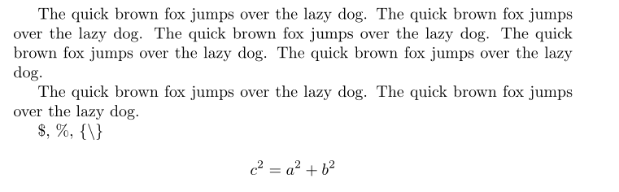

#### 2.3 LaTeX文档结构

文档的结构基本就是如下图所示的这几部分构成（其中蓝框中这俩一般只用在book中）


一个简单的例子如下：

``` tex
\documentclass{book}     % book, report, letter
\usepackage{amsmath}
% 导言区
\begin{document}
  % 正文区
  \title{This is my book}
  
  \author{tom jerry}
  
  \date{}	% 这句话使得日期不会默认出现了
  
  \maketitle
  
  \tableofcontents  % 生成文档的目录，此命令会生成  `文档名.toc`文件，就记录了目录的信息（编译两次生效）
  
  \mainmatter   % 此后的内容才是正文部分，生成目录页码时有用（编译两次生效）
  
  \part{elementary}
  
  \chapter{introduction}

  \section{first sec}
    123456

  \section{second sec}
    9999
  
  \chapter{chapter2}
  
  888888
  
  \chapter{summary}
  
  summary.summarysummarysummary
  
  The quick brown fox jumps over the lazy dog.  The quick brown fox jumps over the lazy dog.  The quick brown fox jumps over the lazy dog.  The quick brown fox jumps over the lazy dog.
  The quick brown fox jumps over the lazy dog. The quick brown fox jumps over the lazy dog.  The quick brown fox jumps over the lazy dog.  The quick brown fox jumps over the lazy dog.
  The quick brown fox jumps over the lazy dog. The quick brown fox jumps over the lazy dog.  The quick brown fox jumps over the lazy dog.  The quick brown fox jumps over the lazy dog.
  The quick brown fox jumps over the lazy dog. The quick brown fox jumps over the lazy dog.  The quick brown fox jumps over the lazy dog.  The quick brown fox jumps over the lazy dog.
  The quick brown fox jumps over the lazy dog. The quick brown fox jumps over the lazy dog.  The quick brown fox jumps over the lazy dog.  The quick brown fox jumps over the lazy dog.
  The quick brown fox jumps over the lazy dog. The quick brown fox jumps over the lazy dog.  The quick brown fox jumps over the lazy dog.  The quick brown fox jumps over the lazy dog.
  The quick brown fox jumps over the lazy dog.

    \part{advance}
    
  The quick brown fox jumps over the lazy dog.
  
  The quick brown fox jumps over the lazy dog.

  \$, \%, \{$\backslash$\}

  $$ c^2 = a^2 + b^2$$

\end{document}
% end 之后的内容不参与编译
```

查看该文档的文档树可以清晰地看到文档的结构。每次编辑文档后，想要正确显示文档树都需要点击`build tree`来更新文档树。

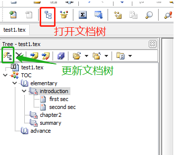

#### 2.4 LaTeX列表和表格

在这里快速生成列表：

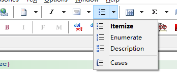

``` tex
\begin{itemize}
    \item 	% 默认生成的格式，注意这些星号一定要删掉
    \item 
    \item   
\end{itemize}
```

- 列表都可以嵌套：

``` tex
        \begin{itemize}	 % 无序号列表
          \item this is item 1
          \item that is item 2
          \item iiiiitem3
               \begin{enumerate} % 有序号列表
                  \item enumerate1 of item4 
                  \item enumerate2 of item4
                  \item enumerate3 of item4 
                  \item \begin{description}
                          \item[111] des1
                          \item[aa] des2
                          \item[3] des3
                        \end{description}
                \end{enumerate}
        \end{itemize}
```

- 对`enumerate` 有序号列表进行序号格式修改:

``` tex
...
\usepackage{enumerate}	% 使用此宏包
\begin{document}
...
        \begin{enumerate}[\bfseries A.]	% 修改为A. ,B. ,C. 的格式，\bfseries 使之为粗体
          \item EEE
          \item RRR
          \begin{enumerate}[a]	% 修改为a,b,c 的格式，没有点.
            \item tt
            \item yy
            \item uu
          \end{enumerate}
          \item TTT
        \end{enumerate}
```

- 修改`enumerate` 有序号列表开始的序号：

``` tex
 \begin{enumerate}[\bfseries A.]
        \setcounter{enumi}{4}	% 设定一个计数器，使之从第5个序号开始而不是A开始，
          \item EEE
```

- 之后是**表格**，下面是一个简单例子，显示结果如下图：

``` tex
        \begin{tabular}{|c|lr|} % 首先定义对齐方式，c居中对齐，l左对齐，r右对齐，而且第一个写的c就指定了第一列的对齐方式，后面以此类推，对齐方式之间的竖线就指定了两列之间的竖线
        \hline  % 在该位置加上一条横线
        1&22222&3\\     % 两个反斜杠在正文部分表示回车，在表格中表示两行的分割
        \hline  % 在该位置加上一条横线
        1&4&9\\
        1111&8&2222227 \\ % 最后不加横线的话最后一行最后的两个反斜杠可以不写
        \hline  % 在该位置加上一条横线
        
        \end{tabular}
```

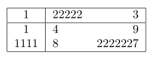

- 将excel中的表格直接转化为 tex 代码：

将excel中的表格复制，粘贴到记事本中，将`tab` 全部替换为` & `，并且在每一行最后加上 `\\`，然后把这些内容粘贴到`\begin{tabular}`之中即可

- 更高级的表格table

使用table会自动对表格生成表号，显示结果如下图（如果table太长一页放不下，就需要使用宏包longtable，不赘述）。

``` tex
\begin{table}
  \centering  % 表示对此环境中所有对象都居中
  \begin{tabular}{ccccc}
    \hline
    brand & type & price & card \\
    \hline
    \multicolumn{2}{c}{ MM e33} & 500 & 32g\\     % multicolumn 合并单元格(行)，后跟三个参数 {合并单元格数}{此单元格对齐方式}{ 此单元格内容 } , 同理还有multirow合并单元格(列)，不赘述了
    \hline
    MT & e4 & 200 & 32g\\
    DF & e5 & 8000 & 32g\\
    \cline{3-3} % 单独给某个单元格加上下划线
    TY & e33 & 7000 & 32g\\
    \cline{3-4}
    HM & e2 & 200 & 32g\\
    \hline
    \end{tabular}
  \caption{this is the name of the table }  % \label{}  % label对于超链接等内容会十分利于检索
\end{table}
```

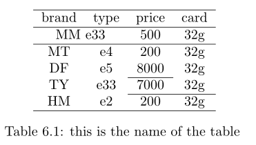

#### 2.5 LaTeX数学公式

- `$ 行内公式 $`，`$$ 行间公式 $$`，例：

``` tex
	The quick brown fox jumps over the lazy dog.$ c^2 = a^2 + b^2 $ The quick brown fox jumps over the lazy dog.The quick brown fox jumps over the lazy dog.The quick brown fox jumps over the lazy dog.The quick brown fox jumps over the lazy dog.The quick brown fox jumps over the lazy dog.$\frac{{-b \pm \sqrt {{b^2} -4ac} }} {{2a}} $The quick brown fox jumps over the lazy dog.The quick brown fox jumps over the lazy dog.The quick brown fox jumps over the lazy dog.The quick brown fox jumps over the lazy dog.

    $$\frac{{-b \pm \sqrt {{b^2} -4ac} }} {{2a}} $$

    The quick brown fox jumps over the lazy dog.The quick brown fox jumps over the lazy dog.The quick brown fox jumps over the lazy dog.The quick brown fox jumps over the lazy dog.The quick brown fox jumps over the lazy dog.The quick brown fox jumps over the lazy dog.The quick brown fox jumps over the lazy dog.The quick brown fox jumps over the lazy dog.
```

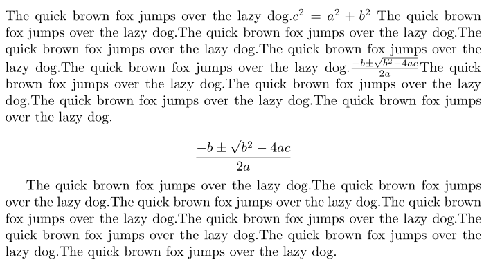

- 特殊符号的输入

使用工具栏第二排第5个工具`TeX GUI Symbol`可快捷输入，包括**数学符号，希腊字母，数学公式，花体字母等等**。也可以从mathType中复制数学公式到tex中，自己搜吧。

``` tex
    $$\frac{{-b \pm \sqrt {{b^2} -4ac} }} {{2a}} $$

    $$ \sum {\Gamma} \prod {b} \oint {c}{d} \hat{e} \breve{f} \widetilde{hi} \sqrt{jk} \frac{lm}{n} \mathcal{_{opq}}$$

    $$ \nabla \ell \forall \neg \Im \diamondsuit \heartsuit \spadesuit  \S \pounds    $$
```

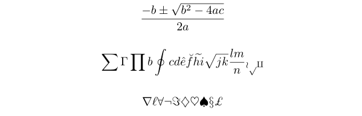

- [Latex公式字母加粗](https://www.cnblogs.com/yqs-cedarmo/p/9792114.html)

在Latex中，公式字母加粗用语法：\boldsymbol{待添加的字母}

- 公式的编号

``` tex
\begin{equation}  % \label{} label是方便文档其他位置引用的
  \numberwithin{equation}{section}  % 使公式按照节进行编号
  \frac{{-b \pm \sqrt {{b^2} -4ac} }} {{2a}} 
\end{equation}
```

写在 `\begin{equation}`中的公式就会自动编号，此时的公式就不要用 `$$  $$`包括起来了。

- 对同等重要公式的编号，注意看结果图编号。

``` tex
\begin{subequations}
    \begin{equation}  % \label{} label是方便文档其他位置引用的 
      \frac{{-b \pm \sqrt {{b^2} -4ac} }} {{2a}}
    \end{equation}

    \begin{equation}  % \label{} label是方便文档其他位置引用的
      \frac{{-b \pm \sqrt {{b^2} -4ac} }} {{2a}}
    \end{equation}
\end{subequations}

  \section{second sec}

\begin{equation}  % \label{} label是方便文档其他位置引用的
  \frac{{-b \pm \sqrt {{b^2} -4ac} }} {{2a}}
\end{equation}

\begin{equation}  % \label{} label是方便文档其他位置引用的
  \frac{{-b \pm \sqrt {{b^2} -4ac} }} {{2a}}
\end{equation}
```

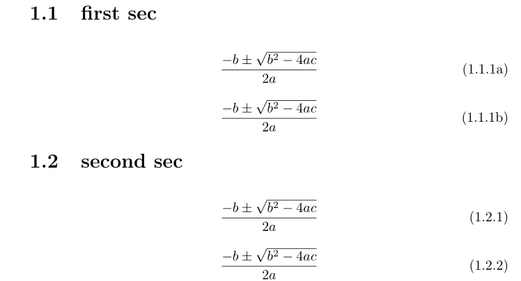

- 对太长的命令进行替换，（就像C的宏替换）

``` tex
\newcommand{\fc}{\frac}  % 该分数命令简化
  
\begin{equation}\boxed{ % boxed 对公式加个框强调
  \fc{c^2}{2} = a^2 + b^2}
\end{equation}
```

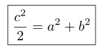

- 把一整个当作一个算子

``` tex
\begin{equation} 
  \sum^5_{i=1}i*(i-1)  % \sum 就是一个operater 算子
\end{equation}

\begin{equation}
    cos^n_{i=1}
\end{equation}

\begin{equation}
   \mathop{{cos}}^n_{i=1}  % \mathop 将后面一整个当作一个算子
\end{equation}
```

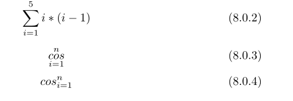

- 将括号自动变长：

如此例，在结果中可以看到括号太短了，影响美观。

``` tex
\begin{equation}  
  \lim_{n\to\infty} (1+ \frac{1}{n})^n = e
\end{equation}
```

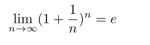

修改代码：

``` tex
\begin{equation} 
  \lim_{n\to\infty} \left(1+ \frac{1}{n}\right)^n = e % 用\left和\right来修饰括号
\end{equation}
```

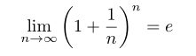

再看一例：

```tex
\begin{equation}
  \frac{\partial y}{\partial x} | ^{y_l=4}_{y_l=1}
\end{equation}

\begin{equation}
  \left.\frac{\partial y}{\partial x} \right| ^{y_l=4}_{y_l=1}
\end{equation}
```

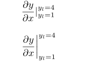

- 矩阵（代码格式很像tabular）

``` tex
\begin{equation} 
    \left[  % 在左边加上 [
    \begin{array}{c|l|r}  % 矩阵属于数学公式，必须写在\begin{equation} 中 或者 $$  $$ 中
        1111 & 222 & 3 \\
        \hline
        4 & 55555 & 666666\\
        \hline
        777 & 8 & 99\\
    \end{array}
    \right) % 在右边加上 )
\end{equation}
```

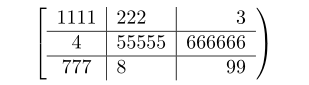

一些加强的矩阵：

``` tex
% 需要 amsmath 宏包，好用的矩阵输入如 bmatrix, Bmatrix, pmatrix,vmatrix, Vmatrix（它们都默认居中对齐）
$$
\begin{bmatrix}
    1111 & 222 & 3 \\
    4 & 55555 & 666666\\
    777 & 8 & 99\\
\end{bmatrix}
$$
$$
\begin{Bmatrix}
    1111 & 222 & 3 \\
    4 & 55555 & 666666\\
    777 & 8 & 99\\
\end{Bmatrix}
$$
```

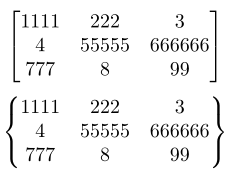

- 长公式的换行对齐显示

``` tex
$ z=(a+b)^4=(a+b)^2(a+b)^2=(a^2+2ab+b^2)(a^2+2ab+b^2)=a^4+4a^3b+6a^2b^2+4ab^3+b^4 $

\begin{equation}
  \begin{split}
    z&=(a+b)^4=(a+b)^2(a+b)^2\\
    &=(a^2+2ab+b^2)(a^2+2ab+b^2)\\
    &=a^4+4a^3b+6a^2b^2+4ab^3+b^4
  \end{split}
\end{equation}

% 使用align每行有一个编号
\begin{align} 
    z&=(a+b)^4=(a+b)^2(a+b)^2\\
    &=(a^2+2ab+b^2)(a^2+2ab+b^2)\\
    &=a^4+4a^3b+6a^2b^2+4ab^3+b^4
\end{align}

\begin{align} 
    z&=(a+b)^4=(a+b)^2(a+b)^2\nonumber\\ % 取消某一行的编号
    &=(a^2+2ab+b^2)(a^2+2ab+b^2)\\
    &=a^4+4a^3b+6a^2b^2+4ab^3+b^4
\end{align}
```

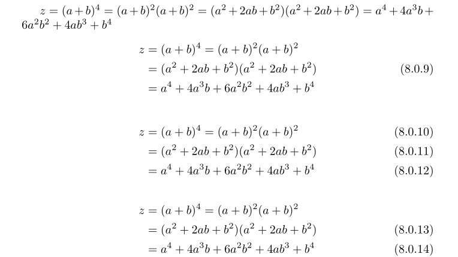

还有一种方法可以加大等号左右的空白：

``` tex
\begin{eqnarray}
    z&=&(a+b)^4=(a+b)^2(a+b)^2\\
    z&=&(a^2+2ab+b^2)(a^2+2ab+b^2)\\
    z&=&a^4+4a^3b+6a^2b^2+4ab^3+b^4
\end{eqnarray}
```

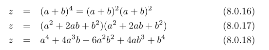

- 多个公式共用一个编号：

``` tex
 \begin{equation} 
   \begin{gathered} 
    z=(a+b)^4=(a+b)^2(a+b)^2\\
    z=(a^2+2ab+b^2)(a^2+2ab+b^2)\\
    z=a^4+4a^3b+6a^2b^2+4ab^3+b^4
   \end{gathered}
 \end{equation}
```

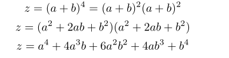

- 类分段函数的tex表达 

``` tex
% 需要amsmath宏包
$$
    f_n(x) = \begin{cases}
        1 & n \in A \\
        0 & n \not \in A
    \end{cases}
$$
```

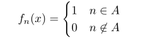

#### 2.6 LaTeX插入图片

首先需要引用宏包 ` \usepackage{graphicx}` 

``` tex
% 简单插入图片
\includegraphics{figure/AB_MPTCP.eps} % 只能插入 .eps 格式的图片
% .eps 格式图片的生成方式 :
% 通过软件，如matlab
% 通过acrobat pro制作（制作或提取pdf中的图片，提取本页，裁剪，保存为 xxx.eps）

\begin{figure}
  % Requires \usepackage{graphicx}
  \centering   % 将图片居中显示
  \includegraphics[scale=0.5,angle=90] {figure/AB_MPTCP.eps} % 中括号里还可以设置width(pt)等参数
  \caption{this is ABMPTCP}\label{ABMPTCP}
\end{figure}

this is figure \ref{ABMPTCP}
```

并列插入两张图片1

``` tex
\begin{figure*}[!ht]
    \centering
    \subfigure[RMSE]{
        \begin{minipage}[t]{0.3\linewidth}%并排放三张图片，每张占页面的0.5，下同。
            \centering
            \includegraphics[width=1\textwidth]{RMSE.eps}
        \end{minipage}
        %\label{rmse}
    }
    \subfigure[WAPE]{
        \begin{minipage}[t]{0.3\linewidth}%并排放三张图片，每张占页面的0.5，下同。
            \centering
            \includegraphics[width=1\textwidth]{WAPE.eps}
        \end{minipage}
        %\label{wape}
    }
    \subfigure[MAE]{
        \begin{minipage}[t]{0.305\linewidth}% 并排放三张图片，每张占页面的0.5，下同。
            \centering
            \includegraphics[width=1\textwidth]{MAE.eps}
        \end{minipage}
        %\label{wae}
    }
    \caption{Comparison of RMSE, WAPE, and MAE of various predict algorithms }
    \label{rwm} % rmse  wape  mae
\end{figure*}
```

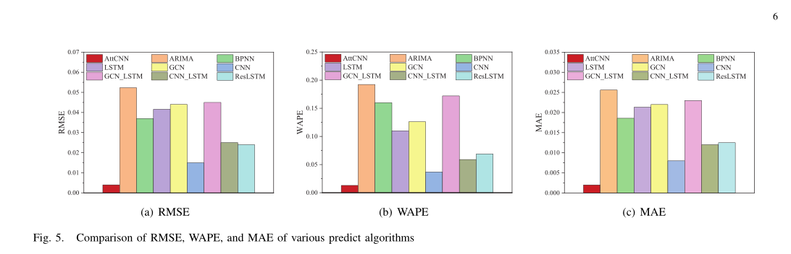

并列插入两张图片2

如果是两张不相关的图片，不想以子图的方式存在

**figure后有*就是跨栏，没有就不跨栏**

[(2条消息) LATEX——两张图并列排列/双栏模板中图片通栏并列布局_latex双栏图片_nccccc12345的博客-CSDN博客](https://blog.csdn.net/nccccc12345/article/details/115095292)

```tex
\begin{figure*}[htbp]
    \centering
    \begin{minipage}[t]{0.64\linewidth}
        \centering
        \includegraphics[width=1\textwidth]{zhexiantu.eps}
        \label{zxt}
        \caption{Comparison of various algorithms for MLU reduction}
    \end{minipage}
    \begin{minipage}[t]{0.32\linewidth}
        \centering
        \includegraphics[width=1\textwidth]{cdf.eps}
        \caption{Comparison of cumulative distribution functions of MLU}
        \label{cdf}
    \end{minipage}
\end{figure*}

```


#### 2.7 LaTeX数学定理

[9-数学定理的设置【哔哩哔哩_bilibili 】](https://www.bilibili.com/video/BV1ua4y1p7eR?p=9&vd_source=b223a33d3e538f8afa1020f731ad95a0)

#### 2.8 引用

``` tex
~\cite{xxx}		 % [x]放在右上角
~\onlinecite{xxx}	% [x]和文本一样大
```

