Linux 命令大全 | 菜鸟教程 (runoob.com)](https://www.runoob.com/linux/linux-command-manual.html)

[【linux】最常用 150 个Linux命令汇总 - 腾讯云开发者社区-腾讯云 (tencent.com)](https://cloud.tencent.com/developer/article/1540697)

# 1. Linux 系统启动过程

- **内核的引导**

当计算机打开电源后，首先是BIOS开机自检，按照BIOS中设置的启动设备（通常是硬盘）来启动。

操作系统接管硬件以后，首先读入 /boot 目录下的内核文件。


- **运行init**

>  init程序的类型：
>
> - **SysV:** init, CentOS 5之前, 配置文件： /etc/inittab。
> - **Upstart:** init,CentOS 6, 配置文件： /etc/inittab, /etc/init/*.conf。
> - **Systemd：** systemd, CentOS 7,配置文件： /usr/lib/systemd/system、 /etc/systemd/system。

init 进程是系统所有进程的起点，你可以把它比拟成系统所有进程的老祖宗，没有这个进程，系统中任何进程都不会启动。

init 程序首先是需要读取配置文件 /etc/inittab。


许多程序需要开机启动。它们在Windows叫做"服务"（service），在Linux就叫做"守护进程"（daemon）。

init进程的一大任务，就是去运行这些开机启动的程序。

但是，不同的场合需要启动不同的程序，比如用作服务器时，需要启动Apache，用作桌面就不需要。

Linux允许为不同的场合，分配不同的开机启动程序，这就叫做"运行级别"（runlevel）。也就是说，启动时根据"运行级别"，确定要运行哪些程序。


> Linux系统有7个运行级别(runlevel)：
>
> - 运行级别0：系统停机状态，系统默认运行级别不能设为0，否则不能正常启动
> - 运行级别1：单用户工作状态，root权限，用于系统维护，禁止远程登陆
> - 运行级别2：多用户状态(没有NFS)
> - 运行级别3：完全的多用户状态(有NFS)，登陆后进入控制台命令行模式
> - 运行级别4：系统未使用，保留
> - 运行级别5：X11控制台，登陆后进入图形GUI模式
> - 运行级别6：系统正常关闭并重启，默认运行级别不能设为6，否则不能正常启动

- **系统初始化**

在init的配置文件中有这么一行： si::sysinit:/etc/rc.d/rc.sysinit　它调用执行了/etc/rc.d/rc.sysinit，而rc.sysinit是一个bash shell的脚本，它主要是完成一些系统初始化的工作，rc.sysinit是每一个运行级别都要首先运行的重要脚本。

它主要完成的工作有：激活交换分区，检查磁盘，加载硬件模块以及其它一些需要优先执行任务。

```
l5:5:wait:/etc/rc.d/rc 5
```

这一行表示以5为参数运行/etc/rc.d/rc，/etc/rc.d/rc是一个Shell脚本，它接受5作为参数，去执行/etc/rc.d/rc5.d/目录下的所有的rc启动脚本，/etc/rc.d/rc5.d/目录中的这些启动脚本实际上都是一些连接文件，而不是真正的rc启动脚本，真正的rc启动脚本实际上都是放在/etc/rc.d/init.d/目录下。

而这些rc启动脚本有着类似的用法，它们一般能接受start、stop、restart、status等参数。

/etc/rc.d/rc5.d/中的rc启动脚本通常是K或S开头的连接文件，对于以 S 开头的启动脚本，将以start参数来运行。

而如果发现存在相应的脚本也存在K打头的连接，而且已经处于运行态了(以/var/lock/subsys/下的文件作为标志)，则将首先以stop为参数停止这些已经启动了的守护进程，然后再重新运行。

这样做是为了保证是当init改变运行级别时，所有相关的守护进程都将重启。

至于在每个运行级中将运行哪些守护进程，用户可以通过chkconfig或setup中的"System Services"来自行设定。

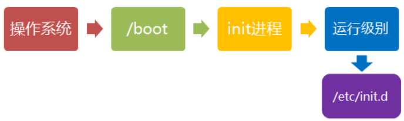

- **建立终端**

rc执行完毕后，返回init。这时基本系统环境已经设置好了，各种守护进程也已经启动了。

init接下来会打开6个终端，以便用户登录系统。在inittab中的以下6行就是定义了6个终端：

```
1:2345:respawn:/sbin/mingetty tty1
2:2345:respawn:/sbin/mingetty tty2
3:2345:respawn:/sbin/mingetty tty3
4:2345:respawn:/sbin/mingetty tty4
5:2345:respawn:/sbin/mingetty tty5
6:2345:respawn:/sbin/mingetty tty6
```
从上面可以看出在2、3、4、5的运行级别中都将以respawn方式运行mingetty程序，mingetty程序能打开终端、设置模式。

同时它会显示一个文本登录界面，这个界面就是我们经常看到的登录界面，在这个登录界面中会提示用户输入用户名，而用户输入的用户将作为参数传给login程序来验证用户的身份。
- **用户登录系统**

一般来说，用户的登录方式有三种：

- （1）命令行登录
- （2）ssh登录
- （3）图形界面登录

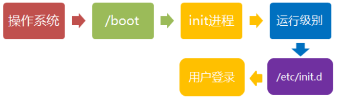

对于运行级别为5的图形方式用户来说，他们的登录是通过一个图形化的登录界面。登录成功后可以直接进入 KDE、Gnome 等窗口管理器。

而本文主要讲的还是文本方式登录的情况：当我们看到mingetty的登录界面时，我们就可以输入用户名和密码来登录系统了。

Linux 的账号验证程序是 login，login 会接收 mingetty 传来的用户名作为用户名参数。

然后 login 会对用户名进行分析：如果用户名不是 root，且存在 /etc/nologin 文件，login 将输出 nologin 文件的内容，然后退出。

这通常用来系统维护时防止非root用户登录。只有/etc/securetty中登记了的终端才允许 root 用户登录，如果不存在这个文件，则 root 用户可以在任何终端上登录。

/etc/usertty文件用于对用户作出附加访问限制，如果不存在这个文件，则没有其他限制。

### Linux的发行版

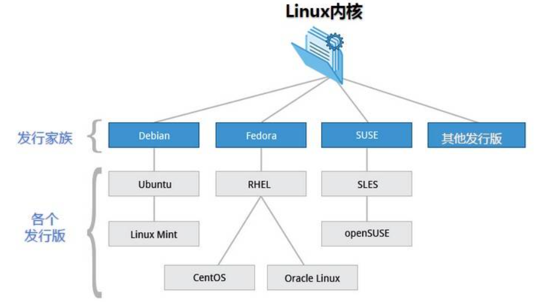

### Linux 关机

在linux领域内大多用在服务器上，很少遇到关机的操作。毕竟服务器上跑一个服务是永无止境的，除非特殊情况下，不得已才会关机。

正确的关机流程为：`sync > shutdown > reboot > halt`

关机指令为：`shutdown `，你可以`man shutdown `来看一下帮助文档。

例如你可以运行如下命令关机：

```bash
sync 将数据由内存同步到硬盘中。
shutdown 关机指令，你可以man shutdown 来看一下帮助文档。例如你可以运行如下命令关机：
shutdown –h 10 ‘This server will shutdown after 10 mins’ 这个命令告诉大家，计算机将在10分钟后关机，并且会显示在登陆用户的当前屏幕中。
shutdown –h now 立马关机
shutdown –h 20:25 系统会在今天20:25关机
shutdown –h +10 十分钟后关机
shutdown –r now 系统立马重启
shutdown –r +10 系统十分钟后重启
reboot 就是重启，等同于 shutdown –r now
halt 关闭系统，等同于shutdown –h now 和 poweroff
```

最后总结一下，不管是重启系统还是关闭系统，首先要运行 **sync** 命令，把内存中的数据写到磁盘中。

关机的命令有 **shutdown –h now halt poweroff** 和 **init 0** , 重启系统的命令有 **shutdown –r now reboot init 6**。

# 2. Linux 系统目录结构

登录系统后，在当前命令窗口下输入命令：

```bash
 ls / 
```

你会看到如下图所示:


树状目录结构:

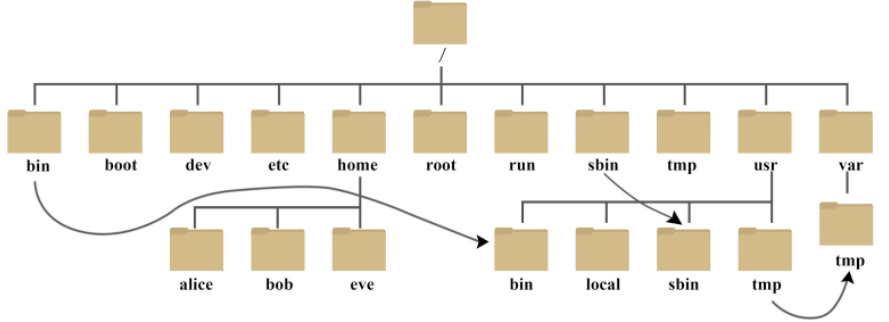

以下是对这些目录的解释：

``` shell
/dev        设备文件
/etc        大多数配置文件
/home       普通用户的家目录
/lib        32位函数库
/lib64      64位库
/media      手动临时挂载点
/mnt        手动临时挂载点
/opt        第三方软件安装位置
/proc       进程信息及硬件信息
/root       临时设备的默认挂载点
/sbin       系统管理命令
/srv        数据
/var        数据
/sys        内核相关信息
/tmp        临时文件
/usr        并不是user的缩写，而是 Unix System Resources的首字母
```

- **/bin**：
  bin 是 Binaries (二进制文件) 的缩写, 这个目录存放着最经常使用的命令。

- **/boot：**
  这里存放的是启动 Linux 时使用的一些核心文件，包括一些连接文件以及镜像文件。

- **/dev ：**
  dev 是 Device(设备) 的缩写, 该目录下存放的是 Linux 的外部设备，在 Linux 中访问设备的方式和访问文件的方式是相同的。

- **/etc：**
  etc 是 Etcetera(等等) 的缩写,这个目录用来存放所有的系统管理所需要的配置文件和子目录。

- **/home**：
  用户的主目录，在 Linux 中，每个用户都有一个自己的目录，一般该目录名是以用户的账号命名的，如上图中的 alice、bob 和 eve。

- **/lib**：
  lib 是 Library(库) 的缩写这个目录里存放着系统最基本的动态连接共享库，其作用类似于 Windows 里的 DLL 文件。几乎所有的应用程序都需要用到这些共享库。

- **/lost+found**：
  这个目录一般情况下是空的，当系统非法关机后，这里就存放了一些文件。

- **/media**：
  linux 系统会自动识别一些设备，例如U盘、光驱等等，当识别后，Linux 会把识别的设备挂载到这个目录下。

- **/mnt**：
  系统提供该目录是为了让用户临时挂载别的文件系统的，我们可以将光驱挂载在 /mnt/ 上，然后进入该目录就可以查看光驱里的内容了。

- **/opt**：
  opt 是 optional(可选) 的缩写，这是给主机额外安装软件所摆放的目录。比如你安装一个ORACLE数据库则就可以放到这个目录下。默认是空的。

- **/proc**：
  proc 是 Processes(进程) 的缩写，/proc 是一种伪文件系统（也即虚拟文件系统），存储的是当前内核运行状态的一系列特殊文件，这个目录是一个虚拟的目录，它是系统内存的映射，我们可以通过直接访问这个目录来获取系统信息。
  这个目录的内容不在硬盘上而是在内存里，我们也可以直接修改里面的某些文件，比如可以通过下面的命令来屏蔽主机的ping命令，使别人无法ping你的机器：

  ```bash
  echo 1 > /proc/sys/net/ipv4/icmp_echo_ignore_all
  ```

- **/root**：
  该目录为系统管理员，也称作超级权限者的用户主目录。

- **/sbin**：
  s 就是 Super User 的意思，是 Superuser Binaries (超级用户的二进制文件) 的缩写，这里存放的是系统管理员使用的系统管理程序。

- **/selinux**：
   这个目录是 Redhat/CentOS 所特有的目录，Selinux 是一个安全机制，类似于 windows 的防火墙，但是这套机制比较复杂，这个目录就是存放selinux相关的文件的。

- **/srv**：
   该目录存放一些服务启动之后需要提取的数据。

- **/sys**：

  这是 Linux2.6 内核的一个很大的变化。该目录下安装了 2.6 内核中新出现的一个文件系统 sysfs 。

  sysfs 文件系统集成了下面3种文件系统的信息：针对进程信息的 proc 文件系统、针对设备的 devfs 文件系统以及针对伪终端的 devpts 文件系统。

  该文件系统是内核设备树的一个直观反映。

  当一个内核对象被创建的时候，对应的文件和目录也在内核对象子系统中被创建。

- **/tmp**：
  tmp 是 temporary(临时) 的缩写这个目录是用来存放一些临时文件的。

- **/usr**：
   usr 是 unix shared resources(共享资源) 的缩写，这是一个非常重要的目录，用户的很多应用程序和文件都放在这个目录下，类似于 windows 下的 program files 目录。

   - **/usr/bin：**
       系统用户使用的应用程序。
   
   - **/usr/sbin：**
       超级用户使用的比较高级的管理程序和系统守护程序。
   
   - **/usr/src：**
       内核源代码默认的放置目录。
   - **/usr/lib：**
       其中的库文件是系统自带的或者使用apt等包管理器安装的，一般不建议手动修改。（优先级更高，与/usr/local/lib下的库同名时优先加载这里的。）
   - **/usr/local/lib：**
       其中的库文件是用户自己编译或者是使用pip等工具安装的一般用于存放用户自定义的库文件。
   
- **/var**：
  var 是 variable(变量) 的缩写，这个目录中存放着在不断扩充着的东西，我们习惯将那些经常被修改的目录放在这个目录下。包括各种日志文件。

- **/run**：
  是一个临时文件系统，存储系统启动以来的信息。当系统重启时，这个目录下的文件应该被删掉或清除。如果你的系统上有 /var/run 目录，应该让它指向 run。

在 Linux 系统中，有几个目录是比较重要的，平时需要注意不要误删除或者随意更改内部文件。

**/etc**： 上边也提到了，这个是系统中的配置文件，如果你更改了该目录下的某个文件可能会导致系统不能启动。

**/bin, /sbin, /usr/bin, /usr/sbin**: 这是系统预设的执行文件的放置目录，比如 **ls** 就是在 **/bin/ls** 目录下的。

值得提出的是 **/bin**、**/usr/bin** 是给系统用户使用的指令（除 root 外的通用用户），而/sbin, /usr/sbin 则是给 root 使用的指令。

**/var**： 这是一个非常重要的目录，系统上跑了很多程序，那么每个程序都会有相应的日志产生，而这些日志就被记录到这个目录下，具体在 /var/log 目录下，另外 mail 的预设放置也是在这里。

# 3. Linux 文件基本属性

Linux 系统是一种典型的多用户系统，不同的用户处于不同的地位，拥有不同的权限。

为了保护系统的安全性，Linux 系统对不同的用户访问同一文件（包括目录文件）的权限做了不同的规定。

在 Linux 中我们通常使用以下两个命令来修改文件或目录的所属用户与权限：

- chown (change owner) ： 修改所属用户与组。
- chmod (change mode) ： 修改用户的权限。

下图中通过 chown 来授权用户，通过 chmod 为用户设置可以开门的权限。


在 Linux 中我们可以使用 **ll** 或者 **ls –l** 命令来显示一个文件的属性以及文件所属的用户和组，如：

```
[root@www /]# ls -l
total 64
dr-xr-xr-x   2 root root 4096 Dec 14  2012 bin
dr-xr-xr-x   4 root root 4096 Apr 19  2012 boot
……
```

实例中，**bin** 文件的第一个属性用 **d** 表示。**d** 在 Linux 中代表该文件是一个目录文件。

在 Linux 中第一个字符代表这个文件是目录、文件或链接文件等等。

- 当为 **d** 则是目录
- 当为 **-** 则是文件；
- 若是 **l** 则表示为链接文档(link file)；
- 若是 **b** 则表示为装置文件里面的可供储存的接口设备(可随机存取装置)；
- 若是 **c** 则表示为装置文件里面的串行端口设备，例如键盘、鼠标(一次性读取装置)。

接下来的字符中，以三个为一组，且均为 **rwx** 的三个参数的组合。其中， **r** 代表可读(read)、 **w** 代表可写(write)、 **x** 代表可执行(execute)。 要注意的是，这三个权限的位置不会改变，如果没有权限，就会出现减号 **-** 而已。


每个文件的属性由左边第一部分的 10 个字符来确定（如下图）。


从左至右用 **0-9** 这些数字来表示。

第 **0** 位确定文件类型，第 **1-3** 位确定属主（该文件的所有者）拥有该文件的权限。

第4-6位确定属组（所有者的同组用户）拥有该文件的权限，第7-9位确定其他用户拥有该文件的权限。


其中，第 **1、4、7** 位表示读权限，如果用 **r** 字符表示，则有读权限，如果用 **-** 字符表示，则没有读权限；

第 **2、5、8** 位表示写权限，如果用 **w** 字符表示，则有写权限，如果用 **-** 字符表示没有写权限；第 **3、6、9** 位表示可执行权限，如果用 **x** 字符表示，则有执行权限，如果用 **-** 字符表示，则没有执行权限。

------

## Linux文件属主和属组

```bash
[root@www /]# ls -l
total 64
drwxr-xr-x 2 root  root  4096 Feb 15 14:46 cron
drwxr-xr-x 3 mysql mysql 4096 Apr 21  2014 mysql
……
```

对于文件来说，它都有一个特定的所有者，也就是对该文件具有所有权的用户。

同时，在Linux系统中，用户是按组分类的，一个用户属于一个或多个组。

文件所有者以外的用户又可以分为文件所属组的同组用户和其他用户。

因此，Linux系统按文件所有者、文件所有者同组用户和其他用户来规定了不同的文件访问权限。

在以上实例中，mysql 文件是一个目录文件，属主和属组都为 mysql，属主有可读、可写、可执行的权限；与属主同组的其他用户有可读和可执行的权限；其他用户也有可读和可执行的权限。

对于 root 用户来说，一般情况下，文件的权限对其不起作用。

------

## 更改文件属性

### 1、chgrp：更改文件属组

语法：

```bash
chgrp [-R] 属组名 文件名
```

参数选项

- -R：递归更改文件属组，就是在更改某个目录文件的属组时，如果加上-R的参数，那么该目录下的所有文件的属组都会更改。

### 2、chown：更改文件属主，也可以同时更改文件属组

语法：

```bash
chown [–R] 属主名 文件名
chown [-R] 属主名：属组名 文件名
```

进入 /root 目录（~）将install.log的拥有者改为bin这个账号：

```bash
[root@www ~] cd ~
[root@www ~]# chown bin install.log
[root@www ~]# ls -l
-rw-r--r--  1 bin  users 68495 Jun 25 08:53 install.log
```

将install.log的拥有者与群组改回为root：

```bash
[root@www ~]# chown root:root install.log
[root@www ~]# ls -l
-rw-r--r--  1 root root 68495 Jun 25 08:53 install.log
```

### 3、chmod：更改文件9个属性

Linux文件属性有两种设置方法，一种是数字，一种是符号。

Linux 文件的基本权限就有九个，分别是 **owner/group/others(拥有者/组/其他)** 三种身份各有自己的 **read/write/execute** 权限。

先复习一下刚刚上面提到的数据：文件的权限字符为： **-rwxrwxrwx** ， 这九个权限是三个三个一组的！其中，我们可以使用数字来代表各个权限，各权限的分数对照表如下：

- r:4
- w:2
- x:1

每种身份(owner/group/others)各自的三个权限(r/w/x)分数是需要累加的，例如当权限为： **-rwxrwx---** 分数则是：

- owner = rwx = 4+2+1 = 7
- group = rwx = 4+2+1 = 7
- others= --- = 0+0+0 = 0

所以等一下我们设定权限的变更时，该文件的权限数字就是 **770**。变更权限的指令 chmod 的语法是这样的：

```
 chmod [-R] xyz 文件或目录
```

选项与参数：

- **xyz** : 就是刚刚提到的数字类型的权限属性，为 **rwx** 属性数值的相加。
- **-R** : 进行递归(recursive)的持续变更，以及连同次目录下的所有文件都会变更

举例来说，如果要将 **.bashrc** 这个文件所有的权限都设定启用，那么命令如下：

```bash
[root@www ~]# ls -al .bashrc
-rw-r--r--  1 root root 395 Jul  4 11:45 .bashrc
[root@www ~]# chmod 777 .bashrc
[root@www ~]# ls -al .bashrc
-rwxrwxrwx  1 root root 395 Jul  4 11:45 .bashrc
```

那如果要将权限变成 *-rwxr-xr--* 呢？那么权限的分数就成为 [4+2+1][4+0+1][4+0+0]=754。

### 符号类型改变文件权限

还有一个改变权限的方法，从之前的介绍中我们可以发现，基本上就九个权限分别是：

- user：用户
- group：组
- others：其他

那么我们就可以使用 **u, g, o** 来代表三种身份的权限。

此外， **a** 则代表 **all**，即全部的身份。读写的权限可以写成 **r, w, x**，也就是可以使用下表的方式来看：

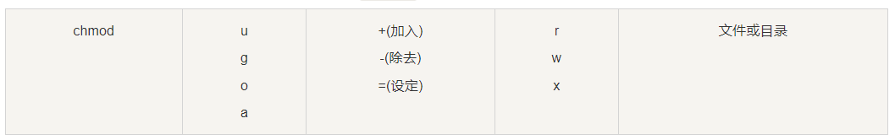

如果我们需要将文件权限设置为 **-rwxr-xr--** ，可以使用 **chmod u=rwx,g=rx,o=r 文件名** 来设定:

```bash
#  touch test1    // 创建 test1 文件
# ls -al test1    // 查看 test1 默认权限
-rw-r--r-- 1 root root 0 Nov 15 10:32 test1
# chmod u=rwx,g=rx,o=r  test1    // 修改 test1 权限
# ls -al test1
-rwxr-xr-- 1 root root 0 Nov 15 10:32 test1
```

而如果是要将权限去掉而不改变其他已存在的权限呢？例如要拿掉全部人的可执行权限，则：

```bash
#  chmod  a-x test1
# ls -al test1
-rw-r--r-- 1 root root 0 Nov 15 10:32 test1
```

# 4. Linux 文件与目录管理

我们知道Linux的目录结构为树状结构，最顶级的目录为根目录 /。

其他目录通过挂载可以将它们添加到树中，通过解除挂载可以移除它们。

在开始本教程前我们需要先知道什么是绝对路径与相对路径。

- **绝对路径：**
  路径的写法，由根目录 **/** 写起，例如： /usr/share/doc 这个目录。

- **相对路径：**
路径的写法，不是由 **/** 写起，例如由 /usr/share/doc 要到 /usr/share/man 底下时，可以写成： **cd ../man** 这就是相对路径的写法。

------

## 处理目录的常用命令

接下来我们就来看几个常见的处理目录的命令吧：

- ls（英文全拼：list files）: 列出目录及文件名
- cd（英文全拼：change directory）：切换目录
- pwd（英文全拼：print work directory）：显示目前的目录
- mkdir（英文全拼：make directory）：创建一个新的目录
- rmdir（英文全拼：remove directory）：删除一个**空的**目录
- cp（英文全拼：copy file）: 复制文件或目录
- rm（英文全拼：remove）: 删除文件或目录
- mv（英文全拼：move file）: 移动文件与目录，或修改文件与目录的名称

你可以使用 *man [命令]* 来查看各个命令的使用文档，如 ：man cp。

### ls (列出目录)

在Linux系统当中， ls 命令可能是最常被运行的。

语法：

```bash
[root@www ~]# ls [-aAdfFhilnrRSt] 目录名称
[root@www ~]# ls [--color={never,auto,always}] 目录名称
[root@www ~]# ls [--full-time] 目录名称
```

选项与参数：

- -a ：全部的文件，连同隐藏文件( 开头为 . 的文件) 一起列出来(常用)
- -d ：仅列出目录本身，而不是列出目录内的文件数据 (常用)
- -l ：长数据串列出，包含文件的属性与权限等等数据；(常用)

将家目录下的所有文件列出来(含属性与隐藏档)

```bash
[root@www ~]# ls -al ~
```

### cd (切换目录)

cd是Change Directory的缩写，这是用来变换工作目录的命令。

语法：

```bash
 cd [相对路径或绝对路径]
#使用 mkdir 命令创建 runoob 目录
[root@www ~]# mkdir runoob

#使用绝对路径切换到 runoob 目录
[root@www ~]# cd /root/runoob/

#使用相对路径切换到 runoob 目录
[root@www ~]# cd ./runoob/

# 表示回到自己的家目录，亦即是 /root 这个目录
[root@www runoob]# cd ~

# 表示去到目前的上一级目录，亦即是 /root 的上一级目录的意思；
[root@www ~]# cd ..
```

### pwd (显示目前所在的目录)

pwd 是 **Print Working Directory** 的缩写，也就是显示目前所在目录的命令。

```bash
[root@www ~]# pwd [-P]
```

选项与参数：

- **-P** ：显示出确实的路径，而非使用连结 (link) 路径。

实例：单纯显示出目前的工作目录：

```bash
[root@www ~]# pwd
/root   <== 显示出目录啦～
```

实例显示出实际的工作目录，而非连结档本身的目录名而已。

```bash
[root@www ~]# cd /var/mail   <==注意，/var/mail是一个连结档
[root@www mail]# pwd
/var/mail         <==列出目前的工作目录
[root@www mail]# pwd -P
/var/spool/mail   <==怎么回事？有没有加 -P 差很多～
[root@www mail]# ls -ld /var/mail
lrwxrwxrwx 1 root root 10 Sep  4 17:54 /var/mail -> spool/mail
# 看到这里应该知道为啥了吧？因为 /var/mail 是连结档，连结到 /var/spool/mail 
# 所以，加上 pwd -P 的选项后，会不以连结档的数据显示，而是显示正确的完整路径啊！
```

### mkdir (创建新目录)

如果想要创建新的目录的话，那么就使用mkdir (make directory)吧。

语法：

```bash
mkdir [-mp] 目录名称
```

选项与参数：

- **-m ：配置文件的权限喔！直接配置，不需要看默认权限 (umask) 的脸色～**
- **-p ：帮助你直接将所需要的目录(包含上一级目录)递归创建起来！**

实例：请到/tmp底下尝试创建数个新目录看看：

```bash
[root@www ~]# cd /tmp
[root@www tmp]# mkdir test    <==创建一名为 test 的新目录
[root@www tmp]# mkdir test1/test2/test3/test4
mkdir: cannot create directory `test1/test2/test3/test4': 
No such file or directory       <== 没办法直接创建此目录啊！
[root@www tmp]# mkdir -p test1/test2/test3/test4
```

加了这个 -p 的选项，可以自行帮你创建多层目录！

实例：创建权限为 **rwx--x--x** 的目录。

```bash
[root@www tmp]# mkdir -m 711 test2
[root@www tmp]# ls -l
drwxr-xr-x  3 root  root 4096 Jul 18 12:50 test
drwxr-xr-x  3 root  root 4096 Jul 18 12:53 test1
drwx--x--x  2 root  root 4096 Jul 18 12:54 test2
```

上面的权限部分，如果没有加上 -m 来强制配置属性，系统会使用默认属性。

如果我们使用 -m ，如上例我们给予 -m 711 来给予新的目录` drwx--x--x` 的权限。

### rmdir (删除空的目录)

语法：

```bash
 rmdir [-p] 目录名称
```

选项与参数：

- **-p ：**从该目录起，一次删除**多级空目录**

删除 runoob 目录

```bash
[root@www tmp]# rmdir runoob/
```

将 mkdir 实例中创建的目录(/tmp 底下)删除掉！

```bash
[root@www tmp]# ls -l   <==看看有多少目录存在？
drwxr-xr-x  3 root  root 4096 Jul 18 12:50 test
drwxr-xr-x  3 root  root 4096 Jul 18 12:53 test1
drwx--x--x  2 root  root 4096 Jul 18 12:54 test2
[root@www tmp]# rmdir test   <==可直接删除掉，没问题
[root@www tmp]# rmdir test1  <==因为尚有内容，所以无法删除！
rmdir: `test1': Directory not empty
[root@www tmp]# rmdir -p test1/test2/test3/test4
[root@www tmp]# ls -l        <==您看看，底下的输出中test与test1不见了！
drwx--x--x  2 root  root 4096 Jul 18 12:54 test2
```

利用 -p 这个选项，立刻就可以将 test1/test2/test3/test4 一次删除。

不过要注意的是，这个 rmdir 仅能删除空的目录，你可以使用**rm 命令来删除非空目录**。

### cp (复制文件或目录)

cp 即拷贝文件和目录。

语法:

```bash
[root@www ~]# cp [-adfilprsu] 来源档(source) 目标档(destination)
[root@www ~]# cp [options] source1 source2 source3 .... directory
```

选项与参数：

- **-a：**相当於 -pdr 的意思，至於 pdr 请参考下列说明；(常用)
- **-d：**若来源档为连结档的属性(link file)，则复制连结档属性而非文件本身；
- **-f：**为强制(force)的意思，若目标文件已经存在且无法开启，则移除后再尝试一次；
- **-i：若目标档(destination)已经存在时，在覆盖时会先询问动作的进行(常用)**
- **-l：**进行硬式连结(hard link)的连结档创建，而非复制文件本身；
- **-p：**连同文件的属性一起复制过去，而非使用默认属性(备份常用)；
- **-r：递归持续复制，用於目录的复制行为；(常用)**
- **-s：**复制成为符号连结档 (symbolic link)，亦即『捷径』文件；
- **-u：**若 destination 比 source 旧才升级 destination ！

用 root 身份，将 root 目录下的 .bashrc 复制到 /tmp 下，并命名为 bashrc

```bash
[root@www ~]# cp ~/.bashrc /tmp/bashrc
[root@www ~]# cp -i ~/.bashrc /tmp/bashrc
cp: overwrite `/tmp/bashrc'? n  <==n不覆盖，y为覆盖
```

### rm (移除文件或目录)

语法：

```
 rm [-fir] 文件或目录
```

选项与参数：

- -f ：就是 force 的意思，忽略不存在的文件，不会出现警告信息；

- -i ：互动模式，在删除前会询问使用者是否删除，每个文件都问

- -r ：递归删除啊！最常用在目录的删除了！这是非常危险的选项！！！

  

将刚刚在 cp 的实例中创建的 bashrc 删除掉！

```
[root@www tmp]# rm -i bashrc
rm: remove regular file `bashrc'? y
```

如果加上 -i 的选项就会主动询问喔，避免你删除到错误的档名！

### mv (移动文件与目录，或修改名称)

语法：

```bash
[root@www ~]# mv [-fiu] source destination
[root@www ~]# mv [options] source1 source2 source3 .... directory
```

选项与参数：

- -f ：force 强制的意思，如果目标文件已经存在，不会询问而直接覆盖；
- -i ：若目标文件 (destination) 已经存在时，就会询问是否覆盖！
- -u ：若目标文件已经存在，且 source 比较新，才会升级 (update)

复制一文件，创建一目录，将文件移动到目录中

```bash
[root@www ~]# cd /tmp
[root@www tmp]# cp ~/.bashrc bashrc
[root@www tmp]# mkdir mvtest
[root@www tmp]# mv bashrc mvtest
```

将某个文件移动到某个目录去，就是这样做！

将刚刚的目录名称更名为 mvtest2

```bash
[root@www tmp]# mv mvtest mvtest2
```

## Linux 文件内容查看

Linux系统中使用以下命令来查看文件的内容：

- grep 在文件中查找字符串(不区分大小写)
- cat 由第一行开始显示文件内容
- tac 从最后一行开始显示，可以看出 tac 是 cat 的倒着写！
- nl  显示的时候，顺道输出行号！
- more 一页一页的显示文件内容
- less 与 more 类似，但是比 more 更好的是，他可以往前翻页！
- head 只看头几行
- tail 只看尾巴几行

你可以使用 *man [命令]*来查看各个命令的使用文档，如 ：man cp。

### grep

在文件中查找字符串(不区分大小写)

``` bash
grep -i "the" demo_file
```

### cat

由第一行开始显示文件内容

语法：

```bash
cat [-AbEnTv]
```

选项与参数：

- -A ：相当於 -vET 的整合选项，可列出一些特殊字符而不是空白而已；
- -b ：列出行号，仅针对非空白行做行号显示，空白行不标行号！
- -E ：将结尾的断行字节 $ 显示出来；
- -n ：列印出行号，连同空白行也会有行号，与 -b 的选项不同；
- -T ：将 [tab] 按键以 ^I 显示出来；
- -v ：列出一些看不出来的特殊字符

检看 /etc/issue 这个文件的内容：

```bash
[root@www ~]# cat /etc/issue
CentOS release 6.4 (Final)
Kernel \r on an \m
```

### tac

tac与cat命令刚好相反，文件内容从最后一行开始显示，可以看出 tac 是 cat 的倒着写！如：

```bash
[root@www ~]# tac /etc/issue

Kernel \r on an \m
CentOS release 6.4 (Final)
```

### nl

显示行号

语法：

```bash
nl [-bnw] 文件
```

选项与参数：

- -b ：指定行号指定的方式，主要有两种：
  -b a ：表示不论是否为空行，也同样列出行号(类似 cat -n)；
  -b t ：如果有空行，空的那一行不要列出行号(默认值)；
- -n ：列出行号表示的方法，主要有三种：
  -n ln ：行号在荧幕的最左方显示；
  -n rn ：行号在自己栏位的最右方显示，且不加 0 ；
  -n rz ：行号在自己栏位的最右方显示，且加 0 ；
- -w ：行号栏位的占用的位数。

实例一：用 nl 列出 /etc/issue 的内容

```bash
[root@www ~]# nl /etc/issue
     1  CentOS release 6.4 (Final)
     2  Kernel \r on an \m
```

### more

一页一页翻动

```bash
[root@www ~]# more /etc/man_db.config 
#
# Generated automatically from man.conf.in by the
# configure script.
#
# man.conf from man-1.6d
....(中间省略)....
--More--(28%)  <== 重点在这一行喔！你的光标也会在这里等待你的命令
```

在 more 这个程序的运行过程中，你有几个按键可以按的：

- 空白键 (space)：代表向下翻一页；
- Enter     ：代表向下翻『一行』；
- /字串     ：代表在这个显示的内容当中，向下搜寻『字串』这个关键字；
- :f      ：立刻显示出档名以及目前显示的行数；
- q       ：代表立刻离开 more ，不再显示该文件内容。
- b 或 [ctrl]-b ：代表往回翻页，不过这动作只对文件有用，对管线无用。

### less

一页一页翻动，以下实例输出/etc/man.config文件的内容：

```bash
[root@www ~]# less /etc/man.config
#
# Generated automatically from man.conf.in by the
# configure script.
#
# man.conf from man-1.6d
....(中间省略)....
:   <== 这里可以等待你输入命令！
```

less运行时可以输入的命令有：

- 空白键  ：向下翻动一页；
- [pagedown]：向下翻动一页；
- [pageup] ：向上翻动一页；
- /字串   ：向下搜寻『字串』的功能；
- ?字串   ：向上搜寻『字串』的功能；
- n     ：重复前一个搜寻 (与 / 或 ? 有关！)
- N     ：反向的重复前一个搜寻 (与 / 或 ? 有关！)
- q     ：离开 less 这个程序；

### head

取出文件前面几行

语法：

```bash
head [-n number] 文件 
```

选项与参数：

- -n ：后面接数字，代表显示几行的意思

```bash
[root@www ~]# head /etc/man.config
```

默认的情况中，显示前面 10 行！若要显示前 20 行，就得要这样：

```bash
[root@www ~]# head -n 20 /etc/man.config
```

### tail

取出文件后面几行

语法：

```bash
tail [-n number] 文件 
```

选项与参数：

- -n ：后面接数字，代表显示几行的意思
- -f ：表示持续侦测后面所接的档名，要等到按下[ctrl]-c才会结束tail的侦测

```bash
[root@www ~]# tail /etc/man.config
# 默认的情况中，显示最后的十行！若要显示最后的 20 行，就得要这样：
[root@www ~]# tail -n 20 /etc/man.config
```

## Linux 链接概念

Linux 链接分两种，一种被称为硬链接（Hard Link），另一种被称为符号链接（Symbolic Link）。默认情况下，**ln** 命令产生**硬链接**。硬链接和软连接使用时没差。

**硬连接**

硬连接指通过索引节点来进行连接。在 Linux 的文件系统中，保存在磁盘分区中的文件不管是什么类型都给它分配一个编号，称为**索引节点号(Inode Index)**。在 Linux 中，多个文件名指向同一索引节点是存在的。比如：A 是 B 的硬链接（A 和 B 都是文件名），则 A 的目录项中的 inode 节点号与 B 的目录项中的 inode 节点号相同，即一个 inode 节点对应两个不同的文件名，两个文件名指向同一个文件，A 和 B 对文件系统来说是完全平等的。删除其中任何一个都不会影响另外一个的访问。

硬连接的作用是允许一个文件拥有多个有效路径名，这样用户就可以建立硬连接到重要文件，以防止“误删”的功能。其原因如上所述，因为对应该目录的索引节点有一个以上的连接。只删除一个连接并不影响索引节点本身和其它的连接，**只有当最后一个连接被删除后，文件的数据块及目录的连接才会被释放**。也就是说，文件真正删除的条件是与之相关的所有硬连接文件均被删除。

**软连接**

另外一种连接称之为符号连接（Symbolic Link），也叫软连接。软链接文件有类似于 Windows 的快捷方式。它实际上是一个特殊的文件。在符号连接中，文件实际上是一个文本文件，其中包含的有另一文件的位置信息。比如：A 是 B 的软链接（A 和 B 都是文件名），A 的目录项中的 inode 节点号与 B 的目录项中的 inode 节点号不相同，A 和 B 指向的是两个不同的 inode，继而指向两块不同的数据块。但是 A 的数据块中存放的只是 B 的路径名（可以根据这个找到 B 的目录项）。A 和 B 之间是“主从”关系，如果 B 被删除了，A 仍然存在（因为两个是不同的文件），但指向的是一个无效的链接。

```bash
[oracle@Linux]$ touch f1          #创建一个测试文件f1
[oracle@Linux]$ ln f1 f2          #创建f1的一个硬连接文件f2
[oracle@Linux]$ ln -s f1 f3       #创建f1的一个符号连接文件f3
[oracle@Linux]$ ls -li            # -i参数显示文件的inode节点信息
total 0
9797648 -rw-r--r--  2 oracle oinstall 0 Apr 21 08:11 f1
9797648 -rw-r--r--  2 oracle oinstall 0 Apr 21 08:11 f2
9797649 lrwxrwxrwx  1 oracle oinstall 2 Apr 21 08:11 f3 -> f1
```

# 5. Linux 用户和用户组管理

Linux系统是一个多用户多任务的分时操作系统，任何一个要使用系统资源的用户，都必须首先向系统管理员申请一个账号，然后以这个账号的身份进入系统。

用户的账号一方面可以帮助系统管理员对使用系统的用户进行跟踪，并控制他们对系统资源的访问；另一方面也可以帮助用户组织文件，并为用户提供安全性保护。

每个用户账号都拥有一个唯一的用户名和各自的口令。

用户在登录时键入正确的用户名和口令后，就能够进入系统和自己的主目录。

实现用户账号的管理，要完成的工作主要有如下几个方面：

- 用户账号的添加、删除与修改。
- 用户口令的管理。
- 用户组的管理。

切换用户：

`su [选项] 用户名`

详见：[Linux 用户和用户组管理 | 菜鸟教程 (runoob.com)](https://www.runoob.com/linux/linux-user-manage.html)

**修改用户密码：**

-  给XXX用户设置密码:`passwd XXX`，然后根据提示输入密码。

**查看用户名和密码：**

**在linux系统中，用户名被存放在了/etc/passwd这个文件中；密码存放在/etc/shadow中。**

如果我们要查看某个用户的密码，我们得先登陆为超级用户才可查看：

> su root

然后输入超级用户的登陆密码，紧接着，我们需要查看/etc/[shadow](https://so.csdn.net/so/search?q=shadow&spm=1001.2101.3001.7020)中对应用户的密码：

> **cat /etc/shadow | grep \**\*        #注意，我这里的\**\*为用户名，即需要查看哪个用户名，这里就替换为该用户名**

但是出来的结果是加密后的：

`**:$6$ZDevYbG/W1ip0vp6$0Jaab7t82Sf9QlHNS5xOfrxXDJuaSY18PHXA/5noqKO7BGvJXGckTfoqP8bgWxVoQqODZmZduW3tvKyc1sLnw1:19306:0:99999:7:::`

可以在网上搜一个在线MD5解密工具解密查看。

# 6. Linux 磁盘管理

Linux 磁盘管理好坏直接关系到整个系统的性能问题。

Linux 磁盘管理常用三个命令为 **df**、**du** 和 **fdisk**。

- **df**（英文全称：disk free）：列出文件系统的整体磁盘使用量
- **du**（英文全称：disk used）：检查磁盘空间使用量
- **fdisk**：用于磁盘分区

详见：[Linux 磁盘管理 | 菜鸟教程 (runoob.com)](https://www.runoob.com/linux/linux-filesystem.html)

# 7. Linux vi/vim

所有的 Unix Like 系统都会内建 vi 文书编辑器，其他的文书编辑器则不一定会存在。

但是目前我们使用比较多的是 vim 编辑器。

``` sh
  vi 文件名              //打开需要编辑的文件
  --进入后，操作界面有三种模式：命令模式（command mode）、插入模式（Insert mode）和底行模式（last line mode）
  命令模式
  -刚进入文件就是命令模式，通过方向键控制光标位置，
  -使用命令"dd"删除当前整行
  -使用命令"/字段"进行查找
  -按"i"在光标所在字符前开始插入
  -按"a"在光标所在字符后开始插入
  -按"o"在光标所在行的下面另起一新行插入
  -按"："进入底行模式
  公众号：网络技术联盟站
  插入模式
  -此时可以对文件内容进行编辑，左下角会显示 "-- 插入 --""
  -按"ESC"进入底行模式
  底行模式
  -退出编辑：      :q
  -强制退出：      :q!
  -保存并退出：    :wq
  ## 操作步骤示例 ##
  1.保存文件：按"ESC" -> 输入":" -> 输入"wq",回车     //保存并退出编辑
  2.取消操作：按"ESC" -> 输入":" -> 输入"q!",回车     //撤销本次修改并退出编辑
  ## 补充 ##
  vim +10 filename.txt                   //打开文件并跳到第10行
  vim -R /etc/passwd                     //以只读模式打开文件
```


vim 具有程序编辑的能力，可以主动的以字体颜色辨别语法的正确性，方便程序设计。

详见：[Linux vi/vim | 菜鸟教程 (runoob.com)](https://www.runoob.com/linux/linux-vim.html)

# 8. Linux apt 命令

apt（Advanced Packaging Tool）是一个在 Debian 和 Ubuntu 中的 Shell 前端软件包管理器。

apt 命令提供了查找、安装、升级、删除某一个、一组甚至全部软件包的命令，而且命令简洁而又好记。

apt 命令执行需要超级管理员权限(root)。

## apt 语法

```bash
  apt [options] [command] [package ...]
```

- **options：**可选，选项包括 -h（帮助），-y（当安装过程提示选择全部为"yes"），-q（不显示安装的过程）等等。
- **command：**要进行的操作。
- **package**：安装的包名。

## apt 常用命令

对于**`apt`**和**`apt-get`**的区别，**`apt`** 是**`apt-get`**等一系列相关命令的集合，所以一般来说都优先使用 **`apt`**

- 列出所有可更新的软件清单命令：**sudo apt update**

- 升级所有已安装的软件包：**sudo apt upgrade** ， 一般在`upgrade`之前要先`update` ，这样才能保证下载的软件是最新版本。

  列出可更新的软件包及版本信息：**apt list --upgradeable**

  升级软件包，升级前先删除需要更新软件包：**sudo apt full-upgrade**

- 安装指定的软件命令：**sudo apt install <package_name>**

  安装多个软件包：**sudo apt install <package_1> <package_2> <package_3>**

- 更新指定的软件命令：**sudo apt update <package_name>**

- 显示软件包具体信息,例如：版本号，安装大小，依赖关系等等：**sudo apt show <package_name>**

- 删除软件包命令：**sudo apt remove <package_name>**

- 清理不再使用的依赖和库文件: **sudo apt autoremove**

- 移除软件包及配置文件: **sudo apt purge <package_name>**

- 查找软件包命令： **sudo apt search < keyword >**

- 列出所有已安装的包：**apt list --installed**

- 列出所有已安装的包的版本信息：**apt list --all-versions**

如果需要设置指定版本，语法格式如下：

```bash
sudo apt install <package_name>=<version_number>
```

**package_name** 为包名，**version_number** 为版本号。

移除包可以使用 remove 命令：

```bash
sudo apt remove mplayer
```

# 9. Shell 

Shell 是一个用 C 语言编写的程序，它是用户使用 Linux 的桥梁。Shell 既是一种命令语言，又是一种程序设计语言。

Shell 是指一种应用程序，这个应用程序提供了一个界面，用户通过这个界面访问操作系统内核的服务。

Ken Thompson 的 sh 是第一种 Unix Shell，Windows Explorer 是一个典型的图形界面 Shell。

本教程关注的是 Bash，也就是 Bourne Again Shell，由于易用和免费，Bash 在日常工作中被广泛使用。同时，Bash 也是大多数Linux 系统默认的 Shell。

在一般情况下，人们并不区分 Bourne Shell 和 Bourne Again Shell，所以，像 **#!/bin/sh**，它同样也可以改为 **#!/bin/bash**。

**#!** 告诉系统其后路径所指定的程序即是解释此脚本文件的 Shell 程序。

一个简单实例：

``` shell
#!/bin/bash
echo "Hello World !"
```


更多shell语法需要时查询即可：[Shell 教程 | 菜鸟教程 (runoob.com)https://www.runoob.com/linux/linux-shell.html)运行 Shell 脚本有两种方法：

**1、作为可执行程序**（需要 "执行权限"）

将上面的代码保存为 test.sh，并 cd 到相应目录：

```
chmod +x ./test.sh  #使脚本具有执行权限
./test.sh  #执行脚本
```

注意，一定要写成 **./test.sh**，而不是 **test.sh**，运行其它二进制的程序也一样，直接写 test.sh，linux 系统会去 PATH 里寻找有没有叫 test.sh 的，而只有 /bin, /sbin, /usr/bin，/usr/sbin 等在 PATH 里，你的当前目录通常不在 PATH 里，所以写成 test.sh 是会找不到命令的，要用 ./test.sh 告诉系统说，就在当前目录找。

**2、作为解释器参数**  (不需 "执行权限")

这种运行方式是，直接运行解释器，其参数就是 shell 脚本的文件名，如：

```bash
/bin/sh test.sh
/bin/php test.php
sh test.sh
```

这种方式运行的脚本，不需要在第一行指定解释器信息，写了也没用。

### Shell 重定向

Linux Shell 重定向分为两种，一种输入重定向，一种是输出重定向；从字面上理解，**输入输出重定向就是「改变输入与输出的方向」的意思**。

一般情况下，我们都是从键盘读取用户输入的数据，然后再把数据拿到程序（C语言程序、Shell 脚本程序等）中使用；这就是标准的输入方向，也就是从键盘到程序。

反过来说，程序中也会产生数据，这些数据一般都是直接呈现到显示器上，这就是标准的输出方向，也就是从程序到显示器。

我们可以把观点提炼一下，其实输入输出方向就是数据的流动方向：

- 输入方向就是数据从哪里流向程序。数据默认从键盘流向程序，如果改变了它的方向，数据就从其它地方流入，这就是输入重定向。
- 输出方向就是数据从程序流向哪里。数据默认从程序流向显示器，如果改变了它的方向，数据就流向其它地方，这就是输出重定向。

**硬件设备和文件描述符**

Linux 中一切皆文件，包括标准输入设备（键盘）和标准输出设备（显示器）在内的所有计算机硬件都是文件。

为了表示和区分已经打开的文件，Linux 会给每个文件分配一个 ID，这个 ID 就是一个整数，被称为文件描述符（File Descriptor）。

| 文件描述符 | 文件名 | 类型             | 硬件   |
| ---------- | ------ | ---------------- | ------ |
| 0          | stdin  | 标准输入文件     | 键盘   |
| 1          | stdout | 标准输出文件     | 显示器 |
| 2          | stderr | 标准错误输出文件 | 显示器 |


Linux 程序在执行任何形式的 I/O 操作时，都是在读取或者写入一个文件描述符。一个文件描述符只是一个和打开的文件相关联的整数，它的背后可能是一个硬盘上的普通文件、FIFO、管道、终端、键盘、显示器，甚至是一个网络连接。

stdin、stdout、stderr 默认都是打开的，在重定向的过程中，0、1、2 这三个文件描述符可以直接使用。

**Linux Shell 输出重定向**

输出重定向是指命令的结果不再输出到显示器上，而是输出到其它地方，一般是文件中。这样做的最大好处就是把命令的结果保存起来，当我们需要的时候可以随时查询。

- 标准输出重定向:
    - `command >file` : 以覆盖的方式，把 command 的正确输出结果输出到 file 文件中。
    - `command >>file` :  以追加的方式，把 command 的正确输出结果输出到 file 文件中。

- 标准错误输出重定向:
    - `command 2>file` : 以覆盖的方式，把 command 的错误信息输出到 file 文件中。
    - `command 2>>file` : 以追加的方式，把 command 的错误信息输出到 file 文件中。
- 正确输出和错误信息同时保存:
    - `command >file 2>&1` : 以覆盖的方式，把正确输出和错误信息同时保存到同一个文件（file）中。
    - `command >>file 2>&1` : 以追加的方式，把正确输出和错误信息同时保存到同一个文件（file）中。
    - `command >file1 2>file2` :  以覆盖的方式，把正确的输出结果输出到 file1 文件中，把错误信息输出到 file2 文件中。
    - `command >>file1 2>>file2` :  以追加的方式，把正确的输出结果输出到 file1 文件中，把错误信息输出到 file2 文件中。

在输出重定向中，`>`代表的是覆盖，`>>`代表的是追加。

输出重定向的完整写法其实是`fd>file`或者`fd>>file`，其中 fd 表示文件描述符，如果不写，默认为 1，也就是标准输出文件。

当文件描述符为 1 时，一般都省略不写，如上表所示；当然，如果你愿意，也可以将`command >file`写作`command 1>file`，但这样做是多此一举。

当文件描述符为大于 1 的值时，比如 2，就必须写上。

需要重点说明的是，`fd`和`>`之间不能有空格，否则 Shell 会解析失败；`>`和`file`之间的空格可有可无。为了保持一致，我习惯在`>`两边都不加空格。

**Linux Shell 输入重定向**就不说了，用的少


### Shell 管道

将两个或者多个命令（程序或者进程）连接到一起，把一个命令的输出作为下一个命令的输入，以这种方式连接的两个或者多个命令就形成了**管道（pipe）**。

Linux 管道使用竖线`|`连接多个命令，这被称为管道符。Linux 管道的具体语法格式如下：

> command1 | command2
> command1 | command2 [ | commandN... ]

当在两个命令之间设置管道时，**管道符`|`左边命令的输出就变成了右边命令的输入**。只要第一个命令向标准输出写入，而第二个命令是从标准输入读取，那么这两个命令就可以形成一个管道。大部分的 Linux 命令都可以用来形成管道。

> 这里需要注意，command1 必须有正确输出，而 command2 必须可以处理 command2 的输出结果；而且 command2 只能处理 command1 的正确输出结果，不能处理 command1 的错误信息。

- **示例**：

查看文件是否存在于当前目录下:

``` shell
ubuntu@VM-8-17-ubuntu:~$ ls
mynginx  myubuntu.tar  myweb  node_modules  package-lock.json  samples-server-master  test  testBuild
ubuntu@VM-8-17-ubuntu:~$ ls | grep myw
myweb
```

还可以与`ps`配合查看具有某个进程的属性`ps -aux | grep redis`，也可以和`netstat`配合查看某端口的占用情况：`netstat -anp | grep :80`


# 10. Linux 命令

[Linux 命令大全 | 菜鸟教程 (runoob.com)](https://www.runoob.com/linux/linux-command-manual.html)

[【linux】最常用 150 个Linux命令汇总 - 腾讯云开发者社区-腾讯云 (tencent.com)](https://cloud.tencent.com/developer/article/1540697)

## 基础命令

- `help`:   查看 Linux 内置命令的帮助，比如 cd 命令。

    > ifconfig  --help     //查看 ifconfig 命令的用法

- `man`: 查看命令帮助，命令的词典，更复杂的还有 info，但不常用。

    > man shutdown         //打开命令说明后，可按"q"键退出

- 关闭系统

    >  (1) 立刻关机  shutdown -h now 或者 poweroff
    >
    >  (2)两分钟后关机  shutdown -h 2

- 重启系统

    > (1)立刻重启   shutdown -r now 或者 reboot
    > (2)两分钟后重启  shutdown -r 2 

- 切换用户（su）

    > su yao               //切换为用户"yao",输入后回车需要输入该用户的密码
    >  exit                 //退出当前用户

## 文件操作

见 4. Linux 文件与目录管理，vim相关见：7. Linux vi/vim

#### `tee`命令

**`tee`**命令用于读取标准输入的数据，并将其内容输出成文件。

tee指令会从标准输入设备读取数据，将其内容输出到标准输出设备，同时保存成文件。

**参数**：

- -a或--append 　附加到既有文件的后面，而非覆盖它．
- -i或--ignore-interrupts 　忽略中断信号。
- --help 　在线帮助。
- --version 　显示版本信息

如果想同时打印到屏幕和文件里，可以这么写：

```bash
ls -l | tee -a lsls.log

ls -l > lsls.log # 这个命令就不会将输出打印到屏幕而是只打印到文件
```

#### `tree`命令

**`tree`**命令用于以树状图列出目录的内容。

执行tree指令，它会列出指定目录下的所有文件，包括子目录里的文件。

配合`grep`查找文件：

``` bash
ubt@ubt-vm:~/tutorials$ tree | grep "basic"
│   ├── basic
│   │   ├── basic.p4
│   │   │   └── basic0.p4
│   ├── basic_tunnel
│   │   ├── basic_tunnel.p4
│   │   │   └── basic_tunnel.p4
│   │   ├── basic.p4
```

**参数说明**：

- -a 显示所有文件和目录。
- -A 使用ASNI绘图字符显示树状图而非以ASCII字符组合。
- -C 在文件和目录清单加上色彩，便于区分各种类型。
- -d 显示目录名称而非内容。
- -i **不以阶梯状**列出文件或目录名称。
- -p 列出**权限标示**。
- -s 列出文件或**目录大小**。
- -t 用文件和目录的**更改时间排序**。

## 后台执行

1. 对于会占用命令行的命令，可以在命令开头加上 `nohup` 使命令后台运行，此命令行即可关闭了。
2. 在命令后加上字符“&”后，该命令就不占用shell了，但退出shell，运行的命令就停了。

保险起见，`nohup [xx] &` 可保证不占用bash，且可以关闭窗口。


## 查找命令

- `find`:  用来在指定目录下查找文件。

    - 语法：`find   path   -option   [   -print ]   [ -exec   -ok   command ]   {} \;`， 以下查找条件可一起使用

    - 按名字查找：`find . -name "*.c"`: 将当前目录及其子目录下所有文件后缀为 **.c** 的文件列出来:

    - 按类型查找：`find . -type f`/`d` , 将当前目录及其子目录中的所有文件/文件夹列出：

    - 按大小查找：`find / -size +500M` , 找出500M以上的文件，改成-就是以下

- `whereis`:  查找二进制文件及文档等等。

    - ``` shell
        ubuntu@VM-8-17-ubuntu:~/mynginx$ whereis python
        python: /usr/bin/python3.8 /usr/bin/python2.7 /usr/lib/python3.8 /usr/lib/python2.7 /usr/lib/python3.9 /etc/python3.8 /etc/python2.7 /etc/python /usr/local/lib/python3.8 /usr/local/lib/python2.7 /usr/share/python
        # 找到python3 可执行程序的绝对路径以及其手册页的位置等等
        ```

    - ``` shell
        ubuntu@VM-8-17-ubuntu:~/mynginx$ whereis vim
        vim: /usr/bin/vim.tiny /usr/bin/vim /usr/bin/vim.basic /etc/vim /usr/share/vim /usr/share/man/man1/vim.1.gz
        # 找到vim所在的位置以及其手册页的位置等等
        ```

- `which` : 在环境变量$PATH设置的目录里查找符合条件的文件。查找 可执行文件 。

    - ``` shell
        ubuntu@VM-8-17-ubuntu:~/mynginx$ which python3
        /usr/bin/python3
        # 打印python3的可执行程序的绝对路径
        ```

## 文本处理三剑客

### `grep`

>  grep : global regular expressions print

grep命令能够在一个或多个文件中，搜索某一特定的字符模式（也就是正则表达式），此模式可以是单一的字符、字符串、单词或句子。正则表达式见 16 。

grep 命令的基本格式如下：

``` shell
[root@localhost ~]# grep [选项] 模式 文件名
```

- 这里的模式，要么是字符（串），要么是正则表达式。而此命令常用的选项以及各自的含义如表 2 所示。

- 常用选项如下：

- | 选项 | 含义                                                     |
  | ---- | -------------------------------------------------------- |
  | -c   | 仅列出文件中包含模式的行数。                             |
  | -i   | 忽略模式中的字母大小写。                                 |
  | -l   | 列出带有匹配行的文件名。                                 |
  | -n   | 在每一行的最前面列出行号。                               |
  | -v   | 列出没有匹配模式的行。                                   |
  | -w   | 把表达式当做一个完整的单字符来搜寻，忽略那些部分匹配的行 |

- 注意，如果是搜索多个文件，grep 命令的搜索结果只显示文件中发现匹配模式的文件名；而如果搜索单个文件，grep 命令的结果将显示每一个包含匹配模式的行。


### `sed`


### `awk`


## 文件压缩及解压缩命令

> 一些说明：
>
> -  .zip、.rar        // windows系统中压缩文件的扩展名
> -   .tar              // Linux中打包文件的扩展名
> -   .gz               // Linux中压缩文件的扩展名
> -   .tar.gz           // Linux中打包并压缩文件的扩展名

- `tar`： （英文全拼：tape archive ），命令用于备份文件，

    - 常用参数：

    - **c : 打包文件**

    - **x : 解压打包文件**

    - z：调用gzip压缩命令进行压缩

    - v : 显示运行过程

    - f：指定文件名

    - C ：指定打包或解压的目录，放在命令最后

    - **打包(.tar)并压缩(.gz)文件**示例： (可指定多个文件一起打包)

    - ``` bash
        ubuntu@VM-8-17-ubuntu:~/test$ tar -czvf a.tar.gz  qwer test.py
            qwer/
            qwer/tt.py
            qwer/readme.md
            test.py
        ubuntu@VM-8-17-ubuntu:~/test$ ls
            asd  a.tar.gz  qwer  test.py
        ```

    - **解压文件示例**：(解压到当前目录，并且会覆盖掉同名文件，需注意)

    - ``` shell
        ubuntu@VM-8-17-ubuntu:~/test$ tar -zxvf a.tar.gz
            qwer/
            qwer/tt.py
            qwer/readme.md
            test.py
        ```

- `unzip` ： 解压zip文件

    - ``` shell
        unzip test.zip             # 解压*.zip文件 
        unzip -l test.zip          # 查看*.zip文件的内容
        ```

- `zip`: 是个使用广泛的压缩程序，压缩后的文件后缀名为 **.zip**。

- `gzip`: 是个使用广泛的压缩程序，压缩后的文件后缀名为 **.gz**。

## 磁盘管理

### `stat`

以文字的格式来显示文件 inode 的内容。

``` shell
$ stat test.py 
  File: test.py
  Size: 88        	Blocks: 8          IO Block: 4096   regular file
Device: fc02h/64514d	Inode: 787496      Links: 1
Access: (0664/-rw-rw-r--)  Uid: ( 1000/  ubuntu)   Gid: ( 1000/  ubuntu)
Access: 2022-07-04 16:50:13.156509478 +0800
Modify: 2022-07-04 16:50:11.360509583 +0800
Change: 2022-07-04 16:50:11.364509583 +0800
 Birth: -
```

### `du`

（英文全拼：disk usage）命令用于显示目录或文件的大小。计算磁盘空间使用情况

``` shell
ubuntu@VM-8-17-ubuntu:~/test$ ls
asd  a.tar.gz  b.gz  c.tar  Desktop.zip  erer.txt  qwer  test.py  www
ubuntu@VM-8-17-ubuntu:~/test$ du -h # 展示当前文件夹及所有子文件夹的大小
12K	./qwer
12K	./www
56K	.
```

`du -h` ： 显示当前目录及所有子目录的大小，`-h`是以人类易读的形式显示

``` shell
ubuntu@VM-8-17-ubuntu:~$ du -h mynginx/
12K	mynginx/
```

在其后加上具体的目录可以指定显示该目录或文件

### `df`

-  （英文全拼：disk free） 显示文件系统磁盘使用情况统计。

    ``` shell
    ubuntu@VM-8-17-ubuntu:~$ df -h
    Filesystem      Size  Used Avail Use% Mounted on
    udev            944M     0  944M   0% /dev
    tmpfs           199M  856K  198M   1% /run
    /dev/vda2        40G  7.5G   31G  20% /
    tmpfs           992M   24K  992M   1% /dev/shm
    tmpfs           5.0M     0  5.0M   0% /run/lock
    tmpfs           992M     0  992M   0% /sys/fs/cgroup
    tmpfs           199M     0  199M   0% /run/user/1000
	```

    第一列指定文件系统的名称，第二列指定一个特定的文件系统1K-块1K是1024字节为单位的总内存。用和可用列正在使用中，分别指定的内存量。
    
    使用列指定使用的内存的百分比，而最后一栏"安装在"指定的文件系统的挂载点。	
    
    - 用一个-i选项的df命令的输出显示inode信息而非块使用量。
    
    ``` shell
    ubuntu@VM-8-17-ubuntu:~$ df -i
    Filesystem      Inodes  IUsed   IFree IUse% Mounted on
    udev            241584    413  241171    1% /dev
    tmpfs           253779    698  253081    1% /run
    /dev/vda2      2600960 238823 2362137   10% /
    tmpfs           253779      7  253772    1% /dev/shm
    tmpfs           253779      5  253774    1% /run/lock
    tmpfs           253779     18  253761    1% /sys/fs/cgroup
    tmpfs           253779     21  253758    1% /run/user/1000
    ```
    
    - 显示所有的信息:
    
    ``` shell
    ubuntu@VM-8-17-ubuntu:~$ df --total
    Filesystem     1K-blocks    Used Available Use% Mounted on
    udev              966336       0    966336   0% /dev
    tmpfs             203024     856    202168   1% /run
    /dev/vda2       41222348 7801332  31648328  20% /
    tmpfs            1015116      24   1015092   1% /dev/shm
    tmpfs               5120       0      5120   0% /run/lock
    tmpfs            1015116       0   1015116   0% /sys/fs/cgroup
    tmpfs             203020       0    203020   0% /run/user/1000
    total           44630080 7802212  35055180  19% -
    ```


## 系统管理

### `systemctl` 

 以管理nginx服务器为例

查看服务状态：

``` bash
sudo systemctl status nginx
```

要停止Web服务器，输入：(systemctl: system control)

```bash
sudo systemctl stop nginx
```

要在停止时，启动Web服务器，键入：

```bash
sudo systemctl start nginx
```

要停止，然后再次启动该服务，键入：

```bash
sudo systemctl restart nginx
```

如果我们只是修改配置，Nginx 可以在不中断的情况下热加载。我们可以键入：

```bash
sudo systemctl reload nginx
```

默认情况下，Nginx 会在服务器启动时，跟随系统启动，如果我们不想这样，我们可以用这个命令来禁止：

```bash
sudo systemctl disable nginx
```

要重新让系统启动时引导 Nginx 启动，那么我们可以输入：

```bash
sudo systemctl enable nginx
```


### `uname` 

（英文全拼：unix name）显示操作系统相关信息的命令。

``` shell
$ uname -a  # 显示系统信息
Linux VM-8-17-ubuntu 5.4.0-109-generic #123-Ubuntu SMP Fri Apr 8 09:10:54 UTC 2022 x86_64 x86_64 x86_64 GNU/Linux
$ uname -m  # 显示计算机类型
x86_64
$ uname -n # 显示计算机名
VM-8-17-ubuntu
$ uname -r  # 显示操作系统发行编号：
5.4.0-109-generic
$ uname -s	# 显示操作系统名称
Linux
$ uname -v   # 显示系统版本与时间
#123-Ubuntu SMP Fri Apr 8 09:10:54 UTC 2022
```

- `hostname` : 显示或者设置当前系统的主机名。
- `dmesg ` :  （英文全称：display message）命令用于显示开机信息。
- `uptime` : 显示系统运行时间及负载。


### `ps `

（英文全拼：process status）命令用于**显示当前进程的状态**，类似于 windows 的任务管理器。

语法:

```
ps [options] [--help]

ps 的参数非常多, 在此仅列出几个常用的参数并大略介绍含义
-A 列出所有的进程
-e 显示所有进程
-u 显示进程的归属用户及内存的使用情况；
-w 显示加宽可以显示较多的资讯
-au 显示较详细的资讯
-aux 显示所有包含其他使用者的进程

进程状态：

R 运行，正在运行或在运行队列中等待。
S 中断，休眠中, 受阻, 在等待某个条件的形成或接受到信号。
D 不可中断，收到信号不唤醒和不可运行, 进程必须等待直到有中断发生。
Z 僵死 ，进程已终止, 但进程描述符存在, 直到父进程调用wait4()系统调用后释放。
T 停止，进程收到SIGSTOP, SIGSTP, SIGTIN, SIGTOU信号后停止运行运行。
```

显示指定用户信息

```bash
$ ps -u root //显示root进程用户信息
 PID TTY     TIME CMD
  1 ?    00:00:02 init
  2 ?    00:00:00 kthreadd
  3 ?    00:00:00 migration/0
```

grep命令是查找，grep全称是Global Regular Expression Print，表示全局正则表达式版本，它的使用权限是所有用户。

中间的|是管道命令 是指ps命令与grep同时执行

``` shell
ubuntu@VM-8-17-ubuntu:~$ ps -aux | grep redis
ubuntu     77504  0.0  0.0   6300   656 pts/0    S+   21:30   0:00 grep --color=auto redis
systemd+ 2687668  0.1  0.4  53996  8696 ?        Ssl  Jun30  15:08 redis-server *:6379
```

### `top` 

 实时显示系统资源使用情况。可以动态地持续监听进程地运行状态，**主要用于查看CPU利用率**

top 命令的基本格式如下：

`[root@localhost ~]#top [选项]`

选项：

``` 
-d 秒数：指定 top 命令每隔几秒更新。默认是 3 秒；
-b：使用批处理模式输出。一般和"-n"选项合用，用于把 top 命令重定向到文件中；
-n 次数：指定 top 命令执行的次数。一般和"-"选项合用；
-p 进程PID：仅查看指定 ID 的进程；
-s：使 top 命令在安全模式中运行，避免在交互模式中出现错误；
-u 用户名：只监听某个用户的进程；
```


在 top 命令的显示窗口中，还可以使用如下按键，进行一下交互操作：

``` 
? 或 h：显示交互模式的帮助；
P：按照 CPU 的使用率排序，默认就是此选项；
M：按照内存的使用率排序；
N：按照 PID 排序；
T：按照 CPU 的累积运算时间排序，也就是按照 TIME+ 项排序；
k：按照 PID 给予某个进程一个信号。一般用于中止某个进程，信号 9 是强制中止的信号；
r：按照 PID 给某个进程重设优先级（Nice）值；
q：退出 top 命令；
```

``` shell
ubuntu@VM-8-17-ubuntu:~$ top
top - 15:22:29 up 19 days, 15:41,  1 user,  load average: 0.00, 0.00, 0.00
Tasks: 124 total,   1 running, 123 sleeping,   0 stopped,   0 zombie
%Cpu(s):  0.0 us,  0.0 sy,  0.0 ni,100.0 id,  0.0 wa,  0.0 hi,  0.0 si,  0.0 st
MiB Mem :   1982.7 total,    211.6 free,    336.0 used,   1435.1 buff/cache
MiB Swap:      0.0 total,      0.0 free,      0.0 used.   1452.3 avail Mem 

    PID USER      PR  NI    VIRT    RES    SHR S  %CPU  %MEM     TIME+ COMMAND
      1 root      20   0  169268  12856   8496 S   0.0   0.6   0:35.28 systemd
      2 root      20   0       0      0      0 S   0.0   0.0   0:00.73 kthreadd
      3 root       0 -20       0      0      0 I   0.0   0.0   0:00.00 rcu_gp
      4 root       0 -20       0      0      0 I   0.0   0.0   0:00.00 rcu_par_gp
      6 root       0 -20       0      0      0 I   0.0   0.0   0:00.00 kworker/0:0H-kblockd
      9 root       0 -20       0      0      0 I   0.0   0.0   0:00.00 mm_percpu_wq 
```

下面解释各个内容含义:

**第一行为任务队列信息，具体内容如表 1 所示**

| 内 容                         | 说 明                                                        |
| ----------------------------- | ------------------------------------------------------------ |
| 15:22:29                      | 系统当前时间                                                 |
| up 19 days, 15:41             | 系统的运行时间.本机己经运行 19 天 15 小时 41 分钟            |
| 1 users                       | 当前登录了1个用户                                            |
| load average: 0.00,0.00，0.00 | 系统在之前 1 分钟、5 分钟、15 分钟的平均负载。如果 CPU 是单核的，则这个数值超过 1 就是高负载：如果 CPU 是四核的，则这个数值超过 4 就是高负载 （这个平均负载完全是依据个人经验来进行判断的，一般认为不应该超过服务器 CPU 的核数） |

**第二行为进程信息：具体内容如表 2 所示。**

| 内 容            | 说 明                                          |
| ---------------- | ---------------------------------------------- |
| Tasks: 124 total | 系统中的进程总数                               |
| 1 running        | 正在运行的进程数                               |
| 123 sleeping     | 睡眠的进程数                                   |
| 0 stopped        | 正在停止的进程数                               |
| 0 zombie         | 僵尸进程数。如果不是 0，则需要手工检查僵尸进程 |

**第三行为 CPU 信息，具体内容如表 3 所示。(CPU前有%，表示此行显示的是百分比值)**

| 内 容           | 说 明                                                        |
| --------------- | ------------------------------------------------------------ |
| Cpu(s): 0.0  us | 用户模式占用的 CPU 百分比                                    |
| 0.0 sy          | 系统模式占用的 CPU 百分比                                    |
| 0.0 ni          | 改变过优先级的用户进程占用的 CPU 百分比                      |
| 100.0 id        | 空闲 (idle)CPU 占用的 CPU 百分比                             |
| 0.0 wa          | 等待输入/输出的进程占用的 CPU 百分比                         |
| 0.0 hi          | 硬中断请求服务占用的 CPU 百分比                              |
| 0.0 si          | 软中断请求服务占用的 CPU 百分比                              |
| 0.0 st          | st（steal time）意为虚拟时间百分比，就是当有虚拟机时，虚拟 CPU 等待实际 CPU 的时间百分比 |

**第四行为物理内存信息，具体内容如表 4 所示。(Mem前的MiB指定了单位)**

| 内 容             | 说 明                    |
| ----------------- | ------------------------ |
| Mem: 1982.7 total | 物理内存的总量，单位为MB |
| 211.6 free        | 空闲的物理内存数量。     |
| 336.0 used        | 己经使用的物理内存数量   |
| 1435.1 buff/cache | 作为缓冲的内存数量       |

**第五行为交换分区（swap）信息，如表 5 所示。**

| 内 容                | 说 明                        |
| -------------------- | ---------------------------- |
| Swap:      0.0 total | 交换分区（虚拟内存）的总大小 |
| 0.0 free             | 空闲交换分区的大小           |
| 0.0 used             | 已经使用的交换分区的大小     |
| 1452.3 avail Mem     | 作为缓存的交换分区的大小     |

在`top`命令中按`1`可以查看所有CPU的具体使用情况。

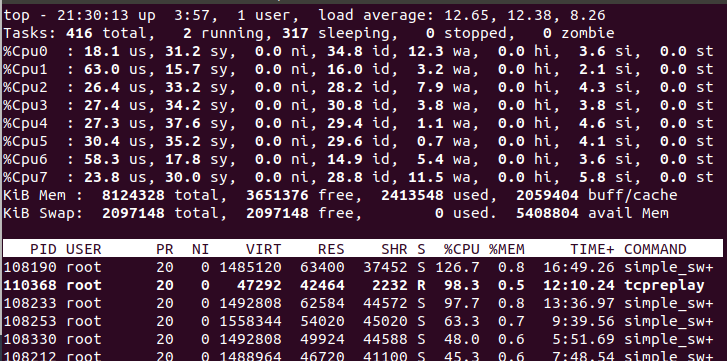


### `free` 

 用于**显示内存状态**，利用率等

``` shell
ubuntu@VM-8-17-ubuntu:~$ free -h
              total        used        free      shared  buff/cache   available
Mem:          1.9Gi       336Mi       217Mi       2.0Mi       1.4Gi       1.4Gi
Swap:            0B          0B          0B
```

``` shell
ubuntu@VM-8-17-ubuntu:~$ free -hs 5		# 每隔5s执行一次
              total        used        free      shared  buff/cache   available
Mem:          1.9Gi       336Mi       217Mi       2.0Mi       1.4Gi       1.4Gi
Swap:            0B          0B          0B

              total        used        free      shared  buff/cache   available
Mem:          1.9Gi       336Mi       217Mi       2.0Mi       1.4Gi       1.4Gi
Swap:            0B          0B          0B

...
```

下面先解释一下输出的内容：

**Mem** 行(第二行)是内存的使用情况。

**Swap** 行(第三行)是交换空间的使用情况。

**total** 列显示系统总的可用物理内存和交换空间大小。

**used** 列显示已经被使用的物理内存和交换空间。

**free** 列显示还有多少物理内存和交换空间可用使用。

**shared** 列显示被共享使用的物理内存大小。

**buff/cache** 列显示被 buffer 和 cache 使用的物理内存大小。buffer/cache的区别见最后

**available** 列显示还可以被应用程序使用的物理内存大小。从应用程序的角度来说，**available = free + buffer + cache**。

***交换空间(swap space)***

swap space 是磁盘上的一块区域，可以是一个分区，也可以是一个文件。当系统物理内存吃紧时，Linux 会将内存中不常访问的数据保存到 swap 上，这样系统就有更多的物理内存为各个进程服务。

## 终端命令 screen

**screen的功能**：

- 会话恢复：**只要Screen本身没有终止，在其内部运行的会话都可以恢复。**这一点对于远程登录的用户特别有用——即使网络连接中断，用户也不会失去对已经打开的命令行会话的控制。只要再次登录到主机上执行screen -r就可以恢复会话的运行。同样在暂时离开的时候，也可以执行分离命令detach，在保证里面的程序正常运行的情况下让Screen挂起（切换到后台）。这一点和图形界面下的VNC很相似。
- 多窗口：在Screen环境下，**所有的会话都独立的运行，并拥有各自的编号、输入、输出和窗口缓存。**用户可以通过快捷键在不同的窗口下切换，并可以自由的重定向各个窗口的输入和输出。
- 会话共享：Screen可以让一个或多个用户从不同终端多次登录一个会话，并共享会话的所有特性（比如可以看到完全相同的输出）。它同时提供了窗口访问权限的机制，可以对窗口进行密码保护。

**安装screen**

``` bash
# CentOS
yum install screen
# Debian/Ubuntu
sudo apt install screen
```

**状态介绍**

通常情况下，screen创建的虚拟终端，有两个工作模式：

- ***Attached***：表示当前screen正在作为主终端使用，为活跃状态。
- ***Detached***：表示当前screen正在后台使用，为非激发状态。

**使用screen**

screen，通常的命令格式为：

```bash
screen [-opts] [cmd [args]]

Options:
-d            分离运行的会话
-dmS name     启动作为守护进程,屏幕会话在分离模式
-D            分离并注销远程会话
-L            开启日志输出
-p window     如果存在命名窗口则预先选择它, 第一个默认是0
-r			  重新连接到已分离的会话，没有这个会话也不会新建；如果这个会话是正使用的（attached），就弹出提示。
-S name       创建会话并指定名称
-R			  重新连接到已分离的会话，没有这个会话就会新建；如果这个会话是正使用的（attached），就新建一个同名会话。
-x            恢复之前的会话
-X            在指定会话中执行命令（用法：-X stuff "cmd1 \n cmd2 \n"）

```

> 更多命令见https://www.linuxtop.cn/command/screen.html

通常情况下，使用一下`基础命令`即可。注意：命令区分大小写

### 1. 帮助查询

screen的帮助文档实在是过于详细，以至于查个命令，可能要查几分钟；但是你可以直接使用帮助命令，查询自己需要的命令:

```bash
# 查询screen提示
screen -help
```

### 2. 终端列表

怎么查看已经存在的screen终端呢？很简单，使用命令：

```bash
screen -ls
```

### 3. 新建终端

大部分人使用screen，是为了让进程以前端运行的方式，后端存活（运行）。所以，使用screen新建一个虚拟终端，后端运行很重要。screen创建虚拟终端的方法很多

比如：直接输入screen回车，即可新建一个虚拟终端，**但是这样的名称太乱\*(以Linux的hostname命名）\***：

**screen官方推荐的创建虚拟终端的方法是：**`screen -S Hello`

此命令就是创建名为Hello的screen（**不会检索是否已存在同名screen，故可能会重复创建**），此时已经进入此screen了。

而我一般是使用`-R`创建虚拟终端：

```bash
# 使用-R创建Hello
screen -R Hello
```

此命令是**无则创建并进入有则进入**名为Hello的screen。

### 4. 离开终端

当我们进入到终端后，需要退出终端将其挂在后台（即将此终端从**attached**状态变为**Detached**的状态），

``` bash
# 1 使用快捷键 
ctrl+ a ,d
# 2 在终端使用命令
screen -d [name]
# 3 在终端外使用命令
screen -R [pid/Name] -X quit # 使用-R/-r/-S均可
```

### 5.结束终端

当我们需要彻底关闭一个终端：

``` bash
# 1 在终端里时：
exit #离开并终止此screen
# 2 在终端外时：
kill 【进程号】 # 杀死screen
```

### 6.回到终端

使用`-R`或者`-r`命令即可：

```bash
# 使用screen -r命令
screen -r [pid/name]
```

### 使用bash脚本调用screen：

``` bash
screen -dmS screen_name bash -c 'command1';   # 注意command1命令返回后  此screen也就立刻结束了。
screen -S screen_name -p 0 -X stuff "shell命令或sh脚本\n"; # 最后的\n用于执行命令“回车”的操作。否则脚本不执行。(可用\n连接多个命令，且可直接用换行来代替)
screen -S screen_name -p 0 -X stuff $'\n'; # 是用于执行命令“回车”的操作。否则脚本不执行。

# 注：此处的command1必须是会持续运行的命令如ping www.baidu.com 才能使此screen一直在后台（detached）运行，否则screen会随着命令的结束而销毁
# 好像一次给的命令太多会导致命令不执行了
```


## 基础网络操作命令

查询自己的公网地址：`curl ifconfig.me`，Linux和windows下都可以用。

### ifconfig

查询和配置网络接口卡（网卡）的命令，使用 **ifconfig** 命令对网卡所做的配置都是临时配置，重启之后都会被还原的。如果要永久配置网卡则需要通过修改配置文件的方式。

- 显示网卡信息

（1）`ifconfig` ：显示激活的网卡信息

> 如果网卡被关闭了则不会被显示出来。

（2）`ifconfig -a`：显示所有的网卡信息

（3）`ifconfig -s`：显示网卡的简要信息

``` shell
ubuntu@VM-8-17-ubuntu:~$ ifconfig -s
Iface      MTU    RX-OK RX-ERR RX-DRP RX-OVR    TX-OK TX-ERR TX-DRP TX-OVR Flg
br-59f05  1500        1      0      0 0             5      0      0      0 BMU
docker0   1500    43494      0      0 0         53055      0      0      0 BMRU
eth0      1500  8705857      0      0 0       7852596      0      0      0 BMRU
lo       65536   637786      0      0 0        637786      0      0      0 LRU
veth18f4  1500    16228      0      0 0         18840      0      0      0 BMRU
vethad45  1500    17349      0      0 0         22411      0      0      0 BMRU
```

（4）`ifconfig [网卡名称]`：显示指定网卡的信息

> 例：ifconfig enp0s3

- 指定网卡的开关

这里以 enp0s3 网卡为例。当网卡被关闭后使用 **ifconfig** 是不会显示出来的。

```c
//启动enp0s3网卡
sudo ifconfig enp0s3 up
//关闭enp0s3网卡
sudo ifconfig enp0s3 down
```

- 指定网卡的ARP协议开关

这里以 enp0s3 网卡为例。

ARP协议是地址解析协议（Address Resolution Protocol），每台主机或路由器都维护着一份ARP缓存表（ARP table），这个表包含IP地址到MAC地址的映射关系，表中记录了<IP地址，MAC地址>对，从而实现IP地址与MAC地址的查询与转换。
详细的查看：https://blog.csdn.net/jiejiemcu/article/details/88406088

``` shell
# 启动enp0s3网卡的ARP协议
sudo ifconfig enp0s3 arp
# 关闭enp0s3网卡的ARP协议
sudo ifconfig enp0s3 -arp
```

还可以设置（临时的）网卡的IPv4地址和子网掩码，配置网卡的虚拟接口，设置网卡的MAC地址，设置网卡的最大传输单元，增加及删除网卡的IPv6地址，等等操作。在此不赘述了。

### netstat 

利用 netstat 指令可让你得知整个 Linux 系统的网络情况。

``` shell
ubuntu@VM-8-17-ubuntu:~$ netstat 
Active Internet connections (w/o servers)
Proto Recv-Q Send-Q Local Address           Foreign Address         State      
tcp        0    200 VM-8-17-ubuntu:ssh      223.72.72.137:22425     ESTABLISHED
tcp        0      0 VM-8-17-ubuntu:55282    169.254.0.138:8086      ESTABLISHED
tcp        0      0 VM-8-17-ubuntu:42146    169.254.0.55:5574       ESTABLISHED
Active UNIX domain sockets (w/o servers)
Proto RefCnt Flags       Type       State         I-Node   Path
unix  2      [ ]         DGRAM                    23956582 /run/user/1000/systemd/notify
```

结果的第一条就是xshell连接服务的TCP连接，可以看到远端连接的IP为 223.72.72.137

选项：

``` shell
-a：列出所有网络状态，包括 Socket 程序；
-c 秒数：指定每隔几秒刷新一次网络状态；
-n：使用 IP 地址和端口号显示，不使用域名与服务名；
-p：显示 PID 和程序名；
-t：显示使用 TCP 协议端口的连接状况；
-u：显示使用 UDP 协议端口的连接状况；
-I：仅显示监听状态的连接；
-r：显示路由表；
```

netstat可以用来查看某端口的占用情况：

``` bash
root@VM-8-17-ubuntu:~# netstat -anp |grep :80
tcp        0      0 0.0.0.0:80              0.0.0.0:*               LISTEN      306614/nginx: maste 
tcp        0      0 10.0.8.17:55282         169.254.0.138:8086      ESTABLISHED 2449215/tat_agent   
tcp6       0      0 :::80                   :::*                    LISTEN      306614/nginx: maste 
```

如上所示就是查看80端口的占用情况。

`netstat -rn` 查看设备的路由表。


### route

用于显示和操作IP路由表。

参数：
  `-n `：不要使用通讯协定或主机名称，直接使用 IP 或 port number；
  `-ee `：使用更详细的资讯来显示

``` shell
ubuntu@VM-8-17-ubuntu:~$ route
Kernel IP routing table
Destination     Gateway         Genmask         Flags Metric Ref    Use Iface
default         _gateway        0.0.0.0         UG    100    0        0 eth0
10.0.8.0        0.0.0.0         255.255.252.0   U     0      0        0 eth0
172.17.0.0      0.0.0.0         255.255.0.0     U     0      0        0 docker0
172.18.0.0      0.0.0.0         255.255.0.0     U     0      0        0 br-59f052e5d856

ubuntu@VM-8-17-ubuntu:~$ route -n
Kernel IP routing table
Destination     Gateway         Genmask         Flags Metric Ref    Use Iface
0.0.0.0         10.0.8.1        0.0.0.0         UG    100    0        0 eth0
10.0.8.0        0.0.0.0         255.255.252.0   U     0      0        0 eth0
172.17.0.0      0.0.0.0         255.255.0.0     U     0      0        0 docker0
172.18.0.0      0.0.0.0         255.255.0.0     U     0      0        0 br-59f052e5d856

# Flags中的U表示UP，启动；G表示use gateway，需要透过外部的主机 (gateway) 来转递封包；
# Metric 度量，距离、跳数；当有多个默认路由时，选择metric 最小的路由
# 此结果与 netstat -r 的结果一致

sinet@sinet167:~$ route -nee
Kernel IP routing table
Destination     Gateway         Genmask         Flags Metric Ref    Use Iface    MSS   Window irtt
0.0.0.0         10.0.5.1        0.0.0.0         UG    0      0        0 ens49f   0     0      0
0.0.0.0         192.168.199.1   0.0.0.0         UG    100    0        0 eno1     0     0      0
10.0.2.0        0.0.0.0         255.255.255.0   U     0      0        0 ens49f   0     0      0
10.0.5.0        0.0.0.0         255.255.255.0   U     0      0        0 ens49f   0     0      0
10.0.7.0        0.0.0.0         255.255.255.0   U     0      0        0 eno2     0     0      0
169.254.0.0     0.0.0.0         255.255.0.0     U     1000   0        0 ens49f   0     0      0
192.168.199.0   0.0.0.0         255.255.255.0   U     100    0        0 eno1     0     0      0

# 可以看到，使用ee后输出更多的信息。
```

可以看到，默认出口都是eth0，默认网关腾讯服务器没有告诉我们地址，写的是 _gateway，

gateway 为 ` 0.0.0.0  ` 表示该ip地址目标是本主机所属的网络，不需要路由。

route还可以添加路由、删除路由、设置路由规则等等。例：

- 格式：`route add -net {NETWORK-ADDRESS} netmask {NETMASK} dev {INTERFACE-NAME}`  ： 添加到达指定网络的路由规则，
- 格式：`route add -net {NETWORK-ADDRESS} netmask {NETMASK} reject `  ：设置到指定网络为不可达，避免在连接到这个网络的地址时程序过长时间的等待，直接就知道该网络不可达。

**删除路由：**

``` shell
# route del -host 192.168.1.2 dev eth0:0  
# route del -host 10.20.30.148 gw 10.20.30.40  
# route del -net 10.20.30.40 netmask 255.255.255.248 eth0  
# route del -net 10.20.30.48 netmask 255.255.255.248 gw 10.20.30.41  
# route del -net 192.168.1.0/24 eth1  
# route del default gw 192.168.1.1  
```

**添加到网络的路由**:

``` shell
# route add -net 10.20.30.40 netmask 255.255.255.248 eth0   #添加10.20.30.40的网络  
# route add -net 10.20.30.48 netmask 255.255.255.248 gw 10.20.30.41 #添加10.20.30.48的网络  
# route add -net 192.168.1.0/24 eth1  
```

**添加到主机的路由:**

``` shell
# route add -host 192.168.1.2 dev eth0   
# route add -host 10.20.30.148 gw 10.20.30.40     #添加到10.20.30.148的网关
```

**添加默认路由**:

``` shell
# route add default gw 192.168.1.1  
```

**修改默认路由的优先级**：

Linux系统支持对默认网关的优先级进行设置，这时需要用到mteric这个参数，metric为跃点数，当系统中有多个默认网关时，**数据包会通过metric更低的接口传输。**

``` shell
sinet@sinet167:~$ route -n
Kernel IP routing table
Destination     Gateway         Genmask         Flags Metric Ref    Use Iface
0.0.0.0         10.0.5.1        0.0.0.0         UG    0      0        0 ens49f1
0.0.0.0         192.168.199.1   0.0.0.0         UG    100    0        0 eno1
10.0.2.0        0.0.0.0         255.255.255.0   U     0      0        0 ens49f0
10.0.5.0        0.0.0.0         255.255.255.0   U     0      0        0 ens49f1
10.0.7.0        0.0.0.0         255.255.255.0   U     0      0        0 eno2
169.254.0.0     0.0.0.0         255.255.0.0     U     1000   0        0 ens49f1
192.168.199.0   0.0.0.0         255.255.255.0   U     100    0        0 eno1
sinet@sinet167:~$ sudo route del default gw 10.0.5.1 ens49f1
[sudo] password for sinet: 
sinet@sinet167:~$ sudo route add default gw 10.0.5.1 dev ens49f1 metric 1000
sinet@sinet167:~$ route -n
Kernel IP routing table
Destination     Gateway         Genmask         Flags Metric Ref    Use Iface
0.0.0.0         192.168.199.1   0.0.0.0         UG    100    0        0 eno1
0.0.0.0         10.0.5.1        0.0.0.0         UG    1000   0        0 ens49f1
10.0.2.0        0.0.0.0         255.255.255.0   U     0      0        0 ens49f0
10.0.5.0        0.0.0.0         255.255.255.0   U     0      0        0 ens49f1
10.0.7.0        0.0.0.0         255.255.255.0   U     0      0        0 eno2
169.254.0.0     0.0.0.0         255.255.0.0     U     1000   0        0 ens49f1
192.168.199.0   0.0.0.0         255.255.255.0   U     100    0        0 eno1
# 通过先删除，再添加实现。
```


### tcpdump

**tcpdump**：dump the traffic on a network，根据使用者的定义**对网络上的数据包进行截获的包分析工具**。

tcpdump可以将网络中传送的数据包的“头”完全截获下来提供分析。它支持针对网络层、协议、主机、网络或端口的过滤，并提供and、or、not等逻辑语句来帮助你去掉无用的信息。

- 普通情况下，直接启动tcpdump将监视第一个网络接口上所有流过的数据包。

```bash
root@VM-8-17-ubuntu:/home/ubuntu# tcpdump
...
```

- **监听指定网络接口的数据包**

此处以docker 的 nginx容器为例，将其开启，并指定监听 docker0 接口

``` bash
root@VM-8-17-ubuntu:/home/ubuntu# tcpdump -i docker0
```

浏览器访问此nginx服务器，可以看到 `tcpdump` 抓到的包

``` shell
root@VM-8-17-ubuntu:/home/ubuntu# tcpdump -i docker0
tcpdump: verbose output suppressed, use -v or -vv for full protocol decode
listening on docker0, link-type EN10MB (Ethernet), capture size 262144 bytes
17:48:57.574838 IP 219.242.112.67.64511 > 172.17.0.2.http: Flags [S], seq 1830528148, win 64240, options [mss 1412,nop,wscale 8,nop,nop,sackOK], length 0
17:48:57.575319 IP 172.17.0.2.http > 219.242.112.67.64511: Flags [S.], seq 1769917238, ack 1830528149, win 64240, options [mss 1460,nop,nop,sackOK,nop,wscale 7], length 0
17:48:57.575362 IP 219.242.112.67.64512 > 172.17.0.2.http: Flags [S], seq 3193273513, win 64240, options [mss 1412,nop,wscale 8,nop,nop,sackOK], length 0
17:48:57.575370 IP 172.17.0.2.http > 219.242.112.67.64512: Flags [S.], seq 2415067009, ack 3193273514, win 64240, options [mss 1460,nop,nop,sackOK,nop,wscale 7], length 0
17:48:57.577913 IP 219.242.112.67.64511 > 172.17.0.2.http: Flags [.], ack 1, win 1025, length 0
17:48:57.578011 IP 219.242.112.67.64512 > 172.17.0.2.http: Flags [.], ack 1, win 1025, length 0
^C
6 packets captured
6 packets received by filter
0 packets dropped by kernel
```

可以看到抓到的出包和入包，内容有时间，处理进程，协议(IP、ARP等)，源IP，目的IP，等等信息

- **监视指定主机的数据包**

打印所有进入或离开sundown的数据包.

```
tcpdump host sundown
```

也可以指定ip,例如截获所有210.27.48.1 的主机收到的和发出的所有的数据包

```
tcpdump host 210.27.48.1 
```

- **监视指定端口的数据包**

如果想要获取主机210.27.48.1接收或发出的telnet包，使用如下命令

```
tcpdump tcp port 23 and host 210.27.48.1
```

对本机的udp 123 端口进行监视 123 为ntp的服务端口

```
tcpdump udp port 123 
```

更多见：[Linux tcpdump命令详解](https://www.cnblogs.com/ggjucheng/archive/2012/01/14/2322659.html)

- **tcpdump抓包并保存成cap文件**

``` bash
tcpdump -i [抓包的端口] -w [保存文件的位置]   # 其他条件自己写
```

### tcpreplay

[tcpreplay命令使用详解 - 驴得水 - 博客园 (cnblogs.com)](https://www.cnblogs.com/lizhaoxian/p/11260396.html)

tcpreplay用于重放保存在pcap文件中的网络流量，它支持按照捕获pcap文件时数据包的速度、或者指定速度去重放网络流量，只要在硬件承受的范围内即可。(默认是按收到包的时间戳发送，也就是按收到包的速度进行发送)

- 格式：**tcpreplay** [**-flags**] [**-flag** [*value*]] [**--option-name**[[=| ]*value*]] <pcap_file(s)>

- 命令参数：

``` shell
-d number, --dbug=number
    启用调试输出。此选项最多可出现1次。此选项将整数作为参数。 number的值被限制为：在0到5的范围内
    此选项的默认输入number为：0
    如果使用--enable-debug进行配置，则可以为调试输出指定详细级别。数字越大，越详细。
-q, --quiet
	静默模式。除了运行结束时的统计数据外，不打印任何内容
-T string, --timer=string
    选择数据包计时模式：select，ioport，gtod，nano。此选项最多可出现1次。此选项的默认string是：gtod
    允许您选择要使用的数据包计时方法：
        nano - Use nanosleep() API
        select - Use select() API
        ioport - Write to the i386 IO Port 0x80
        gtod [default] - Use a gettimeofday() loop
--maxsleep=number
    设置数据包之间休眠不超过X毫秒。此选项将整数作为参数。此选项的默认输入number为：0
    设置tcpreplay在数据包之间休眠的最大毫秒数限制。有效防止数据包之间的长时间延迟，而不会影响大多数数据包。默认为禁用。
-v, --verbose
	通过tcpdump将解码后的数据包打印到标准输出。此选项最多可出现1次
-i
	指定重放的端口
--listnics
	列出所有可用的网卡并退出。
--duration=number
    限制发送的秒数。此选项最多可出现1次。此选项将整数作为输入参数。 number的值被限制为：大于或等于1，此选项的默认number为：-1
    默认情况下，tcpreplay将发送所有数据包。或者手工指定要传输的最大秒数。

# 修改重放速度的选项
-x string, --multiplier=string
    将重放速度修改为指定倍数。此选项最多可出现1次。此选项不得与以下任何选项一起出现：pps，mbps，oneatatime，topspeed。
    指定一个值以修改数据包重放速度。例子：
    2.0：将以捕获速度的两倍重放流量
    0.7：将以捕获的速度的70％重放流量
-p string, --pps=string
    以给定的packets/sec重放数据包。此选项最多可出现1次。此选项不得与以下任何选项一起出现：multiplier, mbps, oneatatime, topspeed.。
    指定一个值以将数据包重放调整为特定的packets/sec速率。例子：
    200：将以每秒200个数据包重放流量
    0.25：将以每分钟15个数据包重放流量
-t, --topspeed
	尽可能快地重放数据包。此选项不得与以下任何选项一起出现: mbps, multiplier, pps, oneatatime.
-M string, --mbps=string
    以给定的Mbps重放数据包。此选项最多可出现1次。此选项不得与以下任何选项一起出现：multiplier，pps，oneatatime，topspeed。
    可为tcpreplay设定其发送数据包的Mbps速率，该值可以指定为浮点值
    
    
-P, --pid
	在启动时打印tcpreplay的PID
```

sudo tcpreplay -i ens49f1 -x 1 h8.pcap


### mtr

- MTR工具将ping和traceroute命令的功能并入了同一个工具中，实现更强大的功能。
- Linux版本的mtr命令默认发送ICMP数据包进行链路探测。可以通过“-u”参数来指定使用UDP数据包用于探测。
- 相对于traceroute命令只会做一次链路跟踪测试，**mtr命令会对到达指定地址的链路上的所有节点做持续探测并给出相应的统计信息（主要看时延和丢包率）**。所以，mtr命令能避免节点波动对测试结果的影响，所以其测试结果更正确，建议优先使用。

**安装**

``` bash
apt-get install  mtr -y
```

**用法说明**

```bash
mtr [-hvrctglspni46] [-help] [-version] [-report] [-report-cycles=COUNT] [-curses] [-gtk] [-raw] [-split] [-no-dns] [-address interface] [-psize=bytes/-s bytes] [-interval=SECONDS] HOSTNAME [PACKETSIZE]
```

**常见可选参数说明：**

- -r 或 -report：以报告模式显示输出，以发送10个包得到的数据生成报告。默认则是实时展示。

- -p 或 -split：将每次追踪的结果分别列出来。

- -s 或 -psize：指定ping数据包的大小。

- -n 或 -no-dns：不对IP地址做域名反解析。
- -c : 设置发送的包数。

- -a 或 -address：设置发送数据包的IP地址。用于主机有多个IP时。

- -4：只使用IPv4协议。

- -6：只使用IPv6协议。

另外，也可以在mtr命令运行过程中，输入相应字母来快速切换模式。

- ？或 h：显示帮助菜单。

- d：切换显示模式。

- n：切换启用或禁用DNS域名解析。

- u：切换使用ICMP或UDP数据包进行探测。

**示例输出**

远程服务器 mtr 测试google DNS的连通性，输出结果如下（以下时间单位皆是毫秒）：

``` sh
root@VM-8-17-ubuntu:~# mtr 8.8.8.8
```

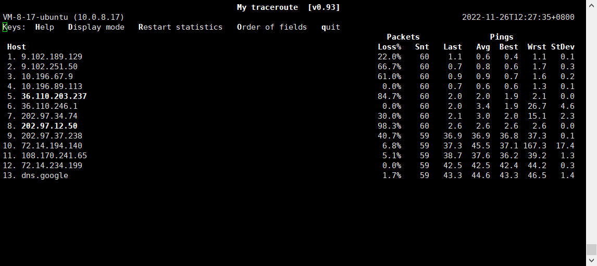

mtr 测试百度的地址，一共发7个包，非实时展示，已报告形式展现：

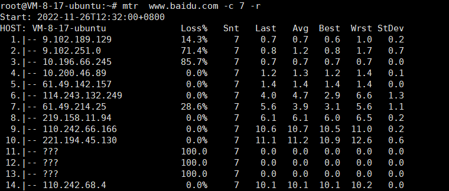


**返回结果**

默认配置下，返回结果中各数据列的说明如下。

- 第一列（Host）：节点IP地址和域名。如前面所示，按n键可以切换显示。

- 第二列（Loss%）：节点丢包率。

- 第三列（Snt）：每秒发送数据包数。默认值是10，可以通过参数“-c”指定。

- 第四列（Last）：最近一次的探测延迟值。

- 第五、六、七列（Avg、Best、Wrst）：分别是探测延迟的平均值、最小值和最大值。
- 第八列（StDev）：标准偏差。越大说明相应节点越不稳定。

其中，IP地址显示为 ??? 表示连接此地址超时，这可能是家用路由器或者运营商的路由器没有正确配置导致的，也可能是因为某些路由器拒绝回复ICMP报文或ICMP优先级设置的很低导致被丢弃，但是数据还是正常传递的，看最后跳，丢包率为 0%，说明数据包全部到达目标主机。

完整版参数说明：

``` bash
 -F, --filename FILE        read hostname(s) from a file
 -4                         use IPv4 only
 -6                         use IPv6 only
 -u, --udp                  use UDP instead of ICMP echo
 -T, --tcp                  use TCP instead of ICMP echo
 -a, --address ADDRESS      bind the outgoing socket to ADDRESS
 -f, --first-ttl NUMBER     set what TTL to start
 -m, --max-ttl NUMBER       maximum number of hops
 -U, --max-unknown NUMBER   maximum unknown host
 -P, --port PORT            target port number for TCP, SCTP, or UDP
 -L, --localport LOCALPORT  source port number for UDP
 -s, --psize PACKETSIZE     set the packet size used for probing
 -B, --bitpattern NUMBER    set bit pattern to use in payload
 -i, --interval SECONDS     ICMP echo request interval
 -G, --gracetime SECONDS    number of seconds to wait for responses
 -Q, --tos NUMBER           type of service field in IP header
 -e, --mpls                 display information from ICMP extensions
 -Z, --timeout SECONDS      seconds to keep probe sockets open
 -r, --report               output using report mode
 -w, --report-wide          output wide report
 -c, --report-cycles COUNT  set the number of pings sent
 -j, --json                 output json
 -x, --xml                  output xml
 -C, --csv                  output comma separated values
 -l, --raw                  output raw format
 -p, --split                split output
 -t, --curses               use curses terminal interface
     --displaymode MODE     select initial display mode
 -n, --no-dns               do not resove host names
 -b, --show-ips             show IP numbers and host names
 -o, --order FIELDS         select output fields
 -y, --ipinfo NUMBER        select IP information in output
 -z, --aslookup             display AS number
 -h, --help                 display this help and exit
 -v, --version              output version information and exit
```


### traceroute

显示数据包到主机间的路径,traceroute命令用于**追踪数据包在网络上的传输时的全部路径**，它默认发送的数据包大小是40字节。

通过traceroute我们可以知道信息从你的计算机到互联网另一端的主机是走的什么路径。当然每次数据包由某一同样的出发点（source）到达某一同样的目的地(destination)走的路径可能会不一样，但基本上来说大部分时候所走的路由是相同的。

traceroute通过发送小的数据包到目的设备直到其返回，来测量其需要多长时间。一条路径上的每个设备traceroute要测3次。输出结果中包括每次测试的时间(ms)和设备的名称（如有的话）及其ip地址。

**工作原理**

1. **UDP 和 ICMP Traceroute**

Traceroute 的基本原理是向外发送带有逐次递增 TTL 的数据包从而获取的路径中每一跳的信息。


> UDP 和 ICMP traceroute 的区别就在于向外发送的数据包（上图中红色标明的 packet）和最后的 final reply。

- UDP 向外发送的是一个 UDP 数据包，final reply 是 ICMP Destination Unreachable
- ICMP 向外发送的是一个 ICMP Echo Request，final reply 是 ICMP Echo Reply

2. **TCP traceroute **

TCP traceroute 同样利用了 TTL 来探测网络路径但是它向外发送的是 TCP SYN 数据包，这样做最大的好处就是穿透防火墙的几率更大因为 TCP SYN 看起来是试图建立一个正常的 TCP 连接。

**Traceroute 的实现**一共有三种方法，分别是：

- TCP traceroute（使用 tracetcp 程序可以实现）
- UDP traceroute（Cisco 和 Linux 默认情况下使用）
- ICMP traceroute ( MS Windows 默认情况下使用）

**命令格式**

```bash
traceroute [选项] [参数]
```

**命令选项**

- -d：使用Socket层级的排错功能；
- -f<存活数值>：设置第一个检测数据包的存活数值TTL的大小；
- -F：设置勿离断位；
- -g<网关>：设置来源路由网关，最多可设置8个；
- -i<网络界面>：使用指定的网络界面送出数据包；
- -I：使用ICMP回应取代UDP资料信息；
- **-m <存活数值>：设置检测数据包的最大存活数值TTL的大小**；
- -n：直接使用IP地址而非主机名称；
- -p<通信端口>：设置UDP传输协议的通信端口；
- -r：忽略普通的Routing Table，直接将数据包送到远端主机上。
- -s<来源地址>：设置本地主机送出数据包的IP地址；
- -t<服务类型>：设置检测数据包的TOS数值；
- -v：详细显示指令的执行过程；
- **-w <超时秒数>：设置等待远端主机回报的时间**；
- -x：开启或关闭数据包的正确性检验。

``` bash
root@VM-8-17-ubuntu:/var/www/html# traceroute www.baidu.com
traceroute to www.baidu.com (110.242.68.3), 30 hops max, 60 byte packets
 1  * * *
 2  9.102.251.50 (9.102.251.50)  0.680 ms * *
 3  * 10.196.67.9 (10.196.67.9)  0.881 ms 10.196.66.249 (10.196.66.249)  0.983 ms
 4  10.200.47.1 (10.200.47.1)  2.590 ms  2.571 ms 10.196.89.105 (10.196.89.105)  0.722 ms
 5  61.49.142.145 (61.49.142.145)  2.568 ms 61.49.142.149 (61.49.142.149)  0.950 ms 61.49.142.145 (61.49.142.145)  2.569 ms
 6  123.126.0.217 (123.126.0.217)  2.207 ms  2.130 ms 61.148.7.157 (61.148.7.157)  1.982 ms
 7  * 61.49.214.13 (61.49.214.13)  2.333 ms 124.65.194.165 (124.65.194.165)  3.377 ms
 8  * 219.158.11.90 (219.158.11.90)  5.947 ms *
 9  110.242.66.182 (110.242.66.182)  9.208 ms 110.242.66.186 (110.242.66.186)  9.993 ms 110.242.66.190 (110.242.66.190)  9.575 ms
10  221.194.45.134 (221.194.45.134)  9.784 ms * 221.194.45.130 (221.194.45.130)  10.644 ms
11  * * *
12  * * *
```


### nslookup

全称 name server lookup，用于**查询DNS的记录，查看域名解析是否正常，在网络故障的时候用来诊断网络问题。**

``` bash
root@VM-8-17-ubuntu:/var/www/html# nslookup baidu.com
Server:		127.0.0.53
Address:	127.0.0.53#53

Non-authoritative answer:
Name:	baidu.com
Address: 220.181.38.251
Name:	baidu.com
Address: 220.181.38.148
```

nslookup 有两种工作模式，交互模式和非交互模式。在交互模式下，用户可以向域名服务器查询各类主机、域名的信息，或者输出域名中的主机列表。在非交互模式下，针对一个主机或域名仅仅获取特定的名称或所需信息。

进入交互模式有两种方式： （1）直接输入 nslookup 命令，不加任何参数，此时 nslookup 会连接到默认的域名服务器（/etc/resolv.conf的第一个DNS地址）； （2）第一个参数是连字符（-），第二个参数是域名服务器的主机名或IP，即`nslookup - SERVER|IP`。

其他方式则进入非交互模式，比如`nslookup NAME`查询域名对应的IP。

反向解析，通过 IP 查询对应的域名。

```bash
$ nslookup 209.132.183.105
Server:		10.123.119.98
Address:	10.123.119.98#53

Non-authoritative answer:
105.183.132.209.in-addr.arpa	name = redirect.redhat.com.

Authoritative answers can be found from:
```


### curl

在Linux中curl是一个利用URL规则在命令行下工作的文件传输工具，可以说是一款很**强大的http命令行工具**。它支持文件的上传和下载，是综合传输工具，但按传统，习惯称url为下载工具。（在windows下也可以用）

```sh
语法：# curl [option] [url]

常用参数
-A/--user-agent <string>              设置用户代理发送给服务器
-b/--cookie <name=string/file>    cookie字符串或文件读取位置
-c/--cookie-jar <file>                    操作结束后把cookie写入到这个文件中
-C/--continue-at <offset>            断点续转
-D/--dump-header <file>              把header信息写入到该文件中
-e/--referer                                  来源网址
-f/--fail                                     连接失败时不显示http错误
-o/--output                                  把输出写到该文件中
-L										-L参数会让 HTTP 请求跟随服务器的重定向。curl 默认不跟随重定向。
-O/--remote-name                        保留远程文件的文件名
-r/--range <range>                      检索来自HTTP/1.1或FTP服务器字节范围
-s/--silent                                    静音模式。不输出任何东西
-T/--upload-file <file>                  上传文件
-u/--user <user[:password]>      设置服务器的用户和密码
-w/--write-out [format]                什么输出完成后
-x/--proxy <host[:port]>              在给定的端口上使用HTTP代理
-#/--progress-bar                        进度条显示当前的传送状态
```

1、基本用法

```shell
$ curl http://www.baidu.com
<!DOCTYPE html>
<!--STATUS OK--><html> <head><meta http-equiv=content-type content=text/html;charset=utf-8><meta http-equiv=X-UA-Compatible content=IE=Edge><meta content=always name=referrer><link rel=stylesheet type=text/css href=http://s1.bdstatic.com/r/www/cache/bdorz/baidu.min.css><title>百度一下，你就知道</title></head> <body link=#0000cc>............................
```

2、保存访问的网页

2.1:使用linux的重定向功能保存

```shell
$ curl http://www.linux.com >> linux.html
```

2.2:可以使用curl的内置option:-o(小写)保存网页

```shell
$ curl -o linux.html http://www.linux.com
```

2.3:可以使用curl的内置option:-O(大写)保存网页中的文件

要注意这里后面的url要**具体到某个文件**，不然抓不下来

```shell
$ curl -O http://www.linux.com/hello.sh
```

3、测试网页返回值

```shell
$ curl -o /dev/null -s -w %{http_code} www.linux.com
```

Ps:在脚本中，这是很常见的测试网站是否正常的用法

4、指定proxy服务器以及其端口
很多时候上网需要用到代理服务器(比如是使用代理服务器上网或者因为使用curl别人网站而被别人屏蔽IP地址的时候)，幸运的是curl通过使用内置option：-x来支持设置代理

```shell
$ curl -x 192.168.100.100:1080 http://www.linux.com
```

5、cookie
有些网站是使用cookie来记录session信息。对于chrome这样的浏览器，可以轻易处理cookie信息，但在curl中只要增加相关参数也是可以很容易的处理cookie
5.1:保存http的response里面的cookie信息。内置option:-c（小写）

```shell
$ curl -c cookiec.txt  http://www.linux.com
```

执行后cookie信息就被存到了cookiec.txt里面了

5.2:保存http的response里面的header信息。内置option: -D

```shell
$ curl -D cookied.txt http://www.linux.com
```

执行后cookie信息就被存到了cookied.txt里面了

注意：-c(小写)产生的cookie和-D里面的cookie是不一样的。

5.3:使用cookie
很多网站都是通过监视你的cookie信息来判断你是否按规矩访问他们的网站的，因此我们需要使用保存的cookie信息。内置option: -b

```shell
$ curl -b cookiec.txt http://www.linux.com
```

6、模仿浏览器
有些网站需要使用特定的浏览器去访问他们，有些还需要使用某些特定的版本。curl内置option:-A可以让我们指定浏览器去访问网站

```shell
$ curl -A "Mozilla/4.0 (compatible; MSIE 8.0; Windows NT 5.0)" http://www.linux.com
```

这样服务器端就会认为是使用IE8.0去访问的

[更多curl操作](http://www.linuxdiyf.com/linux/2800.html)

### wget

GNU Wget(常常简称为wget）是一个**网络上进行下载**的简单而强大的自由软件， 其本身也是GNU计划的一部分。 它的名字是"World Wide Web" 和 "Get"的结合， 同时也隐含了软件的主要功能。 目前它支持HTTP、HTTPS，月以及FTP这三个常见的的TCP/IP协议下载。

简单用法如下：

`wget [网络下载地址]`

如下载linux内核(在相应的目录下)：`sudo wget https://cdn.kernel.org/pub/linux/kernel/v5.x/linux-5.4.224.tar.xz`

# 11. Linux 防火墙

在Ubuntu系统进行安装的时候默认安装了ufw防火墙

### 查看防火墙的状态

命令：  **`sudo ufw status`**

> 系统提示： “Status: inactive”状态：不活跃

上面提示表示没有开启防火墙，并不是没有安装防火墙

### 如果没有安装可以使用命令安装

命令：   **` sudo sudo apt-get install ufw`**

### Ubuntu开启防火墙

[Ubuntu系统中防火墙的使用和开放端口_Aaron_Run的博客-CSDN博客_ubuntu开放端口命令](https://blog.csdn.net/qq_36938617/article/details/95234909)

# 12. Linux内核CC算法

[Linux TCP/IP调优-Linux内核参数注释 - Michael_Tong唐唐 - 博客园 (cnblogs.com)](https://www.cnblogs.com/tcicy/p/10196457.html)

[Linux TCP内核参数设置与调优(详细)！_breeze10000的博客-CSDN博客_linux tcp 参数优化设置](https://blog.csdn.net/weixin_46622350/article/details/119417243)

### 基础知识

[linux内核协议栈 TCP拥塞控制之多算法支持_老王不让用的博客-CSDN博客](https://blog.csdn.net/wangquan1992/article/details/109076072)

Linux内核是支持多种拥塞控制算法并存的，而且支持为不同的TCP流使用不同的拥塞控制算法。

每一种拥塞控制算法必须提供一个`struct tcp_congestion_ops`结构，然后向系统注册，系统将所有注册的拥塞控制算法组织成一个单链表。

### 内核参数位置

- Linux内核中的TCP参数位于 `/proc/sys/net/ipv4/`

TCP的若干参数都是以各个文件的形式保存的。例如，IP的默认跳数64保存在文件`ip_default_ttl`中，我们可以使用命令：`sudo sysctl net.ipv4.ip_default_ttl=32`修改为32。

TCP可以使用的拥塞控制算法保存在`tcp_available_congestion_control`里。(其实不止文件中的)

TCP正在使用的拥塞控制算法保存在`tcp_congestion_control`里。

| 参数名                        | 描述                                                   | 默认值                                       |
| ----------------------------- | ------------------------------------------------------ | -------------------------------------------- |
| `tcp_wmem`(min  default  max) | 为TCP socket预留用于发送缓冲的内存最小值/默认值/最大值 | `10240	87380	16777216(10KB 80KB 16MB)` |
| `tcp_rmem`(min  default  max) | 接收缓存设置。同`tcp_wmem`                             | `10240	87380	16777216`                 |

- `/proc/sys/net/core/`目录中包括许多设置用来控制Linux内核与网络层的交互，即当网络有什么动作时，内核做出什么样的相应反应。

| 参数名         | 描述                              | 默认值           |
| -------------- | --------------------------------- | ---------------- |
| `rmem_default` | 默认的TCP数据接收窗口大小（字节） | 212992（208KB）  |
| `rmem_max`     | 最大的TCP数据接收窗口（字节）     | 16777216（16MB） |
| `wmem_default` | 默认的TCP数据发送窗口大小（字节） | 212992（208KB）  |
| `wmem_max`     | 最大的TCP数据发送窗口（字节）     | 16777216（16MB） |

### 修改内核参数的方法

- **临时修改**：使用`systcl`命令进行修改，例如修改SYN重传次数`sysctl net.ipv4.tcp_syn_retries=n`
- **临时修改**：使用 `echo value` 方式直接追加到文件中。 如 `echo "1" > /proc/sys/net/ipv4/tcp_syn_retries` ，但是这种方式设备重启后，会恢复成默认值。
- **永久修改**：把参数添加到 `sudo vim /etc/sysctl.conf` 中，然后执行 `sudo sysctl -p` 使参数生效。这种方式是永久有效的。如修改默认CC算法为reno，在文件中添加：`net.ipv4.tcp_congestion_control=reno`

### 修改linux内核CC算法为BBR

[How to enable TCP BBR to improve network speed on Linux | TechRepublic](https://www.techrepublic.com/article/how-to-enable-tcp-bbr-to-improve-network-speed-on-linux/)

### linux内核CC算法理解（5.4.224版本）

TCP头部字段`tcphdr`定义位置：`usr/src/linux-x.x.xxx/include/uapi/tcp.h`

机器收到数据包后的处理过程都在 `usr/src/linux-x.x.xxx/net/ipv4/tcp_input.c/tcp_rcv_state_process()`中，6306行，将发送窗口改为接收到的包的cwnd。

### **TCP 抓包常见错误**

> **tcp out-of-order（tcp有问题）          #多数是网络拥塞引起的**
>
> **tcp segment of a reassembled PDU         #TCP 分片标识**
>
> **Tcp previous segment lost（tcp先前的分片丢失）**
>
> **Tcp acked lost segment（tcp应答丢失）**
>
> **Tcp window update（tcp窗口更新）**
>
> **Tcp dup ack（tcp重复应答）**
>
> **Tcp keep alive（tcp保持活动）**
>
> **Tcp retransmission（tcp 重传）**

常见拥塞控制算法：

> **reno是最基本的拥塞控制算法，也是TCP协议的实验原型。**
>
> **bic适用于rtt较高但丢包极为罕见的情况，比如北美和欧洲之间的线路，这是2.6.8到2.6.18之间的Linux内核的默认算法。**
>
> **cubic是修改版的bic，适用环境比bic广泛一点，它是2.6.19之后的linux内核的默认算法。**
>
> **hybla适用于高延时、高丢包率的网络，比如卫星链路。**

# 13. 自定义配置编译linux内核

linux内核在该目录下：`/usr/src`，发行版Ubuntu系统不会带有linux源码，需要自己去 [The Linux Kernel Archives](https://www.kernel.org/) 或[这里版本更多更细](https://mirrors.edge.kernel.org/pub/linux/kernel/)下载，下载后再重新编译，具体见：[Ubuntu linux下重新编译内核_lu0sifen的博客-CSDN博客_ubuntu 重新编译内核](https://blog.csdn.net/weixin_43145961/article/details/115376427) 

这个博客也可参考[【硬核】手摸手教你修改编译安装linux内核_吃代码的喵酱-i的博客-CSDN博客_linux修改内核](https://blog.csdn.net/weixin_44179892/article/details/110677089)

> （对已经编译过的系统使用相同的内核代码重新编译时，从链接文章的第5步开始，并且使用下面的方法加快编译）

### 自己整理的编译内核的步骤：

#### 0.准备工作

给Ubuntu分配内存要至少大于40GB，不然编译过程中会因内存不足，提前终止报错（- -血的教训）

对于virtuabox下的Ubuntu虚拟机，先在virtualbox软件中给相应虚拟机分配更多磁盘，再去虚拟机中使用`gparted`挂载空磁盘。

详见教程：[技术|如何在 VirtualBox 中增加现有虚拟机的磁盘大小 (linux.cn)](https://linux.cn/article-12869-1.html)

[GParted Linux磁盘扩展工具的使用_你的小可爱已下线的博客-CSDN博客](https://blog.csdn.net/jx1605/article/details/80624599)

#### **1.官网下载内核源码**

官网内核源码地址：https://www.kernel.org/ （尽量选择稳定的内核版本）或[这里版本更多更细](https://mirrors.edge.kernel.org/pub/linux/kernel/)

查看自己内核版本号：

```sh
uname -a
```

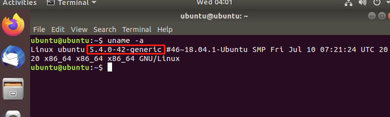

记住此内核编号，之后要用。

#### 2.安装编译内核需要的程序

建议安装之前先更新一下软件来源，不然可能会出现安装失败的情况（来源更换为国内镜像速度更快些）

更新操作：

```sh
sudo apt-get upgrade 
sudo apt-get update
```

然后就是下载安装一系列的软件，为编译内核做准备

``` sh
sudo apt-get install libncurses5-dev openssl libssl-dev 
sudo apt-get install build-essential openssl 
sudo apt-get install pkg-config 
sudo apt-get install libc6-dev 
sudo apt-get install bison 
sudo apt-get install flex 
sudo apt-get install libelf-dev 
sudo apt-get install zlibc minizip 
sudo apt-get install libidn11-dev libidn11
sudo apt-get install dwarves
```

#### 3.解压内核到指定位置

内核版本为自行下载准备编译的版本 （此实验准备的是linux-5.4.224.tar.xz）

（要去内核的下载到的目录下去解压，不然会找不到文件）

``` sh
sudo wget https://cdn.kernel.org/pub/linux/kernel/v5.x/linux-5.4.224.tar.xz
# 随便在哪个位置下载此包
sudo tar -xavf linux-5.4.224.tar.xz -C /usr/src
# 解压 一定要解压到 /usr/src
```

#### 4.进入到解压位置

后面的操作都是默认**在这个目录下执行**。

```bash
cd /usr/src/linux-5.4.224
```

#### 5.净化源码

对已编译过内核的虚拟机**再次编译**时就从这一步开始就行了（当然需要先进行相关内核代码的修改）。

得到源代码后,将其净化。

```sh
sudo make mrproper 
sudo make clean
```

#### 6.修改配置文件

得到内核之后要对其进行配置，配置的办法: 将现有内核的配置选项复制到要编译的新内核上去。这句话的意思是将我现有的内核（5.4.0-42）版本的config配置信息复制到现在目录下的 .config里面

``` sh
sudo cp /boot/config-5.4.0-42-generic .config
```

注意此处版本要填写第一次查询的现有内核版本,然后修改它。

打开`.config`文件查看`CONFIG_SYSTEM_TRUSTED_KEYS`字段的位置，记住其行数。如图所示。


使用vim修改该字段值。（图中展示的时已修改后的结果，一般来说该字段是不为空的）

``` sh
sudo vim .config  # 当然使用 gedit也行。
```

使用 `:行数`  跳转到此行，并对其进行修改为如图的空值。

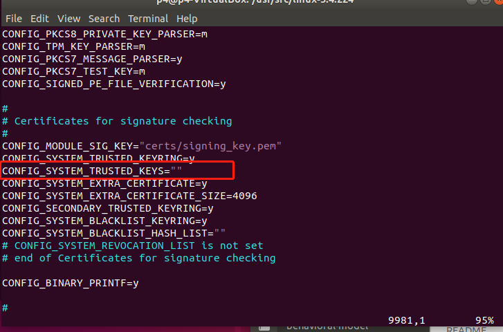

最后`:wq` 保存退出。

#### 7.对内核选项进行配置

对内核选项进行配置，这个是一个图形化配置

``` sh
sudo make menuconfig
```

使用小键盘的上下左右键和enter即可。选择 **load→OK→Save→OK→EXIT→EXIT** 注意看load后默认.config。

直接上下键，跳转至"Exit"，即所有都为默认选项

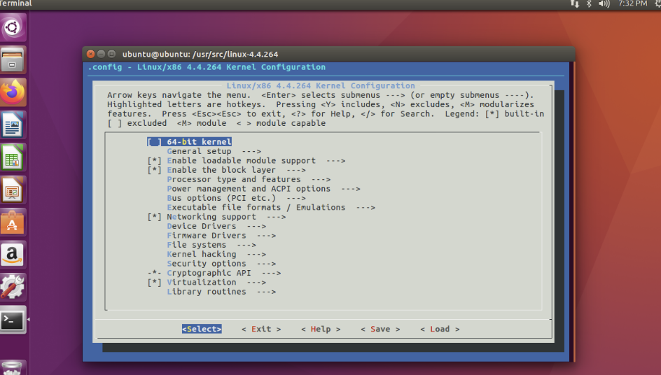

> 如果已经安装了sudo apt-get install libncurses5-dev库
>
> 还是报错出现/opt/linux/linux-3.5/scripts/kconfig/Makefile:21: recipe for target 'menuconfig' failed错误
>
> 原因是客户端窗口太小，把terminal变大整个屏幕大小就可以显示。

#### 8.开始编译

在此步之前要完成所有的内核源码修改。

然后接着输入指令，进行编译以及安装模块

```sh
sudo make -j 4	# 其后参数自己调整
sudo make modules 
sudo make modules_install
```

**注1**： `sudo make -j 4`后的数字是调用多个CPU来加快构建。因为内核的编译工作量特别大，我使用`make -j 4进行编译工作。`make -j 4是指make编译过程使用我的2个处理器核同时进行工作，每个处理器上开两个线程。因此，你可以输入`lscpu`查看当前操作系统使用的cpu核心数，每个核心开一个或两个线程（通常是这样，我每核心开两个线程cpu已经跑满了）。

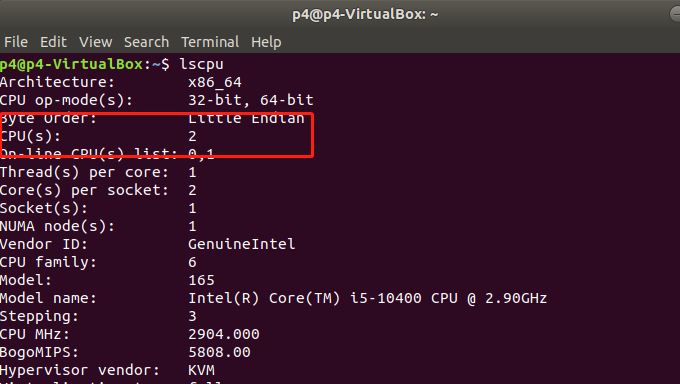

**注2**：自己对源代码的修改**可能报错**，代码出错可能会在第二步 `make modules `才暴露出来。此时对代码修改之后，必须**再次从make开始**才行。

**注3**：因此，出错之后，在修改代码后，直接先`sudo make modules `检查代码中的错误，没错后，才从第5步重新开始编译。

编译过程需要很久，make输出如下：


没报错的`sudo make modules`输出如下：

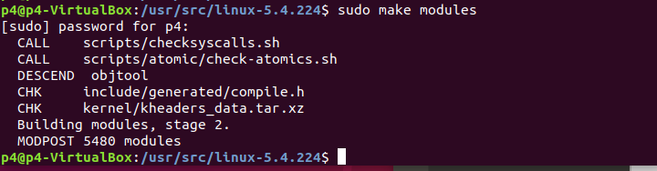

`sudo make modules_install`输出如下：

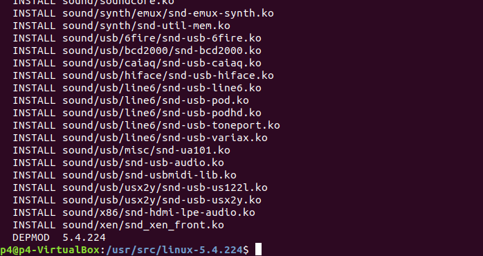

#### 9.安装

接着输入一下命令进行安装，此时目录要在自己编译的内核目录下`/usr/src/linux-5.4.224/`

```sql
sudo make install 
sudo mkinitramfs -o /boot/initrd.img-5.4.224
sudo update-initramfs -c -k 5.4.224
sudo update-grub2
```

#### 10.检验成果

重启 可以看到新的内核版本，成功编译

```css
reboot 
uname -a
```

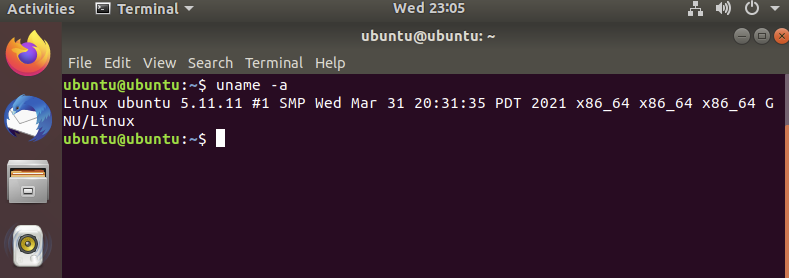

> 注：
>
> **加快make编译：**
>
> 内核的编译工作量特别大，我使用`make -j8`进行编译工作。`make -j8`是指make编译过程使用我的8个处理器核同时进行工作，每个处理器上开两个线程。因此，你可以输入`lscpu`查看当前操作系统使用的cpu核心数，每个核心开一个或两个线程（通常是这样，我每核心开两个线程cpu已经跑满了）。
>
> **编译内核时报错：**
>
> 1. `内核错误: No rule to make target ‘debian/canonical-certs.pem‘, needed by ‘certs/x509_certificate_list‘`，解决：[内核错误: No rule to make target ‘debian/canonical-certs.pem‘, needed by ‘certs/x509_certificate_list‘_Imagine Miracle的博客-CSDN博客_no rule to make target 'debian/canonical-certs.pem](https://blog.csdn.net/qq_36393978/article/details/118157426)
>
> 2. `内核错误：BTF: .tmp_vmlinux.btf: pahole (pahole) is not available`，解决：[内核错误：BTF: .tmp_vmlinux.btf: pahole (pahole) is not available_Imagine Miracle的博客-CSDN博客](https://blog.csdn.net/qq_36393978/article/details/124274364)
>

**额外**：

官方是强调编译linux内核是强烈不建议以root身份来进行编译的，因为这样有可能在编译过程中改掉当前编译系统的重要配置而影响当前系统，而应该建议使用普通用户的身份来编译内核，这样该普通用户如果在编译过程中要修改系统重要的配置文件也会因为没有权限而报错。

对于源代码的阅读，要想比较顺利，事先最好对源代码的知识背景有一定的了解。对于linux内核源代码来讲，我认为，基本要求是: 1、操作系统的基本知识; 2、对C语言比较熟悉，最好要有汇编语言的知识和GNU C对标准C的扩展的知识的了解。另外在阅读之前，还应该知道Linux内核源代码的整体分布情况。我们知道现代的操作系统一般由进程管理、内存管理、文件系统、驱动程序、网络等组成。看一下Linux内核源代码就可看出，各个目录大致对应了这些方面。Linux内核源代码的组成如下(假设相对于linux目录): 

| 文件夹        | 描述                                                         |
| ------------- | ------------------------------------------------------------ |
| arch          | 这个子目录包含了此核心源代码所支持的硬件体系结构相关的核心代码。如对于X86平台就是i386。 |
| include       | 这个目录包括了核心的大多数include文件。另外对于每种支持的体系结构分别有一个子目录。 |
| init          | 此目录包含核心启动代码。                                     |
| mm            | 此目录包含了所有的内存管理代码。与具体硬件体系结构相关的内存管理代码位于arch/*/mm目录下，如对应于X86的就是arch/i386/mm/fault.c 。 |
| drivers       | 系统中所有的设备驱动都位于此目录中。它又进一步划分成几类设备驱动，每一种也有对应的子目录，如声卡的驱动对应于drivers/sound。 |
| ipc           | 此目录包含了核心的进程间通讯代码。                           |
| modules       | 此目录包含已建好可动态加载的模块。                           |
| fs Linux      | 支持的文件系统代码。不同的文件系统有不同的子目录对应，如ext2文件系统对应的就是ext2子目录。 |
| kernel        | 主要核心代码。同时与处理器结构相关代码都放在arch/*/kernel目录下。 |
| net           | 核心的网络部分代码。里面的每个子目录对应于网络的一个方面。   |
| lib           | 此目录包含了核心的库代码。与处理器结构相关库代码被放在arch/*/lib/目录下。 |
| scripts       | 此目录包含用于配置核心的脚本文件。                           |
| Documentation | 此目录是一些文档，起参考作用。                               |

### 切换内核版本的方法

[linux切换内核版本_木可木可❀的博客-CSDN博客_linux切换内核](https://blog.csdn.net/weixin_44260459/article/details/123723356)

### printk内核打印

printk 在内核源码中用来记录日志信息的函数，只能在内核源码范围内使用，用法类似于 printf 函数。

printk 函数主要做两件事情：

1. 将信息记录到 log 中；
2. 调用控制台驱动来将信息输出。

#### printk 介绍

printk 将内核信息输出到内核信息缓冲区中，内核缓冲区在 kernel/printk/printk.c 中定义：

```c
static char __log_buf[__LOG_BUF_LEN] __aligned(LOG_ALIGN);
```

内核信息缓冲区是一个环形缓冲区（Ring Buffer），因此，如果塞入的消息过多，则就会将之前的消息冲刷掉。

例如：`printk(KERN_INFO"mac_header =%x \n", skb->mac_header  );`

注意：c语言类型检查很严格，数字类型一定要用 %d 来占位，不要想当然的用 %s。

详见：[printk 内核打印 – 人人都懂物联网 (getiot.tech)](https://getiot.tech/linux-kernel/linux-kernel-printk.html#)

简单来说，跑数据后，在命令行中输入 `dmesg`即可。

#### pr_xxx

除了直接使用 printk 加消息级别的方式，在 `<linux/printk.h>` 中还定义了 pr_notice、pr_info、pr_warn、pr_err 等接口。使用这些 pr_xxx 接口，就可以省去指定消息级别的麻烦。

```c
#define pr_emerg(fmt, ...)     printk(KERN_EMERG pr_fmt(fmt), ##__VA_ARGS__)
#define pr_alert(fmt, ...)     printk(KERN_ALERT pr_fmt(fmt), ##__VA_ARGS__)
#define pr_crit(fmt, ...)      printk(KERN_CRIT pr_fmt(fmt), ##__VA_ARGS__)
#define pr_err(fmt, ...)       printk(KERN_ERR pr_fmt(fmt), ##__VA_ARGS__)
#define pr_warning(fmt, ...)   printk(KERN_WARNING pr_fmt(fmt), ##__VA_ARGS__)
#define pr_warn pr_warning
#define pr_notice(fmt, ...)    printk(KERN_NOTICE pr_fmt(fmt), ##__VA_ARGS__)
#define pr_info(fmt, ...)      printk(KERN_INFO pr_fmt(fmt), ##__VA_ARGS__)

#define pr_devel(fmt, ...)     printk(KERN_DEBUG pr_fmt(fmt), ##__VA_ARGS__)
#define pr_debug(fmt, ...)     printk(KERN_DEBUG pr_fmt(fmt), ##__VA_ARGS__)
```

需要注意的是，其他 `pr_XXX()` 函数能无条件地打印，但 `pr_debug()` 却不能。因为默认情况下它不会被编译，除非定义了 `DEBUG` 或设定了 `CONFIG_DYNAMIC_DEBUG`

# 14. Linux配置文件与环境变量

环境变量一般指在操作系统中用来指定操作系统运行环境的一些参数，是操作系统为了满足不同的应用场景预先在系统内设置的一大批全局变量。

### 环境配置文件的区别

配置文件 : **/etc/profile**、 **/etc/bashrc**、**~/.profile**、 **~/.bashrc**介绍( **/etc/bashrc可能在不同linux版本中叫 /etc/bash.bashrc，功能一样，下面不改了**)

bash会在用户登录时，读取下列四个环境配置文件：

```tex
全局环境变量设置文件：/etc/profile、/etc/bashrc。 
用户环境变量设置文件：~/.bash_profile、~/.bashrc。
```

``` txt
用户登录机器时会执行的配置文件：/etc/profile, ~/.profile
用户每次新开终端执行的配置文件：/etc/bashrc, ~/.bashrc
```

读取顺序：〇：`/etc/enviroment `、① `/etc/profile`、② `~/.bash_profile`、③` ~/.bashrc`、④ `/etc/bashrc`。

>0. `/etc/environment`: 是设置**整个系统的环境变量**，其中的环境变量权限最高。
>
>1. `/etc/profile`: 此文件为系统的**每个用户设置环境变量**，系统中**每个用户登录时**都要执行这个脚本，如果系统管理员希望某个设置对所有用户都生效，可以写在这个脚本里，该文件也会从`/etc/profile.d`目录中的配置文件中搜集shell的设置。
>2. `~/.profile`: **每个用户**都可使用该文件设置专用于自己的shell信息，**当用户登录时，该文件仅执行一次**。默认情况下，他仅执行一次，设置一些环境变量，执行用户的`.bashrc`文件。 
>3. ` ~/.bashrc`: 该文件包含**专用于自己这个用户**的shell信息，当**登录时以及每次打开新shell时**，该文件被读取。（每个用户都有一个.bashrc文件，在用户目录下）（注意和.profile 的区别，执行次数不同）
>4.  `/etc/bashrc`: 为每一个运行bash shell的用户执行此文件，**每当bash shell被打开时**，该文件被读取。
>
>~/.bash_profile是交互式、login 方式进入 bash 运行的 。
>
>~/.bashrc 是交互式 non-login 方式进入 bash 运行的。通常二者设置大致相同，所以通常前者会调用后者。
>
>~/.bash_logout：当每次退出系统(退出bash shell)时，执行该文件。

### Linux环境变量分类

**按生命周期分：**

- 永久的：需要用户修改配置文件使变量永久生效

- 暂时的：用户使用`export`命令，在当前终端下声明环境变量，关闭Shell终端失效。

**按作用域分：**

- 系统环境变量：系统环境变量对该系统中所有用户都有效。
- 用户环境变量：顾名思义，这种类型的环境变量只对特定的用户有效。

### 设置Linux环境变量的方法

1. 在**`/etc/profile`或`/etc/bashrc`文件**中添加变量 **对所有用户生效（永久的）**

用vim在文件`/etc/profile`文件中增加变量，该变量将会对Linux下所有用户有效，并且是“永久的”。

例如：编辑/etc/profile文件，添加CLASSPATH变量

```bash
  vim /etc/profile    
  export CLASSPATH=./JAVA_HOME/lib;$JAVA_HOME/jre/lib
```

注：修改文件后要想马上生效还要运行`source /etc/profile`不然只能在下次重进此用户时生效。

2. 在**用户目录下的`.profile`或 `.bashrc`文件**中增加变量 **【对单一用户生效（永久的）】**

- 用`vim ~/.profile`文件中增加变量，改变量仅会对当前用户有效，并且是“永久的”。

```bash
vim ~/.profile
export CLASSPATH=./JAVA_HOME/lib;$JAVA_HOME/jre/lib
```

注：修改文件后要想马上生效还要运行` source ~/.bash_profile`（source可能不生效，原因未知），不然只能在下次重进此用户时生效。 因为`~/.profile` 只在该用户登录时运行一遍。

- 用`vim ~/.bashrc`文件中增加变量，改变量仅会对当前用户有效，并且是“永久的”。

``` shell
#在该文件最后添加
export test1=1
```

注：保存退出后，新开一个terminal，运行`echo $test1`，会打印`1`。因为每开一个终端都会执行该`~/.bashrc`文件。

4. 直接运行export命令定义变量 **【只对当前shell（BASH）有效（临时的）】**


在shell的命令行下直接使用 **`export 变量名=变量值`** 定义变量，该变量只在当前的shell（BASH）或其子shell（BASH）下是有效的，

shell关闭了，变量也就失效了，再打开新shell时就没有这个变量，需要使用的话还需要重新定义。

**export** ： 用来新增、修改、删除环境变量。

**source** ： 立刻在***当前shell*** 中执行后跟的文件。通常用于重新执行修改完成的初始化文件。因为sh执行其实是新建一个子shell去执行，子shell中创建的环境变量无法影响到父shell的。所以用source执行的脚本，设置的变量会直接成为当前shell的一部分。

### Linux环境变量使用

- **PATH：指定命令的搜索路径**（定义在 /etc/environment 中）

> **PATH声明用法：**
>
>  export  PATH=$PATH:<PATH 1>:<PATH 2>:<PATH 3>:--------:< PATH  n >
>
>  < PATH  n > 就是自己需要添加到PATH中的路径。
>
>  你可以自己加上指定的路径，中间用冒号隔开。环境变量更改后，在用户下次登陆时生效。
>
>  可以利用`echo $PATH`查看当前当前系统PATH路径。

-  **常用的环境变量**

> $BASH Bash : Shell的全路径
>
> $CDPATH    用于快速进入某个目录。
>
> $PATH    决定了shell将到哪些目录中寻找命令或程序
>
> $HOME    当前用户主目录
>
> $HISTSIZE    历史记录数
>
> $LOGNAME    当前用户的登录名
>
> $HOSTNAME    指主机的名称
>
> $SHELL    当前用户Shell类型
>
> $LANGUGE    语言相关的环境变量，多语言可以修改此环境变量
>
> $MAIL    当前用户的邮件存放目录
>
> $PS1    基本提示符，对于root用户是#，对于普通用户是$

- **修改和查看环境变量的命令**
  - echo         显示某个环境变量值 echo $PATH
  - export   设置一个新的环境变量 export HELLO="hello" (可以无引号)
  - env      显示所有环境变量
  - set      显示本地定义的shell变量
  - unset        清除环境变量 unset HELLO
  - readonly     设置只读环境变量 readonly HELLO


# 15. vmware 安装ubuntu20虚拟机

[(4条消息) 虚拟机（VMware）安装Linux（Ubuntu）安装教程_Brights_Stars_的博客-CSDN博客_虚拟机安装ubuntu](https://blog.csdn.net/qq_39657434/article/details/112252844)

- 解决VMware安装Ubuntu时界面显示不全问题：

  在虚拟机桌面按Ctrl+Alt+T，出现终端窗口，然后在终端中输入命令`xrandr -s 1280x800`（这里是x 诶刻斯），暂时改变虚拟机的分辨率。

# 16. 正则表达式


1 打开此文件：

```shell
sudo vim /etc/netplan/01-network-manager-all.yaml
```

2 修改文件（注意：缩进一律用空格，不要用tab键，同时注意冒号后的空格）

``` yaml
network:
  ethernets:
    enp0s3:
      dhcp4: no
      addresses: [192.168.0.180/24]
      optional: true
      gateway4: 192.168.0.1
      nameservers:
        addresses: [192.168.0.1,223.6.6.6]
  version: 2
  renderer: NetworkManager
```

桌面版ubuntu的网络管理器是 NetworkManager， server版ubuntu的网络管理器是 networkd。

3 重启网络服务使配置生效

```shell
sudo netplan apply
```

4 运行命令以确保更改

``` bash
ip add
```

5 验证结果

```shell
ifconfig
```

> 下面是另一种方法：
>
> （可以通过修改 `/etc/network/interfaces` 文件来配置网络接口。但是，在较新版本的 Ubuntu（例如 17.10 及更高版本）中，引入了 `netplan` 来管理网络配置，因此建议使用 `/etc/netplan/` 目录下的配置文件来配置网络接口。）
>
> 但这种方法不太好，或者说在这里配的ip地址权限太高，每次开机后，默认路由会从这里面配的地址中找一个，这通常与我们的需求相悖。
>
> **但好处是可以配光口。**
>
> 首先使用`ifconfig -a` 确定自己需要配置IP地址的网口名。
>
> 然后`sudo vim /etc/network/interfaces` 编辑该文件。(以配置网口eth0为例）
>
> ``` shell
> auto eth0
> iface eth0 inet static
> address 192.168.1.60
> netmask 255.255.255.0
> # network x.x.x.x
> # broadcast x.x.x.x
> # dns-nameserves x.x.x.x
> gateway x.x.x.x
> ```
>
> 然后使用`sudo /etc/init.d/networking restart`重启生效。
>
> 如果上述命令失败就重启机器。


# 17. Linux服务器同步时间

### 设置时区

首先把所有机器设为相同的时区，将时区设置为东8区的时间，虽然服务器在全球的不同地方，但是与时间服务器交互存在一定时延，选择近的服务器会使时间同步更精准。

``` shell
cp /usr/share/zoneinfo/Asia/Shanghai /etc/localtime
```

### 同步网络时间

在Linux下，我们可以使用ntpdate进行网络时间的同步，而不是我们自己去设置时间。这个命令的使用很简单，

``` shell
ntpdate  0.cn.pool.ntp.org
```

时间服务器分为两种，一种是一级时间服务器，另外一种是二级时间服务器。我们如果是同步自己的服务器的时间，那么选择二级时间服务器，因为一级时间服务器是为二级时间服务器提供时间校对服务器，我们尽量不要增加一级服务器的压力。这种层级的概念和DNS的层级概念是一致的。


# 18.正则表达式

### 简介

[Regex正则表达式在线测试、生成、解析工具 - GoRegex.cn](https://goregex.cn/regex-intro.html)

**正则表达式**，又称规则表达式。英文：Regurlar Expression。在代码中常简写为regex、regexp或RE，计算机科学的一个概念。正则表达式通常**被用来检索、替换那些符合某个模式(规则)的文本**。

### 语法

正则表达式是一种文本模式，包括普通字符（例如，a 到 z 之间的字母）和特殊字符（称为“**元字符**”）。模式描述在搜索文本时要匹配的一个或多个字符串。

#### 匹配一个字符串的开头和结尾

**'^' 和 '$'**。他们的作用是分别指出一个字符串的开始和结束。

- "^The"：表示所有以"The"开始的字符串（"There"，"The cat"等）；
- "of despair$"：表示所有以"of despair"结尾的字符串；
- "^abc$"：表示开始和结尾都是"abc"的字符串——呵呵，只有"abc"自己了；
- "notice"：表示任何包含"notice"的字符串。

#### 一个字符/字符串重复出现的次数

`*` ： 0或多次，即任意次。

`+` ：1或多次。即出现即可

`?` ：0或1次。

- "ab*" ：标识一个a后跟任意次数的b。（a, ab, abbbbb....)
- "ab+"：表示一个字符串有一个a后面跟着至少一个b或者更多；
- "ab?"：表示一个字符串有一个a后面跟着零个或者一个b；
- "a?b+$"：表示在字符串的末尾有零个或一个a跟着一个或几个b。

注： `*`和 `+` 限定符都是贪婪的，因为它们**会尽可能多的匹配文字**，只有在它们的后面加上一个` ?`就可以实现非贪婪或最小匹配。

**也可以限定重复次数的范围**：

- "ab{2}"：表示一个字符串有一个a跟着2个b（"abb"）；
- "ab{2, 5}"：表示一个字符串有一个a跟着2到5个b。
- "ab{2, }"：表示一个字符串有一个a跟着至少2个b；

`*`，`+`，`?` 就分别相当于 `{0, }`， `{1, }`，`{0, 1}`。

#### 方括号

方括号[ ] 中的内容是**可选字符集**，表示某些字符允许在一个字符串中的某一特定位置。

- "[ab]"：表示一个字符串有一个"a"或"b"（相当于"a¦b"）；
- "[a-d]"：表示一个字符串包含小写的'a'到'd'中的一个（相当于"a¦b¦c¦d"或者"[abcd]"）；
- "^[a-zA-Z]"：表示一个以字母开头的字符串；
- "[0-9]%"：表示一个百分号前有一位的数字；
- ",[a-zA-Z0-9]$"：表示一个字符串以一个逗号后面跟着一个字母或数字结束。
- "."：点表示匹配任意一个字符

在方括号里**用'^'表示不希望出现的字符**，'^'应在方括号里的第一位。

- "\[^a-zA-Z\]" ：表示一个非英文字母的字符。

注：**在方括号中，不需要转义字符。**

- "[.]"：就表示匹配一个小数点。

单独使用特殊字符时需要使用转义字符”\“，如：在"^.$()¦*+?{\"这些字符前加上转移字符'\'。


# # 快捷键

**[Tab] 有『命令补全』与『文件补齐』的功能**

```
[Tab]      ## 接在一串指令的第一个字的后面，则为『命令补全』
[Tab]      ## 接在一串指令的第二个字以后时，则为『文件补齐』
```

若安装 bash-completion 软件，则在某些指令后面使用 [tab] 按键时，可以进行『选项/参数的补齐』功能！

**[Ctrl]+ C 如果在Linux 底下输入了错误的指令或参数，想让当前的程序『停掉』的话，可以输入：**

```
[Ctrl] + c 
```

**[Ctrl]-d 『键盘输入结束(End Of File, EOF 或 End Of Input)』的意思**

另外，他也可以用来取代 exit 的输入。

例如你想要直接离开文字接口，可以直接按下：

```
[Ctrl] + d   ## 相当于输入 exit
```

**[shift]+{[PageUP]|[Page Down]}**

```
[Shift]+[Page Up]    ## 往前翻页 

[Shift]+[Page Down] ## 往后翻页
```

# # 可能遇到的问题与解决

- **在ubuntu18安装中文输入法**

    - 安装中文输入法：https://blog.csdn.net/weiguang102/article/details/122522271

        在点击Manage Installed Languages后如果有弹窗就点弹窗点Install，如果在在安装中文时报错:`Failed to fetch http://security.ubuntu.com/ubuntu/pool/main/f/firefox/firefox-locale-zh-hans_109.0.1+build1-0ubuntu0.18.04.2_amd64.deb 404 Not Found [IP: 91.189.91.38 80]`，就在shell执行`sudo apt install firefox-locale-zh-hans`

- **swap file “*.swp”already exists！问题：**
  
    - 在其目录下详细显示所有文件 ls -al , 将.swp结尾的文件rm掉
    
- **使用ssh远程连接时出现The authenticity of host xxx can't be established问题：**
    - 主机的key发生了变化，因此每次SSH链接都会有提示，只需要在交互下输入yes即可。
        当然如果长久的想解决问题，可以采用以下方法：
        	使用ssh连接远程主机时加上“-o StrictHostKeyChecking=no”的选项，去掉对主机的验证检查。
        	`ssh -o StrictHostKeyChecking=no 192.168.xxx.xxx`
        	参见：https://www.cnblogs.com/gauze/p/5554840.html

- **安装sshpass以在ssh连接时可以带上密码**
    - **安装命令**： `sudo apt install sshpass`
        **连接命令**：` sshpass -p "密码" ssh 192.168.199.151 "其他sh命令"`
        加上命令：`-o StrictHostKeyChecking=no`  可以跳过keyChecking，）就不用输yes/no了
        	例：`sshpass -p 'onl' ssh -o StrictHostKeyChecking=no 192.168.199.151`

- **使用服务器ssh连接交换机时出现Permission denied, please try again错误，无法连接；而使用交换机连交换机就可以连接**
    - **原因**：服务器的用户都是普通用户，而交换机的用户都是root
    - **解决**：使用服务器连接时要把用户带上，即ssh root@192.168.199.151
    
- **navicat连接出现1251 client does not support authentication问题时**
    -  https://minsonlee.github.io/2021/11/mysql-client-not-support-authentication  
    
- **mysql连接jar包需要放在linux下的哪里呢？**
    - 该jar包应该被置于jdk安装路径下jre文件夹lib目录的ext文件夹下。例如我的JDK安装路径为`/usr/lib/jvm/java-8-openjdk-amd64`，则我的jar包位置应该是：`/usr/lib/jvm/java-8-openjdk-amd64/jre/lib/ext/mysql-connector-java-8.0.18.jar`（通过whereis java查看jdk路径）
    
- **将python命令默认映射为python3**

    安装ubuntu18.4版本默认安装python3.6.9，安装ubuntu20.4版本默认安装python3.8，没有安装python2。

    - 备份系统自带python2的软链接（可不做）：

    ```shel
    mv /usr/bin/python /usr/bin/python.bak
    ```

    - 创建python3软链接：

    （安装python一般会自动生成软链接/usr/bin/python3，如果没有，请将“/usr/bin/python3”改为你安装的python3的位置）

    ```bash
    sudo ln -s /usr/bin/python3 /usr/bin/python
    ```

- **vmware 虚拟机使用桥接模式联网**

  首先将对应虚拟机的网配置改成桥接模式，然后vmware主页左上角 **编辑** - **虚拟网络编辑器** - **更改设置**(可能没有) - **选好桥接到的网卡，不要选错了**。无线有线网卡都可以。


- **vmware安装ubuntu18，自动设置虚拟机分辨率，使虚拟机与宿主机之间能复制粘贴以及拖拽文件**

    设置 -- 设备 -- display ： 可设置固定分辨率
    
    Install VMware Tools by following the usual method (Virtual Machine --> Reinstall VMWare Tools)
    
    ``` shell
    sudo apt-get install open-vm-tools
    
    sudo apt-get install open-vm-tools-desktop
    

- **linux下使用pip报错**

使用的pip版本

``` sh
$ pip --version
pip 22.3.1 from /home/p4/.local/lib/python3.8/site-packages/pip (python 3.8)
```

当使用`pip install XXX` 安装某个包时出现错误如下：

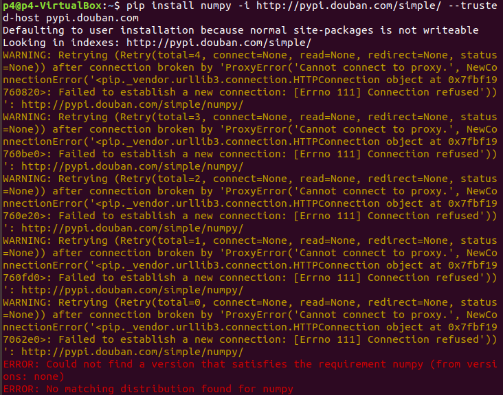

一般可以断定是网络代理出的问题。测试curl可以看出就是代理出的问题。

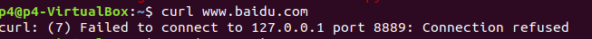

于是使用命令：查看端口使用情况

```bash
env | grep -i proxy
```

然后将自己报错的端口号占用进行一个移除操作，每个都要移除。

```bash
unset FTP_PROXY 
unset HTTP_PROXY 
unset HTTPS_PROXY 
unset ALL_PROXY 
unset NO_PROXY 
unset no_proxy 
unset all_proxy 
unset ftp_proxy 
unset http_proxy 
unset https_proxy 
```

然后pip就可以用了。

- **Ubuntu18 git报错**

  克隆GitHub仓库

  ``` shell
  git clone https://github.com/trekhleb/javascript-algorithms.git --depth=1
  ```

  出现错误

  ``` shell
  fatal: unable to access 'https://github.com/trekhleb/javascript-algorithms.git/': gnutls_handshake() failed: Error in the pull function.
  ```

  解决方法：`sudo apt update`, `sudo apt install openssl`


# # 一些操作系统的知识

## CPU、内存、I/O设备速度差异

1. CPU增加了缓存，以均衡与内存的速度差异；

2. 操作系统增加了进程、线程，以分时复用CPU，进而均衡CPU/IO设备的速度差异；

3. 编译程序优化指令执行次序，使得缓存能够得到更加合理的利用。

## buffer and cache 

- **buffer** ： ***缓冲区***，**用于平滑流速、衔接不同流速的设备**，进多少数据就一定要出多少数据

Buffer的核心作用是用来缓冲，缓和冲击，每当buffer满或者主动flush buffer的时候触发一次读取。比如你每秒要写100次硬盘，对系统冲击很大，浪费了大量时间在忙着处理开始写和结束写这两件事嘛。用个buffer暂存起来，变成每10秒写一次硬盘，对系统的冲击就很小，写入效率高了，极大缓和了冲击。

- **cache**  ：*** 缓存***，**用于减少对低速设备的访问**，进多少数据不用非要出多少数据，只是把常用的数据放在手边，用起来方便

即高速缓冲存储器，**一般位于CPU与内存之间**（很多IO设备例如硬盘、RAID卡上也有Cache，浏览器也有Cache），容量小但速度快。由于CPU快而内存慢，CPU不存在直接读/写内存的情况,**每次读/写内存都要访问Cache**。**Cache Line是cache与内存同步的最小单位**，典型的虚拟内存页面大小为4K，Cache line为32或64字节。Cache中**一般保存着CPU刚用过或循环使用的部分数据**，当CPU再次使用该部分数据时可从Cache中直接调用,这样就抹平了CPU与内存的速度差。Cache又分为L1、L2、L3（L1、L2一般集成在CPU上）。

两者的使用要根据具体应用场景来判断，**它们并不互斥**。

## 死锁

两个进程**独占性**的访问某个资源，从而等待另外一个资源的执行结果，会导致两个进程都被阻塞，并且两个进程都不会释放各自的资源，这种情况就是 `死锁(deadlock)`。

死锁可以发生在任何层面，在不同的机器之间可能会发生死锁，在数据库系统中也会导致死锁，比如进程 A 对记录 R1 加锁，进程 B 对记录 R2 加锁，然后进程 A 和 B 都试图把对象的记录加锁，这种情况下就会产生死锁。

- 资源

  大部分的死锁都和资源有关，在进程对设备、文件具有独占性（排他性）时会产生死锁。我们把这类需要排他性使用的对象称为资源(resource)。资源主要分为 可抢占资源和不可抢占资源


# 使用SSH 远程连接

### 用SSH工具XShell连接云服务器 root用户 

登录普通用户后：（普通用户的密码在云服务器提供商的控制台设定，普通用户想要用密码登录也需要如下`2`中的设定。当然，此时可能还没法用xshell登录修改，那么就使用云服务器提供商提供的服务器交互界面设置）

1. 切换到root角色
    `sudo su`

2. 修改SSH配置文件 /etc/ssh/sshd_config
    `vim /etc/ssh/sshd_config`

    修改PermitRootLogin和PasswordAuthentication为yes

    ``` shell
    #Authentication:
    PermitRootLogin yes # 默认为no，需要开启root用户访问改为yes
    
    # Change to no to disable tunnelled clear text passwords
    PasswordAuthentication yes # 默认为no，改为yes开启密码登陆，普通用户想要使用密码登录也需要yes此字段
    ```

3. 给root用户设置密码
    `passwd root`，然后根据提示输入密码。

4. 重启SSH服务使修改生效
    `/etc/init.d/ssh restart`

5. 登录
    在xshell中，直接使用root账号密码登录。

### 虚拟机(virtualbox为例)与vscode进行ssh连接

1. 首先给vscode安装`Remote-SSH`插件：

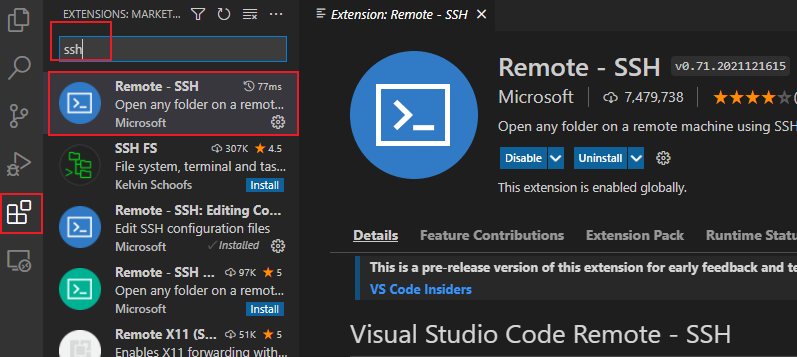

2. 在默认情况下，Virtualbox虚拟机选择的上网方式是：**网络地址转换（NAT），**这种方式虚拟机可以上外网，但是主机不能访问虚拟机，如果想要使用putty或者xshell连接虚拟机是办不到的。

    需要将连接方式改成桥接网卡：

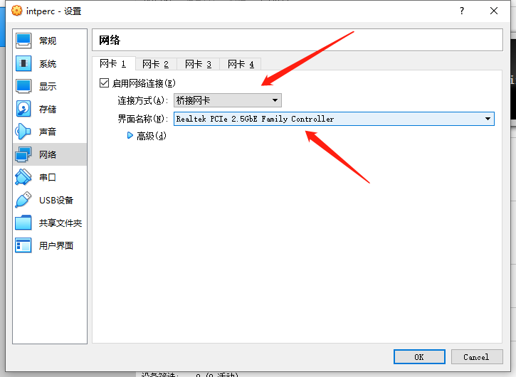

桥接网卡下方的名称，则要在【更改适配器选项】看宿主机目前在用的是哪个网卡：

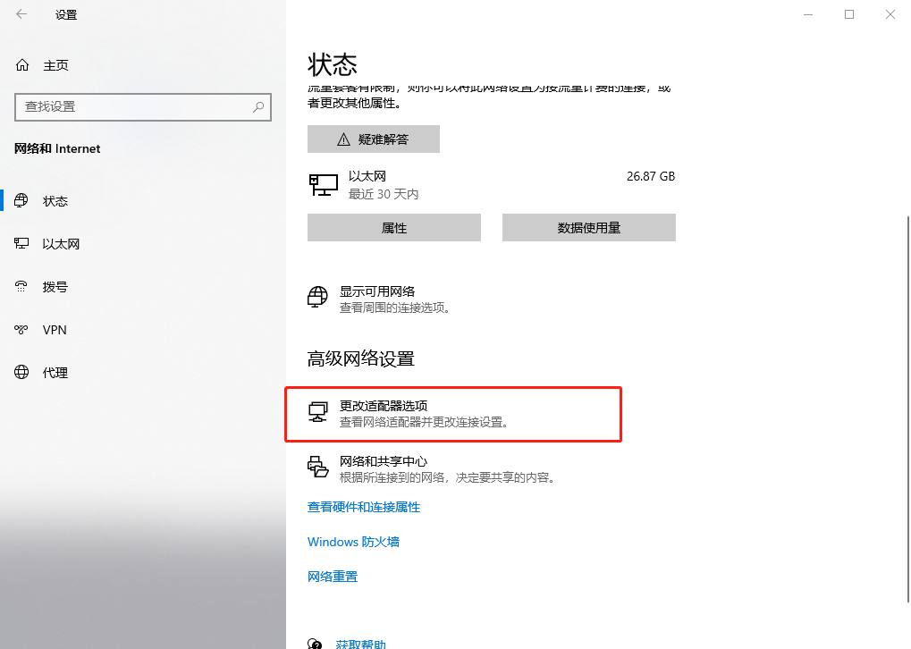

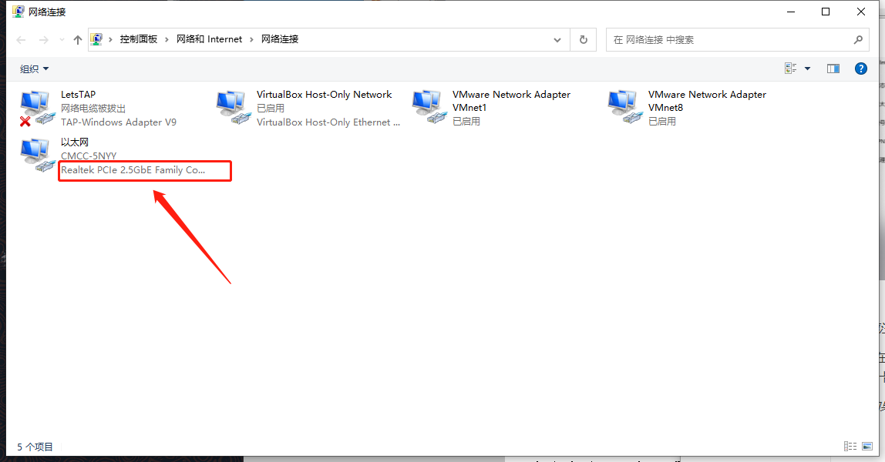

然后打开虚拟机，可以看到ip地址已经和宿主机在一个网段了。

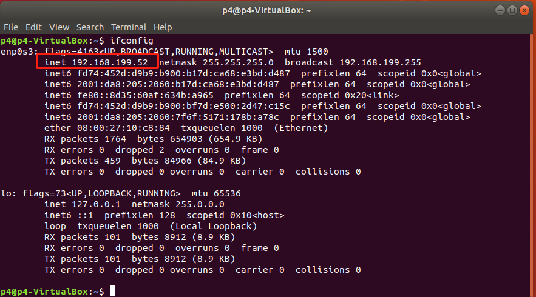

3. 在vscode里加入虚拟机地址

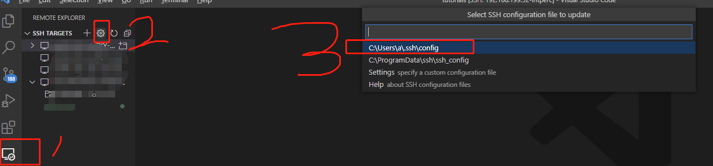

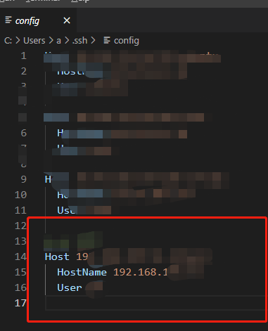

4. 然后连接-输密码就完事儿了

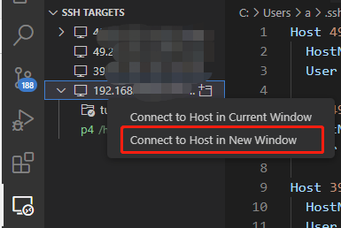

# Linux 安装

### 安装pycharm

[Ubuntu 18.04 安装 PyCharm_梦dancing的博客-CSDN博客_ubuntu安装pycharm](https://blog.csdn.net/qq_15192373/article/details/81091278)

此博客方案安装20版本以前的pycharm

### 安装中文输入法

安装ubuntu虚拟机18或20的时候可以选择中文版，如果选择语言为英文的话也可以之后再安装中文输入法（Chinese input method)

1. 在设置中安装 [(1条消息) ubuntu18.04下安装中文输入法_ubuntu18.04中文输入法_知其黑、受其白的博客-CSDN博客](https://blog.csdn.net/weiguang102/article/details/122522271)
2.  

### 安装高版本（3.8）的python

Ubuntu16.04默认安装了Python2.7和3.5，请注意，系统自带的python千万不能卸载！

使用命令 `python3 -V` 查看当前python3 版本: `Python 3.5.2`

如果直接使用 `sudo apt-get install python3.8` 安装的话会报错如下

``` sh
Reading package lists... Done
Building dependency tree       
Reading state information... Done
E: Unable to locate package python3.8
E: Couldn't find any package by glob 'python3.8'
E: Couldn't find any package by regex 'python3.8'
```

这是因为使用的ppa为旧版本，需要将ppa 更新：

``` bash
sudo add-apt-repository ppa:jonathonf/python-3.8

sudo add-apt-repository ppa:deadsnakes/ppa
```

然后系统更新：

``` sh
sudo apt-get update
```

最后安装python3.8

``` sh
sudo apt-get install python3.8
```

然后，我们希望默认的python3 的版本应该就是新安装的python3.8而不是之前的3.5，于是先将默认配置改为Python3.8：

``` sh
sudo update-alternatives --install /usr/bin/python python /usr/bin/python3.8 200
```

取消原本的Python 3.5 , 并将 Python3 链接到最新的python3.8 上：

```sh
sudo mv /usr/bin/python3 /usr/bin/python3-old
sudo ln -s /usr/bin/python3.8 /usr/bin/python3
```

`python3 --version` 查看Python的默认版本已经更改至了3.8。

并且可以进一步将python设置默认是python3.8版本，如下：

``` sh
sudo update-alternatives --install /usr/bin/python python /usr/bin/python2.7 1
# 这条命令用来从设置2.7的优先级，值得注意的是数字越小优先级越低
 
sudo update-alternatives --install /usr/bin/python python /usr/bin/python3.8 2
```

### 安装Typero

[(1条消息) 一文解决——linux免费安装typora_typora linux_令狐少侠、的博客-CSDN博客](https://blog.csdn.net/weixin_42905141/article/details/124071137)

文中将typora加入用户环境变量没必要，加一个快捷方式就行。

``` bash
cd /usr/bin
sudo ln -s /home/ubt/Typora-linux-x64/Typora  typora
```

然后就可以在任意位置的cmd里面召唤出typora了。

### 安装ryu

建议安装前先给虚拟机打一个快照，建议按照2、通过源码安装。

**1、直接使用pip3安装：**

``` bash
sudo pip install ryu
```

安装完成后使用命令查看ryu安装的位置

```bash
sudo pip show ryu
```

进入到ryu目录使用命令查看ryu是否能够运行

```bash
sudo ryu-manager
```

**2、通过源码安装**

安装一些python的套件：

``` bash
sudo apt install python-eventlet python-routes python-webob python-paramiko
```

git ryu 的源码：

``` bash
git clone https://github.com/faucetsdn/ryu.git
```

安装ryu的依赖

``` bash
sudo pip3 install -r tools/pip-requires
```

安装：

``` bash
sudo python3 setup.py install
```

测试是否安装成功：

``` bash
cd ~/ryu/ryu/app
# 打开ryu控制器
sudo ryu-manager simple_switch.py
```

使用mininet搭建一个网络，新开一个终端：

``` bash
sudo mn --controller=remote
```

不出意外的话会看到：

``` bash
ubt@ubt-vm:~$ sudo mn --controller=remote
*** Creating network
*** Adding controller
Connecting to remote controller at 127.0.0.1:6653
...
```

说明连上ryu了。

### 安装wireshark

Ubuntu18 安装自带 `wireshark Version: 2.6.10-1~ubuntu18.04.0`

这是wireshark需要用sudo执行 就是了。

### 安装python模块包

- 默认下载python2的包：`sudo apt install python-packageName`
- 改为下载python3的包：`apt install python3-packageName`

可能需要提前执行一下这个` sudo apt-get update`

注：【tkinter】这个包：`sudo apt install python3-tk`，当然只能给linux自带的python这样安装

##### python实现.py的带参数启动

- sys中的argv保存了启动时的输入参数，其中argv[0]为运行的文件名，输入参数从argv[1]开始

``` python
import sys
a = sys.argv[1]
b = sys.argv[2]
print(a,b)
print(str(int(a)+int(b)))
```

> argv[]中自动append启动时传入的参数，如果传入了多余的参数，在代码中没有引用是允许的；但是当没有相应的参数传入时，会报超出索引值的错误

##### python中执行shell命令：

1. os模块中的os.system()这个函数来执行shell命令

``` python
os.system('ls')
anaconda-ks.cfg  install.log  install.log.syslog  send_sms_service.py  sms.py
注，这个方法得不到shell命令的输出
```

2. commands模块#可以很方便的取得命令的输出（包括标准和错误输出）和执行状态位

``` python
import commands
a,b = commands.getstatusoutput('ls')
a是退出状态
b是输出的结果。
```

3. subprocess 模块允许我们启动一个新进程，并连接到它们的输入/输出/错误管道，从而获取返回值。

``` python
subprocess.call(command, shell=True)
#会直接打印出结果
subprocess.Popen(command, shell=True) 也可以是subprocess.Popen(command, stdout=subprocess.PIPE, shell=True) 这样就可以输出结果了。
```

### 安装java

-  安装openjdk-8-jdk：`sudo apt-get install openjdk-8-jdk`	
-  查看java版本，看看是否安装成功：`java -version`
-  剩余步骤见：https://blog.csdn.net/weixin_42763696/article/details/106799244

##### java中执行shell命令

``` java
public class TestDemo  {
    public static void main(String[] args) throws Exception{
        // test Shell
        Process p = null;
        p = Runtime.getRuntime().exec("python3 /home/sient/p4_start/src/test.py");
        // 这里要执行文件的话尽量写完整的绝对路径
//        p.waitFor();  // 使用waitFor的话就会让此Java程序一直等待上面执行脚本的进程结束才能继续执行Java
        System.out.println("执行");
    }
} 
```

### 安装mysql5.7

- 参见：https://www.bilibili.com/video/BV12q4y1U7sZ/

1. 首先，输入下列命令确保你的仓库已经被更新：` sudo apt update`
2. 现在，安装 **MySQL 5.7**，简单输入下列命令： `sudo apt install mysql-server`
3. 进行安全配置: `sudo mysql_secure_installation`，按y，然后会询问我们的强制密码强度，设置为0即可。
4. 设置一个至少8位的密码，然后y,y,n,n,y
5. 查看mysql是否正在运行 `systemctl status mysql.service`

- **连接mysql** :  `sudo mysql -u root -p`然后输入密码即可
- **查看自带的数据库** `show schemas`; 
- **重启mysql**：`sudo /etc/init.d/mysql restart `
- **查看mysql的启动状态** : `service mysql status  `

***接下来进行进行一些远程配置：***

1. 首先`sudo ufw status`查看防火墙是否开启，状态为inactive说明没有开启防火墙。

2. 进入mysql， 修改mysql访问权限

3. 输入`grant all privileges on *.* to 'root'@'%' identified by 'password' with grant option`; 授予所有权限给 库名.表名 to 用户@ip地址 , 通过密码"password" 确认连接

4. `flush privileges`立刻刷新权限生效

5. 然而此时的数据库还不能使用 *Navicat* 连接，（因为还没配置文件远程连接）：

  - 解决操作如下：

    在终端输入命令：`sudo vi /etc/mysql/mysql.conf.d/mysqld.cnf`将 **bind-address=127.0.0.1** 改成**bind-address=0.0.0.0**

    接下来进入mysql：

    ``` mysql
    use mysql;
    select user,host from user;
    # 给权限：
    update user set host='%' where host='localhost';
    # 刷新配置：
    flush privileges;
    ```

### 安装conda环境并安装pytorch

##### 安装anaconda

首先安装anaconda，版本选择不宜太新也不宜太旧，ubuntu18.04 自带python3.6，选择anaconda版本Anaconda3-5.3.0-Linux-x86_64即可。

使用wget 下载相应文件，并运行此sh：

``` shell
wget https://repo.anaconda.com/archive/Anaconda3-5.3.0-Linux-x86_64.sh
# 下载完成后运行此sh
bash Anaconda3-5.3.0-Linux-x86_64.sh
```

根据提示，敲击enter，输入yes，敲击enter。

安装完成后，会提示我们是否自动将anaconda加入当环境变量中，如下所示

``` shell
installing: anaconda-5.3.0-py37_0 ...
installation finished.
Do you wish the installer to initialize Anaconda3
in your /home/[用户名]//.bashrc ? [yes|no]
[no] >>> 
```

这里我们输入yes即可。

如果错过了这里也可以自己手动去`/home/[用户名]/.bashrc`文件的最后添加环境变量。内容如下：

``` shell
export PATH=/home/[用户名]/anaconda3/bin:$PATH
```

之后还会提醒我们是否安装vscode，一般输入no即可。

然后使用 `source /home/[用户名]/.bashrc` 保存更改。

至此，anaconda3会被安装在`/home/[用户名]/anaconda3`中

##### **检测是否安装成功**

打开新的终端后，进入自己的文件夹目录下，输入anaconda -V（注意a要小写，V要大写），conda -V ,显示版本信息，若显示则表示安装成功。

如果显示未找到此命令就运行  `source /home/[用户名]/.bashrc` 保存更改。

安装好后，以后每次进入服务器终端都会默认在conda 的base环境里，需要离开此环境使用`conda deactivate` 退出虚拟环境

##### Anaconda安装Pytorch

创建虚拟环境

> conda create -n pytorch python=3.7 （pytorch 是我自己取的名字）

激活环境

使用下面这条命令，激活环境：

> conda activate pytorch

然后命令行开头都会带上`(pytorch)`了，表示在此虚拟环境中。

（在该环境下，linux服务器的python/python3环境都被改成了conda的python3.7了）

然后去选择适合自己的pytorch版本，点击下面那个链接:

> https://pytorch.org/

我只下载了：

> conda install pytorch==1.13.1 torchvision==0.14.1  -c pytorch

弹出提示，输入 y，即可完成安装，显示“done”。

##### 测试torch安装成功

在终端输入python，

输入` import torch`，没有报错就是安装成功了。

输入`torch.__version__`可查看安装的torch版本。


conda命令：

`conda activate pytorch` 进入该环境

`conda deactivate` 退出虚拟环境


# # ECN

simple_switch_CLI --thrift-port 9091

register_read max_cwnd_reg


ecn_timer

register_read threshold

sudo sysctl net.ipv4.tcp_congestion_control=

 tcp_rmem=10240	87380	16777216

sudo tcpdump -i s1-eth1 -w s1-eth1.pcap


sudo tcpdump -i s1-eth1 -w renoi_modified_s1-eth1.pcap

sudo tcpdump -i s1-eth2 -w renoi_modified_s1-eth2.pcap

sudo tcpdump -i s1-eth3 -w renoi_modified_s1-eth3.pcap


INT收端：python ./receive.py

INT发端：python ./send.py


iperf -c 10.0.4.4 -i 1 -t 100 > renoi_modified_h1.txt

iperf -c 10.0.5.5 -i 1 -t 60 > renoi_modified_h2.txt

iperf -c 10.0.6.6 -i 1 -t 20 > renoi_modified_h3.txt

iperf -s -i 1


| CC算法         | 默认发包比例 | 带宽比 | queue_rate | 带宽(波动，100s均值) |
| -------------- | ------------ | ------ | ---------- | -------------------- |
| reno(改内核了) | 1 ：1：1     | 0      | 0          | 62.6                 |
| cubic          | 1:1:1        | 0      | 0          | 50~100, 74.9         |
| bbr            | 1:1:1        | 0      | 0          | 66~86                |
|                |              |        |            |                      |
|                |              |        |            |                      |

把参数添加到 `sudo vim /etc/sysctl.conf` 中，然后执行 `sudo sysctl -p` 使参数生效


# # quic python实现

### HTTP/3 server

You can run the example server, which handles both HTTP/0.9 and HTTP/3:

```sh
python examples/http3_server.py --certificate tests/ssl_cert.pem --private-key tests/ssl_key.pem
```

### HTTP/3 client

You can run the example client to perform an HTTP/3 request:

```sh
python examples/http3_client.py --ca-certs tests/pycacert.pem https://localhost:4433/
```


首先使用命令：查看端口使用情况

```bash
env | grep -i proxy
```

然后将自己报错的端口号占用进行一个移除操作，每个都要移除。

```bash
unset FTP_PROXY 
unset HTTP_PROXY 
unset HTTPS_PROXY 
unset ALL_PROXY 
unset NO_PROXY 
unset no_proxy 
unset all_proxy 
unset ftp_proxy 
unset http_proxy 
unset https_proxy 
```

然后pip就可以用了。

