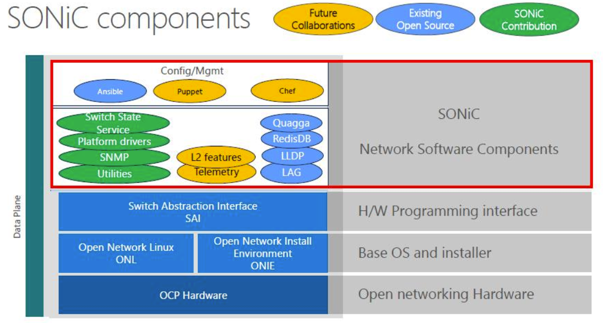
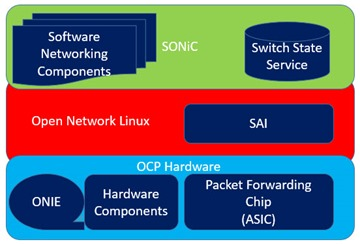
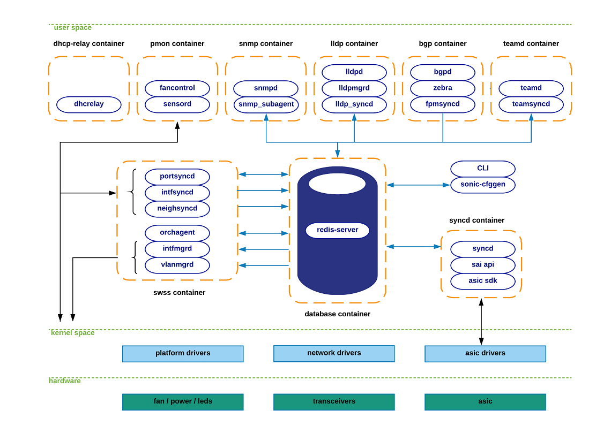
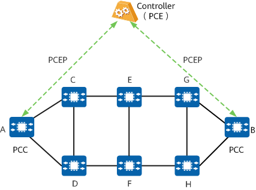

https://github.com/Azure/SONiC/wiki/Architecture

SONiC是**构建网络设备（如交换机）所需功能的软件集合**。它可以通过交换机换抽象接口（SAI）运行在不同的ASIC平台。

**SAI**向上给SONiC提供了一套统一的API 接口，向下则对接不同的ASIC。

SONiC 是**构建交换机网络功能的软件集合**，**它需要运行在Base OS上**。SONiC所使用的Base OS 是ONL (Open Network Linux ) 。ONL是一款为白盒交换机而设计的开源Linux操作系统，ONL中包括了许多硬件（温度传感器、风扇、电源、CPLD控制器等）的驱动程序。

SONiC是一个将传统交换机操作系统软件分解成多个容器化组件的创新方案，这使得增加新的组件和功能变得非常方便。（SONiC路线图 ：https://github.com/Azure/SONiC/wiki/Sonic-Roadmap-Planning ）

SONiC Open Source
这是重头戏，主要包含了SAI API、ASIC Control Software、Object Library三块。

- SAI(Switch Abstraction Interface)是标准的C语言API，有特定的交换机ASIC的SDK实现。
- ASIC Control Software是指SWSS(Switch State Service)，主要是收集硬件交换机的状态信息。
- Object Library

下图是这些容器的结构图以及如何容器之间如何进行交互。**蓝色箭头**来表示与集中式redis引擎的交互，**黑色箭头**来表示其他的交互（netlink, /sys file-system, etc）。SONiC的配置模块sonic-cfggen和CLI是存在于Linux主机中的模块。

SONiC和SAI支持的ASIC芯片厂商及其对应产品为： 

将SONiC和Base OS、SAI、ASIC平台对应的驱动打包制作成为一个文件，这个文件才是可直接安装到白盒交换机的NOS镜像 。SONiC目前已经可以运行在Accton/EdgeCore 、Dell和Mellanox等厂商的白盒交换机上。SONiC社区提供一些制作好的NOS镜像 ： https://github.com/Azure/SONiC/wiki/Supported-Devices-and-Platforms

## **SONiC**

**SONiC** 是一个**开源的网络操作系统**，它主要用于云计算和大规模数据中心环境。它是**构建网络设备所需功能的软件集合**，它可以通过**交换机换抽象接口（SAI）**运行在不同的ASIC平台。各个模块以**docker容器**的形式协同工作，各个模块的数据交换和共享使用**redis数据库**实现。

## 名词缩写

- **SONiC**： Software for Open Networking in the Cloud

- **SAI**： Switch Abstraction Interface  
- **SWSS**：Switch State Service 

## SONiC支持的协议

- **BGP-LS**（BGP-Link State）协议：BGP-LS是一种在路由器之间交换链路状态信息的协议，它可以为网络拓扑提供实时和精确的视图。BGP-LS协议将链路状态信息编码为BGP消息，并允许网络设备之间交换这些消息，以构建整个网络的拓扑视图。

- **Telemetry** 遥测：SONiC提供了对遥测数据的收集和处理功能。它支持多种遥测协议和机制，包括但不限于：
    1. gRPC：gRPC是一种高性能的、开源的远程过程调用（RPC）框架，SONiC可以使用gRPC进行设备之间的通信和遥测数据的传输。
    2. OpenConfig：OpenConfig是一种开放式的配置和状态数据模型，SONiC支持OpenConfig数据模型，可以使用OpenConfig定义和收集遥测数据。
    3. Telegraf：Telegraf是一种开源的遥测数据收集器，SONiC可以与Telegraf集成，将遥测数据发送到指定的监控系统或存储库中

- **BGP**（Border Gateway Protocol）。BGP是一种用于自治系统（AS）之间的路由选择和交换的协议。它在互联网中广泛使用，用于交换路由信息，决定最佳路径，并实现互联网的路由和可达性。

- SONiC（Software for Open Networking in the Cloud）暂时**不支持PCEP**（Path Computation Element Protocol）。PCEP是一种用于路径计算的协议，它允许网络中的路径计算元素（PCE）计算和分配路径，并将路径信息传递给网络设备。PCEP可用于优化网络路径、进行流量工程和路由计算等应用。

    PCEP（Path Computation Element Protocol）是IETF PCE（Path Computation Element）工作组定义的基于TCP的协议。它定义了一组消息和对象，用于管理PCEP会话，以及为多域流量工程LSP（TE LSP）请求和发送路径。PCEP为PCE给PCC的域外LSP执行路径计算提供了一种机制。PCEP交互包括PCC向PCE发送的LSP状态报告，以及PCE对LSP的托管和优化。

在大型的多区域网络中，路径计算非常复杂。在某些场景下，为了完成路径计算，需要在控制器上部署特殊的计算组件，并需要不同区域中的节点之间协作。这使得网元在进行路径计算时效率低，还会降低网元本身的转发性能。

PCE最早是为了解决大型的多区域网络路径计算问题而被提出，通过PCE可以为TE计算跨域路径。如下图所示，PCEP网络包含如下3个部分：

1. PCE（Path Computation Element，路径计算单元）：PCE是能够基于网络拓扑信息计算满足约束的路径的部件。PCE可以部署在路由设备中，也可以部署在一个独立的服务器中。大多数时候，PCE和控制器是集成在一起的。
2. PCC（Path Computation Client，路径计算客户端）：PCC是请求路径计算单元执行路径计算的客户端应用程序。PCC向PCE发送路径请求，并接受PCE返回的路径计算结果。一般情况下，路由设备集成了PCC功能，可以认为路由设备就是PCC。
3. PCEP（Path Computation Element Protocol，路径计算单元通信协议）：PCEP是PCE和PCC、PCE和PCE之间的通信协议。

- **Netconf**（Network Configuration Protocol）。Netconf是一种用于配置和管理网络设备的协议。它使用XML（可扩展标记语言）格式来定义和传输配置和状态信息，并提供了对网络设备的远程配置和管理的能力。

- 流量分类：SONiC（Software for Open Networking in the Cloud）可以进行流量分类。

流量分类是指根据不同的标准或规则将网络流量划分到不同的类别或优先级中。通过流量分类，可以实现对不同类型的流量进行不同的处理和控制，以满足特定的网络需求和策略。

SONiC提供了多种方式来进行流量分类：

1. ACL（访问控制列表）：ACL是一种用于过滤和分组网络流量的机制。在SONiC中，可以使用ACL来定义流量分类规则，并根据规则对流量进行分类和处理。
2. QoS（Quality of Service）：QoS是一种用于对网络流量进行优先级和资源分配的机制。在SONiC中，可以使用QoS策略来对不同类型的流量进行分类和优先级配置，以实现不同的服务质量和资源控制。
3. DSCP（Differentiated Services Code Point）：DSCP是一种用于标识和区分网络流量的字段。在SONiC中，可以使用DSCP字段来对流量进行分类和优先级配置，以便网络设备和服务能够根据DSCP字段进行适当的处理和转发。

- **故障快速定位和恢复**：SONiC（Software for Open Networking in the Cloud）可以进行故障快速定位和恢复。

SONiC作为一个开源的网络操作系统，提供了多种功能和机制来实现故障快速定位和恢复：

1. 链路状态监测：SONiC可以监测网络设备之间的链路状态，包括链路的可用性和质量。一旦发现链路故障或异常，SONiC可以立即进行相应的处理和通知。
2. 路由协议：SONiC支持多种路由协议，如OSPF（开放最短路径优先）、BGP（边界网关协议）等。这些路由协议可以自动调整网络拓扑、重新计算最佳路径，并实现故障恢复。
3. 网络监控和告警：SONiC可以通过监控网络设备和流量，检测故障和异常情况。它可以生成告警，并提供相应的诊断和恢复建议，以帮助快速定位和解决故障。
4. 热备份和冗余：SONiC支持热备份和冗余机制，例如使用VRRP（虚拟路由冗余协议）来实现设备的冗余，以确保在主设备故障时能够快速切换到备用设备。
5. 可编程性和自动化：SONiC具有可编程性和自动化的特点，可以通过脚本和自动化工具来快速定位和修复故障。它还支持REST API和CLI等接口，方便进行远程控制和管理。