这个模块将把发现的网络拓扑转换为图形G表示，以实现有效的管理目的。为此，我们使用了Networkx工具[58]，这是一个纯python包，具有一组用于操作网络图的强大函数。

58] D.A. Schult , P. Swart , Exploring network structure, dynamics, and function using networkx, in: Proceedings of the 7th Python in Science Conferences (SciPy2008) (Vol. 2008, 2008, pp. 1 1–16 . 

## 流量预测

**ResNet-GCN-LSTM模型**，

ResNet : [4] He, K., Zhang, X., Ren, S., et al. Deep residual learning for image recognition [A].  // Proceedings of the IEEE conference on computer vision and pattern recognition [C], 2016: 770-778.

修改GCN，在其中加入ResNet

> 基于短期流量预测的SDN网络智能调度
>
> 不要光写流量预测，要让它服务于调度
>
> 该论文中：
>
> 然而，已有研究表明，叠加多个GCN层不仅会导致反向传播过程中复杂度提高，而且会导致梯度消失[35]，[36]，从而降低更深层次GCN的性能。
>
> 相比于地铁站流量，交换机流量当然不会分别考虑流入和流出。因为网络流量必然是流入多少就流出多少。各个链路上的流量就是相应交换机出口流量。
>
> 
>
> **实验：**
>
> 在时间尺度上对比：设置多个时间步长的预测实验，假如都是1ms采一次样，那么就设置 3s，5s，10s 分别实验。
>
> 在方法尺度上对比：与多种其他预测方法相比较，得到对比实验图。
>
> 在流量模型上对比：使用不同的流量模型（核心网，接入网，数据中心网）对该预测模型的性能进行测试，得到对比实验图，反应该模型在各种流量模型下都具有有效的预测性能。
>
> 但多个流量模型也不太好，人可能更喜欢精细的场景
>
> 
>
> 各个模型的优势：
>
> 提出了基于ResNet的地铁站点间深度抽象空间相关性模型，基于GCN的地铁站点间网络拓扑信息提取模型，基于注意力LSTM的地铁站点间时间相关性模型。
>
> 提出残差学习的思想。传统的卷积网络或者全连接网络在信息传递的时候或多或少会存在信息丢失，损耗等问题，同时还有导致梯度消失或者梯度爆炸，导致很深的网络无法训练。ResNet在一定程度上解决了这个问题，通过直接将输入信息绕道传到输出，保护信息的完整性，整个网络只需要学习输入、输出差别的那一部分，简化学习目标和难度。

**相关工作**:

- 为了实现拥塞避免，最直接的方法是增大交换机的缓存来防止网络流量聚合导致发生拥塞。不同流量模型下缓存大小与丢包率之间的关系：基于机器学习的网络流量预测与应用研究.pdf

- 多场景流量建模：基于机器学习的网络流量预测与应用研究.pdf
- 实现了多个流量预测模型：基于 ST-LSTM 神经网络的网络流量预测方法研究.pdf

**预 测 的 流 量 序 列与 网 络 链 路 拥 塞 风 险 的 关 系**： `基于机器学习的SDN流量调优系统.pdf`

网 络 拥 塞 的 一 个 特 点 是丢 包 大 量 发 生 。 网 络 转 发 设 备 具 有 一 定 缓存 能 力 ， 因 此 短暂的 、 偶尔 的 突 发 流 量 并 不 会 造 成 丢 包 。 丢 包 的发 生 应 该 是 较 长时间 、 较多的 流 量 突 发 造 成的 。 因 此 通 过 预 测 流 量 序 列 得 到一 个 统 计 意义 上 的 预 测 流量峰值， 该 峰 值 表 征 未来一段时间  流 量突 发的 平 均 水 平 。 如 果预 测流量 峰 值 达 到 或 超 过 链 路 额 定带 宽的 一 定 比 例 ， 则 认 为 网 络 链 路 发 生 拥 塞的 风 险 较 高 。

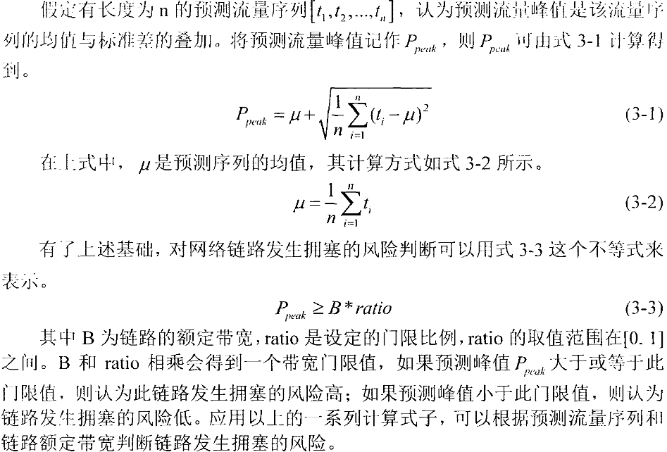

将网络流量的变化作为重要的触发流量预测的条件或直接作为预测的入参，或者直接周期性的交换机发生流量信息给控制器。

使用间隔采样解决了预测误差累积的问题：

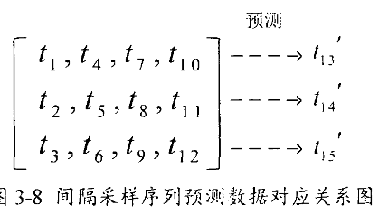

流量峰值，流量QoS，流量类型都可以是模型输出结果。

边缘交换机在遇到大流时向控制器发送消息让其进行预测

对SDN网络中**转发节点进行重要度排序**：基于LSTM的SDN网络流量预测研究.pdf

SDN控制器

- **集中式SDN控制器**：使得数据面与控制面间的通信管道 记忆 自身的计算能力 成为网络瓶颈
- **分布式SDN控制器**：更适应于大规模网络，另一方面往往带来了负载均衡问题，在SDN网络中负载均衡问题体现在两方面：
    - 数据面的负载均衡问题，使得部分链路负载高而部分链路负载低，网络整体性能差
    - 控制面的负载均衡问题，主要讨论的是如何充分利用各个控制器的资源。某些控制器负载高而某些控制器负载低影响全网的性能。

流测度：

网络流量预测增强的高效分布式大流检测研究

TCM 图概要算法压缩流量矩阵

预测的大流的剩余长度也是一个重要指标

**网络流定义**为符合某种规范以及超时约束的一系列数据包的集合[35]。这里的流规范主要 有：五元组（源 IP 地址、目的 IP 地址、源端口、目的端口、协议）、二元组（源 IP 地址、目 的 IP 地址）、目的 IP 地址等，这里的流规范也称为流标识；超时约束是指超过一定时间不再 通信的流就认为是已结束，是按照时间划分流的一种方式。流表示的是一条端到端的通信状 态，按照方向性又可以分为有向流和无向流，无向流不区分源 IP 地址（源端口）和目的 IP 地 址（目的端口），比如对于二元组无向流，源 IP 地址为 A，目的 IP 地址为 B 的二元组流与源 IP 地址为 B，目的 IP 地址为 A 的流定义为同一条流

在数据包中获取时间戳来得到时间信息，属于同一条流量的数据 包具有相同的部分特征，例如数据包的大小和间隔等

流量 [源IP，目的IP，源端口，目的端口，协议，时间戳 ]

流量的特征又分为流量特征和包特征，采集流量特征进行 流量分类是在流的数据上进行，不同网络应用产生的流量在流量的特征上表现不 同，如浏览网页时产生的流量一般持续时间短，但带宽要求大。语音通话流量持续 时间长带宽要求小。不同种类的流量在数据包特征上亦有差异。所以可以提取数据 包、流量的特征数据作为机器学习的训练数据，训练可以进行流量分类的神经网络 模型。

实验使用 CICFlowMeter 软件对流量特征进行采集，使用 CICFlowMeter 处理 存储流量的 pcap 文件，CICflowmeter 从 pcap 文件中获取数据包将流量特征添加到 训练数据库中。

在长时间的通信连接中，可能会产生多次流量，这些流量里的数据包都是具有相同的源目 ip 和源目端口号以及通信协议。这种情况 下如果不考虑时间戳信息会把两次流量的数据包识别为一次流量。为了更准确地 区分数据包属于哪一条流量，需要加入时间戳参数，一条流的最后一个数据包与后 一条流的第一个数据包时间间隔要比流量内数据包时间间隔长，所以引入硬超时 时间和软超时时间。

**流量矩阵**：

`互联网流量矩阵：入门` ； `结合流内相关性和流间相关性进行流量矩阵预测`

流量矩阵可以完整地描述网络中所有流量的分布，是网络规划、网络管理以及流量工程 （Traffic Engineering）中的关键参数

服务器端口、数据包字节中位数、数据包总数、ACK 数据包总数等

### **流量数据集**：

本文使用的预训练网络流量数据选择的是由WIDE项目MAWI工作组维护的从日本到美国的某条骨干网络的网络流量，仅使用了其中某观测点2022年4月13日一天24小时的流量观测数据。

[MAWI Working Group Traffic Archive (wide.ad.jp)](http://mawi.wide.ad.jp/mawi/)

1. How can I cite the datasets in my paper?

    Kenjiro Cho, Koushirou Mitsuya and Akira Kato.
    "Traffic Data Repository at the WIDE Project".
    USENIX 2000 FREENIX Track, San Diego, CA, June 2000.

美国 Abilene 骨干网络数据集[48]和无线 Mesh 网络 UCSB（University of California, Santa Barbara）数据集 [49]，

本实验采用 CAIDA passive 2016 数据集[55]，该数据集是来自 CAIDA 的 Equinix-Chicago 监视器的匿名被动流量 trace，是美国西雅图和芝加哥之间的高速主干链路流量数据，其数据 格式为 pcap 文件，此数据集可用于研究互联网流量的特征，包括流量的分布、流长以及流持 续时间等。

可用：该数据集自美国纽约 Equinix 数据中心上 equinix-nyc 网络数据监视器[111]

[111] [Passive Monitor: equinix-nyc - CAIDA](https://www.caida.org/catalog/datasets/monitors/passive-equinix-nyc/)

[48] The Abilene Dataset 2004[EB/OL].http://www.cs.utexas.edu/~yzhang/research/AbileneTM/. 

[49] The UCSB Dataset 2007[EB/OL].http://moment.cs.ucsb.edu/meshnet/datasets.

[55] The CAIDA Anonymized Internet Traces 2016[EB/OL].http://www.caida.org.

> When referencing this dataset, the use agreement requires inclusion of the following text: 
>
> The CAIDA UCSD Anonymized <YEAR> Internet Traces - <dates used>
> https://www.caida.org/data/passive/passive\_<YEAR>\_dataset

[50] Moore A. ， Zuev D., Crogan M., et al. Discriminators for use inflow-based classification [M]. London: Queen Mary Universityof London, 2005.

本文采用网络公开数据集“ICSX VPN-nonVPN”，该数据集由捕获 到的不同应用程序流量的大小为 1.4GB 的 PCAP 格式文件[60]

[60].Draper-Gil G, Lashkari A H, Mamun M S I, et al. Characterization of encrypted and vpn traffic using time-related[C]//Proceedings of the 2nd international conference on information systems security and privacy (ICISSP). 2016: 407-414.

**流量生成**：

**mininet生成流量**：基于机器学习的SDN流量调优系统.pdf 40页

不同的理论模型： 基于机器学习的网络流量预测与应用研究.pdf

SDN网络智能流量调度平台设计与实现_崔金鹏.pdf 中有相关的。

表 3-1 训练数据采集的流特征：SDN网络智能流量调度平台设计与实现_崔金鹏.pdf

为了完成实时流量分类的任务，上述数据的采 集在流量刚刚开始的指定时间窗内完成。

TCP流以FIN标志为结束，UDP以设置的flowtimeout时间为限制，超过时间就判为结束。统计一个流中的统计信息作为提取的特征。且统计的特征都分前后向，规定由源地址到目的地址为正向，目的地址到源地址为反向，为每个流构建一个标志叫Flow ID:`192.168.31.100-183.232.231.174-46927-443-6`,由源地址、目的地址、协议号组成。

图 3.5 显 示了经过以上步骤处理后的数据包长度概率密度分布图，如柱状图所示，数据集 中的数据包长度变化很大。

现 实 中 网 络 流 量 有 潮 汐 效应 ， 即 在 有 些 时 间 段 ， 网 络 中 流量 大 小 会 比 均 值 大 许 多 。 比 如 移 动 网 络 中 的 流 量 ， 在 晚 上 八 点 左 右 会 出 现 流量 高 峰 。 现 实 中 的 流 量 还 具 有 周 期 性 ， 如 以 天 或周 为 观 察 周 期 ， 流 量 的 变 化 模 式 相 近 。 高 效 避 免 网 络 流 量 拥 塞 是 本 论 文 的 主 题 。 现 实 中 网 络 流 量潮 汐 效 应 带来的 流 量 激 增 可 能 会 导 致 网 络拥 塞 ， 这 也 是 本 文 提 出 的 拥 塞 避 免 机 制 要 处 理 的 一 种 情 况 。 设 计 了 如 图 ５ － ９ 所 示 的 网 络 分 发仿 真 流 量 ， 以 拟 合 前 面 提 到 的 现 网 流量 的 **潮 汐 现 象 和 周 期性** 。

首先在各自交换机上运行程序手机流量信息，当发现大变化流是才通知控制器进行预测等行动

**在单个虚拟或物理网络设备上收集负载和流量统计信息**已经得到了广泛的研究[52,53]，在 设备上收集的数据用于在交换机内做出本地决策。

[52] Basat R B, Einziger G, Friedman R, et al. Heavy hitters in streams and sliding windows[C]//IEEE INFOCOM 2016The 35th Annual IEEE International Conference on Computer Communications. IEEE, 2016: 1-9. 

[53] Basat R B, Einziger G, Friedman R, et al. Optimal elephant flow detection[C]//IEEE INFOCOM 2017-IEEE Conference on Computer Communications. IEEE, 2017: 1-9.

**全局测量**是在数据平面的一些网络设备中收 集测量数据，然后集中式的控制器合并从网络测量点收集的数据，并创建整个流量的网络范 围视图[54]。

本实验基于 P4 的可编程网络运行环境需要用到的工具有：protobuf、grpc、PI、behavioralmodel[58]、p4c 和 mininet。protobuf 是一种二进制的数据传输格式，效率和兼容性都很好。grpc 是一个通用、高性能的开源 RPC 框架。behavioral-model 简称 BMv2，是一款支持 P4 编程 的软件交换机。p4c 是 P4 语言推荐的编译器。mininet 是一个网络模拟器，用于搭建包含虚拟 主机、交换机、控制器和链路的网络拓扑。

**流量重放工具 tcpreplay** 对 CAIDA 流量的 pcap 文件进行重放。

**流量预测对比实验**：与经典LSTM，ARIMA模型对比

**流量预测具体步骤：** 在对模型进行训练和效果测试中，先使用 wireshark 在网络中抓包流量数据存储为 pcap 文件，再使用 CICFlowMeter 软件从 pcap 文件中提取特征。在每到达一条新流（已建立TCP为标志）的时候就执行预测。

 预测的结果：流量类型，流量Qos需求。

就简单分为大象流和老鼠流。针 对突 发 性 强 的 自 相似 流 量 则 调 用 流 量 预 测 模 型 进 一 步 采 用 Ｌ Ｓ ＴＭ 算 法 对 流 量 做 出预 测 ，结 合 当前链 路 状 态 ， 预 测 流 量 的 链 路利 用 率超 过 ９０ ％ 时 进 行 路 由 调 整 ， 控制 器 下 发 流表 ， 进 行 分 ＾ 避 免 流 量 突 发 造 成 网 络性 能 恶 化 。

对流量建模，核心网流量 - 泊松分布，。。。 突发大流---   `基于机器学习的网络流量预测与应用研究.pdf`

根据棣 莫 佛 一 拉 普 拉 斯定 理 ， 使 用 大 量 主 机 相 互 独立 地 产 生 流 量 ， 汇 集 起 来 的流 量 即 具 有 高 斯概 率 分 布 函 数 。

在 本 文 的 网 络 仿 真 平 台中 ， Ｏ Ｎ Ｏ Ｓ 控 制 器 利 用 Ｏ ｐ ｅｎＦ ｌ ｏ ｗ 南 向 协 议 向 Ｏ Ｖ Ｓ端 口 主 动 获 取 流 量 数 据 ， 进 行 数 据 采 集 设 置 ， 每 １ 秒 读 取 一 次 流 量 信 息 ， 得 到 流 量 时 间 序 列 ， 存 入 内 存 中 ， 等 待 进 一 步 处 理 。`基于机器学习的网络流量预测与应用研究.pdf`

利 川 流 量 预 测 序 列 判 断 链 路 拥 塞 风 险 的 具 体场 景 ， 采 用 间 隔 采样  的 样 本 提 取 方 式 和 利 用 全 连 接 层 扩 展 输 入 向 量 长 度方 式 ， 实 现 了 便 于预 测 链路 拥 塞 风 险 的 Ｌ Ｓ Ｔ Ｍ 流 量 预 测 模 型。

发 现 本 文 提出的 基 于 链路拥 塞 风 险的流 量 调 优 机 制 能 够 以 尽 可 能少 的 额 外 通 信 开 销 避 免 网 络 拥 塞 发 生 ，实现了拥塞避免。

利用链路利用率达到60%来判断这条路是不是高风险链路

该 机 制 以 对 网络新增数据 流［ １５ ］ 的 差 异 化 处 理 来 预 防 网 络 拥 塞 的 发 生 ， 具 体 的 工 作流 程 见 图３ － ５ ．

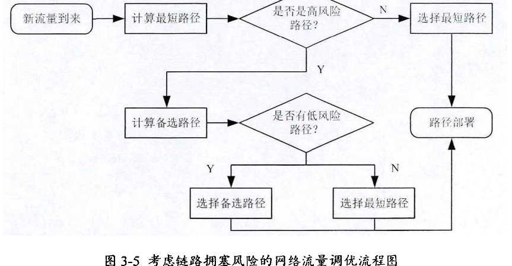

流量预测：

- 针对链路拥塞风险的链路预测模型

    鉴 于 链 路 拥 塞 风 险 判 断需 要 一 段 时间 的 流 量 预 测 序 列 ， 而 非 单 个 的流 量 预测  点 ， 使 用间 隔 采样 的 方 式 构 造 输 入 数 据 集。根 据 流 量 预 测序 列和 链 路 额 定 带 宽 判 断 链 路拥 塞 风 险 。考虑 链路 拥 塞 风 险 的 流 量 调 优 机 制能够 考 虑 到 网 络 链 路 动 态 信 息 及  变 化趋 势 ， 有 针 对 性的 对 高 拥 塞 风 险的链 路 分 流 ， 而 对 低 拥 塞 风 险的 链 路 保 留 最 小 通 信 开 销 的 流 量 分 配 方式 。 以 此 来 以 最小 的 额外 网 络 资 源 开 销 避 免拥塞 发 生 ， 因 此 具 有 重 要 的 现 实 意 义 和 理 论 意 义 。

    机器学习模型根据过往的链路数据学习当前网络的流量模型，并根据近期的流量数据预测未来一段时间的流量序列。

## 路径迁移

【面向数据中心网络的流量均衡机制研究_李春强】 将多种选路策略总结的极好，我们的方案是 根据全局传输路径状态的选路方案

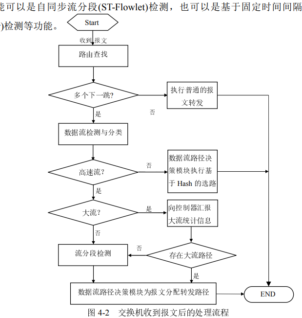

全局拥塞风险最小为目标 --- 》 最小化网络内最大链路利用率：

定性分析：

- 一条流经过的交换机越多，拥塞风险越大。
- 一条链路的链路利用率越大，拥塞风险越大。

NP-hard问题？ 启发式路由算法

比较指标：流完成时间

比较谁：DC-TCP ， QCN ， 等价多路径ECMP, 最短路径算法【Eppstein D. Finding the k shortest paths[J]. SIAM Journal on computing, 1998, 28(2): 652-673.】

流量预测后只是简单地根据各个链路的剩余带宽水平进行重新分配数据（这样就避免 了拥塞），然而重新分配的链路通常不是路径最短链路或者其他指标较好的链路了（因为网络时常在变化，并假设此时不会再触发链路预测后的调路了），为了提高链路利用率以及降低发生拥塞的概率（一般来说，流量转发经过的交换机越少，发生拥塞的概率越小），我们需要基于强化学习的路径迁移，并要防止出现下图的情况。（此图来自：Fast Lossless Traffic Migration for SDN Updates）

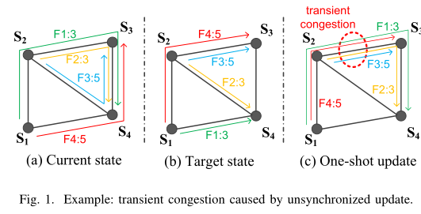

（一条流经过的交换机越多，占用的整体网络资源就越多。）

> 交换机i,j之间的光纤链路容量定义为Cij，下一时刻的流量大小定义为bij，由预测得到的流量矩阵计算得到。每条链路的链路利用率定义为 aij =  bij / Cij ，路径**迁移的目标是最小化最大链路利用率：**
>
> Minimize  max{aij}
>
> subject to :
>
> bij < Cij,
>
> > **我这个是通过交换机到终端的流量大小预测出交换机的出口流量，通过出口流量得到下一时刻链路中的流量。**
>
> 贪婪算法 / 启发式算法
>
> 算法步骤  阈值触发，动态设置，当前流量变化太快了就重新设置阈值
>
> Input：超过阈值的链路的流集合flow_set （当然是链路两端交换机都包含的流，因为链路流量大小由两端交换机出口流量相加得到）
>
> ​				当前最大链路利用率 a1
>
> for flow_set中所有流进行调整后，最大链路利用率有变小时 do： (当flow_set中所有流调整后发现都难以再使目标变小时，说明此时已得到最优)
>
> ​		（最好再加一个判断，最大链路利用率再阈值之下就不变了）
>
> ​	for flow_set中的可调整路径集合path_set do:
>
> ​		根据此时的全局转发表 计算得到此path_set集合中路径迁移后得到的最小的全局最大链路利用率a2
>
> ​		并保留a2对应的全局转发表table1
>
> ​	if a2 < a1:	# 到这一步就一定会对网络进行更新了，当然还可能继续计算，但此时的状态要保存到变量中了。
>
> ​		更新需调整的链路的流集合flow_set为a2对应的链路的集合。
>
> ​		更新全局转发表
>
> ​	else:  # 表示当前链路再怎么调整都不会调整得到更小的目标了
>
> ​		退出循环
>
> if 全局转发表如果有更新:
>
> ​	下发流表
>
> 
>
> 整理上述思路后：
>
> Input：所有链路的流量矩阵*flow_set,* 最大流量值 *max_flow*, 
>
> while : 当前最大流量值*max_flow* 大于 阈值 do：
>
> ​     针对最大流量*max_flow*所在链路，根据路由表选出两端交换机注入到该链路的流量集合 *adjustable_flows_set*
>
> ​     for *f* in *adjustable_flows_set* : 
>
> ​          根据路由表选出流量 *f* 的可调整路径集合*adjustable_*path_set
>
> ​          for *p* in *adjustable_*path_set :
>
> ​              根据此时的全局链路流量矩阵以及路由表，计算出将*f* 调整到*p* 后的网络最大链路流量mf;
>
> ​              if mf < max_flow:
>
> ​                   将mf 放入调整后最大链路流量集合adjusted_flow_set中；
>
> ​                   将mf 对应的调整策略放入可选策略集合optional_strategy_set中;
>
> ​     选出adjusted_flow_set 中的最小值adjusted_flow在optional_strategy_set 所对应的调整策略 best_strategy。
>
> ​     应用best_strategy 进行路由调整。
>
> ​     同时更新*max_flow* 为 adjusted_flow。 
>
> 

总体要保证拥塞避免：

在突发流量时：通过流量预测，根据预测的链路剩余带宽分配链路。【解决了局部拥塞】

无突发流量但有链路冗余时：根据去除冗余分配链路。【减少了整体的拥塞风险】

构建整体拥塞风险最小的最优化模型：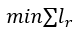

如何量化拥塞风险：建库，控制器记录每个流的流量信息的库（流信息：【源目IP，源目应用层端口，应用层协议】，峰值，平均值，峰值占比，当前经过的交换机，总持续时间），（为防止库快速膨胀，需要给每条记录设置超时时间），根据这些流库信息和网络信息判断每条路径的拥塞风险。（学习的方法）

Flow Migrations : Flow Migrations in Software Defined Networks:
Consistency, Feasibility, and Optimality

我们探讨了网络流迁移的三个特性:**一致性、可行性和最优性**。一致性要求在整个迁移过程中满足所有流的带宽需求，更新过程中不存在拥塞和丢包。

由于对丢包率的要求很高，一致性是流迁移最重要的特性。但是，由于带宽资源不足，可能不会一直存在一致的流迁移。因此，我们用可行性来指是否存在一致的流迁移。

如果存在多次一致的流迁移，则会提高最优性。这意味着要找到占用最少空闲资源的计划来完成更新。本文探讨了SDN更新中一致性约束下流量迁移的可行性和最优性。

**方法：强化学习**

选择最优路径时，要考虑到链路时延、可用带宽、丢包率、链路利用率 4 个因素

在 SDN 网络中，将 SDN 路由优化问题看成决策问题，使用强化学习技术来优 化路由。主要的思路为：首先将实际网络抽象为一个学习环境，网络结构、流量矩 阵等视为状态，路径权重视为一项动作，QoS 服务质量、链路利用率之类的维护策 略被用作奖励；然后代理不断接收最新的状态来训练模型以优化网络性能；最后数 据中心在新流量到达时可以快速计算适当的路由路径。

传统多路径调度存在的问题

**可变路径 MTU**。由于每个冗余路径可能具有不同的 MTU，因此这意味着整个 路径 MTU 可以在逐个数据包的基础上进行更改，从而忽略了路径 MTU 发现的有用 性。

**可变延迟**。由于每个冗余路径可能涉及不同的等待时间，因此使数据包采用单 独的路径可能会导致数据包始终无序到达，从而增加了交付延迟和缓冲要求。数据 包重新排序使 TCP 认为，当具有较高序列号的数据包在较早的数据包之前到达时， 就发生了丢失。当在“最新”数据包之前接收到三个或更多数据包时，TCP 会进入“快速重传”的模式，该模式会试图不必要地重传延迟的数据包，消耗额外的带宽。 因此，重新排序可能会损害网络性能

**调试**。在常见的调试实用程序，例如 ping 和 traceroute，如果存在多个路径时， 其可靠性会较低很多，甚至可能呈现完全错误的结果。

> 2）解决方案
>
>  在 RFC2991 中提供了三种方法来提高多路径算法的效率。 
>
> 模 N 哈希。为了从 N 个下一跳的列表中选择下一跳，路由器对标识流的数据包 头字段执行模 N 哈希。这具有快速的优点，但是每当添加或删除下一跳时，都会以 更改路径的所有流的 (N-1) / N 为代价。 
>
> 哈希阈值。路由器首先通过对标识流的数据包头字段进行哈希运算来选择密钥。 在哈希函数的输出空间中，已为 N 个下一跳分配了唯一的区域。通过将哈希和同区 域边界进行比较，路由器可以确定哈希值值属于哪个区域，从而确定要使用哪个下 一跳。该方法的优点是，在添加或删除下一跳时，仅影响区域边界附近的流量。对 于 ECMP 哈希阈值，可以通过简单的除法进行查找。添加或删除下一跳时，仅有所 有流的 1/4 和 1/2 之间会更改路径。 
>
> 最高随机权重（HRW）。路由器通过对标识流的数据包头字段以及下一跳的地 址执行哈希操作，为每个下一跳计算密钥。然后，路由器选择具有最高结果密钥值 的下一跳。这具有使受下一跳添加或删除影响的流的数量最小化（仅为它们的 1 / N） 的优点，但是它的成本大约是模 N 哈希的 N 倍

当前数据中心网络中普遍采用基于哈希的等价多路径路由算法（ECMP）进行 路由转发[52]。

然而该算法是数据流到路径的静态映射，不考虑链路利用率和流大小，从而会不可避免的出现数据流碰撞问题，容易造成网络拥塞[53]。

[52] Hopps C. Analysis of an equal-cost multi-path algorithm[M]. United States: RFC Editor, 2000.

[53] Dixit A., Prakash P., Charlie H Y., et al. On the impact of packet spraying in data center networks[C]// Proc of IEEE Infocom. Piscataway, NJ: IEEE Press, 2013: 2130-2138.

本文对比的网络性能指标以及部分对比实验借 鉴了文献[57]中的评价方法，网络性能指标主要包括网络的平均吞吐量、链路利用 率、链路带宽利用率、平均往返时延、整体丢包率。

[57] 黄马驰. 基于 SDN 的数据中心网络流量调度策略研究[D]. 重庆:重庆邮电大学, 2017.

具体来说，控制器计算从源节点到目的节点的最优网络状态 t S ，并从动作集 合 A 中**选取一条最优路径 a，进行数据转发**，此时的网络状态则更新为 t S  + 1，控 制器**根据转发后的网络状态给予该条转发路径一个奖励值**，每轮转发后，均对奖 励值进行更新。如果后续某个状态下通过这条路径转发数据，则该状态获得的奖 励值增大，后续数据通过该条路径的概率也会增大。同理，通过该条路径转发数据过多时，其奖励值会逐步减少，直到有另一条奖励值更大的状态出现代替该条 路径转发。

SDN中数据包转发是基于流表的[33]！

[33].Kuźniar M, Perešíni P, Kostić D, et al. Methodology, measurement and analysis of flow table update characteristics in hardware openflow switches[J]. Computer Networks, 2018, 136: 22-36.

本文中智慧路由方案为网络中每一个源、目节点对建立一个 BP 神经网络智慧 路由模型

网络拓扑用有向图𝐺(𝑉, 𝐸)来表示，其中𝑉是网络中转 发设备集合，𝐸是链路集合。路由决策问题中度量参数能准确而全面地表示网络状 态、约束条件能精准地反映出服务质量，如何选择合适的成本度量参数和约束条件 尤为重要。

在网络仿真中，时刻都由大量的数据产生，为了高效的存储这些数据，本项目 采用 Redis[40]作为数据中心

**网络拓扑**:  软件定义网络中拥塞最小化的路由更新策略研究.pdf

网络拓扑选用微软公司连接数据中心的广域网络，该拓扑被广泛用于 SDN 路由更新的研究中[10-12, 30-35]。

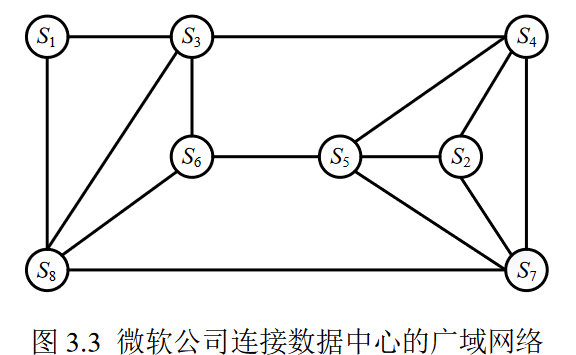

[10]. Zheng Jiaqi, Xu Hong, Chen Guihai, et al. Minimizing transient congestion during network update in data centers. In: IEEE International Conference on Network Protocols (ICNP), 2015: 1-10. 

[11]. Xu Hongli, Yu Zhuolong, Li Xiang-Yang, et al. Real-time update with joint optimization of route selection and update scheduling for SDNs. In: IEEE 24th International Conference on Network Protocols (ICNP), 2016: 1-10. 

[12]. Jin Xin, Liu Hongqiang Harry, Gandhi Rohan, et al. Dynamic scheduling of network updates. ACM SIGCOMM Computer Communication Review, 2014, 44(4): 539-550.

[30]. Luo Shouxi, Yu Hongfang, Luo Long, et al. Arrange your network updates as you wish. In: Proceedings of IFIP Networking Conference (IFIP Networking) and Workshops, 2016:10-18.

[31]. Chen Yang, Zheng Huanyang and Wu Jie. Flow migrations in software defined networks: consistency, feasibility, and optimality. In: Proceedigns of IEEE International Symposium on Parallel and Distributed Processing with Applications and International Conference on Ubiquitous Computing and Communications (ISPA/IUCC), 2017: 941948.

[32]. Chen Yang and Wu Jie. Max progressive network update. In: IEEE International Conference on Communications (ICC), 2017: 1-6. 

[33]. Chen Yang and Wu Jie. Link-based fine granularity flow migration in SDNs to reduce packet loss. In: IEEE 36th International Performance Computing and Communications Conference (IPCCC), 2017: 1-8. 

[34]. Luo Long, Yu H., Luo S, et al. Fast lossless traffic migration for SDN updates. In: Proceedings of IEEE International Conference on Communications (ICC), 2015: 58035808.

 [35]. Luo Long, Li Zonghang, Wang Jingyu, et al. Simplifying flow updates in softwaredefined networks using atoman. IEEE Access, 2019, 7: 39083-39097.

**面向无拥塞的路径迁移：软件定义网络中拥塞最小化的路由更新策略研究.pdf**

为避免路径迁移过程中的拥塞，Dionysus[12]构建了 4 条数据流的路径迁移之间的依 赖关系图，如图 2.4 所示。依赖关系是指，一条数据流必须等待另一条数据流完成迁移 之后，才能开启迁移。如数据流 f2 需要在数据流 f3 迁移到目的路径后，才能开启迁移。控制器按照依赖关系图控制数据流的迁移次序，就可避免拥塞。由于设计不可分割数 据流的无拥塞的更新策略是 NP-Hard 的[27, 28]，为使问题可解，Dionysus 只考虑将数据 流从原路径直接迁移到目的路径，不考虑对数据流进行多次且来回反复地迁移。

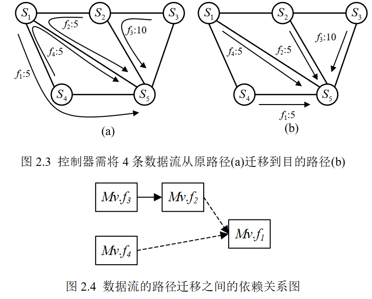

[12]. Jin Xin, Liu Hongqiang Harry, Gandhi Rohan, et al. Dynamic scheduling of network updates. ACM SIGCOMM Computer Communication Review, 2014, 44(4): 539-550.

[27]. Brandt Sebastian, Förster Klaus-Tycho, Wattenhofer Roger. On consistent migration of flows in SDNs. In: IEEE INFOCOM, 2016: 1-9. 

[28]. Foerster Klaus-Tycho. On the consistent migration of unsplittable flows: Upper and lower complexity bounds. In: IEEE 16th International Symposium on Network Computing and Applications (NCA), 2017: 1-4.

**总体而言**：利用深度学习（3秒循环1次，但执行强化学习时就不预测了）预测出网络流量峰值，当峰值大于瓶颈带宽的某个比例时，需要路由调整，此时，只是选择其中的某些多个大流进行调整，同时利用强化学习，保证整个网络具有较平稳的链路利用率等等指标。

**ECMP介绍**：

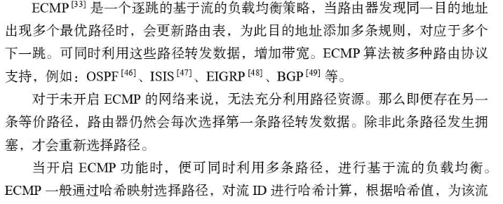

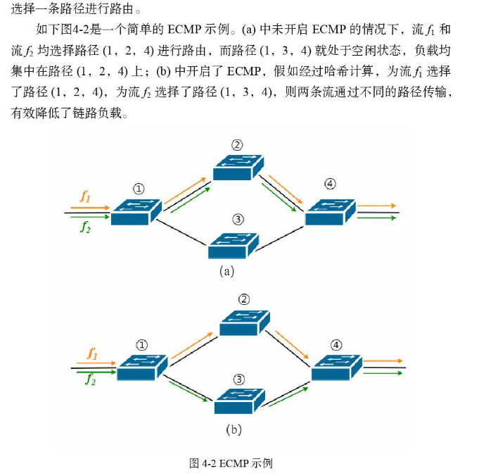

可直接用的介绍的话：

> 在软件定义网络（SDN）中，逻辑中心化控制器具有网络状态的全局视图，并负责将控制决策传递到数据平面。控制器通过南向API（如Openflow）在交换机流表中安装、修改或删除转发规则来强制执行策略[22]
>
> [22] N. McKeown, T. Anderson, H. Balakrishnan, G. M. Parulkar, L. L. Peterson, J. Rexford, S. Shenker, and J. S. Turner. Openflow: enabling innovation in campus networks. Computer Communication Review, 38(2):69–74, 2008.
>
> 

mininet [1]  : [1] N. Handigol el al., “Reproducible network experiments using containerbased emulation,” in CoNEXT, 2012, pp. 253–264

网络拓扑使用

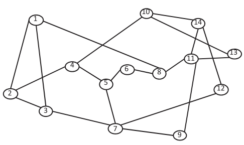

1、美国国家科学基金网络 NSF network

[78] T. Lin, Z. Zhou, M. Tornatore, et al. Demand-aware network function placement[J]. Journal of Lightwave Technology, 2016, 34(11): 2590-2600

[48] C. Colman-Meixner, F. Dikbiyik, M. F. Habib, M. Tornatore, C.-N. Chuah, and B. Mukherjee, “Disaster-survivable cloud-network mapping,” Photon. Netw. Commun., vol. 27, no. 3, pp. 141–153, 2014.

2、微软公司连接数据中心的广域网

3、B4: 软件定义网络中拥塞最小化的路由更新策略研究.pdf

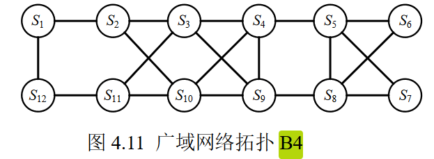

4、4pod的fat-tree: 软件定义网络中拥塞最小化的路由更新策略研究.pdf

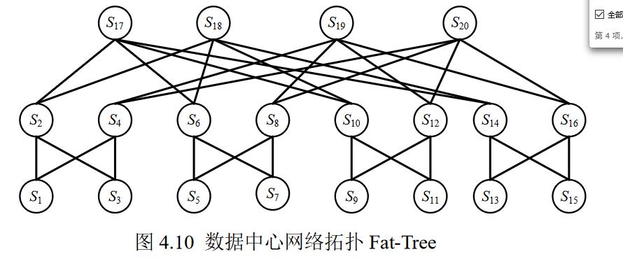流量预测是一种用于预测网络或系统中流量变化的技术。它可以帮助网络管理员和运营商预测和管理流量，确保网络和系统的正常运行。在本文中，我们将探讨流量预测的概念、技术和应用。

一、流量预测的概念

流量预测是指通过对历史数据、实时数据以及其他相关数据的分析，对未来网络或系统中的流量进行预测和分析。其目的是为了更好地规划和管理网络资源，提高网络和系统的性能和效率。流量预测通常使用统计分析、机器学习和人工智能等技术来完成。

二、流量预测的技术

1. 统计分析

统计分析是流量预测中最常用的技术之一。它使用历史数据中的模式和趋势来预测未来的流量。常用的统计分析方法包括时间序列分析、回归分析和ARIMA模型等。

2. 机器学习

机器学习是一种通过模型训练来预测未来流量的技术。机器学习可以通过对大量历史数据的学习来发现数据中的模式和趋势，并根据这些模式和趋势预测未来的流量。机器学习方法包括决策树、随机森林、神经网络和支持向量机等。

3. 人工智能

人工智能是一种可以模拟人类思维过程的技术。在流量预测中，人工智能可以通过学习历史数据中的模式和趋势来预测未来的流量。人工智能方法包括深度学习、卷积神经网络和递归神经网络等。

三、流量预测的应用

流量预测的应用非常广泛，以下是其中几个应用领域：

1. 网络规划和设计

流量预测可以帮助网络管理员更好地规划和设计网络，以满足未来的流量需求。

1. 负载均衡

流量预测可以帮助负载均衡系统更好地分配资源，以提高系统的性能和效率。

1. 安全监控

流量预测可以帮助安全监控系统检测异常流量，以便及时采取措施，防止网络攻击。

四、结论
流量预测是网络和系统管理中非常重要的一环。通过使用各种技术来预测流量，可以帮助网络管理员

写参考文献 ：

后续工作展望：

网络测量中完成分时测量，以减少每次的测量结点数，减小测量带来的负载。
