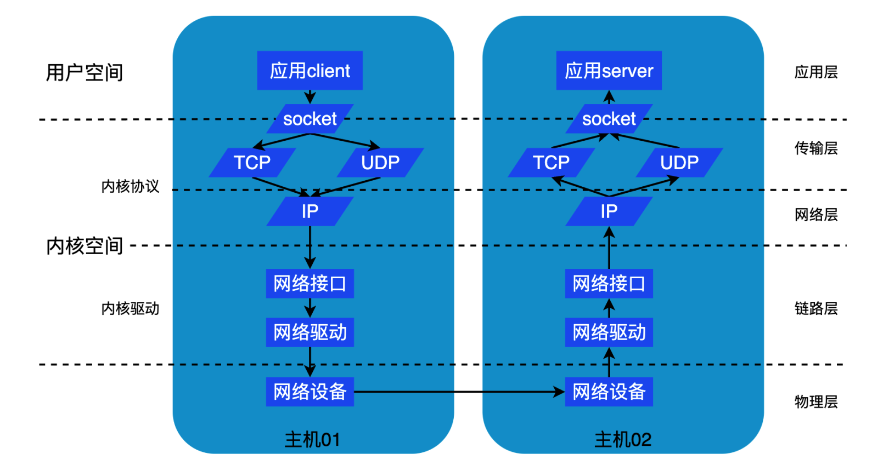
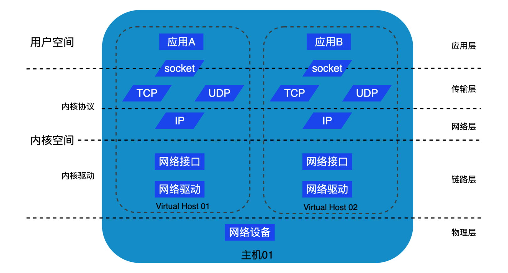

# Docker

https://www.w3cschool.cn/docker/docker-tutorial.html

[什么是Docker？看这一篇干货文章就够了！ - 知乎 (zhihu.com)](https://zhuanlan.zhihu.com/p/187505981)

[Docker — 从入门到实践 | Docker 从入门到实践 (docker-practice.com)](https://vuepress.mirror.docker-practice.com/)

[前言 - Docker — 从入门到实践 (gitbook.io)](https://yeasy.gitbook.io/docker_practice/)

## 1. 容器简介

### 为什么要用容器

- 传统的应用部署方式是通过插件或脚本来安装应用。这样做的缺点是应用的运行、配置、管理、所有生存周期将与当前操作系统绑定，这样做并不利于应用的升级更新/回滚等操作，当然也可以通过创建虚机的方式来实现某些功能，但是虚拟机非常重，并不利于移植。

- 软件开发的一大目的就是隔离，应用程序在运行时相互独立互不干扰，这种隔离实现起来是很不容易的，其中一种解决方案就是虚拟机技术，通过将应用程序部署在不同的虚拟机中从而实现隔离，另一种就是**容器**技术。

### 容器相对虚拟机的优势

- **每个虚拟机一套OS，而容器共享一个操作系统/内核**
  
  > 虚拟机模型将底层硬件资源划分到虚拟机当中。每个虚拟机都是包含了虚拟 CPU、虚拟 RAM、虚拟磁盘等资源的一种软件结构。因此，每个虚拟机都需要有自己的操作系统来声明、初始化并管理这些虚拟资源。
  >
  > 但是，**操作系统本身是有其额外开销的**。例如，每个操作系统都消耗一点 CPU、一点 RAM、一点存储空间等。每个操作系统都需要独立的许可证，并且都需要打补丁升级，每个操作系统也都面临被攻击的风险。
  >
  > 通常将这种现象称作 **OS Tax** 或者 **VM Tax**，每个操作系统都占用一定的资源。
  
  > 容器模型具有在宿主机操作系统中运行的单个内核。在一台主机上运行数十个甚至数百个容器都是可能的——**容器共享一个操作系统/内核**。
  >
  > 这意味着只有一个操作系统消耗 CPU、RAM 和存储资源，只有一个操作系统需要授权，只有一个操作系统需要升级和打补丁。同时，只有一个操作系统面临被攻击的风险。简言之，就是只有一份 OS 损耗。
  >
  > 在单台机器上只需要运行 4 个业务应用的场景中，也许问题尚不明显。但当需要运行成百上千应用的时候，就会引起质的变化。
  >
  > 同时，容器也保证了不同应用程序的相互隔离。
  >
  > 总之，**容器只隔离应用程序的运行时环境但容器之间可以共享同一个操作系统**
  
- **docker容器的启动时间比虚拟机快很多**
  
  > 因为**容器并不是完整的操作系统**，所以其启动要远比虚拟机快。
  >
  > 在容器内部并不需要内核，也就没有定位、解压以及初始化的过程——更不用提在内核启动过程中对硬件的遍历和初始化了。这些在容器启动的过程中统统都不需要！唯一需要的是位于下层操作系统的共享内核是启动了的！最终结果就是，容器可以在 1s 内启动。
  >
  > 唯一对容器启动时间有影响的就是容器内应用启动所花费的时间。

同时，容器还具有如下优势

- 持续开发、集成和部署：提供可靠且频繁的容器镜像构建/部署，并使用快速和简单的回滚(由于镜像不可变性)。
- 开发和运行相分离：在build或者release阶段创建容器镜像，使得应用和基础设施解耦。
- 开发，测试和生产环境一致性：在本地或外网（生产环境）运行的一致性。
- 资源隔离，且利用高效

### 容器和虚拟机模型

容器和虚拟机都依赖于宿主机才能运行。宿主机可以是笔记本，是数据中心的物理服务器，也可以是公有云的某个实例。

在下面的示例中，假设宿主机是一台需要运行 4 个业务应用的物理服务器。

在 <u>***虚拟机模型***</u> 中，首先要开启物理机并启动 Hypervisor 引导程序。一旦 Hypervisor（虚拟机监控程序） 启动，就会占有机器上的全部物理资源，如 CPU、RAM、存储和 NIC。

Hypervisor 接下来就会将这些物理资源划分为虚拟资源，并且看起来与真实物理资源完全一致。

然后 Hypervisor 会将这些资源打包进一个叫作虚拟机（VM）的软件结构当中。这样用户就可以使用这些虚拟机，并在其中安装操作系统和应用。

前面提到需要在物理机上运行 4 个应用，所以在 Hypervisor 之上需要创建 4 个虚拟机并安装 4 个操作系统，然后安装 4 个应用。当操作完成后，结构如下图所示。


而 **<u>*容器模型*</u> ** 则略有不同。

服务器启动之后，所选择的操作系统会启动。在 Docker 世界中可以选择 Linux，或者内核支持内核中的容器原语的新版本 Windows。

与虚拟机模型相同，OS 也占用了全部硬件资源。在 OS 层之上，需要安装容器引擎（如 Docker）。

容器引擎可以获取系统资源，比如进程树、文件系统以及网络栈，接着将资源分割为安全的互相隔离的资源结构，称之为容器。

每个容器看起来就像一个真实的操作系统，在其内部可以运行应用。按照前面的假设，需要在物理机上运行 4 个应用。

因此，需要划分出 4 个容器并在每个容器中运行一个应用，如下图所示。


从更高层面上来讲：

**Hypervisor 是硬件虚拟化（Hardware Virtualization）——Hypervisor 将硬件物理资源划分为虚拟资源**。

**容器是操作系统虚拟化（OS Virtualization）——容器将系统资源划分为虚拟资源**。


## 2. Docker 架构

> **容器是一种通用技术，docker只是其中的一种实现**

Docker 包括三个基本概念:

- **镜像（Image）**：Docker 镜像（Image），就相当于是一个 root 文件系统。比如官方镜像 ubuntu:16.04 就包含了完整的一套 Ubuntu16.04 最小系统的 root 文件系统。
- **容器（Container）**：镜像（Image）和容器（Container）的关系，就像是面向对象程序设计中的**类和实例一样**，镜像是静态的定义，容器是镜像运行时的实体。容器可以被创建、启动、停止、删除、暂停等。Docker Container 通过 Docker Image来创建。
- **仓库（Repository）**：仓库可看成一个代码控制中心，用来保存镜像。

镜像可以理解为一种构建时（build-time）结构，而容器可以理解为一种运行时（run-time）结构，

即可以简单的把**image**理解为**可执行程序**，**container**就是**运行起来的进程**。

还有一个概念：`dockerfile`，其作用是构建自定义的image

- 写程序需要源代码，那么“写”`image`就需要`dockerfile`，`dockerfile`就是`image`的源代码，docker就是"编译器"。

    因此我们只需要在`dockerfile`中指定需要哪些程序、依赖什么样的配置，之后把`dockerfile`交给“编译器”docker进行“编译”，也就是`docker build`命令，生成的可执行程序就是image，之后就可以运行这个image了，这就是`docker run`命令，image运行起来后就是docker container。


Docker 使用**客户端-服务器 (C/S) 架构**模式。

其中docker服务端是一个服务进程，管理着所有的容器。docker客户端则扮演着docker服务端的远程控制器，可以用来控制docker的服务端进程。大部分情况下，docker服务端和客户端运行在一台机器上。


| 概念                   | 说明                                                         |
| :------------------------------------ | :-------------------------------------------- |
| Docker 镜像(Images)    | Docker 镜像是用于创建 Docker 容器的模板，比如 Ubuntu 系统。  |
| Docker 容器(Container) | 容器是独立运行的一个或一组应用，是镜像运行时的实体。         |
| Docker 客户端(Client)  | Docker 客户端通过命令行或者其他工具使用 Docker API (https://docs.docker.com/reference/api/docker_remote_api) 与 Docker 的守护进程通信。 |
| docker daemon(守护进程) | daemon的主要功能包括镜像管理、镜像构建、REST API、身份验证、安全、核心网络以及编排。 |
| Docker 主机(Host)      | 一个物理或者虚拟的机器用于执行 Docker 守护进程和容器。       |
| Docker 仓库(Registry)  | Docker 仓库用来保存镜像，可以理解为代码控制中的代码仓库。Docker Hub([https://hub.docker.com](https://hub.docker.com/)) 提供了庞大的镜像集合供使用。 |
| Docker Machine         | Docker Machine是一个简化Docker安装的命令行工具，通过一个简单的命令行即可在相应的平台上安装Docker，比如VirtualBox、 Digital Ocean、Microsoft Azure。 |

**docker daemon 工作机制**

Docker Daemon可以认为是通过Docker Server模块接受Docker Client的请求，并在Engine中处理请求，然后根据请求类型，创建出指定的Job并运行，运行过程的作用有以下几种可能：向Docker Registry获取镜像，通过graphdriver执行容器镜像的本地化操作，通过networkdriver执行容器网络环境的配置，通过execdriver执行容器内部运行的执行工作等。


## 3. Docker 安装

> 本文档讲述Ubuntu Docker 的安装，其他系统安装请自行查阅

**前提条件**

Docker 要求 Ubuntu 系统的内核版本高于 3.10 ，查看本页面的前提条件来验证你的 Ubuntu 版本是否支持 Docker。

通过` uname -r`命令查看你当前的内核版本

**使用脚本安装 Docker**

- 1、获取最新版本的 Docker 安装包

```bash
sudo apt-get update
```

```bash
sudo apt-get install -y docker.io
```

- 2、启动docker 后台服务

```bash
sudo service docker start
```

> 提示：如果使用 Linux，并且还没有将当前用户加入到本地 Docker UNIX 组中，则可能需要在下面的命令前面添加 sudo。

查看docker版本

``` bash
docker --version
```

查看docker系统（可能需要sudo）

``` bash
docker system info
```

如果在 Linux 中遇到无权限访问的问题（切换root用户可解决），需要确认当前用户是否属于本地 Docker UNIX 组。如果不是，可以通过`usermod -aG docker <user>`来添加，然后退出并重新登录 Shell，改动即可生效。

## 4. Docker 镜像 

[Docker镜像（image）详解 (biancheng.net)](http://c.biancheng.net/view/3143.html)

检查 Docker 主机的本地仓库中是否包含镜像。

``` bash
docker image ls docker
docker images
```

各个选项说明:

- **REPOSITORY：**表示镜像的仓库源
- **TAG：**镜像的标签
- **IMAGE ID：**镜像ID
- **CREATED：**镜像创建时间
- **SIZE：**镜像大小

> 通过 docker image 命令的提示可以看到更多的命令

同一仓库源可以有多个 TAG，代表这个仓库源的不同个版本，如ubuntu仓库源里，有15.10、14.04等多个不同的版本，我们使用 **REPOSITORY:TAG** 来定义不同的镜像。

将镜像取到 Docker 主机本地的操作是拉取。

Docker 主机安装之后，本地并没有镜像。

镜像的唯一标识是其 ID 和摘要（DIGEST），而一个镜像可以有多个标签。

### 搜索镜像

使用命令：

``` bash
docker search <imageName>
```

通过 CLI 的方式搜索 Docker Hub。

简单模式下，该命令会搜索所有“NAME”字段中包含特定字符串的仓库。

例：

``` bash
root@VM-8-17-ubuntu:/home/ubuntu# docker search mysql
NAME                           DESCRIPTION                                     STARS     OFFICIAL   AUTOMATED
mysql                          MySQL is a widely used, open-source relation…   12761     [OK]       
mariadb                        MariaDB Server is a high performing open sou…   4899      [OK]       
percona                        Percona Server is a fork of the MySQL relati…   579       [OK]       
phpmyadmin                     phpMyAdmin - A web interface for MySQL and M…   556       [OK]       
bitnami/mysql                  Bitnami MySQL Docker Image                      71                   [OK]
linuxserver/mysql-workbench                                                    37                   
linuxserver/mysql              A Mysql container, brought to you by LinuxSe…   35               
......
```

需要注意，上面返回的镜像中既有官方的也有非官方的（如后三个），可以使用 --filter "is-official=true"，使命令返回内容只显示官方镜像。

### 拉取镜像

``` bash
docker image pull <repository>:<tag>
```

 是下载镜像的命令。镜像从远程镜像仓库服务的仓库中下载。不写tag时默认是 latest。

其次，标签为 latest 的镜像没有什么特殊魔力！标有 latest 标签的镜像不保证这是仓库中最新的镜像！例如，Alpine 仓库中最新的镜像通常标签是 edge。通常来讲，使用 latest 标签时需要谨慎！

从非官方仓库拉取镜像也是类似的，只需要在仓库名称面前加上 Docker Hub 的用户名或者组织名称。

默认情况下，镜像会从` Docker Hub `的仓库中拉取。`docker image pull alpine:latest` 命令会从 `Docker Hub `的 `alpine` 仓库中拉取标签为 latest 的镜像。再将最新的`ubuntu`也拉取下来看看`docker image pull ubuntu:latest` ，然后使用`docker image ls`查看拉取结果：

```bash
root@VM-8-17-ubuntu:~# docker image ls
REPOSITORY   TAG       IMAGE ID       CREATED       SIZE
ubuntu       latest    27941809078c   13 days ago   77.8MB
alpine       latest    e66264b98777   3 weeks ago   5.53MB
```

可见`Alpine`的大小是非常小的。目前 Docker 官方已开始推荐使用 `Alpine` 替代之前的 `Ubuntu` 做为基础镜像环境。这样会带来多个好处。包括镜像下载速度加快，镜像安全性提高，主机之间的切换更方便，占用更少磁盘空间等。

### 删除镜像

当读者不再需要某个镜像的时候，可以通过命令从 Docker 主机删除该镜像。

```bash
docker image rm <镜像ID>或<repository>:<tag>
```

### 推送镜像

首先需要登录docker的站点，在https://hub.docker.com/注册个账号，然后docker login，成功后使用docker tag修改测试运行过的image，然后再docker push 【账号】/【docker】：【tag】，如果没给tag，默认就是latest，如果制定了，以后pull镜像就需要指定tag


### 利用 commit 理解镜像构成

> 注意： `docker commit` 命令除了学习之外，还有一些特殊的应用场合，比如被入侵后保存现场等。但是，**不要使用 `docker commit` 定制镜像**，定制镜像应该使用 `Dockerfile` 来完成。

镜像是容器的基础，每次执行 `docker run` 的时候都会指定哪个镜像作为容器运行的基础。在之前的例子中，我们所使用的都是来自于 Docker Hub 的镜像。直接使用这些镜像是可以满足一定的需求，而当这些镜像无法直接满足需求时，我们就需要定制这些镜像。接下来的几节就将讲解如何定制镜像。

回顾一下之前我们学到的知识，镜像是多层存储，每一层是在前一层的基础上进行的修改；而容器同样也是多层存储，是在以镜像为基础层，在其基础上加一层作为容器运行时的存储层。

现在让我们以定制一个 Web 服务器为例子，来讲解镜像是如何构建的。

``` bash
docker run --name webserver -d -p 80:80 nginx
```

> -d 表示后台运行容器，-p 指定映射到宿主机上的端口，80是http的端口，这样我们可以用浏览器去访问这个 `nginx` 服务器。

> 如果是在本机运行的 Docker，那么可以直接访问：`http://localhost` ，如果是在虚拟机、云服务器上安装的 Docker，则需要将 `localhost` 换为虚拟机地址或者实际云服务器地址。直接用浏览器访问的话，我们会看到默认的 Nginx 欢迎页面。


现在，假设我们非常不喜欢这个欢迎页面，我们希望改成欢迎 Docker 的文字，我们可以使用 `docker exec` 命令进入容器，修改其内容。

``` bash
$ docker exec -it webserver bash
root@3729b97e8226:/# echo '<h1>Hello, Docker!</h1>' > /usr/share/nginx/html/index.html
root@3729b97e8226:/# exit
exit
```

我们以交互式终端方式进入 `webserver` 容器，并执行了 `bash` 命令，也就是获得一个可操作的 Shell。

然后，我们用 `<h1>Hello, Docker!</h1>` 覆盖了 `/usr/share/nginx/html/index.html` 的内容。

现在我们再刷新浏览器的话，会发现内容被改变了。


我们修改了容器的文件，也就是改动了容器的**存储层**。我们可以通过 `docker diff` 命令看到具体的改动。

现在我们定制好了变化，我们希望能将其保存下来形成镜像。

要知道，当我们运行一个容器的时候（如果不使用卷的话），我们做的任何文件修改都会被记录于容器存储层里。而 Docker 提供了一个 `docker commit` 命令，可以将容器的存储层保存下来成为镜像。换句话说，就是**在原有镜像的基础上，再叠加上容器的存储层，并构成新的镜像**。以后我们运行这个新镜像的时候，就会拥有原有容器最后的文件变化。

`docker commit` 的语法格式为：

``` bash
docker commit [选项] <容器ID或容器名> [<仓库名>[:<标签>]]
```

我们可以用下面的命令将容器保存为镜像：

``` bash
ubuntu@VM-8-17-ubuntu:~$ docker commit --message "modified nginx default index page" webserver nginx:v2
sha256:5098f2c1dd57b81ebeca0467725ea1306b63b32200d52e2a814b0f4abf36779b
```

我们可以在 `docker image ls` 中看到这个新定制的镜像：

我们还可以用 `docker history` 具体查看镜像内的历史记录，如果比较 `nginx:latest` 的历史记录，我们会发现新增了我们刚刚提交的这一层。

``` bash
ubuntu@VM-8-17-ubuntu:~$ docker history nginx:v2
IMAGE          CREATED              CREATED BY                                      SIZE      COMMENT
5098f2c1dd57   About a minute ago   nginx -g daemon off;                            1.19kB    modified nginx default index page
3c58beffe63c   8 hours ago          /bin/sh -c #(nop)  CMD ["nginx" "-g" "daemon…   0B        
<missing>      8 hours ago          /bin/sh -c #(nop)  STOPSIGNAL SIGQUIT           0B        
<missing>      8 hours ago          /bin/sh -c #(nop)  EXPOSE 80                    0B        
<missing>      8 hours ago          /bin/sh -c #(nop)  ENTRYPOINT ["/docker-entr…   0B        
<missing>      8 hours ago          /bin/sh -c #(nop) COPY file:09a214a3e07c919a…   4.61kB
...
```

新的镜像定制好后，我们可以来运行这个镜像。

``` bash
docker run --name web2 -d -p 81:80 nginx:v2
```

这里我们命名为新的服务为 `web2`，并且映射到 `81` 端口。访问 `http://localhost:81` 看到结果，其内容应该和之前修改后的 `webserver` 一样。(注意如果使用的是云主机，要将相应的端口开放)

至此，我们第一次完成了定制镜像，使用的是 `docker commit` 命令，手动操作给旧的镜像添加了新的一层，形成新的镜像，对镜像多层存储应该有了更直观的感觉。

这里我们命名为新的服务为 `web2`，并且映射到 `81` 端口。访问 `http://localhost:81` 看到结果，其内容应该和之前修改后的 `webserver` 一样。

至此，我们第一次完成了定制镜像，使用的是 `docker commit` 命令，手动操作给旧的镜像添加了新的一层，形成新的镜像，对镜像多层存储应该有了更直观的感觉。


**另一个例子**

使用命令创建一个新的容器，并安装`ping`命令：

``` bash
docker container run -it ubuntu /bin/bash
apt-get update
apt-get upgrade
apt install iputils-ping # ping
```

此时该容器即可使用`ping`了。

然后使用 commit

``` bash
docker commit <容器ID> <保存的名字>
```

此时使用`docker image ls` 可以看到多了一个image

``` bash
root@VM-8-17-ubuntu:/home/ubuntu# docker image ls
REPOSITORY   TAG       IMAGE ID       CREATED         SIZE
learn/ping   latest    bab13b3b508a   4 seconds ago   122MB
ubuntu       latest    27941809078c   2 weeks ago     77.8MB
alpine       latest    e66264b98777   4 weeks ago     5.53MB
```

此时就可以使用新的image，`learn/ping` 来使用ping命令了。

```bash
root@VM-8-17-ubuntu:/home/ubuntu# docker run learn/ping ping www.baidu.com
PING www.a.shifen.com (110.242.68.3) 56(84) bytes of data.
64 bytes from 110.242.68.3 (110.242.68.3): icmp_seq=1 ttl=250 time=10.6 ms
64 bytes from 110.242.68.3 (110.242.68.3): icmp_seq=2 ttl=250 time=10.6 ms
```


### 其他

#### 分层存储

因为镜像包含操作系统完整的 `root` 文件系统，其体积往往是庞大的，因此在 Docker 设计时，就充分利用 [Union FS (opens new window)](https://en.wikipedia.org/wiki/Union_mount)的技术，将其设计为分层存储的架构。所以严格来说，镜像并非是像一个 `ISO` 那样的打包文件，镜像只是一个虚拟的概念，其实际体现并非由一个文件组成，而是由一组文件系统组成，或者说，由多层文件系统联合组成。

镜像构建时，会一层层构建，前一层是后一层的基础。每一层构建完就不会再发生改变，后一层上的任何改变只发生在自己这一层。比如，删除前一层文件的操作，实际不是真的删除前一层的文件，而是仅在当前层标记为该文件已删除。在最终容器运行的时候，虽然不会看到这个文件，但是实际上该文件会一直跟随镜像。因此，在构建镜像的时候，需要额外小心，每一层尽量只包含该层需要添加的东西，任何额外的东西应该在该层构建结束前清理掉。

分层存储的特征还使得镜像的复用、定制变的更为容易。甚至可以用之前构建好的镜像作为基础层，然后进一步添加新的层，以定制自己所需的内容，构建新的镜像。

#### 镜像体积

如果仔细观察，会注意到，这里标识的所占用空间和在 Docker Hub 上看到的镜像大小不同。比如，`ubuntu:18.04` 镜像大小，在这里是 `63.3MB`，但是在 [Docker Hub (opens new window)](https://hub.docker.com/layers/ubuntu/library/ubuntu/bionic/images/sha256-32776cc92b5810ce72e77aca1d949de1f348e1d281d3f00ebcc22a3adcdc9f42?context=explore)显示的却是 `25.47 MB`。这是因为 Docker Hub 中显示的体积是压缩后的体积。在镜像下载和上传过程中镜像是保持着压缩状态的，因此 Docker Hub 所显示的大小是网络传输中更关心的流量大小。而 `docker image ls` 显示的是镜像下载到本地后，展开的大小，准确说，是展开后的各层所占空间的总和，因为镜像到本地后，查看空间的时候，更关心的是本地磁盘空间占用的大小。

另外一个需要注意的问题是，`docker image ls` 列表中的镜像体积总和并非是所有镜像实际硬盘消耗。由于 Docker 镜像是多层存储结构，并且可以继承、复用，因此不同镜像可能会因为使用相同的基础镜像，从而拥有共同的层。由于 Docker 使用 Union FS，相同的层只需要保存一份即可，因此实际镜像硬盘占用空间很可能要比这个列表镜像大小的总和要小的多。

####  虚悬镜像

上面的镜像列表中，还可以看到一个特殊的镜像，这个镜像既没有仓库名，也没有标签，均为 `<none>`。：

```bash
<none>               <none>              00285df0df87        5 days ago          342 MB
```

这个镜像原本是有镜像名和标签的，原来为 `mongo:3.2`，随着官方镜像维护，发布了新版本后，重新 `docker pull mongo:3.2` 时，`mongo:3.2` 这个镜像名被转移到了新下载的镜像身上，而旧的镜像上的这个名称则被取消，从而成为了 `<none>`。除了 `docker pull` 可能导致这种情况，`docker build` 也同样可以导致这种现象。由于新旧镜像同名，旧镜像名称被取消，从而出现仓库名、标签均为 `<none>` 的镜像。这类无标签镜像也被称为 **虚悬镜像(dangling image)** ，可以用下面的命令专门显示这类镜像：

```bash
$ docker image ls -f dangling=true
REPOSITORY          TAG                 IMAGE ID            CREATED             SIZE
<none>              <none>              00285df0df87        5 days ago          342 MB
```

一般来说，虚悬镜像已经失去了存在的价值，是可以随意删除的，可以用下面的命令删除。

```bash
$ docker image prune
```

#### 中间层镜像

为了加速镜像构建、重复利用资源，Docker 会利用 **中间层镜像**。所以在使用一段时间后，可能会看到一些依赖的中间层镜像。默认的 `docker image ls` 列表中只会显示顶层镜像，如果希望显示包括中间层镜像在内的所有镜像的话，需要加 `-a` 参数。	

```bash
$ docker image ls -a
```

这样会看到很多**无标签的镜像**，与之前的虚悬镜像不同，这些无标签的镜像很多都是中间层镜像，是**其它镜像所依赖的镜像**。这些无标签镜像不应该删除，否则会导致上层镜像因为依赖丢失而出错。实际上，这些镜像也没必要删除，因为之前说过，相同的层只会存一遍，而这些镜像是别的镜像的依赖，因此并不会因为它们被列出来而多存了一份，无论如何你也会需要它们。只要删除那些依赖它们的镜像后，这些依赖的中间层镜像也会被连带删除。

#### 以特定格式显示

默认情况下，`docker image ls` 会输出一个完整的表格，但是我们并非所有时候都会需要这些内容。比如，刚才删除虚悬镜像的时候，我们需要利用 `docker image ls` 把所有的虚悬镜像的 ID 列出来，然后才可以交给 `docker image rm` 命令作为参数来删除指定的这些镜像，这个时候就用到了 `-q` 参数。

```bash
$ docker image ls -q
5f515359c7f8
05a60462f8ba
fe9198c04d62
```

`--filter` 配合 `-q` 产生出指定范围的 ID 列表，然后送给另一个 `docker` 命令作为参数，从而针对这组实体成批的进行某种操作的做法在 Docker 命令行使用过程中非常常见，不仅仅是镜像，将来我们会在各个命令中看到这类搭配以完成很强大的功能。

另外一些时候，我们可能只是对表格的结构不满意，希望自己组织列；或者不希望有标题，这样方便其它程序解析结果等，这就用到了 [Go 的模板语法 (opens new window)](https://gohugo.io/templates/introduction/)。

比如，下面的命令会直接列出镜像结果，并且只包含镜像ID和仓库名：

```bash
$ docker image ls --format "{{.ID}}: {{.Repository}}"
5f515359c7f8: redis
05a60462f8ba: nginx
fe9198c04d62: mongo
00285df0df87: <none>
```

像其它可以承接多个实体的命令一样，可以使用 `docker image ls -q` 来配合使用 `docker image rm`，这样可以成批的删除希望删除的镜像。我们在“镜像列表”章节介绍过很多过滤镜像列表的方式都可以拿过来使用。

比如，我们需要删除所有仓库名为 `redis` 的镜像：

```bash
$ docker image rm $(docker image ls -q redis)
```

或者删除所有在 `mongo:3.2` 之前的镜像：

```bash
$ docker image rm $(docker image ls -q -f before=mongo:3.2)
```


## 5. Docker 容器 

容器是镜像的运行时实例。正如从虚拟机模板上启动 VM 一样，用户也同样可以从单个镜像上启动一个或多个容器。

虚拟机和容器最大的区别是容器更快并且更轻量级——与虚拟机运行在完整的操作系统之上相比，容器会共享其所在主机的操作系统/内核。


**<u>容器的实质是进程</u>**，但与直接在宿主执行的进程不同，容器进程运行于属于自己的独立的 [命名空间](https://en.wikipedia.org/wiki/Linux_namespaces)。

前面讲过镜像使用的是分层存储，容器也是如此。每一个容器运行时，是以镜像为基础层，**在其上创建一个当前容器的存储层**，我们可以称这个为容器运行时读写而准备的存储层为 **容器存储层**。

容器存储层的生存周期和容器一样，容器消亡时，容器存储层也随之消亡。因此，任何保存于容器存储层的信息都会随容器删除而丢失。

按照 Docker 最佳实践的要求，**容器不应该向其存储层内写入任何数据，容器存储层要保持无状态化**。所有的文件写入操作，都应该使用 [数据卷（Volume）](https://vuepress.mirror.docker-practice.com/data_management/volume.html)、或者 [绑定宿主目录](https://vuepress.mirror.docker-practice.com/data_management/bind-mounts.html)，在这些位置的读写会跳过容器存储层，直接对宿主（或网络存储）发生读写，其性能和稳定性更高。

数据卷的生存周期独立于容器，容器消亡，数据卷不会消亡。因此，使用数据卷后，容器删除或者重新运行之后，数据却不会丢失。

**当利用 `docker run` 来创建容器时，Docker 在后台运行的标准操作包括**：

- 检查本地是否存在指定的镜像，不存在就从 [registry](https://vuepress.mirror.docker-practice.com/repository/) 下载
- 利用镜像创建并启动一个容器
- 分配一个文件系统，并在只读的镜像层外面挂载一层可读写层
- 从宿主主机配置的网桥接口中桥接一个虚拟接口到容器中去
- 从地址池配置一个 ip 地址给容器
- 执行用户指定的应用程序
- 执行完毕后容器被终止

### 创建并使用容器

创建一个新的容器并运行一个命令:

``` bash
docker container run [OPTIONS] IMAGE [COMMAND] [ARG...]			# contianer可以省略
```

OPTIONS说明：(常用)

- `-i`: 以交互模式运行容器，通常与` -t `同时使用；
- `-t`: 为容器重新分配一个伪输入终端，通常与` -i`同时使用；
- `--name="xxx"`: 为容器指定一个名称；
- `-d`: 让 Docker 在后台运行而不是直接把执行命令的结果输出在当前宿主机下
- `-p`: 指定映射到宿主机上的端口
- `-P`:  (大写P)随机端口映射，容器内部端口**随机**映射到主机的端口
- `-v 宿主机中的数据卷或目录:容器中的挂载位置`   :  --volume绑定一个数据卷
- `--mount source=宿主机中的数据卷或目录 target=容器中的挂载位置 `： 挂载数据卷

更多见：[Docker run 命令 | 菜鸟教程 (runoob.com)](https://www.runoob.com/docker/docker-run-command.html)

该命令可以携带很多参数，在其基础的格式中，指定了启动所需的镜像以及要运行的应用。

``` bash
docker container run <image> <app>
```

例：

``` bash
docker container run -it ubuntu /bin/bash
```

则会启动某个 Ubuntu Linux 容器，并运行 Bash Shell 作为其应用。会发现 Shell 提示符发生了变化，说明目前已经位于容器内部了。若尝试在容器内执行一些基础命令，可能会发现某些指令无法正常工作。这是因为大部分容器镜像都是经过高度优化的。这意味着某些命令或者包可能没有安装。

如果想启动 PowerShell 并运行一个应用，则可以使用命令`docker container run -it microsoft- /powershell:nanoserver pwsh.exe`。

容器随着其中运行应用的退出而终止。其中 Linux 容器会在 Bash Shell 退出后终止，而 Windows 容器会在 PowerShell 进程终止后退出。

一个简单的验证方法就是启动新的容器，并运行 sleep 命令休眠 10s。容器会启动，然后运行休眠命令，在 10s 后退出。

如果在 Linux 主机（或者在 Linux 容器模式下的 Windows 主机上）运行`docker container run alpine:latest sleep 10`命令，Shell 会连接到容器 Shell 10s 的时间，然后退出。

下面是常用命令：

| 命令  (参数`<container>`可以是容器 ID 或名称)  | 描述                                             |
| :--------------------------------------------- | :----------------------------------------------- |
| `docker ps` 或 `docker container ls`           | 列出正在运行的容器                               |
| `docker ps -a   ` 或 `docker container ls -a ` | 列出所有容器                                     |
| `docker ps -s` 或 `docker container ls -s `    | 列出正在运行的容器 *（带 CPU/内存）*             |
| `docker images` 或 `docker image ls`           | 列出所有镜像                                     |
| `docker exec -it <container> bash`             | 连接到容器                                       |
| `docker logs <container>`                      | 显示容器的控制台日志                             |
| `docker stop <container>`                      | 停止一个容器                                     |
| `docker start <container>`                     | 启动一个容器                                     |
| `docker restart <container>`                   | 重启一个容器                                     |
| `docker rm <container>`                        | 移除一个stoped容器，在后面加上`-f`可强制销毁容器 |
| `docker port <container>`                      | 显示容器的端口映射                               |
| `docker top <container>`                       | 列出进程                                         |
| `docker kill <container>`                      | 杀死一个running中的容器                          |
| `docker container prune`                       | 清除所有处于终止状态的容器                       |

***docker stop 与 docker kill的区别***

- **docker stop**: *Stop a running container (**send SIGTERM, and then SIGKILL after grace period**) [...] The main process inside the container will receive SIGTERM, and after a grace period, SIGKILL. [emphasis mine]*
- **docker kill**: *Kill a running container (**send SIGKILL, or specified signal**) [...] The main process inside the container will be sent SIGKILL, or any signal specified with option --signal. [emphasis mine]*

- docker stop：支持“**优雅退出**”。先发送SIGTERM信号，在一段时间之后（10s）再发送SIGKILL信号。Docker内部的应用程序可以接收SIGTERM信号，然后做一些“退出前工作”，比如保存状态、处理当前请求等。
- docker kill：发送SIGKILL信号，应用程序直接退出。

### docker进入、退出容器

查看某一个进程的详细信息：

``` bash
docker inspect <容器ID>
```

**进入容器伪终端命令：**

```bash
docker attach <容器ID>
```

另一条命令也能达到类似的效果：

```bash
docker exec -it <容器ID/容器name> /bin/bash 
```

但此命令是让容器运行最后的那个命令，（当然可以换成其他命令），所以用它进入伪终端再exit不会kill容器

**退出容器命令**

```bash
exit	# exit表示退出并停止容器
```

或者

```bash
Ctrl+P+Q	# 这样退出就不会删除容器
```

容器如果不运行任何进程则无法存在

### 导入和导出

如果要**导出本地某个容器**，可以使用 `docker export` 命令。

``` bash
root@VM-8-17-ubuntu:/home/ubuntu# docker container ls -a
CONTAINER ID   IMAGE        COMMAND       CREATED        STATUS        PORTS     NAMES
a547f74dea73   learn/ping   "bash"        13 hours ago   Up 12 hours             silly_jennings
5f48864bc0ba   ubuntu       "/bin/bash"   16 hours ago   Up 13 hours             myname2
583b4f91da24   ubuntu       "bash"        17 hours ago   Up 17 hours             boring_herschel
root@VM-8-17-ubuntu:/home/ubuntu# docker export a54 > myubuntu.tar
root@VM-8-17-ubuntu:/home/ubuntu# ls
myubuntu.tar  node_modules  package-lock.json  samples-server-master
```

这样将导出容器快照到本地文件。

<hr/>

可以使用 `docker import` 从**容器**快照文件中再**导入为镜像**，例如:

``` bash
root@VM-8-17-ubuntu:/home/ubuntu# cat myubuntu.tar | docker import - test/myubuntu:v1.0
sha256:d5de5ef0bb18fd0576c25115987aa31c7867d7a44c7c9f75b0a55d20df58c1d0
root@VM-8-17-ubuntu:/home/ubuntu# docker images
REPOSITORY      TAG       IMAGE ID       CREATED          SIZE
test/myubuntu   v1.0      d5de5ef0bb18   12 seconds ago   113MB
```

此外，也可以通过指定 URL 或者某个目录来导入，例如

``` bash
$ docker import http://example.com/exampleimage.tgz example/imagerepo
```

*注：用户既可以使用* `docker load` *来导入**<u>镜像</u> 存储文件到本地镜像库**，也可以使用* `docker import` 来导入一个**<u>*容器*</u> 快照到本地镜像库**。这两者的区别在于容器快照文件将丢弃所有的历史记录和元数据信息（即仅保存容器当时的快照状态），而镜像存储文件将保存完整记录，体积也要大。此外，从容器快照文件导入时可以重新指定标签等元数据信息。

### 查看容器状态

使用命令 `docker stats` ：可以查看打开的docker容器所占的CPU内存等信息。

``` shell
root@VM-8-17-ubuntu:~# docker stats

CONTAINER ID   NAME      CPU %     MEM USAGE / LIMIT     MEM %     NET I/O         BLOCK I/O         PIDS
e45fabf63e3f   web3      0.00%     20.28MiB / 1.936GiB   1.02%     18.8MB / 1MB    2.33MB / 41.8MB   3
e7c41e1a1764   web1      0.00%     22.58MiB / 1.936GiB   1.14%     10MB / 785kB    31.6MB / 41.8MB   3
454a0a226921   web2      0.00%     4.152MiB / 1.936GiB   0.21%     285kB / 293kB   1.56MB / 8.19kB   3

CONTAINER ID   NAME      CPU %     MEM USAGE / LIMIT     MEM %     NET I/O         BLOCK I/O         PIDS
e45fabf63e3f   web3      0.00%     20.28MiB / 1.936GiB   1.02%     18.8MB / 1MB    2.33MB / 41.8MB   3
e7c41e1a1764   web1      0.00%     22.58MiB / 1.936GiB   1.14%     10MB / 785kB    31.6MB / 41.8MB   3
454a0a226921   web2      0.00%     4.152MiB / 1.936GiB   0.21%     285kB / 293kB   1.56MB / 8.19kB   3

CONTAINER ID   NAME      CPU %     MEM USAGE / LIMIT     MEM %     NET I/O         BLOCK I/O         PIDS
e45fabf63e3f   web3      0.00%     20.28MiB / 1.936GiB   1.02%     18.8MB / 1MB    2.33MB / 41.8MB   3
e7c41e1a1764   web1      0.00%     22.58MiB / 1.936GiB   1.14%     10MB / 785kB    31.6MB / 41.8MB   3
454a0a226921   web2      0.00%     4.152MiB / 1.936GiB   0.21%     285kB / 293kB   1.56MB / 8.19kB   3

CONTAINER ID   NAME      CPU %     MEM USAGE / LIMIT     MEM %     NET I/O         BLOCK I/O         PIDS
e45fabf63e3f   web3      0.00%     20.28MiB / 1.936GiB   1.02%     18.8MB / 1MB    2.33MB / 41.8MB   3
e7c41e1a1764   web1      0.00%     22.58MiB / 1.936GiB   1.14%     10MB / 785kB    31.6MB / 41.8MB   3
454a0a226921   web2      0.00%     4.152MiB / 1.936GiB   0.21%     285kB / 293kB   1.56MB / 8.19kB   3
```

数据每秒刷新一次。

### 容器生命周期

容器的生命周期，从**创建、运行、休眠，直至销毁**的整个过程。

使用`docker container run ...` 创建一个容器。

可以根据需要多次停止、启动、暂停以及重启容器，并且这些操作执行得很快。

停止容器就像停止虚拟机一样。尽管已经停止运行，容器的全部配置和内容仍然保存在 Docker 主机的文件系统之中，并且随时可以重新启动。

使用`docker rm <container>` 销毁一个容器。


## 6. Dockerfile

### 使用dockerfile定制镜像

在之前`docker commit`的学习中了解到，**镜像的定制实际上就是定制每一层所添加的配置、文件**。如果我们可以把每一层修改、安装、构建、操作的命令都写入一个脚本，用这个脚本来构建、定制镜像，那么之前提及的无法重复的问题、镜像构建透明性的问题、体积的问题就都会解决。这个脚本就是 Dockerfile。

Dockerfile 是一个文本文件，其内包含了一条条的 **指令(Instruction)**，每一条指令构建一层，因此每一条指令的内容，就是描述该层应当如何构建。

还以之前定制 `nginx` 镜像为例，这次我们使用 Dockerfile 来定制。

在一个空白目录中，建立一个文本文件，并命名为 `Dockerfile`：

``` shell
$ mkdir mynginx
$ cd mynginx
$ touch Dockerfile
```

其内容为：

``` shell
FROM nginx
RUN echo '<h1>Hello, Docker!</h1>' > /usr/share/nginx/html/index.html
```

这个 Dockerfile 很简单，一共就两行。涉及到了两条指令，`FROM` 和 `RUN`。

- `FROM`指定基础镜像

    所谓定制镜像，那一定是以一个镜像为基础，在其上进行定制。就像我们之前运行了一个 `nginx` 镜像的容器，再进行修改一样，基础镜像是必须指定的。而 `FROM` 就是指定 **基础镜像**，因此一个 `Dockerfile` 中 `FROM` 是必备的指令，并且**必须是第一条指令**。

    > 在 [Docker Hub](https://hub.docker.com/search?q=&type=image&image_filter=official) 上有非常多的高质量的官方镜像，有可以直接拿来使用的服务类的镜像，如 [`nginx`](https://hub.docker.com/_/nginx/)、[`redis`](https://hub.docker.com/_/redis/)、[`mongo`](https://hub.docker.com/_/mongo/)、[`mysql`](https://hub.docker.com/_/mysql/)、[`httpd`](https://hub.docker.com/_/httpd/)、[`php`](https://hub.docker.com/_/php/)、[`tomcat`](https://hub.docker.com/_/tomcat/) 等；也有一些方便开发、构建、运行各种语言应用的镜像，如 [`node`](https://hub.docker.com/_/node)、[`openjdk`](https://hub.docker.com/_/openjdk/)、[`python`](https://hub.docker.com/_/python/)、[`ruby`](https://hub.docker.com/_/ruby/)、[`golang`](https://hub.docker.com/_/golang/) 等。可以在其中寻找一个最符合我们最终目标的镜像为基础镜像进行定制。
    >
    > 如果没有找到对应服务的镜像，官方镜像中还提供了一些更为基础的操作系统镜像，如 [`ubuntu`](https://hub.docker.com/_/ubuntu/)、[`debian`](https://hub.docker.com/_/debian/)、[`centos`](https://hub.docker.com/_/centos/)、[`fedora`](https://hub.docker.com/_/fedora/)、[`alpine`](https://hub.docker.com/_/alpine/) 等，这些操作系统的软件库为我们提供了更广阔的扩展空间。

- 指定空白镜像

    除了选择现有镜像为基础镜像外，Docker 还存在一个特殊的镜像，名为 `scratch`。这个镜像是虚拟的概念，并不实际存在，它表示一个空白的镜像。

    ``` dockerfile
    FROM scratch
    ...
    ```

    如果以 `scratch` 为基础镜像的话，意味着你不以任何镜像为基础，接下来所写的指令将作为镜像第一层开始存在。

    不以任何系统为基础，直接将可执行文件复制进镜像的做法并不罕见，对于 Linux 下静态编译的程序来说，并不需要有操作系统提供运行时支持，所需的一切库都已经在可执行文件里了，因此直接 `FROM scratch` 会让镜像体积更加小巧。使用 [Go 语言](https://golang.google.cn/) 开发的应用很多会使用这种方式来制作镜像，这也是为什么有人认为 Go 是特别适合容器微服务架构的语言的原因之一。

- `RUN`执行命令

    `RUN` 指令是用来执行命令行命令的。由于命令行的强大能力，`RUN` 指令在定制镜像时是最常用的指令之一。其格式有两种：

    - *shell* 格式：`RUN <命令>`，就像直接在命令行中输入的命令一样。刚才写的 Dockerfile 中的 `RUN` 指令就是这种格式。
    - *exec* 格式：`RUN ["可执行文件", "参数1", "参数2"]`，这更像是函数调用中的格式。

    既然 `RUN` 就像 Shell 脚本一样可以执行命令，那么我们是否就可以像 Shell 脚本一样把每个命令对应一个 RUN 呢？比如这样：

    ``` shell
    FROM debian:stretch
    
    RUN apt-get update
    RUN apt-get install -y gcc libc6-dev make wget
    RUN wget -O redis.tar.gz "http://download.redis.io/releases/redis-5.0.3.tar.gz"
    RUN mkdir -p /usr/src/redis
    RUN tar -xzf redis.tar.gz -C /usr/src/redis --strip-components=1
    RUN make -C /usr/src/redis
    RUN make -C /usr/src/redis install
    ```

    之前说过，**Dockerfile 中每一个指令都会建立一层**，`RUN` 也不例外。每一个 `RUN` 的行为，就和刚才我们手工建立镜像的过程一样：新建立一层，在其上执行这些命令，执行结束后，`commit` 这一层的修改，构成新的镜像。

    而上面的这种写法，创建了 7 层镜像。这是完全没有意义的，而且很多运行时不需要的东西，都被装进了镜像里，比如编译环境、更新的软件包等等。结果就是产生非常臃肿、非常多层的镜像，不仅仅增加了构建部署的时间，也很容易出错。 这是很多初学 Docker 的人常犯的一个错误。

    Union FS 是有最大层数限制的，比如 AUFS，曾经是最大不得超过 42 层，现在是不得超过 127 层。

    上面的 `Dockerfile` 正确的写法应该是这样：

    ``` dockerfile
    FROM debian:stretch
    
    RUN set -x; buildDeps='gcc libc6-dev make wget' \
        && apt-get update \
        && apt-get install -y $buildDeps \
        && wget -O redis.tar.gz "http://download.redis.io/releases/redis-5.0.3.tar.gz" \
        && mkdir -p /usr/src/redis \
        && tar -xzf redis.tar.gz -C /usr/src/redis --strip-components=1 \
        && make -C /usr/src/redis \
        && make -C /usr/src/redis install \
        && rm -rf /var/lib/apt/lists/* \
        && rm redis.tar.gz \
        && rm -r /usr/src/redis \
        && apt-get purge -y --auto-remove $buildDeps
    ```

    首先，之前所有的命令只有一个目的，就是编译、安装 redis 可执行文件。因此没有必要建立很多层，这只是一层的事情。因此，这里没有使用很多个 `RUN` 一一对应不同的命令，而是仅仅使用一个 `RUN` 指令，并使用 `&&` 将各个所需命令串联起来。将之前的 7 层，简化为了 1 层。在撰写 Dockerfile 的时候，要经常提醒自己，这并不是在写 Shell 脚本，而是在定义每一层该如何构建。

    并且，这里为了格式化还进行了换行。Dockerfile 支持 Shell 类的行尾添加 `\` 的命令换行方式，以及行首 `#` 进行注释的格式。良好的格式，比如换行、缩进、注释等，会让维护、排障更为容易，这是一个比较好的习惯。

    此外，还可以看到这一组命令的最后添加了清理工作的命令，删除了为了编译构建所需要的软件，清理了所有下载、展开的文件，并且还清理了 `apt` 缓存文件。这是很重要的一步，我们之前说过，**镜像是多层存储，每一层的东西并不会在下一层被删除**，会一直跟随着镜像。因此镜像构建时，一定要确保每一层只添加真正需要添加的东西，**任何无关的东西都应该清理掉**。

#### 构建镜像

现在我们明白了这个 Dockerfile 的内容，那么让我们来构建这个镜像吧。

在 `Dockerfile` 文件所在目录执行：

``` sh
$ docker build -t nginx:v3 .		# 最后有一个点.  指定了构建路径
Sending build context to Docker daemon 2.048 kB
Step 1 : FROM nginx
 ---> e43d811ce2f4
Step 2 : RUN echo '<h1>Hello, Docker!</h1>' > /usr/share/nginx/html/index.html
 ---> Running in 9cdc27646c7b
 ---> 44aa4490ce2c
Removing intermediate container 9cdc27646c7b
Successfully built 44aa4490ce2c
Successfully tagged nginx:v3
```

从命令的输出结果中，我们可以清晰的看到镜像的构建过程。在 `Step 2` 中，如同我们之前所说的那样，`RUN` 指令启动了一个容器 `9cdc27646c7b`，执行了所要求的命令，并最后提交了这一层 `44aa4490ce2c`，随后删除了所用到的这个容器 `9cdc27646c7b`。

这里我们使用了 `docker build` 命令进行镜像构建。其格式为：

``` sh
$ docker build [选项] <上下文路径/URL/->
```

在这里我们指定了最终镜像的名称 `-t nginx:v3`，构建成功后，我们可以像之前运行 `nginx:v2` 那样来运行这个镜像，其结果会和 `nginx:v2` 一样。

#### 构建镜像上下文（Context）

如果注意，会看到 `docker build` 命令最后有一个 `.`。`.` 表示当前目录，而 `Dockerfile` 就在当前目录，因此不少初学者以为这个路径是在指定 `Dockerfile` 所在路径，这么理解其实是不准确的。如果对应上面的命令格式，你可能会发现，这是在指定 **上下文路径**。那么什么是上下文呢？

首先我们要理解 `docker build` 的工作原理。Docker 在运行时分为 Docker 引擎（也就是服务端守护进程）和客户端工具。Docker 的引擎提供了一组 REST API，被称为 [Docker Remote API](https://docs.docker.com/develop/sdk/)，而如 `docker` 命令这样的客户端工具，则是通过这组 API 与 Docker 引擎交互，从而完成各种功能。因此，虽然表面上我们好像是在本机执行各种 `docker` 功能，但实际上，一切都是使用的远程调用形式在服务端（Docker 引擎）完成。也因为这种 C/S 设计，让我们操作远程服务器的 Docker 引擎变得轻而易举。

当我们进行镜像构建的时候，并非所有定制都会通过 `RUN` 指令完成，经常会需要将一些本地文件复制进镜像，比如通过 `COPY` 指令、`ADD` 指令等。**而 `docker build` 命令构建镜像，其实并非在本地构建，而是在服务端**，也就是 Docker 引擎中构建的。那么在这种客户端/服务端的架构中，如何才能让服务端获得本地文件呢？

这就引入了上下文的概念。当构建的时候，用户会指定构建镜像上下文的路径，`docker build` 命令得知这个路径后，会将路径下的所有内容打包，然后上传给 Docker 引擎。这样 Docker 引擎收到这个上下文包后，展开就会获得构建镜像所需的一切文件。

如果在 `Dockerfile` 中这么写：

``` dockerfile
COPY ./package.json /app/
```

这并不是要复制执行 `docker build` 命令所在的目录下的 `package.json`，也不是复制 `Dockerfile` 所在目录下的 `package.json`，而是复制 **上下文（context）** 目录下的 `package.json`。

因此，`COPY` 这类指令中的源文件的路径都是*相对路径*。这也是初学者经常会问的为什么 `COPY ../package.json /app` 或者 `COPY /opt/xxxx /app` 无法工作的原因，因为这些路径已经超出了上下文的范围，Docker 引擎无法获得这些位置的文件。如果真的需要那些文件，应该将它们复制到上下文目录中去。

现在就可以理解刚才的命令 `docker build -t nginx:v3 .` **中的这个 `.`，实际上是在指定上下文的目录**，`docker build` 命令会将该目录下的内容打包交给 Docker 引擎以帮助构建镜像。

``` shell
$ docker build -t nginx:v3 .
Sending build context to Docker daemon 2.048 kB
...
```

理解构建上下文对于镜像构建是很重要的，避免犯一些不应该的错误。比如有些初学者在发现 `COPY /opt/xxxx /app` 不工作后，于是干脆将 `Dockerfile` 放到了硬盘根目录去构建，结果发现 `docker build` 执行后，在发送一个几十 GB 的东西，极为缓慢而且很容易构建失败。那是因为这种做法是在让 `docker build` 打包整个硬盘，这显然是使用错误。

一般来说，应该会将 `Dockerfile` 置于一个空目录下，或者项目根目录下。如果该目录下没有所需文件，那么应该把所需文件复制一份过来。如果目录下有些东西确实不希望构建时传给 Docker 引擎，那么可以用 `.gitignore` 一样的语法写一个 `.dockerignore`，该文件是用于剔除不需要作为上下文传递给 Docker 引擎的。

那么为什么会有人误以为 `.` 是指定 `Dockerfile` 所在目录呢？这是因为在默认情况下，如果不额外指定 `Dockerfile` 的话，会将上下文目录下的名为 `Dockerfile` 的文件作为 Dockerfile。

这只是默认行为，实际上 `Dockerfile` 的文件名并不要求必须为 `Dockerfile`，而且并不要求必须位于上下文目录中，比如可以用 `-f ../Dockerfile.php` 参数指定某个文件作为 `Dockerfile`。

当然，一般大家习惯性的会使用默认的文件名 `Dockerfile`，以及会将其置于镜像构建上下文目录中。

**直接用git repo 进行构建**

或许你已经注意到了，`docker build` 还支持从 URL 构建，比如可以直接从 Git repo 中构建：

``` bash
# $env:DOCKER_BUILDKIT=0
# export DOCKER_BUILDKIT=0

$ docker build -t hello-world https://github.com/docker-library/hello-world.git#master:amd64/hello-world

Step 1/3 : FROM scratch
 --->
Step 2/3 : COPY hello /
 ---> ac779757d46e
Step 3/3 : CMD ["/hello"]
 ---> Running in d2a513a760ed
Removing intermediate container d2a513a760ed
 ---> 038ad4142d2b
Successfully built 038ad4142d2b
```

这行命令指定了构建所需的 Git repo，并且指定分支为 `master`，构建目录为 `/amd64/hello-world/`，然后 Docker 就会自己去 `git clone` 这个项目、切换到指定分支、并进入到指定目录后开始构建。

**用给定的 tar 压缩包构建**

``` bash
$ docker build http://server/context.tar.gz
```

如果所给出的 URL 不是个 Git repo，而是个 `tar` 压缩包，那么 Docker 引擎会下载这个包，并自动解压缩，以其作为上下文，开始构建。

**从标准输入中读取 Dockerfile 进行构建**

``` shell
docker build - < Dockerfile
或
cat Dockerfile | docker build -
```

如果标准输入传入的是文本文件，则将其视为 `Dockerfile`，并开始构建。这种形式由于直接从标准输入中读取 Dockerfile 的内容，它没有上下文，因此不可以像其他方法那样可以将本地文件 `COPY` 进镜像之类的事情。

**从标准输入中读取上下文压缩包进行构建**

``` shell
$ docker build - < context.tar.gz
```

如果发现标准输入的文件格式是 `gzip`、`bzip2` 以及 `xz` 的话，将会使其为上下文压缩包，直接将其展开，将里面视为上下文，并开始构建。


## 7. Docker 仓库

仓库（`Repository`）是集中存放镜像的地方。

一个容易混淆的概念是注册服务器（`Registry`）。实际上注册服务器是管理仓库的具体服务器，每个服务器上可以有多个仓库，而每个仓库下面有多个镜像。从这方面来说，仓库可以被认为是一个具体的项目或目录。例如对于仓库地址 `docker.io/ubuntu` 来说，`docker.io` 是注册服务器地址，`ubuntu` 是仓库名。

大部分时候，并不需要严格区分这两者的概念。

[访问仓库 - Docker — 从入门到实践 (gitbook.io)](https://yeasy.gitbook.io/docker_practice/repository)

## 8. 数据管理


### 数据卷

`数据卷` 是一个可供一个或多个容器使用的特殊目录，它绕过 UFS，可以提供很多有用的特性：

- `数据卷` 可以在容器之间共享和重用
- 对 `数据卷` 的修改会立马生效
- 对 `数据卷` 的更新，不会影响镜像
- `数据卷` 默认会一直存在，即使容器被删除

>  注意：`数据卷` 的使用，类似于 Linux 下对目录或文件进行 mount，镜像中的被指定为挂载点的目录中的文件会复制到数据卷中（仅数据卷为空时会复制）。

**创建一个数据卷**

``` bash
$ docker volume create my-vol
```

查看所有的 `数据卷`

``` bash
$ docker volume ls

DRIVER              VOLUME NAME
local               my-vol
```

在宿主机中新建的数据卷所在的位置：`/var/lib/docker/volumes/`

在主机里使用以下命令可以查看指定 `数据卷` 的信息

``` bash
$ docker volume inspect my-vol
[
    {
        "CreatedAt": "2022-06-23T09:56:04+08:00",
        "Driver": "local",
        "Labels": {},
        "Mountpoint": "/var/lib/docker/volumes/my-vol/_data",
        "Name": "my-vol",
        "Options": {},
        "Scope": "local"
    }
]
```

**删除数据卷**

 ``` bash
$ docker volume rm my-vol
 ```

`数据卷` 是被设计用来持久化数据的，它的生命周期独立于容器，Docker 不会在容器被删除后自动删除 `数据卷`，并且也不存在垃圾回收这样的机制来处理没有任何容器引用的 `数据卷`。如果需要在删除容器的同时移除数据卷。可以在删除容器的时候使用 `docker rm -v` 这个命令。

无主的数据卷可能会占据很多空间，要清理请使用以下命令

 ``` bash
$ docker volume prune
 ```

### 启动一个挂载数据卷的容器

在用 `docker run` 命令的时候，使用 `--mount` 标记来将 数据卷挂载到容器里。在一次 `docker run` 中可以挂载多个 `数据卷`。

我们使用命令`docker volume create vol-1`来新建一个数据卷，并进入此数据卷的地址`cd /var/lib/docker/volumes/vol-1`，然后

``` sh
root@VM-8-17-ubuntu:/var/lib/docker/volumes/vol-1# ls
_data
```

此`_data`目录才是真正放数据卷的数据的地方。`cd _data`进入其中，现在这里是空的。使用命令：

``` shell
root@VM-8-17-ubuntu:/var/lib/docker/volumes/vol-1/_data# echo "print('hello')" > test1.py
```

随便创建一个文件，之后看效果。

下面创建一个名为 `web1` 的容器，并加载一个 `数据卷` 到容器的 `/usr/share/nginx/html` 目录。

``` shell
$ docker volume ls
DRIVER    VOLUME NAME
local     58f9c4434ba959cd0ef5c0749c1570c8081ef286e5c8a41fe8d79f0677b64f3d
local     vol-1
	
$ docker run -d -p 8000:80 --name web1 --mount source=vol-1,target=/usr/share/nginx/html nginx
e7c41e1a17642c6196209c128fa07a59e486b9c2c72bdc6913e2fef1411f307c
```

上述`--mount` 选项可以用`-v`代替：`-v vol-1:/usr/share/nginx/html `

此时我们检查此容器，可以找到`Mounts`项

``` shell
"Mounts": [
            {
                "Type": "volume",
                "Name": "vol-1",
                "Source": "/var/lib/docker/volumes/vol-1/_data",
                "Destination": "/usr/share/nginx/html",
                "Driver": "local",
                "Mode": "z",
                "RW": true,
                "Propagation": ""
            }
        ],
```

然后使用命令`docker exec -it e7 /bin/bash`进入此容器，并cd到`/usr/share/nginx/html`，`ls`一下

``` shell
root@e7c41e1a1764:/usr/share/nginx/html# ls
test1.py
```

默认nginx容器的此目录下应该是有index.html的，但因为我们挂载了数据卷到此目录，此目录的内容就和数据卷`vol-1/_data`中的内容一致了。

此时打开另一个终端cd到`vol-1`在宿主机中的目录并新建一个文件：

``` shell
root@VM-8-17-ubuntu:/var/lib/docker/volumes/vol-1/_data# echo "<h1> qqwweerr</h1>" > index.html
root@VM-8-17-ubuntu:/var/lib/docker/volumes/vol-1/_data# ls
index.html  test1.py
```

此时在原先 e7 这个容器的终端`ls`

``` shell
root@e7c41e1a1764:/usr/share/nginx/html# ls
index.html  test1.py
```

可以看到，新建的文件瞬间同步到了容器了。（经测试，将容器关闭后再在vol-1中新建文件，容器打开后也该文件也存在）

可见数据卷挂载会**将宿主机的一个目录作为容器的数据卷挂载到容器中，使宿主机和容器之间可以共享一个目录**。

### 挂载主机目录

使用 `--mount` 不仅可以挂载数据卷，还可以指定挂载一个**本地主机的目录**到容器中去。

``` shell
root@VM-8-17-ubuntu:/home/ubuntu/mydocker/webapp# docker run -d -p 8003:80 \
> --name web3 \
> -v /home/ubuntu/mydocker/webapp:/usr/share/nginx/html/ \
> nginx
e45fabf63e3f664fba0b7e5a2d95ebed921b30b5d33c6a8cf6bb60e111617a8c
```

上述创建容器的命令还可以这样写: （主要要加`type=bind`）

> `docker run -d -p 8003:80 --name web3 --mount type=bind,source=/home/ubuntu/mydocker/webapp,target=/usr/share/nginx/html nginx`

Docker 挂载数据卷和主机目录的默认权限是 `读写`，用户也可以通过增加 `readonly` 指定为 `只读`。使用如下命令即可

``` shell
root@VM-8-17-ubuntu:/home/ubuntu/mydocker/webapp# docker run -d -p 8003:80 \
> --name web3 \
> -v /home/ubuntu/mydocker/webapp:/usr/share/nginx/html/:ro \
# --mount type=bind,source=/home/ubuntu/mydocker/webapp,target=/usr/share/nginx/html,readonly \
> nginx
```

加了 `readonly` 之后，就挂载为 `只读` 了。如果你在容器内 `/usr/share/nginx/html` 目录新建文件，会显示如下错误

``` shell
/usr/share/nginx/html # touch new.txt
touch: new.txt: Read-only file system
```


## 9. 网络管理

Network Namespace 是 Linux 内核提供的功能，是实现网络虚拟化的重要功能，它能创建多个隔离的网络空间，它们有独自网络栈信息。不管是虚拟机还是容器，运行的时候仿佛自己都在独立的网络中。而且不同Network Namespace的资源相互不可见，彼此之间无法直接通信。

**namespace 是 Linux 内核用来隔离内核资源的方式。**通过 namespace 可以让一些进程只能看到与自己相关的一部分资源，而另外一些进程也只能看到与它们自己相关的资源，这两拨进程根本就感觉不到对方的存在。具体的实现方式是把一个或多个进程的相关资源指定在同一个 namespace 中。


每个新创建的 Network Namespace 默认有一个本地环回接口 lo，除此之外，所有的其他网络设备(物理/虚拟网络接口，网桥等)只能属于一个 Network Namespace。每个 socket 也只能属于一个 Network Namespace。

可以为每个联网容器创建一个命名空间，当然这需要有足够的物理网卡。当物理网卡不足而需要多个网络容器时，就需要虚拟网卡设备。

### 网络模型分析

- **当应用是部署在物理主机上时：**



> 所有应用共享Linux系统网络协议栈， socket 中存储了特定的四元组： 源ip+port，目的ip+port；

- **当应用部署在虚拟机上时：**



- **当应用部署在Docker容器时：**


Docker容器的**本质是 共享内核，资源隔离、资源限制、文件系统rootfs。**

同一台宿主机上的Docker容器**共享内核中传输层和网络层的处理流程以及设备驱动，共享硬件资源**，但是**socket套接字和虚拟网络设备相互独立**，需要进行隔离和限制。

**Docker网络的实现主要就是如何在共享内核的基础上，实现socket的隔离，虚拟设备的隔离和通信.、**

Docker的网络实现是站在巨人的肩膀上的，Docker主要是利用的操作系统的虚拟化技术，来实现不同容器的网络隔离和通信。

- **<u>*虚拟网络接口*</u>**

Linux网络协议栈中，IP层不与物理网络设备（网络驱动）直接通信，而是和抽象的网络接口（lo、eth0、eth1等）交互。这为Docker不同容器中能够模拟网络环境提供的基础。

- **<u>*namespace*</u>**

Docker是轻量级的虚拟化，他和虚拟机的一个主要区别是不同的Docker容器共享Linux内核。

共享内核就会存在资源可见性的问题。为此，Linux支持为不同资源设置不同的namespace，不同namespace的资源相互隔离、相互不可见。

有了namespace的概念，不同容器虚拟出独立的网络环境就变为可行。（比如我们可以在不同的容器中创建网络接口eth0.


- **<u>*veth*</u>**

namespace用于实现网络资源的隔离，但是Docker容器与宿主机经常需要进行通信，这就需要Linux系统中veth-pair技术的支持。

veth是虚拟网络设备接口，它总是成对出现，用于连通两个namespace。从其中一个端口发出的数据包，可以直接出现在与它对应的另一个端口上。


- **<u>*bridge*</u>**

veth-pair解决了不同命名空间两两通信的问题（容器与容器、容器与宿主机），但是一台宿主机上可以启动大量的容器，这些容器的数据包需要汇聚到同一个网络接口才能与宿主机以外的设备通信。如果仅仅是基于veth-pair来进行数据转发配置，就过于繁琐。

Linux网络内核引入网桥bridge来实现多个网络接口之间的通信，可以将一台机器上的若干接口连通起来。在OSI网络模型中，网桥属于数据链路层。


### 外部访问容器

在上文 **4. Docker镜像 - 利用 commit 理解镜像构成** 已有例子。命令例子如下：

``` shell
docker run --name webserver -d -p 80:80 nginx
```

容器中可以运行一些网络应用，要让外部也可以访问这些应用，可以通过 `-P` 或 `-p` 参数来指定端口映射。

当使用 `-P` 标记时，Docker 会**随机**映射一个端口到内部容器开放的网络端口。

`-p` 则可以指定要映射的端口，并且，在**一个指定端口上只可以绑定一个容器**。

支持的格式有 `ip:hostPort:containerPort | ip::containerPort | hostPort:containerPort`。

- 映射所有接口地址

使用 `hostPort:containerPort` 格式本地的 80 端口映射到容器的 80 端口，可以执行

``` shell
$ docker run -d -p 80:80 nginx
```

此时默认会绑定本地所有接口上的所有地址。

- 映射到指定地址的指定端口

可以使用 `ip:hostPort:containerPort` 格式指定映射使用一个特定地址，比如 localhost 地址 127.0.0.1

``` shell
$ docker run -d -p 127.0.0.1:80:80 nginx
```

- 映射到指定地址的任意端口

使用 `ip::containerPort` 绑定 localhost 的任意端口到容器的 80 端口，本地主机会自动分配一个端口。

``` shell
$ docker run -d -p 127.0.0.1::80 nginx
```

还可以使用 `udp` 标记来指定 `udp` 端口

``` shell
$ docker run -d -p 127.0.0.1:80:80/udp nginx
```

### 查看端口映射

使用 `docker port` 来查看当前映射的端口配置，也可以查看到绑定的地址:

``` shell
ubuntu@VM-8-17-ubuntu:~$ docker port <container-ID>
80/tcp -> 0.0.0.0:8000
80/tcp -> :::8000
```

注意：

- 容器有自己的内部网络和 ip 地址（使用 `docker inspect <容器ID>` 查看，Docker 还可以有一个可变的网络配置。）
- `-p` 标记可以多次使用来绑定多个端口

例：

``` shell
$ docker run -d -p 80:80 -p 443:443 nginx
```

### 容器互联

#### 新建网络

``` shell
$ docker network create -d bridge my-net
```

`-d` 参数指定 Docker 网络类型，有 `bridge` ，`overlay`。其中 `overlay` 网络类型用于 [Swarm mode]()，在本小节中你可以忽略它。

接着使用命令查看新建的网络：

``` shell
$ docker network ls
NETWORK ID     NAME      DRIVER    SCOPE
faadf3dd8877   bridge    bridge    local
024dcca956bd   host      host      local
59f052e5d856   my-net    bridge    local
501876cfc392   none      null      local
```

可以看到我们新建的`my-net`的 `NETWORK ID` 是`59f0`，还能看到一个名为`bridge`的网络，它就是开启一个容器默认连接的网络，使用`docker inspect <containerID>`可以在显示的信息最后`Networks`字段中查看。（剩下两个就不知道是啥了）

使用`inspect`还可以查看具体的网络信息，先查看我们新建的`59f0`

``` shell
ubuntu@VM-8-17-ubuntu:/etc/docker$ docker network inspect 59f0	
[
    {
        "Name": "my-net",
        "Id": "59f052e5d85648227a7152c497399ef6a6908e1f4238589c1f448e07c3f98d4a",
        "Created": "2022-06-23T19:25:25.820003272+08:00",
        "Scope": "local",
        "Driver": "bridge",
        "EnableIPv6": false,
        "IPAM": {
            "Driver": "default",
            "Options": {},
            "Config": [
                {
                    "Subnet": "172.18.0.0/16",
                    "Gateway": "172.18.0.1"
                }
            ]
        },
        "Internal": false,
        "Attachable": false,
        "Ingress": false,
        "ConfigFrom": {
            "Network": ""
        },
        "ConfigOnly": false,
        "Containers": {},
        "Options": {},
        "Labels": {}
    }
]
```

可以看到网络号为`172.18.0.0/16`，网关为`172.18.0.1`，没有容器。

再查看默认的`bridge`:

``` shell
ubuntu@VM-8-17-ubuntu:~$ docker network inspect faa
[
    {
        "Name": "bridge",
        "Id": "faadf3dd887757f96d2e5422c1502115307d1b6bd93e00697513eb0a273d3036",
        "Created": "2022-06-23T19:49:35.987683344+08:00",
        "Scope": "local",
        "Driver": "bridge",
        "EnableIPv6": false,
        "IPAM": {
            "Driver": "default",
            "Options": null,
            "Config": [
                {
                    "Subnet": "172.17.0.0/16",
                    "Gateway": "172.17.0.1"
                }
            ]
        },
        "Internal": false,
        "Attachable": false,
        "Ingress": false,
        "ConfigFrom": {
            "Network": ""
        },
        "ConfigOnly": false,
        "Containers": {
            "454a0a226921dad70c77e977c5a092a2f8c653f6edbf54203320b3dba7fac0d3": {
                "Name": "web2",
                "EndpointID": "e1539c5082870417314d159d5554e0b4f061902aeeda33644032c4e23e1deaeb",
                "MacAddress": "02:42:ac:11:00:02",
                "IPv4Address": "172.17.0.2/16",
                "IPv6Address": ""
            },
            "e45fabf63e3f664fba0b7e5a2d95ebed921b30b5d33c6a8cf6bb60e111617a8c": {
                "Name": "web3",
                "EndpointID": "ed7248c7c022e7b990d63a4ef4f27d13ce8766eec4bd92f29779503289691016",
                "MacAddress": "02:42:ac:11:00:03",
                "IPv4Address": "172.17.0.3/16",
                "IPv6Address": ""
            },
            "e7c41e1a17642c6196209c128fa07a59e486b9c2c72bdc6913e2fef1411f307c": {
                "Name": "web1",
                "EndpointID": "9e6c787e2117f65ccfd12fe5b251447bd48a96521f517920f9e62cbadc7c3fb7",
                "MacAddress": "02:42:ac:11:00:04",
                "IPv4Address": "172.17.0.4/16",
                "IPv6Address": ""
            }
        },
        "Options": {
            "com.docker.network.bridge.default_bridge": "true",
            "com.docker.network.bridge.enable_icc": "true",
            "com.docker.network.bridge.enable_ip_masquerade": "true",
            "com.docker.network.bridge.host_binding_ipv4": "0.0.0.0",
            "com.docker.network.bridge.name": "docker0",
            "com.docker.network.driver.mtu": "1500"
        },
        "Labels": {}
    }
]
```

可以看到默认的网络内容就很多了，网络号是`172.17.0.0/16`，网关是`172.17.0.1`，因为我之前就开启了三个容器，所以此时也能在这里看到使用了默认网路的容器们，在字段`Containers`中，它们的IP地址和MAC地址按序分配。同时，在字段`Options`中，可以看到此网路被设置为默认网桥网络`default_bridge`，同时还有外部的名称为`docker0`，以及等等其他信息。

此时使用`ifconfig`：

``` shell
ubuntu@VM-8-17-ubuntu:/etc/docker$ ifconfig
br-59f052e5d856: flags=4099<UP,BROADCAST,MULTICAST>  mtu 1500
        inet 172.18.0.1  netmask 255.255.0.0  broadcast 172.18.255.255
        inet6 fe80::42:2ff:fea6:feb1  prefixlen 64  scopeid 0x20<link>
        ether 02:42:02:a6:fe:b1  txqueuelen 0  (Ethernet)
        RX packets 1  bytes 28 (28.0 B)
        RX errors 0  dropped 0  overruns 0  frame 0
        TX packets 5  bytes 526 (526.0 B)
        TX errors 0  dropped 0 overruns 0  carrier 0  collisions 0
docker0: flags=4163<UP,BROADCAST,RUNNING,MULTICAST>  mtu 1500
        inet 172.17.0.1  netmask 255.255.0.0  broadcast 172.17.255.255
        inet6 fe80::42:88ff:fed9:a67d  prefixlen 64  scopeid 0x20<link>
        ether 02:42:88:d9:a6:7d  txqueuelen 0  (Ethernet)
        RX packets 70290  bytes 21754199 (21.7 MB)
        RX errors 0  dropped 0  overruns 0  frame 0
        TX packets 82941  bytes 69019296 (69.0 MB)
        TX errors 0  dropped 0 overruns 0  carrier 0  collisions 0
... # 本机唯一网卡eth0和回环地址lo就不写了
veth57e6ad0: flags=4163<UP,BROADCAST,RUNNING,MULTICAST>  mtu 1500
        inet6 fe80::d4bb:20ff:fedb:6063  prefixlen 64  scopeid 0x20<link>
        ether d6:bb:20:db:60:63  txqueuelen 0  (Ethernet)
        RX packets 244  bytes 32819 (32.8 KB)
        RX errors 0  dropped 0  overruns 0  frame 0
        TX packets 386  bytes 36321 (36.3 KB)
        TX errors 0  dropped 0 overruns 0  carrier 0  collisions 0
veth5f0448c: flags=4163<UP,BROADCAST,RUNNING,MULTICAST>  mtu 1500
        inet6 fe80::8cca:cff:fe17:9386  prefixlen 64  scopeid 0x20<link>
        ether 8e:ca:0c:17:93:86  txqueuelen 0  (Ethernet)
        RX packets 4316  bytes 306934 (306.9 KB)
        RX errors 0  dropped 0  overruns 0  frame 0
        TX packets 5427  bytes 9587712 (9.5 MB)
        TX errors 0  dropped 0 overruns 0  carrier 0  collisions 0
vethdd162aa: flags=4163<UP,BROADCAST,RUNNING,MULTICAST>  mtu 1500
        inet6 fe80::d0cb:12ff:fee8:f50b  prefixlen 64  scopeid 0x20<link>
        ether d2:cb:12:e8:f5:0b  txqueuelen 0  (Ethernet)
        RX packets 11701  bytes 828632 (828.6 KB)
        RX errors 0  dropped 0  overruns 0  frame 0
        TX packets 12388  bytes 18597297 (18.5 MB)
        TX errors 0  dropped 0 overruns 0  carrier 0  collisions 0
```

第一部分是我们新建的网络`my-net`（从其ip地址可以看出），但其名称就不是`my-net`了，而是`br(idge)-NETWORK ID`的形式。

第二部分是`docker0`，除了ip地址，还可以看到收发包的个数。

后三部分是连到`docker0`的三个容器，它们的命名格式为`veth<ContainerID>`。

#### 连接容器

连接到同一个网络的容器就是连通的，可以ping试试。

运行一个容器并连接到新建的 `my-net` 网络

``` shell
$ docker run -it --rm --name busybox1 --network my-net busybox sh
```

打开新的终端，再运行一个容器并加入到 `my-net` 网络

``` shell
$ docker run -it --rm --name busybox2 --network my-net busybox sh
```

再打开一个新的终端查看容器信息

``` sh
ubuntu@VM-8-17-ubuntu:~$ docker container ls
CONTAINER ID   IMAGE     COMMAND   CREATED              STATUS              PORTS     NAMES
f106ab656bce   busybox   "sh"      11 seconds ago       Up 10 seconds                 busybox2
5dc68eb21ca6   busybox   "sh"      About a minute ago   Up About a minute             busybox1
```

下面通过 `ping` 来证明 `busybox1` 容器和 `busybox2` 容器建立了互联关系。

在 `busybox1` 容器输入以下命令

``` shell
/ # ping busybox2
PING busybox2 (172.18.0.3): 56 data bytes
64 bytes from 172.18.0.3: seq=0 ttl=64 time=0.091 ms
64 bytes from 172.18.0.3: seq=1 ttl=64 time=0.082 ms
64 bytes from 172.18.0.3: seq=2 ttl=64 time=0.080 ms
64 bytes from 172.18.0.3: seq=3 ttl=64 time=0.086 ms
...
```

同理在 `busybox2` 容器执行 `ping busybox1`，也会成功连接到。

这样，`busybox1` 容器和 `busybox2` 容器建立了互联关系。

如果你有多个容器之间需要互相连接，推荐使用 [Docker Compose]()。

### 配置DNS

如何自定义配置容器的主机名和 DNS 呢？秘诀就是 Docker 利用虚拟文件来挂载容器的 3 个相关配置文件。

在容器中使用 `mount` 命令可以看到挂载信息：

``` shell
$ mount
/dev/disk/by-uuid/1fec...ebdf on /etc/hostname type ext4 ...
/dev/disk/by-uuid/1fec...ebdf on /etc/hosts type ext4 ...
tmpfs on /etc/resolv.conf type tmpfs ...
```

这种机制可以让宿主主机 DNS 信息发生更新后，所有 Docker 容器的 DNS 配置通过 `/etc/resolv.conf` 文件立刻得到更新。

配置全部容器的 DNS ，也可以在宿主机 `/etc/docker/daemon.json` 文件中增加以下内容来设置。

``` json
{
  "dns" : [
    "114.114.114.114",
    "8.8.8.8"
  ]
}
```

然后重载配置及重新启动

``` shell
sudo systemctl daemon-reload
sudo service docker restart
```

这样每次启动的容器 DNS 自动配置为 `114.114.114.114` 和 `8.8.8.8`。使用以下命令来证明其已经生效。

``` shell
$ docker run -it --rm ubuntu  cat etc/resolv.conf # --rm 表示容器结束即删除

nameserver 114.114.114.114
nameserver 8.8.8.8
```

如果用户想要手动指定容器的配置，可以在使用 `docker run` 命令启动容器时加入如下参数：

- `-h HOSTNAME` 或者 `--hostname=HOSTNAME` 设定容器的主机名，它会被写到容器内的 `/etc/hostname` 和 `/etc/hosts`。但它在容器外部看不到，既不会在 `docker container ls` 中显示，也不会在其他的容器的 `/etc/hosts` 看到。

- `--dns=IP_ADDRESS` 添加 DNS 服务器到容器的 `/etc/resolv.conf` 中，让容器用这个服务器来解析所有不在 `/etc/hosts` 中的主机名。
- `--dns-search=DOMAIN` 设定容器的搜索域，当设定搜索域为 `.example.com` 时，在搜索一个名为 host 的主机时，DNS 不仅搜索 host，还会搜索 `host.example.com`。

> 注意：如果在容器启动时没有指定最后两个参数，Docker 会默认用主机上的 `/etc/resolv.conf` 来配置容器

### Docker网络类型

Docker提供了多种网络类型：

- **bridge：** Docker容器有自己的Network-Namesapce，通过veth-pair和Linux-Bridge技术实现容器与宿主机的网络通信。**brige模式是Docker的默认网络模式。**
- **host：** Docker容器与宿主机共享网络，容器不会有自己的Network-Namesapce，与宿主机不进行网络隔离。
- **overlay：** 将多个Docker Daemon连接到一起。
- **IPvlan：** 用户可以完全控制IPv4和IPv6寻址。支持对二层VLAN tag和三层网络路由的完全控制。
- **macvlan:** 支持为容器设置mac地址，让Docker daemon能够基于Mac地址路由流量。
- **none:** 这种模式下的容器禁用所有网络。
- **Network plugins:** 安装使用第三方的Docker网络插件。

其中常见的两种：bridge及host

- **Bridge**

    **Bridge（网桥）是Docker默认使用的网络类型**，用于**同一主机上**的docker容器相互通信，**网络中的所有容器可以通过IP互相访问，连接到同一个网桥的docker容器可以相互通信**。Bridge网络通过网络接口`docker0` 与主机桥接，启动docker时就会自动创建，新创建的容器默认都会自动连接到这个网络，可以在主机上通过`ifconfig docker0`查看到该网络接口的信息

    

```  bash
root@VM-8-17-ubuntu:/home/ubuntu# ifconfig docker0
docker0: flags=4163<UP,BROADCAST,RUNNING,MULTICAST>  mtu 1500
        inet 172.17.0.1  netmask 255.255.0.0  broadcast 172.17.255.255
        inet6 fe80::42:88ff:fed9:a67d  prefixlen 64  scopeid 0x20<link>
```

- **Host**

  Host模式下，容器的网络接口不与宿主机网络隔离。**在容器中监听相应端口的应用能够直接被从宿主机访问，即不需要做端口映射**。host网络仅支持Linux，host网络没有与宿主机网络隔离，可能引发**安全隐患或端口冲突**

### 宿主机访问容器应用

这种是最常见的场景，使用容器部署应用，给其他机器提供服务，此时**容器和宿主机IP是通的，可以直接使用容器的虚拟IP+端口进行访问容器服务**，如果想**使用宿主机的IP访问到容器服务，需要将宿主机的某端口映射到容器的服务端口**，即对外暴露端口供宿主机和其他机器访问，**如果不发布端口，外界将无法访问这些容器**

 ## 10. 更多网络配置

当 Docker 启动时，会自动在主机上创建一个 `docker0` 虚拟网桥，实际上是 Linux 的一个 bridge，可以理解为一个软件交换机。它会在挂载到它的网口之间进行转发。

同时，Docker 随机分配一个本地未占用的私有网段（在 [RFC1918](https://datatracker.ietf.org/doc/html/rfc1918) 中定义）中的一个地址给 `docker0` 接口。比如典型的 `172.17.42.1`，掩码为 `255.255.0.0`。此后启动的容器内的网口也会自动分配一个同一网段（`172.17.0.0/16`）的地址。

``` shell
ubuntu@VM-8-17-ubuntu:~$ ifconfig 
......
docker0: flags=4163<UP,BROADCAST,RUNNING,MULTICAST>  mtu 1500
        inet 172.17.0.1  netmask 255.255.0.0  broadcast 172.17.255.255
        inet6 fe80::42:88ff:fed9:a67d  prefixlen 64  scopeid 0x20<link>
        ether 02:42:88:d9:a6:7d  txqueuelen 0  (Ethernet)
        RX packets 9988  bytes 888581 (888.5 KB)
        RX errors 0  dropped 0  overruns 0  frame 0
        TX packets 13743  bytes 25489951 (25.4 MB)
        TX errors 0  dropped 0 overruns 0  carrier 0  collisions 0
veth18f4d1d: flags=4163<UP,BROADCAST,RUNNING,MULTICAST>  mtu 1500
        inet6 fe80::68a0:fff:fe67:3630  prefixlen 64  scopeid 0x20<link>
        ether 6a:a0:0f:67:36:30  txqueuelen 0  (Ethernet)
        RX packets 71  bytes 7782 (7.7 KB)
        RX errors 0  dropped 0  overruns 0  frame 0
        TX packets 98  bytes 6920 (6.9 KB)
        TX errors 0  dropped 0 overruns 0  carrier 0  collisions 0        
......
```

当创建一个 Docker 容器的时候，同时会创建了一对 `veth pair` 接口（当数据包发送到一个接口时，另外一个接口也可以收到相同的数据包）。这对接口一端在容器内，即 `eth0`；另一端在本地并被挂载到 `docker0` 网桥，名称以 `veth` 开头（例如 `vethAQI2QT`）。通过这种方式，主机可以跟容器通信，容器之间也可以相互通信。Docker 就创建了在主机和所有容器之间一个虚拟共享网络。


接下来的部分将介绍在一些场景中，Docker 所有的网络定制配置。以及通过 Linux 命令来调整、补充、甚至替换 Docker 默认的网络配置。

### 快速配置指南

下面是一个跟 Docker 网络相关的命令列表。

其中有些命令选项只有在 **Docker 服务启动**的时候才能配置，而且不能马上生效。

- `-b BRIDGE` 或 `--bridge=BRIDGE` 指定容器挂载的网桥
- `--bip=CIDR` 定制 docker0 的掩码
- `-H SOCKET...` 或 `--host=SOCKET...` Docker 服务端接收命令的通道
- `--icc=true|false` 是否支持容器之间进行通信
- `--ip-forward=true|false` 请看下文容器之间的通信
- `--iptables=true|false` 是否允许 Docker 添加 iptables 规则
- `--mtu=BYTES` 容器网络中的 MTU

下面2个命令选项既可以在启动服务时指定，也可以在启动容器时指定。在 Docker 服务启动的时候指定则会成为默认值，后面**执行 `docker run` 时可以覆盖设置的默认值**。

- `--dns=IP_ADDRESS...` 使用指定的DNS服务器
- `--dns-search=DOMAIN...` 指定DNS搜索域

最后这些选项只有在 `docker run` 执行时使用，因为它是针对容器的特性内容。

- `-h HOSTNAME` 或 `--hostname=HOSTNAME` 配置容器主机名
- `--link=CONTAINER_NAME:ALIAS` 添加到另一个容器的连接
- `--net=bridge|none|container:NAME_or_ID|host` 配置容器的桥接模式
- `-p SPEC` 或 `--publish=SPEC` 映射容器端口到宿主主机
- `-P or --publish-all=true|false` 映射容器所有端口到宿主主机

### 容器访问控制

容器的访问控制，主要通过 Linux 上的 `iptables` 防火墙来进行管理和实现。`iptables` 是 Linux 上默认的防火墙软件，在大部分发行版中都自带。

容器要想访问外部网络，需要本地系统的转发支持。在Linux 系统中，检查转发是否打开。

``` shell
$sysctl net.ipv4.ip_forward
net.ipv4.ip_forward = 1
```

如果为 0，说明没有开启转发，则需要手动打开。

``` shell
$sysctl -w net.ipv4.ip_forward=1
```

如果在启动 Docker 服务的时候设定 `--ip-forward=true`, Docker 就会自动设定系统的 `ip_forward` 参数为 1。

#### 容器之间访问

容器之间相互访问，需要两方面的支持。

- 容器的网络拓扑是否已经互联。默认情况下，所有容器都会被连接到 `docker0` 网桥上。
- 本地系统的防火墙软件 -- `iptables` 是否允许通过。

#### 访问所有端口

当启动 Docker 服务（即 dockerd）的时候，默认会添加一条转发策略到本地主机 iptables 的 FORWARD 链上。策略为通过（`ACCEPT`）还是禁止（`DROP`）取决于配置`--icc=true`（缺省值）还是 `--icc=false`。当然，如果手动指定 `--iptables=false` 则不会添加 `iptables` 规则。

可见，默认情况下，不同容器之间是允许网络互通的。如果为了安全考虑，可以在 `/etc/docker/daemon.json` 文件中配置 `{"icc": false}` 来禁止它。

#### 访问指定端口

在通过 `-icc=false` 关闭网络访问后，还可以通过 `--link=CONTAINER_NAME:ALIAS` 选项来访问容器的开放端口。

例如，在启动 Docker 服务时，可以同时使用 `icc=false --iptables=true` 参数来关闭允许相互的网络访问，并让 Docker 可以修改系统中的 `iptables` 规则。

此时，系统中的 `iptables` 规则可能是类似

``` shell
$ sudo iptables -nL
...
Chain FORWARD (policy ACCEPT)
target     prot opt source               destination
DROP       all  --  0.0.0.0/0            0.0.0.0/0
...
```

之后，启动容器（`docker run`）时使用 `--link=CONTAINER_NAME:ALIAS` 选项。Docker 会在 `iptable` 中为两个容器分别添加一条 `ACCEPT` 规则，允许相互访问开放的端口（取决于 `Dockerfile` 中的 `EXPOSE` 指令）。

当添加了 `--link=CONTAINER_NAME:ALIAS` 选项后，添加了 `iptables` 规则。

``` shell
$ sudo iptables -nL
...
Chain FORWARD (policy ACCEPT)
target     prot opt source               destination
ACCEPT     tcp  --  172.17.0.2           172.17.0.3           tcp spt:80
ACCEPT     tcp  --  172.17.0.3           172.17.0.2           tcp dpt:80
DROP       all  --  0.0.0.0/0            0.0.0.0/0
```

注意：`--link=CONTAINER_NAME:ALIAS` 中的 `CONTAINER_NAME` 目前必须是 Docker 分配的名字，或使用 `--name` 参数指定的名字。主机名则不会被识别。

### 配置 docker0 网桥

Docker 服务默认会创建一个 `docker0` 网桥（其上有一个 `docker0` 内部接口），它在内核层连通了其他的物理或虚拟网卡，这就将所有容器和本地主机都放到同一个物理网络。

Docker 默认指定了 `docker0` 接口 的 IP 地址和子网掩码，让主机和容器之间可以通过网桥相互通信，它还给出了 MTU（接口允许接收的最大传输单元），通常是 1500 Bytes，或宿主主机网络路由上支持的默认值。这些值都可以在服务启动的时候进行配置。

- `--bip=CIDR` IP 地址加掩码格式，例如 192.168.1.5/24
- `--mtu=BYTES` 覆盖默认的 Docker mtu 配置

也可以在配置文件中配置 DOCKER_OPTS，然后重启服务。

由于目前 Docker 网桥是 Linux 网桥，用户可以使用 `brctl show` 来查看网桥和端口连接信息。

``` shell
ubuntu@VM-8-17-ubuntu:~$ sudo brctl show
bridge name			bridge id			STP enabled	interfaces
br-59f052e5d856		8000.024202a6feb1	no		
docker0				8000.024288d9a67d	no			veth57e6ad0
													veth5f0448c
													vethdd162aa
```

> 注：`brctl` 命令在 Debian、Ubuntu 中可以使用 `sudo apt-get install bridge-utils` 来安装。

每次创建一个新容器的时候，Docker 从可用的地址段中选择一个空闲的 IP 地址**分配给容器的 eth0 端口**。使用本地主机上 **`docker0` 接口的 IP 作为所有容器的默认网关**。

### 自定义网桥

除了默认的 `docker0` 网桥，用户也可以指定网桥来连接各个容器。

在启动 Docker 服务的时候，使用 `-b BRIDGE`或`--bridge=BRIDGE` 来指定使用的网桥。

如果服务已经运行，那需要先停止服务，并删除旧的网桥

``` shell
$ sudo systemctl stop docker
$ sudo ip link set dev docker0 down
$ sudo brctl delbr docker0
```

然后创建一个网桥 `bridge0`。

``` shell
$ sudo brctl addbr bridge0
$ sudo ip addr add 192.168.5.1/24 dev bridge0
$ sudo ip link set dev bridge0 up
```

查看确认网桥创建并启动。

``` shell
$ ip addr show bridge0
4: bridge0: <BROADCAST,MULTICAST> mtu 1500 qdisc noop state UP group default
    link/ether 66:38:d0:0d:76:18 brd ff:ff:ff:ff:ff:ff
    inet 192.168.5.1/24 scope global bridge0
       valid_lft forever preferred_lft forever
```

在 Docker 配置文件 `/etc/docker/daemon.json` 中添加如下内容，即可将 Docker 默认桥接到创建的网桥上。

``` shell
{
  "bridge": "bridge0",
}
```

启动 Docker 服务。

新建一个容器，可以看到它已经桥接到了 `bridge0` 上。

可以继续用 `brctl show` 命令查看桥接的信息。另外，在容器中可以使用 `ip addr` 和 `ip route` 命令来查看 IP 地址配置和路由信息。


