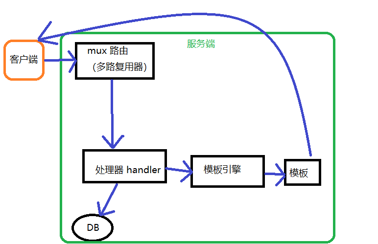
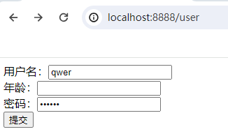
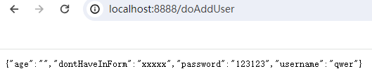
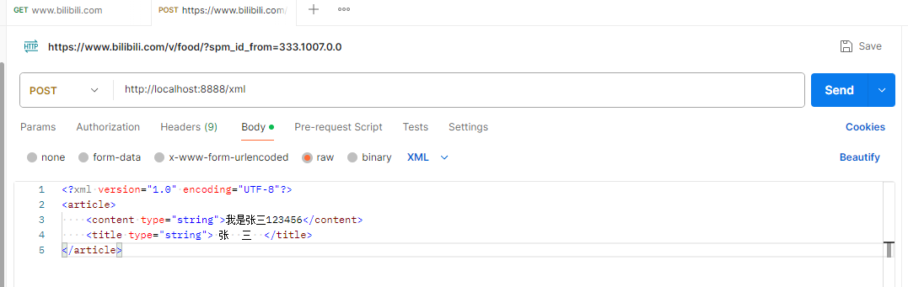
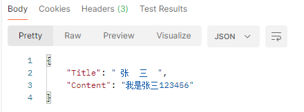
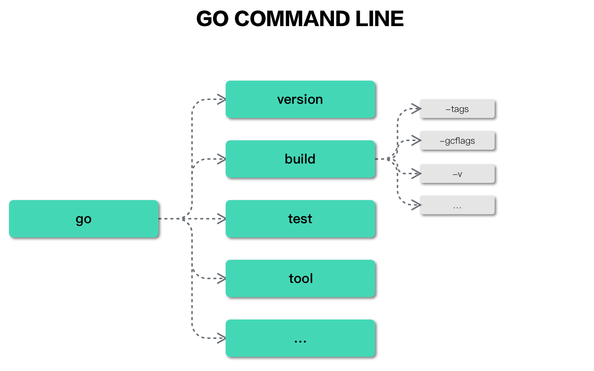

[【置顶】Go语言学习之路/Go语言教程 | 李文周的博客 (liwenzhou.com)](https://www.liwenzhou.com/posts/Go/golang-menu/)

[Go语言标准库文档](https://studygolang.com/pkgdoc) 

https://www.topgoer.com/

[数据结构和算法（Golang实现） - 《数据结构和算法（Golang实现）》 - 书栈网 · BookStack](https://www.bookstack.cn/read/hunterhug-goa.c/README.md)

# 网络和网页应用

本部分内容主要基于：

[15.1. tcp 服务器 | 第十五章. 网络，模板和网页应用 |《Go 入门指南》| Go 技术论坛 (learnku.com)](https://learnku.com/docs/the-way-to-go/151-tcp-server/3703)

[03.1. Web 工作方式 | 第三章. Web 基础 |《Go Web 编程》| Go 技术论坛 (learnku.com)](https://learnku.com/docs/build-web-application-with-golang/031-web-working-mode/3168)

 ## Go实现TCP/UDP通信

### socket

`Socket`是应用层与TCP/IP协议族通信的中间软件抽象层。在设计模式中，`Socket`其实就是一个门面模式，它把复杂的TCP/IP协议族隐藏在`Socket`后面，对用户来说只需要调用Socket规定的相关函数，让`Socket`去组织符合指定的协议数据然后进行通信。


### Go实现TCP通信

#### TCP服务端

一个TCP服务端可以同时连接很多个客户端，例如世界各地的用户使用自己电脑上的浏览器访问淘宝网。因为Go语言中创建多个goroutine实现并发非常方便和高效，所以我们可以每建立一次链接就创建一个goroutine去处理。

TCP服务端程序的处理流程：

1. 监听端口
2. 接收客户端请求建立链接
3. 创建goroutine处理链接。

我们使用Go语言的net包实现的TCP服务端代码如下：

```go
package main

import (
	"bufio"
	"fmt"
	"io"
	"net"
	"os"
	"strings"
)

func process(conn net.Conn) {

	defer conn.Close()
	// 3.与client通信
	reader := bufio.NewReader(os.Stdin)
	connReader := bufio.NewReader(conn)
	for {
		var buf []byte
		tmp := make([]byte, 8)

	receiveLoop:
		for { // 使用for循环读取，无论c端发来的信息多长都能接收
			n, err := connReader.Read(tmp) // 读取数据
			switch err {
			case io.EOF:
				break receiveLoop // c端断开连接后就会发送io.EOF 过来
			case nil:
				buf = append(buf, tmp[:n]...)
				if strings.HasSuffix(string(tmp[:n]), "\r\n\r\n") { // 判断内容接收完没有
					break receiveLoop
				}
			default:
				fmt.Println("read from client failed, err:", err)
				os.Exit(0)
			}
		}
		msg := string(buf)
		fmt.Println("收到client的消息：", msg)
		fmt.Print("[server] 请说：")
		text, _ := reader.ReadString('\n')
		text = strings.TrimSpace(text)
		if text == "exit" {
			break
		}
		conn.Write([]byte(text))
	}
}

func main() {
	// 1.本地端口启动服务
	listener, e1 := net.Listen("tcp", "127.0.0.1:20000")
	if e1 != nil {
		fmt.Println("start tcp server on 127.0.0.1:20000 failed, err:", e1)
		return
	}
	// 2.等待client建立连接
	for {
		conn, e2 := listener.Accept()
		if e2 != nil {
			fmt.Println("accept failed, err:", e2)
			return
		}
		go process(conn)
	}
}
```

将上面的代码保存之后编译成`server`或`server.exe`可执行文件。

#### TCP客户端

一个TCP客户端进行TCP通信的流程如下：

1. 建立与服务端的链接
2. 进行数据收发
3. 关闭链接

使用Go语言的net包实现的TCP客户端代码如下：

``` go
package main

import (
	"bufio"
	"fmt"
	"net"
	"os"
	"strings"
)

const StopCharacter = "\r\n\r\n" // 主动定义当前message完毕的结尾

func main() {
	// 1.与server建立连接
	conn, err := net.Dial("tcp", "127.0.0.1:20000")
	if err != nil {
		fmt.Println("connect server on 127.0.0.1:20000 failed, err:", err)
		return
	}
	// 2.发送数据
	reader := bufio.NewReader(os.Stdin)
	for {
		fmt.Print("[client] 请说：")
		text, _ := reader.ReadString('\n')
		text = strings.TrimSpace(text)
		if text == "exit" {
			break
		}
		conn.Write([]byte(text))
		conn.Write([]byte(StopCharacter)) // 将停止信号也发送过去
		var tmp = [128]byte{}
		n, e3 := conn.Read(tmp[:])
		if e3 != nil {
			fmt.Println("read from connection failed, err:", e3)
			return
		}
		fmt.Println(string(tmp[:n]))
	}
	conn.Close()
}
```

将上面的代码编译成`client`或`client.exe`可执行文件，先启动server端再启动client端，在client端输入任意内容回车之后就能够在server端看到client端发送的数据，从而实现TCP通信。

**注意：**

做TCP c/s模型连接实验时，c端s端连接成功后，我们想结束实验，于是分别在c端s端的shell窗口按下了ctrl+c。但此时机器中的服务端机器中的连接并没有直接断开而是进入`TIME_WAIT`阶段。如下所示：

``` shell
tcp        0      0 127.0.0.1:45538         127.0.0.1:8888          TIME_WAIT  
```

在Linux中，默认的TCP连接超时等待时间是60秒，可以通过调整操作系统的设置来更改TCP连接超时等待时间。编辑`/etc/sysctl.conf`文件，在文件末尾添加`net.ipv4.tcp_fin_timeout = <value>`来修改TCP连接超时等待时间。

``` shell
cat /proc/sys/net/ipv4/tcp_fin_timeout
60
# 查看到是60TCP断开连接

echo 20 > /proc/sys/net/ipv4/tcp_fin_timeout # 修改
```

修改后，保存文件并使用`sudo sysctl -p`重新加载`sysctl`配置。但最好不要改。


#### TCP黏包

**为什么会出现粘包**

主要原因就是tcp数据传递模式是流模式，在保持长连接的时候可以进行多次的收和发。

“粘包”可发生在发送端也可发生在接收端：

1. 由Nagle算法造成的发送端的粘包：Nagle算法是一种改善网络传输效率的算法。简单来说就是当我们提交一段数据给TCP发送时，TCP并不立刻发送此段数据，而是等待一小段时间看看在等待期间是否还有要发送的数据，若有则会一次把这两段数据发送出去。
2. 接收端接收不及时造成的接收端粘包：TCP会把接收到的数据存在自己的缓冲区中，然后通知应用层取数据。当应用层由于某些原因不能及时的把TCP的数据取出来，就会造成TCP缓冲区中存放了几段数据。

**黏包示例**

服务端代码如下：

```go
// socket_stick/server/main.go

func process(conn net.Conn) {
	defer conn.Close()
	reader := bufio.NewReader(conn)
	var buf [1024]byte
	for {
		n, err := reader.Read(buf[:])
		if err == io.EOF {
			break
		}
		if err != nil {
			fmt.Println("read from client failed, err:", err)
			break
		}
		recvStr := string(buf[:n])
		fmt.Println("收到client发来的数据：", recvStr)
	}
}

func main() {

	listen, err := net.Listen("tcp", "127.0.0.1:30000")
	if err != nil {
		fmt.Println("listen failed, err:", err)
		return
	}
	defer listen.Close()
	for {
		conn, err := listen.Accept()
		if err != nil {
			fmt.Println("accept failed, err:", err)
			continue
		}
		go process(conn)
	}
}
```

客户端代码如下：

```go
// socket_stick/client/main.go

func main() {
	conn, err := net.Dial("tcp", "127.0.0.1:30000")
	if err != nil {
		fmt.Println("dial failed, err", err)
		return
	}
	defer conn.Close()
	for i := 0; i < 20; i++ {
		msg := `Hello, Hello. How are you?`
		conn.Write([]byte(msg))
		// time.Sleep(time.Millisecond) 加上等待时间试试
	}
}
```

将上面的代码保存后，分别编译。先启动服务端再启动客户端，可以看到服务端输出结果如下：

```bash
收到client发来的数据： Hello, Hello. How are you?Hello, Hello. How are you?Hello, Hello. How are you?Hello, Hello. How are you?Hello, Hello. How are you?
收到client发来的数据： Hello, Hello. How are you?Hello, Hello. How are you?Hello, Hello. How are you?Hello, Hello. How are you?Hello, Hello. How are you?Hello, Hello. How are you?Hello, Hello. How are you?Hello, Hello. How are you?
收到client发来的数据： Hello, Hello. How are you?Hello, Hello. How are you?
收到client发来的数据： Hello, Hello. How are you?Hello, Hello. How are you?Hello, Hello. How are you?
收到client发来的数据： Hello, Hello. How are you?Hello, Hello. How are you?
```

客户端分10次发送的数据，在服务端并没有成功的输出10次，而是多条数据“粘”到了一起。

**解决办法**

出现”粘包”的关键在于接收方不确定将要传输的数据包的大小，因此我们可以对数据包进行封包和拆包的操作。

封包：封包就是给一段数据加上包头，这样一来数据包就分为包头和包体两部分内容了(过滤非法包时封包会加入”包尾”内容)。包头部分的长度是固定的，并且它存储了包体的长度，根据包头长度固定以及包头中含有包体长度的变量就能正确的拆分出一个完整的数据包。

我们可以自己定义一个协议，比如数据包的前4个字节为包头，里面存储的是发送的数据的长度。

```go
// socket_stick/proto/proto.go
package proto

import (
	"bufio"
	"bytes"
	"encoding/binary"
)

// Encode 将消息编码
func Encode(message string) ([]byte, error) {
	// 读取消息的长度，转换成int32类型（占4个字节）
	var length = int32(len(message))
	var pkg = new(bytes.Buffer)
	// 写入消息头
	err := binary.Write(pkg, binary.LittleEndian, length)
	if err != nil {
		return nil, err
	}
	// 写入消息实体
	err = binary.Write(pkg, binary.LittleEndian, []byte(message))
	if err != nil {
		return nil, err
	}
	return pkg.Bytes(), nil
}

// Decode 解码消息
func Decode(reader *bufio.Reader) (string, error) {
	// 读取消息的长度
	lengthByte, _ := reader.Peek(4) // 读取前4个字节的数据
	lengthBuff := bytes.NewBuffer(lengthByte)
	var length int32
	err := binary.Read(lengthBuff, binary.LittleEndian, &length)
	if err != nil {
		return "", err
	}
	// Buffered返回缓冲中现有的可读取的字节数。
	if int32(reader.Buffered()) < length+4 {
		return "", err
	}

	// 读取真正的消息数据
	pack := make([]byte, int(4+length))
	_, err = reader.Read(pack)
	if err != nil {
		return "", err
	}
	return string(pack[4:]), nil
}
```

接下来在服务端和客户端分别使用上面定义的`proto`包的`Decode`和`Encode`函数处理数据。

服务端代码如下：

```go
// socket_stick/server2/main.go

func process(conn net.Conn) {
	defer conn.Close()
	reader := bufio.NewReader(conn)
	for {
		msg, err := proto.Decode(reader)
		if err == io.EOF {
			return
		}
		if err != nil {
			fmt.Println("decode msg failed, err:", err)
			return
		}
		fmt.Println("收到client发来的数据：", msg)
	}
}

func main() {

	listen, err := net.Listen("tcp", "127.0.0.1:30000")
	if err != nil {
		fmt.Println("listen failed, err:", err)
		return
	}
	defer listen.Close()
	for {
		conn, err := listen.Accept()
		if err != nil {
			fmt.Println("accept failed, err:", err)
			continue
		}
		go process(conn)
	}
}
```

客户端代码如下：

```go
// socket_stick/client2/main.go

func main() {
	conn, err := net.Dial("tcp", "127.0.0.1:30000")
	if err != nil {
		fmt.Println("dial failed, err", err)
		return
	}
	defer conn.Close()
	for i := 0; i < 20; i++ {
		msg := `Hello, Hello. How are you?`
		data, err := proto.Encode(msg)
		if err != nil {
			fmt.Println("encode msg failed, err:", err)
			return
		}
		conn.Write(data)
	}
}
```

### Go实现UDP通信

UDP协议（User Datagram Protocol）中文名称是用户数据报协议，是OSI（Open System Interconnection，开放式系统互联）参考模型中一种**无连接**的传输层协议，不需要建立连接就能直接进行数据发送和接收，属于不可靠的、没有时序的通信，但是UDP协议的实时性比较好，通常用于视频直播相关领域。

#### UDP服务端

使用Go语言的`net`包实现的UDP服务端代码如下：

```go
// UDP/server/main.go

// UDP server端
func main() {
	listen, err := net.ListenUDP("udp", &net.UDPAddr{
		IP:   net.IPv4(0, 0, 0, 0),
		Port: 30000,
	})
	if err != nil {
		fmt.Println("listen failed, err:", err)
		return
	}
	defer listen.Close()
	for {
		var data [1024]byte
		n, addr, err := listen.ReadFromUDP(data[:]) // 接收数据
		if err != nil {
			fmt.Println("read udp failed, err:", err)
			continue
		}
		fmt.Printf("data:%v addr:%v count:%v\n", string(data[:n]), addr, n)
		_, err = listen.WriteToUDP(data[:n], addr) // 发送数据
		if err != nil {
			fmt.Println("write to udp failed, err:", err)
			continue
		}
	}
}
```

#### UDP客户端

使用Go语言的`net`包实现的UDP客户端代码如下：

```go
// UDP 客户端
func main() {
	socket, err := net.DialUDP("udp", nil, &net.UDPAddr{
		IP:   net.IPv4(0, 0, 0, 0),
		Port: 30000,
	})
	if err != nil {
		fmt.Println("连接服务端失败，err:", err)
		return
	}
	defer socket.Close()
	sendData := []byte("Hello server")
	_, err = socket.Write(sendData) // 发送数据
	if err != nil {
		fmt.Println("发送数据失败，err:", err)
		return
	}
	data := make([]byte, 4096)
	n, remoteAddr, err := socket.ReadFromUDP(data) // 接收数据
	if err != nil {
		fmt.Println("接收数据失败，err:", err)
		return
	}
	fmt.Printf("recv:%v addr:%v count:%v\n", string(data[:n]), remoteAddr, n)
}
```

## web服务器及工作原理

golang使用`net/http`包搭建网页服务器。

以下均是服务器端的几个概念

- Request：用户请求的信息，用来解析用户的请求信息，包括 post、get、cookie、url 等信息

- Response：服务器需要反馈给客户端的信息

- Conn：用户的每次请求链接

- Handler：处理请求和生成返回信息的处理逻辑

### 简单的web服务器示例

``` go
package main

import (
	"fmt"
	"log"
	"net/http"
)

func HelloServer(w http.ResponseWriter, req *http.Request) {
	fmt.Println("根地址注册的一个处理函数")
	req.ParseForm() // 解析URL后跟的那些参数，默认是不解析的
	fmt.Println("path:", req.URL.Path)
	fmt.Println("scheme:", req.URL.Scheme)
	fmt.Println(req.Form["myField"]) // url中带来的参数
	fmt.Println(req.Form["NONE"])    // url中带来的参数
	for k, v := range req.Form {
		fmt.Println("key:", k, ", value:", v)
	}
	fmt.Fprintf(w, "<h1>标题1</h1>Hello, 、"+req.URL.Path[1:]) // 向 相应 w 写入一些东西，会直接出现的客户端的浏览器上
	/* w 实现了 io.Writer 接口，使用下面的方法输出也可以
	wtr := bufio.NewWriter(w)
	wtr.WriteString("<h1>Hello</h1>" + req.URL.Path[1:])
	wtr.Flush()
	*/
}
func main() {
	// 注：浏览器向本服务器发送http请求时，每个额外的图片或文件资源都会发送一个单独的http GET请求来获取这些资源，以便并行下载。因此注册的 HelloServer 函数会被调用多次。
	http.HandleFunc("/", HelloServer) // 第一个参数是请求的路径，然后为服务器的根地址注册一个处理函数
	// http.Handle("/", http.HandlerFunc(HelloServer))   //与上面的写法是一样的
	err := http.ListenAndServe("localhost:8888", nil) // 使用 http.ListenAndServeTLS() 代替 http.ListenAndServe() 可以使用安全的https连接，此处暂时不讨论
	if err != nil {
		log.Fatal("ListenAndServe: ", err.Error())
	}
}

```

我们运行此文件后，打开浏览器输入` http://localhost:8888/?myField=1&myField=2&anotherField=3`，浏览器出现预期结果不难解释。然后查看服务器控制台打印的结果。

``` php
根地址注册的一个处理函数
path: /
scheme:
[1 2]
[]
key: myField , value: [1 2]
key: anotherField , value: [3]
根地址注册的一个处理函数
path: /favicon.ico
scheme:
[]
[]
```

可以明显看出，浏览器一共发送了两个GET请求。一个请求根目录`/`，一个请求了默认的图标`favicon.ico`。两个GET请求都进入了HelloServer 函数进行处理。而且只有请求根目录的请求会带有客户端在URL中写入的那些参数。

在服务端的req中我们可以按参数name拿到URL中传入的参数的。

### 工作流程

web流程图如下：



Go 实现 Web 服务的工作模式的流程图


开启一个go web服务最本质的代码就两行

``` go
http.HandleFunc("/", HelloServer)
http.ListenAndServe("localhost:8888", nil) 
```

在`http.ListenAndServe`内部会开启端口监听`ln, err := net.Listen("tcp", addr)`，然后调用了 `srv.Serve(net.Listener)` 函数，这个函数就是处理接收客户端的请求信息。`srv.Serve(net.Listener)` 函数中会调用`rw, err := l.Accept()`来接收TCP连接，并为每个连接conn单独开了一个 goroutine。

那么如何具体分配到相应的函数来处理请求呢？`c.readRequest()`, 然后获取相应的 handler:`handler := c.server.Handler`，也就是我们刚才在调用函数 `ListenAndServe` 时候的第二个参数，我们前面例子传递的是 nil，也就是为空，那么默认获取 `handler = DefaultServeMux`, 那么这个变量用来做什么的呢？对，这个变量就是一个路由器，它用来匹配 url 跳转到其相应的 handle 函数，而这里的handle函数就是我们在 `http.HandleFunc("/", HelloServer)` 中设置的第二次参数。这个函数注册了请求 `/` 的路由规则，当请求 uri 为 "/"，路由就会转到函数 HelloServer，最后通过写入 response 的信息反馈到客户端。

详细的整个流程如下图所示：


## 使用go发送http请求

简单地发送请求（简单看看就行，不可取）

``` go
package main

import (
	"fmt"
	"io/ioutil"
	"net/http"
)

var urls = []string{
	"http://www.baidu.com",
	"http://p4.org",
}

func main() {
	for _, url := range urls {
		resp, err := http.Head(url) // 向指定的URL发送HEAD，用来简单地判断url是否可以到达
		if err != nil {
			fmt.Println("Error:", url, err)
		}
		fmt.Println(url, ":", resp.Status)
	}
	// 发送http请求去访问哔哩哔哩
	resp2, err := http.Get("http://www.bilibili.com")
	if err != nil {
		fmt.Println("Error:", err)
	}
	data, _ := ioutil.ReadAll(resp2.Body)
	fmt.Println(string(data))
	fmt.Println(resp2.Header)
}
```

**下面的代码完整的发送HTTP请求的规范写法**

``` go
package main

import (
	"fmt"
	"io/ioutil"
	"net/http"
)

/*
此go文件直接由postman生成，如果执行出错请重新去生成就行
*/
func main() {

	url := "https://www.bilibili.com/v/food/?spm_id_from=333.1007.0.0" // 目标URL
	method := "GET"                                                    // 请求方法

	client := &http.Client{}
	req, err := http.NewRequest(method, url, nil)

	if err != nil {
		fmt.Println(err)
		return
	}
	// 添加请求头
	req.Header.Add("X-Auth-Token", "gAAAAABk5AwA3PSYoVg45J-kUAm7LVU_jDBhZq-rhThl89KTEnU__6LA6lH-534jmGRyefIazEIpae6kzRdeQD3oSgsRCyzDIlxibhUHR9kYsEEysqSrmP-rEMkn9ZDAmdcTq0OVVVv9URLdh967RDLf_Ia6A4HWTtk1BE1YsYka7-_XFeW0Vn0")
	req.Header.Add("Cookie", "b_nut=1692109483; b_ut=7; buvid3=09E66EFB-87C2-744F-D2AD-1B53628FA45383615infoc; i-wanna-go-back=-1")

	res, err := client.Do(req)
	if err != nil {
		fmt.Println(err)
		return
	}
	defer res.Body.Close()

	body, err := ioutil.ReadAll(res.Body)
	if err != nil {
		fmt.Println(err)
		return
	}
	fmt.Println(string(body))
}
```


## 常见库包解释

### net/http

Go 的 http 有两个核心功能：Conn、ServeMux

Go 为了实现高并发和高性能，使用了 goroutines 来处理 Conn 的读写事件，这样每个请求都能保持独立，相互不会阻塞，可以高效的响应网络事件。

server.go文件中定义的`Hanler`。

``` go
type Handler interface {
	ServeHTTP(ResponseWriter, *Request) //ServeHTTP应该将回复头和数据写入ResponseWriter，然后返回。返回请求已完成的信号；使用ResponseWriter或从请求中读取是无效的。在ServeHTTP调用完成之后或同时完成的正文。
}
```

它就是处理HTTP请求的处理器。是一个接口，只有一个方法`ServeHTTP(ResponseWriter, *Request)`

#### ServeMux

服务端设定监听地址和路由器的代码：`http.ListenAndServe("localhost:8888", nil) `。第二次参数就是路由器，为nil表示调用了 http 包默认的路由器，通过路由器将本次请求的信息传递到后端的处理函数。该路由器的结构定义在`http.server.go`文件中：

``` go
type ServeMux struct {
	mu    sync.RWMutex // 锁，由于请求涉及到并发处理，因此这里需要一个锁机制
	m     map[string]muxEntry // 路由规则，一个string对应一个mux 实体
	es    []muxEntry // slice of entries sorted from longest to shortest.
	hosts bool       // whether any patterns contain hostnames
}
type muxEntry struct {
	h       Handler // 这个路由表达式对应哪个 handler
	pattern string // 匹配的字符串
}
type Handler interface {
	ServeHTTP(ResponseWriter, *Request)  // 路由实现
}
```

默认的路由器实现了 `ServeHTTP`

``` go
func (mux *ServeMux) ServeHTTP(w ResponseWriter, r *Request) {
	if r.RequestURI == "*" {
		if r.ProtoAtLeast(1, 1) {
			w.Header().Set("Connection", "close")
		}
		w.WriteHeader(StatusBadRequest)
		return
	}
	h, _ := mux.Handler(r)
	h.ServeHTTP(w, r)
}
```

路由器收到请求后，没出错，就调用` mux.Handler(r)`返回对应设置路由的处理Handler（一般就是我们使用http.HandleFunc传入的handler），然后执行`h.ServeHTTP(w, r)`。


### net.Error

这是`net`包返回的错误类型。定义如下

``` go
// An Error represents a network error.
type Error interface {
	error
	Timeout() bool // Is the error a timeout?

	// Deprecated: Temporary errors are not well-defined.
	// Most "temporary" errors are timeouts, and the few exceptions are surprising.
	// Do not use this method.
	Temporary() bool
}
```

可以看出，`net.Error` 不仅嵌套了内建的`error`，还额外声明了两个方法，表达该错误是否超时或错误是否为临时错误。

`net`包中有许多结构体实现该接口，如`OpError`,`ParseError`, `AddrError`, `UnknownNetworkError`, `timeoutError`, `DNSConfigError` 等等。例如 conn 的`SetReadDeadline`方法就可能返回`OpError`错误。

很多是否网络连接返回的错误我们可能通过类型断言来测试 `net.Error`，从而区分哪些临时发生的错误或者必然会出现的错误。举例来说，一个网络爬虫程序在遇到临时发生的错误时可能会休眠或者重试，如果是一个必然发生的错误，则他会放弃继续执行。

``` go
if neterr, ok := err.(net.Error); ok && neterr.Temporary(){
    time.Sleep(100)
    continue
}
if err != nil{
    log.Fatal(err)
}
```

# Gin框架

Gin 是一个由go编写的轻量级的 http web框架，运行速度非常快。

- github地址：[gin-gonic/gin: Gin is a HTTP web framework written in Go (Golang). It features a Martini-like API with much better performance -- up to 40 times faster. If you need smashing performance, get yourself some Gin. (github.com)](https://github.com/gin-gonic/gin)

- 官网地址：[Gin Web Framework (gin-gonic.com)](https://gin-gonic.com/zh-cn/)

## 环境搭建

因为gin是go原生开发的，所以只要安装了go环境，把gin下载下来就可以直接用了。

下载并安装 gin：

``` go
go get -u github.com/gin-gonic/gin
```

下载可能出现问题，解决参考：https://www.cnblogs.com/xiaoyingzhanchi/p/14410626.html

在代码中引用gin

``` go
import "github.com/gin-gonic/gin"
```

我们常常会使用诸如 `http.StatusOK `之类的常量，因此常常引入` net/http` 包

**简单使用**

``` go
package main

import (
	"net/http"

	"github.com/gin-gonic/gin"
)

func main() {
	// 创建一个默认路由
	r := gin.Default()
	// 配置路由，注册一个GET请求的处理函数。当访问根目录"/"时，会执行后面的回调函数。
	r.GET("/", func(c *gin.Context) {
		c.String(http.StatusOK, "值：%v", "hello 你好 gin")
	})
	r.GET("/news", func(c *gin.Context) {
		c.String(http.StatusOK, "商品：%v", "水果")
	})
	r.POST("/add", func(c *gin.Context) { // 浏览器url无法提交post，只能form提交，或者postman模拟
		c.String(http.StatusOK, "这是一个post")
	})
	r.PUT("/edit", func(c *gin.Context) { // 浏览器url无法提交post，只能form提交，或者postman模拟
		c.String(http.StatusOK, "这是一个PUT")
	})
	r.DELETE("/del", func(c *gin.Context) { // 浏览器url无法提交post，只能form提交，或者postman模拟
		c.String(http.StatusOK, "这是一个DELETE")
	})
	// r.Run() // 启动一个web服务，默认在 0.0.0.0:8080 启动服务
	r.Run("localhost:8888")
}
```

## golang程序的热加载 

代码修改后，程序能够自动重新加载并执行。 gin中没有官方提供的热加载工具，需要借助第三方工具

``` go
go get github.com/pilu/fresh // 下载
go install github.com/pilu/fresh // 安装
```

在项目中安装`fresh`后，直接在命令行执行`fresh`，之后就可以完全用`fresh`替代 `go run main.go`了。

发现程序也正常执行了。此时我们执行修改代码，发现命令行立刻自动重新加载服务，说明fresh生效了。

## Gin HTML模板渲染

### 返回json,xml数据

返回json,xml的示例代码如下，见`gindemo2`：

``` go
package main

import (
	"github.com/gin-gonic/gin"
)

type User struct {
	Name string `json:"name"` // 注意这里的属性名必须大写公开，不然无法传送到客户端
	Age  int    `json:"age"`  // 定义json中的返回字段写法
}

func main() {
	// 创建一个默认路由
	r := gin.Default()
	// 配置路由，注册一个GET请求的处理函数。当访问根目录"/"时，会执行后面的回调函数。
	r.GET("/", func(c *gin.Context) {
		c.String(200, "首页")
	})

	// **** 返回 json 数据 ****
	r.GET("/json", func(c *gin.Context) {
		c.String(200, "返回json数据")
		c.JSON(200, map[string]interface{}{
			"success": true,
			"msg":     "你好 gin",
		}) // 第二个参数是空接口类型，可以返回任意类型数据，上面是通常的写法
		c.JSON(200, gin.H{
			"a": 1,
		}) // 这里gin.H 就是 map[string]interface{} 的简写
	})
	r.GET("/json2", func(c *gin.Context) {
		a := &User{"tom", 12}
		c.String(200, "返回json数据")
		c.JSON(200, a)
	})
	// 相应 JSONP 请求，一般情况下json和jsonp用法一样。
	// jsonp与json的区别是jsonp可以传入回调函数。
	// 比如 访问 localhost:8888/jsonp?callback=xxx
	// 可以看到前端打印 xx({"name":"jerry","age":2});
	// 具体有什么用呢，之后再说吧，现在用的不多
	r.GET("/jsonp", func(c *gin.Context) {
		c.JSONP(200, User{"jerry", 2})
	})

	// 返回 xml 数据
	r.GET("/xml1", func(c *gin.Context) {
		c.XML(200, gin.H{
			"success": true,
			"msg":     "this is xml",
		}) // 参数类型和c.String c.JSON一样

	})

	r.Run("localhost:8888")
}
```

### 返回html数据

``` go
package main

import (
	"net/http"

	"github.com/gin-gonic/gin"
)

func returnHTML() {
	router := gin.Default()
	// 要返回html 需要加载我们的所有模板文件，因为我们不可能真在这里写所有的html代码
	router.LoadHTMLGlob("mytemplates/*") // 加载本地文件夹，里面都是html模板，注意，这里只能使用mytemplates 目录下的文件，其子目录中的文件不能使用。配置方法往下看
	router.GET("/", func(c *gin.Context) {
		c.HTML(http.StatusOK, "index.html", gin.H{
			"title": "后台数据",
			"name":  "jack",
		}) // 第二次参数写 html 文件目录，第三个参数写 传给这个html页面模板的数据
		/*
			在模板中的html 中，通过 {{.变量名}}就可以得到这里传入的变量了。
		*/
	})
	// 访问路由指向一个 html 页面，并将后端数据传给html页面
	router.Run("localhost:8888")
}

func main() {
	returnHTML()
}
```

在项目目录下新建`mytemplates`文件夹，里面放html 模板，如`index.html`

``` html
<!DOCTYPE html>
<html lang="en">
  <head>
    <meta charset="UTF-8" />
    <meta name="viewport" content="width=device-width, initial-scale=1.0" />
    <title>{{.title}}</title>
  </head>
  <body>
    <h1>首页</h1>
    hello, {{.name}}
  </body>
</html>
```

浏览器输入`http://localhost:8888/`就可以访问到这个页面，而且有后台传入的数据。

如果在`mytemplates`文件夹有多级目录，就需要额外写法，见`gindemo3`。

如果项目文件树是这样的：

``` txt
- 项目名
	- mytemplates
		- amdin
			- goods.html
			- index.html
		- default
			- goods.html
			- index.html
	- main.go
	- go.mod
	- go.sum
```

main.go代码如下：

``` go
package main

import (
	"net/http"

	"github.com/gin-gonic/gin"
)

type User struct {
	Name string `json:"name"` // 注意这里的属性名必须大写公开，不然无法传送到客户端
	Age  int    `json:"age"`  // 定义json中的返回字段写法
}

func returnHTML() {
	router := gin.Default()
	// 如果要加载多层目录的模板，就必须要层级结构写得完全清楚
	router.LoadHTMLGlob("mytemplates/**/*") // 只能加载本地文件夹二层文件夹，
	// 前台页面
	router.GET("/", func(c *gin.Context) {
		c.HTML(http.StatusOK, "default/index.html", gin.H{ // 第二个参数就要写html模板首行定义的名称了。
			"title": "前台数据",
			"name":  "jack",
		}) // 第二个参数就要写html模板首行定义的名称了。
		/*
			在模板中的html 中，通过 {{.变量名}}就可以得到这里传入的变量了。
		*/
	})
	router.GET("/goods", func(c *gin.Context) {
		u := &User{"jerry", 78}
		c.HTML(http.StatusOK, "default/goods.html", gin.H{
			"title": "前台商品页面",
			"name":  "tom",
			"user":  u,
		})
		// 在html 模板中可以 {{.user}} 可以直接得到结构体，也可以 {{.user.Name}} 得到接口的成员变量
	})
	// 后台页面
	router.GET("/admin/", func(c *gin.Context) {
		c.HTML(http.StatusOK, "admin/index.html", gin.H{
			"title": "后台首页",
		})
	})
	router.GET("/admin/goods", func(c *gin.Context) {
		c.HTML(http.StatusOK, "admin/goods.html", gin.H{
			"title": "后台商品页面",
		})
	})

	// 访问路由指向一个 html 页面，并将后端数据传给html页面
	router.Run("localhost:8888")
}

func main() {
	returnHTML()
}
```

default/index.html 代码如下：

``` html
<!-- 定义模板的名称，它是与end成对出现的, 在go代码中要引用这个名称 -->
{{ define "default/index.html"}}
<!DOCTYPE html>
<html lang="en">
  <head>
    <meta charset="UTF-8" />
    <meta name="viewport" content="width=device-width, initial-scale=1.0" />
    <title>{{.title}}</title>
  </head>
  <body>
    <h1>前台首页</h1>
    hello, {{.name}}
  </body>
</html>
{{ end }}
```

其他html代码类似。

总结发现

- `router.LoadHTMLGlob`引用模板目录很麻烦，只能引用当前一级的目录。
- 在html模板直接嵌套后端引用的变量已不再适合当前前后端分离的大趋势了。但可以了解一下写法。 

### gin 模板语法

文件项目：gindemo3

``` html
<!-- 定义模板的名称，在go代码中要引用这个名称 -->
{{ define "default/goods.html"}}
<!DOCTYPE html>
<html lang="en">
  <head>
    <meta charset="UTF-8" />
    <meta name="viewport" content="width=device-width, initial-scale=1.0" />
    <title>{{.title}}</title>
  </head>
  <body>
    <h1>前台商品页面</h1>
    名称：{{.name}}
    <hr />
    <h1>定义变量</h1>
    <!-- 定义变量 ，把后台的数据赋值给模板里的变量 -->
    {{$uname := .user.Name}}
    <!-- 输出定义的变量 -->
    <h4>{{$uname}}</h4>
    <hr />
    <h1>比较函数</h1>
    {{ if ge .score 60}} 及格 {{else}} 不及格 {{end}}
    <!-- else 中还可以接 if  不演示了-->
    <!-- gt 大于；ge 大于等于；lt 小于；le 小于等于；eq 等于；ne 不等于-->
    <hr />
    <h1>循环遍历 range</h1>
    <ul>
      {{range $key, $value := .hobbies}}
      <li>{{$key}}: {{$value}}</li>
      {{else}} 传入的切片数据是没有值的，可以是切片是空的，也可以是切片没有定义
      {{end}}
    </ul>
    <hr />
    <h1>结构体解构 with</h1>
    {{with .user}} 在这个结构中，.user的成员变量已经解构了，可以直接使用
    <p>name ={{.Name}}</p>
    <p>age:{{.Age}}</p>
    {{end}}

    <hr />
    <h1>预定义函数</h1>
    user.name： {{ .user.Name}}， 它的长度等于 {{ len .user.Name}}
    其他内置的预定义函数如and,or 等自己查询
    <hr />
    <h1>自定义模板函数</h1>
    在后台go 文件中，加载HTML模板文件的语句上面
    <pre>
	router.SetFuncMap(template.FuncMap{
      "UnixToTime": UnixToTime, // UnixToTime 是自己定义的，返回一个时间的字符串即可
    })
  </pre
    >
    时间戳 {{.date}} 代表{{UnixToTime .date}}
  </body>
</html>
{{ end }}

```

### 模板嵌套

写一个公共模板 `public/header.html`

``` html
{{ define "public/header.html"}}

<style>
  h2 {
    background-color: yellow;
    color: tomato;
    text-align: center;
  }
</style>

<h2>this is 公共头部，所在页面:{{.title}}，{{.sthNotExist}}</h2>
<!-- 后面引用的后端变量在被其他页面引用时才会赋值 -->
{{end}}
```

在其他页面需要引用的位置加上`{{ template "public/header.html" .}}` 即可。

## 静态文件服务

当我们渲染的html文件引用了静态文件（css,js）时，我们需要配置静态web服务。

首先我们在项目目录下新建`static`文件夹，里面再新建`css, js, img`文件夹。再css里面新建文件`base.css`

``` css
h1 {
  background-color: teal;
  color: hotpink;
  text-align: center;
}
h2 {
  color: green;
}
```

我们在任意页面中通过普通前端的方式引入

``` html
<head>
    ...
    <link rel="stylesheet" href="/static/css/base.css" />
    <!-- 前端写文件地址时写上最前面的斜杠，表示相对于根目录 -->
</head>
```

然后我们访问该页面，发现此css并没有生效。我们在浏览器控制台发现浏览器确实请求了 `http://localhost:8888/static/css/base.css`，但是404失败了。

说明gin启动的web服务，**项目目录下的任何文件都必须在后台进行配置才能进行访问**，比如html页面通过`router.LoadHTMLGlob("mytemplates/**/*") `和`router.GET("/", func(c *gin.Context){})`配置。

因此像css这样的静态文件也需要配置，如下

``` go
router.Static("/static", "./static") // 配置静态web 目录，第一个参数是前端要请求的地址，第二次参数写文件存放的地址
// 一般此语句放在router.LoadHTMLGlob("mytemplates/**/*") 下方即可
// 观察语句发现它不需要像配置html要把每一层的目录都明确地写上
```

## 路由传值

### GET请求传值

前端从URL传入的值，如访问`http://localhost:8888/?user=sd`

``` go
	router.GET("/", func(c *gin.Context) {
		user := c.Query("user")             // 前端通过 URL?xxx=XXX  传过来的值
		page := c.DefaultQuery("page", "1") // 不传过来我也可以用带默认值的函数
		c.JSON(http.StatusOK, gin.H{
			"user": user,
			"page": page,
		})
	})
```

前端页面就可以返回我们返回的json页面。

### POST请求传值

我们写一个有form元素的前端页面，用来提交post请求。user.html

``` html
<!DOCTYPE html>
<html lang="en">
  <head>
    <meta charset="UTF-8" />
    <meta name="viewport" content="width=device-width, initial-scale=1.0" />
    <title>用户界面</title>
  </head>
  <body>
    <form action="doAddUser" , method="post">
      用户名：<input type="text" name="username1" /> <br />
      年龄：<input type="txt" name="age1" /> <br />
      密码：<input type="password" name="password1" /> <br />
      <input type="submit" value="提交" />
      <!-- 点击提交就会去请求 doAddUser -->
    </form>
  </body>
</html>
```

在后端找到这个html模板，并处理提交的post请求。

``` go
	router.GET("/user", func(c *gin.Context) {
		c.HTML(http.StatusOK, "user.html", gin.H{})
	})
	// 处理form 提交过来的post请求
	router.POST("/doAddUser", func(c *gin.Context) {
		username := c.PostForm("username1")
		password := c.PostForm("password1")
		age := c.DefaultPostForm("age1", "18")
		dontHaveInForm := c.DefaultPostForm("dhif", "xxxxx")
		c.JSON(http.StatusOK, gin.H{
			"username":       username,
			"password":       password,
			"age":            age,
			"dontHaveInForm": dontHaveInForm,
		})
	})
```

提交form表单时不写age，看看效果：



结果如下：



可见，加默认值的`age := c.DefaultPostForm("age1", "18")`，在表单中有这个字段，即使不写也相当于传入值为空“”。

### 绑定到结构体

获取GET/POST传递的数据绑定到结构体，其实是利用反射机制自动提取了请求中的QuerString、form表单、json、xml到结构体中。

#### **GET 请求**

``` go
// 用来 绑定的 结构体
type UserInfo struct {
	UserName string `form:"username"` // 配置 form  标签
	Password int    `form:"password"` //
}

...

	// 获取post 传来的数据并绑定在结构体中
	router.GET("/getUser", func(c *gin.Context) {
		user := &UserInfo{} 
		if err := c.ShouldBind(&user); err != nil {
			c.JSON(200, gin.H{
				"err": err.Error(),
			})
		} else {
			c.JSON(200, user)
		}
	})

```

我们在浏览器访问 `http://localhost:8888/getUser?username=123&password=345 `，能够看到页面正确打印我们传入的值。

#### **POST请求**

``` go
	// 处理form 提交过来的post请求，并用结构体来接收传的值
	router.POST("/doAddUser2", func(c *gin.Context) {
		user := &UserInfo{} // 用的结构体就是上面定义的
		if err := c.ShouldBind(&user); err != nil {
			c.JSON(200, gin.H{
				"err": err.Error(),
			})
		} else {
			c.JSON(200, user)
		}
	})
// 当然，前端代码要写对应
/*
    <form action="doAddUser2" , method="post">
      用户名：<input type="text" name="username" /> <br />
      密码：<input type="password" name="password" /> <br />
      <input type="submit" value="提交" />
      <!-- 点击提交就会去请求 doAddUser -->
    </form>
*/
```

在有这个表单的前端页面中输入username和password并提交，可以看到正确结果。

#### POST提交的XML数据

``` go
// 用来 绑定 xml数据的 结构体
type Article struct {
	Title   string `form:"title" xml:"title"`     // 配置 xml 标签
	Content string `form:"content" xml:"content"` //
}
...

	// 获取POST传过来的 xml 数据
	router.POST("/xml", func(c *gin.Context) {
		b, _ := c.GetRawData() // 获取原始未解析的数据stream data.，返回的b是 []byte类型
		article := &Article{}
		if err := xml.Unmarshal(b, &article); err != nil {
			c.JSON(400, err)
		} else {
			c.JSON(200, article)
		}
	})

/* xml数据如下
<?xml version="1.0" encoding="UTF-8"?>
<article>
    <content type="string">我是张三123456</content>
    <title type="string"> 张  三  </title>
</article>
*/
```

后端代码如上，然后使用postman发送一个带xml数据的post请求



send发送之后我们看到结果：



#### 动态路由

我们也可以通过`user/123`，`user/qwer`这样的方式来访问，也即不用 `?`来传值。即将后面的值`123、qwer`作为值传给后台。

``` go
	// 动态路由， uid是被解析为用户传入的值
	router.GET("/user/:uid", func(c *gin.Context) {
		uid := c.Param("uid") // 解析传入的值
		c.JSON(200, gin.H{
			"name": "这是user界面",
			"uid":  "传入的uid为" + uid,
		})
	})
```

访问 `http://localhost:8888/user/123撒旦` 得到页面结果 `{"name":"这是user界面","uid":"传入的uid为123撒旦"}`。

## 路由分组


# 数据结构

## 2. 递归

#### 递归实现斐波那契数列

``` go
func Fibonacci(n int) int {
	if n == 1 || n == 2 {
		return 1
	}
	return Fibonacci(n-1) + Fibonacci(n-2)
}
```

#### 递归实现二分查找

``` go
func BinarySearch(nums []int, target, left, right int) int {
	if left > right {
		return -1
	}
	mid := (left + right) / 2
	if nums[mid] == target {
		return mid
	} else if nums[mid] > target {
		return BinarySearch(nums, target, left, mid-1)
	} else {
		return BinarySearch(nums, target, mid+1, right)
	}
}
```

#### 非递归实现二分查找

``` go
func BinarySearch2(nums []int, target int) int {
	left, mid, right := 0, -1, len(nums)-1
	for left <= right {
		mid = (left + right) / 2
		if nums[mid] == target {
			return mid
		} else if nums[mid] > target {
			right = mid - 1
		} else {
			left = mid + 1
		}
	}
	return -1
}
```

## 3. 链表

#### 单链表

``` go
type LinkNode struct {
	val      int
	nextNode *LinkNode
}


func main() {
	var n4 LinkNode = LinkNode{4, nil}
	var n3 LinkNode = LinkNode{3, &n4}
	var n2 LinkNode = LinkNode{2, &n3}
	var n1 LinkNode = LinkNode{1, &n2}
	// 这里tmp是LinkNode指针类型，因为struct是值类型不能用来==nil，
	for tmp := &n1; tmp != nil; tmp = tmp.nextNode {
		fmt.Println(tmp.val)
	}
}
```

#### 双向链表

go自带的包container/list就是双向链表

导入list包：`import  list "container/list"`

``` go
// list中的元素
type Element struct {
	next, prev *Element
	list *List
	Value any
}
// 由Element来维护前后指针
type List struct {
	root Element // sentinel list element, only &root, root.prev, and root.next are used
	len  int     // current list length excluding (this) sentinel element
}
// 初始化或清空list
func (l *List) Init() *List {
	l.root.next = &l.root
	l.root.prev = &l.root
	l.len = 0
	return l
}
// 可以看出，List一直有一个不可读取的root节点，
```

需要注意的是使用List时，不会直接用List对象，因为list里的函数的caller几乎都是Element，不是List，所以一般用List.Back()。其他插值，删除等等方法参见[Go语言标准库文档中文版 | Go语言中文网 | Golang中文社区 | Golang中国 (studygolang.com)](https://studygolang.com/pkgdoc)

#### 环链表

go自带的包container/ring就是环链表

导入ring包：`import  ring "container/ring"`

``` go
// 只是环的一个元素，因为只要拿一个环的一个元素就拿到了整个环
type Ring struct {
	next, prev *Ring
	Value      any // 可以直接改
}
// New creates a ring of n elements.
func New(n int) *Ring {
	if n <= 0 {
		return nil
	}
	r := new(Ring)
	p := r
	for i := 1; i < n; i++ {
		p.next = &Ring{prev: p}
		p = p.next
	}
	p.next = r
	r.prev = p
	return r
}
```

## 4. 栈

go没有自带的栈类型，我们可以用数组(切片)或者列表来实现

- **数组实现**：能快速随机访问存储的元素，通过下标 `index` 访问，支持随机访问，查询速度快，但存在元素在数组空间中大量移动的操作，增删效率低。

- **链表实现**：只支持顺序访问，在某些遍历操作中查询速度慢，但增删元素快

#### 数组实现

``` go
// 实现数组栈 ArrayStack1
type ArrayStack struct {
	array []int // 底层切片
	size  int
	lock  sync.Mutex
}

// 入栈
func (stack *ArrayStack) Push1(v int) {
	stack.lock.Lock()
	defer stack.lock.Unlock()
	stack.array = append(stack.array, v)
	stack.size++
}

// 出栈
func (stack *ArrayStack) Pop1() int {
	stack.lock.Lock()
	defer stack.lock.Unlock()
	if stack.size <= 0 {
		panic("stack is empty.")
	}
	v := stack.array[stack.size-1]
	stack.size--
	stack.array = stack.array[:stack.size]
	return v
	/*
		如果切片偏移量向前移动 stack.array[0 : stack.size-1]，
		表明最后的元素已经不属于该数组了，数组变相的缩容了。
		此时，切片被缩容的部分并不会被回收，仍然占用着空间，
		所以空间复杂度较高，但操作的时间复杂度为：O(1)。

		如果我们创建新的数组 newArray，然后把老数组的元素复制到新数组，
		就不会占用多余的空间，但移动次数过多，时间复杂度为：O(n)。
	*/
}

func (stack *ArrayStack) Peek1() int {
	if stack.size == 0 {
		panic("stack is empty.")
	}
	return stack.array[stack.size-1]
}
func (stack *ArrayStack) Size1() int {
	return stack.size
}
func (stack *ArrayStack) IsEmpty() bool {
	return stack.size == 0
}
```

#### 链表实现

``` go
// 实现链表栈 LinkStack
type LinkStack struct {
	root *LinkNode // 链表起点
	size int
	lock sync.Mutex
}
type LinkNode struct {
	Next  *LinkNode
	value int
}

// 入栈
// 如果把root当作栈底的话，那么入栈出栈等等都要一直把整个栈找一遍找到栈顶，时间复杂度为O(n)，不合适
// 故把root当作栈顶
func (stack *LinkStack) Push2(v int) {
	stack.lock.Lock()
	defer stack.lock.Unlock()
	node := LinkNode{value: v}
	if stack.root == nil {
		stack.root = &node
	} else {
		node.Next = stack.root
		stack.root = &node
	}
	stack.size++
}

// 出栈
func (stack *LinkStack) Pop2() int {
	if stack.size <= 0 {
		panic("empty")
	}
	stack.lock.Lock()
	defer stack.lock.Unlock()
	result := stack.root.value
	stack.root = stack.root.Next
	stack.size--
	return result
}

// 获得栈顶
func (stack *LinkStack) Peek2() int {
	if stack.size <= 0 {
		panic("empty")
	}
	return stack.root.value
}

// 栈大小
func (stack *LinkStack) Size2() int {
	return stack.size
}

// 栈是否为空
func (stack *LinkStack) IsEmpty2() bool {
	return stack.size == 0
}
```

## 5. 队列

#### 实现数组队列 ArrayQueue

``` go
// 实现数组队列 ArrayQueue
type ArrayQueue struct {
	array []int
	size  int
	lock  sync.Mutex
}

func (queue *ArrayQueue) Add(v int) {
	queue.lock.Lock()
	defer queue.lock.Unlock()
	queue.array = append(queue.array, v)
	queue.size++
}

func (queue *ArrayQueue) Remove() int {
	if queue.size <= 0 {
		panic("empty")
	}
	queue.lock.Lock()
	defer queue.lock.Unlock()
	v := queue.array[0]
	queue.array = queue.array[1:]
	queue.size--
	return v
}

```

#### 实现链表队列 LinkQueue

``` go
// 实现链表队列 LinkQueue
type LinkQueue struct {
	root *LinkNode
	size int
	lock sync.Mutex
}
type LinkNode struct {
	Next  *LinkNode
	Value int
}

// 入队
func (queue *LinkQueue) Add2(v int) {
	queue.lock.Lock()
	defer queue.lock.Unlock()
	node := LinkNode{Value: v}
	// 当然加在链头链尾都可以，只是时间复杂度不一样
	// 但入队出队的的时间复杂度总是一个O(n),一个O(1)
	if queue.root == nil {
		queue.root = &node
	} else {
		tmp := queue.root
		for ; tmp.Next != nil; tmp = tmp.Next {
		}
		tmp.Next = &node
	}
	queue.size = queue.size + 1
}

// 出队
func (queue *LinkQueue) Remove2() int {
	queue.lock.Lock()
	defer queue.lock.Unlock()
	if queue.size <= 0 {
		panic("empty")
	}
	tmp := queue.root
	v := tmp.Value
	queue.root = tmp.Next
	queue.size--
	return v
}
```

## 6. 集合

`Set` 可以没有顺序关系，也可以按值排序，算一种特殊的不可重复列表。一般实现无序不重复的集合。

因为我们知道字典的键是不重复的，所以只要我们不考虑字典的值，就可以实现集合，我们来实现存整数的集合 `Set`：

``` go
type set struct {
	m    map[int]struct{} // 值使用空结构体不会占空间
	size int
	lock sync.RWMutex // 读写锁
}

func NewSet(cap int) *set {
	tmp := make(map[int]struct{}, cap)
	return &set{m: tmp}
}

func (s *set) Add(item int) {
	s.lock.Lock()
	defer s.lock.Unlock()
	s.m[item] = struct{}{}
	s.size = len(s.m)
}

func (s *set) Remove(item int) {
	s.lock.Lock()
	defer s.lock.Unlock()
	_, has := s.m[item]
	if has {
		delete(s.m, item)
		s.size = len(s.m)
	}
}
func (s *set) Has(item int) bool {
	s.lock.RLock()
	defer s.lock.RUnlock()
	_, has := s.m[item]
	return has
}

// 查看集合大小
func (s *set) Len() int {
	return s.size
}

// 集合是够为空
func (s *set) IsEmpty() bool {
	if s.Len() == 0 {
		return true
	}
	return false
}

// 清除集合所有元素
func (s *set) Clear() {
	s.lock.Lock()
	defer s.lock.Unlock()
	s.m = make(map[int]struct{})
	s.size = 0
}

// 将集合转化为列表
func (s *set) List() []int {
	s.lock.Lock()
	defer s.lock.Unlock()
	ans := make([]int,0)
	fmt.Println(s.size)
	for k := range s.m {
		ans = append(ans, k)
	}
	return ans
}
func main() {
	s := NewSet(0)
	s.Add(1)
	s.Add(2)
	s.Add(3)
	s.Remove(3)
	fmt.Print(s.Has(4))
	s.Remove(4)
	fmt.Println(s.m)
	fmt.Println(s.List())

}
```

## 7. 树

树是一种比较高级的基础数据结构，由 `n` 个有限节点组成的具有层次关系的集合。（算树的高度或深度时不算根节点这一层）

树的定义：

1. 有节点间的层次关系，分为父节点和子节点。
2. 有唯一一个根节点，该根节点没有父节点。
3. 除了根节点，每个节点有且只有一个父节点。
4. 每一个节点本身以及它的后代也是一棵树，是一个递归的结构。
5. 没有后代的节点称为叶子节点，没有节点的树称为空树

### 二叉树

- **二叉树**：每个节点最多只有两个儿子节点的树。

- **满二叉树**：叶子节点与叶子节点之间的高度差为 `0` 的二叉树，即整棵树是满的，树呈满三角形结构。

- **完全二叉树**：完全二叉树是由满二叉树而引出来的，设二叉树的深度为 `k`，除第 `k` 层外，其他各层的节点数都达到最大值，且第 `k` 层所有的节点都连续集中在最左边。数组也可以用来表示二叉树，一般用来表示完全二叉树。

树根据子节点的多寡，有二叉树，三叉树，四叉树等，我们这里主要介绍二叉树。

**二叉树的数学特征**

1. 高度为 `h≥0` 的二叉树至少有 `h+1` 个结点，比如最不平衡的二叉树就是退化的线性链表结构，所有的节点都只有左儿子节点，或者所有的节点都只有右儿子节点。
2. 高度为 `h≥0` 的二叉树至多有 `2^h+1` 个节点，比如这棵树是满二叉树。
3. 含有 `n≥1` 个结点的二叉树的高度至多为 `n-1`，由 `1` 退化的线性链表可以反推。
4. 含有 `n≥1` 个结点的二叉树的高度至少为 `logn`，由 `2` 满二叉树可以反推。
5. 在二叉树的第 `i` 层，至多有 `2^(i-1)` 个节点，比如该层是满的。

``` go
type TreeNode struct {
	Data  int
	Left  *TreeNode
	Right *TreeNode
}
type ArrayQueue struct {
	array []*TreeNode
	size  int
	lock  sync.Mutex
}

func (queue *ArrayQueue) Add(v *TreeNode) {
	queue.lock.Lock()
	defer queue.lock.Unlock()
	queue.array = append(queue.array, v)
	queue.size++
}

func (queue *ArrayQueue) Remove() *TreeNode {
	if queue.size <= 0 {
		panic("empty")
	}
	queue.lock.Lock()
	defer queue.lock.Unlock()
	v := queue.array[0]
	queue.array = queue.array[1:]
	queue.size--
	return v
}

/*
构建一棵树后，我们希望遍历它，有四种遍历方法：
	先序遍历：先访问根节点，再访问左子树，最后访问右子树。
	后序遍历：先访问左子树，再访问右子树，最后访问根节点。
	中序遍历：先访问左子树，再访问根节点，最后访问右子树。(这三种都是深度优先遍历)
	层次遍历：每一层从左到右访问每一个节点。（此即为广度优先遍历）
*/

// 先序遍历
func PreOrder(tree *TreeNode) {
	fmt.Print(tree.Data, " ")
	if tree.Left != nil {
		PreOrder(tree.Left)
	}
	if tree.Right != nil {
		PreOrder(tree.Right)
	}
}

// 中序遍历
func MidOrder(tree *TreeNode) {
	if tree == nil {
		return
	}
	PreOrder(tree.Left)
	fmt.Print(tree.Data, " ")
	PreOrder(tree.Right)
}

// 后序遍历
func PostOrder(tree *TreeNode) {
	if tree == nil {
		return
	}
	// 先打印左子树
	PostOrder(tree.Left)
	// 再打印右字树
	PostOrder(tree.Right)
	// 再打印根节点
	fmt.Print(tree.Data, " ")
}

// 层次遍历
func LayerOrder(tree *TreeNode) {
	if tree == nil {
		return
	}
	queue := new(ArrayQueue)
	queue.Add(tree)
	for queue.size > 0 {
		element := queue.Remove()
		fmt.Print(element.Data, " ")
		if element.Left != nil {
			queue.Add(element.Left)
		}
		if element.Right != nil {
			queue.Add(element.Right)
		}
	}
}
```

## 8. 排序

### 交换排序

#### 冒泡排序

比如现在有一堆乱序的数，比如：`5 9 1 6 8 14 6 49 25 4 6 3`。

第一轮迭代：从第一个数开始，**依次比较相邻的两个数（一直这样做）**，如果前面一个数比后面一个数大，那么交换位置，直到处理到最后一个数，最后的这个数是最大的。

第二轮迭代：因为最后一个数已经是最大了，现在重复第一轮迭代的操作，但是只处理到倒数第二个数。

第三轮迭代：因为最后一个数已经是最大了，最后第二个数是次大的，现在重复第一轮迭代的操作，但是只处理到倒数第三个数。

``` go
// 交换排序之冒泡排序
func BubbleSort(nums []int) {
	for i := 0; i < len(nums)-1; i++ {
		for j := 0; j < len(nums)-i-1; j++ {
			if nums[j] > nums[j+1] {
				nums[j], nums[j+1] = nums[j+1], nums[j]
			}
		}
	}
}
```

冒泡排序的平均时间复杂度为：`O(n^2)`。

冒泡排序交换和比较的次数相加是一个和 `N` 有关的平方数，所以冒泡排序的最好和最差时间复杂度都是：`O(n^2)`。

冒泡排序算法是**稳定**的，因为如果两个相邻元素相等，是不会交换的，保证了稳定性的要求。

#### 快速排序

快速排序通过一趟排序将要排序的数据分割成独立的两部分，其中一部分的所有数据都比另外一部分的所有数据都要小，然后再按此方法对这两部分数据分别进行快速排序，整个排序过程可以递归进行，以此达到整个数据变成有序序列。

步骤如下：

1. 先从数列中取出一个数作为基准数。一般取第一个数。
2. 分区过程，将比这个数大的数全放到它的右边，小于或等于它的数全放到它的左边。
3. 再对左右区间重复第二步，直到各区间只有一个数。

``` go
// 交换排序之快速排序
func QuickSort(nums []int, left, right int) {
	if right > left {
		mid := partition(nums, left, right)
		QuickSort(nums, left, mid-1)
		QuickSort(nums, mid+1, right)
	}
}

// 快排的分割函数(nums[right]是有值的)
func partition(nums []int, left, right int) int {
	for i := left + 1; i <= right; i++ {
		if nums[i] <= nums[left] {
			nums[i], nums[left] = nums[left], nums[i]
			left = i
		} else { // 把较大的数往后放
			nums[i], nums[right] = nums[right], nums[i]
			right--
			i--
		}
	}
	return left
}
```

快速排序的平均时间复杂度为：`O(nlogn)`。

最差的情况下，每次都不能平均地切分，每次切分都因为基准数是最大的或者最小的，不能分成两个数列，这样时间复杂度变为了 `T(n) = T(n-1) + O(n)`，按照主定理计算可以知道时间复杂度为：`O(n^2)`

快速排序是不稳定的，因为切分过程中进行了交换，相同值的元素可能发生位置变化。

**改进**

- **切分**的结果极大地影响快速排序的性能，为了避免切分不均匀情况的发生，有几种方法改进：

1. 每次进行快速排序切分时，先将数列随机打乱，再进行切分，这样随机加了个震荡，减少不均匀的情况。当然，也可以随机选择一个基准数，而不是选第一个数。
2. 每次取数列头部，中部，尾部三个数，取三个数的中位数为基准数进行切分。

>  方法 1 相对好，而方法 2 引入了额外的比较操作，一般情况下我们可以随机选择一个基准数。

快速排序可以继续进行算法改进。

1. 在**小规模数组的情况下，直接插入排序**的效率最好，当快速排序递归部分进入小数组范围，可以切换成直接插入排序。
2. 排序数列可能存在大量重复值，使用三向切分快速排序，将数组分成三部分，大于基准数，等于基准数，小于基准数，这个时候需要维护三个下标。
3. 使用伪尾递归减少程序栈空间占用，使得栈空间复杂度从 `O(logn)~log(n)` 变为：`O(logn)`。

#### 归并排序

我们先介绍两个有序的数组合并成一个有序数组的操作。

1. 先申请一个辅助数组，长度等于两个有序数组长度的和。
2. 从两个有序数组的第一位开始，比较两个元素，哪个数组的元素更小，那么该元素添加进辅助数组，然后该数组的元素变更为下一位，继续重复这个操作，直至数组没有元素。
3. 返回辅助数组。

归并排序就是不端地进行归并操作，


``` go
// 自顶而下归并排序，排序范围是[begin, end)
func MergeSort(nums []int, begin, end int) {
	if end-begin > 1 { // 至少要两个数才需要归并
		mid := begin + (end-begin)/2
		MergeSort(nums, begin, mid)
		MergeSort(nums, mid, end)
		merge(nums, begin, mid, end)
	}
}

// 完成一次归并，例如把[1,4,2,3]mid=2, 归并为[1,2,3,4]
func merge(nums []int, begin, mid, end int) {
	// 申请额外的空间来合并两个有序数组，这两个数组是 nums[begin,mid),array[mid,end)
	leftSize := mid - begin
	rightSize := end - mid
	newNums := make([]int, 0, leftSize+rightSize)
	l, r := begin, mid
	for l < mid && r < end {
		if nums[l] < nums[r] {
			newNums = append(newNums, nums[l])
			l++
		} else {
			newNums = append(newNums, nums[r])
			r++
		}
	}
	newNums = append(newNums, nums[l:mid]...)
	newNums = append(newNums, nums[r:end]...)
	for i := 0; i < len(newNums); i++ {
		nums[begin+i] = newNums[i]
	}
}
```

时间复杂度是 `O(nlogn)`。

### 选择排序

#### 简单选择排序

选择排序，一般我们指的是简单选择排序，也可以叫直接选择排序，它不像冒泡排序一样相邻地交换元素，而是**通过选择最小的元素，放到最前面去，每轮迭代只需交换一次**。虽然交换次数比冒泡少很多，但效率和冒泡排序一样的糟糕。

现在有一堆乱序的数，比如：`5 9 1 6 8 14 6 49 25 4 6 3`。

第一轮迭代，从第一个数开始，左边到右边进行扫描，找到最小的数 1，与数列里的第一个数交换位置。

第二轮迭代，从第二个数开始，左边到右边进行扫描，找到第二小的数 3，与数列里的第二个数交换位置。

第三轮迭代，从第三个数开始，左边到右边进行扫描，找到第三小的数 4，与数列里的第三个数交换位置。

第N轮迭代：….

``` go 
// 选择排序之简单选择排序
func SelectSort(nums []int) {
	for i := 0; i < len(nums)-1; i++ {
		min := nums[i]
		idx := -1
		for j := i; j < len(nums); j++ {
			if nums[j] < min {
				min = nums[j]
				idx = j
			}
		}
		nums[i], nums[idx] = nums[idx], nums[i]
	}
}
```

最佳和最坏时间复杂度仍然是：`O(n^2)`。

**改进**

上面的算法需要从某个数开始，一直扫描到尾部，我们可以优化算法，使得复杂度减少一半。

我们每一轮，除了找最小数之外，还找最大数，然后分别和前面和后面的元素交换，这样循环次数减少一半

#### 堆排序


### 插入排序

#### 直接插入排序

每次把一个数插到已经排好序的数列里面形成新的排好序的数列，以此反复。

``` go
// 插入排序之直接插入排序
func InsertSort(nums []int) {
	tmp := 0
	for i := 1; i < len(nums); i++ {
		tmp = nums[i]
		for k := i - 1; k >= 0; k-- {
			if nums[k] > tmp {
				nums[k+1], nums[k] = nums[k], nums[k+1]
			} else {
				break
			}
		}
	}
}
```

直接插入排序的平均复杂度是`O(n^2)`

数组规模 `n` 较小的大多数情况下，我们可以使用插入排序，它比冒泡排序，选择排序都快，甚至比任何的排序算法都快。

数列中的**有序性越高，插入排序的性能越高**，因为待排序数组有序性越高，插入排序比较的次数越少。

#### 希尔排序


# 命令行工具开发

Golang自身实现官方工具go命令行是基于**flag**包解析参数和自定义command类型来实现的。整个Command的设计结构是比较清晰的，通过sub commands和flags来区分不同的功能，进入不同的Run方法。如下所示。



基于第三方框架实现命令行的原理与上述相同，也是基于flag包解析参数，同时自定义Command结构体。不过第三方框架通常已经定义好成熟稳定且功能丰富的Command，开发者只需要简单复用其框架即可快速开发出高效的命令行工具。

基于第三方框架的核心优势在于开箱即用，无需开发者重复发明轮子。如Go 社区中出现了一个叫 pflag 的第三方包，功能更加全面且足够强大。是Go 内置 flag 包的替代品，具有如下特点：

- 实现了 POSIX/GNU 风格的 –flags。
- pflag 与[《The GNU C Library》](https://www.gnu.org/software/libc/manual/html_node/index.html) 中「25.1.1 程序参数语法约定」章节中 [POSIX 建议语法](https://www.gnu.org/software/libc/manual/html_node/Argument-Syntax.html)兼容。
- 兼容 Go 标准库中的 flag 包。如果直接使用 flag 包定义的全局 `FlagSet` 对象 `CommandLine`，则完全兼容；否则当你手动实例化了 `FlagSet` 对象，这时就需要为每个标志设置一个简短标志（`Shorthand`）。

## cobra

cobra既是一个用于创建强大现代CLI应用程序的库，也是一个生成应用程序和命令文件的程序。cobra被用在很多go语言的项目中，比如 Kubernetes、Docker、Istio、ETCD、Hugo、Github CLI等等。

它提供的功能有：

- 简易的子命令行模式，如 app server， app fetch等等
- 完全兼容posix命令行模式
- 嵌套子命令subcommand
- 支持全局，局部，串联flags
- 使用Cobra很容易的生成应用程序和命令，使用cobra create appname和cobra add cmdname
- 如果命令输入错误，将提供智能建议，如 app srver，将提示srver没有，是否是app server
- 自动生成commands和flags的帮助信息
- 自动生成详细的help信息，如app help
- 自动识别-h，–help帮助flag
- 自动生成应用程序在bash下命令自动完成功能
- 自动生成应用程序的man手册
- 命令行别名
- 自定义help和usage信息
- 可选的紧密集成的viper apps

[Go语言命令行利器cobra使用教程 - 简书 (jianshu.com)](https://www.jianshu.com/p/99aae91587af)

[万字长文——Go 语言现代命令行框架 Cobra 详解 - 知乎 (zhihu.com)](https://zhuanlan.zhihu.com/p/627848739)

### 安装使用

使用cobra很简单，首先，使用go get按照最新版本的库，这个命令会安装cobra可执行程序以及库和依赖项

``` go
go get -u github.com/spf13/cobra
```

下一步，引入cobra到应用程序中

```go
import "github.com/spf13/cobra"
```

### 入门

通常基于Cobra的应用程序将遵循以下组织结构：

```go
▾ appName/
    ▾ cmd/
        add.go
        your.go
        commands.go
        here.go
      main.go
```

 在Cobra应用程序中，main.go文件通常非常简单。它有一个目的：初始化Cobra。

```go
package main

import (
    "github.com/spf13/cobra"
    "{pathToYourApp}/cmd"
)

func main() {
  cmd.Execute()
}
```

### 使用cobra库

要手动实现cobra，需要创建一个main.go 和rootCmd文件，可以根据需要提供其他命令

### 创建一个命令

假设我们要创建的命令行程序叫作 `hugo`，可以编写如下代码创建一个命令：

> ```
> hugo/cmd/root.go
> ```

```go
package cmd 

import (
	"fmt"
	"os"

	"github.com/spf13/cobra"
)

var rootCmd = &cobra.Command{
  Use:   "hugo",
  Short: "Hugo is a very fast static site generator",
  Long: `A Fast and Flexible Static Site Generator built with
                love by spf13 and friends in Go.
                Complete documentation is available at https://gohugo.io`,
  Run: func(cmd *cobra.Command, args []string) {
    fmt.Println("run hugo...")
    // 使用cmd.Flag("flag的名字").Value 可以得到本cmd可用的flag
  },/* Run 属性是一个函数，使用此app命令时就调用这个函数
  所以该命令所有的程序逻辑都写在这儿
  在这里可以使用 cmd.Flags 得到自己解析了标志
	*/
}

func Execute() {
  if err := rootCmd.Execute(); err != nil {
    fmt.Println(err)
    os.Exit(1)
  }
}
```

`cobra.Command` 是一个结构体，代表一个命令，其各个属性含义如下：

`Use` 是命令的名称。

`Short` 代表当前命令的简短描述。

`Long` 表示当前命令的完整描述。

`Run` 属性是一个函数，当执行命令时会调用此函数。

`rootCmd.Execute()` 是命令的执行入口，其内部会解析 `os.Args[1:]` 参数列表（默认情况下是这样，也可以通过 `Command.SetArgs` 方法设置参数），然后遍历命令树，为命令找到合适的匹配项和对应的标志。

### 创建 `main.go`

按照编写 Go 程序的惯例，我们要为 `hugo` 程序编写一个 `main.go` 文件，作为程序的启动入口。

> ```
> hugo/main.go
> ```

```go
package main

import (
    "hugo/cmd"
)

func main() {
    cmd.Execute()
}
```

`main.go` 代码实现非常简单，只在 `main` 函数中调用了 `cmd.Execute()` 函数，来执行命令。

### 添加子命令

与定义 `rootCmd` 一样，我们可以使用 `cobra.Command` 定义其他命令，并通过 `rootCmd.AddCommand()` 方法将其添加为 `rootCmd` 的一个子命令。

> ```
> hugo/cmd/version.go
> ```

```go
var versionCmd = &cobra.Command{
    Use:   "version",
    Short: "Print the version number of Hugo",
    Long:  `All software has versions. This is Hugo's`,
    Run: func(cmd *cobra.Command, args []string) {
        fmt.Println("Hugo Static Site Generator v0.9 -- HEAD")
    },
}

func init() { // 每个子命令的init也会在命令开始时被调用
    rootCmd.AddCommand(versionCmd)
}
```

现在重新编译并运行命令行程序。

```bash
$ go build -o hugo
$ ./hugo version                       
Hugo Static Site Generator v0.9 -- HEAD
```

可以发现 `version` 命令已经被加入进来了。

再次查看帮助信息hugo -h 也可以看到version子命令被加入进去了。

### 返回和处理错误

如果希望将错误返回给命令的调用者，可以使用RunE。RunE相对Run函数就是会处理错误的Run函数。

```go
package cmd

import (
  "fmt"

  "github.com/spf13/cobra"
)

func init() {
  rootCmd.AddCommand(tryCmd)
}

var tryCmd = &cobra.Command{
  Use:   "try",
  Short: "Try and possibly fail at something",
  RunE: func(cmd *cobra.Command, args []string) error {
    if err := someFunc(); err != nil {
    return err
    }
    return nil
  },
}
```

 然后可以在execute函数调用中捕获错误。

### 使用命令行标志

Cobra 完美适配 [pflag](https://link.zhihu.com/?target=https%3A//github.com/spf13/pflag)，结合 pflag 可以更灵活的使用标志功能。

#### 持久标志

如果一个标志是`持久的`，则意味着该标志将可用于它所分配的命令**以及该命令下的所有子命令**。

对于全局标志，可以定义在根命令 `rootCmd` 上。 将如下代码加入到 root.go的Execute函数中，且必须放在这个函数`rootCmd.Execute()`之前。

```go
var Verbose bool
rootCmd.PersistentFlags().BoolVarP(&Verbose, "verbose", "v", false, "verbose output")
rootCmd.MarkFlagRequired("verbose") // flag默认都是可选的，这条命令的作用是将verbose标记为必选项，自己根据实际情况判断哪些标志需要是必选的
```

#### 本地标志

标志也可以是`本地的`，这意味着它只适用于该指定命令。

```go
var Source string
rootCmd.Flags().StringVarP(&Source, "source", "s", "", "Source directory to read from")
```

### 参数验证

在执行命令行程序时，我们可能需要对命令参数进行合法性验证，`cobra.Command` 的 `Args` 属性提供了此功能。

`Args` 属性类型为一个函数：`func(cmd *Command, args []string) error`，可以用来验证参数。

Cobra 内置了以下验证函数：

- `NoArgs`：如果存在任何命令参数，该命令将报错。
- `ArbitraryArgs`：该命令将接受任意参数。
- `OnlyValidArgs`：如果有任何命令参数不在 `Command` 的 `ValidArgs` 字段中，该命令将报错。
- `MinimumNArgs(int)`：如果没有至少 N 个命令参数，该命令将报错。
- `MaximumNArgs(int)`：如果有超过 N 个命令参数，该命令将报错。
- `ExactArgs(int)`：如果命令参数个数不为 N，该命令将报错。
- `ExactValidArgs(int)`：如果命令参数个数不为 N，或者有任何命令参数不在 `Command` 的 `ValidArgs` 字段中，该命令将报错。
- `RangeArgs(min, max)`：如果命令参数的数量不在预期的最小数量 `min` 和最大数量 `max` 之间，该命令将报错。

### Hooks

在执行 `Run` 函数前后，我么可以执行一些钩子函数，其作用和执行顺序如下：

1. `PersistentPreRun`：在 `PreRun` 函数执行之前执行，对此命令的子命令同样生效。
2. `PreRun`：在 `Run` 函数执行之前执行。
3. `Run`：执行命令时调用的函数，用来编写命令的业务逻辑。
4. `PostRun`：在 `Run` 函数执行之后执行。
5. `PersistentPostRun`：在 `PostRun` 函数执行之后执行，对此命令的子命令同样生效。

修改 `rootCmd` 如下：

```go
var rootCmd = &cobra.Command{
    Use:   "hugo",
    PersistentPreRun: func(cmd *cobra.Command, args []string) {
        fmt.Println("hugo PersistentPreRun")
    },
    PreRun: func(cmd *cobra.Command, args []string) {
        fmt.Println("hugo PreRun")
    },
    Run: func(cmd *cobra.Command, args []string) {
        fmt.Println("run hugo...")
    },
    PostRun: func(cmd *cobra.Command, args []string) {
        fmt.Println("hugo PostRun")
    },
    PersistentPostRun: func(cmd *cobra.Command, args []string) {
        fmt.Println("hugo PersistentPostRun")
    },
}
```

重新编译并运行 `hugo` 命令：

```bash
# 编译
$ go build -o hugo
# 执行
$ ./hugo
hugo PersistentPreRun
hugo PreRun
run hugo...
hugo PostRun
hugo PersistentPostRun
```

输出顺序符合预期

# 判断文件类型

可以使用标准库 `http.DetectContentType `，但在这里我们介绍一个第三方库` github.com/h2non/filetype`。

使用命令下载下来

``` go
go get github.com/h2non/filetype
```

介绍 [Go每日一库之176：filetype(文件类型鉴别) - 掘金 (juejin.cn)](https://juejin.cn/post/7289297739535204391)

filetype可以根据文件的魔数（magic numbers）签名来推断文件的类型和 MIME 类型。它支持多种常见的文件类型，包括图片、视频、音频、文档、压缩包等。它还提供了一些便捷的函数和类型匹配器，可以方便地对文件进行分类和筛选。它的特点有：

- 支持多种文件类型，提供文件扩展名和正确的 MIME 类型
- 可以根据扩展名或 MIME 类型来发现文件类型
- 可以根据类别（图片、视频、音频等）来发现文件类型
- 可以添加自定义的新类型和匹配器
- 简单而语义化的 API
- 即使处理大文件也非常快速
- 只需要前 262 字节表示最大的文件头，所以你可以只传递一个切片
- 无依赖（只有 Go 代码，不需要 C 编译）
- 跨平台的文件识别

### 简单地检测文件类型

```go
package main

import (
    "fmt"
    "io/ioutil"
    "github.com/h2non/filetype"
)

func main() {
    // 读取一个文件
    buf, _ := ioutil.ReadFile("sample.jpg")

    // 匹配文件类型
    kind, _ := filetype.Match(buf)
    if kind == filetype.Unknown {
     fmt.Println("Unknown file type")
     return
 }
    fmt.Printf("File type: %s. MIME: %s\n", kind.Extension, kind.MIME.Value)
}
```

### 检查文件类别

```go
package main

import (
    "fmt"
    "io/ioutil"
    "github.com/h2non/filetype"
)

func main() {
    // 读取一个文件
    buf, _ := ioutil.ReadFile("sample.jpg")

    // 检查是否是图片
    if filetype.IsImage(buf) {
     fmt.Println("File is an image")
 } else {
     fmt.Println("Not an image")
 }
}
```

