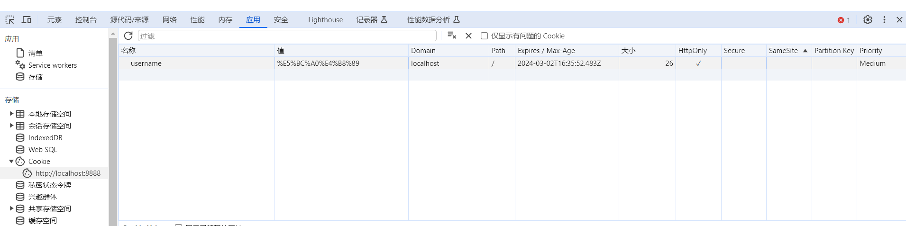
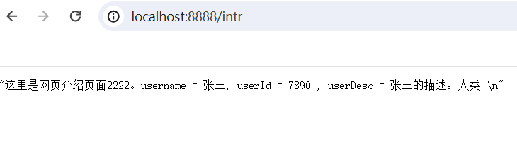
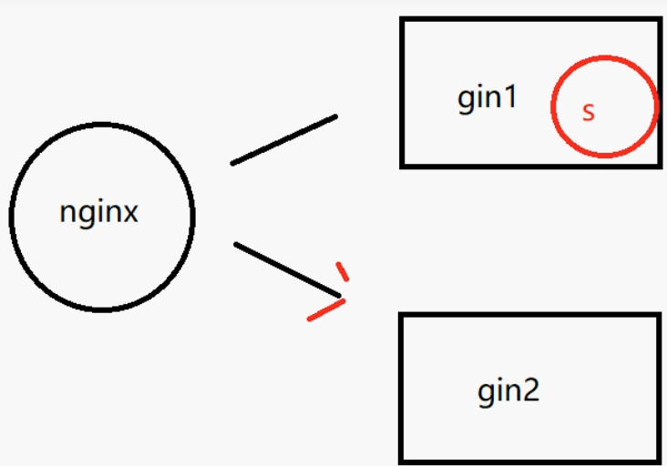
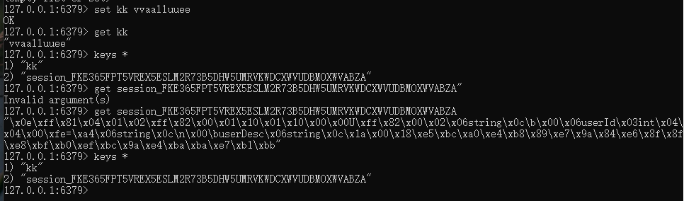
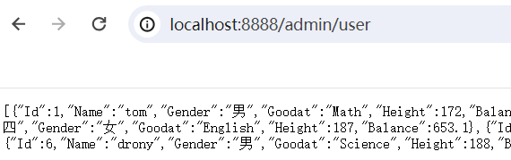
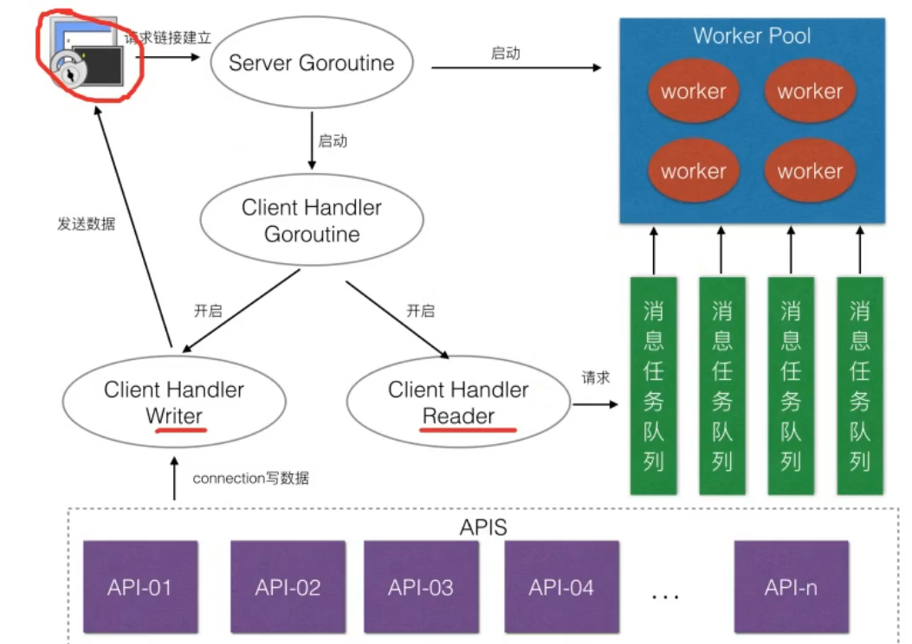
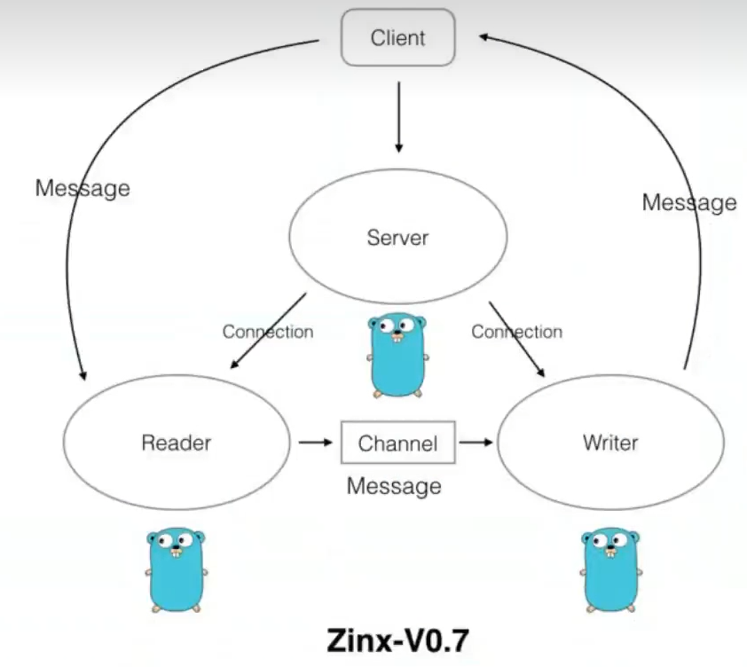
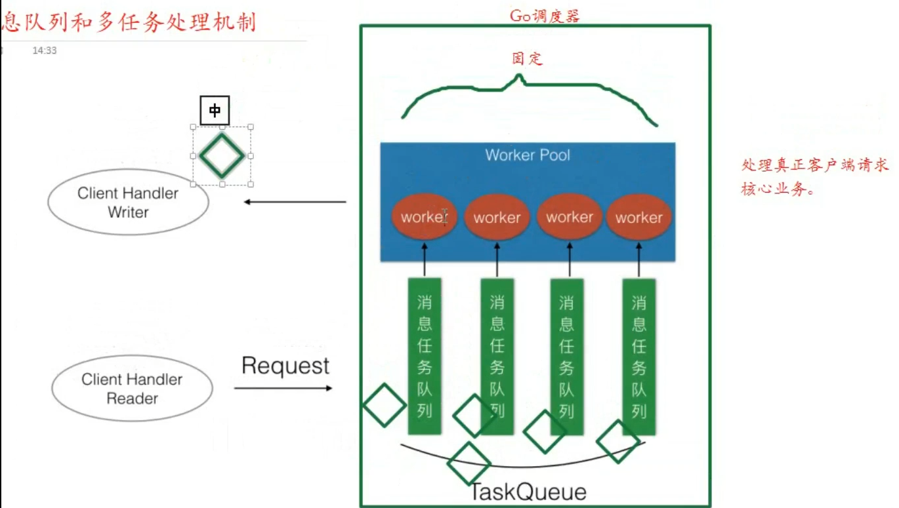

[【置顶】Go语言学习之路/Go语言教程 | 李文周的博客 (liwenzhou.com)](https://www.liwenzhou.com/posts/Go/golang-menu/)

[Go语言标准库文档](https://studygolang.com/pkgdoc) 

https://www.topgoer.com/

[数据结构和算法（Golang实现） - 《数据结构和算法（Golang实现）》 - 书栈网 · BookStack](https://www.bookstack.cn/read/hunterhug-goa.c/README.md)

# 数据结构

## 2. 递归

#### 递归实现斐波那契数列

``` go
func Fibonacci(n int) int {
	if n == 1 || n == 2 {
		return 1
	}
	return Fibonacci(n-1) + Fibonacci(n-2)
}
```

#### 递归实现二分查找

``` go
func BinarySearch(nums []int, target, left, right int) int {
	if left > right {
		return -1
	}
	mid := (left + right) / 2
	if nums[mid] == target {
		return mid
	} else if nums[mid] > target {
		return BinarySearch(nums, target, left, mid-1)
	} else {
		return BinarySearch(nums, target, mid+1, right)
	}
}
```

#### 非递归实现二分查找

``` go
func BinarySearch2(nums []int, target int) int {
	left, mid, right := 0, -1, len(nums)-1
	for left <= right {
		mid = (left + right) / 2
		if nums[mid] == target {
			return mid
		} else if nums[mid] > target {
			right = mid - 1
		} else {
			left = mid + 1
		}
	}
	return -1
}
```

## 3. 链表

#### 单链表

``` go
type LinkNode struct {
	val      int
	nextNode *LinkNode
}


func main() {
	var n4 LinkNode = LinkNode{4, nil}
	var n3 LinkNode = LinkNode{3, &n4}
	var n2 LinkNode = LinkNode{2, &n3}
	var n1 LinkNode = LinkNode{1, &n2}
	// 这里tmp是LinkNode指针类型，因为struct是值类型不能用来==nil，
	for tmp := &n1; tmp != nil; tmp = tmp.nextNode {
		fmt.Println(tmp.val)
	}
}
```

#### 双向链表

go自带的包container/list就是双向链表

导入list包：`import  list "container/list"`

``` go
// list中的元素
type Element struct {
	next, prev *Element
	list *List
	Value any
}
// 由Element来维护前后指针
type List struct {
	root Element // sentinel list element, only &root, root.prev, and root.next are used
	len  int     // current list length excluding (this) sentinel element
}
// 初始化或清空list
func (l *List) Init() *List {
	l.root.next = &l.root
	l.root.prev = &l.root
	l.len = 0
	return l
}
// 可以看出，List一直有一个不可读取的root节点，
```

需要注意的是使用List时，不会直接用List对象，因为list里的函数的caller几乎都是Element，不是List，所以一般用List.Back()。其他插值，删除等等方法参见[Go语言标准库文档中文版 | Go语言中文网 | Golang中文社区 | Golang中国 (studygolang.com)](https://studygolang.com/pkgdoc)

#### 环链表

go自带的包container/ring就是环链表

导入ring包：`import  ring "container/ring"`

``` go
// 只是环的一个元素，因为只要拿一个环的一个元素就拿到了整个环
type Ring struct {
	next, prev *Ring
	Value      any // 可以直接改
}
// New creates a ring of n elements.
func New(n int) *Ring {
	if n <= 0 {
		return nil
	}
	r := new(Ring)
	p := r
	for i := 1; i < n; i++ {
		p.next = &Ring{prev: p}
		p = p.next
	}
	p.next = r
	r.prev = p
	return r
}
```

## 4. 栈

go没有自带的栈类型，我们可以用数组(切片)或者列表来实现

- **数组实现**：能快速随机访问存储的元素，通过下标 `index` 访问，支持随机访问，查询速度快，但存在元素在数组空间中大量移动的操作，增删效率低。

- **链表实现**：只支持顺序访问，在某些遍历操作中查询速度慢，但增删元素快

#### 数组实现

``` go
// 实现数组栈 ArrayStack1
type ArrayStack struct {
	array []int // 底层切片
	size  int
	lock  sync.Mutex
}

// 入栈
func (stack *ArrayStack) Push1(v int) {
	stack.lock.Lock()
	defer stack.lock.Unlock()
	stack.array = append(stack.array, v)
	stack.size++
}

// 出栈
func (stack *ArrayStack) Pop1() int {
	stack.lock.Lock()
	defer stack.lock.Unlock()
	if stack.size <= 0 {
		panic("stack is empty.")
	}
	v := stack.array[stack.size-1]
	stack.size--
	stack.array = stack.array[:stack.size]
	return v
	/*
		如果切片偏移量向前移动 stack.array[0 : stack.size-1]，
		表明最后的元素已经不属于该数组了，数组变相的缩容了。
		此时，切片被缩容的部分并不会被回收，仍然占用着空间，
		所以空间复杂度较高，但操作的时间复杂度为：O(1)。

		如果我们创建新的数组 newArray，然后把老数组的元素复制到新数组，
		就不会占用多余的空间，但移动次数过多，时间复杂度为：O(n)。
	*/
}

func (stack *ArrayStack) Peek1() int {
	if stack.size == 0 {
		panic("stack is empty.")
	}
	return stack.array[stack.size-1]
}
func (stack *ArrayStack) Size1() int {
	return stack.size
}
func (stack *ArrayStack) IsEmpty() bool {
	return stack.size == 0
}
```

#### 链表实现

``` go
// 实现链表栈 LinkStack
type LinkStack struct {
	root *LinkNode // 链表起点
	size int
	lock sync.Mutex
}
type LinkNode struct {
	Next  *LinkNode
	value int
}

// 入栈
// 如果把root当作栈底的话，那么入栈出栈等等都要一直把整个栈找一遍找到栈顶，时间复杂度为O(n)，不合适
// 故把root当作栈顶
func (stack *LinkStack) Push2(v int) {
	stack.lock.Lock()
	defer stack.lock.Unlock()
	node := LinkNode{value: v}
	if stack.root == nil {
		stack.root = &node
	} else {
		node.Next = stack.root
		stack.root = &node
	}
	stack.size++
}

// 出栈
func (stack *LinkStack) Pop2() int {
	if stack.size <= 0 {
		panic("empty")
	}
	stack.lock.Lock()
	defer stack.lock.Unlock()
	result := stack.root.value
	stack.root = stack.root.Next
	stack.size--
	return result
}

// 获得栈顶
func (stack *LinkStack) Peek2() int {
	if stack.size <= 0 {
		panic("empty")
	}
	return stack.root.value
}

// 栈大小
func (stack *LinkStack) Size2() int {
	return stack.size
}

// 栈是否为空
func (stack *LinkStack) IsEmpty2() bool {
	return stack.size == 0
}
```

## 5. 队列

#### 实现数组队列 ArrayQueue

``` go
// 实现数组队列 ArrayQueue
type ArrayQueue struct {
	array []int
	size  int
	lock  sync.Mutex
}

func (queue *ArrayQueue) Add(v int) {
	queue.lock.Lock()
	defer queue.lock.Unlock()
	queue.array = append(queue.array, v)
	queue.size++
}

func (queue *ArrayQueue) Remove() int {
	if queue.size <= 0 {
		panic("empty")
	}
	queue.lock.Lock()
	defer queue.lock.Unlock()
	v := queue.array[0]
	queue.array = queue.array[1:]
	queue.size--
	return v
}

```

#### 实现链表队列 LinkQueue

``` go
// 实现链表队列 LinkQueue
type LinkQueue struct {
	root *LinkNode
	size int
	lock sync.Mutex
}
type LinkNode struct {
	Next  *LinkNode
	Value int
}

// 入队
func (queue *LinkQueue) Add2(v int) {
	queue.lock.Lock()
	defer queue.lock.Unlock()
	node := LinkNode{Value: v}
	// 当然加在链头链尾都可以，只是时间复杂度不一样
	// 但入队出队的的时间复杂度总是一个O(n),一个O(1)
	if queue.root == nil {
		queue.root = &node
	} else {
		tmp := queue.root
		for ; tmp.Next != nil; tmp = tmp.Next {
		}
		tmp.Next = &node
	}
	queue.size = queue.size + 1
}

// 出队
func (queue *LinkQueue) Remove2() int {
	queue.lock.Lock()
	defer queue.lock.Unlock()
	if queue.size <= 0 {
		panic("empty")
	}
	tmp := queue.root
	v := tmp.Value
	queue.root = tmp.Next
	queue.size--
	return v
}
```

## 6. 集合

`Set` 可以没有顺序关系，也可以按值排序，算一种特殊的不可重复列表。一般实现无序不重复的集合。

因为我们知道字典的键是不重复的，所以只要我们不考虑字典的值，就可以实现集合，我们来实现存整数的集合 `Set`：

``` go
type set struct {
	m    map[int]struct{} // 值使用空结构体不会占空间
	size int
	lock sync.RWMutex // 读写锁
}

func NewSet(cap int) *set {
	tmp := make(map[int]struct{}, cap)
	return &set{m: tmp}
}

func (s *set) Add(item int) {
	s.lock.Lock()
	defer s.lock.Unlock()
	s.m[item] = struct{}{}
	s.size = len(s.m)
}

func (s *set) Remove(item int) {
	s.lock.Lock()
	defer s.lock.Unlock()
	_, has := s.m[item]
	if has {
		delete(s.m, item)
		s.size = len(s.m)
	}
}
func (s *set) Has(item int) bool {
	s.lock.RLock()
	defer s.lock.RUnlock()
	_, has := s.m[item]
	return has
}

// 查看集合大小
func (s *set) Len() int {
	return s.size
}

// 集合是够为空
func (s *set) IsEmpty() bool {
	if s.Len() == 0 {
		return true
	}
	return false
}

// 清除集合所有元素
func (s *set) Clear() {
	s.lock.Lock()
	defer s.lock.Unlock()
	s.m = make(map[int]struct{})
	s.size = 0
}

// 将集合转化为列表
func (s *set) List() []int {
	s.lock.Lock()
	defer s.lock.Unlock()
	ans := make([]int,0)
	fmt.Println(s.size)
	for k := range s.m {
		ans = append(ans, k)
	}
	return ans
}
func main() {
	s := NewSet(0)
	s.Add(1)
	s.Add(2)
	s.Add(3)
	s.Remove(3)
	fmt.Print(s.Has(4))
	s.Remove(4)
	fmt.Println(s.m)
	fmt.Println(s.List())

}
```

## 7. 树

树是一种比较高级的基础数据结构，由 `n` 个有限节点组成的具有层次关系的集合。（算树的高度或深度时不算根节点这一层）

树的定义：

1. 有节点间的层次关系，分为父节点和子节点。
2. 有唯一一个根节点，该根节点没有父节点。
3. 除了根节点，每个节点有且只有一个父节点。
4. 每一个节点本身以及它的后代也是一棵树，是一个递归的结构。
5. 没有后代的节点称为叶子节点，没有节点的树称为空树

### 二叉树

- **二叉树**：每个节点最多只有两个儿子节点的树。

- **满二叉树**：叶子节点与叶子节点之间的高度差为 `0` 的二叉树，即整棵树是满的，树呈满三角形结构。

- **完全二叉树**：完全二叉树是由满二叉树而引出来的，设二叉树的深度为 `k`，除第 `k` 层外，其他各层的节点数都达到最大值，且第 `k` 层所有的节点都连续集中在最左边。数组也可以用来表示二叉树，一般用来表示完全二叉树。

树根据子节点的多寡，有二叉树，三叉树，四叉树等，我们这里主要介绍二叉树。

**二叉树的数学特征**

1. 高度为 `h≥0` 的二叉树至少有 `h+1` 个结点，比如最不平衡的二叉树就是退化的线性链表结构，所有的节点都只有左儿子节点，或者所有的节点都只有右儿子节点。
2. 高度为 `h≥0` 的二叉树至多有 `2^h+1` 个节点，比如这棵树是满二叉树。
3. 含有 `n≥1` 个结点的二叉树的高度至多为 `n-1`，由 `1` 退化的线性链表可以反推。
4. 含有 `n≥1` 个结点的二叉树的高度至少为 `logn`，由 `2` 满二叉树可以反推。
5. 在二叉树的第 `i` 层，至多有 `2^(i-1)` 个节点，比如该层是满的。

``` go
type TreeNode struct {
	Data  int
	Left  *TreeNode
	Right *TreeNode
}
type ArrayQueue struct {
	array []*TreeNode
	size  int
	lock  sync.Mutex
}

func (queue *ArrayQueue) Add(v *TreeNode) {
	queue.lock.Lock()
	defer queue.lock.Unlock()
	queue.array = append(queue.array, v)
	queue.size++
}

func (queue *ArrayQueue) Remove() *TreeNode {
	if queue.size <= 0 {
		panic("empty")
	}
	queue.lock.Lock()
	defer queue.lock.Unlock()
	v := queue.array[0]
	queue.array = queue.array[1:]
	queue.size--
	return v
}

/*
构建一棵树后，我们希望遍历它，有四种遍历方法：
	先序遍历：先访问根节点，再访问左子树，最后访问右子树。
	后序遍历：先访问左子树，再访问右子树，最后访问根节点。
	中序遍历：先访问左子树，再访问根节点，最后访问右子树。(这三种都是深度优先遍历)
	层次遍历：每一层从左到右访问每一个节点。（此即为广度优先遍历）
*/

// 先序遍历
func PreOrder(tree *TreeNode) {
	fmt.Print(tree.Data, " ")
	if tree.Left != nil {
		PreOrder(tree.Left)
	}
	if tree.Right != nil {
		PreOrder(tree.Right)
	}
}

// 中序遍历
func MidOrder(tree *TreeNode) {
	if tree == nil {
		return
	}
	PreOrder(tree.Left)
	fmt.Print(tree.Data, " ")
	PreOrder(tree.Right)
}

// 后序遍历
func PostOrder(tree *TreeNode) {
	if tree == nil {
		return
	}
	// 先打印左子树
	PostOrder(tree.Left)
	// 再打印右字树
	PostOrder(tree.Right)
	// 再打印根节点
	fmt.Print(tree.Data, " ")
}

// 层次遍历
func LayerOrder(tree *TreeNode) {
	if tree == nil {
		return
	}
	queue := new(ArrayQueue)
	queue.Add(tree)
	for queue.size > 0 {
		element := queue.Remove()
		fmt.Print(element.Data, " ")
		if element.Left != nil {
			queue.Add(element.Left)
		}
		if element.Right != nil {
			queue.Add(element.Right)
		}
	}
}
```

## 8. 排序

### 交换排序

#### 冒泡排序

比如现在有一堆乱序的数，比如：`5 9 1 6 8 14 6 49 25 4 6 3`。

第一轮迭代：从第一个数开始，**依次比较相邻的两个数（一直这样做）**，如果前面一个数比后面一个数大，那么交换位置，直到处理到最后一个数，最后的这个数是最大的。

第二轮迭代：因为最后一个数已经是最大了，现在重复第一轮迭代的操作，但是只处理到倒数第二个数。

第三轮迭代：因为最后一个数已经是最大了，最后第二个数是次大的，现在重复第一轮迭代的操作，但是只处理到倒数第三个数。

``` go
// 交换排序之冒泡排序
func BubbleSort(nums []int) {
	for i := 0; i < len(nums)-1; i++ {
		for j := 0; j < len(nums)-i-1; j++ {
			if nums[j] > nums[j+1] {
				nums[j], nums[j+1] = nums[j+1], nums[j]
			}
		}
	}
}
```

冒泡排序的平均时间复杂度为：`O(n^2)`。

冒泡排序交换和比较的次数相加是一个和 `N` 有关的平方数，所以冒泡排序的最好和最差时间复杂度都是：`O(n^2)`。

冒泡排序算法是**稳定**的，因为如果两个相邻元素相等，是不会交换的，保证了稳定性的要求。

#### 快速排序

快速排序通过一趟排序将要排序的数据分割成独立的两部分，其中一部分的所有数据都比另外一部分的所有数据都要小，然后再按此方法对这两部分数据分别进行快速排序，整个排序过程可以递归进行，以此达到整个数据变成有序序列。

步骤如下：

1. 先从数列中取出一个数作为基准数。一般取第一个数。
2. 分区过程，将比这个数大的数全放到它的右边，小于或等于它的数全放到它的左边。
3. 再对左右区间重复第二步，直到各区间只有一个数。

``` go
// 交换排序之快速排序
func QuickSort(nums []int, left, right int) {
	if right > left {
		mid := partition(nums, left, right)
		QuickSort(nums, left, mid-1)
		QuickSort(nums, mid+1, right)
	}
}

// 快排的分割函数(nums[right]是有值的)
func partition(nums []int, left, right int) int {
	for i := left + 1; i <= right; i++ {
		if nums[i] <= nums[left] {
			nums[i], nums[left] = nums[left], nums[i]
			left = i
		} else { // 把较大的数往后放
			nums[i], nums[right] = nums[right], nums[i]
			right--
			i--
		}
	}
	return left
}
```

快速排序的平均时间复杂度为：`O(nlogn)`。

最差的情况下，每次都不能平均地切分，每次切分都因为基准数是最大的或者最小的，不能分成两个数列，这样时间复杂度变为了 `T(n) = T(n-1) + O(n)`，按照主定理计算可以知道时间复杂度为：`O(n^2)`

快速排序是不稳定的，因为切分过程中进行了交换，相同值的元素可能发生位置变化。

**改进**

- **切分**的结果极大地影响快速排序的性能，为了避免切分不均匀情况的发生，有几种方法改进：

1. 每次进行快速排序切分时，先将数列随机打乱，再进行切分，这样随机加了个震荡，减少不均匀的情况。当然，也可以随机选择一个基准数，而不是选第一个数。
2. 每次取数列头部，中部，尾部三个数，取三个数的中位数为基准数进行切分。

>  方法 1 相对好，而方法 2 引入了额外的比较操作，一般情况下我们可以随机选择一个基准数。

快速排序可以继续进行算法改进。

1. 在**小规模数组的情况下，直接插入排序**的效率最好，当快速排序递归部分进入小数组范围，可以切换成直接插入排序。
2. 排序数列可能存在大量重复值，使用三向切分快速排序，将数组分成三部分，大于基准数，等于基准数，小于基准数，这个时候需要维护三个下标。
3. 使用伪尾递归减少程序栈空间占用，使得栈空间复杂度从 `O(logn)~log(n)` 变为：`O(logn)`。

#### 归并排序

我们先介绍两个有序的数组合并成一个有序数组的操作。

1. 先申请一个辅助数组，长度等于两个有序数组长度的和。
2. 从两个有序数组的第一位开始，比较两个元素，哪个数组的元素更小，那么该元素添加进辅助数组，然后该数组的元素变更为下一位，继续重复这个操作，直至数组没有元素。
3. 返回辅助数组。

归并排序就是不端地进行归并操作，


``` go
// 自顶而下归并排序，排序范围是[begin, end)
func MergeSort(nums []int, begin, end int) {
	if end-begin > 1 { // 至少要两个数才需要归并
		mid := begin + (end-begin)/2
		MergeSort(nums, begin, mid)
		MergeSort(nums, mid, end)
		merge(nums, begin, mid, end)
	}
}

// 完成一次归并，例如把[1,4,2,3]mid=2, 归并为[1,2,3,4]
func merge(nums []int, begin, mid, end int) {
	// 申请额外的空间来合并两个有序数组，这两个数组是 nums[begin,mid),array[mid,end)
	leftSize := mid - begin
	rightSize := end - mid
	newNums := make([]int, 0, leftSize+rightSize)
	l, r := begin, mid
	for l < mid && r < end {
		if nums[l] < nums[r] {
			newNums = append(newNums, nums[l])
			l++
		} else {
			newNums = append(newNums, nums[r])
			r++
		}
	}
	newNums = append(newNums, nums[l:mid]...)
	newNums = append(newNums, nums[r:end]...)
	for i := 0; i < len(newNums); i++ {
		nums[begin+i] = newNums[i]
	}
}
```

时间复杂度是 `O(nlogn)`。

### 选择排序

#### 简单选择排序

选择排序，一般我们指的是简单选择排序，也可以叫直接选择排序，它不像冒泡排序一样相邻地交换元素，而是**通过选择最小的元素，放到最前面去，每轮迭代只需交换一次**。虽然交换次数比冒泡少很多，但效率和冒泡排序一样的糟糕。

现在有一堆乱序的数，比如：`5 9 1 6 8 14 6 49 25 4 6 3`。

第一轮迭代，从第一个数开始，左边到右边进行扫描，找到最小的数 1，与数列里的第一个数交换位置。

第二轮迭代，从第二个数开始，左边到右边进行扫描，找到第二小的数 3，与数列里的第二个数交换位置。

第三轮迭代，从第三个数开始，左边到右边进行扫描，找到第三小的数 4，与数列里的第三个数交换位置。

第N轮迭代：….

``` go 
// 选择排序之简单选择排序
func SelectSort(nums []int) {
	for i := 0; i < len(nums)-1; i++ {
		min := nums[i]
		idx := -1
		for j := i; j < len(nums); j++ {
			if nums[j] < min {
				min = nums[j]
				idx = j
			}
		}
		nums[i], nums[idx] = nums[idx], nums[i]
	}
}
```

最佳和最坏时间复杂度仍然是：`O(n^2)`。

**改进**

上面的算法需要从某个数开始，一直扫描到尾部，我们可以优化算法，使得复杂度减少一半。

我们每一轮，除了找最小数之外，还找最大数，然后分别和前面和后面的元素交换，这样循环次数减少一半

#### 堆排序


### 插入排序

#### 直接插入排序

每次把一个数插到已经排好序的数列里面形成新的排好序的数列，以此反复。

``` go
// 插入排序之直接插入排序
func InsertSort(nums []int) {
	tmp := 0
	for i := 1; i < len(nums); i++ {
		tmp = nums[i]
		for k := i - 1; k >= 0; k-- {
			if nums[k] > tmp {
				nums[k+1], nums[k] = nums[k], nums[k+1]
			} else {
				break
			}
		}
	}
}
```

直接插入排序的平均复杂度是`O(n^2)`

数组规模 `n` 较小的大多数情况下，我们可以使用插入排序，它比冒泡排序，选择排序都快，甚至比任何的排序算法都快。

数列中的**有序性越高，插入排序的性能越高**，因为待排序数组有序性越高，插入排序比较的次数越少。

#### 希尔排序


# 网络和网页应用

本部分内容主要基于：

[15.1. tcp 服务器 | 第十五章. 网络，模板和网页应用 |《Go 入门指南》| Go 技术论坛 (learnku.com)](https://learnku.com/docs/the-way-to-go/151-tcp-server/3703)

[03.1. Web 工作方式 | 第三章. Web 基础 |《Go Web 编程》| Go 技术论坛 (learnku.com)](https://learnku.com/docs/build-web-application-with-golang/031-web-working-mode/3168)

 ## Go实现TCP/UDP通信

### socket

`Socket`是应用层与TCP/IP协议族通信的中间软件抽象层。在设计模式中，`Socket`其实就是一个门面模式，它把复杂的TCP/IP协议族隐藏在`Socket`后面，对用户来说只需要调用Socket规定的相关函数，让`Socket`去组织符合指定的协议数据然后进行通信。


### Go实现TCP通信

#### TCP服务端

一个TCP服务端可以同时连接很多个客户端，例如世界各地的用户使用自己电脑上的浏览器访问淘宝网。因为Go语言中创建多个goroutine实现并发非常方便和高效，所以我们可以每建立一次链接就创建一个goroutine去处理。

TCP服务端程序的处理流程：

1. 监听端口
2. 接收客户端请求建立链接
3. 创建goroutine处理链接。

我们使用Go语言的net包实现的TCP服务端代码如下：

```go
package main

import (
	"bufio"
	"fmt"
	"io"
	"net"
	"os"
	"strings"
)

func process(conn net.Conn) {

	defer conn.Close()
	// 3.与client通信
	reader := bufio.NewReader(os.Stdin)
	connReader := bufio.NewReader(conn)
	for {
		var buf []byte
		tmp := make([]byte, 8)

	receiveLoop:
		for { // 使用for循环读取，无论c端发来的信息多长都能接收
			n, err := connReader.Read(tmp) // 读取数据
			switch err {
			case io.EOF:
				break receiveLoop // c端断开连接后就会发送io.EOF 过来
			case nil:
				buf = append(buf, tmp[:n]...)
				if strings.HasSuffix(string(tmp[:n]), "\r\n\r\n") { // 判断内容接收完没有
					break receiveLoop
				}
			default:
				fmt.Println("read from client failed, err:", err)
				os.Exit(0)
			}
		}
		msg := string(buf)
		fmt.Println("收到client的消息：", msg)
		fmt.Print("[server] 请说：")
		text, _ := reader.ReadString('\n')
		text = strings.TrimSpace(text)
		if text == "exit" {
			break
		}
		conn.Write([]byte(text))
        /*
        conn.Write(data)方法是用来将数据写入到TCP连接conn中。它是一个阻塞的操作，会一直等待数据写入完成才会返回.\
		如果要发送大量数据，需要多次调用conn.Write(data)方法，每次发送数据都要等待数据写入完成，可能会导致性能较低。

		io.Copy()函数是用来将一个io.Reader的数据拷贝到一个io.Writer中。在传输数据时，可以将TCP连接的输入流和输出流传递给io.Copy()函数，
		让它自动进行数据传输。io.Copy()函数是非阻塞的，会自动处理数据的读取和写入操作，直到其中一个流关闭或者发生错误才会停止。
        */
	}
}

func main() {
	// 1.本地端口启动服务
	listener, e1 := net.Listen("tcp", "127.0.0.1:20000")
	if e1 != nil {
		fmt.Println("start tcp server on 127.0.0.1:20000 failed, err:", e1)
		return
	}
	// 2.等待client建立连接
	for {
		conn, e2 := listener.Accept()
		if e2 != nil {
			fmt.Println("accept failed, err:", e2)
			return
		}
		go process(conn)
	}
}
```

将上面的代码保存之后编译成`server`或`server.exe`可执行文件。

#### TCP客户端

一个TCP客户端进行TCP通信的流程如下：

1. 建立与服务端的链接
2. 进行数据收发
3. 关闭链接

使用Go语言的net包实现的TCP客户端代码如下：

``` go
package main

import (
	"bufio"
	"fmt"
	"net"
	"os"
	"strings"
)

const StopCharacter = "\r\n\r\n" // 主动定义当前message完毕的结尾

func main() {
	// 1.与server建立连接
	conn, err := net.Dial("tcp", "127.0.0.1:20000")
	if err != nil {
		fmt.Println("connect server on 127.0.0.1:20000 failed, err:", err)
		return
	}
	// 2.发送数据
	reader := bufio.NewReader(os.Stdin)
	for {
		fmt.Print("[client] 请说：")
		text, _ := reader.ReadString('\n')
		text = strings.TrimSpace(text)
		if text == "exit" {
			break
		}
		conn.Write([]byte(text))
		conn.Write([]byte(StopCharacter)) // 将停止信号也发送过去
		var tmp = [128]byte{}
		n, e3 := conn.Read(tmp[:])
		if e3 != nil {
			fmt.Println("read from connection failed, err:", e3)
			return
		}
		fmt.Println(string(tmp[:n]))
	}
	conn.Close()
}
```

将上面的代码编译成`client`或`client.exe`可执行文件，先启动server端再启动client端，在client端输入任意内容回车之后就能够在server端看到client端发送的数据，从而实现TCP通信。

**注意：**

做TCP c/s模型连接实验时，c端s端连接成功后，我们想结束实验，于是分别在c端s端的shell窗口按下了ctrl+c。但此时机器中的服务端机器中的连接并没有直接断开而是进入`TIME_WAIT`阶段。如下所示：

``` shell
tcp        0      0 127.0.0.1:45538         127.0.0.1:8888          TIME_WAIT  
```

在Linux中，默认的TCP连接超时等待时间是60秒，可以通过调整操作系统的设置来更改TCP连接超时等待时间。编辑`/etc/sysctl.conf`文件，在文件末尾添加`net.ipv4.tcp_fin_timeout = <value>`来修改TCP连接超时等待时间。

``` shell
cat /proc/sys/net/ipv4/tcp_fin_timeout
60
# 查看到是60TCP断开连接

echo 20 > /proc/sys/net/ipv4/tcp_fin_timeout # 修改
```

修改后，保存文件并使用`sudo sysctl -p`重新加载`sysctl`配置。但最好不要改。


#### TCP黏包

**为什么会出现粘包**

主要原因就是tcp数据传递模式是流模式，在保持长连接的时候可以进行多次的收和发。

“粘包”可发生在发送端也可发生在接收端：

1. 由Nagle算法造成的发送端的粘包：Nagle算法是一种改善网络传输效率的算法。简单来说就是当我们提交一段数据给TCP发送时，TCP并不立刻发送此段数据，而是等待一小段时间看看在等待期间是否还有要发送的数据，若有则会一次把这两段数据发送出去。
2. 接收端接收不及时造成的接收端粘包：TCP会把接收到的数据存在自己的缓冲区中，然后通知应用层取数据。当应用层由于某些原因不能及时的把TCP的数据取出来，就会造成TCP缓冲区中存放了几段数据。

**黏包示例**

服务端代码如下：

```go
// socket_stick/server/main.go

func process(conn net.Conn) {
	defer conn.Close()
	reader := bufio.NewReader(conn)
	var buf [1024]byte
	for {
		n, err := reader.Read(buf[:])
		if err == io.EOF {
			break
		}
		if err != nil {
			fmt.Println("read from client failed, err:", err)
			break
		}
		recvStr := string(buf[:n])
		fmt.Println("收到client发来的数据：", recvStr)
	}
}

func main() {

	listen, err := net.Listen("tcp", "127.0.0.1:30000")
	if err != nil {
		fmt.Println("listen failed, err:", err)
		return
	}
	defer listen.Close()
	for {
		conn, err := listen.Accept()
		if err != nil {
			fmt.Println("accept failed, err:", err)
			continue
		}
		go process(conn)
	}
}
```

客户端代码如下：

```go
// socket_stick/client/main.go

func main() {
	conn, err := net.Dial("tcp", "127.0.0.1:30000")
	if err != nil {
		fmt.Println("dial failed, err", err)
		return
	}
	defer conn.Close()
	for i := 0; i < 20; i++ {
		msg := `Hello, Hello. How are you?`
		conn.Write([]byte(msg))
		// time.Sleep(time.Millisecond) 加上等待时间试试
	}
}
```

将上面的代码保存后，分别编译。先启动服务端再启动客户端，可以看到服务端输出结果如下：

```bash
收到client发来的数据： Hello, Hello. How are you?Hello, Hello. How are you?Hello, Hello. How are you?Hello, Hello. How are you?Hello, Hello. How are you?
收到client发来的数据： Hello, Hello. How are you?Hello, Hello. How are you?Hello, Hello. How are you?Hello, Hello. How are you?Hello, Hello. How are you?Hello, Hello. How are you?Hello, Hello. How are you?Hello, Hello. How are you?
收到client发来的数据： Hello, Hello. How are you?Hello, Hello. How are you?
收到client发来的数据： Hello, Hello. How are you?Hello, Hello. How are you?Hello, Hello. How are you?
收到client发来的数据： Hello, Hello. How are you?Hello, Hello. How are you?
```

客户端分10次发送的数据，在服务端并没有成功的输出10次，而是多条数据“粘”到了一起。

**解决办法**

出现”粘包”的关键在于接收方不确定将要传输的数据包的大小，因此我们可以对数据包进行封包和拆包的操作。

封包：封包就是给一段数据加上包头，这样一来数据包就分为包头和包体两部分内容了(过滤非法包时封包会加入”包尾”内容)。包头部分的长度是固定的，并且它存储了包体的长度，根据包头长度固定以及包头中含有包体长度的变量就能正确的拆分出一个完整的数据包。

我们可以自己定义一个协议，比如数据包的前4个字节为包头，里面存储的是发送的数据的长度。

```go
// socket_stick/proto/proto.go
package proto

import (
	"bufio"
	"bytes"
	"encoding/binary"
)

// Encode 将消息编码
func Encode(message string) ([]byte, error) {
	// 读取消息的长度，转换成int32类型（占4个字节）
	var length = int32(len(message))
	var pkg = new(bytes.Buffer)
	// 写入消息头
	err := binary.Write(pkg, binary.LittleEndian, length)
	if err != nil {
		return nil, err
	}
	// 写入消息实体
	err = binary.Write(pkg, binary.LittleEndian, []byte(message))
	if err != nil {
		return nil, err
	}
	return pkg.Bytes(), nil
}

// Decode 解码消息
func Decode(reader *bufio.Reader) (string, error) {
	// 读取消息的长度
	lengthByte, _ := reader.Peek(4) // 读取前4个字节的数据
	lengthBuff := bytes.NewBuffer(lengthByte)
	var length int32
	err := binary.Read(lengthBuff, binary.LittleEndian, &length)
	if err != nil {
		return "", err
	}
	// Buffered返回缓冲中现有的可读取的字节数。
	if int32(reader.Buffered()) < length+4 {
		return "", err
	}

	// 读取真正的消息数据
	pack := make([]byte, int(4+length))
	_, err = reader.Read(pack)
	if err != nil {
		return "", err
	}
	return string(pack[4:]), nil
}
```

接下来在服务端和客户端分别使用上面定义的`proto`包的`Decode`和`Encode`函数处理数据。

服务端代码如下：

```go
// socket_stick/server2/main.go

func process(conn net.Conn) {
	defer conn.Close()
	reader := bufio.NewReader(conn)
	for {
		msg, err := proto.Decode(reader)
		if err == io.EOF {
			return
		}
		if err != nil {
			fmt.Println("decode msg failed, err:", err)
			return
		}
		fmt.Println("收到client发来的数据：", msg)
	}
}

func main() {

	listen, err := net.Listen("tcp", "127.0.0.1:30000")
	if err != nil {
		fmt.Println("listen failed, err:", err)
		return
	}
	defer listen.Close()
	for {
		conn, err := listen.Accept()
		if err != nil {
			fmt.Println("accept failed, err:", err)
			continue
		}
		go process(conn)
	}
}
```

客户端代码如下：

```go
// socket_stick/client2/main.go

func main() {
	conn, err := net.Dial("tcp", "127.0.0.1:30000")
	if err != nil {
		fmt.Println("dial failed, err", err)
		return
	}
	defer conn.Close()
	for i := 0; i < 20; i++ {
		msg := `Hello, Hello. How are you?`
		data, err := proto.Encode(msg)
		if err != nil {
			fmt.Println("encode msg failed, err:", err)
			return
		}
		conn.Write(data)
	}
}
```

### Go实现UDP通信

UDP协议（User Datagram Protocol）中文名称是用户数据报协议，是OSI（Open System Interconnection，开放式系统互联）参考模型中一种**无连接**的传输层协议，不需要建立连接就能直接进行数据发送和接收，属于不可靠的、没有时序的通信，但是UDP协议的实时性比较好，通常用于视频直播相关领域。

#### UDP服务端

使用Go语言的`net`包实现的UDP服务端代码如下：

```go
// UDP/server/main.go

// UDP server端
func main() {
	listen, err := net.ListenUDP("udp", &net.UDPAddr{
		IP:   net.IPv4(0, 0, 0, 0),
		Port: 30000,
	})
	if err != nil {
		fmt.Println("listen failed, err:", err)
		return
	}
	defer listen.Close()
	for {
		var data [1024]byte
		n, addr, err := listen.ReadFromUDP(data[:]) // 接收数据
		if err != nil {
			fmt.Println("read udp failed, err:", err)
			continue
		}
		fmt.Printf("data:%v addr:%v count:%v\n", string(data[:n]), addr, n)
		_, err = listen.WriteToUDP(data[:n], addr) // 发送数据
		if err != nil {
			fmt.Println("write to udp failed, err:", err)
			continue
		}
	}
}
```

#### UDP客户端

使用Go语言的`net`包实现的UDP客户端代码如下：

```go
// UDP 客户端
func main() {
	socket, err := net.DialUDP("udp", nil, &net.UDPAddr{
		IP:   net.IPv4(0, 0, 0, 0),
		Port: 30000,
	})
	if err != nil {
		fmt.Println("连接服务端失败，err:", err)
		return
	}
	defer socket.Close()
	sendData := []byte("Hello server")
	_, err = socket.Write(sendData) // 发送数据
	if err != nil {
		fmt.Println("发送数据失败，err:", err)
		return
	}
	data := make([]byte, 4096)
	n, remoteAddr, err := socket.ReadFromUDP(data) // 接收数据
	if err != nil {
		fmt.Println("接收数据失败，err:", err)
		return
	}
	fmt.Printf("recv:%v addr:%v count:%v\n", string(data[:n]), remoteAddr, n)
}
```

## web服务器及工作原理

golang使用`net/http`包搭建网页服务器。

以下均是服务器端的几个概念

- Request：用户请求的信息，用来解析用户的请求信息，包括 post、get、cookie、url 等信息

- Response：服务器需要反馈给客户端的信息

- Conn：用户的每次请求链接

- Handler：处理请求和生成返回信息的处理逻辑

### 简单的web服务器示例

``` go
package main

import (
	"fmt"
	"log"
	"net/http"
)

func HelloServer(w http.ResponseWriter, req *http.Request) {
	fmt.Println("根地址注册的一个处理函数")
	req.ParseForm() // 解析URL后跟的那些参数，默认是不解析的
	fmt.Println("path:", req.URL.Path)
	fmt.Println("scheme:", req.URL.Scheme)
	fmt.Println(req.Form["myField"]) // url中带来的参数
	fmt.Println(req.Form["NONE"])    // url中带来的参数
	for k, v := range req.Form {
		fmt.Println("key:", k, ", value:", v)
	}
	fmt.Fprintf(w, "<h1>标题1</h1>Hello, 、"+req.URL.Path[1:]) // 向 相应 w 写入一些东西，会直接出现的客户端的浏览器上
	/* w 实现了 io.Writer 接口，使用下面的方法输出也可以
	wtr := bufio.NewWriter(w)
	wtr.WriteString("<h1>Hello</h1>" + req.URL.Path[1:])
	wtr.Flush()
	*/
}
func main() {
	// 注：浏览器向本服务器发送http请求时，每个额外的图片或文件资源都会发送一个单独的http GET请求来获取这些资源，以便并行下载。因此注册的 HelloServer 函数会被调用多次。
	http.HandleFunc("/", HelloServer) // 第一个参数是请求的路径，然后为服务器的根地址注册一个处理函数
	// http.Handle("/", http.HandlerFunc(HelloServer))   //与上面的写法是一样的
	err := http.ListenAndServe("localhost:8888", nil) // 使用 http.ListenAndServeTLS() 代替 http.ListenAndServe() 可以使用安全的https连接，此处暂时不讨论
	if err != nil {
		log.Fatal("ListenAndServe: ", err.Error())
	}
}

```

我们运行此文件后，打开浏览器输入` http://localhost:8888/?myField=1&myField=2&anotherField=3`，浏览器出现预期结果不难解释。然后查看服务器控制台打印的结果。

``` php
根地址注册的一个处理函数
path: /
scheme:
[1 2]
[]
key: myField , value: [1 2]
key: anotherField , value: [3]
根地址注册的一个处理函数
path: /favicon.ico
scheme:
[]
[]
```

可以明显看出，浏览器一共发送了两个GET请求。一个请求根目录`/`，一个请求了默认的图标`favicon.ico`。两个GET请求都进入了HelloServer 函数进行处理。而且只有请求根目录的请求会带有客户端在URL中写入的那些参数。

在服务端的req中我们可以按参数name拿到URL中传入的参数的。

### 工作流程

web流程图如下：


Go 实现 Web 服务的工作模式的流程图


开启一个go web服务最本质的代码就两行

``` go
http.HandleFunc("/", HelloServer)
http.ListenAndServe("localhost:8888", nil) 
```

在`http.ListenAndServe`内部会开启端口监听`ln, err := net.Listen("tcp", addr)`，然后调用了 `srv.Serve(net.Listener)` 函数，这个函数就是处理接收客户端的请求信息。`srv.Serve(net.Listener)` 函数中会调用`rw, err := l.Accept()`来接收TCP连接，并为每个连接conn单独开了一个 goroutine。

那么如何具体分配到相应的函数来处理请求呢？`c.readRequest()`, 然后获取相应的 handler:`handler := c.server.Handler`，也就是我们刚才在调用函数 `ListenAndServe` 时候的第二个参数，我们前面例子传递的是 nil，也就是为空，那么默认获取 `handler = DefaultServeMux`, 那么这个变量用来做什么的呢？对，这个变量就是一个路由器，它用来匹配 url 跳转到其相应的 handle 函数，而这里的handle函数就是我们在 `http.HandleFunc("/", HelloServer)` 中设置的第二次参数。这个函数注册了请求 `/` 的路由规则，当请求 uri 为 "/"，路由就会转到函数 HelloServer，最后通过写入 response 的信息反馈到客户端。

详细的整个流程如下图所示：


## 使用go发送http请求

简单地发送请求（简单看看就行，不可取）

> ``` go
> package main
> 
> import (
> 	"fmt"
> 	"io/ioutil"
> 	"net/http"
> )
> 
> var urls = []string{
> 	"http://www.baidu.com",
> 	"http://p4.org",
> }
> 
> func main() {
> 	for _, url := range urls {
> 		resp, err := http.Head(url) // 向指定的URL发送HEAD，用来简单地判断url是否可以到达
> 		if err != nil {
> 			fmt.Println("Error:", url, err)
> 		}
> 		fmt.Println(url, ":", resp.Status)
> 	}
> 	// 发送http请求去访问哔哩哔哩
> 	resp2, err := http.Get("http://www.bilibili.com")
> 	if err != nil {
> 		fmt.Println("Error:", err)
> 	}
> 	data, _ := ioutil.ReadAll(resp2.Body)
> 	fmt.Println(string(data))
> 	fmt.Println(resp2.Header)
> }
> ```

**下面的代码完整的发送HTTP请求的规范写法**

``` go
package main

import (
	"fmt"
	"io/ioutil"
	"net/http"
)

/*
此go文件直接由postman生成，如果执行出错请重新去生成就行
*/
func main() {

	url := "https://www.bilibili.com/v/food/?spm_id_from=333.1007.0.0" // 目标URL
	method := "GET"                                                    // 请求方法

	client := &http.Client{}
	req, err := http.NewRequest(method, url, nil)

	if err != nil {
		fmt.Println(err)
		return
	}
	// 添加请求头
	req.Header.Add("X-Auth-Token", "gAAAAABk5AwA3PSYoVg45J-kUAm7LVU_jDBhZq-rhThl89KTEnU__6LA6lH-534jmGRyefIazEIpae6kzRdeQD3oSgsRCyzDIlxibhUHR9kYsEEysqSrmP-rEMkn9ZDAmdcTq0OVVVv9URLdh967RDLf_Ia6A4HWTtk1BE1YsYka7-_XFeW0Vn0")
	req.Header.Add("Cookie", "b_nut=1692109483; b_ut=7; buvid3=09E66EFB-87C2-744F-D2AD-1B53628FA45383615infoc; i-wanna-go-back=-1")

	res, err := client.Do(req)
	if err != nil {
		fmt.Println(err)
		return
	}
	defer res.Body.Close()

	body, err := ioutil.ReadAll(res.Body)
	if err != nil {
		fmt.Println(err)
		return
	}
	fmt.Println(string(body))
}
```

## 常见库包解释

### net/http

Go 的 http 有两个核心功能：Conn、ServeMux

Go 为了实现高并发和高性能，使用了 goroutines 来处理 Conn 的读写事件，这样每个请求都能保持独立，相互不会阻塞，可以高效的响应网络事件。

server.go文件中定义的`Hanler`。

``` go
type Handler interface {
	ServeHTTP(ResponseWriter, *Request) //ServeHTTP应该将回复头和数据写入ResponseWriter，然后返回。返回请求已完成的信号；使用ResponseWriter或从请求中读取是无效的。在ServeHTTP调用完成之后或同时完成的正文。
}
```

它就是处理HTTP请求的处理器。是一个接口，只有一个方法`ServeHTTP(ResponseWriter, *Request)`

#### ServeMux

服务端设定监听地址和路由器的代码：`http.ListenAndServe("localhost:8888", nil) `。第二次参数就是路由器，为nil表示调用了 http 包默认的路由器，通过路由器将本次请求的信息传递到后端的处理函数。该路由器的结构定义在`http.server.go`文件中：

``` go
type ServeMux struct {
	mu    sync.RWMutex // 锁，由于请求涉及到并发处理，因此这里需要一个锁机制
	m     map[string]muxEntry // 路由规则，一个string对应一个mux 实体
	es    []muxEntry // slice of entries sorted from longest to shortest.
	hosts bool       // whether any patterns contain hostnames
}
type muxEntry struct {
	h       Handler // 这个路由表达式对应哪个 handler
	pattern string // 匹配的字符串
}
type Handler interface {
	ServeHTTP(ResponseWriter, *Request)  // 路由实现
}
```

默认的路由器实现了 `ServeHTTP`

``` go
func (mux *ServeMux) ServeHTTP(w ResponseWriter, r *Request) {
	if r.RequestURI == "*" {
		if r.ProtoAtLeast(1, 1) {
			w.Header().Set("Connection", "close")
		}
		w.WriteHeader(StatusBadRequest)
		return
	}
	h, _ := mux.Handler(r)
	h.ServeHTTP(w, r)
}
```

路由器收到请求后，没出错，就调用` mux.Handler(r)`返回对应设置路由的处理Handler（一般就是我们使用http.HandleFunc传入的handler），然后执行`h.ServeHTTP(w, r)`。

### net.Error

这是`net`包返回的错误类型。定义如下

``` go
// An Error represents a network error.
type Error interface {
	error
	Timeout() bool // Is the error a timeout?

	// Deprecated: Temporary errors are not well-defined.
	// Most "temporary" errors are timeouts, and the few exceptions are surprising.
	// Do not use this method.
	Temporary() bool
}
```

可以看出，`net.Error` 不仅嵌套了内建的`error`，还额外声明了两个方法，表达该错误是否超时或错误是否为临时错误。

`net`包中有许多结构体实现该接口，如`OpError`,`ParseError`, `AddrError`, `UnknownNetworkError`, `timeoutError`, `DNSConfigError` 等等。例如 conn 的`SetReadDeadline`方法就可能返回`OpError`错误。

很多是否网络连接返回的错误我们可能通过类型断言来测试 `net.Error`，从而区分哪些临时发生的错误或者必然会出现的错误。举例来说，一个网络爬虫程序在遇到临时发生的错误时可能会休眠或者重试，如果是一个必然发生的错误，则他会放弃继续执行。

``` go
if neterr, ok := err.(net.Error); ok && neterr.Temporary(){
    time.Sleep(100)
    continue
}
if err != nil{
    log.Fatal(err)
}
```

# Gin框架

Gin 是一个由go编写的轻量级的 http web框架，运行速度非常快。

- github地址：[gin-gonic/gin: Gin is a HTTP web framework written in Go (Golang). It features a Martini-like API with much better performance -- up to 40 times faster. If you need smashing performance, get yourself some Gin. (github.com)](https://github.com/gin-gonic/gin)

- 官网地址：[Gin Web Framework (gin-gonic.com)](https://gin-gonic.com/zh-cn/)

## 环境搭建

因为gin是go原生开发的，所以只要安装了go环境，把gin下载下来就可以直接用了。

下载并安装 gin：

``` go
go get -u github.com/gin-gonic/gin
```

下载可能出现问题，解决参考：https://www.cnblogs.com/xiaoyingzhanchi/p/14410626.html

在代码中引用gin

``` go
import "github.com/gin-gonic/gin"
```

我们常常会使用诸如 `http.StatusOK `之类的常量，因此常常引入` net/http` 包

**简单使用**

> gin服务器后端代码中写文件的路径时，写相对于项目的路经。也就是说相对路径永远是相对于项目的。
>
> 写前端请求的地址路径时，最前面加了/就是相对于根目录，不加/就是相对于当前页面路径。

``` go
package main

import (
	"net/http"

	"github.com/gin-gonic/gin"
)

func main() {
	// 创建一个默认路由
	r := gin.Default()
	// 配置路由，注册一个GET请求的处理函数。当访问根目录"/"时，会执行后面的回调函数。
	r.GET("/", func(c *gin.Context) {
		c.String(http.StatusOK, "值：%v", "hello 你好 gin")
	})
	r.GET("/news", func(c *gin.Context) {
		c.String(http.StatusOK, "商品：%v", "水果")
	})
	r.POST("/add", func(c *gin.Context) { // 浏览器url无法提交post，只能form提交，或者postman模拟
		c.String(http.StatusOK, "这是一个post")
	})
	r.PUT("/edit", func(c *gin.Context) { // 浏览器url无法提交post，只能form提交，或者postman模拟
		c.String(http.StatusOK, "这是一个PUT")
	})
	r.DELETE("/del", func(c *gin.Context) { // 浏览器url无法提交post，只能form提交，或者postman模拟
		c.String(http.StatusOK, "这是一个DELETE")
	})
	// r.Run() // 启动一个web服务，默认在 0.0.0.0:8080 启动服务
	r.Run("localhost:8888")
}
```

gin作为web服务器，不同于 `net/http` 库里的路由函数，gin将request和response都封装到 gin.Context 上下文中了。最后使用`r.Run("localhost:8888")`绑定ip和端口，其实也可以用`http.ListenAndServe("localhost:8888", r)`函数

## Gin HTML模板渲染

### 返回json,xml数据

返回json,xml的示例代码如下，见`gindemo2`：

``` go
package main

import (
	"github.com/gin-gonic/gin"
)

type User struct {
	Name string `json:"name"` // 注意这里的属性名必须大写公开，不然无法传送到客户端
	Age  int    `json:"age"`  // 定义json中的返回字段写法
}

func main() {
	// 创建一个默认路由
	r := gin.Default()
	// 配置路由，注册一个GET请求的处理函数。当访问根目录"/"时，会执行后面的回调函数。
	r.GET("/", func(c *gin.Context) {
		c.String(200, "首页")
	})

	// **** 返回 json 数据 ****
	r.GET("/json", func(c *gin.Context) {
		c.String(200, "返回json数据")
		c.JSON(200, map[string]interface{}{
			"success": true,
			"msg":     "你好 gin",
		}) // 第二个参数是空接口类型，可以返回任意类型数据，上面是通常的写法
		c.JSON(200, gin.H{
			"a": 1,
		}) // 这里gin.H 就是 map[string]interface{} 的简写
	})
	r.GET("/json2", func(c *gin.Context) {
		a := &User{"tom", 12}
		c.String(200, "返回json数据")
		c.JSON(200, a)
	})
	// 相应 JSONP 请求，一般情况下json和jsonp用法一样。
	// jsonp与json的区别是jsonp可以传入回调函数。
	// 比如 访问 localhost:8888/jsonp?callback=xxx
	// 可以看到前端打印 xx({"name":"jerry","age":2});
	// 具体有什么用呢，之后再说吧，现在用的不多
	r.GET("/jsonp", func(c *gin.Context) {
		c.JSONP(200, User{"jerry", 2})
	})

	// 返回 xml 数据
	r.GET("/xml1", func(c *gin.Context) {
		c.XML(200, gin.H{
			"success": true,
			"msg":     "this is xml",
		}) // 参数类型和c.String c.JSON一样

	})

	r.Run("localhost:8888")
}
```

### 返回html数据

``` go
package main

import (
	"net/http"

	"github.com/gin-gonic/gin"
)

func returnHTML() {
	router := gin.Default()
	// 要返回html 需要加载我们的所有模板文件，因为我们不可能真在这里写所有的html代码
	router.LoadHTMLGlob("mytemplates/*") // 加载本地文件夹，里面都是html模板，注意，这里只能使用mytemplates 目录下的文件，其子目录中的文件不能使用。配置方法往下看
	router.GET("/", func(c *gin.Context) {
		c.HTML(http.StatusOK, "index.html", gin.H{
			"title": "后台数据",
			"name":  "jack",
		}) // 第二次参数写 html 文件目录，第三个参数写 传给这个html页面模板的数据
		/*
			在模板中的html 中，通过 {{.变量名}}就可以得到这里传入的变量了。
		*/
	})
	// 访问路由指向一个 html 页面，并将后端数据传给html页面
	router.Run("localhost:8888")
}

func main() {
	returnHTML()
}
```

在项目目录下新建`mytemplates`文件夹，里面放html 模板，如`index.html`

``` html
<!DOCTYPE html>
<html lang="en">
  <head>
    <meta charset="UTF-8" />
    <meta name="viewport" content="width=device-width, initial-scale=1.0" />
    <title>{{.title}}</title>
  </head>
  <body>
    <h1>首页</h1>
    hello, {{.name}}
  </body>
</html>
```

浏览器输入`http://localhost:8888/`就可以访问到这个页面，而且有后台传入的数据。

### 多级模板目录

如果在`mytemplates`文件夹有多级目录，就需要额外写法，见`gindemo3`，或`gindemo4`。

如果项目文件树是这样的：

``` txt
- 项目名
	- mytemplates
		- amdin
			- goods.html
			- index.html
		- default
			- goods.html
			- index.html
	- main.go
	- go.mod
	- go.sum
```

main.go代码如下：

``` go
package main

import (
	"net/http"

	"github.com/gin-gonic/gin"
)

type User struct {
	Name string `json:"name"` // 注意这里的属性名必须大写公开，不然无法传送到客户端
	Age  int    `json:"age"`  // 定义json中的返回字段写法
}

func returnHTML() {
	router := gin.Default()
	// 如果要加载多层目录的模板，就必须要层级结构写得完全清楚
	router.LoadHTMLGlob("mytemplates/**/*") // 只能加载本地文件夹二层文件夹，
	// 前台页面
	router.GET("/", func(c *gin.Context) {
		c.HTML(http.StatusOK, "default/index.html", gin.H{ // 第二个参数就要写html模板首行定义的名称了。
			"title": "前台数据",
			"name":  "jack",
		}) // 第二个参数就要写html模板首行定义的名称了。
		/*
			在模板中的html 中，通过 {{.变量名}}就可以得到这里传入的变量了。
		*/
	})
	router.GET("/goods", func(c *gin.Context) {
		u := &User{"jerry", 78}
		c.HTML(http.StatusOK, "default/goods.html", gin.H{
			"title": "前台商品页面",
			"name":  "tom",
			"user":  u,
		})
		// 在html 模板中可以 {{.user}} 可以直接得到结构体，也可以 {{.user.Name}} 得到接口的成员变量
	})
	// 后台页面
	router.GET("/admin/", func(c *gin.Context) {
		c.HTML(http.StatusOK, "admin/index.html", gin.H{
			"title": "后台首页",
		})
	})
	router.GET("/admin/goods", func(c *gin.Context) {
		c.HTML(http.StatusOK, "admin/goods.html", gin.H{
			"title": "后台商品页面",
		})
	})

	// 访问路由指向一个 html 页面，并将后端数据传给html页面
	router.Run("localhost:8888")
}

func main() {
	returnHTML()
}
```

default/index.html 代码如下：

``` html
<!-- 定义模板的名称，它是与end成对出现的, 在go代码中要引用这个名称 -->
{{ define "default/index.html"}}
<!DOCTYPE html>
<html lang="en">
  <head>
    <meta charset="UTF-8" />
    <meta name="viewport" content="width=device-width, initial-scale=1.0" />
    <title>{{.title}}</title>
  </head>
  <body>
    <h1>前台首页</h1>
    hello, {{.name}}
  </body>
</html>
{{ end }}
```

其他html代码类似。

总结发现

- `router.LoadHTMLGlob`引用模板目录很麻烦，只能引用当前一级的目录。
- 在html模板直接嵌套后端引用的变量已不再适合当前前后端分离的大趋势了。但可以了解一下写法。 

### gin 模板语法

文件项目：gindemo3

``` html
<!-- 定义模板的名称，在go代码中要引用这个名称 -->
{{ define "default/goods.html"}}
<!DOCTYPE html>
<html lang="en">
  <head>
    <meta charset="UTF-8" />
    <meta name="viewport" content="width=device-width, initial-scale=1.0" />
    <title>{{.title}}</title>
  </head>
  <body>
    <h1>前台商品页面</h1>
    名称：{{.name}}
    <hr />
    <h1>定义变量</h1>
    <!-- 定义变量 ，把后台的数据赋值给模板里的变量 -->
    {{$uname := .user.Name}}
    <!-- 输出定义的变量 -->
    <h4>{{$uname}}</h4>
    <hr />
    <h1>比较函数</h1>
    {{ if ge .score 60}} 及格 {{else}} 不及格 {{end}}
    <!-- else 中还可以接 if  不演示了-->
    <!-- gt 大于；ge 大于等于；lt 小于；le 小于等于；eq 等于；ne 不等于-->
    <hr />
    <h1>循环遍历 range</h1>
    <ul>
      {{range $key, $value := .hobbies}}
      <li>{{$key}}: {{$value}}</li>
      {{else}} 传入的切片数据是没有值的，可以是切片是空的，也可以是切片没有定义
      {{end}}
    </ul>
    <hr />
    <h1>结构体解构 with</h1>
    {{with .user}} 在这个结构中，.user的成员变量已经解构了，可以直接使用
    <p>name ={{.Name}}</p>
    <p>age:{{.Age}}</p>
    {{end}}

    <hr />
    <h1>预定义函数</h1>
    user.name： {{ .user.Name}}， 它的长度等于 {{ len .user.Name}}
    其他内置的预定义函数如and,or 等自己查询
    <hr />
    <h1>自定义模板函数</h1>
    在后台go 文件中，加载HTML模板文件的语句上面
    <pre>
	router.SetFuncMap(template.FuncMap{
      "UnixToTime": UnixToTime, // UnixToTime 是自己定义的，返回一个时间的字符串即可
    })
  </pre
    >
    时间戳 {{.date}} 代表{{UnixToTime .date}}
  </body>
</html>
{{ end }}

```

### 模板嵌套

写一个公共模板 `public/header.html`

``` html
{{ define "public/header.html"}}

<style>
  h2 {
    background-color: yellow;
    color: tomato;
    text-align: center;
  }
</style>

<h2>this is 公共头部，所在页面:{{.title}}，{{.sthNotExist}}</h2>
<!-- 后面引用的后端变量在被其他页面引用时才会赋值 -->
{{end}}
```

在其他页面需要引用的位置加上`{{ template "public/header.html" .}}` 即可。

## 静态文件服务

当我们渲染的html文件引用了静态文件（css,js）时，我们需要配置静态web服务。

首先我们在项目目录下新建`static`文件夹，里面再新建`css, js, img`文件夹。再css里面新建文件`base.css`

``` css
h1 {
  background-color: teal;
  color: hotpink;
  text-align: center;
}
h2 {
  color: green;
}
```

我们在任意页面中通过普通前端的方式引入

``` html
<head>
    ...
    <link rel="stylesheet" href="/static/css/base.css" />
    <!-- 前端写文件地址时写上最前面的斜杠，表示相对于根目录 -->
</head>
```

然后我们访问该页面，发现此css并没有生效。我们在浏览器控制台发现浏览器确实请求了 `http://localhost:8888/static/css/base.css`，但是404失败了。

说明gin启动的web服务，**项目目录下的任何文件都必须在后台进行配置才能进行访问**，比如html页面通过`router.LoadHTMLGlob("mytemplates/**/*") `和`router.GET("/", func(c *gin.Context){})`配置。

因此像css这样的静态文件也需要配置，如下

``` go
router.Static("/static", "./static") // 配置静态web 目录，第一个参数是前端要请求的地址，第二次参数写文件存放的地址
// 一般此语句放在router.LoadHTMLGlob("mytemplates/**/*") 下方即可
// 观察语句发现它不需要像配置html要把每一层的目录都明确地写上
```

## 请求参数处理

### GET请求传值

#### **URL中的Query参数**

前端从URL传入的值，如访问`http://localhost:8888/?user=sd`

``` go
	router.GET("/", func(c *gin.Context) {
		user := c.Query("user")             // 前端通过 URL?xxx=XXX  传过来的值
		page := c.DefaultQuery("page", "1") // 不传过来我也可以用带默认值的函数
		c.JSON(http.StatusOK, gin.H{
			"user": user,
			"page": page,
		})
	})
```

前端页面就可以返回我们返回的json页面。

#### **路由参数**

``` go
r.GET("/user/:id", func(c *gin.Context) {
    id := c.Param("id")
    c.String(http.StatusOK, "id=%s", id)
})
```

如访问 `http://localhost:8888/user/10001`，后端就会从id中读取到 10001

### POST请求传值

#### 表单传值

我们写一个有form元素的前端页面，用来提交post请求。user.html

``` html
<!DOCTYPE html>
<html lang="en">
  <head>
    <meta charset="UTF-8" />
    <meta name="viewport" content="width=device-width, initial-scale=1.0" />
    <title>用户界面</title>
  </head>
  <body>
    <form action="doAddUser" , method="post">
      用户名：<input type="text" name="username1" /> <br />
      年龄：<input type="txt" name="age1" /> <br />
      密码：<input type="password" name="password1" /> <br />
      <input type="submit" value="提交" />
      <!-- 点击提交就会去请求 doAddUser -->
    </form>
  </body>
</html>
```

在后端找到这个html模板，并处理提交的post请求。

``` go
	router.GET("/user", func(c *gin.Context) {
		c.HTML(http.StatusOK, "user.html", gin.H{})
	})
	// 处理form 提交过来的post请求
	router.POST("/doAddUser", func(c *gin.Context) {
		username := c.PostForm("username1")
		password := c.PostForm("password1")
		age := c.DefaultPostForm("age1", "18")
		dontHaveInForm := c.DefaultPostForm("dhif", "xxxxx")
		c.JSON(http.StatusOK, gin.H{
			"username":       username,
			"password":       password,
			"age":            age,
			"dontHaveInForm": dontHaveInForm,
		})
	})
```

提交form表单时不写age，看看效果：


结果如下：


可见，加默认值的`age := c.DefaultPostForm("age1", "18")`，在表单中有这个字段，即使不写也相当于传入值为空“”。

### 绑定到结构体

获取GET/POST传递的数据绑定到结构体，其实是利用反射机制自动提取了请求中的QuerString、form表单、json、xml到结构体中。

#### **GET 请求**

> 从方式使用较少

``` go
// 用来 绑定的 结构体
type UserInfo struct {
	UserName string `form:"username"` // 配置 form  标签
	Password int    `form:"password"` //
}

...

	// 获取post 传来的数据并绑定在结构体中
	router.GET("/getUser", func(c *gin.Context) {
		user := &UserInfo{} 
		if err := c.ShouldBind(&user); err != nil {
			c.JSON(200, gin.H{
				"err": err.Error(),
			})
		} else {
			c.JSON(200, user)
		}
	})

```

我们在浏览器访问 `http://localhost:8888/getUser?username=123&password=345 `，能够看到页面正确打印我们传入的值。

#### **POST请求**

``` go
	// 处理form 提交过来的post请求，并用结构体来接收传的值
	router.POST("/doAddUser2", func(c *gin.Context) {
		user := &UserInfo{} // 用的结构体就是上面定义的
		if err := c.ShouldBind(&user); err != nil {
			c.JSON(200, gin.H{
				"err": err.Error(),
			})
		} else {
			c.JSON(200, user)
		}
	})
// 当然，前端代码要写对应
/*
    <form action="doAddUser2" , method="post">
      用户名：<input type="text" name="username" /> <br />
      密码：<input type="password" name="password" /> <br />
      <input type="submit" value="提交" />
      <!-- 点击提交就会去请求 doAddUser -->
    </form>
*/
```

在有这个表单的前端页面中输入username和password并提交，可以看到正确结果。

#### POST提交的XML数据

> 提交json数据同理

``` go
// 用来 绑定 xml数据的 结构体
type Article struct {
	Title   string `form:"title" xml:"title"`     // 配置 xml 标签
	Content string `form:"content" xml:"content"` //
}
...

	// 获取POST传过来的 xml 数据
	router.POST("/xml", func(c *gin.Context) {
		b, _ := c.GetRawData() // 获取原始未解析的数据stream data.，返回的b是 []byte类型
		article := &Article{}
		if err := xml.Unmarshal(b, &article); err != nil {
			c.JSON(400, err)
		} else {
			c.JSON(200, article)
		}
	})

/* xml数据如下
<?xml version="1.0" encoding="UTF-8"?>
<article>
    <content type="string">我是张三123456</content>
    <title type="string"> 张  三  </title>
</article>
*/
```

后端代码如上，然后使用postman发送一个带xml数据的post请求


send发送之后我们看到结果：


#### 动态路由

我们也可以通过`user/123`，`user/qwer`这样的方式来访问，也即不用 `?`来传值。即将后面的值`123、qwer`作为值传给后台。

``` go
	// 动态路由， uid是被解析为用户传入的值
	router.GET("/user/:uid", func(c *gin.Context) {
		uid := c.Param("uid") // 解析传入的值
		c.JSON(200, gin.H{
			"name": "这是user界面",
			"uid":  "传入的uid为" + uid,
		})
	})
```

访问 `http://localhost:8888/user/123撒旦` 得到页面结果 `{"name":"这是user界面","uid":"传入的uid为123撒旦"}`。

## 路由分组

> 见 gindemo4

上述的学习我们都将所有的路由配置，以及路由配置的页面的业务处理逻辑到写main文件里，但大型服务器这样方式肯定是不适用的，也不适合团队开发。

下面演示简单的路由分组。

``` go
package main

import (
	"github.com/gin-gonic/gin"
)

func returnHTML() {
	r := gin.Default()

	// 路由分组 默认页面
	defaultRouters := r.Group("/") // 对默认页面进行分组
	{
		defaultRouters.GET("/", func(ctx *gin.Context) {
			ctx.JSON(200, "这里是网页默认首页")
		})
		defaultRouters.GET("/index", func(ctx *gin.Context) {
			ctx.JSON(200, "这里是网页默认首页2222")
		})

	}
	// 路由分组 api页面
	apiRouters := r.Group("/api")
	{
		apiRouters.GET("/", func(ctx *gin.Context) {
			ctx.JSON(200, "这里是api首页")
		})
		apiRouters.GET("/userlist", func(ctx *gin.Context) { //这里从基于/api 开始写地址就行
			ctx.JSON(200, "这里是api页面的 userlist")
		})
	}
	// 路由分组 后台页面
	adminRouters := r.Group("/admin")
	{
		adminRouters.GET("/", func(ctx *gin.Context) {
			ctx.JSON(200, "这里是admin首页")
		})
		adminRouters.GET("/adminlist", func(ctx *gin.Context) {
			ctx.JSON(200, "这里是admin页面的 adminlist")
		})
	}

	r.Run("localhost:8888")
}

func main() {
	returnHTML()
}
```

下面演示**每个分组的路由单独抽离成一个文件**。

``` go
/* 现在目录是这样的
- gindemo4
	- main.go
	- go.mod
	- routers  // 这些go都在首行声明 package routers
		- adminRouters.go
		- apiRouters.go
		- DefaultRouter.go
*/
// DefaultRouter.go 的内容示例如下
package routers

import "github.com/gin-gonic/gin"

func DefaultRoutersInit(r *gin.Engine) {
	// 路由分组 默认页面
	defaultRouters := r.Group("/") // 对默认页面进行分组
	{
		defaultRouters.GET("/", func(ctx *gin.Context) {
			ctx.HTML(200, "default/index.html", gin.H{ // 第二个参数传入的仍然是 html 页面首行自己定义的 名字
				"name": "这是  首页",
			})
		})
		defaultRouters.GET("/index", func(ctx *gin.Context) {
			ctx.JSON(200, "这里是网页默认首页2222")
		})
	}
}
```

我们在 主函数 main.go 中引用这些分组路由：

``` go
package main

import (
	"github.com/gin-gonic/gin"
	"github.com/mygin/gindemo4/routers"
)

// 写法和放在一个文件里写的示例是一样的。
func returnHTML() {
	r := gin.Default()
	r.LoadHTMLGlob("mytemplates/**/*") // 加载模板，二级目录
	routers.AdminRoutersInit(r)
	routers.DefaultRoutersInit(r)
	routers.ApiRoutersInit(r)

	r.Run("localhost:8888")
}

func main() {
	returnHTML()
}
```

## 重定向 

``` go
r.GET("cdx", func(ctx *gin.Context) {
		ctx.Redirect(http.StatusMovedPermanently, "http://www.baidu.com")
	})
	r.GET("cdx2", func(ctx *gin.Context) {
		ctx.Redirect(http.StatusMovedPermanently, "admin") // 写相对路径，跳到本域名下的地址
	})
```

## 控制器controller

上一节将配置了路由分组。在大型项目中，路由文件只是配置路由，具有对路由怎么处理的业务逻辑是应该放在控制器里面的。因此这一节演示如何对路由对应的处理逻辑进行抽离。还可以控制器继承。

> 见 gindemo5

``` go
项目目录如下
- main.go
- routers
	- adminRouters.go
	...
- controllers
	- admin
		- baseController.go // 给别人继承的
		- userController.go
		- articleController.go
	...
```

`adminRouters.go ` 如下：

``` go
package routers

import (
	"github.com/gin-gonic/gin"
	"github.com/mygin/gindemo5/controllers/admin"
)

func AdminRoutersInit(r *gin.Engine) {
	// 路由分组 后台页面
	adminRouters := r.Group("/admin")
	{
		adminRouters.GET("/", admin.AdminIndex)
		adminRouters.GET("/adminlist", func(ctx *gin.Context) {
			ctx.JSON(200, "这里是admin页面的 adminlist")
		})
		adminRouters.GET("/user", admin.User)
		adminRouters.GET("/user/add", admin.UserAdd)
		adminRouters.GET("/user/edit", admin.UserEdit)
		adminRouters.GET("/article", admin.ArticleController{}.Index)
		adminRouters.GET("/article/add", admin.ArticleController{}.Add)
		adminRouters.GET("/article/edit", admin.ArticleController{}.Edit)
		adminRouters.GET("/article/success", admin.ArticleController{}.BaseController.Success) // 控制器继承，使用父控制器的方法
	}
}
```

` baseController.go`如下：

``` go
package admin

import "github.com/gin-gonic/gin"

type BaseController struct{}

func (b BaseController) Success(c *gin.Context) {
	c.JSON(200, "成功")
}

func (b BaseController) Error(c *gin.Context) {
	c.JSON(200, "失败")
}
```

` userController.go`如下：

``` go
package admin

import "github.com/gin-gonic/gin"

// 控制器抽离方法 1 ：只把路由对应的处理函数换个地方写。
// 定义函数，让路由那里去引用，其实和直接在路由那里去写函数没多大差别
func AdminIndex(ctx *gin.Context) {
	ctx.JSON(200, "这里是admin首页")
}
func User(ctx *gin.Context) {
	ctx.JSON(200, "这里是admin页面的 user")
}
func UserAdd(ctx *gin.Context) {
	ctx.JSON(200, "这里是admin页面的 user的 add 页面")
}
func UserEdit(ctx *gin.Context) {
	ctx.JSON(200, "这里是admin页面的 user的 edit 页面")
}
```

` articleController.go`如下：

``` go
package admin

import "github.com/gin-gonic/gin"

// 控制器抽离方法 2 ：把路由对应的处理函数放在一个结构体中，
// 这样的好处是结构体可以继承，可以调用父结构体里面的方法。还可以实现接口

type ArticleController struct {
	BaseController // 控制器继承，适合继承一些通用的模板类的控制器
}

func (a ArticleController) Index(ctx *gin.Context) {
	a.Success(ctx) // 使用继承来的方法
	ctx.JSON(200, "这里是admin页面的 Article")
}
func (a ArticleController) Add(ctx *gin.Context) {
	ctx.JSON(200, "这里是admin页面的 Article 的 add 页面")
}
func (a ArticleController) Edit(ctx *gin.Context) {
	ctx.JSON(200, "这里是admin页面的 Article 的 edit 页面")
}
```

## Gin中间件

gin框架允许开发者在处理请求的过程中，加入用户自己的钩子（hook）函数。这个钩子函数就是中间件。中间件适合处理一些公共的业务逻辑，比如**登录验证、权限验证、数据分页、记录日志、耗时统计**等

中间件的功能，通俗的讲，就是匹配路由之前和匹配路由完成之后执行的一系列操作。

实际上大多数业务逻辑用不上中间件。

> 见示例 gindemo6

我们点开GET函数的签名：

``` go
// GET is a shortcut for router.Handle("GET", path, handlers).
func (group *RouterGroup) GET(relativePath string, handlers ...HandlerFunc) IRoutes {
	return group.handle(http.MethodGet, relativePath, handlers)
}
```

可以看到，GET函数可以传入**多个handler处理器**，POST等同理。这些handler，最后一个函数就是路由的处理程序，中间的这些函数都是中间件。

``` go
func zjj(ctx *gin.Context) {
	fmt.Println("中间的这些函数都是中间件 2 ")
}

r.GET("/zjj", func(ctx *gin.Context) {
		fmt.Println("中间的这些函数都是中间件 1 ")
	}, zjj, func(ctx *gin.Context) {
		ctx.String(200, "这最后一个函数就是路由的处理程序")
	})
```

这些handlers的**执行顺序就是它们的定义顺序**，因此路由处理函数总是落后于中间件运行。

### 统计程序的执行时间

使用`ctx.Next()`方法：

``` go
	r.GET("/zjj", func(ctx *gin.Context) {
		fmt.Println("中间件 1 上")
		startTime := time.Now().UnixNano()
		ctx.Next() // 直接去执行下一个中间件去了
		endTime := time.Now().UnixNano()
		fmt.Println("执行用时：", endTime-startTime)
		fmt.Println("中间件 1 下")
	}, func(ctx *gin.Context) {
		fmt.Println("中间件 2 上")
		ctx.Next() // 又去执行下一个中间件去了
		fmt.Println("中间件 2  下")
	}, func(ctx *gin.Context) {
		fmt.Println("中间件 3 ")
	}, func(ctx *gin.Context) {
		fmt.Println("路由的处理函数 1")
		ctx.String(200, "这最后一个函数就是路由的处理程序")
		fmt.Println("路由的处理函数 2")
	})

/* 访问 http://localhost:8888/zjj 后，控制台打印：
中间件 1 上
中间件 2 上
中间件 3
路由的处理函数 1
路由的处理函数 2
中间件 2  下
执行用时： 0
中间件 1 下
*/
```

由上例可以看出，`c.Next()`会直接去执行下一个中间件，而且如果有多个`c.Next()`，会使用类似于栈的方式进行返回。使用`c.Next()`可以轻易地计算出中间件的和路由处理函数的执行时间。

### 终止调用

``` go
	r.GET("/zz", func(ctx *gin.Context) {
		fmt.Println("Abort 可以终止调用剩余的其他中间件和处理函数")
		ctx.Abort()
		fmt.Println("Abort 之后")
	}, func(ctx *gin.Context) {
		fmt.Println("路由的处理函数 1")
		ctx.String(200, "这最后一个函数就是路由的处理程序")
	})
/*
Abort 可以终止调用剩余的其他中间件和处理函数
Abort 之后
*/
```

由示例看出，Abort 可以终止调用剩余的其他中间件和处理函数，而不会终止自己函数的调用。

### 全局中间件

``` go
 ...
	r.AdminRoutersInit(r) // 里面的请求不会被加入中间件
// 在这上面注册的请求处理不会被加入全局中间件
	r.Use(zjj1, zjj2)
// 在此处加入全局中间件，会使之后注册的请求处理，默认带有全局中间件
	r.GET("/qjzjj", func(ctx *gin.Context) {
		fmt.Println("路由的处理函数 1")
		ctx.String(200, "这最后一个函数就是路由的处理程序")
	})
	r.ApiRoutersInit(r) // 这里面的请求就会被加入中间件

func zjj1(ctx *gin.Context) {
	fmt.Println("加入到全局中间件 1")
}

func zjj2(ctx *gin.Context) {
	fmt.Println("加入到全局中间件 2")
}
/*
加入到全局中间件 1
加入到全局中间件 2
路由的处理函数 1
*/
```

所以使用全局中间件时一定要注意全局中间件加入的位置，因为它会影响所有在它之后加入的请求处理！而且即使 404 ，405 的页面也会进入全局中间价处理，此时一般就判断页面状态然后返回前端相应的提示即可。

### 在路由分组中配置

``` go
// 方法1：在r.Group函数中配置
defaultRouters := r.Group("/",zjj) 
//2 方法1：在r.Group函数后面使用Use配置
defaultRouters := r.Group("/") 
r.Use(zjj)
```

``` go
func defaultZjj1(ctx *gin.Context) {
	fmt.Println("打印 默认页面 中间件1")
}
func defaultZjj2(ctx *gin.Context) {
	fmt.Println("打印 默认页面 中间件2")
}

func DefaultRoutersInit(r *gin.Engine) {
	// 路由分组 默认页面
	defaultRouters := r.Group("/", defaultZjj1) // 对默认页面进行分组
	{
		defaultRouters.GET("/", func(ctx *gin.Context) {
			fmt.Println("打印 首页 中间件")
		}, index.IndexController{}.Index)
		defaultRouters.GET("/intr", index.IndexController{}.Intr)
	}
	r.Use(defaultZjj2)
}
```

当我们访问` http://localhost:8888/` 时，打印：

``` go
打印 默认页面 中间件1
打印 首页 中间件
```

当我们访问一个不存在的页面时` http://localhost:8888/bucunzai` 时，打印：

``` go
打印 默认页面 中间件2
```

由结果可知，在请求组`/`中，只有defaultZjj1被加进去了，defaultZjj2没有被加进去。

### 中间件共享数据

我们知道，中间件使用的函数模板必须是固定的，参数和返回值我们不能修改。所以当我们需要在中间件之间共享数据，或者中间件与控制器之间共享数据时，我**需要使用`ctx.Set(key string, value any)`函数来设置变量，之后通过`value, has := ctx.Get(key)`来获取变量**。（即使获取不到也不会报错，value会等于nil）

``` go
func ApiRoutersInit(r *gin.Engine) {
	// 路由分组 api页面
	apiRouters := r.Group("/api", func(ctx *gin.Context) {
		ctx.Set("name", "tomcat")
		fmt.Println("这里是api的中间件，给每个api下的页面都加了。setname")
	})
	{
		apiRouters.GET("/", api.ApiController{}.Index)
		apiRouters.GET("/userlist", api.ApiController{}.User)
	}
}

....

func (a ApiController) Index(ctx *gin.Context) {
	ctx.JSON(200, "这里是api首页")
	name, has := ctx.Get("name") 
	if has {
		// 这里name是any类型，使用类型断言得到我们想要的类型
		v, _ := name.(string)
		fmt.Println("收到来自 api 的 name 字段 ", v)
	} else {
		fmt.Println("没有收到")
	}
}
```

如上所示，我们现在`/api`路径下设置了中间件变量，当我们访问`api`下的任何目录时，都会可以使用该中间件变量。

但是如果访问非`/api`路径，那就一定得不到这个变量。

### 默认中间件

我们之间创建路由都是通过` r := gin.Default()`，其实这种方式已经帮我们注册了两个默认中间件，我们查看其方法签名：

``` go
// Default returns an Engine instance with the Logger and Recovery middleware already attached.
func Default() *Engine {
	debugPrintWARNINGDefault()
	engine := New()
	engine.Use(Logger(), Recovery())
	return engine
}
```

可以看到，已经由`Logger(), Recovery()`两个中间件了。我们一般推荐就使用默认引擎，因为这两个默认中间件都很好用。

- `Logger()`：将日志写入 `gin.DefaultWriter`，即使配置了`GIN_MODE=release`。
- `Recovery()`：此zjj会 recover 所以的panic，并返回500 的状态码，方便我们处理错误。

如果我们不想使用默认路由引擎，我们可以直接使用`r := gin.New()`来创建一个普通的路由引擎。我们查看`New()`的签名。

``` go
func New() *Engine {
	debugPrintWARNINGNew()
	engine := &Engine{
		RouterGroup: RouterGroup{
			Handlers: nil,
			basePath: "/",
			root:     true,
		},
		FuncMap:                template.FuncMap{},
		RedirectTrailingSlash:  true,
		RedirectFixedPath:      false,
		HandleMethodNotAllowed: false,
		ForwardedByClientIP:    true,
		RemoteIPHeaders:        []string{"X-Forwarded-For", "X-Real-IP"},
		TrustedPlatform:        defaultPlatform,
		UseRawPath:             false,
		RemoveExtraSlash:       false,
		UnescapePathValues:     true,
		MaxMultipartMemory:     defaultMultipartMemory,
		trees:                  make(methodTrees, 0, 9),
		delims:                 render.Delims{Left: "{{", Right: "}}"},
		secureJSONPrefix:       "while(1);",
		trustedProxies:         []string{"0.0.0.0/0", "::/0"},
		trustedCIDRs:           defaultTrustedCIDRs,
	}
	engine.RouterGroup.engine = engine
	engine.pool.New = func() any {
		return engine.allocateContext(engine.maxParams)
	}
	return engine
}
```

### 中间件使用goroutine

当在中间件或请求处理的handler中启动新的goroutine时，**不能直接使用原始的上下文`c *gin.Context`。只能使用其副本`c.Copy()`。**

``` go
	r.GET("/routine", func(ctx *gin.Context) {
		go func() {
			// 不适用 ctx 的话就无所谓
			fmt.Println("开始了一个新的协程，耗时5秒")
			time.Sleep(time.Second * 5)
			fmt.Println("新的协程任务完毕")
            // 这里创建的goroutine不需要加入等待组，因为主程序不会主动退出
		}()
		ccp := ctx.Copy()
		go func() {
			fmt.Println("开始了一个新的协程 2 ，耗时5秒")
			time.Sleep(time.Second * 5)
			fmt.Println(ccp.Request.URL)
			fmt.Println("新的协程任务2 完毕")
		}()
		ctx.String(200, "开启新的goroutine不能使用原始的 ctx *gin.Context")
	})

/*
开始了一个新的协程，耗时5秒
开始了一个新的协程 2 ，耗时5秒
新的协程任务完毕
/routine
新的协程任务2 完毕
*/
```

### 自定义Model

其实就是封装公共函数。

如果我们的web项目比较大，有一些功能是通用的，想让这些功能可以在多个控制器、多个模板中进行复用，那么我们可以把公共的功能抽取出来作为一个模块Model。Model是一个逐渐抽象的过程。

但是model 一般翻译为模型，与这里的用法不太匹配。按照这里的功能，叫`utils` 更为合适。

> 可能是想通过这里的Model，控制器Controller，还有模板template作为v，去作为MVC架构。

> 见gindemo7

我们新建一个utils文件夹，新建tools.go，加入一个通用的方法

``` go
package utils

import (
	"fmt"
	"time"
)

func UnixToTime(timeStamp int) string {
	fmt.Println("时间戳为 ", timeStamp)
	t := time.Unix(int64(timeStamp), 0)
	return t.Format("2006-01-02 15:04:05")
}
```

然后我们可以在其他任何地方使用此函数，比如我们把它传到前端html页面作为模板函数。

``` go
// 给html模板加入函数，放在加载模板之前
	r.SetFuncMap(template.FuncMap{"UnixToTime": utils.UnixToTime})
	r.LoadHTMLGlob("mytemplates/**/*") // 加载模板，二级目录
```

html页面：

``` html
<br />
    <p>12345789 格式化为 {{UnixToTime 123456789}}</p>
    <p>{{.timeStamp}} 格式化为 {{UnixToTime .timeStamp}}</p> 
```

>  timeStamp 需要在后端传入

结果展示：


## 文件上传

> 见gindemo8

需注意：在上传文件的form表单上面需要加入`enctype="multipart/form-data"`

### 单文件上传

首先准备一个html，页面命名为`admin/userAdd.html`

``` html
{{define "admin/userAdd.html"}}
<!DOCTYPE html>
<html lang="en">
  <head>
    <meta charset="UTF-8" />
    <meta name="viewport" content="width=device-width, initial-scale=1.0" />
    <title>Document</title>
  </head>
  <body>
    <p>演示文件上传</p>  <!-- form表单中action的地址写法尽量从/开始写，这样它才会从web服务器的根地址开始查找，不然就是从当前页面地址开始查找 -->
    <form action="/admin/user/doUpload" method="POST" enctype="multipart/form-data">
      用户名：<input type="text" , name="username" />
      <br />
      头 像：<input type="file" name="face" />
      <br />
      <input type="submit" value="上传" />
    </form>
  </body>
</html>
{{end}}
```

后端加入访问该页面的路由和handler

``` go
adminRouters := r.Group("/admin")
	{
		...
		adminRouters.GET("/user/add", admin.UserAdd)
    }
...
func UserAdd(ctx *gin.Context) {
	ctx.HTML(200, "admin/userAdd.html", nil) // 我们没有传入的数据 写个空就行
}
```

然后加入上传后的页面handler，路由就是form写的`admin/user/doUpload`：

``` go
func AdminRoutersInit(r *gin.Engine) {
    r.MaxMultipartMemory = 1 << 10 // 为 multiparty forms 设置较低的内存限制，单位是Byte，默认是32MB
	// 路由分组 后台页面
	adminRouters := r.Group("/admin")
	{
		...
		adminRouters.POST("/user/doUpload", admin.DoUpload)
    }
    
    
```

然后我们完成DoUpload方法：

``` go
func DoUpload(ctx *gin.Context) {
	fmt.Println("在这里收到图片，然后才准备保存到后台")
	username := ctx.PostForm("username")
	file, err := ctx.FormFile("face") // 通过函数获取file
	if err == nil {
		// 设置保存路径，一般就放在静态文件里面
		dst := path.Join("./static/upload", username, file.Filename) // Join方法会帮我们加入 / 拼接
		ctx.SaveUploadedFile(file, dst)                              // 通过函数保存file ，API都给我们写好了，即使没有static/upload文件夹里没有username这个路径也会帮我们创建
		ctx.JSON(http.StatusOK, gin.H{
			"上传?":       http.StatusOK,
			"username：": username,
			"保存路径：":     dst,
		})
	} else {
		log.Println("错误：", err)
	}
}
```

### 多文件上传

一个简单的方式实现多文件上传就是在表单里多加几个file类型的input，然后后台在DoUpload方法中多写几遍保存的代码。没什么好说的。

另一种比较方便的多文件上传的方法是在form表单中给上传的文件设置相同的`name[]`。见下例

``` html
{{define "admin/userAddMore.html"}}
<!DOCTYPE html>
<html lang="en">
  <head>
    <meta charset="UTF-8" />
    <meta name="viewport" content="width=device-width, initial-scale=1.0" />
    <title>Document</title>
  </head>
  <body>
    <p>演示多文件上传</p>
    <form
      action="/admin/user/doUploadMore"
      method="POST"
      enctype="multipart/form-data"
    >
      用户名：<input type="text" , name="username" />
      <br />
      文件1：<input type="file" name="file[]" />
      <br />
      文件2：<input type="file" name="file[]" />
      <br />
      文件3：<input type="file" name="file[]" />
      <br />
      <input type="submit" value="上传" />
    </form>
  </body>
</html>
{{end}}
```

将form表单中的文件name都命名为`file[]`。

后端代码与上传单文件一样，只有处理的handler不一样

``` go
func DoUploadMore(ctx *gin.Context) {
	fmt.Println("在这里收到图片，然后才准备保存到后台")
	username := ctx.PostForm("username")
	form, _ := ctx.MultipartForm()
	files := form.File["file[]"]
	for _, file := range files {
		// 设置保存路径，一般就放在静态文件里面
		dst := path.Join("./static/upload", username, file.Filename) // Join方法会帮我们加入 / 拼接
		ctx.SaveUploadedFile(file, dst)
	}
	ctx.JSON(http.StatusOK, gin.H{
		"上传?":       http.StatusOK,
		"username：": username,
	})
}
```

### 按日期存储文件

上传同名文件时，后上传会顶替掉前一个文件。解决方法就是在后台保存文件时文件名称加上时间。同时，按日期保存图片也是更好的文件管理的方法。

``` go
func DoUploadByTime(ctx *gin.Context) {
	fmt.Println("在这里收到图片，然后才准备保存到后台")
	now := time.Now()
	today := now.Format("2006-01-02")
	t := now.Format("150405")
	username := ctx.PostForm("username")
	file, err := ctx.FormFile("face") // 通过函数获取file
	if err == nil {
		// 设置保存路径，一般就放在静态文件里面
		dst := path.Join("./static/upload", today, t+"_"+file.Filename) // Join方法会帮我们加入 / 拼接
		ctx.SaveUploadedFile(file, dst)                                 // 通过函数保存file ，API都给我们写好了，即使没有static/upload文件夹里没有username这个路径也会帮我们创建
		ctx.JSON(http.StatusOK, gin.H{
			"上传?":       http.StatusOK,
			"username：": username,
			"保存路径：":     dst,
		})
	} else {
		log.Println("错误：", err)
	}
}
```

## Gin中的cookie

http是无状态的协议。如果我们要实现多个页面之间共享数据，我们需要使用cookie或者session。

cookie是存储在访问者的计算机中的，让我们用同一个浏览器访问同一域名时带有的共享数据。cookie实现的常见功能包括：

1. 保持用户登录状态
2. 保存用户浏览的历史
3. 猜你喜欢，智能推荐
4. 加入购物车

Cookie的缺点: 不安全，明文;增加带宽消耗;可以被禁用;cookie有上限

> 见 gindemo9

### 设置和获取cookie

设置cookie设置函数`ctx.SetCookie(name, value string, maxAge int, path, domain string, secure, httpOnly bool)`，获取的函数`Cookie(name string)`。签名如下：

``` go
func (c *Context) SetCookie(name, value string, maxAge int, path, domain string, secure, httpOnly bool) {
	if path == "" {
		path = "/"
	}
	http.SetCookie(c.Writer, &http.Cookie{
		Name:     name,  // cookie 的key ，或 name
		Value:    url.QueryEscape(value),  // cookie 的值
		MaxAge:   maxAge, // 过期时间 单位时 秒。将maxAge 设置为负数表示删除这个cookie
		Path:     path,	// cookie 生效的路径，一般写 /，表示当前网站下都有效
		Domain:   domain, // cookie 对应的域，设置为域名
		SameSite: c.sameSite,
		Secure:   secure,  // cookie是否在https协议下才生效
		HttpOnly: httpOnly, // 是否允许前端（如js，applet）操作cookie
	})
}

func (c *Context) Cookie(name string) (string, error) {
	cookie, err := c.Request.Cookie(name)
	if err != nil {
		return "", err
	}
	val, _ := url.QueryUnescape(cookie.Value)
	return val, nil
}
```

由签名可以看出，cookie里面只能保存字符串，如果需要保存其他结构体，可以使用json字符串转义。

使用示例：

``` go
type IndexController struct{}

func (i IndexController) Index(ctx *gin.Context) {
	ctx.SetCookie("username", "张三", 3600, "/", "localhost", false, true)
	ctx.HTML(200, "default/index.html", gin.H{ // 第二个参数传入的仍然是 html 页面首行自己定义的 名字
		"name": "这是  首页",
	})
}
func (i IndexController) Intr(ctx *gin.Context) {
	username, err := ctx.Cookie("username") // 获取失败会返回错误 http: named cookie not present。所以必须先set，再get
	if err != nil {
		fmt.Println("获取cookie出错，请检查，err：", err)
		return
	}
	ctx.JSON(200, "这里是网页介绍页面2222。username = "+username)
}
```

我们首先访问localhost后，会设置该cookie，然后可以再其他任何界面中获得。我们在前端查看cookie：



要删除cookie只需要调用`ctx.SetCookie(...,maxAge<0,...)`即可。

### 不同域共享cookie

多个二级域名下如何共享cookie，一般用于在多个二级域名下同步登录用户。比如在a.tqt.com和b.tqt.com下共享cookie。做法是首先在a.tqt.com下设置cookie，然后再b.tqt.com中获取刚才设置的cookie。

比如我们登录哔哩哔哩，在前端中查看cookie：


大部分的cookie所在的域都是`.bilibili.com`，包括保存了登录状态的cookie。此时我们进入b站的一个二级域名`music.bilibili.com`。能够看到在此域名下仍然保持着登录状态。

为了进行测试，我们首先让我们在本地拥有多个域名。

在`C:\Windows\System32\drivers\etc`下修改host文件，新增下面两项：

``` txt
127.0.0.1       a.tqt.com
127.0.0.1       b.tqt.com
```

把程序监听的端口设置为80，然后设置cookie。

``` go
func (i IndexController) Index(ctx *gin.Context) {
	ctx.SetCookie("username", "张三", 3600, "/", ".tqt.com", false, true)
	ctx.HTML(200, "default/index.html", gin.H{ // 第二个参数传入的仍然是 html 页面首行自己定义的 名字
		"name": "这是  首页",
	})
}
```

设置cookie的域直接是` .tqt.com`，让此cookie 可以在任何二级域名得到访问。

## Gin中的session

session域cookie类似，也是一种记录用户状态的机制，不过session 是保存在服务器中的。

**当客户端浏览器第一次访问服务器时并发送请求时， 服务器会创建一个session对象，生成一个类似于`key:value` 的键值对，然后将 value 保存到服务器，将`key` （放在cookie中）返送到客户端。客户端下次访问时会带上这个key（放在cookie中），服务器找到对应的 session，让服务端知道是哪一个用户发来的请求。**

Gin没有提成session功能，我们需要使用第三方提供的session 中间件来使用。我们使用https://github.com/gin-contrib/sessions。此中间件支持的存储引擎包括cookie，memstore，redis，memcached，mongodb。

下载并安装：

``` go
go get github.com/gin-contrib/sessions
```

> 见例程 gindemo9

### 设置和获取cookie

在main.go中，让所有的路由都可以使用session。

``` go
	// 配置session中间件，gin中的session本质是中间件
	store := cookie.NewStore([]byte("secret")) // 创建 store一个基于cookie的存储引擎，secret 是用来加密的密钥
	r.Use(sessions.Sessions("mysession", store)) // 配置中间件，此中间件要放在所有路由的上面，让下面的路由都可以使用 session
	routers.DefaultRoutersInit(r)
	routers.AdminRoutersInit(r)
	routers.ApiRoutersInit(r)
```

在一个controller中使用session 的示例：

``` go
package index

import (
	"fmt"

	"github.com/gin-contrib/sessions"
	"github.com/gin-gonic/gin"
)

type IndexController struct{}

func (i IndexController) Index(ctx *gin.Context) {
	ctx.SetCookie("username", "张三", 3600, "/", "localhost", false, true) // 设置cookie

	// 获取 session 对象
	session := sessions.Default(ctx)
	session.Set("userId", 7890)         // 设置session 中的数据
	session.Set("userDesc", "张三的描述：人类") // 设置session 中的数据
	session.Save()                      // 保存设置的session的值

	ctx.HTML(200, "default/index.html", gin.H{ // 第二个参数传入的仍然是 html 页面首行自己定义的 名字
		"name": "这是  首页",
	})
}
func (i IndexController) Intr(ctx *gin.Context) {
	username, err := ctx.Cookie("username") // 获取失败会返回错误 http: named cookie not present。所以必须先set，再get

	// 获取 session 对象
	session := sessions.Default(ctx)
	userId := session.Get("userId")     // 如果没有获得也不会报错，返回的类型即使nil而已
	userDesc := session.Get("userDesc") // 返回的是any类型，视情况使用类型断言获取类型

	if err != nil {
		fmt.Println("获取cookie出错，请检查，err：", err)
		return
	}
	res := fmt.Sprintf("这里是网页介绍页面2222。username = %v, userId = %v , userDesc = %v \n", username, userId, userDesc)
	ctx.JSON(200, res)
}
```

我们访问前端页面确实看到cookie中有我们设置的一个session 的 key，当然加密了。


我们关闭浏览器后重新直接进入相应页面，仍然能够获得相关cookie和session 的值



### 分布式系统使用session

假如我们的系统使用nginx负载均衡，gin服务部署在多台服务器上了，我们在gin1机器中设置了session，如果使用上述方法保存在程序中的话，如果此时用户被分配到gin2去获取服务，gin2中就无法获得相应的session了。



这是一般做法是将session保存在外置的数据库中，如redis，mysql中。

此例中使用redis。

首先打开redis，然后配置redis做存储引擎

``` go
// 配置session中间件，使用redis做存储引擎
	store, _ := redis.NewStore(10, "tcp", "localhost:6379", "", []byte("secreet"))
	r.Use(sessions.Sessions("mysession", store)) // 配置中间件，此中间件要放在所有路由的上面，让下面的路由都可以使用 session
```

然后浏览器访问页面后，我们去redis中查看



### 设置session过期时间

因为gin中session是基于cookie的，所以我们可以在设置session 的时候，像设置cookie的过期时间一样设置session 的过期时间。

``` go
	// 获取 session 对象
	session := sessions.Default(ctx)
	// 设置session 的过期时间
	session.Options(sessions.Options{MaxAge: 3600})  // MaxAge 设为负数删除该session ，单位 秒
```

结构体`sessions.Options` 和cookie的结构体 `http.SetCookie` 很像

``` go
type Cookie struct {
	Name  string
	Value string

	Path       string    // optional
	Domain     string    // optional
	Expires    time.Time // optional
	RawExpires string    // for reading cookies only

	// MaxAge=0 means no 'Max-Age' attribute specified.
	// MaxAge<0 means delete cookie now, equivalently 'Max-Age: 0'
	// MaxAge>0 means Max-Age attribute present and given in seconds
	MaxAge   int
	Secure   bool
	HttpOnly bool
	SameSite SameSite
	Raw      string
	Unparsed []string // Raw text of unparsed attribute-value pairs
}
               
type Options struct {
	Path   string
	Domain string
	// MaxAge=0 means no 'Max-Age' attribute specified.
	// MaxAge<0 means delete cookie now, equivalently 'Max-Age: 0'.
	// MaxAge>0 means Max-Age attribute present and given in seconds.
	MaxAge   int
	Secure   bool
	HttpOnly bool
	// rfc-draft to preventing CSRF: https://tools.ietf.org/html/draft-west-first-party-cookies-07
	//   refer: https://godoc.org/net/http
	//          https://www.sjoerdlangkemper.nl/2016/04/14/preventing-csrf-with-samesite-cookie-attribute/
	SameSite http.SameSite
}
```

## Gorm

Gorm 是Golang 的一个orm 框架。`orm(Object/Relational Mapping )`：对象-关系映射。

GORM 官方支持的数据库类型有：MySQL, PostgreSQL, SQLite, SQL Server 和 TiDB

下载：

``` go
go get gorm.io/driver/mysql
go got gorm.io/gorm
```

官方文档： https://gorm.io/zh_CN/docs/index.html

官方提供连接mysql 数据库的版本。

``` go
import (
  "gorm.io/driver/mysql"
  "gorm.io/gorm"
)

func main() {
  // 参考 https://github.com/go-sql-driver/mysql#dsn-data-source-name 获取详情
  dsn := "user:pass@tcp(127.0.0.1:3306)/dbname?charset=utf8mb4&parseTime=True&loc=Local"
  db, err := gorm.Open(mysql.Open(dsn), &gorm.Config{})
}
```

> **注意：**想要正确的处理 `time.Time` ，您需要带上 `parseTime` 参数， ([更多参数](https://github.com/go-sql-driver/mysql#parameters)) 要支持完整的 UTF-8 编码，您需要将 `charset=utf8` 更改为 `charset=utf8mb4` 查看 [此文章](https://mathiasbynens.be/notes/mysql-utf8mb4) 获取详情

> 见例程 gindemo10，我们在gin 项目中使用gorm 

### 配置连接

为了把连接数据库的对象暴露给所有控制器，我们将连接数据库模块化放入 model 文件夹中，命名 core.go。

``` go
package utils

import (
	"fmt"
	"log"

	"gorm.io/driver/mysql"
	"gorm.io/gorm"
)

var Db *gorm.DB
var err error

// 该包被引用时，包中的init方法会被默认执行。init()方法不能有参数和返回值
func init() {
	username := "root"
	password := "123456"
	dbname := "myschool"
	//参考 https://github.com/go-sql-driver/mysql#dsn-data-source-name 获取详情
	dsn := fmt.Sprintf("%s:%s@tcp(127.0.0.1:3306)/%s?charset=utf8mb4&parseTime=True&loc=Local", username, password, dbname) // 由 gorm 官方提供
	Db, err = gorm.Open(mysql.Open(dsn), &gorm.Config{})
	if err != nil {
		log.Panicln(err)
	}
}
```

为了实现简单地操作数据库表，需要设计每个表对应的模型（结构体），实现数据库对象和关系的映射。一般和上面的go文件都放在 model 里面就行。如下面的 student.go

``` go
package model

import "fmt"

// 建立结构体名称和数据库 表的名称一样，但注意一定要大写，当然，字段首字母也一定要大写。一般驼峰命名规则。
type Student struct {
	Id      int
	Name    string
	Gender  string
	Goodat  string
	Height  int
	Balance float64
}

func (s Student) TableName() string {
	return "student" // 返回 数据库中 对应表的 名字，此时我们操作Student 对象，就会操作数据库中的student 表
}
```

至此我们的数据库对象建立好了，此时开启我们的gin项目。下面是gin项目的主函数

``` go
package main

import (
	"github.com/gin-gonic/gin"
	"github.com/mygin/gindemo10/routers"
)
 
func returnHTML() {
	r := gin.New()
	r.LoadHTMLGlob("mytemplates/**/*") // 加载模板，二级目录
	r.Static("/static", "./static")    // 第一个参数写请求的相对地址，第二个参数写文件的目录地址

	routers.DefaultRoutersInit(r)
	routers.AdminRoutersInit(r) 	// 在这里面包括了用户的各种操作
	routers.ApiRoutersInit(r)
	r.Run("localhost:8888")
}

func main() {
	returnHTML()
}

/********** AdminRoutersInit() 函数如下 ***********/
func AdminRoutersInit(r *gin.Engine) {
	// 路由分组 后台页面
	adminRouters := r.Group("/admin")
	{
		adminRouters.GET("/", admin.AdminIndex)
		adminRouters.GET("/adminlist", func(ctx *gin.Context) {
			ctx.JSON(200, "这里是admin页面的 adminlist")
		})
		adminRouters.GET("/user", admin.User)
		adminRouters.GET("/user/add", admin.UserAdd)
		adminRouters.GET("/user/edit", admin.UserEdit)
		adminRouters.GET("/article", admin.ArticleController{}.Index)
		adminRouters.GET("/article/add", admin.ArticleController{}.Add)
		adminRouters.GET("/article/edit", admin.ArticleController{}.Edit)
		adminRouters.GET("/article/success", admin.ArticleController{}.BaseController.Success) // 控制器继承，使用父控制器的方法
	}
}
```

### 使用gorm的API

使用gorm的API就不写原生sql，不太好，增加学习成本，不推荐。

#### 查询

[查询 | GORM - The fantastic ORM library for Golang, aims to be developer friendly.](https://gorm.io/zh_CN/docs/query.html)

首先我们配置 /admin/user 页面的handler，展示所有的用户。

``` go
func User(ctx *gin.Context) {
	// ----------- 查询数据库，得到所有用户
	users := []model.Student{}
	model.Db.Find(&users) // 甚至不写 sql，直接查询

	ctx.JSON(200, users) // 简单起见，直接展示。
}
```



也可以配置条件查询。比如前端传入查询某种性别的所有人，那么前端请求`http://localhost:8888/admin/user?gender=女`

``` go
func User(ctx *gin.Context) {
	gender := ctx.Query("gender") // 得到url中传入的值
	var users []model.Student
	if gender == "" {
		// 查询数据库，得到所有用户
		users = []model.Student{}
		model.Db.Find(&users) // 甚至不写 sql，直接查询
		ctx.JSON(200, users)  // 简单起见，直接展示。
	} else if gender == "男" || gender == "女" {
		// 查询指定性别的用户
		model.Db.Where("gender = ?", gender).Find(&users) //  ? 问号是占位符，可以看到gorm是流式调用
		ctx.JSON(200, users)                              // 简单起见，直接展示。
	} else {
		ctx.JSON(200, "没有此性别："+gender)
	}
}
```

官方教程[查询 | GORM - The fantastic ORM library for Golang, aims to be developer friendly.](https://gorm.io/zh_CN/docs/query.html) 还有非常多的案例，需要哪个就去看看。

#### 新增

[创建 | GORM - The fantastic ORM library for Golang, aims to be developer friendly.](https://gorm.io/zh_CN/docs/create.html)

我们在 "/user/add" 路由下去新增数据。

``` go
func UserAdd(ctx *gin.Context) {
	user := model.Student{
		Id:      9,
		Name:    "qury",
		Gender:  "女",
		Goodat:  "Basketball",
		Height:  199,
		Balance: 125.63,
	}
	model.Db.Create(&user)

	ctx.JSON(200, gin.H{
		"title":       "这里是admin页面的 user的 add 页面\n" + "新增成功",
		"new student": user,
	})
}
```

#### 修改

[更新 | GORM - The fantastic ORM library for Golang, aims to be developer friendly.](https://gorm.io/zh_CN/docs/update.html)

我们 "/user/edit" 路由下去修改数据。

``` go
func UserEdit(ctx *gin.Context) {
	stu := model.Student{Id: 5} // 准备修改 id为5的记录
	model.Db.Find(&stu)         // 先把他查询出来
	fmt.Println(stu)
	stu.Name = "u钢铁板块i了" // 直接修改
	model.Db.Save(&stu)  // 修改后保存即可，save会保存传入的所有字段
	model.Db.Find(&stu)  // 再把他查询出来
	fmt.Println(stu)
	ctx.JSON(200, gin.H{
		"title":   "这里是admin页面的 user的 edit 页面 ",
		"student": stu,
	})
}
/* 打印控制台输出如下：
8:43:14 app         | {5 elisabiier 男 Sport 169 56.7}
8:43:14 app         | {5 u钢铁板块i了 男 Sport 169 56.7}
可以看到实现数据库的修改了
*/
```

一般用上面哪种方法，但也可以修改指定的列：

``` go
func UserEdit(ctx *gin.Context) {
	stu1 := model.Student{} // 准备修改 的记录
	// 更新单列
	model.Db.Model(&stu1).Where("id = ?", 6).Update("name", "新名字 pony").Update("gender", "女")
	stu2 := model.Student{} // 准备修改 的记录
	// 更新多列
	model.Db.Model(&stu2).Where("gender = ?", "男").Updates(map[string]any{"height": 198, "balance": 299})
	ctx.JSON(200, gin.H{
		"title": "这里是admin页面的 user的 edit 页面 ",
	})
}
```

#### 删除

[删除 | GORM - The fantastic ORM library for Golang, aims to be developer friendly.](https://gorm.io/zh_CN/docs/delete.html)

``` go
func UserDel(ctx *gin.Context) {
	stu1 := model.Student{Id: 9} // 准备 删除 的记录，两种删除方法
	model.Db.Delete(&stu1)
	model.Db.Where("name = ?", "tyu").Delete(&model.Student{})
	ctx.JSON(200, gin.H{
		"title": "这里是admin页面的 user的 delete 页面 ",
	})
}
```

### 使用原生sql

[SQL 构建器 | GORM - The fantastic ORM library for Golang, aims to be developer friendly.](https://gorm.io/zh_CN/docs/sql_builder.html#原生-SQL)

下面的示例是对 student 表进行增删改查。

#### 查询

``` go
func User(ctx *gin.Context) {
	gender := ctx.Query("gender")
	var stus []model.Student
	if gender == "" {
		// 查询数据库，得到所有用户
		// 理论上 db.Exec 可以执行所有的sql，但是为了得到返回值，查询时使用Raw
		model.Db.Raw("SELECT * from student ").Scan(&stus)
		model.Db.Find(&stus) 
		ctx.JSON(200, stus) 
	} else if gender == "男" || gender == "女" {
		// 查询指定性别的用户
		model.Db.Raw("SELECT * from student where gender = ", gender).Scan(&stus)
		ctx.JSON(200, stus) 
	} else {
		ctx.JSON(200, "没有此性别："+gender)
	}
}
```

#### 增加删除修改

``` go
func UserAdd(ctx *gin.Context) {
	user := model.Student{
		Id:      9,
		Name:    "qury",
		Gender:  "女",
		Goodat:  "Basketball",
		Height:  199,
		Balance: 125.63,
	}
	model.Db.Exec("insert into student values (?,?,?,?,?,?)", user.Id, user.Name, user.Gender, user.Goodat, user.Height, user.Balance)

	ctx.JSON(200, gin.H{
		"title":       "这里是admin页面的 user的 add 页面\n" + "新增成功",
		"new student": user,
	})
}
func UserEdit(ctx *gin.Context) {
	model.Db.Exec("update student set name = ?  where id = 1", "1号新改的名字")
	ctx.JSON(200, gin.H{
		"title": "这里是admin页面的 user的 edit 页面 ",
	})
}
func UserDel(ctx *gin.Context) {
	model.Db.Exec("delete from student where id = ?", 9)
	ctx.JSON(200, gin.H{
		"title": "这里是admin页面的 user的 delete 页面 ",
	})
}
```

### 多表关联查询

[【Gin+Gorm】Gin GORM 多表关联查询 一对一、 一对多_哔哩哔哩_bilibili](https://www.bilibili.com/video/BV1XY4y1t76G/?p=72&spm_id_from=pageDriver&vd_source=b223a33d3e538f8afa1020f731ad95a0)

## go-ini配置

[go-ini/ini: 超赞的 Go 语言 INI 文件操作 (unknwon.io)](https://ini.unknwon.io/)

go-ini：地表 **最强大**、**最方便** 和 **最流行** 的 Go 语言 INI 文件操作库

首先下载它：

``` go
go get gopkg.in/ini.v1 
```

### 使用示例

conf/app.ini 文件示例如下：

``` ini
# --------- 根section里配置 ------------

app_name = gindemo10 gin
# possible values: DEBUG, INFO, WARNING, ERROR, FATAL
log_level = DEBUG

# --------- 根section里配置 ------------

# -------- 设置不同的section 的内容 ---------
[mysql]
ip = 127.0.0.1
port = 3006
user = root
password = 123456
database = myschool

[redis]

ip = 127.0.0.1
port = 6379
```

下面的是示例代码：

``` go
package main

import (
	"fmt"
	"os"

	"gopkg.in/ini.v1"
)

func main() {
	// 演示 go-ini 模块的使用

	// ------- 从 ini 文件读取 --------
	conf, err := ini.Load("../conf/app.ini") // 得到conf对象
	if err != nil {
		fmt.Printf("Fail to read file : %v", err)
		os.Exit(0)
	}
	// .Section("") 表示从根section的配置里找.Key("app_name")，
	appName := conf.Section("").Key("app_name").String()
	// .Section("mysql") 表示从mysql section的配置里找.Key("ip")，
	mysqlIp := conf.Section("mysql").Key("ip").String()
	fmt.Println(appName, mysqlIp)

	// ------- 向 ini 文件写入 --------
	// 修改一个已有的数据
	conf.Section("mysql").Key("ip").SetValue("localhost")
	// 增加一个数据
	conf.Section("").Key("admin_path").SetValue("/admin")
	// 调用 SaveTo 才能保存到文件啊
	conf.SaveTo("../conf/app.ini")
}
```

###  gin 项目使用

> 在项目gindemo10中，新建conf文件夹，在其中新建文件 app.ini，在其中我们配置我们自己的 ini 配置文件，用上面的。

在gin 项目的model文件夹的core.go文件中，会完成所有的配置，因此，我们将ini 配置读取都放在core 文件中。

加入读取ini文件的 core.go的代码如下：

``` go
package model

import (
	"fmt"
	"log"
	"os"

	"gopkg.in/ini.v1"
	"gorm.io/driver/mysql"
	"gorm.io/gorm"
)

var Db *gorm.DB
var err error

// 该包被引用时，包中的init方法会被默认执行。init()方法不能有参数和返回值
func init() {
	// ------- 从 ini 文件读取 --------
	conf, err := ini.Load("./conf/app.ini") // 注意此处地址，因为此文件是被外面的main.go 引用的，所有ini文件地址相对于main.go 写
	if err != nil {
		fmt.Printf("Fail to read file : %v", err)
		os.Exit(0)
	}
	ip := conf.Section("mysql").Key("ip").String()
	port := conf.Section("mysql").Key("port").String()
	username := conf.Section("mysql").Key("user").String()
	password := conf.Section("mysql").Key("password").String()
	dbname := conf.Section("mysql").Key("database").String()
	//参考 https://github.com/go-sql-driver/mysql#dsn-data-source-name 获取详情
	dsn := fmt.Sprintf("%s:%s@tcp(%s:%s)/%s?charset=utf8mb4&parseTime=True&loc=Local", username, password, ip, port, dbname) // 由 gorm 官方提供
	Db, err = gorm.Open(mysql.Open(dsn), &gorm.Config{})
	if err != nil {
		log.Panicln(err)
	}
}
```

## 总结

一个使用gin的web服务器在后端的文件树大概是这样的

```go
- conf			// 配置文件
- controllers  	// 放页面请求的处理的handler
- midllewares  	// 放中间件，页面请求的处理之间执行的动作
- models		// 放数据库连接的模型
- routers		// 不同页面和子页面的路由设置
- static		// 静态文件，需要设置加入到gin中
- templates 	// 前端模板文件，需要加载，路径严格
- utils			// 一共通用的处理函数，工具函数
- go.mod
- go.sum
- main.go
```

# go-redis

Redis是一种流行的**内存键值数据库**,被广泛用于构建高性能的缓存和消息队列应用。

**go-redis简介**:

go-redis是一个Go语言中非常流行的Redis客户端库。相比于其他Go语言Redis客户端,它具有以下优点:

1. API友好,命令名称和参数与Redis原生命令一致,使用简单方便。
2. 支持完整的Redis命令集,覆盖了字符串、哈希、列表、集合、有序集合、HyperLogLog等数据结构。
3. 支持连接池,可以有效控制连接数,避免频繁创建连接。
4. 支持Pipeline和事务,可以打包多个命令减少网络开销。
5. 支持发布订阅Pub/Sub和键空间通知等功能。
6. 支持哨兵和集群模式,提供高可用能力。
7. 代码维护活跃,持续有新功能加入。
8. 在Github上拥有1.5万+星,是最流行的Go Redis客户端。
    总之,go-redis是一个功能完备、易用性高的Redis客户端库,它覆盖了Redis的绝大部分功能,是Go语言连接Redis的首选方案。

**go-redis使用demo**:

``` go
package main

import (
    "fmt"

    "github.com/go-redis/redis"
)

// 创建redis客户端
func newClient() *redis.Client {
    client := redis.NewClient(&redis.Options{
        Addr:     "localhost:6379", // redis地址
        Password: "",               // 密码
        DB:       0,                // 使用默认数据库
    })
    return client
}

func main() {

    // 创建客户端
    client := newClient()
    defer client.Close() 

    // 设置key
    err := client.Set("name", "john", 0).Err() // 第三个参数传入过期时间，0表示不会过期
    if err != nil {
        panic(err)
    }

    // 获取key
    val, err := client.Get("name").Result()
    if err != nil {
        panic(err)
    }
    fmt.Println("name", val)

}
```


# Zinx框架

Zinx 是一个基于Golang的轻量级T并发服务器框架，是基于TCP长连接的，而像beego或gin都是基于http的。

[Introduction (介绍) (yuque.com)](https://www.yuque.com/aceld/tsgooa/gx01meg5ow4pftac)

教程：[Golang轻量级并发服务器框架zinx (yuque.com)](https://www.yuque.com/aceld/npyr8s)

zinx源代码 :https://github.com/aceld/zinx

Zinx 框架：



下面由浅入深的实现Zinx框架

## 最基础的Zinx框架

首先Zinx构建Zinx的最基本的两个模块`ziface`和`znet`。

- `ziface`主要是存放一些Zinx框架的全部模块的抽象层接口类，Zinx框架的最基本的是服务类接口`iserver`，封装连接的接口`iconnection`，都定义在ziface模块中。
- `znet`模块是zinx框架中网络相关功能的实现，所有网络相关模块都会定义在`znet`模块中。

``` go
└── zinx
    ├── ziface
    │   └── iconnection.go
    │   └── iserver.go
    └── znet
        └── connection.go
        └── server.go
```

### 封装的服务层

`zinx/ziface/iserver.go`：

``` go
package ziface

// 定义服务器接口
type IServer interface {
	// 开始
	Start()
	// 结束
	Stop()
	// 运行
	Serve()
}
```

对应的实现，`zinx/znet/server.go`

``` go
package znet

import (
	"errors"
	"fmt"
	"log"
	"net"

	"github.com/zinx/ziface"
)

// IServer的接口实现
type Server struct {
	Name      string
	IPVersion string
	IP        string
	Port      int
}

// 开始服务器
func (s *Server) Start() {
	// 开启一个tcp 服务器
	go func() { // 防止start 函数等待连接阻塞
		// 1 获取一个 TCP 的addr
		fmt.Printf("[start] Server Listenner at IP %s, Port %d is starting\n", s.IP, s.Port)
		addr, err := net.ResolveTCPAddr(s.IPVersion, fmt.Sprintf("%s:%d", s.IP, s.Port)) // 得到一个tcp句柄
		if err != nil {
			log.Panic(err)
		}
		// 2 监听服务器的地址
		listenner, err := net.ListenTCP(s.IPVersion, addr)
		if err != nil {
			log.Panic(err)
		}
		log.Printf("start Zinx server %s successfully\n", s.Name)
		// 3 阻塞，等待客户端连接，处理客户端连接业务，读写
		for {
			// 如果有客户端连接，此函数便有返回了，然后将conn传给我们自定的连接对象
			conn, err := listenner.AcceptTCP()
			if err != nil {
				log.Println("accept err:", err)
				continue
			}
			// 客户端连接server 成功
			var cid uint32
			dealConn := NewConnection(conn, cid, CallbackToClient)
			cid++
			go dealConn.Start() // 每个客户端应该异步开启连接，所以这里需要使用 goroutine
		}
	}()
}

// 自己实现的回调函数，即收到用户数据后，对用户数据的处理函数 (理论上此方法不应在框架中写，而应该由使用该框架开发的人员自己写了传入)
func CallbackToClient(conn *net.TCPConn, buf []byte, n int) error {
	// 暂时就实现简单的，把用户发来的数据打印出来，并回传给client
	fmt.Println("[Callback] Client say: ", string(buf[:n]))
	_, err := conn.Write(buf[:n])
	if err != nil {
		fmt.Println("[Callback] write err : ", err)
		return errors.New("callback error .")
	}
	return nil
}

// 结束服务器
func (s *Server) Stop() {

}

// 运行服务器
func (s *Server) Serve() {
	// 启动server 的服务功能
	s.Start()
	// TODO 完成额外业务
	// 用户调用Serve后，即开启服务器了，此时应阻塞住，
	select {}
}

// 初始化 Server 模块
func NewServer(name string) ziface.IServer {
	s := &Server{
		Name:      name,
		IPVersion: "tcp4",
		IP:        "0.0.0.0",
		Port:      8999,
	}
	return s
}
```

### 封装的连接层

`zinx/ziface/iconnection.go`：

``` go
package ziface

import "net"

// 定义连接 模块的抽象层

type IConnection interface {
	// 启动连接，让当前连接准备开始工作
	Start()
	// 关闭连接。结束连接的工作
	Stop()
	// 获取当前连接绑定的 conn
	GetTCPConnection() *net.TCPConn
	// 获取连接ID
	GetConnID() uint32
	// 获取客户端的TCP状态 IP和Port
	RemoteAddr() net.Addr
	// 发送数据
	Send(data []byte) error
}

// 定义一个处理连接所绑定的业务的方法
// 通过第一个参数得到连接的信息，通过第二三个参数得到处理的数据
// 每一个IConnection 的实现都应该有这个成员属性
type HandleFunc func(*net.TCPConn, []byte, int) error // 它的意义在于将读数据的方法与处理数据的方法进行解耦以及抽象
```

`zinx/znet/connection.go`：

``` go
package znet

import (
	"fmt"
	"net"

	"github.com/zinx/ziface"
)

type Connection struct {
	//  socket TCP套接字 c
	Conn *net.TCPConn
	//  链接ID
	ConnID uint32
	//  链接的状态（是否关闭）
	isClosed bool
	//  与当前连接所绑定的处理业务的方法
	HandleApi ziface.HandleFunc
	//  等待连接被动退出的channel（管理连接状态，连接断开要通知此channel
	ExitChan chan bool
}

func NewConnection(c *net.TCPConn, connID uint32, CallbackApi ziface.HandleFunc) *Connection {
	return &Connection{
		c, connID, false, CallbackApi, make(chan bool, 1),
	}
}

// 启动连接，让当前连接准备开始工作
func (c *Connection) Start() {
	fmt.Println("connection start. Connection id = ", c.ConnID)
	// 启动 当前连接的 读数据的业务goroutine
	go c.StartReader()
}

// 关闭连接。结束连接的工作
func (c *Connection) Stop() {
	fmt.Println("connection stop. Connection id = ", c.ConnID)
	// 如果已经关闭就不管了
	if !c.isClosed {
		c.isClosed = true
		// 关闭socket 连接
		c.Conn.Close()
		// 回收资源
		close(c.ExitChan)
	}
}

// 获取当前连接绑定的 c
func (c *Connection) GetTCPConnection() *net.TCPConn {
	return c.Conn
}

// 获取连接ID
func (c *Connection) GetConnID() uint32 {
	return c.ConnID
}

// 获取客户端的TCP状态 IP和Port
func (c *Connection) RemoteAddr() net.Addr {
	return c.Conn.RemoteAddr()
}

// 发送数据
func (c *Connection) Send(data []byte) error {
	return nil
}

// 连接的read 业务方法
func (c *Connection) StartReader() {
	fmt.Println("Reader goroutine is running ... ")
	defer fmt.Println("connID = ", c.ConnID, " reader is exit.")
	defer c.Stop()

	for {
		// 模拟简单的读取
		buf := make([]byte, 512)
		n, err := c.Conn.Read(buf)
		if err != nil {
			fmt.Println("receive buf err : ", err)
			continue
		}
		// 调用连接所绑定的 HandleApi
		err = c.HandleApi(c.Conn, buf, n) // 把客户端传来是数据交给 handler 处理
		if err != nil {
			fmt.Println("connId = ", c.ConnID, " handle is err :", err)
			continue
		}
	}
}
```

### 测试

在其他地方利用上述框架实现一个server，并写一个client与之通信，完成测试

`myDemo/ZinxV0.1/server.go`

``` go
package main

import "github.com/zinx/znet"

/*
基于 zinx开发的服务器端应用程序
*/
func main() {
	// 1 创建一个server 句柄，使用 zinx 的api
	s := znet.NewServer("[zinx V0.1]")
	// 2 启动server
	s.Serve()
}
```

`myDemo/ZinxCient/main.go`

```go
package main

import (
	"fmt"
	"net"
	"time"
)

func main() {
	fmt.Println("client start ...")
	// 1 连接客户端，得到conn对象
	conn, err := net.Dial("tcp", "127.0.0.1:8999")
	if err != nil {
		fmt.Println("client start err,err = ", err)
	}
	for {
		// 2 使用 conn 链接进行读写
		_, err = conn.Write([]byte("Hello Zinx!"))
		if err != nil {
			fmt.Println("client write err,err = ", err)
			return
		}
		buf := make([]byte, 512)
		n, err := conn.Read(buf)
		if err != nil {
			fmt.Println("client Read err,err = ", err)
			return
		}
		fmt.Println("Server call back: ", string(buf[:n]))
		time.Sleep(time.Second)
	}
}
```

## Zinx基础路由模块

上面的代码`zinx/ziface/iconnection.go` 中，连接conn处理业务的函数 `type HandleFunc func(*net.TCPConn, []byte, int) error`写死了，我们需要定一些`interface{}`来让用户填写任意格式的连接处理业务方法。

### 抽象request

- 我们将一次请求封装成一个 Request，这个request中就两个属性，连接 IConnection和数据Data。

`zinx/ziface/irequest.go`：

``` go
package ziface

type IRequest interface {
	// 得到当前连接
	GetConnection() IConnection
	// 得到当前请求的消息数据
	GetData() []byte
}
```

`zinx/znet/request.go`：

``` go
package znet

import "github.com/zinx/ziface"

type Request struct {
	//  当前连接
	conn ziface.IConnection
	//  当前请求的消息数据
	data []byte
}

// 得到当前连接
func (r *Request) GetConnection() ziface.IConnection {
	return r.conn
}

// 得到当前请求的消息数据
func (r *Request) GetData() []byte {
	return r.data
}
```

### 抽象router

- 同时将基础路由模块抽象成一个IRouter。路由模块主要定义了处理业务的方法。（包括之前和之后）。同时为了方便拓展, 我们定义一个实现了IRouter的基类 BaseRouter ,  之后只需要继承基类 BaseRouter 就可以了, 不需要实现接口IRouter 中的每一个方法了。

> 这里的路由我们应理解为：我们提供一个指令，通过路由就可以找到它对应的处理方式

`zinx/ziface/irouter.go`：

``` go
package ziface

// 路由抽象接口，其中的数据都是IRequest
type IRouter interface {
	// 在处理 conn 业务之前的钩子方法
	PreHandle(IRequest)
	// 处理 conn 业务的主方法
	Handle(IRequest)
	// 在处理 conn 业务之后的钩子方法
	PostHandle(IRequest)
}
```

`zinx/znet/router.go`：

``` go
package znet

import "github.com/zinx/ziface"

// 定义实现 IRouter 的基类，但这个基类不具体实现任何方法
// 用户实现自己的router时，先嵌入这个基类，然后对这个基类的方法进行重写就好了
// 有点像适配层，对接口进行隔离
// 当然用户也可以不继承，直接实现 IRouter 也行。
// 只是实现接口的话就必须三个方法都实现，继承基类的话就可以按需求实现想实现的方法即可
type BaseRouter struct{}

// 在处理 conn 业务之前的钩子方法
func (br *BaseRouter) PreHandle(reqeust ziface.IRequest) {}

// 处理 conn 业务的主方法
func (br *BaseRouter) Handle(reqeust ziface.IRequest) {}

// 在处理 conn 业务之后的钩子方法
func (br *BaseRouter) PostHandle(reqeust ziface.IRequest) {}
```

### 集成router模块

- IServer 中增加路由添加功能
- Server 添加 router 成员并继承路由添加方法
- Connection 添加 router 成员（一般来讲，一个connection 对应一个router）
- 在 Connection  中调用已经注册的router 去处理业务

每个connection 得到的数据都封装成request，然后将request 交给router 进行处理

使用Zinx的开发者就可以自己实现处理conn 的数据的router 了。

> 代码修改太多，不写了。

### 全局配置

我们把很多的配置参数抽象出来，写到配置文件中。使用zinx框架的开发者自己写配置文件, 框架不自带，但是框架有全局的配置解析模块。

> /utils/globalObj.go

``` go
package utils

import (
	"encoding/json"
	"os"

	"github.com/zinx/ziface"
)

/*
	存储一切zinx 框架使用的全局参数，供其他模块使用
	一些参数应该通过 zinx.json由用户去配置
*/

type GlobalObj struct {
	// server 的配置
	TcpServer ziface.IServer // 当前zinx 全局的server对象
	Host      string         // 当前服务器监听的IP
	Port      int            // 当前服务器监听的tcp 端口
	Name      string         // 当前服务器名称
	// zinx 的配置
	Version        string // 当前 zinx 版本号
	MaxConn        int    // 当前服务器主机允许的最大连接数
	MaxPackageSize uint32 // 当前框架数据包的最大值
}

// 定义全局对外的globalObj 对象
var GlobalObject *GlobalObj

// 提供init方法 初始化对象
func init() {
	GlobalObject = &GlobalObj{ // 现在配置一些默认值
		Name:           "Zinx Server Appp",
		Host:           "127.0.0.1",
		Port:           8999,
		Version:        "V0.4",
		MaxConn:        1000,
		MaxPackageSize: 4096,
	}
	GlobalObject.Reload("")
}

func (g *GlobalObj) Reload(filePath string) {
	if filePath == "" {
		filePath = "conf/zinx.json"
	}
	data, err := os.ReadFile(filePath)
	if err != nil {
		panic(err)
	}
	err = json.Unmarshal(data, &GlobalObject) // 会自动将data 接触成的数据装入 对象中
	if err != nil {
		panic(err)
	}
}
```

> 然后在开发者的项目目录下 /conf/zinx.json 中自己写配置即可。

### 消息封装

客户端发来的所有消息都放在了request 结构体中，但只有消息体，没有长度，没有类型，我们应该自己定义一种消息类型，把发来的消息都放在这种消息类型中。

我们把消息封装在 `zinx/ziface/imessage.go`和 `zinx/znet/message.go`和文件中。

``` go
package ziface

// 将请求的消息封装在message中
type IMessage interface {
	GetMsgId() uint32
	GetMsgLen() uint32
	GetDate() []byte

	SetMsgId(uint32)
	SetMsgLen(uint32)
	SetDate([]byte)
}
```

``` go
package znet

// 将请求的消息封装在message中
type Message struct {
	Id      uint32
	DataLen uint32
	Data    []byte
}
// 对接口方法进行实现 ，略
```

## 解决TCP粘包

TCP对上层传下来的数据，首先会放在TCP内存里，除非传来了PSH标志，否则tcp会等此内存装满或到超时时间了才会进行发包。如果我们上层短时间内传入的多次数据总长小于了一个包的分片，那么很可能这些数据会被放在一个TCP包里被发送。而又因为TCP是流式数据传输，对端收到数据后并不知道数据的头尾，不知道这是一次数据还是多次数据。这就是TCP粘包。

这里使用的方法是上层应用包对要传输的信息使用TLV格式化，如下所示：


### 对消息封装和解封

在框架中我们要对message 消息进行TLV格式的封装。

同时要针对message 进行TLV格式的拆包，先读取固定长度的head，得到消息内容的长度和消息的类型。再根据消息内容的长度，再次读出消息的内容。

我们实现  datapack结构体来实现上述功能，当然也要它的接口IDatapack。

## 将消息封装集成到zinx中

### 把message 添加到request 属性中

request 是将连接conn和数据data绑定在一起的结构体，之前data是直接读取出来的 []byte，现在改成 message 类型比较好。

``` go
package znet

import "github.com/zinx/ziface"

type Request struct {
	//  当前连接
	conn ziface.IConnection
	//  当前请求的消息数据
	msg ziface.IMessage
}

// 得到当前连接
func (r *Request) GetConnection() ziface.IConnection {
	return r.conn
}

// 得到当前请求的消息数据
func (r *Request) GetData() []byte {
	return r.msg.GetDate()
}
func (r *Request) GetMsgId() uint {
	return uint(r.msg.GetMsgId())
}
func (r *Request) GetMsgLen() uint {
	return uint(r.msg.GetMsgLen())
}
```

IRequest 接口也应做修改，不演示了。

### 修改server端使用TLV的封包拆包读写

之前都是将conn 中传来的数据一次性全部读取到一个特别大的字节切片中，现在我们对收到的数据应该使用按TLV 的格式进行拆包。

### 修改client端使用TLV的封包拆包读写

之前都是将conn 中传来的数据一次性全部读取到一个特别大的字节切片中，现在我们对收到的数据应该使用按TLV 的格式进行拆包。

不演示了

## 添加多路由

之前的代码中，使用zinx的开发者只能使用`s.AddRouter(mr)`方法添加一个路由，因为Server结构体中只有一个路由的变量。但我们希望有多个路由，针对不同的消息ID调用不同的handler进行处理。

我们将这部分功能整合到一个消息管理模块中。

该模块拥有的属性：

- 消息ID 与 对应router 的映射 map

拥有的方法：

- 根据msgId索引得到对应的router 方法
- 添加路由方法到 map 集合中

`msgHandler.go`

``` go
package znet

import (
	"fmt"

	"github.com/zinx/ziface"
)

type MessageHandle struct {
	// 每一个消息ID所对应的处理方法
	Apis map[uint32]ziface.IRouter
}

func NewMessageHandle() *MessageHandle {
	return &MessageHandle{Apis: make(map[uint32]ziface.IRouter)}
}

// 调度，执行对应的router消息处理方法
func (m *MessageHandle) DoMsgHanler(req ziface.IRequest) {
	msgId := req.GetMsgId()
	handler, has := m.Apis[msgId]
	if !has {
		fmt.Println("api msg id ", msgId, " is NOT FOUND! need register!")
	}
	handler.PreHandle(req)
	handler.Handle(req)
	handler.PostHandle(req)
}

// 给server添加具体的router 处理逻辑
func (m *MessageHandle) AddRouter(msgID uint32, router ziface.IRouter) {
	m.Apis[msgID] = router
	fmt.Println("添加", router, " 成功")
}
```

同时，进一步需要将server，connection 结构体中的router对象替换成 msghandler对象。不演示了。

## 读写协程分离

client建立与server 的连接之后，server会开辟一个reader和一个writer。client发送消息给server 时是发送给reader 了。reader 收到后进行一些处理，然后把需要回复给client的消息通过一个channel 发给writer，让writer去发送给client。



因此首先给connection 对象添加一个`msgChan chan []byte` 成员。使用无缓冲的通道（即同步通道），在connection的new方法中声明如下`msgChan: make(chan []byte)`。

其他要改的不写了，看代码吧。

## 消息队列和多任务

**现状：**

现在zinx框架的流程是在，客户端给server发送一个数据后，在server端的reader线程会把数据封装成一个request，然后调用`go c.MsgHandler.DoMsgHanler(req)`，在其中也是调用server端开发者自己注册的handler方法，使用`handler.Handle(req)`去处理请求，一般在handler方法中，会使用`conn.SendMsg(msgID uint32, data []byte)` 去发送数据到客户端，而此方法中是使用 `c.msgChan <- sendData` 将封装好要发送的数据通过通道发给writer 线程。在writer 线程中才是真正使用向TCP连接中发送数据。

**问题：**

我们发现，每个client在 服务端都会使用三个goroutine，reader一个，writer一个，这两是应该的，`go c.MsgHandler.DoMsgHanler(req)` 还占一个。虽然golang 的并发调用非常快，但并发量太大时，仍然有一定的调度时间。而且主要的业务逻辑就是在`go c.MsgHandler.DoMsgHanler(req)`之中完成的，这个goroutine非常占CPU资源，当并发量上去了，CPU 压力也上去了。我们可以把它优化掉。

**方法：**

使用固定大小的线程池，让所有的用户处理逻辑在共用的线程池中取得线程取处理。代价是高并发时每个用户的处理时间都变长了。时间换空间。

（当然，go的goroutine占用和切换都很轻量级，是否需要如上做法需根据具体业务考虑，此处学习思路）

如下图所示：

 

此处需要做的事情包括：

- **创建多个消息队列**，MessageHandle消息管理模块中添加属性：1. 当前的消息队列，2. worker 工作池的数量（两者数量一致）

``` go
// 每个server有一个MessageHandle属性，只是这个属性会同时传给所有connection
type MessageHandle struct {
	// 每一个消息ID所对应的处理方法
	Apis map[uint32]ziface.IRouter
	// 业务工作 worker池的worker  数量
	WorkerPoolSize uint32
	// 负责 worker 取任务的消息队列
	TaskQueue []chan ziface.IRequest
}

func NewMessageHandle() *MessageHandle {
	return &MessageHandle{
		Apis:           make(map[uint32]ziface.IRouter),
		WorkerPoolSize: utils.GlobalObject.WorkerPoolSize, // 在全局配置文件中读取
		TaskQueue:      make([]chan ziface.IRequest, utils.GlobalObject.WorkerPoolSize), 
	}
}
```

- **创建多任务worker的工作池并启动**。1. 根据WorkerPoolSize去创建这么多的worker。2. 每个worker 使用一个goroutine，阻塞等待与当前worker对应的channel的消息。有消息处理就调用 `DoMsgHanler`

``` go
// 启动一个worker 工作池（只能执行一次）
func (m *MessageHandle) StartWokerPool() {
	for i := 0; i < int(m.WorkerPoolSize); i++ {
		// 给当前的worker 对应的 channel 消息队列开辟空间
		m.TaskQueue[i] = make(chan ziface.IRequest, utils.GlobalObject.MaxWorkerTaskLen)
		// 启动当前的worker，阻塞等待消息
		go m.StartWoker(i, m.TaskQueue[i])
	}
	// 也可以尝试 所有worker 共享一个队列
}

// 启动一个worker
func (m *MessageHandle) StartWoker(workerId int, taskQueue chan ziface.IRequest) {
	fmt.Println("[msgHandler] worker id = ", workerId, " is started ...")
	// 不断阻塞等待消息任务
	for {
		request := <-taskQueue // 从任务队列中获得请求
		m.DoMsgHanler(request)
	}
}

// 清除消息队列的方法，当server 主动关闭时需要调用
func (m *MessageHandle) ClearTaskQueue() {
	for i := range m.TaskQueue {
		close(m.TaskQueue[i])  // channel类型的数据都需要关闭
	}
}
```

- 将之前把消息发给goroutine （`go c.MsgHandler.DoMsgHanler(req)`） 换成把消息换成发给消息队列封装到下面这个函数中`SendMsgToTaskQueue`。保证每个worker 所接收到的任务是平均的，简单的实现一下，随机，轮询，消息整体hash取余，根据连接ID对worker数曲取余都行。

``` go
// 将消息交给 一个 taskQueue ，让一个worker 去处理
func (m *MessageHandle) SendMsgToTaskQueue(req ziface.IRequest) {
	// 1 将消息平均分配给不同的 worker
	// 根据每个客户端的连接 ID 来分配 worker
	workerId := req.GetConnection().GetConnID() % m.WorkerPoolSize
	// 2 将消息发送给对应的worker 的TaskQueue
	m.TaskQueue[workerId] <- req
}
```

- 将消息队列集成到zinx框架中。1. 在server中开启工作池（保证只有一个）。2. 将客户端处理的消息，发送给工作池。

## 连接管理

zinx为了保证后端的及时响应，在超过一定量的客户端个数时，会拒绝再次链接。创建一个连接管理模块来实现功能，同时连接管理模块还要给zinx 框架提供创建连接完成以及销毁后要处理的一些业务（提供给开发者能够注册钩子函数hook）。

### 简单实现

定义一个连接管理的接口`IConnManager`和结构体`ConnManager`

``` go
package znet

import (
	"fmt"
	"sync"

	"github.com/zinx/ziface"
)

type ConnManager struct {
	// 已经创建的connection 集合
	conns map[uint32]ziface.IConnection
	// 每个server 都有的MessageHandle 模块，其中用map 为每个消息ID 定义了handler方法（开发者自己加的），
	// 如果这些handler 方法有增删改查，那么就有并发问题，所以需要一个锁
	connLock sync.RWMutex // 保护连接集合的读写锁
}

func NewConnManager() *ConnManager {
	return &ConnManager{
		conns: make(map[uint32]ziface.IConnection),
		// 锁就不初始化了，让它保持默认零值即可
	}
}

// 增加连接
func (cm *ConnManager) Add(conn ziface.IConnection) {
	// 保护共享资源 map，加 写锁
	cm.connLock.Lock()
	defer cm.connLock.Unlock()
	cm.conns[conn.GetConnID()] = conn
	fmt.Println("connection (id= ", conn.GetConnID(), ") add to ConnManager successfuly")
}

// 删除连接
func (cm *ConnManager) Remove(conn ziface.IConnection) {
	// 保护共享资源 map，加 写锁
	cm.connLock.Lock()
	defer cm.connLock.Unlock()
	delete(cm.conns, conn.GetConnID())
}

// 得到一个连接
func (cm *ConnManager) Get(connId uint32) (ziface.IConnection, error) {
	// 保护共享资源 map，加 读锁
	cm.connLock.RLock()
	defer cm.connLock.RUnlock()
	if conn, has := cm.conns[connId]; has {
		return conn, nil
	} else {
		return nil, fmt.Errorf("connection id : %d NOT FOUND! ", connId)
	}
}

// 总连接数
func (cm *ConnManager) Len() int {
	return len(cm.conns)
}

// 终止并清楚所有连接，关闭服务器时
func (cm *ConnManager) Clear() {
	// 保护共享资源 map，加 写锁
	cm.connLock.Lock()
	defer cm.connLock.Unlock()
	for connId, conn := range cm.conns {
		conn.Stop()
		delete(cm.conns, connId)
	}
	fmt.Println("Clear All connections successfully! ")
}
```

接下来就是将连接管理器集成到zinx中。

- 将connManager 加入到server 模块中，加一个属性，同时关闭server时要清除所有的连接

server.go 的修改

``` go
// IServer的接口实现
type Server struct {
	Name       string
	IPVersion  string
	IP         string
	Port       int
	MsgHandler ziface.IMessageHandle // 当前server注册的连接对应的处理处理业务的router
	ConnMgr    ziface.IConnManager   // 该server的连接管理器
}

// 结束服务器
func (s *Server) Stop() {
	fmt.Println("Zinx Stopepd !!!")
	s.ConnMgr.Clear()
	s.MsgHandler.ClearTaskQueue()
}
```

- 每次成功与客户端建立连接后将连接加入到connManager 中（需要判断是否超过了最大连接数）。这样的话在connection 结构体中就要加入 server 对象，（也是应该的，每个连接应该可以读取自己的server 的一些信息；当然了，这样会让程序更加耦合，所以也可以直接在server对连接加入连接管理器）

``` go
func NewConnection(tcpServer ziface.IServer, c *net.TCPConn, connID uint32, msgHandler ziface.IMessageHandle) *Connection {
	conn := &Connection{ // 声明的msgChan 是不带缓冲区的，ExitChan 也是。
		TcpServer:  tcpServer,
		Conn:       c,
		ConnID:     connID,
		isClosed:   false,
		ExitChan:   make(chan bool),
		msgChan:    make(chan []byte),
		MsgHandler: msgHandler,
	}
	// 将当前连接加入到连接管理器中
	conn.TcpServer.GetConnMgr().Add(conn)
	return conn
}
```

- 每个断开一个连接，在connManager 中删除它

``` go
// 关闭连接。结束连接的工作
func (c *Connection) Stop() {
	fmt.Println("connection stop. Connection id = ", c.ConnID)
	// 如果已经关闭就不管了
	if !c.isClosed {
		c.isClosed = true
		// 关闭socket 连接
		c.Conn.Close()
		c.TcpServer.GetConnMgr().Remove(c) // 在连接管理器中删除自己
		// 回收资源
		close(c.ExitChan)
		close(c.msgChan)
	}
}
```

### 改良

上述行为明显将连接管理器的方法让在connection 中，属于是让connection 自己去增加自己，自己去删除自己。我们对上述过程进行改良。

首先在 connManager 对象中添加一个通道connChan，并把这个通道公开给connection对象。 connManager 中定义方法 `ConnManage`。在server中用一个goroutine 去执行它。它一直去读这个通道。（通常是阻塞的）。每次有客户端连接到服务器时，在连接的信息放入通信。方法 `ConnManage` 从通道中拿到后再执行添加操作。这样就不会出现上述方法耦合严重的问题了。（连接关闭时的行为同理。）

据此：

`connmanager.go` :

``` go

type ConnManager struct {
	// 已经创建的connection 集合
	conns map[uint32]ziface.IConnection
	// 每个server 都有的MessageHandle 模块，其中用map 为每个消息ID 定义了handler方法（开发者自己加的），
	// 如果这些handler 方法有增删改查，那么就有并发问题，所以需要一个锁
	connLock sync.RWMutex            // 保护连接集合的读写锁
	ConnChan chan ziface.IConnection // 每次客户端连接成功或断开连接会将会连接信息放进这个通道，connManage方法才去添加或删除这个连接
}

func NewConnManager() *ConnManager {
	return &ConnManager{
		conns:    make(map[uint32]ziface.IConnection),
		ConnChan: make(chan ziface.IConnection, 32), // 暂时随便定义一个长度。高并发时长度太小会导致连接缓慢，因为通道满足还写入就会阻塞。但通道太长有浪费空间
		// 锁就不初始化了，让它保持默认零值即可
	}
}

/** 其他方法省略
*/

// 连接管理的方法，每次客户端连接成功或断开连接会将会连接信息放进通道，connManage方法从通道中读取后才去添加或删除这个连接
func (cm *ConnManager) ConnManage() {
	for {
		conn := <-cm.ConnChan
		// 如果该conn 在管理器中有就删除，没有就加入
		if _, has := cm.conns[conn.GetConnID()]; has {
			cm.Remove(conn)
		} else {
			cm.Add(conn)
		}
		fmt.Printf("[ConnManager] 当前连接人数=  %d, \n", cm.Len())
	}

}

// 得到 与连接管理器通信的通道
func (cm *ConnManager) GetConnChan() chan ziface.IConnection {
	return cm.ConnChan
}
```

`connection.go`:

``` go
type Connection struct {
	//  socket TCP套接字 c
	Conn *net.TCPConn
	//  链接ID
	ConnID uint32
	//  链接的状态（是否关闭）
	isClosed bool
	//  等待连接被动退出的channel（管理连接状态，连接断开要通知此channel
	ExitChan chan bool
	// 无缓冲通道，用于读、写 goroutine 之间的消息通信
	msgChan chan []byte
	// 当前 连接对应的 处理业务的router
	MsgHandler ziface.IMessageHandle
	// 与连接管理器通信的通道
	ConnChan chan ziface.IConnection // 每次客户端连接成功或断开连接会将会连接信息放进这个通道，connManage方法才去添加或删除这个连接
}

/*
...................
*/

func NewConnection(c *net.TCPConn, connID uint32, msgHandler ziface.IMessageHandle, connChan chan ziface.IConnection) *Connection {
	conn := &Connection{ // 声明的msgChan 是不带缓冲区的，ExitChan 也是。
		Conn:       c,
		ConnID:     connID,
		isClosed:   false,
		ExitChan:   make(chan bool),
		msgChan:    make(chan []byte),
		MsgHandler: msgHandler,
		ConnChan:   connChan,
	}
	// 将当前连接加入到 与连接管理器通信的通道 中
	conn.ConnChan <- conn
	return conn
}

// 关闭连接。结束连接的工作
func (c *Connection) Stop() {
	fmt.Println("connection stop. Connection id = ", c.ConnID)
	// 如果已经关闭就不管了
	if !c.isClosed {
		c.isClosed = true
		// 关闭socket 连接
		c.Conn.Close()
		// 在连接管理器中删除自己
		// 将当前连接加入到 与连接管理器通信的通道 中
		c.ConnChan <- c
		// 回收资源
		close(c.ExitChan)
		close(c.msgChan)
	}
}
```

当然 connection 的connChan 通道不可能自己生成，是server 给它传入的。server 的 Start 方法如下

``` go
// 开始服务器
func (s *Server) Start() {
	// 开启一个tcp 服务器
	// 开启工作池
	s.MsgHandler.StartWokerPool()
	go s.GetConnMgr().ConnManage() // 开启连接管理器 管理连接增加和删除的方法
	fmt.Println("[Server] started WokerPool")
	go func() { // 防止start 函数等待连接阻塞
		// 1 获取一个 TCP 的addr
		fmt.Printf("[start] Server %s Listenner at IP %s, Port %d is starting\n", s.Name, s.IP, s.Port)
		addr, err := net.ResolveTCPAddr(s.IPVersion, fmt.Sprintf("%s:%d", s.IP, s.Port)) // 得到一个tcp句柄
		if err != nil {
			log.Panic(err)
		}
		// 2 监听服务器的地址
		listenner, err := net.ListenTCP(s.IPVersion, addr)
		if err != nil {
			log.Panic(err)
		}
		log.Printf("start Zinx server %s successfully\n", s.Name)
		var cid uint32
		// 3 阻塞，等待客户端连接，处理客户端连接业务，读写
		for {
			// 如果有客户端连接，此函数便有返回了，然后将conn传给我们自定的连接对象
			conn, err := listenner.AcceptTCP()
			if err != nil {
				log.Println("accept err:", err)
				continue
			}
			// 判断当前连接个数是否超过最大值，
			if s.ConnMgr.Len() > utils.GlobalObject.MaxConn {
				// TODO 给客户端响应一个错误数据，告诉它连不上了
				fmt.Println("连接数到达上限了")
				conn.Close()
				continue
			}
			// 客户端连接server 成功
			dealConn := NewConnection(conn, cid, s.MsgHandler, s.ConnMgr.GetConnChan())
			cid++               // 这里cnt的自增应该需要加锁的，暂时没有
			go dealConn.Start() // 每个客户端应该异步开启连接，所以这里需要使用 goroutine
		}
	}()
}
```

### 钩子函数

给zinx 框架提供 创建连接之或销毁连接之前 所要处理的一些业务，提供给开发者能够注册 hook函数的api。其实就是生命周期方法。比如建链和断链的时候去读写数据库。

当前框架中提供的让开发者自己定义的函数是`Handle()` ，针对每一个消息请求的处理方法。

zinx框架面向开发者的接口之后server 中的一些方法，我们此时也要在server中完成。

所以要给zinx框架的Server.go 添加的**属性**为：

- 该server 创建连接之后自动调用 hook 函数：`OnConnStart`
- 该server 断开连接之前自动调用 hook 函数：`OnConnStop`

``` go
// IServer的接口实现
type Server struct {
	Name       string
	IPVersion  string
	IP         string
	Port       int
	MsgHandler ziface.IMessageHandle // 当前server注册的连接对应的处理处理业务的router
	ConnMgr    ziface.IConnManager   // 该server的连接管理器
	// 添加该server 创建连接之后自动调用 hook 函数
	OnConnStart func(ziface.IConnection)
	// 添加该server 创建连接之后自动调用 hook 函数
	OnConnStop func(ziface.IConnection)
}
```

给zinx框架的Server.go 添加的**方法**就是（当然也要给接口写）

- 注册`OnConnStart`的方法
- 注册`OnConnStop`的方法
- 调用`OnConnStart`的方法
- 调用`OnConnStop`的方法

``` go
// 设置该server 创建连接之后自动调用的 hook 函数
func (s *Server) SetOnConnStart(hookFunc func(ziface.IConnection)) {
	s.OnConnStart = hookFunc
}

// 调用该server 创建连接之后自动调用的 hook 函数
func (s *Server) CallOnConnStart(conn ziface.IConnection) {
	if s.OnConnStart != nil {
		s.OnConnStart(conn)
	}else{
		fmt.Println("server 尚未注册 OnConnStart 方法 ")
	}
}

// 设置该server 断开连接之前自动调用的 hook 函数
func (s *Server) SetOnConnStop(hookFunc func(ziface.IConnection)) {
	s.OnConnStop = hookFunc
}

// 调用该server 断开连接之前自动调用的 hook 函数
func (s *Server) CallOnConnStop(conn ziface.IConnection) {
	if s.OnConnStop != nil {
		s.OnConnStop(conn)
	}else{
		fmt.Println("server 尚未注册 OnConnStop方法 ")
	}
}
```

上面我们写的关于连接的钩子函数都应该由连接管理模块connManager进行管理。但连接管理模块connManager中没有server对象，我们必须加进去。即`ConnManager struct` 需要有一个`server ziface.IServer // 绑定了此连接管理模块的服务器对象` 属性。

同时server 的new函数也改动如下：

``` go
// 初始化 Server 模块
func NewServer(name string) ziface.IServer {
	s := &Server{
		Name:        utils.GlobalObject.Name,
		IPVersion:   "tcp4",
		IP:          utils.GlobalObject.Host,
		Port:        utils.GlobalObject.Port,
		MsgHandler:  NewMessageHandle(),
		ConnMgr:     NewConnManager(),
		OnConnStart: func(i ziface.IConnection) {},
		OnConnStop:  func(i ziface.IConnection) {}, // 给所有的连接注册两个空的钩子函数，如果开发者不自己提供的话
	}
	s.ConnMgr.SetServer(s) // 设置连接管理模块对应的server
	return s
}
```

连接管理函数：

``` go
// 连接管理的方法，每次客户端连接成功或断开连接会将会连接信息放进通道，connManage方法从通道中读取后才去添加或删除这个连接
func (cm *ConnManager) ConnManage() {
	for {
		conn := <-cm.ConnChan
		// 如果该conn 在管理器中有就删除，没有就加入
		if _, has := cm.conns[conn.GetConnID()]; has {
			cm.Remove(conn)
			cm.server.CallOnConnStop(conn) // 此连接conn 中就不应该再调用通道，tcp连接等等成员变量了，因为它们已经被关闭了。可以调用其他的数值变量
			// 这里也是一点点缺陷吧，按理来说此钩子函数应该在连接回收资源以前进行调用。现在这个做法是回收资源和钩子函数在两个goroutine了。解决办法当然就是把server对象耦合到每个connection中
		} else {
			cm.Add(conn)
			cm.server.CallOnConnStart(conn)
		}
		fmt.Printf("[ConnManager] 当前连接人数=  %d, \n", cm.Len())
	}
}
```

之后开发者就可以在自己的server 端写钩子函数，然后通过SetOnConnStart方法来设置自定义的钩子函数了。

``` go
func myHookStart(conn ziface.IConnection) {
	fmt.Println("自定义的 myHookStart，conn id = ", conn.GetConnID())
	conn.SendMsg(1, []byte("连接服务器成功！"))
}
func myHookStop(conn ziface.IConnection) {
	fmt.Println("自定义的 myHookStop，conn id = ", conn.GetConnID())
}

/*
基于 zinx开发的服务器端应用程序
*/
func main() {
	mr := &myRouter{}
	// 1 创建一个server 句柄，使用 zinx 的api
	s := znet.NewServer("[zinx V0.9]")
	// 2 注册连接建立和断开的hook函数
	s.SetOnConnStart(myHookStart)
	s.SetOnConnStop(myHookStop)
	// 3 添加一个router
	s.AddRouter(1, mr)
	// 4 启动server
	s.Serve()
}
```

## 连接属性配置

当我们在使用链接处理的时候，希望和链接绑定一些用户的数据，或者参数。所以我们需要给connection 模块添加可以配置属性。

新增的属性：

- 连接属性的集合：map
- 保护连接属性的锁

``` go
/* type Connection struct */
	// 连接属性的集合，里面都是用户自定义的属性
	property map[string]any	// 需要在new函数里初始化
	// 保护连接属性的锁
	propertyLock sync.RWMutex
```

新增的方法：

- 设置连接属性
- 获取连接属性
- 移除连接属性

``` go
// 设置连接属性
func (c *Connection) SetProperty(key string, value any) {
	// 加写锁
	c.propertyLock.Lock()
	defer c.propertyLock.Unlock()
	c.property[key] = value
}

// 获取连接属性
func (c *Connection) GetProperty(key string) (any, error) {
	// 加读锁
	c.propertyLock.RLock()
	defer c.propertyLock.RUnlock()
	if value, has := c.property[key]; has {
		return value, nil
	} else {
		return nil, fmt.Errorf("property %s NOT FOUND ! please set before ", key)
	}

}

// 删除连接属性
func (c *Connection) RemoveProperty(key string) {
	// 加写锁
	c.propertyLock.Lock()
	defer c.propertyLock.Unlock()
	delete(c.property, key)
}
```

下面是集成到zinx框架中。其实拓展的这些功能完全是让开发者调用的，框架不需要再改什么了。

开发者在开启服务器时可以在自定义的钩子函数中给连接添加一些属性。

``` go
// 钩子函数的调用具体是在连接管理模块中执行的
func myHookStart(conn ziface.IConnection) {
	fmt.Println("[自定义的 myHookStart] conn id = ", conn.GetConnID())
	conn.SendMsg(1, []byte("连接服务器成功！"))
	// 给当前的连接设置一些属性
	conn.SetProperty("name", "连接的用户的名字 tom")
}
func myHookStop(conn ziface.IConnection) {
	name, _ := conn.GetProperty("name")
	fmt.Printf("[自定义的 myHookStop] goodbye! conn id = %d, name = %s \n", conn.GetConnID(), name)
}
```

至此，Zinx框架所有基础功能学习完毕！

## 心跳包

建立成功的连接如果不发送任何数据，也要让连接每隔一段时间发送一个数据通知双方连接还存在，一般由server向client 发送，client收到后会回复，server收到回复就证明此连接还存在。

我们将发送心跳包的程序放在一个结构体心跳检测器 `HeartbeatChecker` 中（当然要实现自接口）。每个连接都会有一个心跳检测器。

### HeartbeatChecker定义

`HeartbeatChecker` 拥有的属性：

- 此心跳检测器所属的连接` conn`

- 该连接的心跳包发送间隔 `SendInterval`（每个连接的发送间隔不一样，因为如果有太多连接 100W个，所有连接同时发会引起较大的流量，随机间隔可以给网络减负）

- 连接的上一次活跃时间 `LastActiveTime`（不仅心跳包，连接发送其他任何消息进行通信都会更新此数据）
- **构造心跳包的方法** `HeartbeatMsgMakeFunc`。（框架提供一个默认的，就写入一些文字。提供此属性的set方法给开发者）
- **收到心跳包的回包时的处理路由** `HeartbeatRouter`，要集成自baseRouter的。（框架提供一个默认的，就打印到日志。但提供此属性的set方法给开发者）
- 连接已经断开的信号通道（无阻塞）`ExitChan`。（因为定时发心跳包的程序肯定是另开的goroutine执行的，所以当连接断开，需要通信此gorontine结束，不要空等）
- **远程连接不存话时的处理方法** `OnRemoteNotAlive`。（框架提供一个默认的，就打印一些日志。但提供此属性的set方法给开发者）

`HeartbeatChecker` 拥有的方法：

- 给连接初始化一个 心跳检测器 的new方法。
- 给该心跳检测器绑定对应连接的方法
- 构造心跳包的方法的 set 方法 和远程连接不存话时的处理方法的 set 方法。 收到心跳包的回包时的处理路由的 setRouter 方法。
- 以及它们三个所说的默认的执行方法
- 该心跳检测器的Start 方法
- 该心跳检测器的Stop 方法
- 更新心跳检测器活跃时间的方法 `UpdateActiveTime`
- 发送心跳包的方法 `SendHeartbeat`。（这个方法就没有必要交给用户去自定义了）

``` go
package znet

import (
	"fmt"
	"time"

	"github.com/zinx/utils"
	"github.com/zinx/ziface"
)

type HeartbeatChecher struct {
	//  此心跳检测器所属的连接` conn`
	conn ziface.IConnection
	// 该连接的心跳包发送间隔 `SendInterval`（每个连接的发送间隔不一样，因为如果有太多连接 100W个，所有连接同时发会引起较大的流量，随机间隔可以给网络减负）
	SendInterval time.Duration
	// 连接的上一次活跃时间 `LastActiveTime`（不仅心跳包，连接发送其他任何消息进行通信都会更新此数据）
	LastActiveTime time.Time
	// 构造心跳包的方法  `HeartbeatMsgMakeFunc`。（框架提供一个默认的，就写入一些文字。提供此属性的set方法给开发者）
	HeartbeatMsgMakeFunc func(ziface.IConnection) []byte
	// 收到心跳包的回包时的处理路由  `HeartbeatRouter`，要集成自baseRouter的。（框架提供一个默认的，就打印到日志。但提供此属性的set方法给开发者）
	HeartbeatRouter ziface.IRouter
	// 连接已经断开的信号通道（无阻塞）`ExitChan`。（因为定时发心跳包的程序肯定是另开的goroutine执行的，所以当连接断开，需要通信此gorontine结束，不要空等）
	ExitChan chan bool
	// 远程连接不存话时的处理方法  `OnRemoteNotAlive`。（框架提供一个默认的，就打印一些日志。但提供此属性的set方法给开发者）
	OnRemoteNotAlive func(ziface.IConnection)
}

func NewHeartbeatChecher(conn ziface.IConnection, sendInterval time.Duration) *HeartbeatChecher {
	return &HeartbeatChecher{
		conn:                 conn,
		SendInterval:         sendInterval,
		LastActiveTime:       time.Now(),
		HeartbeatMsgMakeFunc: heartbeatMsgMakeFunc,
		HeartbeatRouter:      &HeartbeatDefaultRouter{},
		ExitChan:             make(chan bool),
		OnRemoteNotAlive:     onRemoteNotAlive,
	}
}

// 默认的 收到心跳包 回包时的路由处理
type HeartbeatDefaultRouter struct {
	BaseRouter
}

// 重写 BaseRouter 的Handle 方法
func (br *HeartbeatDefaultRouter) Handle(reqeust ziface.IRequest) {
	fmt.Printf("收到连接（id=%d）对端的回包, msg= %s \n", reqeust.GetConnection().GetConnID(), string(reqeust.GetData()))
}

// 收到心跳包的回包时的处理路由的 setRouter 方法。
func (hbc *HeartbeatChecher) SetHeartbeatRouter(r ziface.IRouter) {
	hbc.HeartbeatRouter = r
}

// 给该心跳检测器绑定对应连接的方法
func (hbc *HeartbeatChecher) BindConn(conn ziface.IConnection) {
	hbc.conn = conn
}

// 构造心跳包的方法的 set 方法
func (hbc *HeartbeatChecher) SetHeartbeatMsgMakeFunc(f func(ziface.IConnection) []byte) {
	hbc.HeartbeatMsgMakeFunc = f
}

// 构造心跳包的默认方法
func heartbeatMsgMakeFunc(conn ziface.IConnection) []byte {
	msg := fmt.Sprintf("连接id %d 发送心跳包给对端 %s\n", conn.GetConnID(), conn.RemoteAddr())
	return []byte(msg)
}

// 远程连接不存话时的处理方法的 set 方法。
func (hbc *HeartbeatChecher) SetOnRemoteNotAlive(f func(ziface.IConnection)) {
	hbc.OnRemoteNotAlive = f
}

// 远程连接不存话时的 默认处理方法，默认方法就只执行 Stop().
func onRemoteNotAlive(conn ziface.IConnection) {
	conn.Stop()
}

// 更新心跳检测器活跃时间的方法
func (hbc *HeartbeatChecher) UpdateActiveTime() {
	hbc.LastActiveTime = time.Now()
}

// 该心跳检测器的Start 方法
func (hbc *HeartbeatChecher) Start() {
	go func() { // 开启此心跳检测器
		ticker := time.NewTicker(hbc.SendInterval)
		for {
			select {
			case <-ticker.C:
				if hbc.conn == nil {
					fmt.Println("警告，该计时器没有绑定连接")
				} else {
					if !hbc.conn.IsAlive() {
						// 连接已经不存在了，关闭本心跳检测器即可
						hbc.OnRemoteNotAlive(hbc.conn)
					} else {
						hbc.SendHeartbeat()
					}
				}
			case <-hbc.ExitChan:
				ticker.Stop()
				return
			}
		}
	}()
}

// 该心跳检测器的Stop 方法，由connection在连接关闭的时候调用
func (hbc *HeartbeatChecher) Stop() {
	fmt.Printf("关闭 连接 id = %d 此心跳检测器 \n", hbc.conn.GetConnID())
	hbc.ExitChan <- true
}

// 发送心跳包的方法 （这个方法就没有必要交给用户去自定义了）
func (hbc *HeartbeatChecher) SendHeartbeat() error {
	msg := hbc.HeartbeatMsgMakeFunc(hbc.conn)
	err := hbc.conn.SendMsg(utils.MSGID_HEARTBEAT, msg)
	if err != nil {
		fmt.Println("心跳发送出错：err = ", err)
		return err
	}
	return nil
}
```

### 集成到zinx中

**新增的属性**：

- ` connection.go` : 此连接的心跳检测器 `hbc ziface.IHeartBeatChecker`，（默认不开心跳检测器，把开关的权限交给server）
- `globalObj.go` ：定义全局的心跳包发送间隔（设定最大值和最小值，具体连接的发送间隔去其中的随机数。因为设定唯一值会使所有连接同时发心跳包，当连接过多时会导致突发流量）
- `Server.go` ：定义是否使用心跳检测器的 bool 变量 `UseHeartBeat`。

**新增的方法**：

- ` connection.go` :此连接是否还存活 `IsAlive() bool`
- ` connection.go` :绑定心跳检测器 ` BindHeartBeatChecker(hbc ziface.IHeartBeatChecker)`

**改动的地方**：

- 在server中加入是否启动心跳检测器的属性`UseHeartBeat`。（new Server的时候默认启动它）

- `heatbeartChecker` 定义了收到心跳包的回包时的处理路由`HeartbeatRouter`，同时我们提供了默认的心跳包回包的处理逻辑，就在`heatbeartChecker.go`中。但是，还没有加到msgHandler中。我们需要加进去。我们给不同的 msgID 加router时，都是使用 Server 提供的 AddRouter 方法。所以我们在 server 开始的时候需要给server 加上心跳包的路由。

``` go
// server.go
// 初始化 Server 模块
func NewServer(name string) ziface.IServer {
	s := &Server{.. 省略...	}
	s.ConnMgr.SetServer(s) // 设置连接管理模块对应的server
	if s.UseHeartBeat {
		s.AddRouter(utils.MSGID_HEARTBEAT, &HeartbeatDefaultRouter{})
	}
	return s
}
```

- 在connection关闭的时候调用`c.hbc.Stop() `关闭连接的心跳检测器。
- server 中 新建连接之后判断`s.UseHeartBeat`，然后给连接绑定心跳检测器。

``` go
// 给连接绑定心跳检测器
func (s *Server) bindHeartBeatChecker(conn ziface.IConnection) {
	// 设定最大值和最小值，具体连接的发送间隔去其中的随机数。因为设定唯一值会使所有连接同时发心跳包，当连接过多时会导致突发流量
	source := rand.NewSource(int64(conn.GetConnID()))	// 根据流ID 生成随机数种子。
	randNumGenetor := rand.New(source)
	randomSendInterval := randNumGenetor.Intn(utils.GlobalObject.MaxSendInterval-utils.GlobalObject.MinSendInterval) + utils.GlobalObject.MinSendInterval
	conn.BindHeartBeatChecker(NewHeartbeatChecher(conn, time.Duration(randomSendInterval)*time.Second))
}
```

- connection 的 Start 方法中，使心跳检测器开始工作。

- 考虑把所有的router 放在router.go中。因此把心跳包的默认路由结构体放进`router.go`中。之后也有其他默认的路由，都放在 router.go 中。


## 进一步改良

### 连接ID的自增

首先当前代码中连接ID的自增是非线程安全的，我们使用原子包来解决

``` go
// 在server 的Start方法如此修改，cId是server的一个属性
newcId := atomic.AddUint32(&s.cId, 1)
dealConn := NewConnection(conn, newcId, s.MsgHandler, s.ConnMgr.GetConnChan())
```

### 发送大文件的方法

在当前代码的 每个连接的 Writer 去发送数据都是直接用的`c.GetTCPConnection().Write(data)`，这个方法发送文字当然没问题，但是发送大文件时性能就不高了。对于大文件发送需要使用 `io.Copy()`。下面是这两个方法的区别（只针对TCP连接的数据发送）：

- `func (c *net.conn) Write(b []byte) (int, error)`方法是用来将数据写入到TCP连接conn中。它是一个阻塞的操作，会一直等待数据写入完成才会返回。如果要发送大量数据，需要多次调用conn.Write(data)方法，每次发送数据都要等待数据写入完成，可能会导致性能较低。
- `Copy(dst io.Writer, src io.Reader) (written int64, err error)`函数是用来将一个io.Reader的数据拷贝到一个io.Writer中。在传输数据时，可以将TCP连接的输入流和输出流传递给io.Copy()函数，让它自动进行数据传输。io.Copy()函数是非阻塞的，会自动处理数据的读取和写入操作，直到其中一个流关闭或者发生错误才会停止。

总的来说，`conn.Write(data)` 更适合一次性发送数据，而 `io.Copy()` 更适合在两个流之间复制数据。在选择使用哪个函数时，需要考虑你的具体需求。如果你只是想发送一些数据，那么 `conn.Write(data)` 可能就足够了。但是**，如果你想要从一个地方（如文件或另一个网络连接）复制数据到你的连接，那么 `io.Copy()` 可能会更方便**，因为它会处理所有的读取和写入操作，直到所有的数据都被复制过去，或者发生了错误。

根据上述chatgpt 对两个方法的解释，我们发现我们发送文件必须使用io.Copy()方法，不然就需要把待传输的文件全部放入内存，再使用通道传给 writer 线程，这显然对内存的压力太大了。

修改的地方：

- 把reader和 writer的通道类型从 []byte换成一个自定类型r2wDataChan，里面的内容就是 []byte和 文件句柄file。如果发文字就给r2wDataChan 的[]byte写入，如果发文件就给 file 写入。

### 收到未注册msgID的处理

原先收到未注册msgID的消息的处理是直接报panic终止了server，这太严格了。改成报个警告进行，然后函数返回，不使用handler 处理。

``` go
// 调度，执行对应的router消息处理方法
func (m *MessageHandle) DoMsgHandler(req ziface.IRequest) {
	msgId := req.GetMsgId()
	handler, has := m.Apis[msgId]
	if !has {
		fmt.Println("[WARNING] api msg id [", msgId, "] is NOT FOUND! need register!")
		return
	}
	handler.PreHandle(req)
	handler.Handle(req)
	handler.PostHandle(req)
}
```


# 日志logrus

go标准库中的日志库`log`功能太少了，只提供了三组函数：

- `Print/Printf/Println`：正常输出日志；
- `Panic/Panicf/Panicln`：输出日志后，以拼装好的字符串为参数调用`panic`；
- `Fatal/Fatalf/Fatalln`：输出日志后，**调用`os.Exit(1)`退出程序**。

命名比较容易辨别，带`f`后缀的有格式化功能，带`ln`后缀的会在日志后增加一个换行符。

这里我们学习使用`logrus`，`logrus`完全兼容标准的`log`库，还支持文本、JSON 两种日志输出格式。很多知名的开源项目都使用了这个库，如大名鼎鼎的 docker。

[Go 每日一库之 logrus - 知乎 (zhihu.com)](https://zhuanlan.zhihu.com/p/105759117)

## 安装使用

``` go
go get github.com/sirupsen/logrus
```

logrus 可以区别多个细粒度的日志级别。

``` go
package main

import (
  "github.com/sirupsen/logrus"
)

func main() {
  logrus.SetLevel(logrus.TraceLevel) // 设置输出级别，从Trace开始输出，默认从info开始

  logrus.Trace("trace msg")
  logrus.Debug("debug msg")
  logrus.Info("info msg")
  logrus.Warn("warn msg")
  logrus.Error("error msg")
  logrus.Fatal("fatal msg")		// 会直接退出exit status 1
  logrus.Panic("panic msg")		// 会报 panic
}

/*
time="2024-03-18T21:12:11+08:00" level=info msg=Info
time="2024-03-18T21:12:11+08:00" level=warning msg=Warn
time="2024-03-18T21:12:11+08:00" level=error msg=Error
time="2024-03-18T21:12:11+08:00" level=fatal msg=Fatal
exit status 1
*/
```

`logrus`的使用非常简单，与标准库`log`类似。`logrus`支持更多的日志级别（下面这些函数都支持在末尾加`f`的格式化输出以及加`ln`的输出换行）：

- `Panic`：记录日志，然后`panic`。

- `Fatal`：致命错误，出现错误时程序无法正常运转。输出日志后，程序退出；

- `Error`：错误日志，需要查看原因；

- `Warn`：警告信息，提醒程序员注意；

- `Info`：关键操作，核心流程的日志；

- `Debug`：一般程序中输出的调试信息；

- `Trace`：很细粒度的信息，一般用不到；

日志级别从上向下依次增加，`Trace`最大，`Panic`最小。`logrus`有一个日志级别，高于这个级别的日志不会输出。**默认的级别为`InfoLevel`**。所以为了能看到`Trace`和`Debug`日志，我们在`main`函数第一行设置日志级别为`TraceLevel`。

## 输出定制

### 输出中加入文件名和调用方法

``` go
package main

import (
  "github.com/sirupsen/logrus"
)

func main() {
  logrus.SetReportCaller(true)

  logrus.Info("info msg")
}
/*
$ go run main.go
time="2020-02-07T21:46:03+08:00" level=info msg="info msg" func=main.main file="D:/code/golang/src/github.com/darjun/go-daily-lib/logrus/caller/main.go:10"
*/
```

### 添加字段

有时候需要在输出中添加一些字段，可以通过调用`logrus.WithField`和`logrus.WithFields`实现。`logrus.WithFields`接受一个`logrus.Fields`类型的参数，其底层实际上为`map[string]interface{}`。

比如在web应用中要在log中加入`user_id`和`ip`字段：

``` go
package main

import "github.com/sirupsen/logrus"

func main() {
	logrus.WithField("内容", "只会使用一次的内容").Info("打印一条info  ")
	myloger := logrus.WithField("user", map[string]any{"name": "张三", "age": 18}) // 添加一个字段
	myloger.Info("打印一条info  1 ")
	myloger = myloger.WithFields(logrus.Fields{"user_id": 10001, "ip": "10.0.0.1"}) // 添加多个字段
	myloger.Info("打印一条info  2 ")
}

/*
time="2024-03-18T21:48:42+08:00" level=info msg="打印一条info  " 内容="只会使用一次的内容"
time="2024-03-18T21:48:42+08:00" level=info msg="打印一条info  1 " user="map[age:18 name:张三]"
time="2024-03-18T21:48:42+08:00" level=info msg="打印一条info  2 " ip=10.0.0.1 user="map[age:18 name:张三]" user_id=10001
*/
```

实际上，`WithFields`和`WithField`都返回一个`logrus.Entry`类型的值，它将`logrus.Logger`和设置的`logrus.Fields`保存下来。调用`Entry`相关方法输出日志时，保存下来的`logrus.Fields`也会随之输出。

### 重定向输出

默认情况下，日志输出到`io.Stderr`。可以调用`logrus.SetOutput`传入一个`io.Writer`参数。后续调用相关方法日志将写到`io.Writer`中。

下面的示例中，我们将日志同时打印到控制台，文件和bytes.Buffer中

``` go
package main

import (
	"bytes"
	"io"
	"os"

	"github.com/sirupsen/logrus"
)

func main() {
	writer1 := &bytes.Buffer{}
	writer2 := os.Stdout
	writer3, err := os.OpenFile("log/s1.log", os.O_WRONLY|os.O_CREATE, 02)
	if err != nil {
		logrus.Fatalf("create file log.txt failed: %v", err)
	}
	logrus.SetOutput(io.MultiWriter(writer1, writer2, writer3))
	logrus.Info("打印 info")
}
```

### 日志格式

`logrus`支持两种日志格式，文本和 JSON，默认为文本格式。可以通过`logrus.SetFormatter`设置日志格式：

```go
package main

import (
  "github.com/sirupsen/logrus"
)

func main() {
  logrus.SetLevel(logrus.TraceLevel)
  logrus.SetFormatter(&logrus.JSONFormatter{})

  logrus.Trace("trace msg")
  logrus.Debug("debug msg")
  logrus.Info("info msg")
  logrus.Warn("warn msg")
  logrus.Error("error msg")
  logrus.Fatal("fatal msg")
  logrus.Panic("panic msg")
}
```

程序输出 JSON 格式的日志：

```text
$ go run main.go 
{"level":"trace","msg":"trace msg","time":"2020-02-07T21:40:04+08:00"}
{"level":"debug","msg":"debug msg","time":"2020-02-07T21:40:04+08:00"}
{"level":"info","msg":"info msg","time":"2020-02-07T21:40:04+08:00"}
{"level":"info","msg":"warn msg","time":"2020-02-07T21:40:04+08:00"}
{"level":"error","msg":"error msg","time":"2020-02-07T21:40:04+08:00"}
{"level":"fatal","msg":"fatal msg","time":"2020-02-07T21:40:04+08:00"}
exit status 1
```

除了内置的`TextFormatter`和`JSONFormatter`，还有不少第三方格式支持。我们这里介绍一个[nested-logrus-formatter](https://link.zhihu.com/?target=https%3A//github.com/antonfisher/nested-logrus-formatter)。就不介绍了。

### 实现钩子函数

可以为logrus设置钩子，每条日志输出前都会执行钩子的特定方法。我们可以在其中设置输出字段、根据日志等级将日志输出到不同的目的地。`logrus`也内置了一个`syslog`的钩子，将日志输出到`syslog`中。这里我们实现一个钩子，在输出的日志中增加一个`app=awesome-web`字段。

钩子首先需要实现`logrus.Hook` 接口：

``` go
// github.com/sirupsen/logrus/hooks.go
type Hook interface {
  Levels() []Level
  Fire(*Entry) error
}
```

**`Levels()`**方法返回感兴趣的日志级别，**输出其他日志时不会触发钩子**。**`Fire`**是日志输出前调用的钩子方法。

``` go
package main

import (
	"github.com/sirupsen/logrus"
)

type myHook struct {
	appName string
}

func (m *myHook) Levels() []logrus.Level {
	return []logrus.Level{logrus.TraceLevel, logrus.InfoLevel}
	// return logrus.AllLevels
}

func (m *myHook) Fire(entry *logrus.Entry) error {
	entry.Data["app"] = m.appName
	return nil
}

func main() {
	h := myHook{"应用的名字"}
	logrus.AddHook(&h)
	logrus.Info("打印 info")
	logrus.Warn("打印 Warn") // 可见这里没有调用钩子函数中设置的data变量
}
/*
time="2024-03-18T21:49:47+08:00" level=info msg="打印 info" app="应用的名字"
time="2024-03-18T21:49:47+08:00" level=warning msg="打印 Warn"
*/
```

虽然上面的hook函数只是实现了添加字段的功能，但实际上钩子函数可以实现更多拓展的功能。比如针对某些特定重要的信息写入redis数据库中等。

`logrus`的第三方 Hook 很多，我们可以使用一些 Hook 将日志发送到 redis/mongodb 等存储中：

- [mgorus](https://link.zhihu.com/?target=https%3A//github.com/weekface/mgorus)：将日志发送到 mongodb；

- [logrus-redis-hook](https://link.zhihu.com/?target=https%3A//github.com/rogierlommers/logrus-redis-hook)：将日志发送到 redis；

- [logrus-amqp](https://link.zhihu.com/?target=https%3A//github.com/vladoatanasov/logrus_amqp)：将日志发送到 ActiveMQ。

## 自定log对象

**实际上，考虑到易用性，库一般会使用默认值创建一个对象，包最外层的方法一般都是操作这个默认对象。这个技巧应用在很多库的开发中，`logrus`也是如此：**

我们通常直接使用的logrus实际上是库自己帮我们新建的一个对象

``` go
// github.com/sirupsen/logrus/exported.go
var (
  std = New()
)
```

我们当然也可以创建自己的`Logger`对象，使用方式与直接调用`logrus`的方法类似：

``` go
package main

import "github.com/sirupsen/logrus"

func main() {
  log := logrus.New()

  log.SetLevel(logrus.InfoLevel)
  log.SetFormatter(&logrus.JSONFormatter{})

  log.Info("info msg")
}
```

此方法好处在于我们可以自定多个log对象来实现不同内容的日志记录。


# 命令行工具开发

Golang自身实现官方工具go命令行是基于**flag**包解析参数和自定义command类型来实现的。整个Command的设计结构是比较清晰的，通过sub commands和flags来区分不同的功能，进入不同的Run方法。如下所示。


基于第三方框架实现命令行的原理与上述相同，也是基于flag包解析参数，同时自定义Command结构体。不过第三方框架通常已经定义好成熟稳定且功能丰富的Command，开发者只需要简单复用其框架即可快速开发出高效的命令行工具。

基于第三方框架的核心优势在于开箱即用，无需开发者重复发明轮子。如Go 社区中出现了一个叫 pflag 的第三方包，功能更加全面且足够强大。是Go 内置 flag 包的替代品，具有如下特点：

- 实现了 POSIX/GNU 风格的 –flags。
- pflag 与[《The GNU C Library》](https://www.gnu.org/software/libc/manual/html_node/index.html) 中「25.1.1 程序参数语法约定」章节中 [POSIX 建议语法](https://www.gnu.org/software/libc/manual/html_node/Argument-Syntax.html)兼容。
- 兼容 Go 标准库中的 flag 包。如果直接使用 flag 包定义的全局 `FlagSet` 对象 `CommandLine`，则完全兼容；否则当你手动实例化了 `FlagSet` 对象，这时就需要为每个标志设置一个简短标志（`Shorthand`）。

## cobra

cobra既是一个用于创建强大现代CLI应用程序的库，也是一个生成应用程序和命令文件的程序。cobra被用在很多go语言的项目中，比如 Kubernetes、Docker、Istio、ETCD、Hugo、Github CLI等等。

它提供的功能有：

- 简易的子命令行模式，如 app server， app fetch等等
- 完全兼容posix命令行模式
- 嵌套子命令subcommand
- 支持全局，局部，串联flags
- 使用Cobra很容易的生成应用程序和命令，使用cobra create appname和cobra add cmdname
- 如果命令输入错误，将提供智能建议，如 app srver，将提示srver没有，是否是app server
- 自动生成commands和flags的帮助信息
- 自动生成详细的help信息，如app help
- 自动识别-h，–help帮助flag
- 自动生成应用程序在bash下命令自动完成功能
- 自动生成应用程序的man手册
- 命令行别名
- 自定义help和usage信息
- 可选的紧密集成的viper apps

[Go语言命令行利器cobra使用教程 - 简书 (jianshu.com)](https://www.jianshu.com/p/99aae91587af)

[万字长文——Go 语言现代命令行框架 Cobra 详解 - 知乎 (zhihu.com)](https://zhuanlan.zhihu.com/p/627848739)

### 安装使用

使用cobra很简单，首先，使用go get按照最新版本的库，这个命令会安装cobra可执行程序以及库和依赖项

``` go
go get -u github.com/spf13/cobra
```

下一步，引入cobra到应用程序中

```go
import "github.com/spf13/cobra"
```

### 入门

通常基于Cobra的应用程序将遵循以下组织结构：

```go
▾ appName/
    ▾ cmd/
        add.go
        your.go
        commands.go
        here.go
      main.go
```

 在Cobra应用程序中，main.go文件通常非常简单。它有一个目的：初始化Cobra。

```go
package main

import (
    "github.com/spf13/cobra"
    "{pathToYourApp}/cmd"
)

func main() {
  cmd.Execute()
}
```

### 使用cobra库

要手动实现cobra，需要创建一个main.go 和rootCmd文件，可以根据需要提供其他命令

### 创建一个命令

假设我们要创建的命令行程序叫作 `hugo`，可以编写如下代码创建一个命令：

> ```
> hugo/cmd/root.go
> ```

```go
package cmd 

import (
	"fmt"
	"os"

	"github.com/spf13/cobra"
)

var rootCmd = &cobra.Command{
  Use:   "hugo",
  Short: "Hugo is a very fast static site generator",
  Long: `A Fast and Flexible Static Site Generator built with
                love by spf13 and friends in Go.
                Complete documentation is available at https://gohugo.io`,
  Run: func(cmd *cobra.Command, args []string) {
    fmt.Println("run hugo...")
    // 使用cmd.Flag("flag的名字").Value 可以得到本cmd可用的flag
  },/* Run 属性是一个函数，使用此app命令时就调用这个函数
  所以该命令所有的程序逻辑都写在这儿
  在这里可以使用 cmd.Flags 得到自己解析了标志
	*/
}

func Execute() {
  if err := rootCmd.Execute(); err != nil {
    fmt.Println(err)
    os.Exit(1)
  }
}
```

`cobra.Command` 是一个结构体，代表一个命令，其各个属性含义如下：

`Use` 是命令的名称。

`Short` 代表当前命令的简短描述。

`Long` 表示当前命令的完整描述。

`Run` 属性是一个函数，当执行命令时会调用此函数。

`rootCmd.Execute()` 是命令的执行入口，其内部会解析 `os.Args[1:]` 参数列表（默认情况下是这样，也可以通过 `Command.SetArgs` 方法设置参数），然后遍历命令树，为命令找到合适的匹配项和对应的标志。

### 创建 `main.go`

按照编写 Go 程序的惯例，我们要为 `hugo` 程序编写一个 `main.go` 文件，作为程序的启动入口。

> ```
> hugo/main.go
> ```

```go
package main

import (
    "hugo/cmd"
)

func main() {
    cmd.Execute()
}
```

`main.go` 代码实现非常简单，只在 `main` 函数中调用了 `cmd.Execute()` 函数，来执行命令。

### 添加子命令

与定义 `rootCmd` 一样，我们可以使用 `cobra.Command` 定义其他命令，并通过 `rootCmd.AddCommand()` 方法将其添加为 `rootCmd` 的一个子命令。

> ```
> hugo/cmd/version.go
> ```

```go
var versionCmd = &cobra.Command{
    Use:   "version",
    Short: "Print the version number of Hugo",
    Long:  `All software has versions. This is Hugo's`,
    Run: func(cmd *cobra.Command, args []string) {
        fmt.Println("Hugo Static Site Generator v0.9 -- HEAD")
    },
}

func init() { // 每个子命令的init也会在命令开始时被调用
    rootCmd.AddCommand(versionCmd)
}
```

现在重新编译并运行命令行程序。

```bash
$ go build -o hugo
$ ./hugo version                       
Hugo Static Site Generator v0.9 -- HEAD
```

可以发现 `version` 命令已经被加入进来了。

再次查看帮助信息hugo -h 也可以看到version子命令被加入进去了。

### 返回和处理错误

如果希望将错误返回给命令的调用者，可以使用RunE。RunE相对Run函数就是会处理错误的Run函数。

```go
package cmd

import (
  "fmt"

  "github.com/spf13/cobra"
)

func init() {
  rootCmd.AddCommand(tryCmd)
}

var tryCmd = &cobra.Command{
  Use:   "try",
  Short: "Try and possibly fail at something",
  RunE: func(cmd *cobra.Command, args []string) error {
    if err := someFunc(); err != nil {
    return err
    }
    return nil
  },
}
```

 然后可以在execute函数调用中捕获错误。

### 使用命令行标志

Cobra 完美适配 [pflag](https://link.zhihu.com/?target=https%3A//github.com/spf13/pflag)，结合 pflag 可以更灵活的使用标志功能。

#### 持久标志

如果一个标志是`持久的`，则意味着该标志将可用于它所分配的命令**以及该命令下的所有子命令**。

对于全局标志，可以定义在根命令 `rootCmd` 上。 将如下代码加入到 root.go的Execute函数中，且必须放在这个函数`rootCmd.Execute()`之前。

```go
var Verbose bool
rootCmd.PersistentFlags().BoolVarP(&Verbose, "verbose", "v", false, "verbose output")
rootCmd.MarkFlagRequired("verbose") // flag默认都是可选的，这条命令的作用是将verbose标记为必选项，自己根据实际情况判断哪些标志需要是必选的
```

#### 本地标志

标志也可以是`本地的`，这意味着它只适用于该指定命令。

```go
var Source string
rootCmd.Flags().StringVarP(&Source, "source", "s", "", "Source directory to read from")
```

### 参数验证

在执行命令行程序时，我们可能需要对命令参数进行合法性验证，`cobra.Command` 的 `Args` 属性提供了此功能。

`Args` 属性类型为一个函数：`func(cmd *Command, args []string) error`，可以用来验证参数。

Cobra 内置了以下验证函数：

- `NoArgs`：如果存在任何命令参数，该命令将报错。
- `ArbitraryArgs`：该命令将接受任意参数。
- `OnlyValidArgs`：如果有任何命令参数不在 `Command` 的 `ValidArgs` 字段中，该命令将报错。
- `MinimumNArgs(int)`：如果没有至少 N 个命令参数，该命令将报错。
- `MaximumNArgs(int)`：如果有超过 N 个命令参数，该命令将报错。
- `ExactArgs(int)`：如果命令参数个数不为 N，该命令将报错。
- `ExactValidArgs(int)`：如果命令参数个数不为 N，或者有任何命令参数不在 `Command` 的 `ValidArgs` 字段中，该命令将报错。
- `RangeArgs(min, max)`：如果命令参数的数量不在预期的最小数量 `min` 和最大数量 `max` 之间，该命令将报错。

### Hooks

在执行 `Run` 函数前后，我么可以执行一些钩子函数，其作用和执行顺序如下：

1. `PersistentPreRun`：在 `PreRun` 函数执行之前执行，对此命令的子命令同样生效。
2. `PreRun`：在 `Run` 函数执行之前执行。
3. `Run`：执行命令时调用的函数，用来编写命令的业务逻辑。
4. `PostRun`：在 `Run` 函数执行之后执行。
5. `PersistentPostRun`：在 `PostRun` 函数执行之后执行，对此命令的子命令同样生效。

修改 `rootCmd` 如下：

```go
var rootCmd = &cobra.Command{
    Use:   "hugo",
    PersistentPreRun: func(cmd *cobra.Command, args []string) {
        fmt.Println("hugo PersistentPreRun")
    },
    PreRun: func(cmd *cobra.Command, args []string) {
        fmt.Println("hugo PreRun")
    },
    Run: func(cmd *cobra.Command, args []string) {
        fmt.Println("run hugo...")
    },
    PostRun: func(cmd *cobra.Command, args []string) {
        fmt.Println("hugo PostRun")
    },
    PersistentPostRun: func(cmd *cobra.Command, args []string) {
        fmt.Println("hugo PersistentPostRun")
    },
}
```

重新编译并运行 `hugo` 命令：

```bash
# 编译
$ go build -o hugo
# 执行
$ ./hugo
hugo PersistentPreRun
hugo PreRun
run hugo...
hugo PostRun
hugo PersistentPostRun
```

输出顺序符合预期

# 判断文件类型

可以使用标准库 `http.DetectContentType `，但在这里我们介绍一个第三方库` github.com/h2non/filetype`。

使用命令下载下来

``` go
go get github.com/h2non/filetype
```

介绍 [Go每日一库之176：filetype(文件类型鉴别) - 掘金 (juejin.cn)](https://juejin.cn/post/7289297739535204391)

filetype可以根据文件的魔数（magic numbers）签名来推断文件的类型和 MIME 类型。它支持多种常见的文件类型，包括图片、视频、音频、文档、压缩包等。它还提供了一些便捷的函数和类型匹配器，可以方便地对文件进行分类和筛选。它的特点有：

- 支持多种文件类型，提供文件扩展名和正确的 MIME 类型
- 可以根据扩展名或 MIME 类型来发现文件类型
- 可以根据类别（图片、视频、音频等）来发现文件类型
- 可以添加自定义的新类型和匹配器
- 简单而语义化的 API
- 即使处理大文件也非常快速
- 只需要前 262 字节表示最大的文件头，所以你可以只传递一个切片
- 无依赖（只有 Go 代码，不需要 C 编译）
- 跨平台的文件识别

### 简单地检测文件类型

```go
package main

import (
    "fmt"
    "io/ioutil"
    "github.com/h2non/filetype"
)

func main() {
    // 读取一个文件
    buf, _ := ioutil.ReadFile("sample.jpg")

    // 匹配文件类型
    kind, _ := filetype.Match(buf)
    if kind == filetype.Unknown {
     fmt.Println("Unknown file type")
     return
 }
    fmt.Printf("File type: %s. MIME: %s\n", kind.Extension, kind.MIME.Value)
}
```

### 检查文件类别

```go
package main

import (
    "fmt"
    "io/ioutil"
    "github.com/h2non/filetype"
)

func main() {
    // 读取一个文件
    buf, _ := ioutil.ReadFile("sample.jpg")

    // 检查是否是图片
    if filetype.IsImage(buf) {
     fmt.Println("File is an image")
 } else {
     fmt.Println("Not an image")
 }
}
```

# gopacket包

我们希望通过golang实现以下功能：

- 数据包捕获：捕获流经网卡的原始数据包
- 自定义数据包发送：构造任何格式的原始数据包
- 流量采集与统计：采集网络中的流量信息
- 规则过滤：提供自带规则过滤功能，按需要选择过滤规则

选择使用谷歌的包github.com/google/gopacket。**gopacket**是基于 libpcap（数据包捕获函数库）的，该库提供的C函数接口用于捕捉经过指定网络接口的数据包，该接口应该是被设为混杂模式。著名的软件TCPDUMP就是在Libpcap的基础上开发而成的。Libpcap提供的接口函数实现和封装了与数据包截获有关的过程。Libpcap可以在绝大多数Linux平台上运行。

安装：`go get github.com/google/gopacket`，

它的官方文档：`https://pkg.go.dev/github.com/google/gopacket`

同时，它要求linux平台安装 `libpcap` 库，安装：`sudo apt install libpcap-dev`。但一般机器都装的有这个

我们使用gopacket实现了网络带内遥测INT的功能。包括两个go文件，`probeLayer.go`和`main.go`。主要解释都在注释里了。不解释了

`probeLayer.go`

``` go
package main

import (
	"bytes"
	"encoding/binary"
	"fmt"
	"log"
	"os"

	"github.com/google/gopacket"
)

const TYPE_PROBE = 0x0812 // 2066
const LEN_PROBE_DATA_TYPE = 18

type Probe struct {
	HopCnt byte
}

type ProbeFwd struct {
	egressSpec byte // 指定的INT的出端口
}

// 共18个字节
type ProbeData struct {
	bosAndSwid byte // 第一位是bos，后7位是swid
	port       byte
	byteCnt    uint32
	lastTime   [6]byte
	curTime    [6]byte
}

// 创建自定义数据结构
// 需要实现gopacket.Layer接口中的函数LayerType()、LayerContents()、LayerPayload()
// 实现 gopacket.SerializableLayer 接口的 SerializeTo 函数以便可以序列化数据来构造数据包
type ProbeLayer struct {
	Probe     Probe
	ProbeData []ProbeData
	ProbeFwd  []ProbeFwd
}

// 注册自定义层类型，我可以方便地使用它。这里这是在程序中唯一定义它，不能直接给MAC层后用
// 第一册参数是ID，自定义层得使用2000以上的数字，且唯一
// 注册 LayerTypeProbe 这个类型变量，为了给 LayerType() 这个函数返回一个我们自定义的类型
var LayerTypeProbe = gopacket.RegisterLayerType(
	TYPE_PROBE, // 这里的数字随便写一个大于2000的就行，只要在程序中是唯一的就行
	gopacket.LayerTypeMetadata{
		Name:    "LayerTypeProbe", // 只是名字而已，不需要和哪里对应
		Decoder: gopacket.DecodeFunc(DecodeProbeLayer),
	},
)

// 要能够将ProbeLayerType 序列化发送，需要实现这个方法
// SerializeTo将该层的序列化形式写入SerializationBuffer
// opts 表示该层是否有固定长度和检验和校验的要求
func (p *ProbeLayer) SerializeTo(b gopacket.SerializeBuffer, opts gopacket.SerializeOptions) error {
	bytes, err := b.PrependBytes(1 + LEN_PROBE_DATA_TYPE*len(p.ProbeData) + len(p.ProbeFwd)) // 声明一个有一定 长度 的[]byte
	if err != nil {
		return err
	}
	// 把结构体对象 p 中的数据序列化到 bytes 中
	bytes[0] = p.Probe.HopCnt
	idx := 1
	// 下面的代码一般不会执行，因为INT包发送前是没有probeData数据的
	for i := 0; i < len(p.ProbeData); i++ {
		bytes[idx] = p.ProbeData[i].bosAndSwid
		bytes[idx+1] = p.ProbeData[i].port
		binary.BigEndian.PutUint32(bytes[idx+2:], p.ProbeData[i].byteCnt)
		copy(bytes[idx+6:idx+12], p.ProbeData[i].lastTime[:])
		copy(bytes[idx+12:idx+18], p.ProbeData[i].curTime[:])
		idx += LEN_PROBE_DATA_TYPE
	}
	for i := 0; i < len(p.ProbeFwd); i++ {
		bytes[idx] = p.ProbeFwd[idx-1].egressSpec
		idx += 1
	}

	return nil
}

// 自定义层的名字，直接打印数据包时，显示的就是这里的内容
func (p *ProbeLayer) String() string {
	return fmt.Sprintf("Probe.HopCnt:%v; the length of ProbeFwd and ProbeData:%v; ", p.Probe.HopCnt, len(p.ProbeFwd))
}

func (p *ProbeLayer) CanDecode() gopacket.LayerClass {
	return LayerTypeProbe
}
func (p *ProbeLayer) LayerType() gopacket.LayerType {
	// 把自定义层的对象序列化时会调用这个函数，数据包解码时也会调用这个函数
	return LayerTypeProbe
}

// 这里返回自定义层的内容，Probe ProbeFwd ProbeData
func (p *ProbeLayer) LayerContents() []byte {
	buf := new(bytes.Buffer)
	// golang默认使用小端序存放数据，例如 var a int32=3，在内存中就是00000011 00000000 00000000 00000000
	// 但是 网络传输时一般使用大端
	err := binary.Write(buf, binary.BigEndian, p.ProbeFwd)
	if err != nil {
		log.Println("序列化Probe首部ProbeFwd失败，err:", err)
		os.Exit(0)
	}
	err = binary.Write(buf, binary.BigEndian, p.ProbeData)
	if err != nil {
		log.Println("序列化Probe负载ProbeData失败，err:", err)
		os.Exit(0)
	}
	res := []byte{p.Probe.HopCnt}
	return append(res, buf.Bytes()...)
}

// 返回负载，我们这个INT好像没负载
func (p *ProbeLayer) LayerPayload() []byte {
	return nil
}

// 好像没用
func (p *ProbeLayer) DecodeFromBytes(data []byte, df gopacket.DecodeFeedback) error {
	p.Probe.HopCnt = data[0]
	hopCnt := int(data[0]) // 经过了几个(次)交换机
	idx := 1
	// 解析构造probeData
	probeData := []ProbeData{}
	for i := 0; i < hopCnt; i += 1 {
		probeData = append(probeData, ProbeData{
			bosAndSwid: data[idx],
			port:       data[idx+1],
			byteCnt:    binary.BigEndian.Uint32(data[idx+2 : idx+6]), // uint32(data[4]) | uint32(data[5])<<8 | uint32(data[6])<<16 | uint32(data[7])<<24,
			lastTime:   [6]byte(data[idx+6 : idx+12]),                // [6]byte{data[8], data[9], data[10], data[11], data[12], data[13]},
			curTime:    [6]byte(data[idx+12 : idx+18]),               // [6]byte{data[14], data[15], data[16], data[17], data[18], data[19]},
		})
		idx += LEN_PROBE_DATA_TYPE // ProbeDataType 长18个字节
	}

	// 解析构造probeFwd
	probeFwd := []ProbeFwd{}
	for i := 0; i < hopCnt; i += 1 {
		probeFwd = append(probeFwd, ProbeFwd{data[idx]})
		idx += 1
	}

	p.ProbeFwd = probeFwd
	p.ProbeData = probeData
	return nil
}

// 自定义解码函数
// 收到数据包轮到自定义类型解码时，对应的字节切片data使用这个函数构造出p
func DecodeProbeLayer(data []byte, p gopacket.PacketBuilder) error {
	probeLayer := &ProbeLayer{}
	probeLayer.Probe.HopCnt = data[0]
	hopCnt := int(data[0]) // 经过了几个(次)交换机
	idx := 1
	// 解析构造probeData
	probeData := []ProbeData{}
	for i := 0; i < hopCnt; i += 1 {
		probeData = append(probeData, ProbeData{
			bosAndSwid: data[idx],
			port:       data[idx+1],
			byteCnt:    binary.BigEndian.Uint32(data[idx+2 : idx+6]), // uint32(data[4]) | uint32(data[5])<<8 | uint32(data[6])<<16 | uint32(data[7])<<24,
			lastTime:   [6]byte(data[idx+6 : idx+12]),                // [6]byte{data[8], data[9], data[10], data[11], data[12], data[13]},
			curTime:    [6]byte(data[idx+12 : idx+18]),               // [6]byte{data[14], data[15], data[16], data[17], data[18], data[19]},
		})
		idx += LEN_PROBE_DATA_TYPE // ProbeDataType 长18个字节
	}
	// 解析构造probeFwd
	probeFwd := []ProbeFwd{}
	for i := 0; i < hopCnt; i += 1 {
		probeFwd = append(probeFwd, ProbeFwd{data[idx]})
		idx += 1
	}
	probeLayer.ProbeFwd = probeFwd
	probeLayer.ProbeData = probeData
	p.AddLayer(probeLayer) // 因为我们的probeLayer 类型实现了gopacket.Layer 接口的三个方法，所以这里可以直接加
	return p.NextDecoder(gopacket.LayerTypePayload)
	// 调用下一层的解码方法，但我们的下一层就是负载了，所以写 nil 也行，一般写p.NextDecoder(在本层中记录的下层协议类型)
}
```

`main.go`

``` go
package main

import (
	"log"
	"net"
	"strconv"

	"github.com/google/gopacket"
	"github.com/google/gopacket/layers"
	"github.com/google/gopacket/pcap"
)

// 构造INT 包
func buildINT(handle *pcap.Handle) []byte {
	// 构造MAC层
	srcMAC, _ := net.ParseMAC("08:00:00:00:01:11") // 需要读网络设备得到，实测下来它不是必需的
	dstMAC, _ := net.ParseMAC("0a:ee:ee:16:d1:64")
	ethernetLayer := &layers.Ethernet{
		SrcMAC:       srcMAC,
		DstMAC:       dstMAC,
		EthernetType: TYPE_PROBE,
	}
	probe := &ProbeLayer{
		Probe:     Probe{0},
		ProbeFwd:  []ProbeFwd{{4}, {1}, {4}, {1}, {3}, {2}, {3}, {2}, {1}}, // 折返的INT。
		ProbeData: []ProbeData{},
	}
	// 序列化到一个缓冲区，
	buffer := gopacket.NewSerializeBuffer()
	// 序列化 构造数据包
	err := gopacket.SerializeLayers(buffer, gopacket.SerializeOptions{},
		ethernetLayer, probe) // 在最后的 加入 INT探测的数据结果 。
	if err != nil {
		log.Println("Error creating packet:", err)
		return nil
	}
	// 把序列化字节转为 []byte
	outgoingPacket := buffer.Bytes()
	// log.Println(len(outgoingPacket), outgoingPacket[14:]) // 可以看到，如果包太短了，会把MAC后的所有负载加长到 60 字节
	// 发送数据包
	err = handle.WritePacketData(outgoingPacket)
	if err != nil {
		log.Println("Error sending packet:", err)
		return nil
	}
	log.Println("Packet sent successfully!")
	// return outgoingPacket
	return nil
}

func main() {
	deviceName := "eth0"
	// 这里才是把自定义层注册到MAC层之后！！！
	layers.EthernetTypeMetadata[TYPE_PROBE] = layers.EnumMetadata{
		DecodeWith: gopacket.DecodeFunc(DecodeProbeLayer),
		Name:       "ProbeLayer", // 这里的名字没有要求，只会打印时显示的名字而已。重要的是[下一层协议号] 这里要写的和收到的包的对应MAC层协议号一致
	}
	handle, err := pcap.OpenLive(deviceName, 1600, true, pcap.BlockForever) // OpenLive()打开网络设备。1.监听的网络接口名，2.捕获的数据包保留的最大字节数。
	// 3.表示设置为混杂模式，true即允许捕获网络接口上的所有数据包，而不仅仅是发送给本机的数据包。设置为false则表示非混杂模式。
	// 4.pcap.BlockForever：表示捕获数据包时阻塞的超时时间。在这里，设置为pcap.BlockForever表示永远阻塞直到捕获到数据包。
	if err != nil {
		log.Println("Error opening device:", err)
		return
	}

	defer handle.Close()
	buildINT(handle) // 发送包
	// 设置过滤器，只捕获指定端口的数据包
	filter := "ether proto " + strconv.Itoa(TYPE_PROBE)
	err = handle.SetBPFFilter(filter)
	if err != nil {
		log.Fatal(err)
	}
	// 返回一个已经初始化的PacketSource对象，
	packetSource := gopacket.NewPacketSource(handle, handle.LinkType())
	for packet := range packetSource.Packets() { // 如果packetSource.Packets() 没有数据包可用，程序就会阻塞
		for _, layer := range packet.Layers() {
			// 得到数据包每层的内容，INT包就两层，MAC层和Probe层
			log.Println(layer.LayerType().LayerTypes(), layer)
		}
		probeLayer := packet.Layer(LayerTypeProbe) // 传入的参数需要和 LayerType() 返回的类型一样
		if probeLayer != nil {
			//  packet.Layer（）返回的是gopacket.Layer 接口类型，我们需要用类型断言得到我们自己的类型
			probe, _ := probeLayer.(*ProbeLayer)
			log.Println(probe.ProbeFwd)
			for _, d := range probe.ProbeData {
				log.Println(d)
			}
		}
	}
}

/*
	// 用这里的raw数据构造整个数据包，可以用来测试
	packet := gopacket.NewPacket(
		[]byte{1, 2, 3, 4, 5, 6,
			6, 5, 4, 3, 2, 1,
			8, 18,
			2, 1, 2,
			1, 2, 3, 4, 5, 6, 7, 8, 9, 10, 11, 12, 13, 14, 15, 16, 17, 18,
			1, 2, 3, 4, 5, 6, 7, 8, 9, 10, 11, 12, 13, 14, 15, 16, 17, 18},
		layers.LayerTypeEthernet,
		gopacket.Default,
	)
	fmt.Println(packet)
	layerType := gopacket.LayerType(TYPE_PROBE)
	if layerType == gopacket.LayerTypeZero {
		fmt.Println("自定义层注册失败")
	} else {
		fmt.Println(layerType.String())
		fmt.Println("自定义层注册成功")
	}
*/
```

