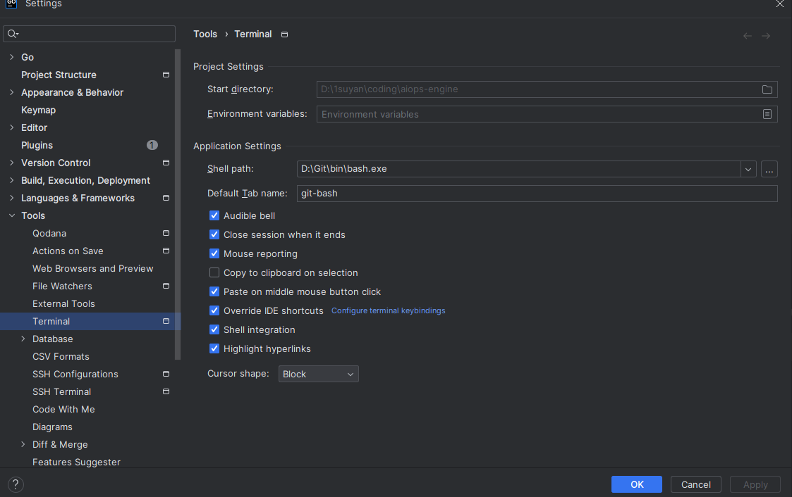
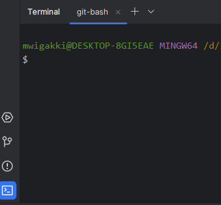

GO笔记

## 1. intro

- Google开源
- 编译型语言（编译成二进制的可执行文件然后就可直接执行了）
- 21世纪的C语言
- **支持交叉编译，编译快速；开发效率高；执行性能好；天生支持并发；自带格式化；自带垃圾回收**

``` go
import "fmf"

func main(){
    fmf.Println("人生苦短，Let's Go!")
}
```

[【置顶】Go语言学习之路/Go语言教程 | 李文周的博客 (liwenzhou.com)](https://www.liwenzhou.com/posts/Go/golang-menu/)

[Go语言标准库文档](https://studygolang.com/pkgdoc) 

https://www.topgoer.com/

## 2. Go语言开发环境搭建

[Downloads - The Go Programming Language (google.cn)](https://golang.google.cn/dl/) 

### Linux(ubuntu)

https://www.kandaoni.com/news/19058.html#

官方安装教程：[Download and install - The Go Programming Language (google.cn)](https://golang.google.cn/doc/install)

1. 首先到[官网](https://golang.google.cn/doc/install)下载最新Go for Linux 安装包。

    ``` shell
    wget https://golang.google.cn/dl/go1.21.9.linux-amd64.tar.gz
    ```

2. 将安装包放在` ~/Downloads`处

3. 解压go环境到指定位置` usr/local `下：:~/Documents$ **`sudo tar -C /usr/local -xzf go1.21.9.linux-amd64.tar.gz`**

4. 然后是添加变量：
   - 执行 `sudo vim /etc/profile`，在该文件最后插入：
   
   - ``` shell
     export GOPATH=/mnt/d/wsl/go
     export GOROOT=/usr/local/go
     export PATH=$PATH:$GOROOT/bin:$GOPATH/bin
     
     # 没有 GOPATH=$HOME/gopath 这个目录就新建
     ```
   
5. 使添加的环境生效：使用：**`source /etc/profile`**，可能没有生效，此时重启即可（其他用户如果没有）

6. 测试是否成功：使用：**`go version`**（其他用户如果显示没有结果就用其他用户source 一遍）

7. 添加模板和代理:
   - 模板：**`go env -w GO111MODULE=on`**
   - 代理：**`go env -w GOPROXY=http://goproxy.io,direct`**
   - **或者使用这个代理**：**`go env -w GOPROXY=http://goproxy.cn,direct`**

> vscode 编辑go代码时需要给当前的环境安装 gopls，使用命令`go install -v golang.org/x/tools/gopls@latest`安装 

### Windows

#### 安装go开发包

​	[Downloads - The Go Programming Language (google.cn)](https://golang.google.cn/dl/)  一路下一步，除了改目录

​	安装好后使用cmd输入 `go version `查看版本，能够看到就是安装成功了。

#### 配置环境变量

- `GOROOT`和`GOPATH`都是环境变量（以下都在用户变量中设置即可）
- `GOROOT` 配置的是 go 开发包的目录，安装程序让你选择的位置
- 并在 `path` 中新建一个环境变量 `%GOROOT%\bin`
- `GOPATH` 环境变量是Go项目的工作目录， 自己配一个喜欢的地方就好，然后gopath目录下一般有以下三个子目录，分别是：`src`、`pkg` 和 `bin`，新建一下
  - `src` 放所有源代码
  - `pkg` 放依赖的包
  - `bin` 放可执行文件
- 将上面的 bin 也加入环境变量 `path` 中


配好了如何测试？ cmd 输入`go env`有一长串的set

#### GOPROXY 非常重要

Go1.14版本之后，都推荐使用`go mod`模式来管理依赖环境了，也不再强制我们把代码必须写在`GOPATH`下面的src目录了，你可以在你电脑的任意位置编写go代码。（网上有些教程适用于1.11版本之前。）

默认GoPROXY配置是：`GOPROXY=https://proxy.golang.org,direct`，由于国内访问不到`https://proxy.golang.org`，所以我们需要换一个PROXY，这里推荐使用`https://goproxy.io`或`https://goproxy.cn`。

可以cmd执行下面的命令修改GOPROXY：

```bash
go env -w GOPROXY=https://goproxy.cn,direct
```

#### 安装VSCode作为IDE

略，主要在VS中加入go的插件即可

- 将 vs 的默认`terminal` 从`powershell` 改为 `cmd`


#### 安装 Goland作为IDE

软件安装略，下面是一些注意事项：

- [Goland 设置与配置_goland 配置-CSDN博客](https://blog.csdn.net/hudeyong926/article/details/120666742)
- [GoLand远程开发IDE：使用SSH远程连接服务器进行云端编程-阿里云开发者社区 (aliyun.com)](https://developer.aliyun.com/article/1434797)

**goland 快捷键**：

- Ctrl+D 复制行
- Ctrl+X 删除行
- Ctrl+J  自动代码提示
- Ctrl+alt+L  格式化文件
- **Ctrl+N (双击 shift)查找类型，变量，文件** 
- ALT+ ↑ / ↓ 在方法间快速移动定位
- CTRL+W 选中代码，连续按会额外选中
- **Ctrl+Q 查看代码元素文档**
- 折叠一层： Ctrl/Command   -
- 展开一层： Ctrl/Command   +
- 折叠全部： Ctrl/Command  Shift+ -
- 展开全部： Ctrl/Command   Shift  +
- **返回跳转前的位置：Ctrl Alt Left**


**goland 设置terminal 为git bash**

Windows下Terminal默认的使用的是系统自带的cmd，功能实在太少，用起来远不如 Git Bash 来得方利和高效。Git Bash 是安装 git 后自动为我们安装的一个类unix 的环境，在其上可以使用很多linux 的命令。

Goland的Terminal中使用Bash设置起来也很简单，设置位置在**Settings > Tools > Terminal > Shell_path**



我们设置为 `D:\Git\bin\bash.exe`。注意不要设置为 D:\Git\git-bash.exe，那样会在额外的弹窗中使用bash。

然后我们打开啊terminal 就默认使用的是git 的bash 了。




### golang程序的热加载 

代码修改后，程序能够自动重新加载并执行。 gin中没有官方提供的热加载工具，需要借助第三方工具

``` go
go get github.com/pilu/fresh // 下载
go install github.com/pilu/fresh // 安装
```

在项目中安装`fresh`后，直接在命令行执行`fresh`，之后就可以完全用`fresh`替代 `go run main.go`了。

发现程序也正常执行了。此时我们执行修改代码，发现命令行立刻自动重新加载服务，说明fresh生效了。

## 3. Hello world!

go 代码第一句是`package 包名`

- 如果`包名`是`main`，则build成可执行文件（当然代码中必须有func main）
- 如果不是，则表示这是个工具包，包名就随意

之后是导入import “包名”

函数外面不能执行语句，只能写标识符（变量、常量、函数、类型）的声明

``` go
package main

// go 代码第一句是`package 包名`
// 导入import “包名”
import "fmt"

// 函数外面不能执行语句，只能写标识符（变量、常量、函数、类型）的声明

func main() {
	fmt.Println("Hello world!")
}
```

### 一些规定（约定）

Go语言中如果标识符首字母是大写的，就表示对外部包是可见的、公有的。

构造函数写法

``` go
type Address struct {
	Province string
	City     string
}
// 接收者命名为类型首字母小写，构造函数命名为new类型名
func (a Address) newAddress(p string, c string) {
	a.Province = p
	a.City = c
}
```

### 手动关闭程序

调用`os.Exit(int)`函数来结束程序，传入的参数表示程序的退出状态码。退出状态码是一个整数值，用于表示程序退出时的状态。

传入的退出状态码可以根据具体的需求进行选择。一般来说，以下是常见的退出状态码约定：

- 0：表示程序正常退出，没有发生错误。
- 1：表示程序非正常退出，一般用于表示一般性错误。
- 其他非零值：表示不同类型的错误或异常情况，可以根据需要自定义。

## 4.  编译运行

### 使用`go build`

1. 当下项目目录下执行 `go build` :

​		右键新写的go文件，`open in integated terminal`, 再输入` go build`就会在相同目录下出现`文件夹名.exe`的可执行文件，**此二进制文件可以直接在没有安装go环境的机器上运行**

2. 在其他目录下执行 `go build` :

​		此时要在go build 后面加路径，不需要绝对路径，只需要加%GOPATH%/src/之后的路径就行了，写到最终的文件夹名就行了 ，不需要.go的文件名。例如`go build github.com\studyGo1\01helloword1`，可执行文件就会保存在当前目录下。

运行`go build`如果报错如下：`go: go.mod file not found in current directory or any parent directory; see 'go help modules'`。处理方法如下：在你的项目根目录下执行以下命令，以初始化 Go 模块：`go mod init <module-name>` 。`<module-name>` 是你的项目名称，可省略。

3. 改生成的exe文件名（名字默认是项目名，即这个文件夹的名字）

​		`go build -o 文件名.exe`

4. **不生成exe文件**直接执行go文件，就像执行脚本文件一样

​		`go run xx.go`

5. **在%GOPATH%/bin中生存exe文件**

​		`go install`

​		然后我们在任何地方打开cmd 都可以直接使用xx.exe来执行这个文件，因为GOPATH是添加到环境变量中的

### 使用`go run .`

我们一般直接使用`go run main.go` 就能运行了，但有时又有问题，如下面的例子。

在目录`qw`下定义`main.go`和`as.go`，两个go文件都在开头声明了`package main`。main.go中有main函数，as.go中有结构体 animal，我们想在main.go中使用 animal，此时我们不需要import，因为在一个package中。我们可以直接在main.go使用animal。而且即使animal开头小写声明为私有的也可以使用，因为在一个包里面就算在一个编译环境中。

但是我们运行`go run main.go`却发现提示我们 undefine: animal。而且如果我们先`go build`在执行可执行文件又能够正常运行了。

这是因为`go run main.go`只运行了 main.go 一个文件。这是我们需要使用 `go run .` 命令，该命令会**将当前目录下的所有文件作为一个 package 进行编译和运行**。这样可以确保所有文件中的符号都能够被正确识别。

另外，也可以尝试在使用 `go run` 命令时指定要编译的文件列表，例如 `go run main.go pp.go`，这样可以确保所有依赖的文件都被包含在编译过程中。


### 交叉编译

即在windows下写的go文件编译成linux下的可执行文件。（反之亦可）

如果你的`Windows`使用的是`cmd`，那么按如下方式指定环境变量。

```bash
SET CGO_ENABLED=0  // 禁用CGO
SET GOOS=linux  // 目标平台是linux
SET GOARCH=amd64  // 目标处理器架构是amd64
```

然后直接go build 就行。

其他的交叉编译自查吧。

使用"go build"或"go run"命令时，go工具会检查项目的依赖项，并自动下载和安装缺失的依赖项。这些依赖项会被安装在`$GOPATH/pkg/mod`目录下，以便在构建时使用。

但是，如果需要进行离线构建或想要手动管理依赖项，可以使用"go mod"命令管理依赖项。例如，使用"go mod download"命令可以下载项目的所有依赖项到本地缓存中，以便在离线环境中使用

## 5. 变量和常量

### 关键字

关键字是指编程语言中预先定义好的具有特殊含义的标识符。 关键字和保留字都不建议用作变量名。

Go语言中有25个关键字：

```go
    break        default      func         interface    select
    case         defer        go           map          struct
    chan         else         goto         package      switch
    const        fallthrough  if           range        type
    continue     for          import       return       var
```

此外，Go语言中还有37个保留字。

```go
Constants:    true  false  iota  nil(nil表示没有开辟内存空间)

        Types:    int  int8  int16  int32  int64  
                  uint  uint8  uint16  uint32  uint64  uintptr
                  float32  float64  complex128  complex64
				  bool  byte(int8)  rune(int32)  string  error

    Functions:   make  len  cap  new  append  copy  close  delete
                 complex  real  imag
                 panic  recover
```

### 声明

go是静态语言，变量声明时必须指定类型。（声明的非全局变量必须使用，不然会报错，因为全局可能是给其他包使用的）

推荐驼峰式命名

> var 变量名 变量类型

变量声明以关键字`var`开头，变量类型放在变量的后面，行尾无需分号。 举个例子：

```go
var name string
var age int
var isOk bool
```

- 批量声明: 每声明一个变量就需要写`var`关键字会比较繁琐，go语言中还支持批量变量声明：

```go
var (
    a string
    b int
    c bool
    d float32
)
```

### 初始化

Go语言在声明变量的时候，会**自动**对变量对应的内存区域进行初始化操作，不管这个变量声明在哪里，都会初始化的，不像c或者java。（**切片、map、指针、channel不会初始化，或者说引用类型被初始化为nil值**）

每个变量会被初始化成其类型的默认值，例如： 整型和浮点型变量的默认值为`0`。 字符串变量的默认值为`空字符串`。 布尔型变量默认为`false`。 切片、函数、指针变量的默认为`nil`。

当然我们也可在声明变量的时候为其指定初始值。变量初始化的标准格式如下：

```go
var 变量名 类型 = 表达式
```

举个例子：

```go
var name string = "Q1mi"
var age int = 18
```

或者一次初始化多个变量

```go
var name, age = "Q1mi", 20
```

### 类型推导

有时候我们会将变量的类型省略，这个时候编译器会根据等号右边的值来推导变量的类型完成初始化。

```go
var name = "Q1mi"
var age = 18 // 这里推导的是int， 而不是float
var i = 1.3 // 这里推导的是 float64 
```

### 短变量声明

**只能在函数内部使用**，可以使用更简略的 `:=` 方式声明并初始化变量。

```go
package main

import (
	"fmt"
)
// 全局变量m
var m = 100

func main() {
	n := 10
	m := 200 // 此处声明局部变量m
	fmt.Println(m, n)
}
```

### 匿名变量（和python里的差不多）

在使用多重赋值时，如果想要忽略某个值，可以使用`匿名变量（anonymous variable）`。 匿名变量用一个下划线`_`表示，例如：

```go
func foo() (int, string) {
	return 10, "Q1mi"
}
func main() {
	x, _ := foo()
	_, y := foo()
	fmt.Println("x=", x)
	fmt.Println("y=", y)
}
```

匿名变量不占用命名空间，不会分配内存，所以匿名变量之间不存在重复声明。 (在`Lua`等编程语言里，匿名变量也被叫做哑元变量。)

注意事项：

1. 函数外的每个语句都必须以关键字开始（var、const、func等）
2. **`:=`不能使用在函数外**。
3. `_`多用于占位，表示忽略值

### 常量

相对于变量，常量是恒定不变的值，多用于定义程序运行期间不会改变的那些值。 常量的声明和变量声明非常类似，只是把`var`换成了`const`，常量在定义的时候必须赋值。

```go
const pi = 3.1415
const e = 2.7182
```

声明了`pi`和`e`这两个常量之后，在整个程序运行期间它们的值都不能再发生变化了。

多个常量也可以一起声明：

```go
const (
    pi = 3.1415
    e = 2.7182
)
```

const同时声明多个常量时，如果省略了值则表示和上面一行的值相同。 例如：

```go
const (
    n1 = 100
    n2
    n3
)
```

上面示例中，常量`n1`、`n2`、`n3`的值都是100。

### iota

`iota`是go语言的常量计数器，只能在常量的表达式中使用。

`iota`在const关键字出现时将被重置为0。const中每新增一行常量声明将使`iota`计数一次(iota可理解为const语句块中的行索引)。 使用iota能简化定义，在定义枚举时很有用。

举个例子：

```go
const (
		n1 = iota //0
		n2        //1
		n3        //2
		n4        //3
	)
```

### 几个常见的`iota`示例:

使用`_`跳过某些值

```go
const (
		n1 = iota //0
		n2        //1
		_
		n4        //3
	)
```

`iota`声明中间插队

```go
const (
		n1 = iota //0
		n2 = 100  //100
		n3 = iota //2
		n4        //3
	)
	const n5 = iota //0
```

定义数量级 （这里的`<<`表示左移操作，`1<<10`表示将1的二进制表示向左移10位，也就是由`1`变成了`10000000000`，也就是十进制的1024。同理`2<<2`表示将2的二进制表示向左移2位，也就是由`10`变成了`1000`，也就是十进制的8。）

```go
const (
		_  = iota
		KB = 1 << (10 * iota)
		MB = 1 << (10 * iota)
		GB = 1 << (10 * iota)
		TB = 1 << (10 * iota)
		PB = 1 << (10 * iota)
	)
```

多个`iota`定义在一行，（iota出现一行才加一次，不是出现一次就加一次）

```go
const (
		a, b = iota + 1, iota + 2 //1,2
		c, d                      //2,3
		e, f                      //3,4
	)
```

## 6. 基本数据类型

Go语言中有丰富的数据类型，除了基本的整型、浮点型、布尔型、字符串外，还有数组、切片、结构体、函数、map、通道（channel）等。Go 语言的基本类型和其他语言大同小异。

### 整型

整型分为以下两个大类：按长度分为：int8、int16、int32、int64 对应的无符号整型：uint8、uint16、uint32、uint64

其中，`uint8`就是我们熟知的`byte`型，`int16`对应C语言中的`short`型，`int64`对应C语言中的`long`型。

|  类型  |                             描述                             |
| :----: | :----------------------------------------------------------: |
| uint8  |                  无符号 8位整型 (0 到 255)                   |
| uint16 |                 无符号 16位整型 (0 到 65535)                 |
| uint32 |              无符号 32位整型 (0 到 4294967295)               |
| uint64 |         无符号 64位整型 (0 到 18446744073709551615)          |
|  int8  |                 有符号 8位整型 (-128 到 127)                 |
| int16  |              有符号 16位整型 (-32768 到 32767)               |
| int32  |         有符号 32位整型 (-2147483648 到 2147483647)          |
| int64  | 有符号 64位整型 (-9223372036854775808 到 9223372036854775807) |

### 特殊整型

|  类型   |                          描述                          |
| :-----: | :----------------------------------------------------: |
|  uint   | 32位操作系统上就是`uint32`，64位操作系统上就是`uint64` |
|   int   |  32位操作系统上就是`int32`，64位操作系统上就是`int64`  |
|  float  |                        float64                         |
| uintptr |              无符号整型，用于存放一个指针              |

**注意：** 在使用`int`和 `uint`类型时，不能假定它是32位或64位的整型，而是考虑`int`和`uint`可能在不同平台上的差异。

**获得各种数字类型最大值最小值的方法: **使用math库中的math.MaxXxxx()

**注意事项** 获取对象的长度的内建`len()`函数返回的长度可以根据不同平台的字节长度进行变化。实际使用中，切片或 map 的元素数量等都可以用`int`来表示。在涉及到二进制传输、读写文件的结构描述时，为了保持文件的结构不会受到不同编译目标平台字节长度的影响，不要使用`int`和 `uint`。

### 数字字面量语法（Number literals syntax）

Go1.13版本之后引入了数字字面量语法，这样便于开发者以二进制、八进制或十六进制浮点数的格式定义数字，例如：

`v := 0b00101101`， 代表二进制的 101101，相当于十进制的 45。 `v := 0o377`，代表八进制的 377，相当于十进制的 255。 `v := 0x1p-2`，代表十六进制的 1 除以 2²，也就是 0.25。

而且还允许我们用 `_` 来分隔数字，比如说： `v := 123_456` 表示 v 的值等于 123456。

我们可以借助fmt函数来将一个整数以不同进制形式展示。

### fmt.Printf使用总结

```go
package main
 
import "fmt"
 
func main(){
	// 十进制
	var a int = 10
	fmt.Printf("%d \n", a)  // 10
	fmt.Printf("%b \n", a)  // 1010  占位符%b表示二进制
 
	// 八进制  以0开头
	var b int = 077
	fmt.Printf("%o \n", b)  // 77
 
	// 十六进制  以0x开头
	var c int = 0xff
	fmt.Printf("%x \n", c)  // ff
	fmt.Printf("%X \n", c)  // FF
    
    fmt.Print("%","T是用来查看类型的")
	fmt.Printf("%T", 3.1 + 5i)  // complex128
    fmt.Print("%v是用来查看值的")  // 不管什么类型可以用%v来查看值， 它是万能的
    sss := "sss"
	fmt.Printf("%v", sss)		// sss 对byte返回的是int8，对rune是int32
	fmt.Printf("%#v", sss) 		// "sss" 会给字符串加双引号
	fmt.Printf("%c", 'a') 		// %c打印一个字符
	fmt.Printf("%p", 'a') 		// %p得到它的地址
    
    s111 := fmt.Sprintf("%c", 97)// 返回的是97作为字符%c的类型 , fmt.Sprint的返回值是string
	fmt.Println(s111)	 // a
}
```

### 浮点型

Go语言支持两种浮点型数：`float32`和`float64`。这两种浮点型数据格式遵循`IEEE 754`标准： `float32` 的浮点数的最大范围约为 `3.4e38`，可以使用常量定义：`math.MaxFloat32`。 `float64` 的浮点数的最大范围约为 `1.8e308`，可以使用一个常量定义：`math.MaxFloat64`。

打印浮点数时，可以使用`fmt`包配合动词`%f`，代码如下：

```go
package main
import (
        "fmt"
        "math"
)
func main() {	
    fmt.Printf("%f \n", math.Phi)
	fmt.Printf("%.2f \n", math.Pi)
	fmt.Printf("%.15f \n", math.E)
	fmt.Printf("%.15f \n", math.MaxFloat32)
	fmt.Printf("%.15f \n", 3.2)
	fmt.Printf("%.15d \n", math.MaxInt16)
    
    /* 得到结果如下：
    1.618034
    3.14
    2.718281828459045
    340282346638528859811704183484516925440.000000000000000
    3.200000000000000
    000000000032767	 可见 %.15d 只不是保留到小数点后15位，对于整型是一共保留多少位，不够的前面补零
    				如果是%15d 就是用空格填充而不是用0填充
    */
    
    
    
	var n1 = 077
	var n2 = 0xff
	fmt.Printf("%d, %o, %32b, %T \n", n1, n1, n1, n1)
	fmt.Printf("%d, %x, %.32b, %T \n", n2, n2, n2, n2)
    /*
63, 77,                           111111, int
255, ff, 00000000000000000000000011111111, int
    */
}
```

### 复数

complex64和complex128

```go
var c1 complex64
c1 = 1 + 2i
var c2 complex128
c2 = 2 + 3i
fmt.Println(c1)
fmt.Println(c2)
```

复数有实部和虚部，complex64的实部和虚部为32位，complex128的实部和虚部为64位。

### 布尔型

Go语言中以`bool`类型进行声明布尔型数据，布尔型数据只有`true（真）`和`false（假）`两个值。

**注意：**

1. 布尔类型变量的默认值为`false`。
2. Go 语言中不允许将整型强制转换为布尔型.
3. 布尔型无法参与数值运算，也无法与其他类型进行转换。

### string字符串

字符串和字符数组之间的相互转化一般直接强转就行。( []byte(string类型变量) ,   string([]byte类型变量) )

string 类型即使只 声明不初始化其默认值也只会为“”，不会出现 nil。

string底层都是使用int32实现的字符。

Go语言中的字符串以原生数据类型出现，使用字符串就像使用其他原生数据类型（int、bool、float32、float64 等）一样。 Go 语言里的字符串的内部实现**使用`UTF-8`编码**，一个汉字一般占3个字节。 字符串的值为`双引号(")`中的内容，可以在Go语言的源码中直接添加非ASCII码字符，例如：

```go
s1 := "hello"
s2 := "你好"

var s6 string = "hello 世界"	// len(s6) = 12， 为byte的数量
for idx, item := range s6 {
    fmt.Printf("%v, %c, %T \n", idx, item, item)
}
fmt.Printf("%T, %T \n", pi, ten)
/*
0, h, int32 
1, e, int32 
2, l, int32
3, l, int32
4, o, int32
5,  , int32
6, 世, int32
9, 界, int32
*/
// 可见string是用的utf-8编码，但是英文字母的索引占一位（因为只用了1 byte），而汉字实实在在占三位
```

- 字符串转义符

Go 语言的字符串常见转义符包含回车、换行、单双引号、制表符等，如下表所示。

| 转义符 |                含义                |
| :----: | :--------------------------------: |
|  `\r`  |         回车符（返回行首）         |
|  `\n`  | 换行符（直接跳到下一行的同列位置） |
|  `\t`  |               制表符               |
|  `\'`  |               单引号               |
|  `\"`  |               双引号               |
|  `\\`  |               反斜杠               |

- 多行字符串

Go语言中要定义一个多行字符串时，就必须使用`反引号`字符：

```go
	var mutipleLineStr string = `1\r
	2\n
	3\t 
	4 所以转义符都失效了
	`

	fmt.Println(mutipleLineStr)

/*
1\r
        2\n
        3\t
        4 所以转义符都失效了
*/


```

反引号间换行将被作为字符串中的换行，但是所有的转义字符均无效，文本将会原样输出。因此写正则表达式时通常都用反引号。

### 字符串的常用操作

|                方法                 |                 介绍                  |
| :---------------------------------: | :-----------------------------------: |
|              len(str)               |                求长度                 |
|          + 或 fmt.Sprintf           |              拼接字符串               |
|            strings.Split            |                 分割                  |
|          strings.contains           |             判断是否包含              |
| strings.HasPrefix,strings.HasSuffix |             前缀/后缀判断             |
| strings.Index(),strings.LastIndex() |            子串出现的位置             |
| strings.Join(a[]string, sep string) |       用sep连接a中的所有字符串        |
| strings.Fields(str string) []string | 将str中一个或多个连续广义空白字符拆分 |

### 字符 byte和rune类型

组成每个字符串的元素叫做“字符”，可以通过遍历或者单个获取字符串元素获得字符。 字符用单引号（’）包裹起来，字符串用双引号包裹起来，如：

```go
var a = '中'
var b = 'x'
```

Go 语言的字符有以下两种：

1. `uint8`类型，或者叫 byte 型，代表了`ASCII码`的一个字符。
2. `rune`类型，代表一个 `UTF-8字符`。

当需要处理中文、日文或者其他复合字符时，则需要用到`rune`类型。**`rune`类型实际是一个`int32`**，是它的别名alias。

Go 使用了特殊的 rune 类型来处理 Unicode，让基于 Unicode 的文本处理更为方便，也可以使用 byte 型进行默认字符串处理，性能和扩展性都有照顾。

```go
// 遍历字符串
func traversalString() {
	s := "hello沙河"
	for i := 0; i < len(s); i++ { //byte , 这种普通的for 是按内存中每个int8的方式返回的
		fmt.Printf("%v(%c) ", s[i], s[i])
	}
	fmt.Println()
	for iter, r := range s { //rune 而for-each则是按rune的方式返回的
        	// 但是字符串的索引仍然是按每个byte来数的
		fmt.Printf("%v(%c) ", r, r)
	}
	fmt.Println()
}

	str1 := "hello 张三"
	fmt.Println("\"hello 张三\"的长度为 ", len(str1)) // 得到12
```

输出：

```bash
104(h) 101(e) 108(l) 108(l) 111(o) 230(æ) 178(²) 153() 230(æ) 178(²) 179(³) 
104(h) 101(e) 108(l) 108(l) 111(o) 27801(沙) 27827(河) 
```

因为UTF8编码下一个中文汉字由3~4个字节组成，所以我们不能简单的按照字节去遍历一个包含中文的字符串，否则就会出现上面输出中第一行的结果。

**字符串底层是一个byte(uint8)数组**，所以可以和`[]byte`类型相互转换。**字符串是不能修改的**。字符串是由byte字节组成，所以**字符串的长度是byte字节的长度**。 rune类型用来表示utf8字符，一个rune字符由一个或多个byte组成。

### 得到string的实际长度

``` go
    //以下两种都可以得到str的字符串长度
    
    //golang中的unicode/utf8包提供了用utf-8获取长度的方法
    fmt.Println("RuneCountInString:", utf8.RuneCountInString(str))

    //通过rune类型处理unicode字符
    fmt.Println("rune:", len([]rune(str)))
```

### 修改字符串

要修改字符串，需要先将其转换成`[]rune`或`[]byte`，完成后再转换为`string`。无论哪种转换，都会重新分配内存，并复制字节数组。

```go
func changeString() {
	s1 := "big"
	// 强制类型转换
	byteS1 := []byte(s1)
	byteS1[0] = 'p'
	fmt.Println(string(byteS1))

	s2 := "白萝卜"
	runeS2 := []rune(s2)
	runeS2[0] = '红'
	fmt.Println(string(runeS2))
}
```

### 需要经常修改的字符串

使用Builder可以创建轻易修改的字符串对象(轻松修改字符串)

``` go
func fizzBuzz(n int) []string {
	ans := make([]string, 0, n)
	for i := 1; i <= n; i++ {
		sb := &strings.Builder{}
		if i%3 == 0 {
			sb.WriteString("Fizz")
		}
		if i%5 == 0 {
			sb.WriteString("Buzz")
		}
		if sb.Len() == 0 {
			sb.WriteString(strconv.Itoa(i))
		}
		ans = append(ans, sb.String())
	}
	return ans
}
```

### 类型转换

Go语言中**只有强制类型转换，没有隐式类型转换**。该语法只能在两个类型之间支持相互转换的时候使用。布尔类型不能转。

强制类型转换的基本语法如下：

```bash
T(表达式)
```

其中，T表示要转换的类型。表达式包括变量、复杂算子和函数返回值等.

比如计算直角三角形的斜边长时使用math包的Sqrt()函数，该函数接收的是float64类型的参数，而变量a和b都是int类型的，这个时候就需要将a和b强制类型转换为float64类型。

```go
func sqrtDemo() {
	var a, b = 3, 4
	var c int
	// math.Sqrt()接收的参数是float64类型，需要强制转换
	c = int(math.Sqrt(float64(a*a + b*b)))
	fmt.Println(c)
}
```

## 7. 流程控制

### if-else

Go语言中`if`条件判断的格式如下：

```go
if 表达式1 {
    分支1
} else if 表达式2 {
    分支2
} else{
    分支3
}
```

当表达式1的结果为`true`时，执行分支1，否则判断表达式2，如果满足则执行分支2，都不满足时，则执行分支3。 if判断中的`else if`和`else`都是可选的，可以根据实际需要进行选择。

Go语言规定与`if`匹配的**左括号`{`必须与`if和表达式`放在同一行**，`{`放在其他位置会触发编译错误。 同理，**与`else`匹配的`{`也必须与`else`写在同一行，`else`也必须与上一个`if`或`else if`右边的大括号在同一行。**

举个例子：

```go
func ifDemo1() {
	score := 65
	if score >= 90 {
		fmt.Println("A")
	} else if score > 75 {
		fmt.Println("B")
	} else {
		fmt.Println("C")
	}
}
```

if条件判断还有一种特殊的写法，可以在 if 表达式之前添加一个执行语句，再根据变量值进行判断，举个例子：

这样的好处是减小了内存的占用，（score只在if里才有效），缺点是使代码不易读

```go
func ifDemo2() {
	if score := 65; score >= 90 {
		fmt.Println("A")
	} else if score > 75 {
		fmt.Println("B")
	} else {
		fmt.Println("C")
	}
}
```

### for

Go 语言中的所有循环类型均可以使用`for`关键字来完成。

for循环的基本格式如下：

```bash
for 初始语句;条件表达式;结束语句{
    循环体语句
}
```

条件表达式返回`true`时循环体不停地进行循环，直到条件表达式返回`false`时自动退出循环。

```go
func forDemo() {
	for i := 0; i < 10; i++ {
		fmt.Println(i)
	}
}
```

for循环的初始语句可以被忽略，但是初始语句后的分号必须要写，例如：

```go
func forDemo2() {
	i := 0
	for ; i < 10; i++ {
		fmt.Println(i)
	}
}
```

for循环的初始语句和结束语句都可以省略，例如：

```go
func forDemo3() {
	i := 0
	for i < 10 {
		fmt.Println(i)
		i++
	}
}
```

这种写法类似于其他编程语言中的`while`，在`while`后添加一个条件表达式，满足条件表达式时持续循环，否则结束循环。

**无限循环**

```go
for {
    循环体语句
}
```

for循环可以通过`break`、`goto`、`return`、`panic`语句强制退出循环。

### for range 键值循环

Go语言中可以使用`for range`遍历**数组、切片、字符串、map 及通道（channel）**。 通过`for range`遍历的返回值有以下规律：

1. 数组、切片、字符串返回索引和值。
2. map返回键和值。
3. 通道（channel）只返回通道内的值。

``` go
var s7 string = "hello 中国，계획을"
fmt.Printf("%T, %v \n", count, count)
for index, item := range s7 { // 用不着index时直接 for _, item
    fmt.Printf("第%d个字符", index)
    if unicode.Is(unicode.Han, item) {
        fmt.Printf("是汉字：%c\n", item)
    } else {
        fmt.Println("不是汉字")
    }
}
```

#### for range中的坑

在for range中进行引用或指针赋值时要注意：

``` go
m := make(map[string]*student)
stus := []student{
    {name: "小王子", age: 18},
    {name: "娜扎", age: 23},
    {name: "大王八", age: 9000},
}
for _, stu := range stus {
    m[stu.name] = &stu
}
for k, v := range m {
    fmt.Println(k, "=>", v.name)
}
/* 我们当然预期得到
小王子 => 小王子
娜扎 => 娜扎
大王八 => 大王八
但是实际上得到了：
小王子 => 大王八
娜扎 => 大王八
大王八 => 大王八
*/
```

原因在于`for...range` 遍历时，**:=前的变量stu是值的副本**，即每次遍历要给stus中的内容stu都拷贝到**同一个**空间，再进行操作，如下所示

```go
m := make(map[string]*student)
stus := []student{
    {name: "小王子", age: 18},
    {name: "娜扎", age: 23},
    {name: "大王八", age: 9000},
}
fmt.Printf("小王子,%p\n", &stus[0])	// 打印stus中每个stu的地址
fmt.Printf("娜扎,%p\n", &stus[1])
fmt.Printf("大王八,%p\n", &stus[2])  
for _, stu := range stus {
    fmt.Printf("%s,%p\n",stu.name, &stu)	// 打印for range中每个stu的地址
    m[stu.name] = &stu
}
fmt.Println(m)
for k, v := range m {
    fmt.Println(k, "=>", v.name) // 暂时没打印
}
/* 结果
小王子,0xc000100050
娜扎,0xc000100068  
大王八,0xc000100080 
小王子,0xc000114060
娜扎,0xc000114060
大王八,0xc000114060
map[大王八:0xc000114060 娜扎:0xc000114060 小王子:0xc000114060]
*/
```

由上面例程可以看出，for range中每个stu的地址都是一样的，根本原因在于for-range会**使用同一块内存去接收拷贝循环中的值**。所以每一次操作m[stu.name] = &stu,实际指向的都是同一个地址，遍历完成后，存储的是结构体最后一个值的拷贝。

修改代码如下：

``` go
m := make(map[string]*student)
stus := []student{
    {name: "小王子", age: 18},
    {name: "娜扎", age: 23},
    {name: "大王八", age: 9000},
}
fmt.Printf("小王子,%p\n", &stus[0])
fmt.Printf("娜扎,%p\n", &stus[1])
fmt.Printf("大王八,%p\n", &stus[2])
for index, stu := range stus {
    fmt.Printf("%s,%p\n", stu.name, &stus[index])
    m[stu.name] = &stus[index]
}
for k, v := range m {
    fmt.Println(k, "=>", v.name)
}
/*
小王子,0xc0000d6000
娜扎,0xc0000d6018
大王八,0xc0000d6030
小王子,0xc0000d6000
娜扎,0xc0000d6018
大王八,0xc0000d6030
小王子 => 小王子
娜扎 => 娜扎
大王八 => 大王八 
*/  // 可以看出，此时m中的每个name对应的地址都是原stus中的地址了，而不是拷贝的了。
```

### switch【不需要break】

switch默认只执行一个分支。

使用`switch`语句可方便地对大量的值进行条件判断。

```go
func switchDemo1() {
	finger := 3  // 3.0也可以
	switch finger {
	case 1:
		fmt.Println("大拇指")
	case 2:
		fmt.Println("食指")
	case 3:
		fmt.Println("中指")
	case 4:
		fmt.Println("无名指")
	case 5:
		fmt.Println("小拇指")
	default:
		fmt.Println("无效的输入！")
	}
```

Go语言规定每个`switch`只能有一个`default`分支。 default 并不会默认执行，只在没有case执行时执行

**一个分支可以有多个值**，多个case值中间使用英文逗号分隔。

```go
func testSwitch3() {
	switch n := 7; n {
	case 1, 3, 5, 7, 9:
		fmt.Println("奇数")
	case 2, 4, 6, 8:
		fmt.Println("偶数")
	default:		// default 并不会默认执行
		fmt.Println(n)
	}
}
```

**分支还可以使用表达式**，这时候switch语句后面不需要再跟判断变量。例如：

```go
func switchDemo4() {
	age := 30
	switch {
	case age < 25:
		fmt.Println("好好学习吧")
	case age > 25 && age < 35:
		fmt.Println("好好工作吧")
	case age > 60:
		fmt.Println("好好享受吧")
	default:
		fmt.Println("活着真好")
	}
}
```

`fallthrough`语法可以执行满足条件的case的下一个case，是为了兼容C语言中的case设计的。

```go
func switchDemo5() {
	s := "a"
	switch {
	case s == "a":
		fmt.Println("a")
		fallthrough
	case s == "b":
		fmt.Println("b")
	case s == "c":
		fmt.Println("c")
	default:
		fmt.Println("...")
	}
}
```

输出：

```bash
a
b
```

### break

`break`语句可以结束`for`、`switch`和`select`的代码块。

`break`语句还可以在语句后面添加标签，表示退出某个标签对应的代码块，标签要求必须定义在对应的`for`、`switch`和 `select`的代码块上。 举个例子：

```go
func breakDemo1() {
BREAKDEMO1:
	for i := 0; i < 10; i++ {
		for j := 0; j < 10; j++ {
			if j == 2 {
				break BREAKDEMO1
			}
			fmt.Printf("%v-%v\n", i, j)
		}
	}
	fmt.Println("...")
}
```

### continue

`continue`语句可以结束当前循环，开始下一次的循环迭代过程，仅限在`for`循环内使用。

在 `continue`语句后添加标签时，表示开始标签对应的循环。例如：

```go
func continueDemo() {
forloop1:
	for i := 0; i < 5; i++ {
		// forloop2:
		for j := 0; j < 5; j++ {
			if i == 2 && j == 2 {
				continue forloop1
			}
			fmt.Printf("%v-%v\n", i, j)
		}
	}
}
```

### goto

`goto`语句通过标签进行代码间的无条件跳转。`goto`语句可以在快速跳出循环、避免重复退出上有一定的帮助。Go语言中使用`goto`语句能简化一些代码的实现过程。 例如双层嵌套的for循环要退出时：【尽量少用】

```go
func gotoDemo1() {
	var breakFlag bool
	for i := 0; i < 10; i++ {
		for j := 0; j < 10; j++ {
			if j == 2 {
				// 设置退出标签
				breakFlag = true
				break
			}
			fmt.Printf("%v-%v\n", i, j)
		}
		// 外层for循环判断
		if breakFlag {
			break
		}
	}
}
```

使用`goto`语句能简化代码：

```go
func gotoDemo2() {
	for i := 0; i < 10; i++ {
		for j := 0; j < 10; j++ {
			if j == 2 {
				// 设置退出标签
				goto breakTag
			}
			fmt.Printf("%v-%v\n", i, j)
		}
	}
	return
	// 标签
breakTag:
	fmt.Println("结束for循环")
}
```

## 8. 运算符

### 算术运算符

| 运算符 |         描述          |
| :----: | :-------------------: |
|   +    |         相加          |
|   -    |         相减          |
|   *    |         相乘          |
|   /    | 相除【int÷int是整除】 |
|   %    |         求余          |

**注意：** 如果运算之后溢出了也不会报错

``` go
	var n3 uint8 = 225
	var n4 uint8 = 225
	var n5 int = 225
	var n6 int = 225
	fmt.Printf("%v,", n3+n4)
	fmt.Printf("%v,", (n5+n6)&0b11111111)
// 结果 194,194,
```


**注意：** `++`（自增）和`--`（自减）在Go语言中是单独的语句，并不是运算符，**不能放在等号右边进行赋值**。

### 关系运算符

| 运算符 |                             描述                             |
| :----: | :----------------------------------------------------------: |
|   ==   | 【Go强类型，只有类型相同才能比，flaot32和float64都不能比较】比较两值，相等返回 True 否则返回 False。 |
|   !=   | 【同上，不同类型 != 不能编译通过】检查两个值是否不相等，如果不相等返回 True 否则返回 False。 |
|   >    |  检查左边值是否大于右边值，如果是返回 True 否则返回 False。  |
|   >=   | 检查左边值是否大于等于右边值，如果是返回 True 否则返回 False。 |
|   <    |  检查左边值是否小于右边值，如果是返回 True 否则返回 False。  |
|   <=   | 检查左边值是否小于等于右边值，如果是返回 True 否则返回 False。 |

### 逻辑运算符

| 运算符 |                             描述                             |
| :----: | :----------------------------------------------------------: |
|   &&   | 逻辑 AND 运算符。 如果两边的操作数都是 True，则为 True，否则为 False。(优先级大于\|\|) |
|  \|\|  | 逻辑 OR 运算符。 如果两边的操作数有一个 True，则为 True，否则为 False。 |
|   !    | 逻辑 NOT 运算符。 如果条件为 True，则为 False，否则为 True。(优先级大于上面两个) |

优先级排序是 **非 ，与 ，或**

### 位运算符

位运算符对整数在内存中的二进制位进行操作。

| 运算符 |                             描述                             |
| :----: | :----------------------------------------------------------: |
|   &    |  参与运算的两数各对应的二进位**相与**。 （两位均为1才为1）   |
|   \|   |  参与运算的两数各对应的二进位相或。 （两位有一个为1就为1）   |
|   ^    | 参与运算的两数各对应的二进位相**异或**，当两对应的二进位相异时，结果为1。 （两位不一样则为1）<br />单独使用时表示**取反**，如`var n7 int8 = 1 则^n7 = -2` |
|   <<   | 左移n位就是乘以2的n次方。 “a<<b”是把a的各二进位全部左移b位，高位丢弃，低位补0。 |
|   >>   | 右移n位就是除以2的n次方。 “a>>b”是把a的各二进位全部右移b位。 |

**前四个位运算符时并不会对符号位进行特殊处理，只有右移>> 会用符号位填充。**

``` go
	var n8 int8 = -127 	 // 10000001
	fmt.Printf("%b, %v \n", n8<<1, n8<<1) // 10, 2 左移将符号位移走
	fmt.Printf("%b, %v \n", n8>>1, n8>>1) // -1000000, -64 ， 右移使用符号位填充，
// go无法进行无符号的右移, 如果硬要进行进行无符号的右移，先强转位无符号数再右移，再强转回来

	var n9 int8 = -127
	fmt.Printf("%b, %v \n", n9, n9)  // -1111111, -127	
	var n10 uint8 = uint8(n9) >> 1
	n9 = int8(n10)
	fmt.Printf("%b, %v \n", n9, n9) // 1000000, 64
```

### 赋值运算符

| 运算符 |                      描述                      |
| :----: | :--------------------------------------------: |
|   =    | 简单的赋值运算符，将一个表达式的值赋给一个左值 |
|   +=   |                  相加后再赋值                  |
|   -=   |                  相减后再赋值                  |
|   *=   |                  相乘后再赋值                  |
|   /=   |                  相除后再赋值                  |
|   %=   |                  求余后再赋值                  |
|  <<=   |                   左移后赋值                   |
|  >>=   |                   右移后赋值                   |
|   &=   |                  按位与后赋值                  |
|  \|=   |                  按位或后赋值                  |
|   ^=   |                 按位异或后赋值                 |

找出全是对子数字的数组中唯一的单个数字

``` go
	s := [5]int{1, 3, 3, 1, 2}

	res := 0
	for _, item := range s {
		res ^= item
	}
	fmt.Println(res)
```

## 9. array(数组) 

数组声明时必须声明**长度**和**数据类型**，长度和数据类型都是数组的一部分。

直接用内置函数`len(array)`得到数组`array`的长度

数组这一数据类型，是被编程语言高度抽象封装的结构，`下标` 会转换成 `虚拟内存地址`，然后操作系统会自动帮我们进行寻址，这个寻址过程是特别快的，所以往数组的某个下标取一个值和放一个值，时间复杂度都为 `O(1)`。

数组是同一种数据类型元素的集合。 在Go语言中，数组从声明时就确定，使用时可以修改数组成员，但是**数组大小不可变化**。 基本语法：

```go
// 定义一个长度为3元素类型为int的数组a
var a [3]int
var a1 [3]int	// 默认初始化位全0
fmt.Printf("a1: %T", a1)  // a1: [3]int
// 
```

数组的优点是占用空间小，查询快，直接使用索引就可以获取数据元素，缺点是移动和删除数据元素要大量移动空间。

### 数组定义

```bash
var 数组变量名 [元素数量]T
```

比如：`var a [5]int`， 数组的**长度必须是常量**，*并且长度是数组类型的一部分*。*一旦定义，长度不能变*。 `[5]int`和`[10]int`是不同的类型。

```go
var a [3]int
var b [4]int
a = b //不可以这样做，因为此时a和b是不同的类型
```

数组可以通过下标进行访问，下标是从`0`开始，最后一个元素下标是：`len-1`，访问越界（下标在合法范围之外），则触发访问越界，会panic。

### 初始化

数组的初始化也有很多方式。

#### 方法一

初始化数组时可以使用初始化列表来设置数组元素的值。（**声明时必须指明或能明确推断出数组的长度**）

```go
func main() {
	var testArray [3]int                        //数组会初始化为int类型的零值
	var numArray = [3]int{1, 2}                 //使用指定的初始值完成初始化
	var cityArray = [3]string{"北京", "上海", "深圳"} //使用指定的初始值完成初始化
	fmt.Println(testArray)                      //[0 0 0]
	fmt.Println(numArray)                       //[1 2 0]
	fmt.Println(cityArray)                      //[北京 上海 深圳]
}
```

#### 方法二

按照上面的方法每次都要确保提供的初始值和数组长度一致，一般情况下我们可以让编译器根据初始值的个数**自行推断数组的长度**，例如：

```go
func main() {
	var testArray [3]int
	var numArray = [...]int{1, 2}
	var cityArray = [...]string{"北京", "上海", "深圳"}
	fmt.Println(testArray)                          //[0 0 0]
	fmt.Println(numArray)                           //[1 2]
	fmt.Printf("type of numArray:%T\n", numArray)   //type of numArray:[2]int
	fmt.Println(cityArray)                          //[北京 上海 深圳]
	fmt.Printf("type of cityArray:%T\n", cityArray) //type of cityArray:[3]string
}
```

#### 方法三

我们还可以使用**指定索引值的方式**来初始化数组，例如:

```go
func main() {
	a := [...]int{1: 1, 3: 5}
	fmt.Println(a)                  // [0 1 0 5]
	fmt.Printf("type of a:%T\n", a) //type of a:[4]int
}
```

### 数组遍历

遍历数组a有以下两种方法：

```go
func main() {
	var a = [...]string{"北京", "上海", "深圳"}
	// 方法1：for循环遍历
	for i := 0; i < len(a); i++ {
		fmt.Println(a[i])
	}

	// 方法2：for range遍历
	for index, value := range a {
		fmt.Println(index, value)
	}
}
```

### 多维数组

Go语言是支持多维数组的，我们这里以二维数组为例（数组中又嵌套数组）。

#### 二维数组的定义

```go
func main() {
	a := [3][2]string{
		{"北京", "上海"},
		{"广州", "深圳"},
		{"成都", "重庆"},
	}
	fmt.Println(a) //[[北京 上海] [广州 深圳] [成都 重庆]]
	fmt.Println(a[2][1]) //支持索引取值:重庆
}
```

#### 二维数组的遍历

```go
func main() {
	a := [3][2]string{
		{"北京", "上海"},
		{"广州", "深圳"},
		{"成都", "重庆"},
	}
	for _, v1 := range a {
		for _, v2 := range v1 {
			fmt.Printf("%s\t", v2)
		}
		fmt.Println()
	}
}
```

输出：

```bash
北京	上海	
广州	深圳	
成都	重庆	
```

**注意：** 多维数组**只有第一层**可以使用`...`来让编译器推导数组长度。例如：

```go
//支持的写法
a := [...][2]string{
	{"北京", "上海"},
	{"广州", "深圳"},
	{"成都", "重庆"},
}
//不支持多维数组的内层使用...
b := [3][...]string{
	{"北京", "上海"},
	{"广州", "深圳"},
	{"成都", "重庆"},
}
```

### 给函数传个数组

数组是值类型，**赋值和传参会复制整个数组**。因此改变副本的值，不会改变本身的值。

```go
func modifyArray(x [3]int) {
	x[0] = 100
}

func modifyArray2(x [3][2]int) {
	x[2][0] = 100
}
func main() {
	a := [3]int{10, 20, 30}
	modifyArray(a) //在modify中修改的是a的副本x
	fmt.Println(a) //[10 20 30]
	b := [3][2]int{
		{1, 1},
		{1, 1},
		{1, 1},
	}
	modifyArray2(b) //在modify中修改的是b的副本x
	fmt.Println(b)  //[[1 1] [1 1] [1 1]]
}
```

**注意：**

1. **数组支持 “==“、”!=” 操作符**，因为内存总是被初始化过的。
2. `[n]*T`表示指针数组，`*[n]T`表示数组指针 。

## 10. slice(切片)

因为数组的长度是固定的并且数组长度属于类型的一部分，所以数组有很多的局限性。

**切片（Slice）**是一个拥有**相同类型元素**的**可变长度**的序列。它是基于数组类型做的一层封装。它非常灵活，*支持自动扩容*。

切片是一个**引用类型**，**它的内部结构包含`地址`、`长度`和`容量`**。切片一般用于快速地操作一块数据集合。切片是引用类型，不支持直接比较，只能和nil比较。

切片本身就是**地址+长度+容量**

``` go
type slice struct{
 array unsafe.Pointer
 len int
 cap int
}
```


**对于切片的修改一律修改的是底层数组。**

### 定义

声明切片类型的基本语法如下：

```go
var name []T
```

其中，

- name:表示变量名
- T:表示切片中的元素类型

举个例子：

```go
func main() {
	// 声明切片类型
	var a []string              //声明一个字符串切片
	var b = []int{}             //声明一个整型切片并初始化
	var c = []bool{false, true} //声明一个布尔切片并初始化
	var d = []bool{false, true} //声明一个布尔切片并初始化
	fmt.Println(a)              //[]
	fmt.Println(b)              //[]
	fmt.Println(c)              //[false true]
	fmt.Println(a == nil)       //true
	fmt.Println(b == nil)       //false
	fmt.Println(c == nil)       //false
	// fmt.Println(c == d)   //切片是引用类型，不支持直接比较，只能和nil比较
}
```

### 长度和容量

一个`nil`值的切片并没有底层数组，一个`nil`值的切片的长度和容量都是0。

切片拥有自己的**长度和容量**，我们可以通过使用内置的`len()`函数求长度，使用内置的`cap()`函数求切片的容量。

``` go
s2 = []rune("q去w请")
fmt.Println(s2, len(s2), cap(s2)) // [113 21435 119 35831] 4 4

a1 := [...]int{1,3,5,7,9,11,13,15,17,19}
s3 := a1[1:8]
fmt.Println(len(s3), cap(s3)) // 7 9
s3 = a1[1:2]
fmt.Println(len(s3), cap(s3)) // 1 9
s3 = a1[3:5]
fmt.Println(len(s3), cap(s3)) // 2 7
s3 = a1[3:8]
fmt.Println(len(s3), cap(s3)) // 5 7
```

可见，直接声明的切片长度和容量是一样的，而由数组切割而来的切片的**容量则是从切割的第一个元素到数组最终的长度。**

实际上切片底层也是先造一个数组再从头到尾切割成切片。

### 切片的本质

切片的本质就是对**底层数组的封装**，**它包含了三个信息：底层数组的指针、切片的长度（len）和切片的容量（cap）**。

举个例子，现在有一个数组`a := [8]int{0, 1, 2, 3, 4, 5, 6, 7}`，切片`s1 := a[:5]`，相应示意图如下。


`s2 := a[3:6]`，相应示意图如下：


``` go
var a = [8]int{0, 1, 2, 3, 4, 5, 6, 7}
var s1 = a[:5]
var s2 = a[3:6]
fmt.Println(s1)
fmt.Println(s2)
a[3] = 33
s1[4] = 44
fmt.Println(s1)
fmt.Println(s2) // 因为都是引用了同一块内存空间
/*
结果
[0 1 2 3 4]
[3 4 5]
[0 1 2 33 44]
[33 44 5]
*/
```

### 切片的本质2（地址）

我们知道切片本质是**地址+长度+容量**

``` go
func main() {
	a2 := [4]int{1, 2, 3, 4}
	s2 := a2[0:]
	fmt.Printf("%p, \n%p\n", &a2, &a2[0])
	fmt.Printf("%p, \n%p, \n%p\n", s2, &s2, &s2[0])

/*
0xc0000141e0, 
0xc0000141e0	// 将底层数组的地址打印出来以作对比
0xc0000141e0, 	// 可见，直接打印s2就是切片本质中的地址，
0xc000004078,	// 而打印&s2就是地址的地址了
0xc0000141e0
*/
	// 此时进行扩容
	s2 = append(s2, 5, 5, 5, 5, 5)
	fmt.Printf("%p, \n%p, \n%p\n", s2, &s2, &s2[0])
/*
0xc00000e230,	// 切片重新指向了新开辟的匿名底层数组了
0xc000004078,	// 而指向切片的地址并没有变
0xc00000e230
*/
}
```

注意看此例：

``` go
func test() {
	set := make(map[[3]int]struct{})
	set[[3]int{1, 1, 1}] = struct{}{}
	set[[3]int{2, 2, 2}] = struct{}{}

	res := make([][]int, 0)
	for k := range set {
		res = append(res, k[:])
	}
	fmt.Println(res)
}

/* 输出
[[2 2 2] [2 2 2]]
*/
```

预期的输出是 `[[1 1 1] [2 2 2]]`，而导致`res[0] 与 res[1]` 相同的原因在于 k 是从set中取出来的数组，每次把set中的数组拿出来都是放在k这块地址空间了，导致`res[0] 与 res[1]` 指向了相同的这块临时的名为 k 的空间，正确的写法应该是：

``` go
func test() {
	set := make(map[[3]int]struct{})
	set[[3]int{1, 1, 1}] = struct{}{}
	set[[3]int{2, 2, 2}] = struct{}{}

	res := make([][]int, 0)
	for k := range set {
		tmp := []int{0, 0, 0}
		copy(tmp, k[:])
		res = append(res, tmp) 
	}
	fmt.Println(res)
}
```

### 切片作为参数传入函数

切片传入函数中是**值传递**，即将**`底层数组的地址+长度+容量`**拷贝到形参传进去。于是，形参和实参的内容“地址+长度+容量”是一样的，只是它们是在内存中不同的两份。但都指向了同一个底层数组，**所以对形参修改，实参那里也会修改**。但是使用`append`追加元素并不会改变实参，因为**实参的长度并没有变**。

``` go
func f1(s []int) {
	fmt.Printf("在函数中扩容前：%v, %v, %v, %p\n", s, len(s), cap(s), s)
	s[0] = 10000
	s = append(s, 5)
	fmt.Printf("在函数中扩容后：%v, %v, %v, %p\n", s, len(s), cap(s), s)

}

func main() {
	fmt.Println()
	var s1 = []int{1, 2, 3, 4}
	// s1 := make([]int, 4, 8)
	fmt.Printf("%v, %v, %v, %p\n", s1, len(s1), cap(s1), s1)
	f1(s1)
	fmt.Printf("%v, %v, %v, %p\n", s1, len(s1), cap(s1), s1)
}
/*
[1 2 3 4], 4, 4, 0xc0000141e0		
在函数中扩容前：[1 2 3 4], 4, 4, 0xc0000141e0 
在函数中扩容后：[10000 2 3 4 5], 5, 8, 0xc000012240
[10000 2 3 4], 4, 4, 0xc0000141e0
*/
```

如果传地址的话，就是形参和实参是同一份“数组地址+长度+容量”，这样就会一改都改了。

``` go
func f1(s *[]int) {
	fmt.Printf("在函数中扩容前：%v, %v, %v, %p\n", s, len((*s)), cap((*s)), (*s))
	(*s)[0] = 10000
	(*s) = append((*s), 5)
	fmt.Printf("在函数中扩容后：%v, %v, %v, %p\n", s, len((*s)), cap((*s)), (*s))

}

func main() {
	fmt.Println()
	var s1 = []int{1, 2, 3, 4}
	fmt.Printf("%v, %v, %v, %p\n", s1, len(s1), cap(s1), s1)
	f1(&s1)
	fmt.Printf("%v, %v, %v, %p\n", s1, len(s1), cap(s1), s1)
}
/*
[1 2 3 4], 4, 4, 0xc0000141e0
在函数中扩容前：&[1 2 3 4], 4, 4, 0xc0000141e0
在函数中扩容后：&[10000 2 3 4 5], 5, 8, 0xc000012240
[10000 2 3 4 5], 5, 8, 0xc000012240
*/
```

注意以下例程：

``` go
func changeSlice(s []int) []int {
    s[0] = 10
    s = append(s, 3) // 通过这个append，把函数里的形参s的len改了，但函数外面是不会被改的
    s = append(s, 4)
    s[1] = 100
    
    return s
}
func main() {
    slice := make([]int, 2, 3)
    for i := 0; i < len(slice); i++ {
        slice[i] = i
    }
    
    ret := changeSlice(slice)
    ret[1] = 111
	
    fmt.Printf("slice: %v, ret: %v \n", slice, ret)
}
// 结果
// slice: [10 1], ret: [10 111 3 4] 
// slice只有两位的原因，slice的本质（底层数组,len=2,cap=3）不会变。
```

对切片进行切割也会改变切片的地址：

``` go
func pop(nums []int) int {
	v := nums[0]
	nums = nums[1:]
	fmt.Printf("2.%p, %v\n", nums, nums)
	return v
}

func main() {
	a := []int{1, 2, 3}
	fmt.Printf("1.%p, %v\n", a, a)
	pop(a)
	fmt.Printf("3.%p, %v\n", a, a)
}

/*
1.0xc00000a1b0, [1 2 3]
2.0xc00000a1b8, [2 3]	// 可以看到地址改变了
3.0xc00000a1b0, [1 2 3]
*/
```

对切片append时如果没有触发扩容就不会改变地址：

``` go
func push(nums []int, num int) {
	nums = append(nums, num)
	fmt.Printf("2.%p, %v\n", nums, nums)
}

func main() {
	a := make([]int, 3, 4)
	a[0], a[1], a[2] = 1, 2, 3
	fmt.Printf("1.%p, %v\n", a, a)
	push(a, 4)
	fmt.Printf("3.%p, %v\n", a, a)
}

/*
1.0xc0000141e0, [1 2 3]	
2.0xc0000141e0, [1 2 3 4]		// 可以看到地址并没有变
3.0xc0000141e0, [1 2 3]
*/
```

### 简单切片表达式

切片的底层就是一个数组，所以我们可以基于数组通过切片表达式得到切片。 切片表达式中的`low`和`high`表示一个索引范围（左包含，右不包含），也就是下面代码中从数组a中选出`1<=索引值<4`的元素组成切片s，得到的切片`长度=high-low`，容量等于得到的切片的底层数组的容量。

```go
func main() {
	a := [5]int{1, 2, 3, 4, 5}
	s := a[1:3]  // s := a[low:high]
	fmt.Printf("s:%v len(s):%v cap(s):%v\n", s, len(s), cap(s))
}
```

输出：

```bash
s:[2 3] len(s):2 cap(s):4
```

为了方便起见，可以省略切片表达式中的任何索引。省略了`low`则默认为0；省略了`high`则默认为切片操作数的长度:

```go
a[2:]  // 等同于 a[2:len(a)]
a[:3]  // 等同于 a[0:3]
a[:]   // 等同于 a[0:len(a)]
```

**注意：**

对于数组或字符串，如果`0 <= low <= high <= len(a)`，则索引合法，否则就会索引越界（out of range）。

对切片再执行切片表达式时（切片再切片），**`high`的上限边界是切片的容量`cap(a)`**，而不是长度。**常量索引**必须是非负的，并且可以用int类型的值表示;对于数组或常量字符串，常量索引也必须在有效范围内。如果`low`和`high`两个指标都是常数，它们必须满足`low <= high`。如果索引在运行时超出范围，就会发生运行时`panic`。

```go
func main() {
	a := [5]int{1, 2, 3, 4, 5}
	s := a[1:3]  // s := a[low:high]
	fmt.Printf("s:%v len(s):%v cap(s):%v\n", s, len(s), cap(s))
	s2 := s[3:4]  // 索引的上限是cap(s)而不是len(s)
	fmt.Printf("s2:%v len(s2):%v cap(s2):%v\n", s2, len(s2), cap(s2))
}
```

输出：

```bash
s:[2 3] len(s):2 cap(s):4
s2:[5] len(s2):1 cap(s2):1
```

### 完整切片表达式

对于数组，指向数组的指针，或切片a(**注意不能是字符串**)支持完整切片表达式：

```go
a[low : high : max]
```

简单来说，不使用max，可切割得到的切片的容量`cap`会直接算到数组最后，而使用了`max`时可以指定得到的切片的容量（`max-low`）

上面的代码会构造与简单切片表达式`a[low: high]`相同类型、相同长度和元素的切片。另外，它会将得到的结果切片的容量设置为`max-low`。在完整切片表达式中只有第一个索引值（low）可以省略；它默认为0。

```go
func main() {
	a := [5]int{1, 2, 3, 4, 5}
	t := a[1:3:5]
	fmt.Printf("t:%v len(t):%v cap(t):%v\n", t, len(t), cap(t))
}
```

输出结果：

```bash
t:[2 3] len(t):2 cap(t):4
```

完整切片表达式需要满足的条件是`0 <= low <= high <= max <= cap(a)`，其他条件和简单切片表达式相同。

### 使用make()函数构造切片

我们上面都是基于数组来创建的切片，如果需要动态的创建一个切片，我们就需要使用内置的`make()`函数，格式如下：

```bash
make([]T, size, cap)
```

其中：

- T:切片的元素类型
- size:切片中元素的数量
- cap:切片的容量

举个例子：

```go
func main() {
	a := make([]int, 2, 10)
	fmt.Println(a)      //[0 0]
	fmt.Println(len(a)) //2
	fmt.Println(cap(a)) //10
	fmt.Println(a[5]) // 会报错
}
```

上面代码中`a`的内部存储空间已经分配了10个，但实际上只用了2个。 容量并不会影响当前元素的个数，所以`len(a)`返回2，`cap(a)`则返回该切片的容量。只有前`len(a)`的空间才分配了内存，后面cap - len的空间是没有分配空间的，此时去调用那些空间会报错。

### 判断切片是否为空

要检查切片是否为空，请始终使用`len(s) == 0`来判断，而不应该使用`s == nil`来判断。

### 切片的拷贝

切片通过普通的赋值或切片的切割(`s2 := s1`)得到的话会引用同一块内存空间，所以修改一个会改掉另一个了。

而是用内置函数`copy()`会进行**值拷贝**。

**copy( destSlice, srcSlice []T) int**， 其中 srcSlice 为数据来源切片，destSlice 为复制的目标（也就是将 srcSlice 复制到 destSlice），目标切片必须分配过空间且足够承载复制的元素个数，并且来源和目标的类型必须一致，copy() 函数的返回值表示实际发生复制的元素个数。如果加入的两个数组切片不一样大，就会按照其中较小的那个数组切片的元素个数进行复制。

``` go
s6 := []int{1, 2, 3}
s7 := []int{4, 5, 6, 7}
copy(s6, s7)
fmt.Println(s6, s7)		// [4 5 6] [4 5 6 7]
s7[0] = 44
fmt.Println(s6, s7)		// [4 5 6] [44 5 6 7]

```

### 切片的遍历

和数组一样

### 切片追加元素

Go语言的内建函数`append()`可以为切片动态添加元素。 可以一次添加一个元素，可以添加多个元素，也可以添加另一个切片中的元素（后面加…）。

> 对为nil的切片也可以直接使用`append`

```go
func main(){
	var s []int
	s = append(s, 1)        // [1]
	s = append(s, 2, 3, 4)  // [1 2 3 4]
	s2 := []int{5, 6, 7}  
	s = append(s, s2...)    // [1 2 3 4 5 6 7]
}
```

**注意：**通过var声明的零值切片可以在`append()`函数直接使用，无需初始化。

```go
var s []int
s = append(s, 1, 2, 3)
```

没有必要像下面的代码一样初始化一个切片再传入`append()`函数使用，

```go
s := []int{}  // 没有必要初始化
s = append(s, 1, 2, 3)

var s = make([]int)  // 没有必要初始化
s = append(s, 1, 2, 3)

var aa = make([]string, 5, 10)
for i := 0; i < 10; i++ {
    aa = append(aa, fmt.Sprintf("%v", i))
}
fmt.Println(aa) // [0 0 0 0 0 0 1 2 3 4 5 6 7 8 9]
// 注意make那里已经初始化了5个空间，即有5个0了，append就是在5个0后面追加
```

每个切片会指向一个底层数组，这个数组的容量够用就添加新增元素。当底层数组不能容纳新增的元素时，切片就会自动按照一定的策略进行“扩容”，此时该切片指向的底层数组就会更换。“扩容”操作往往发生在`append()`函数调用时，所以我们通常都需要用原变量接收append函数的返回值。

举个例子：

```go
func main() {
	//append()添加元素和切片扩容
	var numSlice []int
	for i := 0; i < 10; i++ {
		numSlice = append(numSlice, i)
		fmt.Printf("%v  len:%d  cap:%d  ptr:%p\n", numSlice, len(numSlice), cap(numSlice), numSlice)
	}
}
```

输出：

```bash
[0]  len:1  cap:1  ptr:0xc0000a8000
[0 1]  len:2  cap:2  ptr:0xc0000a8040
[0 1 2]  len:3  cap:4  ptr:0xc0000b2020
[0 1 2 3]  len:4  cap:4  ptr:0xc0000b2020
[0 1 2 3 4]  len:5  cap:8  ptr:0xc0000b6000
[0 1 2 3 4 5]  len:6  cap:8  ptr:0xc0000b6000
[0 1 2 3 4 5 6]  len:7  cap:8  ptr:0xc0000b6000
[0 1 2 3 4 5 6 7]  len:8  cap:8  ptr:0xc0000b6000
[0 1 2 3 4 5 6 7 8]  len:9  cap:16  ptr:0xc0000b8000
[0 1 2 3 4 5 6 7 8 9]  len:10  cap:16  ptr:0xc0000b8000
```

从上面的结果可以看出：

1. `append()`函数将元素追加到切片的最后并返回该切片。
2. 切片numSlice的容量按照1，2，4，8，16这样的规则自动进行扩容，每次扩容后都是扩容前的2倍。

append()函数还支持一次性追加多个元素。 例如：

```go
var citySlice []string
// 追加一个元素
citySlice = append(citySlice, "北京")
// 追加多个元素
citySlice = append(citySlice, "上海", "广州", "深圳")
// 追加切片
a := []string{"成都", "重庆"}
citySlice = append(citySlice, a...)
fmt.Println(citySlice) //[北京 上海 广州 深圳 成都 重庆]
```

### 切片的扩容

可以通过查看`$GOROOT/src/runtime/slice.go`源码，其中扩容相关代码如下：

```go
newcap := old.cap
doublecap := newcap + newcap
if cap > doublecap {
	newcap = cap
} else {
	if old.len < 1024 {
		newcap = doublecap
	} else {
		// Check 0 < newcap to detect overflow
		// and prevent an infinite loop.
		for 0 < newcap && newcap < cap {
			newcap += newcap / 4
		}
		// Set newcap to the requested cap when
		// the newcap calculation overflowed.
		if newcap <= 0 {
			newcap = cap
		}
	}
}
```

从上面的代码可以看出以下内容：

- 首先判断，如果新申请容量（cap）大于2倍的旧容量（old.cap），最终容量（newcap）就是新申请的容量（cap）。
- 否则判断，如果旧切片的长度小于1024，则最终容量(newcap)就是旧容量(old.cap)的两倍，即（newcap=doublecap），
- 否则判断，如果旧切片长度大于等于1024，则最终容量（newcap）从旧容量（old.cap）开始循环增加原来的1/4，即（newcap=old.cap,for {newcap += newcap/4}）直到最终容量（newcap）大于等于新申请的容量(cap)，即（newcap >= cap）
- 如果最终容量（cap）计算值溢出，则最终容量（cap）就是新申请容量（cap）。

需要注意的是，切片扩容还会根据切片中元素的类型不同而做不同的处理，比如`int`和`string`类型的处理方式就不一样。

### 根据索引在切片中删除元素

Go语言中并没有删除切片元素的专用方法，我们可以使用切片本身的特性来删除元素。 代码如下：

```go
func main() {
	// 从切片中删除元素
	a := []int{30, 31, 32, 33, 34, 35, 36, 37}
	// 要删除索引为2的元素
	a = append(a[:2], a[3:]...)
	fmt.Println(a) //[30 31 33 34 35 36 37]
}
```

总结一下就是：要从切片a中删除索引为`index`的元素，操作方法是`a = append(a[:index], a[index+1:]...)`

``` go
a1 := [...]int{1,2,3,4,5}
s9 := a1[:]
fmt.Println(s9, len(s9), cap(s9))
s9 = append(s9[:1], s9[2:]...)
fmt.Println(s9, len(s9), cap(s9))
fmt.Println(a1)
/* 
[1 2 3 4 5] 5 5
[1 3 4 5] 4 5
[1 3 4 5 5]
*/
```

由上可见，**append会修改底层数组**以使切片的内容在数组上是连续的。

### 二维切片

``` go
data := [][]byte{
    {'5', '3', '.', '.', '7', '.', '.', '.', '.'},
    {'6', '.', '.', '1', '9', '5', '.', '.', '.'},
    {'.', '9', '8', '.', '.', '.', '.', '6', '.'},
    {'8', '.', '.', '.', '6', '.', '.', '.', '3'},
    {'4', '.', '.', '8', '.', '3', '.', '.', '1'},
    {'7', '.', '.', '.', '2', '.', '.', '.', '6'},
    {'.', '6', '.', '.', '.', '.', '2', '8', '.'},
    {'.', '.', '.', '4', '1', '9', '.', '.', '5'},
    {'.', '.', '.', '.', '8', '.', '.', '7', '9'},
}
// 在里面就不需要加[]byte了
```

### 数组和切片的区别

|        |               数组                |                      切片                      |
| :----: | :-------------------------------: | :--------------------------------------------: |
|  声明  | 需指定类型和长度（可自行推导...） |                  只需指定长度                  |
| 初始化 |   会自动初始化为数据类型的零值    |    不会自动初始化，不初始化的切片是 nil 值     |
|  比较  |      数组之间能直接 == 比较       | 切片之间不能比较，只能和 nil 比较判断是否为nil |

### 数组切片相互转化

` array[:] `可直接转化为`slice`

``` go
// 数组转切片
arr := [3]int{1, 2, 3}
slc := arr[:]
fmt.Printf("%T, %v\n", slc, slc)

// 切片转数组
var arr2 [3]int // 数组的长度必须确定，不能写len(slc)
copy(arr2[:], slc)
fmt.Printf("%T, %v\n", arr2, arr2)

/**
[]int, [1 2 3]
[3]int, [1 2 3] 
*/
```

### 切片的拼接

``` go
slc := []int{1, 2, 4, 5} // 先需要再2，4之间加一个3
slc = append(slc[:2+1], slc[2:]...)
slc[2] = 3
fmt.Println(slc)
/*
[1 2 3 4 5]
*/
```


## 11. map(映射)

Go语言中提供的映射关系容器为`map`，其内部使用`散列表（hash）`实现，且内部是**无序不重复**的。

map是一种无序的基于`key-value`的数据结构，Go语言中的map是**引用类型**，必须初始化才能使用。

map是引用类型，给函数传一个map并修改map，则原来的map也被修改了。

### 定义

``` go
var varName map[KeyType]ValueType
```

### 初始化

map类型的变量默认初始值为nil，需要使用make()函数来分配内存。语法为：

```go
make(map[KeyType]ValueType, [cap]) // 尽量cap设置合理，避免程序运行时扩容

// 不初始化是不能使用的
	var m1 map[int]string
	m1[1] = "q"
	m1[2] = "w"
	fmt.Println(m1)
// 例如这样就会报错
```
其中cap表示map的容量，该参数虽然不是必须的，但是我们应该在初始化map的时候就为其指定一个合适的容量。

只要进行了初始化就可以立即使用了

``` go
var m1 = make(map[string]int, 5)	// 只是初始化
fmt.Println(m1["sss"])			// m1里根本没有sss， 但并不会报错
m1["sss"] = m1["sss"] + 1			// m1没有sss，但可以直接用
fmt.Println(m1)
//
//0
//map[sss:1]
```
map也支持在声明的时候填充元素，例如：

```go
func main() {
	userInfo := map[string]string{
		"username": "沙河小王子",
		"password": "123456",
	}
	fmt.Println(userInfo) //
}
```

### 本质

`map` 的底层是一个 `HashTable`,

### 取值

Go语言中有个判断map中键是否存在的特殊写法，格式如下:

```go
value, ok := map[key]
```

``` go
var m1 map[int]string = make(map[int]string, 10)
m1[1] = "q"
m1[2] = "w"
m1[2] = "w"
fmt.Println(m1[2]) // 可以这样直接用


value, ok := m1[3]
if !ok {
    fmt.Println("没有m1[3]")
} else {
    fmt.Println("m1[3] = ", value)
}
```

### map的遍历

Go语言中使用`for range`遍历map。

``` go
for key, value := range m1 {
    fmt.Printf("m[%d] = %s, ", key, value)
}
fmt.Println()
```

### 删除

使用`delete()`内建函数从map中删除一组键值对，`delete()`函数的格式如下：

```go
delete(map, key)
```

其中，

- map:表示要删除键值对的map
- key:表示要删除的键值对的键

示例代码如下：

```go
func main(){
	scoreMap := make(map[string]int)
	scoreMap["张三"] = 90
	scoreMap["小明"] = 100
	scoreMap["娜扎"] = 60
	delete(scoreMap, "小明")//将小明:100从map中删除， 就算小明在map中不存在也不报错
	for k,v := range scoreMap{
		fmt.Println(k, v)
	}
}
```

就算删除map中没有的元素也不会报错。

### 清空 map 中的所有元素

有意思的是，Go语言中并没有为 map 提供任何清空所有元素的函数、方法，清空 map 的唯一办法就是重新 make 一个新的 map，不用担心垃圾回收的效率，Go语言中的并行垃圾回收效率比写一个清空函数要高效的多。

### 用map实现集合set

原理就是map的 key 是不能重复的。

``` go
nums := []int{1,2,3,2,2,1,2,1,} // 去除其中的重复元素
set := map[int]struct{}{}
for _, v := range nums {
    if _, ok := set[v]; ok { // 如果取到了v这个值就说明有重复的
        break
    }
    set[v] = struct{}{} // 如果取不到v这个值，就加一个值，空结构体是不占内存的
}
// 再用for k := range set {} 把key拿出来就是了
```

## 12. 指针

任何程序数据载入内存后，在内存都有他们的地址，这就是指针。而为了保存一个数据在内存中的地址，我们就需要指针变量。

比如，“永远不要高估自己”这句话是我的座右铭，我想把它写入程序中，程序一启动这句话是要加载到内存（假设内存地址0x123456），我在程序中把这段话赋值给变量`A`，把内存地址赋值给变量`B`。这时候变量`B`就是一个指针变量。通过变量`A`和变量`B`都能找到我的座右铭。

Go语言中的指针不能进行偏移和运算，因此Go语言中的指针操作非常简单，

我们只需要记住**两个符号：`&`（取地址）和`*`（根据地址取值）**。

指针类型的赋值也是复制地址给对方。

### 指针地址和指针类型

每个变量在运行时都拥有一个地址，这个地址代表变量在内存中的位置。Go语言中使用`&`字符放在变量前面对变量进行“取地址”操作。 Go语言中的值类型（int、float、bool、string、array、struct）都有对应的指针类型，如：`*int`、`*int64`、`*string`等。

原来变量是`T`类型，则指向它的指针就是`*T`类型。

取变量指针的语法如下：

```go
ptr := &v    // v的类型为T
```

其中：

- v:代表被取地址的变量，类型为`T`
- ptr:用于接收地址的变量，ptr的类型就为`*T`，称做T的指针类型。*代表指针。

举个例子：

```go
func main() {
	a := 10
	b := &a
	fmt.Printf("a:%d ptr:%p\n", a, &a) // a:10 ptr:0xc00001a078
	fmt.Printf("b:%p type:%T\n", b, b) // b:0xc00001a078 type:*int
	fmt.Println(&b)                    // 0xc00000e018
    var i1 int = 10
	var ptri1 *int = &i1
	fmt.Println(ptri1)		// 0xc0000aa080
	fmt.Println(&ptri1)		// 0xc000006030 指针的地址
	fmt.Println(*ptri1)		// 10
	fmt.Printf("%T\n", ptri1) // *int
}
```

我们来看一下`b := &a`的图示：


### 指针取值

在对普通变量使用&操作符取地址后会获得这个变量的指针，然后可以对指针使用*操作，也就是指针取值，代码如下。

```go
func main() {
	//指针取值
	a := 10
	b := &a // 取变量a的地址，将指针保存到b中
	fmt.Printf("type of b:%T\n", b)
	c := *b // 指针取值（根据指针去内存取值）
	fmt.Printf("type of c:%T\n", c)
	fmt.Printf("value of c:%v\n", c)
}
```

输出如下：

```go
type of b:*int
type of c:int
value of c:10
```

**总结：** 取地址操作符`&`和取值操作符`*`是一对互补操作符，`&`取出地址，`*`根据地址取出地址指向的值。

变量、指针地址、指针变量、取地址、取值的相互关系和特性如下：

- 对变量进行取地址（&）操作，可以获得这个变量的指针变量。
- 指针变量的值是指针地址。
- 对指针变量进行取值（*）操作，可以获得指针变量指向的原变量的值。

**指针传值示例：**

```go
func modify1(x int) {
	x = 100
}

// 传指针就是引用传值
func modify2(x *int) {
	*x = 100
}

func main() {
	a := 10
	modify1(a)
	fmt.Println(a) // 10
	modify2(&a)
	fmt.Println(a) // 100
}
```

**注意：** 声明一个指针不手动初始化时，则不会初始化，或者说被初始化为nil。

我们先来看一个例子：

```go
func main() {
	var a *int
	*a = 100
	fmt.Println(*a)

	var b map[string]int
	b["沙河娜扎"] = 100
	fmt.Println(b)
}
```

执行上面的代码会引发panic，为什么呢？ 在Go语言中**对于引用类型的变量，我们在使用的时候不仅要声明它，还要为它分配内存空间**，否则我们的值就没办法存储。而对于值类型的声明不需要分配内存空间，是因为它们在声明的时候已经默认分配好了内存空间。要分配内存，就引出来今天的new和make。 Go语言中new和make是内建的两个函数，主要用来分配内存。

### new

new是一个内置的函数，它的函数签名如下：

```go
func new(Type) *Type
```

其中，

- Type表示类型，new函数只接受一个参数，这个参数是一个类型
- *Type表示类型指针，new函数返回一个指向该类型内存地址的指针。

new函数不太常用，使用new函数得到的是一个类型的指针，并且该指针对应的值为该类型的零值。举个例子：

```go
func main() {
	a := new(int)
	b := new(bool)
	fmt.Printf("%T\n", a) // *int
	fmt.Printf("%T\n", b) // *bool
	fmt.Println(*a)       // 0
	fmt.Println(*b)       // false
    var ptr2 *string = new(string)
	fmt.Println(ptr2)	// 0xc00005a250
	fmt.Println(*ptr2)	//
	*ptr2 = "阿斯顿"
	fmt.Println(ptr2)	// 0xc00005a250
	fmt.Println(*ptr2)	// 阿斯顿
}	
```

本节开始的示例代码中`var a *int`只是声明了一个指针变量a但是没有初始化，指针作为引用类型需要初始化后才会拥有内存空间，才可以给它赋值。应该按照如下方式使用内置的new函数对a进行初始化之后就可以正常对其赋值了：

```go
func main() {
	var a *int
	a = new(int)
	*a = 10
	fmt.Println(*a)
}
```

### make

make也是用于内存分配的，区别于new，**它只用于slice、map以及chan的内存创建**，而且它返回的类型就是这三个类型本身，而不是他们的指针类型，因为**这三种类型就是引用类型**，所以就没有必要返回他们的指针了。make函数的函数签名如下：

```go
func make(t Type, size ...IntegerType) Type
```

make函数是无可替代的，我们在使用slice、map以及channel的时候，都需要使用make进行初始化，然后才可以对它们进行操作。这个我们在上一章中都有说明，关于channel我们会在后续的章节详细说明。

本节开始的示例中`var b map[string]int`只是声明变量b是一个map类型的变量，需要像下面的示例代码一样使用make函数进行初始化操作之后，才能对其进行键值对赋值：

```go
func main() {
	var b map[string]int
	b = make(map[string]int, 10)
	b["沙河娜扎"] = 100
	fmt.Println(b)
}
```

**new和make的区别**

1. 二者都是用来做内存分配的。
2. make只用于slice、map以及channel的初始化，**返回的还是这三个引用类型本身**；
3. 而new用于类型的内存分配，并且内存对应的值为类型零值，**返回的是指向类型的指针**。
4. 暂时可以理解为new是给值类型（string， int）分配空间的，make是给引用类型（slice，map，chan）分配空间的，只要分配了空间的就算是初始化了。

### nil

有指针就常常会有nil值。

按照Go语言规范，任何类型在未初始化时都对应一个零值：布尔类型是false，整型是0，字符串是""等等。

而**指针，函数，interface，slice，channel和map**的零值都是nil。

## 13. 函数

Go语言中支持函数、匿名函数和闭包，并且函数在Go语言中属于“一等公民”。

### 定义

Go语言中定义函数使用`func`关键字，具体格式如下：

```go
func 函数名(参数)(返回值){
    函数体
}
```

其中：

- 函数名：由字母、数字、下划线组成。但函数名的第一个字母不能是数字。在同一个包内，函数名也称不能重名（包的概念详见后文）。
- 参数：参数由参数变量和参数变量的类型组成，多个参数之间使用`,`分隔。
- 返回值：返回值由返回值变量和其变量类型组成，也可以只写返回值的类型，**多个返回值必须用`()`包裹，并用`,`分隔**。
- 函数体：实现指定功能的代码块。

我们先来定义一个求两个数之和的函数：

```go
func intSum(x int, y int) int {
	return x + y
}
```

函数的参数和返回值都是可选的，例如我们可以实现一个既不需要参数也没有返回值的函数：

```go
func sayHello() {
	fmt.Println("Hello 沙河")
}
```

### 函数的调用

定义了函数之后，我们可以通过`函数名()`的方式调用函数。 例如我们调用上面定义的两个函数，代码如下：

```go
func main() {
	sayHello()
	ret := intSum(10, 20)
	fmt.Println(ret)
}
```

注意，调用有返回值的函数时，可以不接收其返回值。

### 参数

**Go语言没有默认参数**

**类型缩写**

函数的参数中如果相邻变量的类型相同，则可以省略类型，例如：

```go
func intSum(x, y int) int {
	return x + y
}
```

上面的代码中，`intSum`函数有两个参数，这两个参数的类型均为`int`，因此可以省略`x`的类型，因为`y`后面有类型说明，`x`参数也是该类型。

**可变长参数**

可变参数是指函数的参数数量不固定。Go语言中的可变参数通过在参数名后加`...`来标识。（其实本质是传的一个slice）

注意：可变参数通常要作为函数的**最后一个参数**。

举个例子：

```go
func intSum2(x ...int) int {
	fmt.Println(x) //x是一个切片
	sum := 0
	for _, v := range x {
		sum = sum + v
	}
	return sum
}

var s1 = make([]int, 5)
f1(s1...)	// 用...把slice拆开
```

调用上面的函数：

```go
ret1 := intSum2()
ret2 := intSum2(10)
ret3 := intSum2(10, 20)
ret4 := intSum2(10, 20, 30)
fmt.Println(ret1, ret2, ret3, ret4) //0 10 30 60
```

固定参数搭配可变参数使用时，可变参数要放在固定参数的后面，示例代码如下：

```go
func intSum3(x int, y ...int) int {
	fmt.Println(x, y)
	sum := x
	for _, v := range y {
		sum = sum + v
	}
	return sum
}
```

调用上述函数：

```go
ret5 := intSum3(100)
ret6 := intSum3(100, 10)
ret7 := intSum3(100, 10, 20)
ret8 := intSum3(100, 10, 20, 30)
fmt.Println(ret5, ret6, ret7, ret8) //100 110 130 160
```

本质上，函数的**可变参数是通过切片来实现**的。

### 返回值

Go语言中通过`return`关键字向外输出返回值。

**多返回值**

Go语言中函数支持多返回值，函数如果有多个返回值时必须用`()`将所有返回值包裹起来。

举个例子：

```go
func calc(x, y int) (int, int) {
	sum := x + y
	sub := x - y
	return sum, sub
}
```

**返回值命名**

函数定义时可以给返回值命名，并在函数体中直接使用这些变量，最后通过`return`关键字返回。

例如：

```go
func calc(x, y int) (sum, sub int) {
	sum = x + y
	sub = x - y
	return
}
```

**返回值补充**

当我们的一个函数返回值类型为slice时，nil可以看做是一个有效的slice，没必要显示返回一个长度为0的切片。

```go
func someFunc(x string) []int {
	if x == "" {
		return nil // 没必要返回[]int{}
	}
	...
```

### 函数类型和变量

**自定义函数类型**

（就是自定义类型的函数表达）我们可以使用`type`关键字来定义一个函数类型，具体格式如下：

```go
type calculation func(int, int) int
```

上面语句定义了一个`calculation`类型，它是一种函数类型，这种函数接收两个int类型的参数并且返回一个int类型的返回值。

简单来说，凡是满足这个条件的函数都是calculation类型的函数，例如下面的add和sub是calculation类型。

```go
func add(x, y int) int {
	return x + y
}

func sub(x, y int) int {
	return x - y
}
```

add和sub都能赋值给calculation类型的变量。

```go
var c calculation
c = add
```

**函数类型变量**

我们可以声明函数类型的变量并且为该变量赋值：

```go
func main() {
	var c calculation               // 声明一个calculation类型的变量c
	c = add                         // 把add赋值给c
	fmt.Printf("type of c:%T\n", c) // type of c:main.calculation
	fmt.Println(c(1, 2))            // 像调用add一样调用c

	f := add                        // 将函数add赋值给变量f1
	fmt.Printf("type of f:%T\n", f) // type of f:func(int, int) int
	fmt.Println(f(10, 20))          // 像调用add一样调用f
}
```

### 函数作为函数的参数

`func (int)` 和`func() int`是不同的类型。一个函数要包括它的参数和返回值。

函数可以作为参数：

```go
func add(x, y int) int {
	return x + y
}
func calc(x, y int, op func(int, int) int) int {
	return op(x, y)
}
func main() {
	ret2 := calc(10, 20, add)
	fmt.Println(ret2) //30
}
```

### 函数作为函数的返回值

函数也可以作为返回值：

```go
func do(s string) (func(int, int) int, error) {
	switch s {
	case "+":
		return add, nil
	case "-":
		return sub, nil
	default:
		err := errors.New("无法识别的操作符")
		return nil, err
	}
}
```

### 匿名函数和闭包

**匿名函数**

函数当然还可以作为返回值，但是在Go语言中函数内部不能再像之前那样定义函数了，只能定义匿名函数。匿名函数就是没有函数名的函数，匿名函数的定义格式如下：

```go
func(参数)(返回值){
    函数体
}
```

匿名函数因为没有函数名，所以没办法像普通函数那样调用，所以**匿名函数需要保存到某个变量或者作为立即执行函数**:

```go
func main() {
	// 将匿名函数保存到变量
	add := func(x, y int) {
		fmt.Println(x + y)
	}
	add(10, 20) // 通过变量调用匿名函数
    // 例 2
    var dfs func(int)
	dfs = func(i int) {
		// TODO
		if i >= 10 {
			fmt.Println("递归10次")
			return
		}
		fmt.Println("递归中")
		dfs(i + 1)
	}

	//自执行函数：匿名函数定义完加()直接执行
	func(x, y int) {
		fmt.Println(x + y)
	}(10, 20)
}
```

匿名函数多用于实现回调函数和闭包。

**闭包**

闭包指的是一个函数和与其相关的引用环境组合而成的实体。简单来说，`闭包=函数+引用环境`。 首先我们来看一个例子：

```go
func adder() func(int) int {
	var x int
	return func(y int) int {
		x += y
		return x
	}
}
func main() {
	var f = adder()
	fmt.Println(f(10)) //10
	fmt.Println(f(20)) //30
	fmt.Println(f(30)) //60

	f1 := adder()
	fmt.Println(f1(40)) //40
	fmt.Println(f1(50)) //90
}
```

变量`f`是一个函数并且它引用了其外部作用域中的`x`变量，此时`f`就是一个闭包。 在`f`的生命周期内，变量`x`也一直有效。 

``` go
n := 1
f2 := func(y int) int {
    n += y
    return n
}
fmt.Println(f2(1))
fmt.Println(f2(1))
// 2
// 3
```

上面 1~5 行就是一个闭包，f2不仅仅存储了一个函数的返回值，它同时存储了一个闭包的状态。

闭包进阶示例1：

```go
func adder2(x int) func(int) int {
	return func(y int) int {
		x += y
		return x
	}
}
func main() {
	var f = adder2(10)	// 这里相当于最开始给x赋值为10了
	fmt.Println(f(10)) //20
	fmt.Println(f(20)) //40
	fmt.Println(f(30)) //70

	f1 := adder2(20)
	fmt.Println(f1(40)) //60
	fmt.Println(f1(50)) //110
}
```

闭包进阶示例2：

```go
func makeSuffixFunc(suffix string) func(string) string {
	return func(name string) string {
		if !strings.HasSuffix(name, suffix) {
			return name + suffix
		}
		return name
	}
}

func main() {
	jpgFunc := makeSuffixFunc(".jpg")
	txtFunc := makeSuffixFunc(".txt")
	fmt.Println(jpgFunc("test")) //test.jpg
	fmt.Println(txtFunc("test")) //test.txt
}
```

闭包进阶示例3：

```go
func calc(base int) (func(int) int, func(int) int) {
	add := func(i int) int {
		base += i
		return base
	}

	sub := func(i int) int {
		base -= i
		return base
	}
	return add, sub
}

func main() {
	f1, f2 := calc(10)
	fmt.Println(f1(1), f2(2)) //11 9
	fmt.Println(f1(3), f2(4)) //12 8
	fmt.Println(f1(5), f2(6)) //13 7
}
```

**简单的示例**

``` go
// 闭包
func f1(f func()) {
	fmt.Println("this is f1")
	f()
}
func f2(x, y int) {
	fmt.Println("this is f2")
	// fmt.Println(x + y)
}

// 当我们需要将f2传入f1时，就必须用到闭包了
// 这里f3就相当于一个媒介，传入f2，返回f1可用的参数
func f3(f func(int, int), m int, n int) func() {
	tmp := func() {
		f(m, n)
	}
	return tmp
}

func main() {
	// f1(f2) // 直接这样传是不行的因为f1需要的参数和f2是不匹配的
	vf1 := f3(f2, 10, 20)
	vf1()			// 可以从结果看出vf1其实和f2没有差别，f3的作用就相当于传如f2函数和它的两个参数值，然后返回一个无参的版本
	f1(vf1)			// 这时就可以给f1传入
}

/* 结果
this is f2
this is f1
this is f2
*/
```

闭包其实并不复杂，只要牢记`闭包=函数+引用环境`。

### defer

Go语言中的`defer`语句会将其**后面跟随的一个语句**（**这个语句内部是顺序执行的，只是这个语句在外部函数这个大环境中是要放到最后去执行的**）进行延迟处理。在`defer`归属的函数**即将返回时**，将延迟处理的语句按`defer`定义的逆序进行执行，也就是说，先被`defer`的语句最后被执行，最后被`defer`的语句，最先被执行。

举个例子：

```go
func main() {
		// defer 语句
	n1 := 100
	f4 := func() int {
		fmt.Println("这是f4")
		n1 += 4
		return n1
	}
	f5 := func() int {
		fmt.Println("这是f5")
		n1 += 5
		return n1
	}

	defer fmt.Println(f4())
	defer fmt.Println(f5())
}
```

输出结果：

```go
这是f4
这是f5
109
104
// 可以大致看出defer的执行时机
```

由于`defer`语句延迟调用的特性，所以`defer`语句能非常方便的处理资源释放问题。比如：**资源清理、文件关闭、解锁及记录时间**等。

**defer的执行时机**

defer执行的时机就是**defer所在的函数返回的时刻**。

执行到defer语句时，必须先把defer后跟的函数中的**所有参数**准备好才会注册到最后之后。如果参数中有需要执行的函数，则**这个函数立即执行**，得到返回值作为defer后跟的函数参数。

在Go语言的函数中`return`语句在底层并不是原子操作，它分为给返回值赋值和RET指令两步。而`defer`语句执行的时机就在返回值赋值操作后，RET指令执行前。具体如下图所示：


**defer经典案例**

阅读下面的代码，写出最后的打印结果。

```go
func f1() int {	// 这里并没有指定返回值是谁
	x := 5
	defer func() {
		x++ // 这里修改的是x，不是返回值
	}()
	return x	// 1.返回值赋值=5，2. 运行defer，修改x=6，跟返回值无关，因为返回值那里已经额外开辟一块空间放到是5了。3. 真正的RET指令
}

func f2() (x int) { // 返回值明确是x了。
	defer func() {
		x++
	}()
	return 5	// 1. 返回值x赋值=5，2.运行defer，x=6 了。3.RET
}

func f3() (y int) {	// 返回值明确叫y
	x := 5
	defer func() {
		x++
	}()
	return x  // 1.返回值y赋值=5，2.运行defer，x=6，3.真正的RET，
}
func f4() (x int) {  // 返回值明确是x了。
	defer func(x int) {
		x++	 // 这里++ 相当于只给匿名函数的副本的x修改了
	}(x) // int是值传递，传的是副本，
	return 5	// 1. 返回值x赋值=5，2.运行defer，x还是=5 了。3.RET
}
func f5() (x int) {  // 返回值明确是x了。
	defer func(x int) int {
		x++	 // 这里++ 相当于只给匿名函数的副本的x修改了
        return x
	}(x) // int是值传递，传的是副本，
	return 5	// 1. 返回值x赋值=5，2.运行defer，x还是=5 了。3.RET
}
func main() {
	fmt.Println(f1()) // 5
	fmt.Println(f2()) // 6
	fmt.Println(f3()) // 5
	fmt.Println(f4()) // 5
	fmt.Println(f5()) // 5
}
```

``` go
func calc(index string, a, b int) int {
	ret := a + b
	fmt.Println(index, a, b, ret)
	return ret
}

func main() {
	x := 1
	y := 2
	defer calc("AA", x, calc("A", x, y))
	x = 10
	defer calc("BB", x, calc("B", x, y))
	y = 20
}

// defer 的一个重要特性：defer注册要延迟执行的函数时该函数所有的参数都需要确定其值
/*
A 1 2 3
B 10 2 12
BB 10 12 22
AA 1 3 4
*/

// 再注意此例，
func main() {
	x := 1
	y := 2
	defer fmt.Println(calc("AA", x, calc("A", x, y)))
	x = 10
	defer fmt.Println(calc("BB", x, calc("B", x, y)))
	y = 20
}
/*  defer 注册的延迟执行的函数只有最外层的一个，这个函数之中的函数都顺序执行好，
A 1 2 3
AA 1 3 4
B 10 2 12
BB 10 12 22
22
4
*/
```

**注意**：我使用ctrl+c 结束程序后，，程序会收到 `SIGINT` 信号，这会导致程序立即退出，而不会等待 `defer` 修饰的函数执行完成。如果想在程序终止时执行某些清理操作，可以使用操作系统信号处理机制来处理终止信号。在 Go 中，可以使用 `os/signal` 包来监听和处理操作系统信号。通过监听 `SIGINT` 信号，可以在程序接收到终止信号时执行所需的清理操作。

**常见问题**：我在用go做tcp c/s连接模型的实验时，客户端和服务器连接成功后，使用ctrl+c结束了客户端和服务器的程序后，我发现服务器机器中的TCP连接并没有断开而是进入了TIME_AWAIT阶段。有什么办法可以使我使用ctrl+c后直接使客户端和服务器的TCP连接全部断开。

当你使用 `ctrl+c` 结束程序时，操作系统会发送 `SIGINT` 信号给程序，程序收到该信号后会立即退出。这样的退出方式不会给程序正常关闭连接的机会，因此会导致TCP连接进入 `TIME_WAIT` 状态。

要在程序退出时立即关闭TCP连接，你可以通过在程序中捕获 `SIGINT` 信号，并在信号处理函数中执行一些清理操作，包括关闭TCP连接。

在Go中，可以使用`os/signal`包来处理操作系统信号。以下是一个使用`os/signal`包来捕获 `SIGINT` 信号并在信号处理函数中关闭TCP连接的示例：

```go
package main

import (
	"fmt"
	"net"
	"os"
	"os/signal"
	"syscall"
)

func main() {
	// 创建一个TCP连接
	conn, err := net.Dial("tcp", "服务器地址:端口号")
	if err != nil {
		fmt.Println("无法连接到服务器")
		return
	}

	// 监听SIGINT信号
	sigCh := make(chan os.Signal, 1)
	signal.Notify(sigCh, syscall.SIGINT)

	// 启动一个goroutine来等待SIGINT信号
	go func() {
		<-sigCh
		fmt.Println("接收到SIGINT信号，正在关闭连接...")
		conn.Close()
		os.Exit(0)
	}()

	// 其他程序逻辑
	// ...

	// 当程序正常退出时，关闭连接
	defer conn.Close()

	// ...
}
```

这样，在接收到 `SIGINT` 信号时，程序会关闭TCP连接并退出，而不会进入 `TIME_WAIT` 状态。

注意，为了确保程序在接收到信号后及时退出，需要在程序的逻辑中使用goroutine来等待信号。并在信号处理函数中关闭连接并调用 `os.Exit(0)` 来立即退出程序。


## 14. panic & recover

Go 没有像 Java 和 .NET 那样的 `try/catch` 异常机制：不能执行抛异常操作。但是有一套 `defer-panic-and-recover` 机制

go的异常处理不同于java，Go 的设计者觉得 `try/catch` 机制的使用太泛滥了，**而且从底层向更高的层级抛异常太耗费资源。**他们给 Go 设计的机制也可以 “捕捉” 异常，**但是更轻量**，并且**只应该作为（处理错误的）最后的手段。**

Go 是怎么处理普通错误的呢？通过在函数或方法中返回错误对象作为它们的唯一或最后一个返回值，如果返回nil，则没有错误发生；并且调用函数总是应该检查并处理收到的错误。

`panic`: 程序崩溃并退出

`recover`: 当出现`panic`的时候就是用`recover`尝试去恢复程序的正常运行。recover一般用来释放（网络/资源/数据库）连接的

Go语言中目前（Go1.12）是没有异常机制，但是使用`panic/recover`模式来处理错误。 `panic`可以在任何地方引发，但`recover`只有在`defer`调用的函数中有效。

### panic

 首先来看一个例子：

``` go
func fa() {
	fmt.Println("a")
}
func fb() {
	defer func() {
		fmt.Println("出现错误后应该执行的操作，如释放资源连接等等")
	}()
	panic("出现了错误b")
}
func fc() {
	fmt.Println("c")
}

func main() {
	fmt.Println("/****/")
	fa()
	fb()
	fc() // 这里已经不执行了
}
// 得到的结果
a
出现错误后应该执行的操作，如释放资源连接等等
panic: 出现了错误b

goroutine 1 [running]:
main.fb()
        D:/go/gopath/src/github.com/studyGo1/11panic_recover/main.go:14 +0x49
main.main()
        D:/go/gopath/src/github.com/studyGo1/11panic_recover/main.go:23 +0x9a
exit status 2

```

### recover

使用`recover()`来尝试恢复

``` go
func fa() {
	fmt.Println("a")
}
func fb() {
	defer func() {
		fmt.Println("出现错误后应该执行的操作，如释放资源连接等等")
		err := recover()
		fmt.Println(err)
	}()
	panic("出现了错误b")
    // fmt.Print("panic之后的语句是不会执行的")
}
func fc() {
	fmt.Println("c")
}

func main() {
	fa()
	fb()
	fc() // 这里就会执行了
}
// 结果
a
出现错误后应该执行的操作，如释放资源连接等等
出现了错误b
c
```

总结一下

- `panic`会使程序退出，而在`panic`之后可以使用`recover`来尝试修复，使程序重新正常执行。
- 但`panic`之后的语句是不会执行的，所以**`recover`必须放在`defer`跟的函数中**，一般直接写一个立即执行的匿名函数即可。
- 而`recover`返回的值就是`panic`传入的**任意类型**的值。
- `recover`不要滥用，并一定要搭配`defer`使用
- `defer`一定要在可能引发`panic`的语句之前定义

### 用函数返回error

``` go
func loadIni(fileName string, data interface{}) (err error) {
	// 第一步必须判断传进来的是指针，因为通过反射修改值必须使用指针，否则panic
	// 且必须是结构体指针
	t := reflect.TypeOf(data)
	k := t.Kind()
	fmt.Println(t, k)
	if k != reflect.Ptr {
		err = fmt.Errorf("传入的不是指针\n")  // 直接造一个error返回即可
		return
	}
	// file, e1 := os.Open(fileName)

	return nil
}
```

## 15. 标准库之fmt

fmt包实现了类似C语言printf和scanf的格式化I/O。主要分为**向外输出内容**和**获取输入内容**两大部分。

### （1）Print

`Print`系列函数会将内容输出到系统的标准输出，区别在于`Print`函数直接输出内容，`Printf`函数支持格式化输出字符串，`Println`函数会在输出内容的结尾添加一个换行符。都是**返回写入的字节数和遇到的任何错误**。

```go
func Print(a ...interface{}) (n int, err error)
func Printf(format string, a ...interface{}) (n int, err error)
func Println(a ...interface{}) (n int, err error)
```

### （2）Fprint

`Fprint`系列函数会将内容输出到一个`io.Writer`接口类型的变量`w`中，我们通常用这个函数往文件中写入内容。都是**返回写入的字节数和遇到的任何错误**。

```go
func Fprint(w io.Writer, a ...interface{}) (n int, err error)
func Fprintf(w io.Writer, format string, a ...interface{}) (n int, err error)
func Fprintln(w io.Writer, a ...interface{}) (n int, err error)
```

举个例子：

```go
// 向标准输出写入内容
fmt.Fprintln(os.Stdout, "向标准输出写入内容")
fileObj, err := os.OpenFile("./xx.txt", os.O_CREATE|os.O_WRONLY|os.O_APPEND, 0644)
if err != nil {
	fmt.Println("打开文件出错，err:", err)
	return
}
name := "沙河小王子"
// 向打开的文件句柄中写入内容
fmt.Fprintf(fileObj, "往文件中写如信息：%s", name)
```

注意，只要满足`io.Writer`接口的类型都支持写入。

### （3）Sprint

`Sprint`系列函数会把传入的数据生成并返回一个字符串。串联所有输出生成并返回一个字符串。如果两个相邻的参数都不是字符串，会在它们的输出之间添加空格。

```go
func Sprint(a ...interface{}) string
func Sprintf(format string, a ...interface{}) string
func Sprintln(a ...interface{}) string
```

**常见应用**是将任何类型转化为string

``` go
str1 := fmt.Sprintf("%+6d", 123) // +表示默认带上±号，6表示在左边填充空格达到6位的宽度
fmt.Println(str1)
fmt.Println(len(str1))
str2 := fmt.Sprint(123, 0b1101, [2]bool{true, false})
fmt.Println(str2)
/*
  +123
6
123 13 [true false]
*/
```

### （4） Errorf

Errorf根据format参数生成格式化字符串并**返回一个包含该字符串的错误**。

```go
func Errorf(format string, a ...interface{}) error
```

通常使用这种方式来自定义错误类型，例如：

```go
err := fmt.Errorf("这是一个错误")
```

Go1.13版本为`fmt.Errorf`函数新加了一个`%w`占位符用来生成一个可以包裹Error的Wrapping Error。

```go
e := errors.New("原始错误e")
w := fmt.Errorf("Wrap了一个错误%w", e)
```

### （5）格式化占位符

**`printf`**系列函数都支持format格式化参数，在这里我们按照占位符将被替换的变量类型划分，方便查询和记忆。

#### 通用占位符

| 占位符 |                说明                |
| :----: | :--------------------------------: |
|   %v   |          值的默认格式表示          |
|  %+v   | 类似%v，但输出结构体时会添加字段名 |
|  %#v   |           值的Go语法表示           |
|   %T   |            打印值的类型            |
|   %%   |               百分号               |

示例代码如下：

```go
fmt.Printf("%v\n", 100)
fmt.Printf("%v\n", false)
o := struct{ name string }{"小王子"}
fmt.Printf("%v\n", o)
fmt.Printf("%#v\n", o)
fmt.Printf("%T\n", o)
fmt.Printf("100%%\n")
```

输出结果如下： 

```bash
100
false
{小王子}
struct { name string }{name:"小王子"}
struct { name string }
100%
```

#### 布尔型

| 占位符 |    说明     |
| :----: | :---------: |
|   %t   | true或false |

#### 整型

| 占位符 |                             说明                             |
| :----: | :----------------------------------------------------------: |
|   %b   |                         表示为二进制                         |
|   %c   |           该值对应的unicode**码值**，与%U是互逆的            |
|   %d   |                         表示为十进制                         |
|   %o   |                         表示为八进制                         |
|   %x   |                   表示为十六进制，使用a-f                    |
|   %X   |                   表示为十六进制，使用A-F                    |
|   %U   |          表示为Unicode格式：U+1234，等价于”U+%04X”           |
|   %q   | 该值对应的单引号括起来的go语法字符字面值，必要时会采用安全的转义表示 |

示例代码如下：

```go
n := 65
fmt.Printf("%b\n", n)
fmt.Printf("%c\n", n)
fmt.Printf("%d\n", n)
fmt.Printf("%o\n", n)
fmt.Printf("%x\n", n)
fmt.Printf("%X\n", n)
```

输出结果如下：

```bash
1000001
A
65
101
41
41
```

#### 浮点数与复数

| 占位符 |                          说明                          |
| :----: | :----------------------------------------------------: |
|   %b   |   无小数部分、二进制指数的科学计数法，如-123456p-78    |
|   %e   |              科学计数法，如-1234.456e+78               |
|   %E   |              科学计数法，如-1234.456E+78               |
|   %f   |           有小数部分但无指数部分，如123.456            |
|   %F   |                        等价于%f                        |
|   %g   | 根据实际情况采用%e或%f格式（以获得更简洁、准确的输出） |
|   %G   | 根据实际情况采用%E或%F格式（以获得更简洁、准确的输出） |

示例代码如下：

```go
f := 12.34
fmt.Printf("%b\n", f)
fmt.Printf("%e\n", f)
fmt.Printf("%E\n", f)
fmt.Printf("%f\n", f)
fmt.Printf("%g\n", f)
fmt.Printf("%G\n", f)
```

输出结果如下：

```bash
6946802425218990p-49
1.234000e+01
1.234000E+01
12.340000
12.34
12.34
```

#### 字符串和[]byte

| 占位符 |                             说明                             |
| :----: | :----------------------------------------------------------: |
|   %s   |                   直接输出字符串或者[]byte                   |
|   %q   | 该值对应的双引号括起来的go语法字符串字面值，必要时会采用安全的转义表示 |
|   %x   |          每个字节用两字符十六进制数表示（使用a-f）           |
|   %X   |          每个字节用两字符十六进制数表示（使用A-F）           |

示例代码如下：

```go
s := "小王子"
fmt.Printf("%s\n", s)
fmt.Printf("%q\n", s)
fmt.Printf("%x\n", s)
fmt.Printf("%X\n", s)
```

输出结果如下：

```bash
小王子
"小王子"
e5b08fe78e8be5ad90
E5B08FE78E8BE5AD90
```

#### 指针

| 占位符 |              说明              |
| :----: | :----------------------------: |
|   %p   | 表示为十六进制，并加上前导的0x |

示例代码如下：

```go
a := 10
fmt.Printf("%p\n", &a)
fmt.Printf("%#p\n", &a)
```

输出结果如下：

```bash
0xc000094000
c000094000
```

#### 宽度标识符

一般都是**%宽度.精度s**

宽度通过一个紧跟在百分号后面的十进制数指定，如果未指定宽度，则表示值时除必需之外不作填充。精度通过（可选的）宽度后跟点号后跟的十进制数指定。如果未指定精度，会使用默认精度；如果点号后没有跟数字，表示精度为0。举例如下：

| 占位符 |        说明        |
| :----: | :----------------: |
|   %f   | 默认宽度，默认精度 |
|  %9f   |  宽度9，默认精度   |
|  %.2f  |  默认宽度，精度2   |
| %9.2f  |    宽度9，精度2    |
|  %9.f  |    宽度9，精度0    |

示例代码如下：

```go
n := 12.34
fmt.Printf("%f\n", n)
fmt.Printf("%9f\n", n)
fmt.Printf("%.2f\n", n)
fmt.Printf("%9.2f\n", n)
fmt.Printf("%9.f\n", n)
```

输出结果如下：

```bash
12.340000
12.340000
12.34
    12.34
       12
```

#### 其他flag

| 占位符 |                             说明                             |
| :----: | :----------------------------------------------------------: |
|  ’+’   | 总是输出数值的正负号；对%q（%+q）会生成全部是ASCII字符的输出（通过转义）； |
|  ’ ‘   | 对数值，正数前加空格而负数前加负号；对字符串采用%x或%X时（% x或% X）会给各打印的字节之间加空格 |
|  ’-’   | 在输出右边填充空白而不是默认的左边（即从默认的右对齐切换为左对齐）； |
|  ’#’   | 八进制数前加0（%#o），十六进制数前加0x（%#x）或0X（%#X），指针去掉前面的0x（%#p）对%q（%#q），对%U（%#U）会输出空格和单引号括起来的go字面值； |
|  ‘0’   | 使用0而不是空格填充，对于数值类型会把填充的0放在正负号后面； |

举个例子：

```go
s := "小王子"
fmt.Printf("%s\n", s)
fmt.Printf("%5s\n", s)
fmt.Printf("%-5s\n", s)
fmt.Printf("%5.7s\n", s)
fmt.Printf("%-5.7s\n", s)
fmt.Printf("%5.2s\n", s)
fmt.Printf("%05s\n", s)
```

输出结果如下：

```bash
小王子
  小王子
小王子  
  小王子
小王子  
   小王
00小王子
```

### （6）Scan

函数定签名如下：

```go
func Scan(a ...interface{}) (n int, err error)
```

- Scan从标准输入扫描文本，读取由空白符分隔的值保存到传递给本函数的参数中，换行符视为空白符。
- 本函数返回成功扫描的数据个数和遇到的任何错误。如果读取的数据个数比提供的参数少，会返回一个错误报告原因。
- 传入地址
- 缺点是无法接收空格，因为是按空白符分割读取的。

具体代码示例如下：

```go
func main() {
	var (
		name    string
		age     int
		married bool
	)
	fmt.Scan(&name, &age, &married)    // 传入的是地址
	fmt.Printf("扫描结果 name:%s age:%d married:%t \n", name, age, married)
}
```

将上面的代码编译后在终端执行，在终端依次输入`小王子`、`28`和`false`使用**空格分隔**。

```bash
$ ./scan_demo 
小王子 28 false
扫描结果 name:小王子 age:28 married:false 
```

`fmt.Scan`从标准输入中扫描用户输入的数据，将以空白符分隔的数据分别存入指定的参数。

由例程可见，在扫描之前就需要明确接收变量的类型，也就是说，go不像其他语言那样把所有输入的值都当作字符串。

### （7）Scanf

函数签名如下：

```go
func Scanf(format string, a ...interface{}) (n int, err error)
```

- Scanf从标准输入扫描文本，根据format参数指定的格式去读取由空白符分隔的值保存到传递给本函数的参数中。
- 本函数返回成功扫描的数据个数和遇到的任何错误。

代码示例如下：

```go
func main() {
	var (
		name    string
		age     int
		married bool
	)
	fmt.Scanf("1:%s 2:%d 3:%t", &name, &age, &married)
	fmt.Printf("扫描结果 name:%s age:%d married:%t \n", name, age, married)
}
```

将上面的代码编译后在终端执行，在终端**按照指定的格式依次输入**`小王子`、`28`和`false`。

```bash
$ ./scan_demo 
1:小王子 2:28 3:false
扫描结果 name:小王子 age:28 married:false 
```

`fmt.Scanf`不同于`fmt.Scan`简单的以空格作为输入数据的分隔符，`fmt.Scanf`为输入数据指定了具体的输入内容格式，只有按照格式输入数据才会被扫描并存入对应变量。

例如，我们还是按照上个示例中以空格分隔的方式输入，`fmt.Scanf`就不能正确扫描到输入的数据。

```bash
$ ./scan_demo 
小王子 28 false
扫描结果 name: age:0 married:false 
```

### （8）Scanln

函数签名如下：

```go
func Scanln(a ...interface{}) (n int, err error)
```

- Scanln类似Scan，它在遇到**空白符**时才停止扫描。最后一个数据后面必须有换行或者到达结束位置。
- 本函数返回成功扫描的数据个数和遇到的任何错误。

具体代码示例如下：

```go
func main() {
	var (
		name    string
		age     int
		married bool
	)
	fmt.Scanln(&name, &age, &married)
	fmt.Printf("扫描结果 name:%s age:%d married:%t \n", name, age, married)
}
```

将上面的代码编译后在终端执行，在终端依次输入`小王子`、`28`和`false`使用空格分隔。

```bash
$ ./scan_demo 
小王子 28 false
扫描结果 name:小王子 age:28 married:false 
```

`fmt.Scanln`**遇到回车就结束扫描**了，这个比较常用。

### （9）bufio.NewReader

有时候我们想完整获取输入的内容，而输入的内容可能包含空格，这种情况下可以使用`bufio`包来实现。示例代码如下：

```go
func bufioDemo() {
	reader := bufio.NewReader(os.Stdin) // 从标准输入生成读对象
	fmt.Print("请输入内容：")
	text, _ := reader.ReadString('\n') // 读到换行
	text = strings.TrimSpace(text)
	fmt.Printf("%#v\n", text)
}
```

### （10）Fscan系列

这几个函数功能分别类似于`fmt.Scan`、`fmt.Scanf`、`fmt.Scanln`三个函数，只不过它们不是从标准输入中读取数据而是从`io.Reader`中读取数据。

```go
func Fscan(r io.Reader, a ...interface{}) (n int, err error)
func Fscanln(r io.Reader, a ...interface{}) (n int, err error)
func Fscanf(r io.Reader, format string, a ...interface{}) (n int, err error)
```

### （11）Sscan系列

这几个函数功能分别类似于`fmt.Scan`、`fmt.Scanf`、`fmt.Scanln`三个函数，只不过它们不是从标准输入中读取数据而是从指定字符串中读取数据。

```go
func Sscan(str string, a ...interface{}) (n int, err error)
func Sscanln(str string, a ...interface{}) (n int, err error)
func Sscanf(str string, format string, a ...interface{}) (n int, err error)
```

## 16. struct

Go语言中没有“类”的概念，也不支持“类”的继承等面向对象的概念。Go语言中通过结构体的内嵌再配合接口比面向对象具有更高的扩展性和灵活性。

结构体中字段**大写开头表示可公开访问**，**小写表示私有**（仅在定义当前结构体的包中可访问）

- 因为结构体是值类型，通常占用空间比较多，所有在函数参数传递的时候都会使用此结构体的指针。

### 自定义类型和类型别名

#### 自定义类型

在Go语言中有一些基本的数据类型，如`string`、`整型`、`浮点型`、`布尔`等数据类型， Go语言中可以使用`type`关键字来定义自定义类型。

自定义类型是定义了一个全新的类型。我们可以基于内置的基本类型定义，也可以通过struct定义。例如：

```go
//将MyInt定义为int类型
type MyInt int
type students []*student
type RdrWtr func(io.Writer, io.Reader) // 也可以自定义函数
```

通过`type`关键字的定义，`MyInt`就是一种新的类型，它具有`int`的特性。

还可以对函数进行类型定义，语法：`type 类型名称 func(参数类型) 返回类型`，实例如下：

``` go
package main

import "fmt"

type sthHasName interface {
	printMyName(string)
} // 定义一个接口

type PrintNameAdapter func(string) // 自定义函数类型，就是函数适配器，使用时 PrintNameAdapter(另一个函数) 就相当于这个函数类型的一个实例了

// 让这个函数类型去实现这个接口
func (p PrintNameAdapter) printMyName(name string) {
	p(name)
}
func human(name string) {
	fmt.Println("this is human ", name)
}
func animal(name string) {
	fmt.Println("this is animal ", name)
}

func f1(s sthHasName, name string) { // 第一个参数是接口
	s.printMyName(name)
}

func main() {
	PrintNameAdapter(human)("阿姨")  	// 简单使用，但无法体现函数适配器的好用法
	f1(PrintNameAdapter(animal), "tom") // 好用法。函数适配器就能够传入这个接口
}
/*
this is human  阿姨
this is animal  tom
*/
```

通过自定义类型可以是一些私有的类型换个名变成公有的类型。


#### 类型别名

类型别名是`Go1.9`版本添加的新功能。

类型别名规定：TypeAlias只是Type的别名，本质上TypeAlias与Type是同一个类型。就像一个孩子小时候有小名、乳名，上学后用学名，英语老师又会给他起英文名，但这些名字都指的是他本人。

```go
type TypeAlias = Type
```

我们之前见过的`rune`和`byte`就是类型别名，他们的定义如下：

```go
type byte = uint8
type rune = int32
```

#### 类型定义和类型别名的区别

类型别名与类型定义表面上看只有一个等号的差异，我们通过下面的这段代码来理解它们之间的区别。

```go
//类型定义
type NewInt int

//类型别名
type MyInt = int

func main() {
	var a NewInt
	var b MyInt
	
	fmt.Printf("type of a:%T\n", a) //type of a:main.NewInt
	fmt.Printf("type of b:%T\n", b) //type of b:int
}
```

结果显示a的类型是`main.NewInt`，表示main包下定义的`NewInt`类型。b的类型是`int`。`MyInt`类型只会在代码中存在，编译完成时并不会有`MyInt`类型。

- 类型定义是真的定义了一个新的类型，NewInt的指针不能指向int。类似于C语言中的typedef。
- 类型别名只是用来在代码中好区分而已，在编译之后根本没有这个别名了，只是给人看的，因为有些类型真的很长，写起来不方便。类似于C语言中的#define。

### 结构体的定义

Go语言中的基础数据类型可以表示一些事物的基本属性，但是当我们想表达一个事物的全部或部分属性时，这时候再用单一的基本数据类型明显就无法满足需求了，Go语言提供了一种自定义数据类型，可以封装多个基本数据类型，这种数据类型叫结构体，英文名称`struct`。 也就是我们可以通过`struct`来定义自己的类型了。

Go语言中通过`struct`来实现面向对象。

结构体中的指针初始化为0x0

**struct是值类型，里面的变量在声明此类型时会被初始化**

使用`type`和`struct`关键字来定义结构体，具体代码格式如下：

```go
type 类型名 struct {
    字段名 字段类型
    字段名 字段类型
    …
}
```

其中：

- 类型名：标识自定义结构体的名称，在同一个包内不能重复。
- 字段名：表示结构体字段名。结构体中的字段名必须唯一。
- 字段类型：表示结构体字段的具体类型。

举个例子，我们定义一个`Person`（人）结构体，代码如下：

```go
type person struct {
	name string
	city string
	age  int8
}
```

同样类型的字段也可以写在一行，

```go
type person1 struct {
	name, city string
	age        int8
}
```

这样我们就拥有了一个`person`的自定义类型，它有`name`、`city`、`age`三个字段，分别表示姓名、城市和年龄。这样我们使用这个`person`结构体就能够很方便的在程序中表示和存储人信息了。

语言内置的基础数据类型是用来描述一个值的，而结构体是用来描述一组值的。比如一个人有名字、年龄和居住城市等，本质上是一种聚合型的数据类型。

**基本实例化**

举个例子：

```go
type person struct {
	name string
	city string
	age  int8
}

func main() {
	var p1 person
	p1.name = "沙河娜扎"
	p1.city = "北京"
	p1.age = 18
	fmt.Printf("p1=%v\n", p1)  //p1={沙河娜扎 北京 18}
	fmt.Printf("p1=%#v\n", p1) //p1=main.person{name:"沙河娜扎", city:"北京", age:18}
}
```

我们通过`.`来访问结构体的字段（成员变量）,例如`p1.name`和`p1.age`等。

#### 结构体是值类型

这点要牢记。因为结构体都是值类型，所以**不能用结构体是否`==nil`来判断结构体对象是否存在**（在链表等数据结构处可能需要这样做），这时一般取其地址做判断。

``` go

func changeGender(p person) {
	// struct是值类型，传的都是副本
	if p.gender == "男" {
		p.gender = "女"
	} else {
		p.gender = "男"
	}
}
func changeGenderByPtr(p *person) {
	// 传入指针的话那就会改变原来的数据
	if (*p).gender == "男" {
		(*p).gender = "女"
	} else {
		(*p).gender = "男"
	}
}
func main() {	
	var guojing person
	guojing.name = "郭靖"
	guojing.gender = "男"
    var yangguo = new(person)  // new出来的是指针
	yangguo.name = "杨过"
	yangguo.gender = "男"
	var guojing person
	guojing.name = "郭靖"
	guojing.gender = "男"
    changeGender(guojing)
	fmt.Println("guojing的性别：", guojing.gender)

	changeGenderByPtr(yangguo)
	fmt.Println("yangguo的性别：", (*yangguo).gender)

}
/*
guojing的性别： 男
yangguo的性别： 女
*/
```

#### 匿名结构体

在定义一些临时数据结构等场景下还可以使用匿名结构体。

```go
package main
     
import (
    "fmt"
)
     
func main() {
    var user struct{Name string; Age int}  // 匿名结构体，直接声明的是变量
    user.Name = "小王子"
    user.Age = 18
    fmt.Printf("%#v\n", user)
}
```

#### 结构体的匿名字段

结构体允许其成员字段在声明时没有字段名而只有类型，这种没有名字的字段就称为匿名字段。

```go
//Person 结构体Person类型
type Person struct {
	string
	int
}

func main() {
	p1 := Person{
		"小王子",
		18,
	}
	fmt.Printf("%#v\n", p1)        //main.Person{string:"北京", int:18}
	fmt.Println(p1.string, p1.int) //北京 18
}
```

**注意：**这里匿名字段的说法并不代表没有字段名，而是默认会采用类型名作为字段名，结构体要求字段名称必须唯一，因此一个结构体中同种类型的匿名字段只能有一个。

#### 创建指针类型结构体

我们还可以通过使用`new`关键字对结构体进行实例化，得到的是结构体的地址。 格式如下：

```go
var p2 = new(person)
fmt.Printf("%T\n", p2)     //*main.person
fmt.Printf("p2=%#v\n", p2) //p2=&main.person{name:"", city:"", age:0}
```

从打印的结果中我们可以看出`p2`是一个结构体指针。

需要注意的是在Go语言中支持**对结构体指针直接使用`.`来访问结构体的成员**。

```go
var p2 = new(person)
p2.name = "小王子"
p2.age = 28
p2.city = "上海"
fmt.Printf("p2=%#v\n", p2) //p2=&main.person{name:"小王子", city:"上海", age:28}
```

#### 取结构体的地址实例化

使用`&`对结构体进行取地址操作相当于对该结构体类型进行了一次`new`实例化操作。

```go
p3 := &person{}
fmt.Printf("%T\n", p3)     //*main.person
fmt.Printf("p3=%#v\n", p3) //p3=&main.person{name:"", city:"", age:0}
p3.name = "七米"
p3.age = 30
p3.city = "成都"
fmt.Printf("p3=%#v\n", p3) //p3=&main.person{name:"七米", city:"成都", age:30}
```

`p3.name = "七米"`其实在底层是`(*p3).name = "七米"`，这是Go语言帮我们实现的语法糖。

### 结构体初始化

没有初始化的结构体，其成员变量都是对应其类型的零值。

```go
type person struct {
	name string
	city string
	age  int8
}

func main() {
	var p4 person
	fmt.Printf("p4=%#v\n", p4) //p4=main.person{name:"", city:"", age:0}
}
```

#### 使用键值对初始化

使用键值对对结构体进行初始化时，键对应结构体的字段，值对应该字段的初始值。

```go
p5 := person{
	name: "小王子",
	city: "北京",
	age:  18,
}
fmt.Printf("p5=%#v\n", p5) //p5=main.person{name:"小王子", city:"北京", age:18}
```

也可以对结构体指针进行键值对初始化，例如：

```go
p6 := &person{
	name: "小王子",
	city: "北京",
	age:  18,
}
fmt.Printf("p6=%#v\n", p6) //p6=&main.person{name:"小王子", city:"北京", age:18}
```

当某些字段没有初始值的时候，该字段可以不写。此时，没有指定初始值的字段的值就是该字段类型的零值。

```go
p7 := &person{
	city: "北京",
}
fmt.Printf("p7=%#v\n", p7) //p7=&main.person{name:"", city:"北京", age:0}
```

也可以一次初始化多个

```go
stus := []student{
    {name: "小王子", age: 18},
    {name: "娜扎", age: 23},
    {name: "大王八", age: 9000},
}
```

#### 使用值的列表初始化

初始化结构体的时候可以简写，也就是初始化的时候不写键，直接写值：

```go
p8 := &person{
	"沙河娜扎",
	"北京",
	28,
}
fmt.Printf("p8=%#v\n", p8) //p8=&main.person{name:"沙河娜扎", city:"北京", age:28}
```

使用这种格式初始化时，需要注意：

1. 必须初始化结构体的**所有**字段。
2. 初始值的填充顺序必须与字段在结构体中的声明**顺序一致**。
3. 该方式不能和键值初始化方式混用

### 结构体内存布局

结构体占用一块连续的内存。

```go
type test struct {
	a int8
	b int8
	c int8
	d int8
}
n := test{
	1, 2, 3, 4,
}
fmt.Printf("n.a %p\n", &n.a)
fmt.Printf("n.b %p\n", &n.b)
fmt.Printf("n.c %p\n", &n.c)
fmt.Printf("n.d %p\n", &n.d)
```

输出：

```bash
n.a 0xc0000a0060
n.b 0xc0000a0061
n.c 0xc0000a0062
n.d 0xc0000a0063
```

【进阶知识点】关于Go语言中的内存对齐推荐阅读:[在 Go 中恰到好处的内存对齐](https://segmentfault.com/a/1190000017527311?utm_campaign=studygolang.com&utm_medium=studygolang.com&utm_source=studygolang.com)

空结构体是不占用空间的。

```go
var v struct{}
fmt.Println(unsafe.Sizeof(v))  // 0
```

### 构造函数

构造函数约定俗成用`new`开头，如`newPerson`，

Go语言的结构体没有构造函数，我们可以自己实现。 例如，下方的代码就实现了一个`person`的构造函数。 

因为`struct`是值类型，如果结构体比较复杂的话，值拷贝性能开销会比较大，所以该构造函数返回的是结构体指针类型，当然，简单地写也可以直接返回这个对象。

```go
func newPerson(name, city string, age int8) *person {
	return &person{
		name: name,
		city: city,
		age:  age,
	}
}
```

调用构造函数

```go
p9 := newPerson("张三", "沙河", 90)  // 因为返回的是指针，所以接收的就是指针
// p9 := *newPerson("张三", "沙河", 90) // 当然可以这样直接将得到的指针用变量来接收
fmt.Printf("%#v\n", p9) //&main.person{name:"张三", city:"沙河", age:90}
```

### 方法

**规定了特定类型才能调用的函数。**

Go语言中的`方法（Method）`是一种**作用于特定类型变量**的函数，这种特定类型变量叫做`接收者（Receiver）`。接收者的概念就类似于其他语言中的`this`或者 `self`。

方法的定义格式如下：

```go
// 接收者变量表示的是调用该方法的具体类型变量，通常由类型名首字母小写表示
func (接收者变量 接收者类型) 方法名(参数列表) (返回参数) {
    函数体
}
```

其中，

- 接收者变量：接收者中的参数变量名在命名时，官方建议使用接收者类型名称首字母的小写，而不是`self`、`this`之类的命名。例如，`Person`类型的接收者变量应该命名为 `p`，`Connector`类型的接收者变量应该命名为`c`等。
- 接收者类型：接收者类型和参数类似，可以是指针类型和非指针类型。
- 方法名、参数列表、返回参数：具体格式与函数定义相同。

举个例子：

```go
//Person 结构体
type Person struct {
	name string
	age  int8
}

//NewPerson 构造函数
func NewPerson(name string, age int8) *Person {
	return &Person{
		name: name,
		age:  age,
	}
}

//Dream Person做梦的方法
func (p Person) Dream() {
	fmt.Printf("%s的梦想是学好Go语言！\n", p.name)
}

func main() {
	p1 := NewPerson("小王子", 25)
	p1.Dream()
}
```

方法与函数的区别是，**函数不属于任何类型，方法属于特定的类型**。

#### 指针类型的接收者

指针类型的接收者由一个结构体的指针组成，由于指针的特性，调用方法时修改接收者指针的任意成员变量，在方法结束后，修改都是有效的。这种方式就十分接近于其他语言中面向对象中的`this`或者`self`。 例如我们为`Person`添加一个`SetAge`方法，来修改实例变量的年龄。

```go
// SetAge 设置p的年龄
// 使用指针接收者
func (p *Person) SetAge(newAge int8) {
	p.age = newAge
}
```

调用该方法：

```go
func main() {
	p1 := NewPerson("小王子", 25)
	fmt.Println(p1.age) // 25
	p1.SetAge(30)
	fmt.Println(p1.age) // 30
}
```

#### 值类型的接收者

当方法作用于值类型接收者时，Go语言会在代码运行时将接收者的值复制一份。在值类型接收者的方法中可以获取接收者的成员值，但修改操作只是针对副本，无法修改接收者变量本身。

```go
// SetAge2 设置p的年龄
// 使用值接收者
func (p Person) SetAge2(newAge int8) {
	p.age = newAge
}

func main() {
	p1 := NewPerson("小王子", 25)
	p1.Dream()
	fmt.Println(p1.age) // 25
	p1.SetAge2(30) // (*p1).SetAge2(30)
	fmt.Println(p1.age) // 25
}
```

**什么时候应该使用指针类型接收者**

1. 需要修改接收者中的值
2. 接收者是拷贝代价比较大的大对象
3. 保证一致性，如果有某个方法使用了指针接收者，那么其他的方法也应该使用指针接收者。
3. 指针类型接收者更常用

#### 任意类型添加方法

在Go语言中，接收者的类型可以是任何类型，不仅仅是结构体，任何类型都可以拥有方法。 举个例子，我们基于内置的`int`类型使用type关键字可以定义新的自定义类型，然后为我们的自定义类型添加方法。总的来说，我们只能给自己的包里的类型添加方法，其他任何地方的包（包括内置的包）中的类型都不能添加方法。

```go
//MyInt 将int定义为自定义MyInt类型
type MyInt int

//SayHello 为MyInt添加一个SayHello的方法
func (m MyInt) SayHello() {
	fmt.Println("Hello, 我是一个int。")
}
func main() {
	var m1 MyInt
	m1.SayHello() //Hello, 我是一个int。
	m1 = 100
	fmt.Printf("%#v  %T\n", m1, m1) //100  main.MyInt
}
```

**注意事项：** 非本地类型不能定义方法，也就是说我们不能给别的包的类型定义方法。

### 嵌套结构体

一个结构体中可以嵌套包含另一个结构体或结构体指针，就像下面的示例代码那样。

``` go

type Address struct {
	Province string
	City     string
}

type Country struct {
	CountryName string
}

type User struct {
	Name    string
	Age     int
	Address *Address
}

func newAddress(province string, city string) *Address {
	return &Address{
		Province: province,
		City:     city,
	}
}
func newUser(name string, age int, address *Address) *User {
	return &User{
		Name:    name,
		Age:     age,
		Address: address,
	}
}

func main() {
	// 嵌套结构体
	var hometown = *newAddress("四川", "广元")    // 返回的是指针，转成变量
	var lt = *newUser("luotong", 23, &hometown)
	lt.CountryName = "中国"
	fmt.Printf("%v, %v\n", lt, hometown)
	// 匿名嵌套结构的微小好处语法糖
	fmt.Println(lt.CountryName) // 按理来说因为lt.Country.CountryName才能拿到“中国”的，但这里是匿名嵌套的语法糖
}
```

#### 嵌套匿名字段

上面user结构体中嵌套的`Address`结构体也可以采用匿名字段的方式（匿名结构体在作为接口的适配器层比较常用），例如：

```go
//Address 地址结构体
type Address struct {
	Province string
	City     string
}

//User 用户结构体
type User struct {
	Name    string
	Gender  string
	Address //匿名字段
}

func main() {
	var user2 User
	user2.Name = "小王子"
	user2.Gender = "男"
	user2.Address.Province = "山东"    // 匿名字段默认使用类型名作为字段名
	user2.City = "威海"                // 匿名字段可以省略
	fmt.Printf("user2=%#v\n", user2) //user2=main.User{Name:"小王子", Gender:"男", Address:main.Address{Province:"山东", City:"威海"}}
}
```

当访问结构体成员时会先在结构体中查找该字段，找不到再去嵌套的匿名字段中查找。

#### 嵌套结构体的字段名冲突

嵌套结构体内部可能存在相同的字段名。在这种情况下为了避免歧义需要通过指定具体的内嵌结构体字段名。

```go
//Address 地址结构体
type Address struct {
	Province   string
	City       string
	CreateTime string
}

//Email 邮箱结构体
type Email struct {
	Account    string
	CreateTime string
}

//User 用户结构体
type User struct {
	Name   string
	Gender string
	Address
	Email
}

func main() {
	var user3 User
	user3.Name = "沙河娜扎"
	user3.Gender = "男"
	// user3.CreateTime = "2019" //ambiguous selector user3.CreateTime
	user3.Address.CreateTime = "2000" //指定Address结构体中的CreateTime
	user3.Email.CreateTime = "2000"   //指定Email结构体中的CreateTime
}
```

### 结构体的“继承”

Go语言中使用结构体也可以实现其他编程语言中面向对象的继承。

```go
//Animal 动物
type Animal struct {
	name string
}

func (a *Animal) move() {
	fmt.Printf("%s会动！\n", a.name)
}

//Dog 狗
type Dog struct {
	Feet    int8
	*Animal //通过嵌套匿名结构体实现继承，animal有的方法Dog就也有了
}

func (d *Dog) wang() {
	fmt.Printf("%s会汪汪汪~\n", d.name)
}

func main() {
	d1 := &Dog{
		Feet: 4,
		Animal: &Animal{ //注意嵌套的是结构体指针
			name: "乐乐",
		},
	}
	d1.wang() //乐乐会汪汪汪~
	d1.move() //乐乐会动！
}
```

### 结构体与JSON

JSON(JavaScript Object Notation) 是一种轻量级的数据交换格式。易于人阅读和编写。同时也易于机器解析和生成。JSON键值对是用来保存JS对象的一种方式，键/值对组合中的键名写在前面并用双引号`""`包裹，使用冒号`:`分隔，然后紧接着值；多个键值之间使用英文`,`分隔。

> 1. 序列化：将go语言中的结构体变量 --->  json格式的字符串
> 2. 反序列化： 将json格式的字符串 ------> go语言中能识别的结构体变量

此处需要用到包 `"encoding/json"`，序列化用`b, err := json.Marshal(p1)`

``` go
// 结构体与JSON
type student struct {
	Id     int		// 结构体中的字段必须用大写开头，因为别的包（json）要处理它
	Gender string
	Name   string
}

func main() {
	p1 := student{
		Id: 1, Gender: "男", Name: "张三",
	}
	b, err := json.Marshal(p1)  // 将p1序列化
	if err != nil {
		fmt.Println("marhal failed! err:", err)
		return
	} else {
		fmt.Printf("%v\n", string(b))
	}
}
// {"Id":1,"Gender":"男","Name":"张三"}
```

如果结构体非要用小写的字段呢

``` go
type student struct {
	Id     int    `json:"id"`		// 使用 反引用 标签来明确指定
    Gender string `json:"gender"`
	Name   string `json:"name"`
}
func main() {
	// jcDemo()
	p1 := student{
		Id: 1, Gender: "男", Name: "张三",
	}
	b, err := json.Marshal(p1)
	if err != nil {
		fmt.Println("marhal failed! err:", err)
		return
	} else {
		fmt.Printf("%v\n", string(b))
	}
}
// {"id":1,"gender":"男","name":"张三"}
```

反序列化用`json.Unmarshal([]byte(str), &p2)`

``` go
// 反序列化
str := `{"name":"李四", "gender":"男", "id":2}`
var p2 student
json.Unmarshal([]byte(str), &p2)  // 得传指针
fmt.Println(p2)
// {2 男 李四}
```

### 结构体标签（Tag）

`Tag`是结构体的元信息，可以在运行的时候通过反射的机制读取出来。 `Tag`在结构体字段的后方定义，由一对**反引号**包裹起来，具体的格式如下：

```bash
`key1:"value1" key2:"value2"`
```

结构体tag由一个或多个键值对组成。键与值使用冒号分隔，值用双引号括起来。同一个结构体字段可以设置多个键值对tag，不同的键值对之间使用空格分隔。

**注意事项：** 为结构体编写`Tag`时，必须严格遵守键值对的规则。结构体标签的解析代码的容错能力很差，一旦格式写错，编译和运行时都不会提示任何错误，通过反射也无法正确取值。例如不要在key和value之间添加空格。

例如我们为`Student`结构体的每个字段定义json序列化时使用的Tag：

```go
//Student 学生
type Student struct {
	ID     int    `json:"id"` //通过指定tag实现json序列化该字段时的key
	Gender string //json序列化是默认使用字段名作为key
	name   string //私有不能被json包访问
}

func main() {
	s1 := Student{
		ID:     1,
		Gender: "男",
		name:   "沙河娜扎",
	}
	data, err := json.Marshal(s1)
	if err != nil {
		fmt.Println("json marshal failed!")
		return
	}
	fmt.Printf("json str:%s\n", data) //json str:{"id":1,"Gender":"男"}
}
```

- **`json:“,inline”  `** 用于 Go 语言中结构体字段的一个标记，用于表示将**该字段的所有子字段展开到当前结构体**中。

**使用场景**：有时候希望将嵌套结构体的字段，直接展开到当前结构体中，而不是创建一个嵌套的对象。这时就可以使用 json:“,inline” 标记。这样，在 JSON 序列化和反序列化时，被标记的字段及其子字段就会被展开到当前结构体中，并与其它字段平级地处理。

举例：Person 结构体嵌套了 Address 结构体，并使用了 json:",inline" 标记

``` go
type Address struct {
    City  string `json:"city"`
    State string `json:"state"`
}

type Person struct {
    Name    string  `json:"name"`
    Age     int     `json:"age"`
    Address `json:",inline"`
}
```

那么，在将一个 Person 对象序列化为 JSON 字符串时，结果如下所示。

``` go
{
  "name": "John Doe",
  "age": 30,
  "city": "New York",
  "state": "NY"
}
```

- 同理还有 **``json:",omitempty"``** ，用于指示在将结构体字段序列化为 JSON 字符串时，**如果该字段的值为空**（例如零值、空字符串、空数组、空切片、空映射等），**则忽略该字段，不将其包含在生成的 JSON 中**。

### 使用引用类型需注意

因为slice和map这两种数据类型都包含了指向底层数据的指针，因此我们在需要复制它们时要特别注意。我们来看下面的例子：

``` go

type Person struct {
	name   string
	age    int8
	dreams map[int]string
}

func (p *Person) SetDreams(dreams map[int]string) {
	p.dreams = dreams
}

func main() {
	p1 := Person{name: "张三", age: 18}
	data := map[int]string{1: "q", 2: "a", 3: "z"}
	p1.SetDreams(data)
	fmt.Println(p1)

	// 尝试修改p1.dreams
	data[1] = "aaa"
	fmt.Println(p1)
}
// 结果
// {张三 18 map[1:q 2:a 3:z]}
// {张三 18 map[1:aaa 2:a 3:z]}
```

我们本来只想改外面的data，但是却把结构体里的内容也改了。为了避免这种情况，我们应该让结构体的属性复制一份引用类型变量而不是指向同一份引用变量。

``` go
// 深度拷贝
func (p *Person) SetDreams(dreams map[int]string) {
	p.dreams = make(map[int]string, len(dreams))
	for k, v := range dreams {
		p.dreams[k] = v
	}
}
```

## 17. interface

接口（interface）是一种类型，**一种抽象的类型**。相较于之前章节中讲到的那些具体类型（字符串、切片、结构体等）更注重“我是谁(有哪些数据变量)”，接口类型更注重“我能做什么(有哪些函数方法)”的问题。接口类型就像是一种约定——概括了一种类型应该具备哪些方法，在Go语言中提倡使用**面向接口的编程方式实现解耦**。

接口是一种由程序员来定义的类型，一个接口类型就是一组方法的集合，它规定了需要实现的所有方法。

相较于使用结构体类型，当我们使用接口类型说明相比于它是什么**更关心它能做什么**。

接口可以是任何类型，可以保存任何类型的值，所以接口在内存中即需要保存类型又需要保存值。

建议函数传入和返回接口时都不要使用指针，直接传入或返回接口，**因为接口本身就可以接收结构体和结构体指针**。

接口该有的方法是每个实现结构体都有的方法的抽象，以及返回结构体需要使用的成员变量。

### 定义

每个接口类型由任意个方法签名组成，接口的定义格式如下：

```go
type 接口类型名 interface{
    嵌套接口1
    嵌套接口2
    ...
    方法名1( 参数列表1 ) 返回值列表1
    方法名2( 参数列表2 ) 返回值列表2
    ...
}
```

其中：

- 接口类型名：Go语言的接口在命名时，一般会在单词后面添加`er`，如有写操作的接口叫`Writer`，有关闭操作的接口叫`closer`等。接口名最好要能突出该接口的类型含义。
- 方法名：当方法名首字母是大写且这个接口类型名首字母**都是大写**时，这个方法可以被接口所在的包（package）之外的代码访问。
- 参数列表、返回值列表：参数列表和返回值列表中的参数变量名可以省略。

举个例子，定义一个包含`Write`方法的`Writer`接口。

```go
type Writer interface{
    Write([]byte) error
}
```

当你看到一个`Writer`接口类型的值时，你不知道它是什么，唯一知道的就是可以通过调用它的`Write`方法来做一些事情。

示例：

``` go

type cat struct{}
type dog struct{}
type speaker interface {
	speak()	// 实现了speak方法的都是speaker类型, 然后就可以调用speak方法了
}

func (d dog) speak() {
	fmt.Println("汪汪汪")
}
func (c cat) speak() {
	fmt.Println("喵喵喵")
}

func hit(x speaker) {
	x.speak()
}

func main() {
	var c1 cat
	var d1 dog
	c1.speak()
	d1.speak()
}
```

比如我们需要在某个程序中添加一个将某些指标数据向外输出的功能，根据不同的需求可能要将数据输出到终端、写入到文件或者通过网络连接发送出去。在这个场景下我们可以不关注最终输出的目的地是什么，只需要它能提供一个`Write`方法让我们把内容写入就可以了。

### 接口类型变量

**如果一个结构体实现了一个接口中所有规定的方法，那么就认为这个变量是这个结构体类型。**然后就可以把一个接口变量赋值为结构体变量

那实现了接口又有什么用呢？一个接口类型的变量能够存储所有实现了该接口的类型变量。

例如在上面的示例中，`Dog`和`Cat`类型均实现了`Sayer`接口，此时一个`Sayer`类型的变量就能够接收`Cat`和`Dog`类型的变量。

实现了多态的功能。

```go
import "time"
func main() {
	var ss speaker       // 定义接口类型的变量
	var c1 cat           // 值接收者实现接口
	var d1 *dog = &dog{} // 指针接收者实现接口
	ss = c1		// 因为cat实现了speaker的所有方法
	fmt.Printf("%T, %v\n", ss, ss)
	ss.speak()
	ss = d1
	fmt.Printf("%T, %v\n", ss, ss)
	ss.speak()
}
```

### 接口的适配器层

一个接口可能有多个方法，我们只想实现其中的部分方法，这时可以先用另一个结构体实现接口，我们的结构体再继承那个结构体。

``` go
package main

import "fmt"

type Animal interface {
	Speak() string
	Species() string
}

type Dog struct{}

func (d Dog) Speak() string {
	return "wang wang wang"
}

func (d Dog) Species() string {
	return "dog"
}

type Husky struct {
	Dog // Husky 有Dog 的匿名结构体，必须匿名
}

func (h Husky) Species() string {
	return "哈士奇"
}

func main() {
	var a Animal = Husky{} // Husky 没有实现Animal 所有方法也能实例化，因为Husky 继承的Dog实现了Animal 所有方法
	fmt.Println(a.Speak())
	fmt.Println(a.Species())
}
```

### 实现多个接口

一个类型可实现多个接口，多个类型可以实现一个接口，

``` go
type cat struct{}
type dog struct{}
type speaker interface {
	speak()       // 实现了speak方法的都是speaker类型, 然后就可以调用speak方法了
	loudlySpeak() // 结构体要实现某个接口必须实现接口的全部方法
}
type mover interface {
	move()
}

func (d dog) move() {	  		
	fmt.Println("小狗跑跑跑")
}
func (d dog) speak() {
	fmt.Println("汪汪汪")
}
func (c cat) speak() {	// 这里是cat类型实现了speaker
	fmt.Println("喵喵喵")
}
func (c *cat) move() {	// 这里是指针接收者，所以这里是*cat类型实现了speaker ，和上面是完全不一样的
	fmt.Println("小猫跳跳跳")
}

func (d dog) loudlySpeak() {
	fmt.Println("loudlySpeak汪汪汪汪汪汪汪汪汪汪汪汪")
}
func (c cat) loudlySpeak() {
	fmt.Println("loudlySpeak喵喵喵喵喵喵喵喵喵喵喵喵")
}

func hit(x speaker) {
	x.speak()
}

func main() {
	var ss speaker // 定义接口类型的变量
	var mm mover
	var c1 cat           // 值接收者实现接口
	var d1 *dog = &dog{} // 指针接收者实现接口
	ss = c1
	fmt.Printf("%T, %v\n", ss, ss)
	hit(ss)
	mm = d1
	fmt.Printf("%T, %v\n", mm, mm)
	mm.move()
	// 因为猫的move是指针接收者 (c *cat) move() ，所有得传个指针
	mm = &c1 // c1和d1是不同类型，但可以实现同一接口
	fmt.Printf("%T, %v\n", mm, mm)
	mm.move()
}
// 指针可以用在指针接收者和值接收，但值只能用在值接收者
/*
main.cat, {}
喵喵喵
*main.dog, &{}
小狗跑跑跑
*main.cat, {}
小猫跳跳跳
*/
```

``` go
type Mover interface {
	move()
}
type Speaker interface {
	speak()
}
type Dog struct {
	Name string
}

func (d *Dog) move() {
	fmt.Println("小狗跑跑跑")
}
func (d *Dog) speak() {
	fmt.Println("小狗汪汪汪")
}
// Dog 结构体实现了Mover和Speaker两个接口

func main() {
	var m Mover
	m = &Dog{Name: "旺财"}
	m.speak()	// 此处会报错，因为虽然m是Dog类型，但m声明的是Mover类型，它没有speak方法
    
    m := &Dog{Name: "旺财"}
	m.speak()	// 这样是没问题的
}
```

### 值接收者和指针接收者是不一样的

``` go
package main

import "fmt"

type Animal interface {
	Speak() string
}

type Dog struct{}

// Dog 结构体实现了Animal的方法
func (d Dog) Speak() string {
	return "Woof!"
}

func getAnimal() Animal {
	return Dog{}
}

// 因为Dog 结构体实现了Animal的方法，所以即可以返回 Dog实例，也可以返回Dog实例的引用
func getAnimal2() Animal {
	return &Dog{} // 这里是golang 的语法糖
}

type Cat struct{}

func (c *Cat) Speak() string {
	return "MIMI!"
}
func getAnimal3() Animal { // 这里要求返回接口类型，实际上返回的是结构体对象的指针！！通常我们不能返回接口的指针！！
	return &Cat{}
	// return  Cat{}  // 因为是 *Cat 实现了Animal的方法，所以Animal只能接收 *Cat，不能接收 Cat
}
func main() {
	fmt.Println(getAnimal().Speak())  // Output: Woof!
	fmt.Println(getAnimal2().Speak()) // Output: Woof!
	fmt.Println(getAnimal3().Speak()) // Output: MIMI!
}
```

### 接口嵌套

**接口嵌套之后，类型就要实现该接口和子接口的所有方法才能算实现了该接口**

``` go
type dog struct{}
type speaker interface {
	speak()       // 实现了speak方法的都是speaker类型, 然后就可以调用speak方法了
	loudlySpeak() // 结构体要实现某个接口必须实现接口的全部方法
}
type mover interface {
	move()
}
type animal interface { // 接口嵌套
	speaker
	mover
}

func (d dog) move() {
	fmt.Println("小狗跑跑跑")
}
func (d dog) speak() {
	fmt.Println("汪汪汪")
}
func (d dog) loudlySpeak() {
	fmt.Println("loudlySpeak汪汪汪汪汪汪汪汪汪汪汪汪")
}
func hit(x speaker) {
	x.speak()
}
func main() {
	var a1 animal
	a1 = dog{}
	a1.loudlySpeak()
	a1.move()
	hit(a1)
}
/*
loudlySpeak汪汪汪汪汪汪汪汪汪汪汪汪
小狗跑跑跑
汪汪汪
*/
```

``` go
type Mover interface {
	move()
}
type Speaker interface {
	speak()
}
type Dog struct {
	Name string
}
type Wrapper_Dog struct {
	Mover
}

func main() {
	m := &Dog{Name: "旺财"}
	n := Wrapper_Dog{m}
	n.move()	// 
}
```

下面的例子用于加深对接口的理解

``` go
package main

import "fmt"

type zhuangke interface {
	dajia(string)
}

type qinglongbang struct{}

func (q *qinglongbang) dajia(shijian string) {
	fmt.Println(shijian, ",青龙帮打架很狠，打的人头破血流")
}

type heiyingbang struct{}

func (h *heiyingbang) dajia(shijian string) {
	fmt.Println(shijian, ",黑影帮打架时身穿黑衣，善使暗器，来去无踪")
}

type dahuirenjia struct { // 此大户人家每年都会准备一笔钱留着给“庄客”，实际上就是用于雇佣打架的黑社会的钱
	zhuangke // 但此大户人家爱惜名声，从不说这些庄客来自哪里，是干什么的（没有name）。每次雇佣的都不会一批黑社会，让外界以为他们从不与黑社会有染
}

// "大户人家每次欺行霸市都会先编造理由，总说自己是正当防卫，实际上偷偷地派庄客去打人"
func main() {
	qlb := &qinglongbang{}
	hyb := &heiyingbang{}
	dhrj := &dahuirenjia{hyb}
	shijian := "三月"
	dhrj.zhuangke.dajia(shijian)
	dhrj.zhuangke = qlb
	shijian = "九月"
	dhrj.zhuangke.dajia(shijian)
}
```

### 空接口

空接口是指没有定义任何方法的接口类型。因此任何类型都可以视为实现了空接口。也正是因为空接口类型的这个特性，空接口类型的变量可以存储任意类型的值。

```go
package main

import "fmt"

// 空接口

// Any 不包含任何方法的空接口类型
type Any interface{}

// Dog 狗结构体
type Dog struct{}

func main() {
	var x Any

	x = "你好" // 字符串型
	fmt.Printf("type:%T value:%v\n", x, x)
	x = 100 // int型
	fmt.Printf("type:%T value:%v\n", x, x)
	x = true // 布尔型
	fmt.Printf("type:%T value:%v\n", x, x)
	x = Dog{} // 结构体类型
	fmt.Printf("type:%T value:%v\n", x, x)
}
```

通常我们在使用空接口类型时不必使用`type`关键字声明，可以像下面的代码一样直接使用`interface{}`。

### 空接口的应用

- 任意类型都实现了空接口类型的

- 空接口作为函数的参数，使用空接口实现可以接收任意类型的函数参数。

- 空接口作为map的值，使用空接口实现可以保存任意值的字典。

``` go
func myPrint(a ...interface{}) { // ...表示可变长参数
	fmt.Println("this is my println:", a)
}

func main() {
	myPrint("实现一个空接口作为函数输入")
	var m1 = make(map[int]interface{})  // 空接口作为map的值
	m1[2] = []string{"123", "我去饿"}
	m1[3] = true
	myPrint(m1)
}
```

### 接口值

由于接口类型的值可以是任意一个实现了该接口的类型值，所以接口值除了需要记录具体**值**之外，还需要记录这个值属于的**类型**。也就是说**接口值由“类型”和“值”组成**，鉴于这两部分会根据存入值的不同而发生变化，我们称之为接口的`动态类型`和`动态值`


我们接下来通过一个示例来加深对接口值的理解。

下面的示例代码中，定义了一个`Mover`接口类型和两个实现了该接口的`Dog`和`Car`结构体类型。

```go
type Mover interface {
	Move()
}

type Dog struct {
	Name string
}

func (d *Dog) Move() {
	fmt.Println("狗在跑~")
}

type Car struct {
	Brand string
}

func (c *Car) Move() {
	fmt.Println("汽车在跑~")
}
```

首先，我们创建一个`Mover`接口类型的变量`m`。

```go
var m Mover
```

此时，接口变量`m`是接口类型的零值，也就是它的类型和值部分都是`nil`，就如下图所示。


我们可以使用`m == nil`来判断此时的接口值是否为空。

```go
fmt.Println(m == nil)  // true
```

**注意：**我们不能对一个空接口值调用任何方法，否则会产生panic。

```go
m.Move() // panic: runtime error: invalid memory address or nil pointer dereference
```

接下来，我们将一个`*Dog`结构体指针赋值给变量`m`。

```go
m = &Dog{Name: "旺财"}
```

此时，接口值`m`的动态类型会被设置为`*Dog`，动态值为结构体变量的拷贝。


然后，我们给接口变量`m`赋值为一个`*Car`类型的值。

```go
m = new(Car)
```

这一次，接口值的动态类型为`*Car`，动态值为`nil`。


**注意： 此时接口变量`m`与`nil`并不相等**，因为它只是动态值的部分为`nil`，而动态类型部分保存着对应值的类型。

```go
fmt.Println(m == nil) // false
```

- 接口值是支持相互比较的，当且仅当接口值的动态类型和动态值都相等时才相等。

```go
var (
	x Mover = new(Dog)
	y Mover = new(Car)
)
fmt.Println(x == y) // false
```

但是有一种特殊情况需要特别注意，如果接口值的保存的动态类型相同，但是这个动态类型不支持互相比较（比如切片），那么对它们相互比较时就会引发panic。

```go
var z interface{} = []int{1, 2, 3}
fmt.Println(z == z) // panic: runtime error: comparing uncomparable type []int
```

### 类型断言

接口值可能赋值为任意类型的值，那我们如何从接口值获取其存储的具体数据呢？

我们可以借助标准库`fmt`包的格式化打印获取到接口值的动态类型。

```go
var m Mover

m = &Dog{Name: "旺财"}
fmt.Printf("%T\n", m) // *main.Dog

m = new(Car)
fmt.Printf("%T\n", m) // *main.Car
```

而`fmt`包内部其实是使用反射的机制在程序运行时获取到动态类型的名称。关于反射的内容我们会在后续章节详细介绍。

而想要从接口值中获取到对应的实际值需要使用类型断言，其语法格式如下。

```go
x.(T)
```

其中：

- x：表示接口类型的变量
- T：表示断言`x`可能是的类型。

该语法返回两个参数，第一个参数是`x`转化为`T`类型后的指针变量，第二个值是一个布尔值（可以不接收），若为`true`则表示断言成功，为`false`则表示断言失败。

举个例子：

```go
var n Mover = &Dog{Name: "旺财"}
v, ok := n.(*Dog)  // v返回的就是接口的值（如果成功了）
if ok {
	fmt.Println("类型断言成功")
	v.Name = "富贵" // 变量v是*Dog类型
} else {
	fmt.Println("类型断言失败")
}
```

如果对一个接口值有多个实际类型需要判断，推荐使用`switch`语句来实现。

```go
// justifyType 对传入的空接口类型变量x进行类型断言
func justifyType(x interface{}) {
    switch v := x.(type) {	// 这里x.(type)是固定写法
	case string:
		fmt.Printf("x is a string，value is %v\n", v)
	case int:
		fmt.Printf("x is a int is %v\n", v)
	case bool:
		fmt.Printf("x is a bool is %v\n", v)
	default:
		fmt.Println("unsupport type！")
	}
}
```

由于接口类型变量能够动态存储不同类型值的特点，所以很多初学者会滥用接口类型（特别是空接口）来实现编码过程中的便捷。只有当有两个或两个以上的具体类型必须以相同的方式进行处理时才需要定义接口。切记不要为了使用接口类型而增加不必要的抽象，导致不必要的运行时损耗。

在 Go 语言中接口是一个非常重要的概念和特性，使用接口类型能够实现代码的抽象和解耦，也可以隐藏某个功能的内部实现，但是缺点就是在查看源码的时候，不太方便查找到具体实现接口的类型。

相信很多读者在刚接触到接口类型时都会有很多疑惑，请牢记接口是一种类型，一种抽象的类型，我们可以将接口赋值为已经实现该接口的所有方法的任何类型，因为接口在内存中不但需要保存值是多少，还需要保存类型是什么。区别于我们在之前章节提到的那些具体类型（整型、数组、结构体类型等），它是一个只要求实现特定方法的抽象类型。

**小技巧：** 下面的代码可以在程序编译阶段验证某一结构体是否满足特定的接口类型。

```go
// 摘自gin框架routergroup.go
type IRouter interface{ ... }

type RouterGroup struct { ... }

var _ IRouter = &RouterGroup{}  // 确保RouterGroup实现了接口IRouter
```

上面的代码中也可以使用`var _ IRouter = (*RouterGroup)(nil)`进行验证。

### 接口应用

- io.writer 的一个实例

``` go
package main

import (
	"bufio"
	"fmt"
	"io"
	"os"
)

type MyWriter struct {
	id string
}

func (m MyWriter) Write(p []byte) (n int, err error) {	// *-*：(m *MyWriter)
	fmt.Println("这是自定义的writer，往标准输出里写:\n" + m.id + string(p))
	return len(p), nil
}

func main() {
	var myWriter io.Writer
	myWriter = MyWriter{"NO.1"}

	file, e1 := os.Open("www.txt")
	if e1 != nil {
		fmt.Println("打开文件出错, error:", e1)
		return
	}
	defer file.Close()

	// 使用bufio来读文件
	reader := bufio.NewReader(file)
	fmt.Println(123123)
	io.Copy(myWriter, reader)
}
/* 对io.Copy理解不清楚，不知道这里为什么结果会输出两遍
D:\go\gopath\src\github.com\studyGo3\qwer\test5>go run main.go
123123
这是自定义的writer，往标准输出里写:
NO.1
这是自定义的writer，往标准输出里写:
NO.1www.txt里面的文字
*/
```

- 多重接口嵌套

``` go
package main

import "fmt"

var num int

type tmp struct {
}

type MyWriter interface {
	write()
}

type MyReader interface {
	read()
}

type Helper interface {
	MyReader
	MyWriter
}

func (t *tmp) write() {
	fmt.Println(num)
}
func (t *tmp) read() {
	num++
}

func invokeBoth(h1 Helper, h2 Helper) {
	h1.read()
	h1.write()
	h2.read()
	h2.write()
}

func main() {
	var t *tmp = new(tmp)
	invokeBoth(t, t)
}
/*
D:\go\gopath\src\github.com\studyGo3\qwer\test5>go run main.go
1
2
*/
```

### 总结

面向接口编程时，我们定义了一个接口提供一些方法，并提供接口的一个简单的默认实现，同时希望其他用户可以使用该接口来实现自己的额外的功能，这时有多种方法：

1. 其他用户直接对接口全部实现。（此方法相对繁琐，因为用户可能希望重写其中一两个方法。此时可用接口适配器来解决）
2. 结构体实现其他接口，通过拓展其他接口来实现自定义方法
3. 把需要拓展的方法定义为函数类型的成员变量，在接口中提供该成员变量的Set方法。

``` go
package main

import "fmt"

type IDog interface {
	SetSpeak(func())
	CallSpeak()
}

type Dog struct {
	Speak func()
}

func speak() { // 给dog 结构体提供的默认speak 方法
	fmt.Println("dog: ", "wang wang wang !")
}

func (d *Dog) SetSpeak(f func()) {
	d.Speak = f
}
func (d *Dog) CallSpeak() {
	d.Speak()
}

// 其他用户拓展的dog 的speak方法
func huskySpeak() {
	fmt.Println("husky: ", "wwwwwwwwwwwwwwwwwwwww")
}
func main() {
	var a IDog = &Dog{Speak: speak}
	a.CallSpeak()
	a.SetSpeak(huskySpeak)
	a.CallSpeak()
}
/*
dog:  wang wang wang !
husky:  wwwwwwwwwwwwwwwwwwwww
*/
```


## 18. package

在工程化的Go语言开发项目中，Go语言的源码复用是建立在包（package）基础之上的。

Go语言中支持模块化的开发理念，在Go语言中使用`包（package）`来支持代码模块化和代码复用。一个包是由一个或多个Go源码文件（.go结尾的文件）组成，是一种高级的代码复用方案，Go语言为我们提供了很多内置包，如`fmt`、`os`、`io`等。

### 定义包

我们可以根据自己的需要创建自定义包。一个包可以简单理解为一个存放`.go`文件的文件夹。**该文件夹下面的所有`.go`文件都要在非注释的第一行添加如下声明，声明该文件归属的包**。

```go
package packagename
```

其中：

- package：声明包的关键字
- packagename：包名，可以不与文件夹的名称一致，不能包含 `-` 符号，最好与其实现的功能相对应。

另外需要注意一个文件夹下面直接包含的文件只能归属一个包，同一个包的文件不能在多个文件夹下。包名为`main`的包是应用程序的入口包，这种包编译后会得到一个可执行文件，而编译不包含`main`包的源代码则不会得到可执行文件。

### 标识符可见性

在同一个包内部声明的标识符都位于同一个命名空间下，在不同的包内部声明的标识符就属于不同的命名空间。想要在包的外部使用包内部的标识符就需要添加包名前缀，例如`fmt.Println("Hello world!")`，就是指调用`fmt`包中的`Println`函数。

如果想让一个包中的标识符**（如变量、常量、类型、函数、结构体、结构体的变量、接口等）**能被外部的包使用，那么标识符必须是对外可见的（public）。在Go语言中是通过标识符的**首字母大/小写**来控制标识符的对外可见（public）/不可见（private）的。在一个包内部只有首字母大写的标识符才是对外可见的。

### 包的引入

要在当前包中使用另外一个包的内容就需要使用`import`关键字引入这个包，并且import语句通常放在文件的开头，`package`声明语句的下方。完整的引入声明语句格式如下:

```go
import importname "path/to/package"
```

其中：

- importname：引入的包名，通常都省略。默认值为引入包的包名。
- path/to/package：引入包的路径名称，必须使用双引号包裹起来。**使用gopath模式时，这里的路径是从$GOPATH$/src后开始找的**。如果使用go mod模式，写包的路径时，相对于路径A开始写，路径A=在mod.go 首行给出的模块地址。
- Go语言中禁止循环导入包。

当引入的多个包中存在相同的包名或者想自行为某个引入的包设置一个新包名时，都需要通过`importname`指定一个在当前文件中使用的新包名。例如，在引入`fmt`包时为其指定一个新包名`f`。

```go
import f "fmt"
```

这样在当前这个文件中就可以通过使用`f`来调用`fmt`包中的函数了。

```go
f.Println("Hello world!")
```

如果引入一个包的时候为其设置了一个特殊`_`作为包名，那么这个包的引入方式就称为匿名引入。一个包被匿名引入的目的主要是为了加载这个包，从而使得这个包中的资源得以初始化。 **被匿名引入的包中的*所有的* `init`函数将被执行并且仅执行一遍**。

```go
import _ "github.com/go-sql-driver/mysql"
```

匿名引入的包与其他方式导入的包一样都会被编译到可执行文件中。

**一般只用在仅仅需要执行这个包的init()方法的地方**

需要注意的是，Go语言中不允许引入包却不在代码中使用这个包的内容，如果引入了未使用的包则会触发编译错误。

示例：


虽然文件夹名和包名不要求完全一致，但最好还是写成一样的吧。

### package使用总结

- 包的位置应在 `<GOPATH>\src\`文件夹中。如果是go mod模式就无所谓
- 而在不在 `<GOPATH>\src\`文件夹而在其他地方写go程序也可以，此时这个程序中不同目录层级要相互引用包时就是用`import [相对路径]`，如`import ./subfolder1/pkg`。（即使vscode显示这个import语法有误也没关系，它还是可以运行）。然而在go mod模式下，import后跟相对路径是不被支持的。这时我们就**引用包所在位置相对于项目的绝对路径**即可。比如项目 `go mod` 文件中首行`module github.com/demo4`，自己的包在`github.com/demo4/tmp`下，那我们就这样引用`import github.com/demo4/tmp` 就行。
- 每个go程序都需要有一个名为main的包（即使用package main 开头的go文件，这个go文件里必须要有main函数，这里才是程序入口）。且一个go 程序只能有一个main函数程序入口。
- import 后可跟别名alias，可自定义，调用时写`<alias>.函数名()`，对于自定义的包强烈推荐加别名，且建议和包名相同。
- **别名设为` .`时**， 相当于将该包中的函数和类型直接放在本文件中了。其中的函数可直接调用
- **import包文件夹名（路径）**（而不是自己在go文件中写的package name），就会import此包文件夹下的所有*.go文件，即包文件夹中的所有可见的函数都可用。
- 在同一包文件夹下的不同*.go文件中第一行的 package <包名> 必须相同，强烈建议和包文件夹名相同。
- **只能 import包文件夹，而且后面跟的是文件夹路径/文件名，不是package名，不能以 `/` 结尾，也不能是具体的 go 文件**
- import 只会引用当前文件夹下的所有go文件，**不会递归引用其中的文件夹**。要引用其中的文件夹，需再次import
- `import “fldr_pkg1”` 如果fldr_pkg1文件夹中的go文件在开头写的是`package pkg1`，import后也要使用`pkg1.XX`来调用其中的函数。

``` go
package main

import (
	"fmt"

	bieming "github.com/learn1/test2"  // test2中package name就是test2，但我们在这里取一个别名bieming
	"github.com/learn1/test2/t2_utils" // t2_utils中package name就是t2_utils
	t3 "github.com/learn1/test3"       // 文件夹test3中的package name设为 t3，此处最好将别名也设为t3
	. "github.com/learn1/test4"        // 别名设为 .时， 相当于将该包中的函数和类型直接放在本文件中了
)

func PH() {
	fmt.Println("qwwq")
}

func main() {
	fmt.Println("go go go")
	bieming.F1_t2()        // 用**别名**调用相应包中的函数。
	t2_utils.F1_t2_utils() // 用**包名**调用相应包中的函数。
	t3.PH()
	PH()
	QQQ() // test4 中函数，别名为.时即可直接调用
}
```

### init初始化函数

在每一个Go源文件中，都可以定义任意个如下格式的特殊函数：

```go
func init(){
  // ...
}
```

这种特殊的函数不接收任何参数也没有任何返回值，我们也不能在代码中主动调用它。当程序启动的时候，init函数会按照它们声明的顺序自动执行。

一个包的初始化过程是按照代码中引入的顺序来进行的，所有在该包中声明的`init`函数都将被串行调用并且仅调用执行一次。每一个包初始化的时候都是先执行依赖的包中声明的`init`函数再执行当前包中声明的`init`函数。确保在程序的`main`函数开始执行时所有的依赖包都已初始化完成。


注意：**本包中的全局变/常量的声明是要先于本包的init的执行的**

## 19. file文件操作

### 打开和关闭文件

`os.Open()`函数能够打开一个文件，返回一个`*File`和一个`err`。对得到的文件实例调用`close()`方法能够关闭文件。

```go
package main

import (
	"fmt"
	"os"
)

func main() {
	// 只读方式打开当前目录下的main.go文件
	file, err := os.Open("./main.go")
	if err != nil {
		fmt.Println("open file failed!, err:", err)
		return
	}
	// 关闭文件
	file.Close()
}
```

为了防止文件忘记关闭，我们通常使用defer注册文件关闭语句。

### 读取文件

#### file.Read()

Read方法定义如下：

```go
func (f *File) Read(b []byte) (n int, err error)
```

它接收一个字节切片，返回读取的字节数和可能的具体错误，读到文件末尾时会返回`0`和`io.EOF`。 

一般文件都比较大，需要循环读取，使用for循环读取文件中的所有数据。

```go
func main() {
	// 只读方式打开当前目录下的main.go文件
	file, err := os.Open("./main.go")
	if err != nil {
		fmt.Println("open file failed!, err:", err)
		return
	}
	defer file.Close()	// 一般放在err的判断之后，防止读取文件出错file.Close报空指针
	// 循环读取文件
	var content []byte
	var tmp = make([]byte, 128)
	for {
		n, err := file.Read(tmp)
		if err == io.EOF {
			fmt.Println("文件读完了")
			break
		}
		if err != nil {
			fmt.Println("read file failed, err:", err)
			return
		}
		content = append(content, tmp[:n]...)  // 一定注意这里是到n为止！！
	}
	fmt.Println(string(content))
}
```

#### bufio读取文件

bufio是在file的基础上封装了一层API，支持更多的功能，且更快。

我们一般都用这个api来读取文件。

- **读文本文件**就像这样一行一行读即可

``` go
func bufioRead() {
	file, e1 := os.Open("www.txt")
	if e1 != nil {
		fmt.Println("打开文件出错, error:", e1)
		return
	}
	defer file.Close()

	// 使用bufio来读文件
	reader := bufio.NewReader(file)
	for {
		line, e2 := reader.ReadString('\n') // 按行读，注意是字符
		if e2 == io.EOF {
			if len(line) != 0 {
				fmt.Println(line)
			}
			fmt.Println("文件读完了")
			break
		}

		if e2 != nil {
			fmt.Println("读取文件出错, error:", e2)
			return
		}
		fmt.Print(line)
	}
}

```

#### ioutil读取整个文件

`io/ioutil`包的`ReadFile`方法能够读取完整的文件，只需要将文件名作为参数传入。

```go
package main

import (
	"fmt"
	"io/ioutil"
)

// ioutil.ReadFile读取整个文件
func main() {
	content, err := ioutil.ReadFile("./main.go")
	if err != nil {
		fmt.Println("read file failed, err:", err)
		return
	}
	fmt.Println(string(content))
}
```

### 写入文件

`os.OpenFile()`函数能够以指定模式打开文件，从而实现文件写入相关功能。

```go
func OpenFile(name string, flag int, perm FileMode) (*File, error) {
	...
}
```

其中：

`name`：要打开的文件名 `flag`：打开文件的模式。模式有以下几种：

|     模式      |           含义           |
| :-----------: | :----------------------: |
| `os.O_WRONLY` |           只写           |
| `os.O_CREATE` | （文件不存在则）创建文件 |
| `os.O_RDONLY` |           只读           |
|  `os.O_RDWR`  |           读写           |
| `os.O_TRUNC`  |           清空           |
| `os.O_APPEND` |           追加           |

`perm`：文件权限（在linux系统下才有用，在windows下就写02即可），就是写linux下文件的操作权限，例如写0777则表示所有人都可以读写执行，一般赋予目录0755权限，文件0644权限。0755->即用户具有读/写/执行权限，组用户和其它用户具有读写权限；0644->即用户具有读写权限，组用户和其它用户具有只读权限；

#### Write和WriteString

```go
func main() {
	file, err := os.OpenFile("xx.txt", os.O_CREATE|os.O_TRUNC|os.O_WRONLY, 02)
	if err != nil {
		fmt.Println("open file failed, err:", err)
		return
	}
	defer file.Close()
	str := "hello 沙河"
	file.Write([]byte(str))       //写入字节切片数据
	file.WriteString("hello 小王子") //直接写入字符串数据
}
```

#### bufio.NewWriter

```go
func main() {
	file, err := os.OpenFile("xx.txt", os.O_CREATE|os.O_TRUNC|os.O_WRONLY, 02)
	if err != nil {
		fmt.Println("open file failed, err:", err)
		return
	}
	defer file.Close()
	writer := bufio.NewWriter(file)
	for i := 0; i < 10; i++ {
		writer.WriteString("hello沙河\n") //将数据先写入缓存
	}
	writer.Flush() //将缓存中的内容写入文件
}
```

#### ioutil.WriteFile

```go
func main() {
	str := "hello 沙河"
	err := ioutil.WriteFile("./xx.txt", []byte(str), 0666)
	if err != nil {
		fmt.Println("write file failed, err:", err)
		return
	}
}
```

#### fmt.Fprint

``` go
func writeFileFprint() {
	file, e1 := os.OpenFile("www.txt", os.O_CREATE|os.O_TRUNC|os.O_WRONLY, 02)
	if e1 != nil {
		fmt.Println("打开文件出错", e1)
		return
	}
	defer file.Close()
	fmt.Fprint(file, "嗡嗡嗡嗡嗡嗡嗡嗡嗡嗡嗡嗡嗡嗡嗡")
}
```

### 文件拷贝

借助`io.Copy()`实现一个拷贝文件函数。

```go
// CopyFile 拷贝文件函数
func CopyFile(dstName, srcName string) (written int64, err error) {
	// 以读方式打开源文件
	src, err := os.Open(srcName)
	if err != nil {
		fmt.Printf("open %s failed, err:%v.\n", srcName, err)
		return
	}
	defer src.Close()
	// 以写|创建的方式打开目标文件
	dst, err := os.OpenFile(dstName, os.O_WRONLY|os.O_CREATE, 0644)
	if err != nil {
		fmt.Printf("open %s failed, err:%v.\n", dstName, err)
		return
	}
	defer dst.Close()
	return io.Copy(dst, src) //调用io.Copy()拷贝内容
}
func main() {
	_, err := CopyFile("dst.txt", "src.txt")
	if err != nil {
		fmt.Println("copy file failed, err:", err)
		return
	}
	fmt.Println("copy done!")
}
```

### 从文件不同位置开始读

``` go
func readFileFromOffset() {
	file, e1 := os.OpenFile("www.txt", os.O_RDWR, 02)
	if e1 != nil {
		fmt.Println("打开文件出错,e1:", e1)
		return
	}
	defer file.Close()
	file.Seek(-1, 0) // 自己去文档查seek的用法。0表示相对于文件开头，1表示偏移量
    // Seek(offset int64, whence int) // whence: 0 means relative to the origin of the file, 1 means
// relative to the current offset, and 2 means relative to the end.
	var ret []byte = make([]byte, 1)
	_, e2 := file.Read(ret)
	if e2 != nil {
		fmt.Println("读取文件出错,e2:", e2)
		return
	}
	fmt.Printf("%v", ret)
}
```

### 创建与删除

``` go
err := os.Mkdir("./ab/cd", 0666)
err := os.Remove("t.txt")
```

### 读取文件夹

``` go
package main

import (
	"fmt"
	"os"
	"log"
)

func main() {
	dir := "<文件夹路径>" // 替换为您要读取的文件夹路径

	files, err := os.ReadDir(dir)
	if err != nil {
		log.Fatal(err)
	}
 
	for _, file := range files {
        // 此file是 fs.DirEntry 类型，有`Info`,`IsDir`,`Name`,`Type`等方法。
		fmt.Println(file.Name())
        // 要分别读取各个文件，需要构建完整的文件路径，在进行读取。
        filePath := dir+"\"+file.Name()
	}
}
```

这里得到`file`是`fs.DirEntry`类型，file有`Info`,`IsDir`,`Name`,`Type`等方法。

下面这个方法可以获取所有的文件内容。

``` go
package main

import (
	"fmt"
	"io/ioutil"
	"os"
	"path/filepath"
)

func main() {
	root := "/path/to/directory" // 替换为你要读取的文件夹路径

	err := filepath.Walk(root, func(path string, info os.FileInfo, err error) error {
		if err != nil {
			return err
		}

		if !info.IsDir() {
			fileContent, err := ioutil.ReadFile(path)
			if err != nil {
				return err
			}

			fmt.Printf("File: %s\nContent:\n%s\n", path, string(fileContent))
		}

		return nil
	})

	if err != nil {
		fmt.Println(err)
	}
}
```

## 20. 标准库之time

time 包提供了一些关于时间显示和测量用的函数。time 包中日历的计算采用的是公历，不考虑润秒。

### 时间类型

Go 语言中使用`time.Time`类型表示时间。我们可以通过`time.Now`函数获取当前的时间对象，然后从时间对象中可以获取到年、月、日、时、分、秒等信息。

```go
// timeDemo 时间对象的年月日时分秒
func timeDemo() {
	now := time.Now() // 获取当前时间（基于当前时区）
	fmt.Printf("current time:%v\n", now) // 2022-05-21 22:27:04.1244973 +0800 CST m=+0.002082901

	year := now.Year()     // 年
	month := now.Month()   // 月	// 月份会被解析成英文，但本质还是数字，用%d转成数字即可
	day := now.Day()       // 日
	hour := now.Hour()     // 小时
	minute := now.Minute() // 分钟
	second := now.Second() // 秒
	fmt.Println(year, month, day, hour, minute, second)
}
```

### timezone

time时间类型都是包含时区的

下面的示例代码中使用`beijing`来表示东八区8小时的偏移量，其中`time.FixedZone`和`time.LoadLocation`这两个函数则是用来获取location信息。

``` go
func timezone() {
	secondsEastOfUTC := int((8 * time.Hour).Seconds())
	//创建时间对象需要指定位置。常用的位置是 time.Local（当地时间）和time.UTC (UTC时间)
	beijing := time.FixedZone("Beijing Time", secondsEastOfUTC)
    // 或者直接 beijing :=  time.FixedZone("CST", 8*3600)
    // 获得当前时区的时间
	localtime := time.Date(2020, 1, 1, 20, 0, 0, 0, time.Local)
	UTCtime := time.Date(2020, 1, 1, 20, 0, 0, 0, time.UTC)
	bjtime := time.Date(2020, 1, 1, 20, 0, 0, 0, beijing)
	fmt.Printf("当前时区：%v\nUTC ：%v\n北京：%v\n", localtime.Unix(), UTCtime.Unix(), bjtime.Unix())
	// 时区不同，就算字面上的时间相同，实际上的时间也是不同的
    
    // 返回一个时间在另一个时区下的时间,使用In函数
    fmt.Println(UTCtime.In(beijing))
}
```

### 时间戳

Unix Time是自1970年1月1日 00:00:00 UTC 至当前时间经过的总秒数。下面的代码片段演示了如何基于时间对象获取到Unix 时间。

```go
// timestampDemo 时间戳
func timestampDemo() {
	now := time.Now()        // 获取当前时间
	timestamp := now.Unix()  // 秒级时间戳
	milli := now.UnixMilli() // 毫秒时间戳 Go1.17+
	micro := now.UnixMicro() // 微秒时间戳 Go1.17+
	nano := now.UnixNano()   // 纳秒时间戳
	fmt.Println(timestamp, milli, micro, nano)
}
```

time 包还提供了一系列将 int64 类型的时间戳转换为时间对象的方法。

```go
// timestamp2Time 将时间戳转为时间对象
func timestamp2Time() {
	// 获取北京时间所在的东八区时区对象
	//secondsEastOfUTC := int((8 * time.Hour).Seconds())
	//beijing := time.FixedZone("Beijing Time", secondsEastOfUTC)
    beijing :=  time.FixedZone("CST", 8*3600)
	// 北京时间 2022-02-22 22:22:22.000000022 +0800 CST
	t := time.Date(2022, 02, 22, 22, 22, 22, 22, beijing)

	var (
		sec  = t.Unix()
		msec = t.UnixMilli()
		usec = t.UnixMicro()
	)

	// 将秒级时间戳转为时间对象（第二个参数为不足1秒的纳秒数）
	timeObj := time.Unix(sec, 22)
	fmt.Println(timeObj)           // 2022-02-22 22:22:22.000000022 +0800 CST
	timeObj = time.UnixMilli(msec) // 毫秒级时间戳转为时间对象
	fmt.Println(timeObj)           // 2022-02-22 22:22:22 +0800 CST
	timeObj = time.UnixMicro(usec) // 微秒级时间戳转为时间对象
	fmt.Println(timeObj)           // 2022-02-22 22:22:22 +0800 CST
}
```

### 时间操作

#### 时间间隔

`time.Duration`是`time`包定义的一个类型，它代表两个时间点之间经过的时间，以纳秒为单位。`time.Duration`表示一段时间间隔，可表示的最长时间段大约290年。

time 包中定义的时间间隔类型的常量如下：

```go
type Duration int64 // Duration在输出或打印时会自动解析为人类易于识别的字符串
const (
	minDuration Duration = -1 << 63
	maxDuration Duration = 1<<63 - 1
)
const (
    Nanosecond  Duration = 1
    Microsecond          = 1000 * Nanosecond
    Millisecond          = 1000 * Microsecond
    Second               = 1000 * Millisecond
    Minute               = 60 * Second
    Hour                 = 60 * Minute
)
```

例如：`time.Duration`表示1纳秒，`time.Second`表示1秒。

#### add（对time对象进行增加和减少）

Go语言的时间对象有提供Add方法如下：

```go
func (t Time) Add(d Duration) Time
```

举个例子，求一个小时之后的时间：（Duration是以纳秒为单位的）

```go
func main() {
	now := time.Now()
	later := now.Add(time.Hour) // 当前时间加1小时后的时间
	fmt.Println(later)
}
```

#### Sub（求两个时间之间的差值）

```go
func (t Time) Sub(u Time) Duration
```

返回一个时间段t-u。如果结果超出了Duration可以表示的最大值/最小值，将返回最大值/最小值。要获取时间点t-d（d为Duration，Duration在输出或打印时会自动解析为人类易于识别的字符串），可以使用t.Add(-d)。

#### Equal

```go
func (t Time) Equal(u Time) bool
```

判断两个时间是否相同，会**考虑时区**的影响，因此不同时区标准的时间也可以正确比较。本方法和用t==u不同，这种方法还会比较地点和时区信息。

#### Before

```go
func (t Time) Before(u Time) bool
```

如果t代表的时间点在u之前，返回真；否则返回假。

#### After

```go
func (t Time) After(u Time) bool
```

如果t代表的时间点在u之后，返回真；否则返回假。

### 定时器

使用`time.NewTicker(时间间隔)`来设置定时器，定时器的本质上是一个通道（channel）。

能用定时器完成的就别用 sleep，因此定时器是可控的。

```go
package main

import (
	"fmt"
	"math/rand"
	"time"
)

func main() {
	var ExitChan chan bool = make(chan bool, 1)
	var i int = 0
	ticker := time.NewTicker(time.Second)
	for {
		select {
		case <-ticker.C:
			dur := time.Duration((rand.Intn(5))+1) * time.Second
			ticker.Reset(dur) // 重设定时器的计时周期
			fmt.Printf("定时器触发了，当前时间：%s\n", time.Now().Format("15:04:05"))
			i++
			if i > 1 {
				ExitChan <- true
			}
		case <-ExitChan:
			fmt.Println("退出该goroutine")
			ticker.Stop() // 回收计时器里的资源
			return
		}
	}
}

```

### 时间格式化

`time.Format`函数能够将一个时间对象格式化输出为指定布局的文本表示形式，需要注意的是 Go 语言中时间格式化的布局不是常见的`Y-m-d H:M:S`，而是使用 `2006-01-02 15:04:05.000`（记忆口诀为2006 1 2 3 4 5）。

- 如果想格式化为12小时格式，需在格式化布局中添加`PM`。
- 小数部分想保留指定位数就写0，如果想省略末尾可能的0就写 9。

``` go
func formatDemo() {
	now := time.Now()
	fmt.Println(now.Format("2006-01-02 15:04:05.000"))
	fmt.Println(now.Format("2006-1-2 15:04:05"))      // 1-2就没有月日前面自动补零，不写小数点就没有毫秒
	fmt.Println(now.Format("2006-01-02 03:04:05"))    // 小时写成03就是12小时制了
	fmt.Println(now.Format("2006-01-02 03:04:05 PM")) // 加PM也只会打印出来提示人类
	// 小数点后写0，因为有3个0所以格式化输出的结果也保留3位小数
	fmt.Println(now.Format("2006/01/02 15:04:05.000")) // 2022/02/27 00:10:42.960
	// 小数点后写9，会省略末尾可能出现的0
	fmt.Println(now.Format("2006/01/02 15:04:05.999")) // 2022/02/27 00:10:42.96
	// 只格式化时分秒部分, 以及月份和星期
	fmt.Println(now.Format("15:04:05 Mon Jan"))
	// 只格式化日期部分，月份和星期的地方任意
	fmt.Println(now.Format("Mon 2006.01.02"))
}
```

### 字符串解析为时间

``` go

func parseStr2Time(s string) {
	layout := "2006-01-02 15:04:05"
	t, _ := time.Parse(layout, s)
	fmt.Println(t)
}
func main() {
	// formatDemo()
	parseStr2Time("2022-12-03 22:01:02")
	parseStr2Time("2022-12-03 22:01:02 PM")
	parseStr2Time("2022-12-3 22:1:2")
}
/*
2022-12-03 22:01:02 +0000 UTC
0001-01-01 00:00:00 +0000 UTC
0001-01-01 00:00:00 +0000 UTC
*/
```

注意：由结果可见，格式必须严格遵循，且**得到的时间没有时区信息**，使用时需留心：

``` go
func parseStr2Time(s string) {
	layout := "2006-01-02 15:04:05"
	t, _ := time.Parse(layout, s)
	var cstZone = time.FixedZone("CST", 8*3600) // 东八
    // 使用In()调整时区，再用Add()将多加的8个小时减去
	fmt.Println(t.In(cstZone).Add(-8*time.Hour))
}

func main() {
	parseStr2Time("2022-12-03 22:01:02")
}
// 2022-12-03 22:01:02 +0800 CST
```

或者直接使用`time.ParseInLocation`，函数需要在解析时额外指定时区信息。

```go
// parseDemo 解析时间
func parseDemo() {
	now := time.Now()
	fmt.Println(now)
	// 加载时区
	loc, err := time.LoadLocation("Asia/Shanghai")
	if err != nil {
		fmt.Println(err)
		return
	}
	// 按照指定时区和指定格式解析字符串时间
	timeObj, err := time.ParseInLocation("2006/01/02 15:04:05", "2022/10/05 11:25:20", loc)
	if err != nil {
		fmt.Println(err)
		return
	}
	fmt.Println(timeObj)
	fmt.Println(timeObj.Sub(now))
}
```

### 计算程序运行时间

``` go
func main() {
	// formatDemo()
	startTime := time.Now()			// 单位是 ns
	// 你的程序
    time.Sleep(2 * time.Second) // btw，time.Sleep()里面的默认单位是纳秒
	endTime := time.Now()  // 这里的单位都是 ns
	fmt.Printf("%d us\n", endTime.Sub(startTime) / 1000)  // 这里的单位都是 ns
}
```

## 21. 日志log 

Go语言内置的`log`包实现了简单的日志服务。本文介绍了标准库`log`的基本使用。

### 使用Logger

log包定义了Logger类型，该类型提供了一些格式化输出的方法。本包也提供了一个预定义的“标准”logger，可以通过调用函数`Print系列`(Print|Printf|Println）、`Fatal系列`（Fatal|Fatalf|Fatalln）、和`Panic系列`（Panic|Panicf|Panicln）来使用，比自行创建一个logger对象更容易使用。

例如，我们可以像下面的代码一样直接通过`log`包来调用上面提到的方法，默认它们会将日志信息打印到终端界面：

```go
package main

import (
	"log"
)

func main() {
	log.Println("这是一条很普通的日志。")
	v := "很普通的"
	log.Printf("这是一条%s日志。\n", v)
    log.Fatalln("这是一条会触发fatal的日志。")	// fatal会调用 os.Exit(1) 直接退出程序
	log.Panicln("这是一条会触发panic的日志。")
}
```

编译并执行上面的代码会得到如下输出：

```bash
2017/06/19 14:04:17 这是一条很普通的日志。
2017/06/19 14:04:17 这是一条很普通的日志。
2017/06/19 14:04:17 这是一条会触发fatal的日志。
```

logger会打印每条日志信息的日期、时间，默认输出到系统的标准错误。Fatal系列函数会在写入日志信息后调用os.Exit(1)。Panic系列函数会在写入日志信息后panic。

### 标准logger的配置

默认情况下的logger只会提供日志的时间信息，但是很多情况下我们希望得到更多信息，比如记录该日志的文件名和行号等。`log`标准库中为我们提供了定制这些设置的方法。

`log`标准库中的`Flags`函数会返回标准logger的输出配置，而`SetFlags`函数用来设置标准logger的输出配置。

```go
func Flags() int
func SetFlags(flag int)
```

`log`标准库提供了如下的flag选项，它们是一系列定义好的常量。

```go
const (
    // 控制输出日志信息的细节，不能控制输出的顺序和格式。
    // 输出的日志在每一项后会有一个冒号分隔：例如2009/01/23 01:23:23.123123 /a/b/c/d.go:23: message
    Ldate         = 1 << iota     // 日期：2009/01/23
    Ltime                         // 时间：01:23:23
    Lmicroseconds                 // 微秒级别的时间：01:23:23.123123（用于增强Ltime位）
    Llongfile                     // 文件全路径名+行号： /a/b/c/d.go:23
    Lshortfile                    // 文件名+行号：d.go:23（会覆盖掉Llongfile）
    LUTC                          // 使用UTC时间
    LstdFlags     = Ldate | Ltime // 标准logger的初始值
)
```

下面我们在记录日志之前先设置一下标准logger的输出选项如下：

```go
func main() {
	log.SetFlags(log.Llongfile | log.Lmicroseconds | log.Ldate)
	log.Println("这是一条很普通的日志。")
}
```

编译执行后得到的输出结果如下：

```go
2017/06/19 14:05:17.494943 .../log_demo/main.go:11: 这是一条很普通的日志。
```

### 配置日志前缀

`log`标准库中还提供了关于日志信息前缀的两个方法：

```go
func Prefix() string
func SetPrefix(prefix string)
```

其中`Prefix`函数用来查看标准logger的输出前缀，`SetPrefix`函数用来设置输出前缀。

```go
func main() {
	log.SetFlags(log.Llongfile | log.Lmicroseconds | log.Ldate)
	log.Println("这是一条很普通的日志。")
	log.SetPrefix("[小王子]")
	log.Println("这是一条很普通的日志。")
}
```

上面的代码输出如下：

```bash
[小王子]2017/06/19 14:05:57.940542 .../log_demo/main.go:13: 这是一条很普通的日志。
```

这样我们就能够在代码中为我们的日志信息添加指定的前缀，方便之后对日志信息进行检索和处理

### 配置日志输出位置

```go
func SetOutput(w io.Writer)
```

`SetOutput`函数用来设置标准logger的输出目的地，默认是标准错误输出。

例如，下面的代码会把日志输出到同目录下的`xx.log`文件中。

```go
func main() {
	logFile, err := os.OpenFile("./xx.log", os.O_CREATE|os.O_WRONLY|os.O_APPEND, 0644)
	if err != nil {
		fmt.Println("open log file failed, err:", err)
		return
	}
	log.SetOutput(logFile)
	log.SetFlags(log.Llongfile | log.Lmicroseconds | log.Ldate)
	log.Println("这是一条很普通的日志。")
	log.SetPrefix("[小王子]")
	log.Println("这是一条很普通的日志。")
}
```

如果你要使用标准的logger，我们通常会把上面的配置操作写到`init`函数中。

```go
func init() {
	logFile, err := os.OpenFile("./xx.log", os.O_CREATE|os.O_WRONLY|os.O_APPEND, 0644)
	if err != nil {
		fmt.Println("open log file failed, err:", err)
		return
	}
	log.SetOutput(logFile)
	log.SetFlags(log.Llongfile | log.Lmicroseconds | log.Ldate)
}
```

### 创建logger

`log`标准库中还提供了一个创建新logger对象的构造函数–`New`，支持我们创建自己的logger示例。`New`函数的签名如下：

```go
func New(out io.Writer, prefix string, flag int) *Logger
```

New创建一个Logger对象。其中，参数out设置日志信息写入的目的地。参数prefix会添加到生成的每一条日志前面。参数flag定义日志的属性（时间、文件等等）。

举个例子：

```go
func main() {
	logger := log.New(os.Stdout, "<New>", log.Lshortfile|log.Ldate|log.Ltime)
	logger.Println("这是自定义的logger记录的日志。")
}
```

将上面的代码编译执行之后，得到结果如下：

```bash
<New>2017/06/19 14:06:51 main.go:34: 这是自定义的logger记录的日志。
```

Go内置的log库功能有限，例如无法满足记录不同级别日志的情况，我们在实际的项目中根据自己的需要选择使用第三方的日志库，如[logrus](https://github.com/sirupsen/logrus)、[zap](https://github.com/uber-go/zap)等。

## 22. 反射

**反射就是在运行时动态的获取一个变量的类型信息和值信息**。

>  GO语言作为静态语言，特点就是定义一个变量的时候必须指定明确的类型。这就带来一个问题，在大型代码中会受到一定的限制。解决方法就是传一个interface{}接口类型，但这又带来一个问题，我们就不知道传的是什么类型了，这时就用到反射去做判断了。

也可以将一个不熟悉的结构体打印出所有字段信息和值。

**应用**：json解析，数据库字段解析，Ini文件的解析，xml文件解析都用到了反射。

Go语言中的变量是分为两部分的:

- 类型信息：预先定义好的元信息。
- 值信息：程序运行过程中可动态变化的。

反射是指在**程序运行期**对程序本身进行**访问和修改**的能力。程序在编译时，变量被转换为内存地址，变量名不会被编译器写入到可执行部分。在运行程序时，程序无法获取自身的信息。

支持反射的语言可以在**程序编译期**将变量的反射信息，如字段名称、类型信息、结构体信息等**整合到可执行文件中**，并给程序提供接口访问反射信息，这样就可以在程序运行期获取类型的反射信息，并且有能力修改它们。

Go程序在运行期使用reflect包访问程序的反射信息

之前我们介绍了空接口。 空接口可以存储任意类型的变量，那我们如何知道这个空接口保存的数据是什么呢？

### reflect包

在Go语言的反射机制中，任何接口值都由是`一个具体类型`和`具体类型的值`两部分组成的。 在Go语言中反射的相关功能由内置的reflect包提供，任意接口值在反射中都可以理解为由`reflect.Type`和`reflect.Value`两部分组成，并且reflect包提供了`reflect.TypeOf`和`reflect.ValueOf`两个函数来获取任意对象的Value和Type。

```go
package main

import (
	"fmt"
	"reflect"
)

func reflectType(x interface{}) {
	v := reflect.TypeOf(x)
	fmt.Printf("type:%v\n", v)
}
func main() {
	var a float32 = 3.14
	reflectType(a) // type:float32
	var b int64 = 100
	reflectType(b) // type:int64
}
```

### type name和type kind

在反射中关于类型还划分为两种：`类型（Type）`和`种类（Kind）`。因为在Go语言中我们可以使用type关键字构造很多自定义类型，而`种类（Kind）`就是指底层的类型，但在反射中，当需要区分指针、结构体等大品种的类型时，就会用到`种类（Kind）`。 举个例子，我们定义了两个指针类型和两个结构体类型，通过反射查看它们的类型和种类。

```go
package main

import (
	"fmt"
	"reflect"
)

type myInt int64

func reflectType(x interface{}) {
	t := reflect.TypeOf(x)
	fmt.Printf("type:%v kind:%v\n", t.Name(), t.Kind())
}

func main() {
	var a *float32 // 指针
	var b myInt    // 自定义类型
	var c rune     // 类型别名
	reflectType(a) // type: kind:ptr
	reflectType(b) // type:myInt kind:int64
	reflectType(c) // type:int32 kind:int32

	type person struct {
		name string
		age  int
	}
	type book struct{ title string }
	var d = person{
		name: "沙河小王子",
		age:  18,
	}
	var e = book{title: "《跟小王子学Go语言》"}
	reflectType(d) // type:person kind:struct
	reflectType(e) // type:book kind:struct
```

在`reflect`包中定义的Kind类型如下：

```go
type Kind uint
const (
    Invalid Kind = iota  // 非法类型
    Bool                 // 布尔型
    Int                  // 有符号整型
    Int8                 // 有符号8位整型
    Int16                // 有符号16位整型
    Int32                // 有符号32位整型
    Int64                // 有符号64位整型
    Uint                 // 无符号整型
    Uint8                // 无符号8位整型
    Uint16               // 无符号16位整型
    Uint32               // 无符号32位整型
    Uint64               // 无符号64位整型
    Uintptr              // 指针
    Float32              // 单精度浮点数
    Float64              // 双精度浮点数
    Complex64            // 64位复数类型
    Complex128           // 128位复数类型
    Array                // 数组
    Chan                 // 通道
    Func                 // 函数
    Interface            // 接口
    Map                  // 映射
    Ptr                  // 指针
    Slice                // 切片
    String               // 字符串
    Struct               // 结构体
    UnsafePointer        // 底层指针
)
```

### ValueOf

`reflect.ValueOf()`返回的是`reflect.Value`类型，其中包含了原始值的值信息。`reflect.Value`与原始值之间可以互相转换。

`reflect.Value`类型提供的获取原始值的方法如下：

|           方法           |                             说明                             |
| :----------------------: | :----------------------------------------------------------: |
| Interface() interface {} | 将值以 interface{} 类型返回，可以通过类型断言转换为指定类型  |
|       Int() int64        |     将值以 int 类型返回，所有有符号整型均可以此方式返回      |
|      Uint() uint64       |     将值以 uint 类型返回，所有无符号整型均可以此方式返回     |
|     Float() float64      | 将值以双精度（float64）类型返回，所有浮点数（float32、float64）均可以此方式返回 |
|       Bool() bool        |                     将值以 bool 类型返回                     |
|     Bytes() []bytes      |               将值以字节数组 []bytes 类型返回                |
|     String() string      |                     将值以字符串类型返回                     |

### 通过反射获取值

```go
func reflectValue(x interface{}) {
	v := reflect.ValueOf(x)
	k := v.Kind()	// 值的类型种类
	switch k {
	case reflect.Int64:
		// v.Int()从反射中获取整型的原始值，然后通过int64()强制类型转换
		fmt.Printf("type is int64, value is %d\n", int64(v.Int()))
	case reflect.Float32:
		// v.Float()从反射中获取浮点型的原始值，然后通过float32()强制类型转换
		fmt.Printf("type is float32, value is %f\n", float32(v.Float()))
	case reflect.Float64:
		// v.Float()从反射中获取浮点型的原始值，然后通过float64()强制类型转换
		fmt.Printf("type is float64, value is %f\n", float64(v.Float()))
	}
}
func main() {
	var a float32 = 3.14
	var b int64 = 100
	reflectValue(a) // type is float32, value is 3.140000
	reflectValue(b) // type is int64, value is 100
	// 将int类型的原始值转换为reflect.Value类型
	c := reflect.ValueOf(10)
	fmt.Printf("type c :%T\n", c) // type c :reflect.Value
```

### 通过反射设置变量的值

想要在函数中通过反射修改变量的值，需要注意**函数参数传递的是值拷贝**，**必须传递变量地址**才能修改变量值。而反射中使用专有的`Elem()`方法来获取指针对应的值。

```go
package main

import (
	"fmt"
	"reflect"
)

func reflectSetValue1(x interface{}) {
	v := reflect.ValueOf(x)
	if v.Kind() == reflect.Int64 {
		v.SetInt(200) //修改的是副本，reflect包会引发panic
	}
}
func reflectSetValue2(x interface{}) {
	v := reflect.ValueOf(x)
	// 反射中使用 Elem()方法获取指针对应的值
	if v.Elem().Kind() == reflect.Int64 {
		v.Elem().SetInt(200)
	}
}
func main() {
	var a int64 = 100
	// reflectSetValue1(a) //panic: reflect: reflect.Value.SetInt using unaddressable value
	reflectSetValue2(&a)
	fmt.Println(a)
}
```

### isNil()和isValid()

#### isNil()

```go
func (v Value) IsNil() bool
```

`IsNil()`报告v持有的值是否为nil。v持有的值的分类必须是通道、函数、接口、映射、指针、切片之一；否则IsNil函数会导致panic。

#### isValid()

```go
func (v Value) IsValid() bool
```

`IsValid()`返回v是否持有一个值。如果v是Value零值会返回假，此时v除了IsValid、String、Kind之外的方法都会导致panic。

#### 举个例子

`IsNil()`常被用于判断指针是否为空；`IsValid()`常被用于判定返回值是否有效。

```go
func main() {
	// *int类型空指针
	var a *int
	fmt.Println("var a *int IsNil:", reflect.ValueOf(a).IsNil())
	// nil值
	fmt.Println("nil IsValid:", reflect.ValueOf(nil).IsValid())
	// 实例化一个匿名结构体
	b := struct{}{}
	// 尝试从结构体中查找"abc"字段
	fmt.Println("不存在的结构体成员:", reflect.ValueOf(b).FieldByName("abc").IsValid())
	// 尝试从结构体中查找"abc"方法
	fmt.Println("不存在的结构体方法:", reflect.ValueOf(b).MethodByName("abc").IsValid())
	// map
	c := map[string]int{}
	// 尝试从map中查找一个不存在的键
	fmt.Println("map中不存在的键：", reflect.ValueOf(c).MapIndex(reflect.ValueOf("娜扎")).IsValid())
}
```

### 结构体反射

任意值通过`reflect.TypeOf()`获得反射对象信息后，如果它的类型是结构体，可以通过反射值对象（`reflect.Type`）的`NumField()`和`Field()`方法获得结构体成员的详细信息。

`reflect.Type`中与获取结构体成员相关的的方法如下表所示。

|                            方法                             |                             说明                             |
| :---------------------------------------------------------: | :----------------------------------------------------------: |
|                  Field(i int) StructField                   |          根据索引，返回索引对应的结构体字段的信息。          |
|                       NumField() int                        |                   返回结构体成员字段数量。                   |
|        FieldByName(name string) (StructField, bool)         |       根据给定字符串返回字符串对应的结构体字段的信息。       |
|            FieldByIndex(index []int) StructField            | 多层成员访问时，根据 []int 提供的每个结构体的字段索引，返回字段的信息。 |
| FieldByNameFunc(match func(string) bool) (StructField,bool) |              根据传入的匹配函数匹配需要的字段。              |
|                       NumMethod() int                       |                返回该类型的方法集中方法的数目                |
|                     Method(int) Method                      |                返回该类型方法集中的第i个方法                 |
|             MethodByName(string)(Method, bool)              |              根据方法名返回该类型方法集中的方法              |

#### StructField类型

`StructField`类型用来描述结构体中的一个字段的信息。

`StructField`的定义如下：

```go
type StructField struct {
    // Name是字段的名字。PkgPath是非导出字段的包路径，对导出字段该字段为""。
    // 参见http://golang.org/ref/spec#Uniqueness_of_identifiers
    Name    string
    PkgPath string
    Type      Type      // 字段的类型
    Tag       StructTag // 字段的标签
    Offset    uintptr   // 字段在结构体中的字节偏移量
    Index     []int     // 用于Type.FieldByIndex时的索引切片
    Anonymous bool      // 是否匿名字段
}
```

#### 结构体反射示例

当我们使用反射得到一个结构体数据之后可以通过索引依次获取其字段信息，也可以通过字段名去获取指定的字段信息。

```go
type student struct {
	Name  string `json:"name"`
	Score int    `json:"score"`
}

func main() {
	stu1 := student{
		Name:  "小王子",
		Score: 90,
	}

	t := reflect.TypeOf(stu1)
	fmt.Println(t.Name(), t.Kind()) // student struct
	// 通过for循环遍历结构体的所有字段信息
	for i := 0; i < t.NumField(); i++ {
		field := t.Field(i)
		fmt.Printf("name:%s index:%d type:%v json tag:%v\n", field.Name, field.Index, field.Type, field.Tag.Get("json"))
	}

	// 通过字段名获取指定结构体字段信息
	if scoreField, ok := t.FieldByName("Score"); ok {
		fmt.Printf("name:%s index:%d type:%v json tag:%v\n", scoreField.Name, scoreField.Index, scoreField.Type, scoreField.Tag.Get("json"))
	}
}
```

接下来编写一个函数`printMethod(s interface{})`来遍历打印s包含的方法。

```go
// 给student添加两个方法 Study和Sleep(注意首字母大写)
func (s student) Study() string {
	msg := "好好学习，天天向上。"
	fmt.Println(msg)
	return msg
}

func (s student) Sleep() string {
	msg := "好好睡觉，快快长大。"
	fmt.Println(msg)
	return msg
}

func printMethod(x interface{}) {
	t := reflect.TypeOf(x)
	v := reflect.ValueOf(x)

	fmt.Println(t.NumMethod())
	for i := 0; i < v.NumMethod(); i++ {
		methodType := v.Method(i).Type()
		fmt.Printf("method name:%s\n", t.Method(i).Name)
		fmt.Printf("method:%s\n", methodType)
		// 通过反射调用方法传递的参数必须是 []reflect.Value 类型
		var args = []reflect.Value{}
		v.Method(i).Call(args)
	}
}
```

### 反射是把双刃剑

反射是一个强大并富有表现力的工具，能让我们写出更灵活的代码。但是反射不应该被滥用，原因有以下三个。

1. 基于反射的代码是极其脆弱的，反射中的类型错误会在真正运行的时候才会引发panic，那很可能是在代码写完的很长时间之后。
2. 大量使用反射的代码通常难以理解。
3. 反射的性能低下，基于反射实现的代码通常比正常代码运行速度慢一到两个数量级。

### 实例：反射实现ini文件解析

``` go
package main

import (
	"fmt"
	"io/ioutil"
	"reflect"
	"regexp"
	"strconv"
	"strings"
)

type Config struct {
	// 通过匿名结构体的嵌套将它们组合起来
	MysqlConfig `ini:"mysql"`
	RedisConfig `ini:"redis"`
}

type MysqlConfig struct {
	Address  string `ini:"address"`
	Port     int    `ini:"port"`
	Username string `ini:"username"`
	Password string `ini:"password"`
}

type RedisConfig struct {
	Host     string `ini:"host"`
	Port     int    `ini:"port"`
	Password string `ini:"password"`
	Database string `ini:"database"`
}

func loadIni(fileName string, data interface{}) (err error) {
	// 第一步必须判断传进来的是指针，因为通过反射修改值必须使用指针，否则panic
	// 且必须是结构体指针

	var structName string
	t := reflect.TypeOf(data)
	k := t.Kind()
	// fmt.Println(t, k) // *main.Config ptr
	if k != reflect.Ptr {
		err = fmt.Errorf("传入的不是指针")
		return
	}
	// 再判断指针是不是结构体指针
	if t.Elem().Kind() != reflect.Struct { // Elem 是拿到t类型的值
		err = fmt.Errorf("传入的不是不是结构体指针")
		return
	}
	b, e1 := ioutil.ReadFile(fileName)
	if e1 != nil {
		return e1
	}
	lineSlice := strings.Split(string(b), "\r\n") // 注意不一定是\n
	for idx, line := range lineSlice {
		// 去掉每行的首尾空格
		line = strings.TrimSpace(line)
		if len(line) == 0 || line[0] == ';' || line[0] == '#' { // len==0的判断一定要放在最开始，因为对于空行必须首先使用它来判断
			continue // 跳过注释或空行
		}
		// 以[开头是表示节section
		if line[0] == '[' {
			b, e2 := regexp.MatchString(`\[[a-zA-Z]+\]`, line)
			if e2 != nil {
				return e2
			}
			if b { // 能匹配成功才是真正的section
				t := reflect.TypeOf(data)
				for i := 0; i < t.Elem().NumField(); i++ { // t是指针，必须用.Elem()得到对应的值type
					field := t.Elem().Field(i)
					if line[1:len(line)-1] == field.Tag.Get("ini") {
						// 说明找到了对应的嵌套结构体
						structName = field.Name
						continue
					}
				}
			} else { // 否则就是错误的内容
				err = fmt.Errorf("ini文件语法syntax错误，ini文件第%v行", idx+1)
				return
			}
		} else { // section下面的就是这个section的内容
			b, e2 := regexp.MatchString(`\w+=\w*`, line)
			if e2 != nil {
				return e2
			}
			if b {
				index := strings.Index(line, "=")
				key := strings.TrimSpace(line[:index])
				value := strings.TrimSpace(line[index+1:])
				if value == "" { // 允许value为空，即允许=后面是空的，就不解析这个条内容即可
					continue
				}
				v := reflect.ValueOf(data)
				sValue := v.Elem().FieldByName(structName) // 获得嵌套结构体的值信息
				sType := sValue.Type()                     // 获得嵌套结构体的类型信息
				// 判断根据structName拿到的字段是不是一个结构体
				if sType.Kind() != reflect.Struct {
					return fmt.Errorf("data中的%s字段应该是一个结构体", structName)
				}
				var fieldName string
				for i := 0; i < sValue.NumField(); i++ {
					field := sType.Field(i)
					if field.Tag.Get("ini") == key { // 在ini文件中找到了和结构体对应的字段
						fieldName = field.Name
						break
					}
				}
				// 根据fieldName 取出结构体中的字段并赋值
				obj := sValue.FieldByName(fieldName)
				switch obj.Type().Kind() {
				case reflect.String:
					obj.SetString(value)
				case reflect.Int, reflect.Int8, reflect.Int16, reflect.Int32, reflect.Int64:
					v, e3 := strconv.ParseInt(value, 10, 64)
					if e3 != nil {
						err = fmt.Errorf("ini file line %d syntax error;", idx+1)
						return
					}
					obj.SetInt(v)
					// 此处只写了string和int 的情况，
				default:
					continue // 其他类型的值就暂时不赋了
				}
			} else {
				err = fmt.Errorf("ini文件语法syntax错误，ini文件第%v行", idx+1)
				return
			}
		}
	}
	return nil
}
// 打开ini文件读取信息，并使用反射赋值给此config结构体变量
func main() {
	var c Config
	e1 := loadIni("./conf.ini", &c)
	if e1 != nil {
		fmt.Printf("打开文件出错,error:%v\n", e1)
		return
	}
	// 通过反射，c中就保存了来自ini文件的信息
	fmt.Printf("%#v\n", c)
	fmt.Printf("%#v\n", c.MysqlConfig)
}

```

## 23. 标准库之strconv

strconv包实现了基本数据类型与其字符串表示的转换，主要有以下常用函数： `Atoi()`、`Itoa()`、parse系列、format系列、append系列。 

### string与int类型转换

这一组函数是我们平时编程中用的最多的。

#### Atoi()

`Atoi()`函数用于将字符串类型的整数转换为int类型，函数签名如下。

```go
func Atoi(s string) (i int, err error)
```

如果传入的字符串参数无法转换为int类型，就会返回错误。

```go
s1 := "100"
i1, err := strconv.Atoi(s1)
if err != nil {
	fmt.Println("can't convert to int")
} else {
	fmt.Printf("type:%T value:%#v\n", i1, i1) //type:int value:100
}
```

#### Itoa()

`Itoa()`函数用于将int类型数据转换为对应的字符串表示，具体的函数签名如下。

```go
func Itoa(i int) string
```

示例代码如下：

```go
i2 := 200
s2 := strconv.Itoa(i2)
fmt.Printf("type:%T value:%#v\n", s2, s2) //type:string value:"200"
```

> 【扩展阅读】这是C语言遗留下的典故。C语言中没有string类型而是用字符数组(array)表示字符串，所以`Itoa`对很多C系的程序员很好理解。

### Parse系列函数

Parse类函数用于**转换字符串为给定类型的值**：ParseBool()、ParseFloat()、ParseInt()、ParseUint()。

#### ParseBool()

```go
func ParseBool(str string) (value bool, err error)
```

返回字符串表示的bool值。它接受1、0、t、f、T、F、true、false、True、False、TRUE、FALSE；否则返回错误。

#### ParseInt()

```go
func ParseInt(s string, base int, bitSize int) (i int64, err error)
```

返回字符串表示的整数值，接受正负号。

- base指定进制（2到36），如果base为0，则会从字符串前置判断，”0x”是16进制，”0”是8进制，否则是10进制；base不影响解析后的数字大小，只影响根据哪种进制对字符串进行解析。

- bitSize指定结果必须能无溢出赋值的整数类型，0、8、16、32、64 分别代表 int、int8、int16、int32、int64；
- 但注意，返回值的类型已经定死了就是int64，所以转换后可以强转一下。

返回的err是*NumErr类型的，如果语法有误，err.Error = ErrSyntax；如果结果超出类型范围err.Error = ErrRange。

#### ParseUnit()

```go
func ParseUint(s string, base int, bitSize int) (n uint64, err error)
```

`ParseUint`类似`ParseInt`但不接受正负号，用于无符号整型。

#### ParseFloat()

```go
func ParseFloat(s string, bitSize int) (f float64, err error)
```

解析一个表示浮点数的字符串并返回其值。

如果s合乎语法规则，函数会返回最为接近s表示值的一个浮点数（使用IEEE754规范舍入）。

bitSize指定了期望的接收类型，32是float32（返回值可以不改变精确值的赋值给float32），64是float64；

返回值err是*NumErr类型的，语法有误的，err.Error=ErrSyntax；结果超出表示范围的，返回值f为±Inf，err.Error= ErrRange。

#### 代码示例

```go
b, err := strconv.ParseBool("true")
f, err := strconv.ParseFloat("3.1415", 64)
i, err := strconv.ParseInt("-2", 10, 64)
u, err := strconv.ParseUint("2", 10, 64)
```

这些函数都有两个返回值，第一个返回值是转换后的值，第二个返回值为转化失败的错误信息。

### Format系列函数

Format系列函数实现了**将给定类型数据格式化为string**类型数据的功能。

#### FormatBool()

```go
func FormatBool(b bool) string
```

根据b的值返回”true”或”false”。

#### FormatInt()

```go
func FormatInt(i int64, base int) string
```

返回i的base进制的字符串表示。base 必须在2到36之间，结果中会使用小写字母’a’到’z’表示大于10的数字。

#### FormatUint()

```go
func FormatUint(i uint64, base int) string
```

是FormatInt的无符号整数版本。

#### FormatFloat()

```go
func FormatFloat(f float64, fmt byte, prec, bitSize int) string
```

函数将浮点数表示为字符串并返回。

bitSize表示f的来源类型（32：float32、64：float64），会据此进行舍入。

fmt表示格式：’f’（-ddd.dddd）、’b’（-ddddp±ddd，指数为二进制）、’e’（-d.dddde±dd，十进制指数）、’E’（-d.ddddE±dd，十进制指数）、’g’（指数很大时用’e’格式，否则’f’格式）、’G’（指数很大时用’E’格式，否则’f’格式）。

prec控制精度（排除指数部分）：对’f’、’e’、’E’，它表示小数点后的数字个数；对’g’、’G’，它控制总的数字个数。如果prec 为-1，则代表使用最少数量的、但又必需的数字来表示f。

#### 代码示例

```go
s1 := strconv.FormatBool(true)
s2 := strconv.FormatFloat(3.1415, 'E', -1, 64)
s3 := strconv.FormatInt(-2, 16)
s4 := strconv.FormatUint(2, 16)
```

## 24. 并发

### 基本概念

#### 串行、并发与并行

- 串行：我们都是先读小学，小学毕业后再读初中，读完初中再读高中。

- 并发：同一时间段内执行多个任务（你在用微信和两个女朋友聊天）。

- 并行：同一时刻执行多个任务（你和你朋友都在用微信和女朋友聊天）。

#### 进程、线程和协程

- 进程（process）是程序在操作系统中的一次执行过程，系统进行资源分配的基本单位，每个进程都又相互独立的内存空间和系统资源。

- 线程（thread）是操作系统调度执行的最小单位。一个进程包含多个线程，它们共享进程的内存空间和资源，同时每个线程都拥有自己独立的调用栈和局部变量。

- 协程（coroutine）是一种用户态的轻量级线程。可以在一个线程内实现多个函数的并发执行，通过协作式的方式来实现任务的切换，避免了线程切换的调度开销和锁的竞争。

#### 并发模型

业界将如何实现并发编程总结归纳为各式各样的并发模型，常见的并发模型有以下几种：

- 线程&锁模型
- Actor模型
- CSP模型
- Fork&Join模型

Go语言中的并发程序主要是通过基于CSP（communicating sequential processes）的**goroutine和channel**来实现，当然也支持使用传统的多线程共享内存的并发方式。

CSP：通过通信来共享内存

传统方式：通过共享内存来通信

### goroutine

Go语言的并发通过`goroutine`来实现，`goroutine`类似于线程，属于**用户态的线程**。

Goroutine 是 Go 语言支持并发的核心，在一个Go程序中同时创建成百上千个goroutine是非常普遍的，一个goroutine会以一个很小的**栈**开始其生命周期，一般只需要2KB。**区别于操作系统线程由系统内核进行调度， goroutine 是由Go运行时（runtime）负责调度**。例如Go运行时会智能地将 m个goroutine 合理地分配给n个操作系统线程，实现类似m:n的调度机制，不再需要Go开发者自行在代码层面维护一个线程池。

**Goroutine 是 Go 程序中最基本的并发执行单元**。每一个 Go 程序都至少包含一个 goroutine——main goroutine，当 Go 程序启动时它会自动创建。

在Go语言编程中你不需要去自己写进程、线程、协程，你的技能包里只有一个技能——goroutine，当你需要让某个任务并发执行的时候，你只需要把这个任务包装成一个函数，开启一个 goroutine 去执行这个函数就可以了，就是这么简单粗暴。

协程可以在程序初始化的过程中运行（在 `init()` 函数中）。

- **实例**

接下来我们在调用 hello 函数前面加上关键字`go`，也就是启动一个 goroutine 去执行 hello 这个函数。

```go
// 程序启动之后会自动创建一个主goroutine
func main() {
	go hello() // 启动另外一个goroutine去执行hello函数
	fmt.Println("你好")
}
```

将上述代码重新编译后执行，得到输出结果如下。

```bash
你好
```

这一次的执行结果只在终端打印了”你好”，并没有打印 `hello`。这是为什么呢？

其实在 Go 程序启动时，Go 程序就会为 main 函数创建一个默认的 goroutine 。在上面的代码中我们在 main 函数中使用 go 关键字创建了另外一个 goroutine 去执行 hello 函数，而此时 main goroutine 还在继续往下执行，我们的程序中此时存在两个并发执行的 goroutine。当 main 函数结束时整个程序也就结束了，同时 main goroutine 也结束了，所有由 main goroutine 创建的 goroutine 也会一同退出。也就是说我们的 main 函数退出太快，另外一个 goroutine 中的函数还未执行完程序就退出了，导致未打印出“hello”。

所以我们要想办法让 main 函数‘“等一等”将在另一个 goroutine 中运行的 hello 函数。其中最简单粗暴的方式就是在 main 函数中“time.Sleep”一秒钟了（这里的1秒钟只是我们为了保证新的 goroutine 能够被正常创建和执行而设置的一个值）。

按如下方式修改我们的示例代码。

```go
package main

import (
	"fmt"
	"time"
)

func hello() {
	fmt.Println("hello")
}

func main() {
	go hello()
	fmt.Println("你好")
	time.Sleep(time.Second)
}
```

将我们的程序重新编译后再次执行，程序会在终端输出如下结果，并且会短暂停顿一会儿。

```bash
你好
hello
```

为什么会先打印`你好`呢？

这是因为在程序中创建 goroutine 执行函数需要一定的开销，而与此同时 main 函数所在的 goroutine 是继续执行的。


- **实例2**

``` go
// 程序启动之后会自动创建一个主goroutine
func main() {
	for i := 0; i < 10; i++ {
		go func() {
			fmt.Println("HELLO2 ", i)
		}()
	}
	fmt.Println("main")
	time.Sleep(time.Second)
}
/*
HELLO2  3 
HELLO2  10
HELLO2  10
HELLO2  10
HELLO2  10
HELLO2  3
HELLO2  10
HELLO2  10
HELLO2  10
HELLO2  10
*/
```

出现这个结果的原因是匿名函数与其中的变量 i 形成闭包了，i 一直拿的是函数外部的 i，且 i 也没有做同步，导致大家每个goroutine都想去打印 i 的时候，main goroutine已经跑的太远，把 i 累加到10 了。解决方法是把 i 传进去。

### 启动多个goroutine

在 Go 语言中实现并发就是这样简单，我们还可以启动多个 goroutine 。让我们再来看一个新的代码示例。这里同样使用了`sync.WaitGroup`来**实现 goroutine 的同步**。(实现其他goroutine结束了main goroutine再结束)

```go
package main

import (
	"fmt"
	"sync"
)

var wg sync.WaitGroup

func hello(i int) {
	defer wg.Done() // goroutine结束就登记-1
	fmt.Println("hello", i)
}
func main() {
	for i := 0; i < 10; i++ {
		wg.Add(1) // 启动一个goroutine就登记+1
		go hello(i)
	}
	wg.Wait() // 等待所有登记的goroutine都结束
}
```

多次执行上面的代码会发现每次终端上打印数字的顺序都不一致。这是因为10个 goroutine 是并发执行的，而 goroutine 的调度是随机的。

- **goroutine的结束**

goroutine对应的函数结束了，goroutine就结束了。main goroutine结束了，由main goroutine创建的goroutine就都结束了。

#### goroutine 与线程

操作系统的线程一般都有固定的栈内存（通常为2MB）,而 Go 语言中的 goroutine 非常轻量级，一个 goroutine 的**初始栈空间很小（一般为2KB）**，所以在 Go 语言中一次创建数万个 goroutine 也是可能的。并且 goroutine 的栈不是固定的，可以根据需要动态地增大或缩小， Go 的 runtime 会自动为 goroutine 分配合适的栈空间。

#### goroutine调度

操作系统的线程会被操作系统内核调度时会挂起当前执行的线程并将它的寄存器内容保存到内存中，选出下一次要执行的线程并从内存中恢复该线程的寄存器信息，然后恢复执行该线程的现场并开始执行线程。从一个线程切换到另一个线程需要完整的上下文切换。因为可能需要多次内存访问，索引这个切换上下文的操作开销较大，会增加运行的cpu周期。

区别于操作系统内核调度操作系统线程，goroutine 的调度是Go语言运行时（runtime）层面的实现，是完全由 Go 语言本身实现的一套调度系统——go scheduler。它的作用是按照一定的规则将所有的 goroutine 调度到操作系统线程上执行。

在经历数个版本的迭代之后，目前 Go 语言的调度器采用的**是 `GPM` 调度模型**。


其中：

- G：表示 goroutine，每执行一次`go f()`就创建一个 G，包含要执行的函数和上下文信息。
- 全局队列（Global Queue）：存放等待运行的 G。
- P：表示 goroutine 执行所需的资源，最多有 GOMAXPROCS 个P。
- P 的本地队列：同全局队列类似，存放的也是等待运行的G，存的数量有限，不超过256个。新建 G 时，G 优先加入到 P 的本地队列，如果本地队列满了会批量移动部分 G 到全局队列。
- M：线程想运行任务就得获取 P，从 P 的本地队列获取 G，当 P 的本地队列为空时，M 也会尝试从全局队列或其他 P 的本地队列获取 G。M 运行 G，G 执行之后，M 会从 P 获取下一个 G，不断重复下去。（Go运行时对操作系统内核线程的虚拟）
- Goroutine 调度器和操作系统调度器是通过 M 结合起来的，**每个 M 都代表了1个内核线程**，操作系统调度器负责把内核线程分配到 CPU 的核上执行。

简单来说就是把`M:N`, 把M个goroutine分配到N个操作系统线程来执行。

单从线程调度讲，Go语言相比起其他语言的优势在于OS线程是由OS内核来调度的， goroutine 则是由Go运行时（runtime）自己的调度器调度的，完全是在用户态下完成的， 不涉及内核态与用户态之间的频繁切换，包括内存的分配与释放，都是在用户态维护着一块大的内存池， 不直接调用系统的malloc函数（除非内存池需要改变），成本比调度OS线程低很多。 另一方面充分利用了多核的硬件资源，近似的把若干goroutine均分在物理线程上， 再加上本身 goroutine 的超轻量级，以上种种特性保证了 goroutine 调度方面的性能。

**GOMAXPROCS**

Go运行时的调度器使用`GOMAXPROCS`参数来确定需要使用多少个 OS 线程来同时执行 Go 代码。默认值是机器上的 CPU 核心数。例如在一个 8 核心的机器上，GOMAXPROCS 默认为 8。Go语言中可以通过`runtime.GOMAXPROCS`函数设置当前程序并发时占用的 CPU逻辑核心数。（Go1.5版本之前，默认使用的是单核心执行。Go1.5 版本之后，**默认使用全部的CPU 逻辑核心数**，对于一些简单的任务可以只设置一个CPU。）

GO语言通过`runtime.GOMAXPROCS(int)`来设置当前程序并发时占用的CPU逻辑核心数。

``` go

func a() {
	defer wg.Done()
	for i := 0; i < 1000; i++ {
		fmt.Println("A: ", i)
	}
}

func b() {
	defer wg.Done()
	for i := 0; i < 1000; i++ {
		fmt.Println("B: ", i)
	}
}

func main() {
	// f1()
	runtime.GOMAXPROCS(2) // 改成1再看看效果
	wg.Add(2)
	go a()
	go b()
	wg.Wait() // 记住要等wg里面的goroutine
}
```

### channel

单纯地将函数并发执行是没有意义的。函数与函数间需要交换数据才能体现并发执行函数的意义。

虽然可以使用共享内存进行数据交换，但是共享内存在不同的 goroutine 中容易发生竞态问题。为了保证数据交换的正确性，很多并发模型中必须使用互斥量对内存进行加锁，这种做法势必造成性能问题。

Go语言采用的并发模型是`CSP（Communicating Sequential Processes）`，提倡**通过通信共享内存**而不是**通过共享内存而实现通信**。

如果说 goroutine 是Go程序并发的执行体，`channel`就是它们之间的连接。`channel`是可以让一个 goroutine 发送特定值到另一个 goroutine 的通信机制。

Go 语言中的通道（channel）是一种特殊的类型。通道像一个传送带或者**队列**，总是遵循**先入先出**（First In First Out）的规则，保证收发数据的顺序。每一个通道都是一个具体类型的导管，也就是声明channel的时候需要为其指定元素类型。

如果 2 个协程需要通信，你必须给他们同一个通道作为参数才行。

#### channel类型

`channel`是 Go 语言中一种特有的类型。声明通道类型变量的格式如下：

```go
var 变量名称 chan 元素类型
```

其中：

- chan：是关键字
- 元素类型：是指通道中传递元素的类型

举几个例子：

```go
var ch1 chan int   // 声明一个传递整型的通道
var ch2 chan bool  // 声明一个传递布尔型的通道
var ch3 chan []int // 声明一个传递int切片的通道
```

**channel零值**

未初始化的通道类型变量其默认零值是`nil`。

```go
var ch chan int
fmt.Println(ch) // <nil>
```

#### 初始化channel

声明的通道类型变量需要使用内置的`make`函数初始化之后才能使用。具体格式如下：

```go
make(chan 元素类型, [缓冲大小])
```

其中：

- **channel的缓冲大小是可选的。**

举几个例子：

```go
ch4 := make(chan int)	   // 不带缓冲区，
ch5 := make(chan bool, 1)  // 声明一个缓冲区大小为1的通道，可以预存1个值
```

**channel是引用类型**

``` go

func f4(ch1 chan int) {
	fmt.Printf("f4中ch1的地址%p\n", ch1)
}
func main() {
	f4(ch1)
	fmt.Printf("main中ch1的地址%p\n", ch1)
}
/*
main中ch1的地址0xc000120000
f4中ch1的地址0xc000120000
*/
```

### channel操作

通道共有发送（send）、接收(receive）和关闭（close）三种操作。而发送和接收操作都使用`<-`符号。

现在我们先使用以下语句定义一个通道：

```go
ch := make(chan int)
```

**发送**

将一个值发送到通道中。

```go
ch <- 10 // 把10发送到ch中
```

**接收**

从一个通道中接收值。

发送的值如果太大的话建议放指针。

```go
x := <- ch // 从ch中接收值并赋值给变量x  // 如果通道中没值，那么从通道中取值会阻塞程序
<-ch       // 从ch中接收值，忽略结果
```

**关闭**

我们通过调用内置的`close`函数来关闭通道。关闭通道不是说这个通道不能用了，**只是通道不能发送了，只能接收。**

```go
close(ch)
```

**注意：**一个通道值是可以被垃圾回收掉的。通道通常由发送方执行关闭操作，并且只有在接收方明确等待通道关闭的信号时才需要执行关闭操作。它和关闭文件不一样，通常在结束操作之后关闭文件是必须要做的，但关闭通道不是必须的。

关闭后的通道有以下特点：

1. 对一个关闭的通道再发送值就会导致 panic。
2. **对一个关闭的通道进行接收会一直获取值直到通道为空。**
3. **对一个关闭的并且没有值的通道执行接收操作会得到对应类型的零值。**（总之就是对于关闭的通道还是能一直接收）
4. 关闭一个已经关闭的通道会导致 panic。

**实例1**：没有分配缓冲区的通道发送

``` go
var ch1 chan int

func main() {
	ch1 = make(chan int) // 没有分配缓冲区
	ch1 <- 1	// 对于只有一个goroutine的程序（main goroutine），给没有缓冲区的通道发送值的话会导致死锁
    // 这是因为这个1一直放在内存中(而不是分配的缓冲区中)，main goroutine就一直在等它被拿走，但整个程序没有其他的goroutine了，所以导致死锁了。
    // 总的来说就是给没有分配缓冲区的通道发送值会导致此goroutine一直等待值被拿走，给超出缓冲区容量的通道发送值也是如此
}
/*
fatal error: all goroutines are asleep - deadlock!

goroutine 1 [chan send]:
main.main()
        D:/go/gopath/src/github.com/studyGo1/25goroutine/main.go:12 +0x51
exit status 2
*/


func main() {
	ch1 = make(chan int, 1) // 分配缓冲区
	ch1 <- 1               
	fmt.Println(<-ch1)
}
// 这样就不会报错
```

**实例2**：没有分配缓冲区的通道发送，但另有goroutine接收

``` go
var wg sync.WaitGroup
var ch1 chan int
func main() {
	ch1 = make(chan int) // 没有分配缓冲区
	wg.Add(1)
	go func() {
		defer wg.Done()
		tmp := <-ch1	// 如果通道中没值，那么从通道中取值会阻塞程序
		fmt.Println("另一个通道取到了ch1", tmp)
	}()
	time.Sleep(2 * time.Second) // 让主程序也等2s，会发现，虽然这个程序有两个goroutine， 但整个程序都阻塞了，故可知，从通道中取值会阻塞程序，因为在等这个值到来
	ch1 <- 1
	fmt.Println("1发送了通道ch1中。。。")
	wg.Wait()
}
/* 这两句话的顺序不定
另一个通道取到了ch1 1
1发送了通道ch1中。。。
*/
```

使用无缓冲通道进行通信将导致发送和接收的 goroutine 同步化。因此，无缓冲通道也被称为`同步通道`。

**实例3**：分配缓冲区的通道发送

```go
func main() {
	ch := make(chan int, 1) // 创建一个容量为1的有缓冲区通道
	ch <- 10
	fmt.Println("发送成功")
}
```

只要通道的容量大于零，那么该通道就属于有缓冲的通道，通道的容量表示通道中最大能存放的元素数量。当通道内已有元素数达到最大容量后，再向通道执行发送操作就会阻塞，除非有从通道执行接收操作。就像你小区的快递柜只有那么个多格子，格子满了就装不下了，就阻塞了，等到别人取走一个快递员就能往里面放一个。

我们可以使用内置的`len`函数获取通道内元素的数量，使用`cap`函数获取通道的容量，虽然我们很少会这么做。

**实例4**：两个协程使用一个通道进行通信

``` go

func main() {
	ch1 := make(chan string)
	go f1(ch1)
	go f2(ch1)
	time.Sleep(time.Second * 5)
}

func f1(ch chan string) {
	ch <- "123"
	time.Sleep(time.Second)
	ch <- "345"
	time.Sleep(time.Second)
	ch <- "567"
}
func f2(ch chan string) {
	for v := range ch {
		fmt.Println(v)
	}
}
```


#### 多返回值模式

当向通道中发送完数据时，我们可以通过`close`函数来关闭通道。当一个通道被关闭后，再往该通道发送值会引发`panic`，从该通道取值的操作会先取完通道中的值。**通道内的值被接收完后再对通道执行接收操作得到的值会一直都是对应元素类型的零值**。那我们如何判断一个通道是否被关闭了呢？

对一个通道执行接收操作时支持使用如下多返回值模式。

```go
value, ok := <- ch
```

其中：

- value：从通道中取出的值，如果通道被关闭则返回对应类型的零值。
- ok：通道ch关闭时返回 false，否则返回 true。

下面代码片段中的`f2`函数会循环从通道`ch`中接收所有值，直到通道被关闭后退出。

```go
func f2(ch chan int) {
	for i := 0; i < 5; i++ {
		v, ok := <-ch // 通道没关ok为true
		if !ok {
			fmt.Println("通道已关闭，取得的值是：", v)
		}
		fmt.Printf("v:%#v ok:%#v\n", v, ok)
	}
}

func main() {
	ch := make(chan int, 2)
	ch <- 1
	ch <- 2
	close(ch) // 不close的话会导致死锁
	f2(ch)
}
/*
v:1 ok:true
v:2 ok:true
通道已关闭，取得的值是： 0
v:0 ok:false
通道已关闭，取得的值是： 0
v:0 ok:false
通道已关闭，取得的值是： 0
v:0 ok:false
*/ 
```

#### for range接收值

通常我们会选择使用`for range`循环从通道中接收值，它从指定通道中读取数据直到通道关闭,**当通道被关闭后**，会在通道内的所有值被接收完毕后会自动退出循环。如果通道没有关闭，for range会一直接收，然后在接收完之后就开始等待，进而形成了死锁。上面那个示例我们使用`for range`改写后会很简洁。(**for range的通道只会在通道关闭后跳出for循环**，不是说通道没东西就跳出。需留意)

```go
func f3(ch chan int) {
	for v := range ch {
		fmt.Println(v)
	}
}

// for range会一直一直接收通道的值的，
func f4(ch1 chan int) {
	defer wg.Done()
	for i := 1; i <= 100; i++ {
		ch1 <- i
	}
	close(ch1) // 通道发送完数据后最好关闭，
}

func f5(ch1 chan int, ch2 chan int) {
	defer wg.Done()
	for v := range ch1 { // 由于ch1的发送和接收是异步进行的，所以可能ch1接收的时候并没有值，导致死锁
		ch2 <- v * v
	}
	//  close(ch2)
}

func main() {
	ch1 := make(chan int, 100)
	ch2 := make(chan int, 100)
	wg.Add(2)
	f4(ch1)
	f5(ch1, ch2)
	for v := range ch2 {
		fmt.Println(v)
	}
	wg.Wait()
}
// 此程序会阻塞，进而死锁，因为ch2没有关，还在那儿接收呢。
```

**注意：**目前Go语言中并没有提供一个不对通道进行读取操作就能判断通道是否被关闭的方法。不能简单的通过`len(ch)`操作来判断通道是否被关闭。

### 单向通道

在某些场景下我们可能会将**通道作为参数**在多个任务函数间进行传递，通常我们会选择在不同的任务函数中对通道的使用进行限制，比如限制通道在某个函数中只能执行发送或只能执行接收操作。想象一下，我们现在有`Producer`和`Consumer`两个函数，其中`Producer`函数会返回一个通道，并且会持续将符合条件的数据发送至该通道，并在发送完成后将该通道关闭。而`Consumer`函数的任务是从通道中接收值进行计算，这两个函数之间通过`Processer`函数返回的通道进行通信。完整的示例代码如下。

```go
package main

import (
	"fmt"
)

// Producer 返回一个通道
// 并持续将符合条件的数据发送至返回的通道中
// 数据发送完成后会将返回的通道关闭
func Producer() chan int {
	ch := make(chan int, 2)
	// 创建一个新的goroutine执行发送数据的任务
	go func() {
		for i := 0; i < 10; i++ {
			if i%2 == 1 {
				ch <- i
			}
		}
		close(ch) // 任务完成后关闭通道
	}()

	return ch
}

// Consumer 从通道中接收数据进行计算
func Consumer(ch chan int) int {
	sum := 0
	for v := range ch {
		sum += v
	}
	return sum
}

func main() {
	ch := Producer()

	res := Consumer(ch)
	fmt.Println(res) // 25

}
```

从上面的示例代码中可以看出正常情况下`Consumer`函数中只会对通道进行接收操作，但是这不代表不可以在`Consumer`函数中对通道进行发送操作。作为`Producer`函数的提供者，我们在返回通道的时候可能只希望调用方拿到返回的通道后只能对其进行接收操作。但是我们没有办法阻止在`Consumer`函数中对通道进行发送操作。

Go语言中提供了**单向通道**来处理这种需要限制通道只能进行某种操作的情况。

```go
<- chan int // 只接收通道，只能接收不能发送
chan <- int // 只发送通道，只能发送不能接收
```

其中，箭头`<-`和关键字`chan`的相对位置表明了当前通道允许的操作，这种限制将在编译阶段进行检测。另外**对一个只接收通道执行close也是不允许的**，因为默认通道的关闭操作应该由发送方来完成。

我们使用单向通道将上面的示例代码进行如下改造：

```go
// Producer2 返回一个接收通道
func Producer2() <-chan int {
	ch := make(chan int, 2)
	// 创建一个新的goroutine执行发送数据的任务
	go func() {
		for i := 0; i < 10; i++ {
			if i%2 == 1 {
				ch <- i
			}
		}
		close(ch) // 任务完成后关闭通道
	}()

	return ch
}

// Consumer2 参数为接收通道
func Consumer2(ch <-chan int) int {
	sum := 0
	for v := range ch {
		sum += v
	}
	return sum
}

func main() {
	ch2 := Producer2()
  
	res2 := Consumer2(ch2)
	fmt.Println(res2) // 25
}
```

这一次，`Producer`函数返回的是一个只接收通道，这就从代码层面限制了该函数返回的通道只能进行接收操作，保证了数据安全。很多读者看到这个示例可能会觉着这样的限制是多余的，但是试想一下如果`Producer`函数可以在其他地方被其他人调用，你该如何限制他人不对该通道执行发送操作呢？并且返回限制操作的单向通道也会让代码语义更清晰、更易读。

在函数传参及任何赋值操作中**全向通道（正常通道）可以转换为单向通道**，但是无法反向转换。

```go
var ch3 = make(chan int, 1)
ch3 <- 10
close(ch3)
Consumer2(ch3) // 函数传参时将ch3转为单向通道

var ch4 = make(chan int, 1)
ch4 <- 10
var ch5 <-chan int // 声明一个只接收通道ch5
ch5 = ch4          // 变量赋值时将ch4转为单向通道
<-ch5
```

### 通道总结


**注意：**对已经关闭的通道再执行 close 也会引发 panic。不能发送只能接收

### worker pool(goroutine池)

使用`worker pool`模式，控制`goroutine`的数量，防止`goroutine`泄露和暴增

``` go
func worker(id int, jobs <-chan int, result chan<- int) {
	for j := range jobs {
		fmt.Printf("worker:%d, start job:%d\n", id, j)
		time.Sleep(time.Second)
		fmt.Printf("worker:%d, end job:%d\n", id, j)
		result <- j * 2
	}
}

func useWorker() {
	jobs := make(chan int, 100)
	results := make(chan int, 100)
	// 启动三个goroutine， 这段代码就相当于worker pool
	for i := 0; i < 3; i++ {
		go worker(i, jobs, results)
	}
	// 5个任务, 相当于3个goroutine来分5个任务
	for j := 1; j < 6; j++ {
		jobs <- j
	}
	close(jobs)
	for a := 1; a < 5; a++ {
		<-results
	}
}
```

实例2：

``` go
type job struct {
	x int64
}
type result struct {
	jb  *job
	res int64
}

var jobChan chan *job = make(chan *job, 100)
var resChan chan *result = make(chan *result, 100)

// 一个goroutine循环生成64位的值
func generate64bitValue(ch1 chan<- *job) {
	wg.Done()
	rand.Seed(time.Now().UnixNano())
	for {
		x := rand.Int63()
		newJob := &job{
			x: x,
		}
		ch1 <- newJob
		time.Sleep(time.Second)
	}
}

func getResult(ch1 <-chan *job, resultChan chan<- *result) {
	wg.Done()
	// 从jobChan中取出随机数各位数的和，将结果发送给resultChan
	for {
		job1 := <-ch1
		sum := int64(0)
		n := job1.x
		for n > 0 {
			sum += n % 10
			n /= 10
		}
		newResult := &result{
			jb:  job1,
			res: sum,
		}
		resultChan <- newResult
	}
}

func main() {
	wg.Add(1)
	go generate64bitValue(jobChan)
	wg.Add(24)
	for i := 0; i < 24; i++ {
		go getResult(jobChan, resChan)
	}
	for res := range resChan {
		fmt.Printf("value:%d, sum:%d\n", res.jb.x, res.res)
	}
	wg.Wait()
}
```

### select多路复用

在某些场景下我们可能需要**同时从多个通道接收数据**。通道在接收数据时，如果没有数据可以被接收那么当前 goroutine 将会发生阻塞。Go 语言内置了`select`关键字，使用它可以同时响应多个通道的操作。

Select 的使用方式类似于之前学到的 switch 语句，它也有一系列 case 分支和一个默认的分支。每个 case 分支会对应一个通道的通信（接收或发送）过程。select **会一直等待**，直到其中的某个 case 的通信操作完成时，就会执行该 case 分支对应的语句。具体格式如下：

```go
select {
case <-ch1:
	//...
case data := <-ch2:
	//...
case ch3 <- 10:
	//...
default:
	//默认操作，使用时小心，所有分支执行不了就立马执行default，（但如果没有default 就会阻塞，如果希望能够阻塞，但有想要设置最长阻塞时间，可以给default）
}
```

Select 语句具有以下特点。

- 可处理一个或多个 channel 的发送/接收操作。
- 如果多个 case 同时满足，select 会**随机**选择一个执行。哪个能成走哪个。
- 对于没有 case 的 select 会一直阻塞，可用于阻塞 main 函数，防止退出，用法就是 `select {}`。

如果没有default 就会阻塞，如果希望能够阻塞，但有想要设置最长阻塞时间，可以给default设置一下，如下：

``` go
package main

import (
    "fmt"
    "time"
)

func makeTimeout(ch chan bool, t int) {
    time.Sleep(time.Second * time.Duration(t))
    ch <- true
}

func main() {
    c1 := make(chan string, 1)
    c2 := make(chan string, 1)
    timeout := make(chan bool, 1)

    go makeTimeout(timeout, 2)

    select {
    case msg1 := <-c1:
        fmt.Println("c1 received: ", msg1)
    case msg2 := <-c2:
        fmt.Println("c2 received: ", msg2)
    case <-timeout:
        fmt.Println("Timeout, exit.")
    }
}
```

下面的示例代码能够在终端打印出10以内的奇数，我们借助这个代码片段来看一下 select 的具体使用。

```go
package main

import "fmt"

func main() {
	ch := make(chan int, 1)
	for i := 1; i <= 10; i++ {
		select {
		case x := <-ch:
			fmt.Println(x)
		case ch <- i:
		}
	}
}
```

上面的代码输出内容如下。

```bash
1
3
5
7
9
```

- 第一次循环时 i = 1，select 语句中包含两个 case 分支，此时由于通道中没有值可以接收，所以`x := <-ch` 这个 case 分支不满足，而`ch <- i`这个分支可以执行，会把1发送到通道中，结束本次 for 循环；
- 第二次 for 循环时，i = 2，由于通道缓冲区已满，所以`ch <- i`这个分支不满足，而`x := <-ch`这个分支可以执行，从通道接收值1并赋值给变量 x ，所以会在终端打印出 1；
- 后续的 for 循环以此类推会依次打印出3、5、7、9。
- 将make里面的容量改为10试试看

select 与 switch 原理很相似，但它的使用场景更特殊，需要知道如下几点区别：

- select 只能用于 channel 的操作(写入/读出)，而 switch 则更通用一些；
- select 的 case 是随机的，而 switch 里的 case 是顺序执行；
- select 要注意避免出现死锁，同时也可以自行实现超时机制；
- select 里没有类似 switch 里的 fallthrough 的用法；
- select 不能像 switch 一样接函数或其他表达式。

## 25. 标准库之sync

在上一节已经用过的**等待组**，保证每个goroutine都能顺利完成。即使用`sync.WaitGroup`来实现并发任务的同步。

`var wg sync.WaitGroup`

- wg.Add(n) 计数器＋n
- wg.Done() 计数器 - 1
- wg.Wait() 开始等，阻塞直到计数器变为0

### 锁

> 锁都是不需要初始化，import就可以直接使用的

有时候我们的代码中可能会存在多个 goroutine 同时操作一个资源（临界区）的情况，这种情况下就会发生`竞态问题`（数据竞态）。

``` go
// 不加锁的情况
var x = 0
var wg sync.WaitGroup
func add() {
	for i := 0; i < 10000; i++ {
		x += 1
	}
	wg.Done()
}
func main() {
	wg.Add(2)
	go add()
	go add()
	wg.Wait()
	time.Sleep(time.Second) // 即使等待1秒了还是会得到错误的结果，
	// 因为x没加锁，两个goroutine可能加的时候冲突了，导致应该加两次的结果只加了一次
	fmt.Println(x)
} 
// 输出的x是随机 10000 , 20000 
```

在上面的示例代码片中，我们开启了两个 goroutine 分别执行 add 函数，这两个 goroutine 在访问和修改全局的`x`变量时就会存在数据竞争，某个 goroutine 中对全局变量`x`的修改可能会覆盖掉另一个 goroutine 中的操作，所以导致最后的结果与预期不符。

### 互斥锁

互斥锁是一种常用的控制共享资源访问的方法，它能够保证同一时间只有一个 goroutine 可以访问共享资源。Go 语言中使用`sync`包中提供的`Mutex`类型来实现互斥锁。

`sync.Mutex`提供了两个方法供我们使用。

- func(m *Mutex) Lock()   获取互斥锁
- func(m *Mutex) Unlock()   释放互斥锁

我们在下面的示例代码中使用互斥锁限制每次只有一个 goroutine 才能修改全局变量`x`，从而修复上面代码中的问题。

```go
package main

import (
	"fmt"
	"sync"
)

// sync.Mutex

var (
	x int64

	wg sync.WaitGroup // 等待组

	m sync.Mutex // 互斥锁
)

// add 对全局变量x执行5000次加1操作
func add() {
	for i := 0; i < 5000; i++ {
		m.Lock() // 修改x前加锁
		x = x + 1
		m.Unlock() // 改完解锁
	}
	wg.Done()
}

func main() {
	wg.Add(2)

	go add()
	go add()

	wg.Wait()
	fmt.Println(x)
}
```

将上面的代码编译后多次执行，每一次都会得到预期中的结果——10000。

使用互斥锁能够保证同一时间有且只有一个 goroutine 进入临界区，其他的 goroutine 则在等待锁；当互斥锁释放后，等待的 goroutine 才可以获取锁进入临界区，多个 goroutine 同时等待一个锁时，唤醒的策略是随机的。

### 读写互斥锁

互斥锁是完全互斥的，带来了性能问题，但是**实际上有很多场景是读多写少**的，当我们并发的去读取一个资源而不涉及资源修改的时候是没有必要加互斥锁的，这种场景下使用读写锁是更好的一种选择。读写锁在 Go 语言中使用`sync`包中的`RWMutex`类型。

`sync.RWMutex`提供了以下5个方法。

|               方法名                |              功能              |
| :---------------------------------: | :----------------------------: |
|      func (rw *RWMutex) Lock()      |            获取写锁            |
|     func (rw *RWMutex) Unlock()     |            释放写锁            |
|     func (rw *RWMutex) RLock()      |            获取读锁            |
|    func (rw *RWMutex) RUnlock()     |            释放读锁            |
| func (rw *RWMutex) RLocker() Locker | 返回一个实现Locker接口的读写锁 |

读写锁分为两种：读锁和写锁。当一个 goroutine 获取到读锁之后，其他的 goroutine 如果是获取读锁会继续获得锁，如果是获取写锁就会等待；而当一个 goroutine 获取写锁之后，其他的 goroutine 无论是获取读锁还是写锁都会等待。

```  go

var x = 0
var wg sync.WaitGroup
var lock sync.Mutex // 互斥锁
var rwlock sync.RWMutex	// 读写锁，交换不同锁观看不同的结果

func read() {
	rwlock.RLock()
	// lock.Lock()
	time.Sleep(time.Millisecond) // 模拟读的时间较短
	rwlock.RUnlock()
	// lock.Unlock()
	wg.Done()
}

func write() {
	rwlock.Lock()
	// lock.Lock()
	x += 1
	time.Sleep(5 * time.Millisecond) // 模拟写的时间较长
	rwlock.Unlock()
	// lock.Unlock()
	wg.Done()
}
func main() {
	start := time.Now()
	for i := 0; i < 100; i++ {
		wg.Add(1)
		go write()
	}
	for i := 0; i < 500; i++ {
		wg.Add(1)
		go read()
	}
	wg.Wait()
	fmt.Println(time.Now().Sub(start))
}
// 使用读写锁使用2s
// 使用普通锁用时10s
```

### sync.Once

在某些场景下我们需要确保某些操作即使在高并发的场景下也只会被执行一次，例如只加载一次配置文件等。

Go语言中的`sync`包中提供了一个针对只执行一次场景的解决方案——`sync.Once`，`sync.Once`只有一个`Do`方法，其签名如下：

```go
func (o *Once) Do(f func()) // 只能传入没有参数也没有返回值的函数
```

**注意：**如果要执行的函数`f`需要传递参数就需要**搭配闭包**来使用。

#### 加载配置文件示例

延迟一个开销很大的初始化操作到真正用到它的时候再执行是一个很好的实践。因为预先初始化一个变量（比如在init函数中完成初始化）会增加程序的启动耗时，而且有可能实际执行过程中这个变量没有用上，那么这个初始化操作就不是必须要做的。我们来看一个例子：

```go
var icons map[string]image.Image

func loadIcons() {
	icons = map[string]image.Image{
		"left":  loadIcon("left.png"),
		"up":    loadIcon("up.png"),
		"right": loadIcon("right.png"),
		"down":  loadIcon("down.png"),
	}
}

// Icon 被多个goroutine调用时不是并发安全的（单例得加锁）
func Icon(name string) image.Image {
	if icons == nil {
		loadIcons()
	}
	return icons[name]
}
```

多个 goroutine 并发调用Icon函数时不是并发安全的，并且现代的编译器和CPU可能会在保证每个 goroutine 都满足串行一致的基础上自由地重排访问内存的顺序。loadIcons函数可能会被重排为以下结果：

```go
func loadIcons() {
	icons = make(map[string]image.Image)
	icons["left"] = loadIcon("left.png")
	icons["up"] = loadIcon("up.png")
	icons["right"] = loadIcon("right.png")
	icons["down"] = loadIcon("down.png")
}
```

在这种情况下就会出现即使判断了`icons`不是nil也不意味着变量初始化完成了。考虑到这种情况，我们能想到的办法就是添加互斥锁，保证初始化`icons`的时候不会被其他的 goroutine 操作，但是这样做又会引发性能问题。

使用`sync.Once`改造的示例代码如下：

```go
var icons map[string]image.Image

var loadIconsOnce sync.Once

func loadIcons() {
	icons = map[string]image.Image{
		"left":  loadIcon("left.png"),
		"up":    loadIcon("up.png"),
		"right": loadIcon("right.png"),
		"down":  loadIcon("down.png"),
	}
}

// Icon 是并发安全的
func Icon(name string) image.Image {
	loadIconsOnce.Do(loadIcons)
	return icons[name]
}
```

**`sync.Once`的实现**：

``` go
type Once struct {
	done uint32		// 标志位
	m    Mutex		// 锁
}
```

#### 并发安全的单例模式

下面是借助`sync.Once`实现的并发安全的单例模式：

```go
package singleton

import (
    "sync"
)

type singleton struct {}

var instance *singleton
var once sync.Once

func GetInstance() *singleton {
    once.Do(func() {
        instance = &singleton{}
    })
    return instance
}
```

`sync.Once`其实内部包含一个互斥锁和一个布尔值，互斥锁保证布尔值和数据的安全，而布尔值用来记录初始化是否完成。这样设计就能保证初始化操作的时候是并发安全的并且初始化操作也不会被执行多次。

可以简单地应用在通道的关闭，(通道只能关闭一次，再关闭就会panic)

### sync.Map

Go 语言中内置的 **map 不是并发安全的**，请看下面这段示例代码。

```go
package main

import (
	"fmt"
	"strconv"
	"sync"
)

var m = make(map[string]int)

func get(key string) int {
	return m[key]
}

func set(key string, value int) {
	m[key] = value
}

func main() {
	wg := sync.WaitGroup{}
	for i := 0; i < 10; i++ {
		wg.Add(1)
		go func(n int) {
			key := strconv.Itoa(n
			//lock.Lock() 可以通过加锁来解决并发安全问题，但不如用sync.Map
			set(key, n)
			//lock.Unlock()
			fmt.Printf("k=:%v,v:=%v\n", key, get(key))
			wg.Done()
		}(i)
	}
	wg.Wait()
}
```

将上面的代码编译后执行，会报出`fatal error: concurrent map writes`错误。我们不能在多个 goroutine 中并发对内置的 map 进行读写操作，否则会存在数据竞争问题。

像这种场景下就需要为 map 加锁来保证并发的安全性了，Go语言的`sync`包中提供了一个开箱即用的并发安全版 map——`sync.Map`。开箱即用表示其不用像内置的 map 一样使用 make 函数初始化就能直接使用。同时`sync.Map`内置了诸如`Store`、`Load`、`LoadOrStore`、`Delete`、`Range`等操作方法。

|                            方法名                            |              功能               |
| :----------------------------------------------------------: | :-----------------------------: |
|         func (m *Map) Store(key, value interface{})          |        存储key-value数据        |
| func (m *Map) Load(key interface{}) (value interface{}, ok bool) |       查询key对应的value        |
| func (m *Map) LoadOrStore(key, value interface{}) (actual interface{}, loaded bool) |    查询或存储key对应的value     |
| func (m *Map) LoadAndDelete(key interface{}) (value interface{}, loaded bool) |          查询并删除key          |
|            func (m *Map) Delete(key interface{})             |             删除key             |
|   func (m *Map) Range(f func(key, value interface{}) bool)   | 对map中的每个key-value依次调用f |

下面的代码示例演示了并发读写`sync.Map`。

```go
package main

import (
	"fmt"
	"strconv"
	"sync"
)

// 并发安全的map
var m = sync.Map{}

func main() {
	wg := sync.WaitGroup{}
	// 对m执行20个并发的读写操作
	for i := 0; i < 20; i++ {
		wg.Add(1)
		go func(n int) {
			key := strconv.Itoa(n)
			m.Store(key, n)         // 存储key-value
			value, _ := m.Load(key) // 根据key取值
			fmt.Printf("k=:%v,v:=%v\n", key, value)
			wg.Done()
		}(i)
	}
	wg.Wait()
}
```

### 原子操作

针对整数数据类型（int32、uint32、int64、uint64）我们还可以使用原子操作来保证并发安全，通常直接使用原子操作比使用锁操作效率更高。Go语言中原子操作由内置的标准库`sync/atomic`提供

### atomic包

|                             方法                             |      解释      |
| :----------------------------------------------------------: | :------------: |
| func LoadInt32(addr *int32) (val int32) <br />func LoadInt64(addr *int64) (val int64) <br />func LoadUint32(addr *uint32) (val uint32) <br />func LoadUint64(addr *uint64) (val uint64) <br />func LoadUintptr(addr *uintptr) (val uintptr)<br /> func LoadPointer(addr *unsafe.Pointer) (val unsafe.Pointer) |    读取操作    |
| func StoreInt32(addr *int32, val int32) <br />func StoreInt64(addr *int64, val int64) <br />func StoreUint32(addr *uint32, val uint32) <br />func StoreUint64(addr *uint64, val uint64)<br /> func StoreUintptr(addr *uintptr, val uintptr) <br />func StorePointer(addr *unsafe.Pointer, val unsafe.Pointer) |    写入操作    |
| func AddInt32(addr *int32, delta int32) (new int32) <br />func AddInt64(addr *int64, delta int64) (new int64) <br />func AddUint32(addr *uint32, delta uint32) (new uint32) <br />func AddUint64(addr *uint64, delta uint64) (new uint64)<br /> func AddUintptr(addr *uintptr, delta uintptr) (new uintptr) |    修改操作    |
| func SwapInt32(addr *int32, new int32) (old int32)<br /> func SwapInt64(addr *int64, new int64) (old int64) <br />func SwapUint32(addr *uint32, new uint32) (old uint32) <br />func SwapUint64(addr *uint64, new uint64) (old uint64) <br />func SwapUintptr(addr *uintptr, new uintptr) (old uintptr) <br />func SwapPointer(addr *unsafe.Pointer, new unsafe.Pointer) (old unsafe.Pointer) |    交换操作    |
| func CompareAndSwapInt32(addr *int32, old, new int32) (swapped bool)<br /> func CompareAndSwapInt64(addr *int64, old, new int64) (swapped bool) <br />func CompareAndSwapUint32(addr *uint32, old, new uint32) (swapped bool)<br /> func CompareAndSwapUint64(addr *uint64, old, new uint64) (swapped bool)<br /> func CompareAndSwapUintptr(addr *uintptr, old, new uintptr) (swapped bool) func CompareAndSwapPointer(addr *unsafe.Pointer, old, new unsafe.Pointer) (swapped bool) | 比较并交换操作 |

我们填写一个示例来比较下互斥锁和原子操作的性能。

```go
package main

import (
	"fmt"
	"sync"
	"sync/atomic"
	"time"
)

type Counter interface {
	Inc()
	Load() int64
}

// 普通版
type CommonCounter struct {
	counter int64
}

func (c CommonCounter) Inc() {
	c.counter++
}

func (c CommonCounter) Load() int64 {
	return c.counter
}

// 互斥锁版
type MutexCounter struct {
	counter int64
	lock    sync.Mutex
}

func (m *MutexCounter) Inc() {
	m.lock.Lock()
	defer m.lock.Unlock()
	m.counter++
}

func (m *MutexCounter) Load() int64 {
	m.lock.Lock()
	defer m.lock.Unlock()
	return m.counter
}

// 原子操作版
type AtomicCounter struct {
	counter int64
}

func (a *AtomicCounter) Inc() {
	atomic.AddInt64(&a.counter, 1)
}

func (a *AtomicCounter) Load() int64 {
	return atomic.LoadInt64(&a.counter)
}

func test(c Counter) {
	var wg sync.WaitGroup
	start := time.Now()
	for i := 0; i < 1000; i++ {
		wg.Add(1)
		go func() {
			c.Inc()
			wg.Done()
		}()
	}
	wg.Wait()
	end := time.Now()
	fmt.Println(c.Load(), end.Sub(start))
}

func main() {
	c1 := CommonCounter{} // 非并发安全
	test(c1)
	c2 := MutexCounter{} // 使用互斥锁实现并发安全
	test(&c2)
	c3 := AtomicCounter{} // 并发安全且比互斥锁效率更高
	test(&c3)
}
```

`atomic`包提供了底层的原子级内存操作，对于同步算法的实现很有用。这些函数必须谨慎地保证正确使用。除了某些特殊的底层应用，使用通道或者 sync 包的函数/类型实现同步更好。


## 26. 从标准命令行输入

#### A. Scan函数

``` go
func Scan(a ...interface{}) (n int, err error)
```

此方法不够灵活，具体见15节，但好处是可以运行一次的情况下多次进行输入，不只在`go run main.go`之后加一些参数。

#### B. os.Args

``` go
package main

import (
	"fmt"
	"os"
)

//  Args 的定义
// Args hold the command-line arguments, starting with the program name.
// var Args []string

func f1() {
	for i, arg := range os.Args {
		fmt.Printf("参数 %d 为 %v，类型：%T\n", i, arg, arg)
	}
    /* 对输入进行类型解析
    arg1, _ := strconv.ParseInt(os.Args[1], 10, 64)
	arg3 := []byte(os.Args[3])[0]
	arg4, _ := strconv.ParseBool(os.Args[4])
	fmt.Printf("参数 %d 为 %v，类型：%T\n", 1, arg1, arg1)
	fmt.Printf("参数 %d 为 %v，类型：%T\n", 3, arg3, arg3)
	fmt.Printf("参数 %d 为 %v，类型：%T\n", 4, arg4, arg4)
    */
}

func main() {
	f1()
}
/*
输入：go run main.go 1 2 c false 
输出：
参数 0 为 C:\Users\mwigakki\AppData\Local\Temp\go-build3591865611\b001\exe\main.exe，类型：string
参数 1 为 1，类型：string
参数 2 为 2，类型：string
参数 3 为 c，类型：string
参数 4 为 false，类型：string
*/
```

可以看出，`os.Args`能获得所有命令行输入，它本身就是`[]string`类型，所以使用`os.Args`得到的值全是`string`类型。需要具体其他类型时需要使用`strconv`包进行转化。

#### C. 标准库之flag

Go语言内置的 flag 包实现了**命令行参数的解析**，**flag 包使得开发命令行工具更为简单**。若要使用 flag 包，首先需要使用 import 关键字导入 flag 包，如下所示：

``` go
import "flag"
```

##### flag 参数类型

flag 包支持的命令行参数类型有 bool、int、int64、uint、uint64、float、float64、string、duration，如下表所示：

| flag 参数            | 有效值                                                       |
| -------------------- | ------------------------------------------------------------ |
| 字符串 flag          | 合法字符串                                                   |
| 整数 flag            | 1234、0664、0x1234 等类型，也可以是负数                      |
| 浮点数 flag          | 合法浮点数                                                   |
| bool 类型 flag       | 1、0、t、f、T、F、true、false、TRUE、FALSE、True、False      |
| 时间段Duration  flag | 任何合法的时间段字符串，如“300ms”、“-1.5h”、“2h45m”， 合法的单位有“ns”、“us”、“µs”、“ms”、“s”、“m”、“h” |

有以下两种常用的定义命令行 flag 参数的方法：

##### 1) flag.Type()

基本格式如下：

`flag.Type(flag 名, 默认值, 帮助信息) *Type`，**注意返回的是指针**

Type 可以是 Int、String、Bool 等，返回值为一个相应类型的指针，例如我们要定义姓名、年龄、婚否三个命令行参数，我们可以按如下方式定义：

```go
name := flag.String("name", "张三", "姓名")
age := flag.Int("age", 18, "年龄")
married := flag.Bool("married", false, "婚否")
delay := flag.Duration("d", 0, "时间间隔")
flag.Parse()		// 解析
```

需要注意的是，此时 name、age、married、delay 均为对应类型的指针。

##### 2) flag.TypeVar()

基本格式如下：

`flag.TypeVar(Type 指针, flag 名, 默认值, 帮助信息)`

TypeVar 可以是 IntVar、StringVar、BoolVar 等，其功能为将 flag 绑定到一个变量上，例如我们要定义姓名、年龄、婚否三个命令行参数，我们可以按如下方式定义：

```go
var name string
var age int
var married bool
var delay time.Duration
flag.StringVar(&name, "name", "张三", "姓名")
flag.IntVar(&age, "age", 18, "年龄")
flag.BoolVar(&married, "married", false, "婚否")
flag.DurationVar(&delay, "d", 0, "时间间隔")
flag.Parse()	// 解析
```

使用：`go run main.go -name="111" -city="222" -age=33`

##### 3) flag.Parse()

通过以上两种方法定义好命令行 flag 参数后，**需要通过调用` flag.Parse() `来对命令行参数进行解析**。

支持的命令行参数格式有以下几种：

- -flag：只支持 bool 类型；
- -flag=x； 推荐一律使用这个。
- -flag x：只支持非 bool 类型。


其中，布尔类型的参数必须使用等号的方式指定。

flag 包的其他函数：

``` go
flag.Args() //返回命令行参数后的其他参数，以 []string 类型
flag.NArg() //返回命令行参数后的其他参数个数
flag.NFlag() //返回使用的命令行参数个数
```

``` go
import flag

var name *string = flag.String("name", "张三", "姓名")
var city string
var age int

func f2() {
	flag.StringVar(&city, "city", "北京", "城市")
	flag.IntVar(&age, "age", 18, "年龄")
}

func main() {
	f2()
	flag.Parse()
	// 在解析之后，所有通过flag定义的变量都可以通过flag.Args这个切片访问或者直接用flag.Arg(i)访问，参数下标从0到 flag.NArg()-1
	fmt.Println(flag.NArg())
	for i := 0; i != flag.NArg(); i++ {
		fmt.Printf("下标 %d，值 %v，类型%T \n", i, flag.Arg(i), flag.Arg(i))
	}
	fmt.Println("name:", *name)
	fmt.Println("city:", city)
	fmt.Println("age:", age)
}

/*
输入：go run main.go -name="111" -city="222" -age=33
输出：
0
name: 111
city: 222
age: 33
*/
```

##### 4) 自定义 Value

另外，我们还可以创建自定义 flag，只要实现 flag.Value 接口即可（要求 receiver 是指针类型），这时候可以通过如下方式定义该 flag：

``` go 
flag.Var(&flagVal, "name", "help message for flagname")

//  flag.Value  的代码：
// Value is the interface to the dynamic value stored in a flag.
// (The default value is represented as a string.)
//
// If a Value has an IsBoolFlag() bool method returning true,
// the command-line parser makes -name equivalent to -name=true
// rather than using the next command-line argument.
//
// Set is called once, in command line order, for each flag present.
// The flag package may call the String method with a zero-valued receiver,
// such as a nil pointer.
type Value interface {
	String() string
	Set(string) error
}
```

见下例：

``` go 
var b bind

type bind struct {
	id   int
	url  string
	port string
}

func (b *bind) String() string {
	return fmt.Sprintf("%d,%s,%s", b.id, b.url, b.port)
}
func (b *bind) Set(val string) error {
	slc := strings.Split(val, ",")
	b.id, _ = strconv.Atoi(slc[0])
	b.url = slc[1]
	b.port = slc[2]
	return nil
}
func f2() {
	flag.Var(&b, "bind", "this is a bind") // 因为实现了String和Set两个方法的是 *bind而不是bind，所以这里第一个参数是指针。
    	// flag.Var 的默认值是该结构体的零值
}
func main() {
	f2()
	flag.Parse()
	fmt.Println(b)
}

/*
D:\go\gopath\src\github.com\studyGo3\qwer\test4>go run main.go -bind="1,10.0.0.1,9999"
{1 10.0.0.1 9999}
*/
```

## 27. go mod使用

[go mod使用 | 全网最详细 - 知乎 (zhihu.com)](https://zhuanlan.zhihu.com/p/482014524)

### 介绍

在学习go基础上我直接在go环境`go env`中将 `set GO111MODULE=auto`，模块管理设置为自动。表示如果当前目录如果有`go.mod`文件就是go mod 模块，否则就是使用传统的GOPATH模式。

而 `set GO111MODULE=on`设置表示强制使用go mod 模块模式。由于在学习的过程中有些第三方库如gin必须使用go mod模块，因此我们需要学习并使用它。

使用 Go 模块（即使用 go.mod 文件）和传统的 GOPATH 模式之间有一些重要的区别，这些区别包括：

1. **依赖管理**：
   - Go 模块：通过使用 go.mod 文件，您可以更加精确地管理项目的依赖关系，包括指定依赖的版本、管理依赖的更新和版本冲突等。这样可以更好地控制项目的依赖关系，并减少因为不同版本的依赖包引起的问题。
   - GOPATH 模式：传统的 GOPATH 模式依赖于整个 GOPATH 目录结构来管理项目和依赖包，可能会导致依赖关系混乱，特别是在处理多个项目或依赖版本时。
2. **版本管理**：
   - Go 模块：允许您使用语义化版本控制依赖包的版本，可以确保项目使用的依赖包版本是确定的，并且可以灵活地更新依赖。
   - GOPATH 模式：在 GOPATH 模式下，版本管理相对困难，依赖包的版本可能不确定，难以追踪依赖包的具体版本信息。
3. **项目独立性**：
   - Go 模块：每个项目都可以具有自己的 go.mod 文件，可以独立管理依赖，而不受 GOPATH 目录结构的限制。
   - GOPATH 模式：在 GOPATH 模式下，多个项目共享同一个 GOPATH，可能会导致依赖冲突或版本不一致的问题。并且代码开发必须在go path src目录下。
4. **依赖包查找**
   - Go 模块：当modules功能启用时，依赖包的存放位置变更为$GOPATH/pkg，允许同一个package多个版本并存，且多个项目可以共享缓存的 module。
   - GOPATH 模式：只会去GOROOT和GOPATH中寻找缓存包。

总的来说，使用 Go 模块（go.mod 文件）相对于传统的 GOPATH 模式来说，具有更好的依赖管理、版本控制和项目独立性。因此，推荐使用 Go 模块来管理依赖关系和版本控制，特别是对于较复杂的项目或需要精确管理依赖关系的情况。

### 使用

我们新建一个文件夹`project3`，在命令行中输入`go mod init project3` （项目名即文件夹名可以省略）。可以发现生成一个`go.mod`的文件，内容如下：

``` go
module github.com/LT/project3

go 1.18
```

> go.mod文件一旦创建后，它的内容将会被go toolchain全面掌控。go toolchain会在各类命令执行时，比如go get、go build、go mod等修改和维护go.mod文件。
>
> go.mod 提供了module, require、replace和exclude 四个命令
>
> - `module` 语句指定包的名字（路径）
> - `require` 语句指定的依赖项模块
> - `replace` 语句可以替换依赖项模块
> - `exclude` 语句可以忽略依赖项模块
> - `indrect`语句表示间接依赖

然后我们添加依赖，创建`main.go`文件，内容如下：

``` go
package main

import (
    "github.com/gin-gonic/gin"
)

func main() {
    r := gin.Default()
    r.GET("/ping", func(c *gin.Context) {
        c.JSON(200, gin.H{
            "message": "pong",
        })
    })
    r.Run() // listen and serve on 0.0.0.0:8080 (for windows "localhost:8080")
}
```

执行` go run main.go `会提示我们添加依赖。

``` go
main.go:4:2: no required module provides package github.com/gin-gonic/gin; to add it:
        go get github.com/gin-gonic/gin
```

> go module 安装 package 的原則是先拉最新的 release tag，若无tag则拉最新的commit

我们在此文件夹下的cmd中执行` go get github.com/gin-gonic/gin`后，发现`go.mod` 文件中多了很多内容，这些都是需求的依赖和相应的版本。同时go 会自动生成一个`go.sum` 文件来记录 dependency tree。

> 可以使用命令 go list -m -u all 来检查可以升级的package，使用go get -u need-upgrade-package 升级后会将新的依赖版本更新到go.mod * 也可以使用 go get -u 升级所有依赖

这些依赖所在的位置就是`$GOPATH/pkg/mod/github/gin-gonic/gin@版本`。

**go get升级**

- 运行 go get -u 将会升级到最新的次要版本或者修订版本(x.y.z, z是修订版本号， y是次要版本号)
- 运行 go get -u=patch 将会升级到最新的修订版本
- 运行 go get package@version 将会升级到指定的版本号version
- 运行go get如果有版本的更改，那么go.mod文件也会更改

进一步，整理或清理`go.mod`文件里的依赖项比较麻烦，可以使用命令 `go mod tidy` 清理。

具体来说，`go mod tidy` 的功能包括：

1. 删除 `go.mod` 文件中未使用的依赖项。
2. 确保 `go.mod` 文件中列出的依赖项版本与您的代码中实际使用的依赖项版本一致。
3. 检查并更新依赖项的版本，以保持它们与您的代码中使用的版本兼容

## 28. go test

Go 通过标准库的 testing 包和 Go 命令行工具 test 相关命令，在语言层面，提供了一整套全面的测试机制。

测试函数编写的基本要求为：

- 测试源码的文件名以 `_test.go` 结尾。
- 测试函数的函数名以 `Test` 开头，如`TestXxxx`。
- 函数签名为 `func (t *testing.T)`。
- 基准测试(benchmark)的参数是 `*testing.B`，TestMain 的参数是 `*testing.M` 类型。

### 举例

Go 语言推荐测试文件和源代码文件放在一块，在`/t1/calc.go`中的代码如下：

``` go
package main

func Add(a int, b int) int {
	return a + b
}

func Mul(a int, b int) int {
	return a * b
}
```

那么给它写一个测试用例 `/t1/calc_test.go`

``` go
package main

import "testing"

func TestAdd(t *testing.T) {  // 函数命名不一定非要 Test[待侧的函数名]
	if ans := Add(1, 2); ans != 3 {
		t.Error("1+2 = 3？ ，但是得到", ans) // Error 遇到错误不会停止测试
	}
}
func TestMul(t *testing.T) {
	if ans := Add(2, 2); ans != 4 {
		t.Fatal("2*2 = 4？ ，但是得到", ans) // Fatal 遇到错误停止测试 直接返回
	}
}
```

运行 `go test`，该 package 下所有的测试用例都会被执行。

``` bash
$ go test -v  # 加了-v 显示了更多内容
=== RUN   TestAdd
--- PASS: TestAdd (0.00s)
=== RUN   TestMul
--- PASS: TestMul (0.00s)
PASS
ok      github.com/studyGo1/28gotest/t1 0.202s
```

如果只想运行其中的一个用例，例如 `TestAdd`，可以用 `-run` 参数指定，该参数支持通配符 `*`，和部分正则表达式，例如 `^`、`$`。

### 子测试

子测试是 Go 语言内置支持的，可以在某个测试用例中，根据测试场景使用 `t.Run`创建不同的子测试用例：

``` go
func TestMul(t *testing.T) {
	t.Run("pos", func(t *testing.T) {
		if Mul(2, 3) != 6 {
			t.Fatal("fail")
		}
	})
	t.Run("neg", func(t *testing.T) {
		if Mul(2, -3) != -6 {
			t.Fatal("fail")
		}
	})
}
```

运行：

``` bash
$ go test -run TestMul/pos  -v
=== RUN   TestMul
=== RUN   TestMul/pos
--- PASS: TestMul (0.00s)        
    --- PASS: TestMul/pos (0.00s)
PASS
ok      github.com/studyGo1/28gotest/t1 0.218s  
```

对于多个子测试的场景，更推荐如下的写法(table-driven tests)：

``` go
//  calc_test.go
func TestMul(t *testing.T) {
	cases := []struct {
		Name           string
		A, B, Expected int
	}{
		{"pos", 2, 3, 6},
		{"neg", 2, -3, -6},
		{"zero", 2, 0, 0},
	}

	for _, c := range cases {
		t.Run(c.Name, func(t *testing.T) {
			if ans := Mul(c.A, c.B); ans != c.Expected {
				t.Fatalf("%d * %d expected %d, but %d got",
					c.A, c.B, c.Expected, ans)
			}
		})
	}
}
```

所有用例的数据组织在切片 `cases` 中，看起来就像一张表，借助循环创建子测试。这样写的好处有：

- 新增用例非常简单，只需给 cases 新增一条测试数据即可。
- 测试代码可读性好，直观地能够看到每个子测试的参数和期待的返回值。
- 用例失败时，报错信息的格式比较统一，测试报告易于阅读。

对一些重复的逻辑，抽取出来作为公共的帮助函数(helpers)，可以增加测试代码的可读性和可维护性。不举例了。

### setup 和 teardown

如果在同一个测试文件中，每一个测试用例运行前后的逻辑是相同的，一般会写在 setup 和 teardown 函数中。例如执行前需要实例化待测试的对象，如果这个对象比较复杂，很适合将这一部分逻辑提取出来；执行后，可能会做一些资源回收类的工作，例如关闭网络连接，释放文件等。标准库 `testing` 提供了这样的机制：

```go
func setup() {
	fmt.Println("Before all tests")
}

func teardown() {
	fmt.Println("After all tests")
}

func Test1(t *testing.T) {
	fmt.Println("I'm test1")
}

func Test2(t *testing.T) {
	fmt.Println("I'm test2")
}

func TestMain(m *testing.M) {
	setup()
	code := m.Run()
	teardown()
	os.Exit(code)
}
```

- 在这个测试文件中，包含有2个测试用例，`Test1` 和 `Test2`。
- 如果测试文件中包含函数 `TestMain`，那么生成的测试将调用 TestMain(m)，而不是直接运行测试。
- 调用 `m.Run()` 触发所有测试用例的执行，并使用 `os.Exit()` 处理返回的状态码，如果不为0，说明有用例失败。
- 因此可以在调用 `m.Run()` 前后做一些额外的准备(setup)和回收(teardown)工作。

执行 `go test`，将会输出

```go
$ go test
Before all tests
I'm test1
I'm test2
PASS
After all tests
ok      example 0.006s
```

### Benchmark 基准测试

基准测试用例的定义如下：

```go
func BenchmarkName(b *testing.B){
    // ...
}
```

- 函数名必须以 `Benchmark` 开头，后面一般跟待测试的函数名
- 参数为 `b *testing.B`。
- 执行基准测试时，需要添加 `-bench` 参数。

例如，我们将最上面写的Mul函数的测试改成：

``` go
func BenchmarkMul(b *testing.B) {
	// ... 耗时操作
	b.ResetTimer() // 重置定时器（可选）
	for i := 0; i < b.N; i++ {
		Mul(i, 2)
	}
}
```

进行基准测试：

``` bash
$ go test -benchmem -bench . 
goos: windows
goarch: amd64
pkg: github.com/studyGo1/28gotest/t1
cpu: 11th Gen Intel(R) Core(TM) i7-11800H @ 2.30GHz
BenchmarkMul-16         1000000000               0.2390 ns/op          0 B/op          0 allocs/op
PASS
ok      github.com/studyGo1/28gotest/t1 0.481s
```

输出结果执行了十亿次，每次0.239ns。

基准测试报告每一列值对应的含义如下：

```go
type BenchmarkResult struct {
    N         int           // 迭代次数
    T         time.Duration // 基准测试花费的时间
    Bytes     int64         // 一次迭代处理的字节数
    MemAllocs uint64        // 总的分配内存的次数
    MemBytes  uint64        // 总的分配内存的字节数
}
```

使用 `RunParallel` 测试并发性能


## #标准库之math

### 随机数

``` go
import (
	"fmt"
	"math/rand"
)
func main() {
	for i := 0; i < 20; i++ {
        // 直接生成随机数，不需要先设置随机数种子。但如果多输出几次就会发现生成的随机数是一样的
		fmt.Println(rand.Intn(10)) // 输入结果 [0, 10）
	}
}

func f1() {
	rand.Seed(time.Now().UnixNano())// 随机数种子 Go1.20 将这种随机数种子的方法弃用了 使用 f2的方法
	for i := 0; i < 10; i++ {
        fmt.Println(rand.Intn(10))  // [0,10)
	}
}
func f2() {
	source := rand.NewSource(int64(52))  // 参数就是自己填入的种子，如果想每一次随机得到不一样的结果就填当前时间戳
	randNumGenerator := rand.New(source)
	for i := 0; i < 20; i++ {
		fmt.Println(randNumGenerator.Intn(10))
        // 生成的这 20 个随机数都是不一样的
        // 但执行第二遍得到的数字序列和第一遍得到的序列是一样的
	}
}
```

## #标准库之regexp

[Go语言正则表达式：regexp包 (biancheng.net)](http://c.biancheng.net/view/5124.html)

[Go语言标准库文档中文版 | Go语言中文网 | Golang中文社区 | Golang中国 (studygolang.com)](https://studygolang.com/pkgdoc)

### 字符串匹配-FindString函数族

首先使用 **`compile` 或 `MustCompile`** 编译一个正则表达式对象。这两个函数的区别很简单，因为我们写的正则表达式模板可能有语法错误，所以goalng需要先检查此模板，使用`compile` 函数返回 `reg, err`，而`MustCompile` 只返回正则表达式对象`reg`。

因此当我们想要自己处理模板在编译时可能出现的错误时我们就使用`compile`，在确信正则表达式是正确的情况下，简化正则表达式的编译过程，我们使用`MustCompile`。如下：

``` go
re1 := regexp.MustCompile(`a(\d[a-zA-Z])+`)
```

其实`MustCompile`内部也是直接调用的`Compile`，当出错时`MustCompile`就直接报panic了。

编译完成后我们使用此正则表达式对象`reg`去匹配字符串，一般我们就是用它去匹配了。最常用的就是用`re1.FindAllString(line, -1)`来匹配符合模板的所有字符串。

```go
package main

import (
	"fmt"
	"regexp"
)

func main() {
	line := "a5c6J a9bab cba abb "
	re1 := regexp.MustCompile(`a(\d[a-zA-Z])+`)

	fmt.Println(re1.FindString(line))
	fmt.Println(re1.FindAllString(line, -1)) // 第二个参数表示一个要匹配出几个结果，一般写-1表示匹配全部

	fmt.Println(re1.FindStringIndex(line)) // 返回匹配结果的下标位置
	fmt.Println(re1.FindAllStringIndex(line, -1))

	fmt.Println(re1.FindStringSubmatch(line)) // 额外返回的结果是 每个捕获组的子字符串, 捕获组即用括号括起来的分组，用此函数来提提取我们需要的内容非常方便
}
/**
a5c6J
[a5c6J a9b]
[0 5]
[[0 5] [6 9]]
[a5c6J 6J]
*/
```


### 匹配判断-Match函数族

- `func Match(pattern string, b []byte) (matched bool, err error) `
- `func MatchString(pattern string, s string) (matched bool, err error)`
- `func MatchReader(pattern string, r io.RuneReader) (matched bool, err error)`

它们都是regexp包里可以直接调用的函数，检查第二个参数中是否**存在匹配pattern的子序列**。

``` go
// 注意用反引号写pattern
fmt.Println(regexp.MatchString(`\[[a-zA-Z]+\]`, "[oq444]"))
fmt.Println(regexp.MatchString(`\[[a-zA-Z]+\]`, "[owewerr]"))
	// false <nil>
	// true <nil>
```

## #标准库之sort

sort 包 在内部实现了四种基本的排序算法：插入排序（insertionSort）、归并排序（symMerge）、堆排序（heapSort）和快速排序（quickSort）； **sort 包会依据实际数据自动选择最优的排序算法**。所以我们写代码时**只需要考虑实现 sort.Interface** 这个类型就可以了。

#### 常用类型内置排序方法 

对常见类型`int,float64,string`，官方提供了内置的排序：

``` go
// Ints sorts a slice of ints in increasing order.
func Ints(a []int) { Sort(IntSlice(a)) }

// Float64s sorts a slice of float64s in increasing order
// (not-a-number values are treated as less than other values).
func Float64s(a []float64) { Sort(Float64Slice(a)) }

// Strings sorts a slice of strings in increasing order.
func Strings(a []string) { Sort(StringSlice(a)) }

// IntsAreSorted tests whether a slice of ints is sorted in increasing order.
func IntsAreSorted(a []int) bool { return IsSorted(IntSlice(a)) }

// Float64sAreSorted tests whether a slice of float64s is sorted in increasing order
// (not-a-number values are treated as less than other values).
func Float64sAreSorted(a []float64) bool { return IsSorted(Float64Slice(a)) }

// StringsAreSorted tests whether a slice of strings is sorted in increasing order.
func StringsAreSorted(a []string) bool { return IsSorted(StringSlice(a)) }
```

使用案例：

```go
    b := []float64{1.1, 2.3, 5.3, 3.4}
    sort.Float64s(b)
    fmt.Println(b)
-----------
[1.1 2.3 3.4 5.3]
```

同时，通过观察上面的源代码可以发现，`sort`包只对`[]int`, `[]float64`, `[]string` 三种切片进行了封装，封装结果为`IntSlice`,`Float64Slice`,`StringSlice`。

#### 未提供的内置类型排序

对于未提供的**内置类型排序**（uint32之类的），sort模块提供了一个非常灵活的函数`sort.Slice(slice interface{}, less func(i, j int) bool)`,第一个参数是要排序的切片，第二个参数是一个函数，函数接收两个`index`值,返回 `slice[ I] < slice[j]`这个`bool`值

``` go
func main() {
	a := []uint32{33, 221, 22, 22, 3, 455, 464}
	sort.Slice(a, func(i, j int) bool {
		return a[i] < a[j]
	})
	fmt.Println(a)
}
// [3 22 22 33 221 455 464]
```

- 如果需要**降序排列**，只需要把`less`函数里的`<`改成`>`即可，毕竟虽然函数叫`less`，但实现什么功能是人为定义的。

#### 自定义一个排序

比如如下需求，按照人的年龄排序，年龄一样就按身高排。

示例一：

``` go
type Person struct {
	Name   string
	Age    int
	Height int
}

type Persons []*Person

func (p Persons) Swap(i, j int) {
	p[i], p[j] = p[j], p[i]
}
func (p Persons) Less(i, j int) bool {
	if p[i].Age < p[j].Age { // 按需修改 < 和 > 可以调整升序还是降序
		return true
	} else if p[i].Age > p[j].Age {
		return false
	} else {
		if p[i].Height < p[j].Height {
			return true
		} else {
			return false
		}
	}
}
func (p Persons) Len() int {
	return len(p)
}
func main() {
	p := Persons{
		{"p1", 18, 170},
		{"p2", 14, 160},
		{"p3", 16, 180},
		{"p4", 16, 170},
		{"p5", 14, 165},
	}
	sort.Sort(p)
	for _, v := range p {
		fmt.Println(v.Name, " ,", v.Age, " ,", v.Height)
	}
}
```

示例二：

``` go
type SortPeople [][]int

func (s SortPeople) Swap(i, j int) {
	s[i], s[j] = s[j], s[i]
}
func (s SortPeople) Len() int {
	return len(s)
}
func (s SortPeople) Less(i, j int) bool {
	return s[i][0] > s[j][0] || s[i][0] == s[j][0] && s[i][1] > s[j][1]
}

func main() {
	people := [][]int{{7, 1}, {4, 4}, {7, 0}, {5, 0}, {5, 2}, {6, 1}}
	sort.Sort(SortPeople(people))	// 内部强转会影响people
	fmt.Println(people)
}
```

#### 针对任意切片的更方便的方法 

`sort`包中有`sort.Slice(x any, less func(i, j int) bool)`函数专门用于`slice`的排序，使用极简单方便：

对上面的案例可以简写如下。

``` go
func main() {
	p := []*Person{
		{"p1", 18, 170},
		{"p2", 14, 160},
		{"p3", 16, 180},
		{"p4", 16, 170},
		{"p5", 14, 165},
	}
	// sort.Sort(p)
	sort.Slice(p, func(i, j int) bool {
		if p[i].Age < p[j].Age { // 按需修改 < 和 > 可以调整升序还是降序
			return true
		} else if p[i].Age > p[j].Age {
			return false
		} else {
			if p[i].Height < p[j].Height {
				return true
			} else {
				return false
			}
		}
	})
	for _, v := range p {
		fmt.Println(v.Name, " ,", v.Age, " ,", v.Height)
	}
}
```

如下案例将`int`切片进行降序排列：

``` go
func main() {
	a := []int{1, 3, 42, 3, 4, 53, 4, 2, 3}
	sort.Slice(a, func(i, j int) bool {
		if a[i] > a[j] {
			return true
		} else {
			return false
		}
	})
	fmt.Println(a)
}
// [53 42 4 4 3 3 3 2 1]
```

## 启动外部命令和程序


os 包有一个 `StartProcess` 函数可以调用或启动外部系统命令和二进制可执行文件；它的第一个参数是要运行的进程，第二个参数用来传递选项或参数，第三个参数是含有系统环境基本信息的结构体。

这个函数返回被启动进程的 id（pid），或者启动失败返回错误。

exec 包中也有同样功能的更简单的结构体和函数；主要是 `exec.Command(name string, arg ...string)` 和 `Run()`。首先需要用系统命令或可执行文件的名字创建一个 `Command` 对象，然后用这个对象作为接收者调用 `Run()`。下面的程序（因为是执行 Linux 命令，只能在 Linux 下面运行）演示了它们的使用：


##  #常用包

### io.Reader

[Go_io.Reader](https://blog.csdn.net/weixin_40242845/article/details/103588438)

io的Reader是一个接口，实现了Read的方法都是一个读取器

``` go
type Reader interface {
    Read(p []byte) (n int, err error)
}
```

一般读取有三种情况: 

1. Read方法读取 p 的长度的内容到 p 中，并返回读取的长度 n，n <= len
2. 当实现 reader 的对象被读取完了，n=0，err不会等于nil，而是返回EOF
3. p的长度为0，返回0，nil

实现 Reader 接口的结构【主要前4个，后面4个就是提一下有实现这个接口】

- **strings.Reader**
- **bytes.Reader**
- **bytes.Buffer** : 在 Go 语言中，string 类型是 immutable 的，因此它没有对应的 Writer，也就是说不存在 strings.NewWriter(s) 这种函数。最好的替代方式就是使用 `bytes.Buffer`，因为它既是一个 Reader 也是一个 Writer，我们既可以往里面写也可以往外读。我们可以通过 `buf.String()` 得到 string 类型的数据，也可以通过 `buf.Bytes()` 拿到 []byte 类型的数据。
- **bufio.Reader**
- os.File: 使用 `os.Create()` 创建文件时，会返回一个 `os.File` 对象，它是一个 struct，但是由于它实现了 Read() ，Write()，Closer() 等函数，因此它同时也是 Reader, Writer, Closer 等类型。
- net.Conn
- os.Stdin, os.Stdout, os.Stderr
- ioutil

具体的结构体怎么实现就自己具体查。

#### 从io.Reader 中读取

1. **`io.Reader.Read`**

- 一次最多读取`len(p)`长度的数据
- 读取遭遇到error(io.EOF或者其它错误), 会返回已读取的数据的字节数和error
- 即使读取字节数< len(p),也不会更改p的大小 (显然的，因为正常它也没办法更改)
- 当输入流结束时，调用它可能返回 `err == EOF` 或者 `err == nil`，并且`n >=0`, 但是下一次调用肯定返回 `n=0`, `err=io.EOF`

常常使用这个方法从输入流中批量读取数据，直到输入流读取到头，但是需要注意的时候，我们应该总是先处理读取到的n个字节，然后再处理error。

如果你要实现`io.Reader`接口，在实现`Read`方法时，不建议你返回`0,nil`,除非输入的`len(p)==0`,因为这容易造成困惑，一般用`0,io.EOF` 来表示输入流已经读取到头。

所以想全部读取可以这样：

``` go
	var sb strings.Builder
	buf := make([]byte, 256)
	for {	// 在循环中进行异常处理
		n, err := [实现io.Reader 的结构体].Read(buf)
		if err != nil {
			if err != io.EOF {
				fmt.Println("read error:", err)
			}
			break
		}
		sb.Write(buf[:n])
	}
```

2. **`io.Copy`**

`func Copy(dst Writer, src Reader) (written int64, err error)`可以从src复制数据到dst(Go 实现的方法一般把目的地址参数放在源参数的前面)，直到：

- EOF
- 其它error

它返回读取的字节数以及遇到的第一个错误

注意成功的读取完输入流后err并不是`io.EOF`, 而是`nil`。

它内部是调用`CopyBuffer(dst Writer, src Reader, buf []byte) (written int64, err error)`实现的，`CopyBuffer`会有可能使用一个指定的`buf`来复制数据,如果buf的长度为0, 它会panic。

在两种特例的情况下buf并不会被使用,而是使用接口的方法进行复制：src实现了`WriterTo`接口 或 dst实现了`ReadFrom`接口。

3. **`ioutil.ReadAll`**

`ReadAll(r io.Reader) ([]byte, error)`提供了一个从输入流中读取全部数据的方法，它读取输入流直到出现错误（error）或者读到头（EOF）。

成功的读取到头不会返回io.EOF, 而是返回数据和nil。

我们经常用它来读取可信的http.Response.Body。

4. **`io.ReadFull`**

`ReadFull(r Reader, buf []byte) (n int, err error)`从输入流中读取正好len(buf)字节的数据。

- 读取到0字节，并且遇到EOF, 返回EOF
- 读取到0<n<len(buf)字节，并且遇到EOF, 返回ErrUnexpectedEOF
- 读取到n==len(buf),即使遇到error也返回err=nil
- **返回err != nil 则肯定n<len(buf)**

5. **`io.ReadAtLeast`**

`ReadAtLeast(r Reader, buf []byte, min int) (n int, err error)`从输入流中读取至少min个字节到buf中，直到把buf读取满或者遇到 error，包括EOF。

- 如果n < min, 肯定返回错误
- 没有数据可读返回n=0和EOF
- n < min,并且遇到EOF,返回n和ErrUnexpectedEOF
- 如果参数min>len(buf),返回0,ErrShortBuffer
- 如果读取了至少min个字节，即使遇到错误也会返回err=nil

6. **`io.LimitReader`**

`LimitReader(r Reader, n int64) Reader`返回一个内容长度受限的Reader，当从这个Reader中读取了n个字节就会遇到EOF。

设想一下如果没有这个保护措施，别让告诉你发送一个图片，结果发送给你一个3G的葫芦娃的视频，有可能会使你的内存飙升。

它就是提供了一个保护的功能，其它和普通的Reader没有两样。

### io.Writer

`io.Writer` 接口的声明如下:

```go
type Writer interface {
    Writer(p []byte) (n int, err error)
}
```

这个接口声明了唯一一个方法 Write，这个方法接收一个 byte 切片，并返回一个写入的字节数 n 和 error 错误值。

这里会有两个点需要注意：

- Writer 从 p 字节切片的数据流写入 len(p) 字节的数据。这个方法返回从 p 里写出的字节数（0 <= n <= len(p) ）,以及任何可能导致写入提起结束的错误。
- Writer 在返回 n < len(p) 的时候，必须返回某个 nil 值的 error。Writer 绝不能改写切片里的数据，也不能临时修改。

**bufio**

可以通过 `bufio.NewWriter(r)` 函数来把原 io.Writer 对象封装成一个 `bufio.Writer` 对象，从而进行 buffered 读写，更方便使用。

```javascript
package main

import (
    "bufio"
    "os"
)

func main() {
    f, _ := os.Create("file.txt")
    w := bufio.NewWriter(f) // Create a new writer.
    w.WriteString("ABC")  // Write a string to the file.
    w.Flush()
}
```

bufio的读写对象都使用了缓冲区，所以必须要Flush才会真正输出到io对象

``` go
func main() {
	fmt.Fprintf(os.Stdout, "%s \n", "unbuf")
	out := bufio.NewWriter(os.Stdout)
	fmt.Fprintf(out, "%s \n", "buf")
	out.Flush()
}

/* 输出
unbuf 
buf 
*/
```

NewWriter的定义为`func NewWriter(wr io.Writer) (b *Writer)`，这是一个工厂方法，传入任意一个实现io.Writer的结构体，返回相对应的缓冲对象


### bytes.Buffer

bytes.Buffer 是 Golang 标准库中的缓冲区，**具有读写方法和可变大小的字节存储功能**。缓冲区的零值是一个待使用的空缓冲区。定义如下：

``` go
// A Buffer is a variable-sized buffer of bytes with Read and Write methods.
// The zero value for Buffer is an empty buffer ready to use.
type Buffer struct {
	buf      []byte // contents are the bytes buf[off : len(buf)]
	off      int    // read at &buf[off], write at &buf[len(buf)]
	lastRead readOp // last read operation, so that Unread* can work correctly.
}
```

注意: 从 bytes.Buffer 读取数据后，被成功读取的数据仍保留在原缓冲区，只是无法被使用，因为**缓冲区的可见数据从偏移 off 开始，即buf[off : len(buf)]。**

（1）声明一个Buffer。

```go
var b bytes.Buffer       				//直接定义一个Buffer变量，不用初始化，可以直接使用
b := new(bytes.Buffer)   				//使用New返回Buffer变量
b := bytes.NewBuffer(s []byte)   		//从一个[]byte切片，构造一个Buffer
b := bytes.NewBufferString(s string)	//从一个string变量，构造一个Buffer
```

（2）往Buffer中写入数据。

```go
b.Write(d []byte) (n int, err error)   			//将切片d写入Buffer尾部
b.WriteString(s string) (n int, err error) 		//将字符串s写入Buffer尾部
b.WriteByte(c byte) error  						//将字符c写入Buffer尾部
b.WriteRune(r rune) (n int, err error)    		//将一个rune类型的数据放到缓冲区的尾部
b.ReadFrom(r io.Reader) (n int64, err error)	//从实现了io.Reader接口的可读取对象写入Buffer尾部
```

（3）从Buffer中读取数据。

```go
//读取 n 个字节数据并返回，如果 buffer 不足 n 字节，则读取全部
b.Next(n int) []byte

//一次读取 len(p) 个 byte 到 p 中，每次读取新的内容将覆盖p中原来的内容。成功返回实际读取的字节数，off 向后偏移 n，buffer 没有数据返回错误 io.EOF
b.Read(p []byte) (n int, err error)

//读取第一个byte并返回，off 向后偏移 n
b.ReadByte() (byte, error)

//读取第一个 UTF8 编码的字符并返回该字符和该字符的字节数，b的第1个rune被拿掉。如果buffer为空，返回错误 io.EOF，如果不是UTF8编码的字符，则消费一个字节，返回 (U+FFFD,1,nil)
b.ReadRune() (r rune, size int, err error)

//读取缓冲区第一个分隔符前面的内容以及分隔符并返回，缓冲区会清空读取的内容。如果没有发现分隔符，则返回读取的内容并返回错误io.EOF
b.ReadBytes(delimiter byte) (line []byte, err error)

//读取缓冲区第一个分隔符前面的内容以及分隔符并作为字符串返回，缓冲区会清空读取的内容。如果没有发现分隔符，则返回读取的内容并返回错误 io.EOF
b.ReadString(delimiter byte) (line string, err error)

//将 Buffer 中的内容输出到实现了 io.Writer 接口的可写入对象中，成功返回写入的字节数，失败返回错误
b.WriteTo(w io.Writer) (n int64, err error)
```

（4）其它操作。

```go
b.Bytes() []byte		//返回字节切片
b.Cap() int				//返回 buffer 内部字节切片的容量
b.Grow(n int)			//为 buffer 内部字节切片的容量增加 n 字节
b.Len() int				//返回缓冲区数据长度，等于 len(b.Bytes())
b.Reset() 				//清空数据
b.String() string		//字符串化
b.Truncate(n int)		//丢弃缓冲区中除前n个未读字节以外的所有字节。如果 n 为负数或大于缓冲区长度，则引发 panic
b.UnreadByte() error	//将最后一次读取操作中被成功读取的字节设为未被读取的状态，即将已读取的偏移 off 减 1
b.UnreadRune() error	//将最后一次 ReadRune() 读取操作返回的 UTF8 字符 rune设为未被读取的状态，即将已读取的偏移 off 减去 字符 rune 的字节数
```

具体实例：

``` go
package main

import (
	"bufio"
	"bytes"
	"fmt"
	"io"
	"os"
)

type loggingWriter struct{ io.Writer }

func (w loggingWriter) Write(b []byte) (int, error) {
	fmt.Printf("in func Write: Got  %s ", string(b))
	a := []byte("999999")
	return w.Writer.Write(a) // 这里就相当于是 os.Stdout 在Write
}

func main() {
	buf := bytes.NewBuffer([]byte("hello world! \n"))
	file, err := os.Open("www.txt")
	if err != nil {
		fmt.Println("打开文件出错, ", err)
		return
	}
	buf.WriteTo(loggingWriter{os.Stdout}) // 相当于把调用者 buf 传入到 Write(b []byte) 的入参 b 了
	buf.ReadFrom(bufio.NewReader(file))
	buf.WriteTo(os.Stdout)
	buf.WriteTo(os.Stdout) // 前面已经读出去了，在WriteTo就写不出来了。
}

/*
D:\go\gopath\src\github.com\studyGo3\qwer\test5>go run main.go
in func Write: Got  hello world! 
 999999world! 				// 可以看出 hello 已经被999999给覆盖了，说明buf 的写入也是从偏移 off 开始写入的
www.txt里面的文字
*/
```


## #内置函数

内置函数都在`builtin`里

- `cap()` : 传入切片，求其容量
- `close()`: 主要用来关闭channel
- `len()`:  传入string、array、slice、map、channel，求其长度，（注意：求string 的长度是求出来的是字节的长度）
- `new(Type) *Type`: 用new来申请一块类型是Type的地址，然后返回此类型的**指针**
- `make(t Type, size ...IntegerType) Type`: 用于内存分配的，区别于new，**它只用于slice、map以及chan的内存创建**。常见的`make([]type, len=0, cap=0)` : 构造切片 `var s5 []int8= make([]int8, 2, 5)`，构建map：`var m1 map[int]string = make(map[int]string, 10)`，初始化通道`ch := make(chan type,[cap])`
- `copy( destSlice []T, srcSlice []T) `：可以将一个数组切片复制到另一个数组切片中， 其中 srcSlice 为数据来源切片，destSlice 为复制的目标（也就是将 srcSlice 复制到 destSlice），**目标切片必须分配过空间且足够承载复制的元素个数**，并且来源和目标的类型必须一致，copy() 函数的返回值表示实际发生复制的元素个数。如果加入的两个数组切片不一样大，就会按照其中较小的那个数组切片的元素个数进行复制。
- `append(slice, item1, item2) or append(slice, anotherSlice...)`: 在切片后添加元素，不管切片是否初始化了。**注意**：append返回更新后的切片，所以必须用切片来接收。原因是append可能导致扩容，扩容就会使底层数组的内存地址换一个位置。**append会修改底层数组**
- `delete(map, key)`: 使用`delete()`内建函数从map中删除一组键值对
- `panic()` : 用于错误处理，见14
- `recover()` : 用于错误处理，见14


vscode  远程连接服务器go开发，但vscode没有代码检查和错误提示。需要下载gopls并更新。
