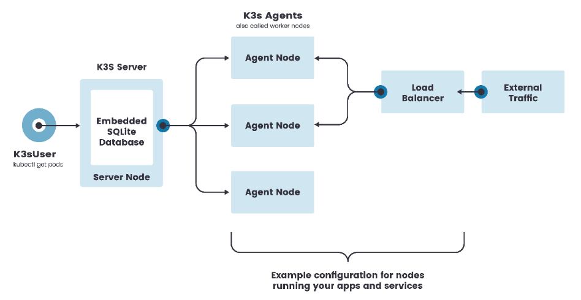
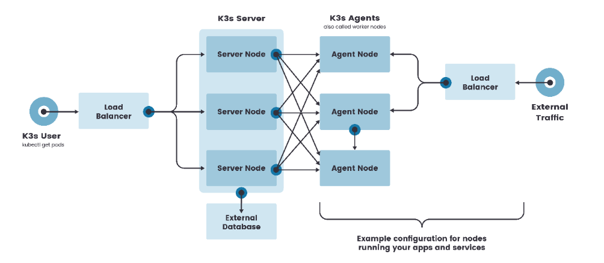

# 1. Kubernetes介绍

## 1.1 应用部署方式演变

在部署应用程序的方式上，主要经历了三个时代：

- **传统部署**：互联网早期，会直接将应用程序部署在物理机上

  > 优点：简单，不需要其它技术的参与
  >
  > 缺点：不能为应用程序定义资源使用边界，很难合理地分配计算资源，而且程序之间容易产生影响

- **虚拟化部署**：可以在一台物理机上运行多个虚拟机，每个虚拟机都是独立的一个环境

  > 优点：程序环境不会相互产生影响，提供了一定程度的安全性
  >
  > 缺点：增加了操作系统，浪费了部分资源

- **容器化部署**：与虚拟化类似，但是共享了操作系统

  > 优点：
  >
  > 可以保证每个容器拥有自己的文件系统、CPU、内存、进程空间等
  >
  > 运行应用程序所需要的资源都被容器包装，并和底层基础架构解耦
  >
  > 容器化的应用程序可以跨云服务商、跨Linux操作系统发行版进行部署


容器化部署方式给带来很多的便利，但是也会出现一些问题，比如说：

- 一个容器故障停机了，怎么样让另外一个容器立刻启动去替补停机的容器
- 当并发访问量变大的时候，怎么样做到横向扩展容器数量

这些容器管理的问题统称为**容器编排**问题，为了解决这些容器编排问题，就产生了一些容器编排的软件：

- **Swarm**：Docker自己的容器编排工具
- **Mesos**：Apache的一个资源统一管控的工具，需要和Marathon结合使用
- **Kubernetes**：Google开源的的容器编排工具


### 1.2 k8s简介

k8s 就是一组服务器集群，它可以在集群的每个节点上运行特定的程序，来对节点中的容器进行管理，目的是实现资源管理的自动化。主要功能如下：

- **弹性伸缩**：根据需要，自动对集群中正在运行的容器数量进行调整
- **服务发现**：服务可以以自动发现的形式找到它所依赖的服务
- **负载均衡：**如果一个服务起了多个容器，能够自动实现需求的负载均衡
- **版本回退：**可以自定义回退到以前的版本
- **存储编排：**可以根据容器自身的需求自动创建存储卷

### 1.3 k8s组件

一个k8s集群由 控**制节点（master）**和**工作节点（node）**组成，每个节点安装不同的组件


**master**: 集群的控制平面，负责集群的决策管理；

- **ApiServer**: 资源操作的**唯一入口**，**接受用户输入的命令**，提供认证、授权、API注册和发现等机制。（控制该集群的唯一入口，开放给开发人员的）
- **Scheduler** : 负责**集群资源调度**，按照预定的调度策略将Pod调度到相应的node节点上（计算谁来干活）
- **ControllerManager：**  负责**维护**集群的状态，比如程序部署安排、故障检测、自动扩展、滚动更新等（发任务安排谁来干活的）
- **Etcd** ：（默认用的etcd，也可以用mysql或其他的）**负责存储集群中各种资源对象的信息**。

**node**：集群的数据平面，负责为容器提供运行环境（真正干活的）

- **Kubelet：**负责**维护容器的声明周期**，即通过控制docker，来创建、更新，销毁容器。（接收控制节点的信息并安排给下面的docker）
- **KubeProxy** : 负责提供集群内部的服务发现和负载均衡。（实际使用服务的用户的入口）
- **Docker** : 负责节点上容器的各种操作


下面，以部署一个nginx服务来说明kubernetes系统各个组件调用关系：

1. 首先要明确，一旦kubernetes环境启动之后，master和node都会将自身的信息存储到etcd数据库中

2. 一个nginx服务的安装请求会首先被发送到master节点的apiServer组件

3. apiServer组件会调用scheduler组件来决定到底应该把这个服务安装到哪个node节点上

   在此时，它会从etcd中读取各个node节点的信息，然后按照一定的算法进行选择，并将结果告知apiServer

4. apiServer调用controller-manager去调度Node节点安装nginx服务

5. kubelet接收到指令后，会通知docker，然后由docker来启动一个nginx的pod

   pod是kubernetes的最小操作单元，容器必须跑在pod中至此，

6. 一个nginx服务就运行了，如果需要访问nginx，就需要通过kube-proxy来对pod产生访问的代理

这样，外界用户就可以访问集群中的nginx服务了。

## 1.4 kubernetes概念

**Master**：集群控制节点，每个集群需要至少一个master节点负责集群的管控

**Node**：工作负载节点，由master分配容器到这些node工作节点上，然后node节点上的docker负责容器的运行

**Pod**：**kubernetes的最小控制单元**，容器都是运行在pod中的，一个pod中可以有1个或者多个容器。（我们部署的程序要跑在容器里面，而容器需要跑在Pod里面）

如果容器紧耦合并且需要共享磁盘等资源，则应将其编排在一个Pod中。


**Controller**：控制器，通过它来实现对pod的管理，比如启动pod、停止pod、伸缩pod的数量等等

**Service**：pod对外服务的统一入口，下面可以维护者同一类的多个pod

**Label**：标签，用于对pod进行分类，同一类pod会拥有相同的标签（控制器根据标签选择pod）

**NameSpace**：命名空间，用来隔离pod的运行环境（设置不同的命名空间可以使不同的pod相互访问或相互隔离）（**逻辑上的运行环境的分组**）

# 2. kubernetes集群环境搭建

k8s集群可以规划为：**一主多从**和**多主多从**。


本次搭建一主多从集群。

## 2.1 前置知识点

目前生产部署Kubernetes 集群主要有两种方式：

**kubeadm**

Kubeadm 是一个K8s 部署工具，提供kubeadm init 和kubeadm join，用于快速部署Kubernetes 集群。

官方地址：https://kubernetes.io/docs/reference/setup-tools/kubeadm/kubeadm/

**二进制包**

从github 下载发行版的二进制包，手动部署每个组件，组成Kubernetes 集群。

Kubeadm 降低部署门槛，但屏蔽了很多细节，遇到问题很难排查。如果想更容易可控，推荐使用二进制包部署Kubernetes 集群，虽然手动部署麻烦点，期间可以学习很多工作原理，也利于后期维护。

## 2.2 kubeadm 部署方式介绍

kubeadm 是官方社区推出的一个用于快速部署kubernetes 集群的工具，这个工具能通过两条指令完成一个kubernetes 集群的部署：

- 创建一个Master 节点`kubeadm init`
- 将Node 节点加入到当前集群中`$ kubeadm join <Master 节点的IP 和端口>`

## 2.3 安装要求

在开始之前，部署Kubernetes 集群机器需要满足以下几个条件：

- 一台或多台机器，操作系统ubuntu
- 硬件配置：2GB 或更多RAM，2 个CPU 或更多CPU，硬盘30GB 或更多
- 集群中所有机器之间网络互通
- 可以访问外网，需要拉取镜像
- 禁止swap 分区

## 2.4 最终目标

- 在所有节点上安装Docker 和kubeadm
- 部署Kubernetes Master
- 部署容器网络插件
- 部署Kubernetes Node，将节点加入Kubernetes 集群中
- 部署Dashboard Web 页面，可视化查看Kubernetes 资源

## 2.5 准备环境

 


| 角色         | IP地址      | 组件                              |
| :----------- | :---------- | :-------------------------------- |
| k8s-master01 | 192.168.5.3 | docker，kubectl，kubeadm，kubelet |
| k8s-node01   | 192.168.5.4 | docker，kubectl，kubeadm，kubelet |
| k8s-node02   | 192.168.5.5 | docker，kubectl，kubeadm，kubelet |

## 


# K3S

## 1.相关概念

https://docs.k3s.io/zh

[K3s - 轻量级 Kubernetes | Rancher文档](https://docs.rancher.cn/docs/k3s/_index)

#### 什么是k3s

K3s是[Rancher](https://so.csdn.net/so/search?q=Rancher&spm=1001.2101.3001.7020)实验室的一个轻量级Kubernetes发行版，是由CNCF完全认证的Kubernetes产品。在K3s中，我们看到内存占用或集群组件的二进制文件很小。这意味着**K3s的体积很小**。

由于K3s的二进制文件很小，所以它是非常轻量级的，这使得安装过程更快。此外，用这种轻量级的Kubernetes部署应用程序也更快。K3s有一个基础二进制包，其大小不到100MB。由于它如此之小，我们甚至可以在Raspberry Pi（价格低廉的小型计算机硬件）中运行一个K3s集群。

#### 什么是Kubernetes

[Kubernetes](https://kubernetes.io/zh-cn/docs/concepts/overview/) 也称为 K8s，是用于**自动部署、扩缩和管理容器化应用程序**的开源编排系统，它是和语言无关的。它具有**可移植性、灵活性、可扩展性、多云能力、开放源代码**等特点，同时支持命令式/声明式配置和自动化。Kubernetes是为适应大规模配置（多达5000个节点）和帮助在生产环境中部署应用程序而设计的。

#### k3s的优势

- ***小型***：k3s的**最大优势就它的尺寸很小**（小于100M），这有助于它以最少的设置在**小型硬件**中启动 **kubernetes** 集群。
- ***快速部署***：您可以通过一条命令在30秒内安装和部署k3s
- ***轻量***：K3s 由于内存占用小，非常轻量，这有助于 Kubernetes 快速启动和运行。这意味着包含运行集群所需的所有非容器化组件的二进制文件更小。
- ***持续集成***：由于其轻量级的环境和小尺寸，有助于持续集成。它有助于将来自多个贡献者的代码自动集成到单个项目中。
- ***物联网和边缘计算的完美选择***：由于支持 ARM64 和 ARMv7，K3s 对于要**在资源受限的物联网设备上**分发Kubernetes 非常有效。

#### k3s特点

- 安装简单，占用资源少，只需要512M内存就可以运行起来；
- apiserver 、schedule 等组件全部简化，并以进程的形式运行在节点上，把程序都打包为单个二进制文件，每个程序只需要占用100M内存；
- 使用基于`sqlite3`的轻量级存储后端作为默认存储机制。同时支持使用etcd3、MySQL 和PostgreSQL作为存储机制；
- 默认使用 `local-path-provisioner` 提供本地存储卷；
- 默认安装了`Helm controller` 和 `Traefik Ingress controller`；
- 所有 Kubernetes control-plane 组件的操作都封装在单个二进制文件和进程中，使 K3s 具有自动化和管理包括证书分发在内的复杂集群操作的能力。
- 减少外部依赖，操作系统只需要安装较新的内核（centos7.6就可以，不需要升级内核）以及支持cgroup即可，k3s安装包已经包含了containerd、Flannel、CoreDNS，非常方便地一键式安装，不需要额外安装Docker、Flannel等组件。

#### K8s和K3s的区别

Kubernetes所擅长的，是按照用户的意愿和整个系统的规则，完全自动化地处理好容器之间的各种关系。这种功能，就是我们经常听到的一个概念：编排。

K3s在功能上与K8s没有什么不同，但它们有一些区别，使它们显得独特。

- K3s能比K8s更快地部署应用程序。不仅如此，K3s可以比K8s更快地启动集群。K8s是一个通用的容器编排器，而K3s是一个专门为在裸金属服务器上运行Kubernetes而打造的容器编排器。
- Kubernetes使用kubelet，这是一个在每个Kubernetes节点上运行的代理，对该节点上运行的容器进行循环控制。这个代理程序在容器内运行。而K3s并不使用kubelet，它在主机上运行kubelet，使用主机的调度机制来运行容器。
- 同样，我们可以看到，K3S由于体积小，所以是轻量级的，这有助于它在RaspberryPi等资源有限的物联网设备中运行集群。相比之下，我们可以看到，普通的Kubernetes或K8s在物联网或边缘计算设备中是不可行的。另外，K3s同时支持ARM64和ARMv7的二进制文件结构。
- Kubernetes或K8s可以托管运行于多个环境中的工作负载，而K3s只能托管在单一云中运行的工作负载。这主要是因为K3s不包含在多个云上维护复杂的工作负载的能力，因为它的规模很小。
- 同时，我们可以看到 Kubernetes 借助其大规模的能力，在托管工作负载和多云环境中运行集群具有优势。K3s是一个独立的服务器，与K8s不同，它是Kubernetes集群的一部分。K8s依靠CRI-O来整合Kubernetes与CRI（容器运行时接口），而K3s使用CRI-O与所有支持的容器运行时兼容。K8s使用kubelet来调度容器，但K3s使用主机的调度机制来调度容器。
- K3s使用kube-proxy来代理Kubernetes节点的网络连接，但K8s使用kube-proxy来代理单个容器的网络连接。它还使用kube-proxy来设置IP伪装，而K3s不使用kube-proxy来做这个。
- 同样，K8s使用kubelet来监视Kubernetes节点的配置变化，而K3s不监视Kubernetes节点的配置变化。相反，它从Kubernetes控制平面接收包含配置信息的部署清单，并做出相应的改变。
- 当涉及到大规模数据环境的编排（自动化任务的编排和协调）时，Kubernetes非常有优势，因为它有存储大量数据的数据库和编排大量对象的能力。同时，k3s对小规模数据的情况也是比较有用的。存储在一个小于100MB的二进制文件中，这将有助于快速启动集群，更快地调度pod和其他任务。
- k3s有比k8s更严格的安全部署，因为其攻击面小。k3s的另一个优势是，它可以减少安装、运行或更新Kubernetes集群所需的依赖性和步骤。

#### 专有名词解释

- **Cluster** 集群： K8s可利用的主机、存储和网络资源的集合。
- **Node** 结点： **单台主机**，可以是物理的或虚拟的计算机。结点分为主结点(master)和工作结点(worker)。
- **Pod** K8s中的最小控制单元，工作单元：K8s是以Pod而非容器为单位排程的。Pod可以理解为Docker单机环境，每个Pod中包含一至多个容器，总是被启动在一个结点；一个Pod的容器在K8s集群中有相同的地址和端口范围，即容器暴露于K8s集群的端口号不可重复。
- **containerd**：k3s默认使用 containerd 作为容器运行时（其实containerd只是从Docker中分离出来的底层容器运行时）, 在 goroutine 中以 子进程 方式 启动 containerd。
- **kubelet** ：kubelet 是在每个节点上运行的主要 “节点代理”。
- **kubectl**：Kubernetes 提供 [kubectl]([命令行工具 (kubectl) | Kubernetes](https://kubernetes.io/zh-cn/docs/reference/kubectl/)) 是使用 Kubernetes API 与 Kubernetes 集群的[控制面](https://kubernetes.io/zh-cn/docs/reference/glossary/?all=true#term-control-plane)进行通信的**命令行工具**。k3s 中使用 `k3s kubectl`
- **Flannel**: Flannel是一种基于overlay网络的跨主机容器网络解决方案，Flannel是CoreOS开发,专门用于docker多机互联的一个工具,让集群中的不同节点主机创建的容器都具有全集群唯一的虚拟ip地址。
- **etcd** 一款开源软件，提供可靠的分布式数据存储服务，用于持久化存储K8s集群的配置和状态。
- **Tunnel-Proxy**：当服务端和客户端都启动之后，通过 `Tunnel-Proxy` 这个组件进行通信，通过这个通道去管理网络流量。
- **K8s API server** 用户程序（如**kubectl**）、K8s其它组件之间通信的接口。K8s其它组件之间不直接通信，而是通过API server通信的。这一点在上图的连接中可以体现，例如，只有API server连接了etcd，即其它组件更新K8s集群的状态时，只能通过API server读写etcd中的数据。Scheduler 排程组件，为用户应用的每一可部署组件分配工作结点。

#### 云原生（Cloud Native）

2015年云原生计算基金会（CNCF）成立，最初把云原生定义为包括：**容器化封装+自动化管理+面向微服务**；到了2018年，CNCF又更新了云原生的定义，把服务网格(Service Mesh)和声明式API给加了进来。

**总而言之，符合云原生架构的应用程序应该是：采用开源堆栈（K8S+Docker）进行容器化，基于微服务架构提高灵活性和可维护性，借助敏捷方法、DevOps支持持续迭代和运维自动化，利用云平台设施实现弹性伸缩、动态调度、优化资源利用率。**

## 2.架构

#### 单节点的k3s架构



1）k3s server节点是运行k3s server命令的机器（裸机或者虚拟机），而k3s Agent 节点是运行k3s agent命令的机器。

2）单点架构只有一个控制节点（在 K3s 里叫做server node，相当于 K8s 的 master node），而且K3s的数据存储使用 sqlite 并内置在了控制节点上。

3）在这种配置中，每个 agent 节点都注册到同一个 server 节点。K3s 用户可以通过调用server节点上的K3s API来操作Kubernetes资源。

#### 高可用的K3S架构



虽然单节点 k3s 集群可以满足各种用例，但对于 Kubernetes control-plane 的正常运行至关重要的环境，可以在高可用配置中运行 K3s。一个高可用 K3s 集群由以下几个部分组成：

1）**K3s Server 节点**：两个或者更多的server节点将为 Kubernetes API 提供服务并运行其他 control-plane 服务

2）**外部数据库**：外部数据存储（与单节点 k3s 设置中使用的嵌入式 SQLite 数据存储相反）

## 3.快速入门


[安装介绍 | Rancher文档](https://docs.rancher.cn/docs/k3s/installation/_index)

#### 安装脚本

K3s 提供了一个安装脚本，可以方便地将其作为服务安装在基于 systemd 或 openrc 的系统上。该脚本可在 [https://get.k3s.io](https://get.k3s.io/) 获得。要使用这种方法安装 K3s，只需运行：

```bash
curl -sfL https://get.k3s.io | sh -
```

备注

中国用户，可以使用以下方法加速安装：

```text
curl -sfL https://rancher-mirror.rancher.cn/k3s/k3s-install.sh | INSTALL_K3S_MIRROR=cn sh -
```

运行此安装后：

- K3s 服务将被配置为在节点重启后或进程崩溃或被杀死时自动重启。
- 将安装其他实用程序，包括 `kubectl`、`crictl`、`ctr`、`k3s-killall.sh` 和 `k3s-uninstall.sh`。
- [kubeconfig](https://kubernetes.io/docs/concepts/configuration/organize-cluster-access-kubeconfig/) 文件将写入到 `/etc/rancher/k3s/k3s.yaml`，由 K3s 安装的 kubectl 将自动使用该文件。

单节点 Server 安装是一个功能齐全的 Kubernetes 集群，它包括了托管工作负载 pod 所需的所有数据存储、control plane、kubelet 和容器运行时组件。除非你希望向集群添加容量或冗余，否则没有必要添加额外的 Server 或 Agent 节点。

当然可以使用k3s agent添加更多的worker node，只需要添加`K3S_URL`和`K3S_TOKEN`参数即可，其中`K3S_URL`为api-server URL，而`k3S_TOKEN`为node注册token，保存在master节点的`/var/lib/rancher/k3s/server/node-token`路径。

在 k3s 集群中，与 kubelet 一起运行控制平面组件的节点称为服务器，而仅运行 kubelet 的节点称为代理。

K3s server 需要 6443 端口才能被所有节点访问。

K3s agent 选项是可以作为 server 选项的，因为 server 内部嵌入了 agent 进程。

**检查是否安装成功**：

``` bash
ubt@ubt-vm:~$ sudo su
[sudo] password for ubt: 
root@ubt-vm:/home/ubt# kubectl get nodes  # 或 k3s kubectl get node
NAME     STATUS   ROLES                  AGE   VERSION
ubt-vm   Ready    control-plane,master   32m   v1.27.3+k3s1
# 可以发现K3S创建了一个单节点的简单集群。
root@ubt-vm:/home/ubt# kubectl get pods -n kube-system
NAME                                     READY   STATUS      RESTARTS   AGE
coredns-77ccd57875-kd8wk                 1/1     Running     0          33m
local-path-provisioner-957fdf8bc-6ldzj   1/1     Running     0          33m
metrics-server-648b5df564-sn9xj          1/1     Running     0          33m
helm-install-traefik-crd-cbd6t           0/1     Completed   0          33m
helm-install-traefik-flr8w               0/1     Completed   1          33m
svclb-traefik-ed839255-j5tfs             2/2     Running     0          32m
traefik-64f55bb67d-dmf9v                 1/1     Running     0          32m
root@ubt-vm:/home/ubt# kubectl get svc
NAME         TYPE        CLUSTER-IP   EXTERNAL-IP   PORT(S)   AGE
kubernetes   ClusterIP   10.43.0.1    <none>        443/TCP   36m
```

**开启k3s**

`sudo k3s server`  （安装k3s后默认就把k3s开启了）。该命令将在后台启动K3s服务器，并将API服务器、etcd数据库和调度程序等Kubernetes核心组件启动起来。

**卸载k3s**

要从 Server 节点卸载 K3s，请运行：

```bash
/usr/local/bin/k3s-uninstall.sh
```

要从 Agent 节点卸载 K3s，请运行：

```bash
/usr/local/bin/k3s-agent-uninstall.sh
```

**加入其他节点**

如果您需要在多个主机上部署K3s，请在其他主机上运行以下命令：

```bash
curl -sfL https://get.k3s.io | K3S_URL=https://<k3s-server-ip>:6443 K3S_TOKEN=<token> sh -
```

其中`<k3s-server-ip>`是K3s服务器的IP地址，`<token>`是由K3s服务器生成的唯一令牌。您可以使用以下命令在K3s服务器上获取此令牌：

```bash
sudo cat /var/lib/rancher/k3s/server/node-token
```

此命令将输出一个唯一的令牌，您可以将其复制并在其他主机上使用。

**部署应用程序1**

一旦您的K3s集群已经启动，并且所有节点都已加入，请尝试部署一些应用程序。您可以使用Kubernetes YAML文件部署应用程序，例如：

```yaml
apiVersion: v1
kind: Pod
metadata:
  name: nginx-pod1	# pod的name
spec:
  containers:
  - name: nginx		# 容器的name
    image: nginx:latest
    ports:
    - containerPort: 80
```

将此YAML文件保存为`nginx-pod1.yaml`，然后使用以下命令将其部署到K3s集群中：

```bash
sudo k3s kubectl apply -f nginx-pod1.yaml
```

该命令将在K3s集群中创建一个名为`nginx-pod1`的Pod，并将其中运行的nginx容器公开到80端口。使用命令可以看到创建成功。

``` bash
root@ubt-vm:/home/ubt# sudo k3s kubectl apply -f nginx-pod1.yaml
pod/nginx-pod1 created
root@ubt-vm:/home/ubt# k3s kubectl get pod
NAME         READY   STATUS              RESTARTS   AGE
nginx-pod1   0/1     ContainerCreating   0          16s
# 不久后发现它因不明原因失败了
root@ubt-vm:/home/ubt# kubectl get pods
NAME                              READY   STATUS              RESTARTS   AGE
nginx-pod1                        0/1     ImagePullBackOff    0          28m
```

**部署应用程序2**（建议使用上面的方法）

[据说只有高端机器才配运行K8S，网友：1G内存的渣渣跑起来了！ (qq.com)](https://mp.weixin.qq.com/s/iDG7Wzq9DQHLFPtnqokOxQ)

指定好应用镜像并创建一个Deployment，这里创建一个Nginx应用（需要修改containerd的拉取镜像）；

```bash
kubectl create deployment nginx-deployment --image=nginx:latest
```

- 查看所有Deployment；

```bash
kubectl get deployments
NAME               READY   UP-TO-DATE   AVAILABLE   AGE
nginx-deployment   1/1     1            1           6s
```


#### K3s 配置目录及文件路径说明

```bash
# k3s 相关配置
$ tree /etc/rancher
/etc/rancher
├── k3s
│   └── k3s.yaml  # kubeconfig
│   └── registries.yaml  # 自己新建的文件，用来修改containerd的镜像源
└── node
    └── password  # 随机生成的节点密码向 k3s server 注册
```

```bash
# k3s 节点数据信息
$ ls /var/lib/rancher/k3s/
agent  data  server
```

```bash
# kubelet 服务运行配置相关信息
$ ls /var/lib/kubelet
cpu_manager_state  device-plugins  memory_manager_state  plugins  plugins_registry  pod-resources  pods
```


## kubectl

- 查看所有pod的简单信息

``` bash
$ root@ubt-vm:/home/ubt# kubectl get pod
NAME                                READY   STATUS             RESTARTS      AGE
nginx-pod1                          1/1     Running            0             16h
nginx-deployment-6c878976f6-p4gz5   1/1     Running            0             24m
nginx-pod2                          1/2     CrashLoopBackOff   3 (19s ago)   3m11s

NAME: pod的名称	
READY: n/m，n表示该pod中运行的容器数；m表示pod中总共的容器数
STATUS: 该pod的状态
RESTARTS: 该pod的重启次数
AGE: 该pod距离创建的时间
```

- 查看Pod的详细状态，包括IP地址、占用端口、使用镜像等信息；

```bash
kubectl describe pods	# 查看所有pods
kubectl describe pods [pod name]	# 查看[pod name]的信息
```

## containerd 

containerd是一个工业级标准的**容器运行时**，它强调简单性、健壮性和可移植性。**containerd可以在宿主机中管理完整的容器生命周期，包括容器镜像的传输和存储、容器的执行和管理、存储和网络等**。其实containerd只是从Docker中分离出来的底层容器运行时，使用起来和Docker并没有啥区别。

#### 配置镜像仓库

[k3s设置国内加速源_许许盛的博客-CSDN博客](https://blog.csdn.net/xs20691718/article/details/106515605)

K3s默认使用 `containerd` 作为容器运行时，所以在 docker 上配置镜像仓库是不生效的[ 除非将容器运行时环境设置为Docker，下面以`containerd`作为容器运行时环境。

K3s registry 配置目录为：`/etc/rancher/k3s/registries.yaml`。K3s 启动时，K3s 会检查 `/etc/rancher/k3s/ `中是否存在 `registries.yaml `文件，并指示` containerd `使用文件中定义的镜像仓库。如果你想使用一个私有的镜像仓库，那么你需要在每个使用镜像仓库的节点上以 root 身份创建这个文件。

**配置方法**：使用`vim /etc/rancher/k3s/registries.yaml ` 打开文件，使用`ctrl+shift+insert` 粘贴下面这些配置到文件中

``` yaml
mirrors:
  docker.io:
    endpoint:
      - "https://registry.docker-cn.com"
      - "http://hub-mirror.c.163.com"
      - "https://docker.mirrors.ustc.edu.cn"
      
# 下面这些应该也可以
      - "https://fogjl973.mirror.aliyuncs.com"
      - "https://registry-1.docker.io"
```

然后执行 `systemctl restart k3s` 命令重启k3s服务。

此时执行命令查看是否成功。

``` bash
root@ubt-vm:/home/ubt# crictl info|grep  -A 15 registry 
    "registry": {
      "configPath": "",
      "mirrors": {
        "docker.example.com": {
          "endpoint": [
            "https://docker.example.com"
          ],
          "rewrite": null
        },
        "docker.io": {
          "endpoint": [
            "https://7bezldxe.mirror.aliyuncs.com/"
          ],
          "rewrite": null
        }
      },
```

可以看到与我们写入的一致。


> 另一个方法
>
> ######### 测试发现这个方法会在重启k3s时失败
>
> 1. 通过 `crictl info` 命令可以查看 `containerd` 当前的配置信息
>
> ``` bash
> root@ubt-vm:/etc/rancher/k3s# sudo crictl info |grep registry
>     "registry": {
> ```
>
> 2. k3s 会在目录 ` /var/lib/rancher/k3s/agent/etc/containerd` 下创建一个 `config.toml` 文件作为 `containerd` 的配置文件，我们要做的就是，在同目录下把这个文件复制出来一个` config.toml.tmpl `文件，然后添加镜像源相关的配置进去。
>
> ``` bash
> [plugins.cri.registry.mirrors]
>   [plugins.cri.registry.mirrors."docker.io"]
>     endpoint = ["https://docker.mirrors.ustc.edu.cn"]
> ```
>
> 3. 执行 `systemctl restart k3s` 命令重启k3s服务。


#### 相关命令

由于K3S中默认使用containerd作为容器运行时，我们只要安装好K3S就可以使用它了；

其实只要把我们之前使用的`docker`命令改为`crictl`命令即可操作containerd，

- 查看 `containerd` 当前的配置信息：`crictl info`

``` bash
$ crictl info | grep -A 15 registry   # 查看containerd 的镜像配置
    "registry": {
      "configPath": "",
      "mirrors": {
        "docker.io": {
          "endpoint": [
            "https://registry.docker-cn.com",
            "http://hub-mirror.c.163.com",
            "https://docker.mirrors.ustc.edu.cn"
          ],
          "rewrite": null
        }
      },
      "configs": null,
      "auths": null,
      "headers": null
    },
    "imageDecryption": {
      "keyModel": "node"
    },
    "disableTCPService": true,
    "streamServerAddress": "127.0.0.1",
```


- 比如查看所有运行中的容器；

``` bash
$ crictl ps
CONTAINER           IMAGE               CREATED                  STATE               NAME                ATTEMPT             POD ID
4ca73ded41bb6       3b0b04aa3473f       Less than a second ago   Running             helm                20                  21103f0058872
3bb5767a81954       296a6d5035e2d       About a minute ago       Running             coredns             1                   af887263bd869
a5e34c24be371       0346349a1a640       About a minute ago       Running             nginx               1                   89defc6008501

```

- 查看所有镜像：`crictl images`
- 进入容器内部执行bash命令，这里需要注意的是只能使用容器ID，不支持使用容器名称：`crictl exec -it [containerID] /bin/bash`
- 查看容器中应用资源占用情况，可以发现占用非常低。 `crictl stats`
- `crictl ps` 查看运行中的容器

