# 1. Kubernetes介绍

## 1.1 应用部署方式演变

在部署应用程序的方式上，主要经历了三个时代：

- **传统部署**：互联网早期，会直接将应用程序部署在物理机上

  > 优点：简单，不需要其它技术的参与
  >
  > 缺点：不能为应用程序定义资源使用边界，很难合理地分配计算资源，而且程序之间容易产生影响

- **虚拟化部署**：可以在一台物理机上运行多个虚拟机，每个虚拟机都是独立的一个环境

  > 优点：程序环境不会相互产生影响，提供了一定程度的安全性
  >
  > 缺点：增加了操作系统，浪费了部分资源

- **容器化部署**：与虚拟化类似，但是共享了操作系统

  > 优点：
  >
  > 可以保证每个容器拥有自己的文件系统、CPU、内存、进程空间等
  >
  > 运行应用程序所需要的资源都被容器包装，并和底层基础架构解耦
  >
  > 容器化的应用程序可以跨云服务商、跨Linux操作系统发行版进行部署
  >
  > 容器被设计为每个容器只运行一个进程（除非进程本身产生子进程）


容器化部署方式给带来很多的便利，但是也会出现一些问题，比如说：

- 一个容器故障停机了，怎么样让另外一个容器立刻启动去替补停机的容器
- 当并发访问量变大的时候，怎么样做到横向扩展容器数量

这些容器管理的问题统称为**容器编排**问题，为了解决这些容器编排问题，就产生了一些容器编排的软件：

- **Swarm**：Docker自己的容器编排工具
- **Mesos**：Apache的一个资源统一管控的工具，需要和Marathon结合使用
- **Kubernetes**：Google开源的的容器编排工具


**优点**：将一个应用程序解耦成多个组件，不同组件单独开发，单独迭代。组件之间通过定义良好的接口进行通信。

**缺点**：故障定位、代码调试困难，多个组件可能依赖不同版本的库，对共享库的管理提出较高要求。

## 1.2 k8s简介

k8s 就是一组服务器集群，它可以在集群的每个节点上运行特定的程序，来对节点中的容器进行管理，目的是实现资源管理的自动化。将实际硬件设备做抽象，然后将自身暴露成一个平台，用于部署和运行应用程序。

主要功能如下：

- **弹性伸缩**：根据需要，自动对集群中正在运行的容器数量进行调整
- **服务发现**：服务可以以自动发现的形式找到它所依赖的服务
- **负载均衡：**如果一个服务起了多个容器，能够自动实现需求的负载均衡
- **版本回退：**可以自定义回退到以前的版本
- **存储编排：**可以根据容器自身的需求自动创建存储卷

## 1.3 k8s组件

一个k8s集群由 控**制节点（master）**和**工作节点（node）**组成，每个节点安装不同的组件

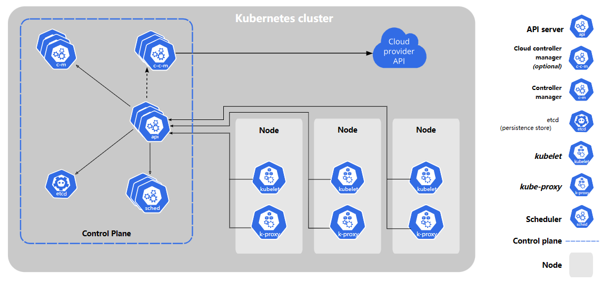

**master**: 集群的控制平面，负责集群的决策管理，下面几个组件在集群的所有master 节点中都以 pod 形式存在；

- **ApiServer**: 资源操作的**唯一入口**，**接受用户输入的命令**，提供认证、授权、API注册和发现等机制。（控制该集群的唯一入口，开放给开发人员的）
- **Scheduler** : 负责**集群资源调度**，按照预定的调度策略将Pod调度到相应的node节点上（计算谁来干活）
- **ControllerManager：**  负责**维护**集群的状态，比如程序部署安排、故障检测、自动扩展、滚动更新等（发任务安排谁来干活的）
- **Etcd** ：（默认用的etcd，也可以用mysql或其他的）**负责存储集群中各种资源对象的信息**。

**node**：集群的数据平面，负责为容器提供运行环境（真正干活的）

- **Kubelet：**负责**维护容器的声明周期**，即通过控制docker，来创建、更新，销毁容器。（接收控制节点的信息并安排给下面的docker）
- **KubeProxy** : 负责提供集群内部的服务发现和负载均衡。（实际使用服务的用户的入口）
- **Docker** : 负责节点上容器的各种操作，k8s的所有节点（包括master和worker）上都有docker或其他容器运行时引擎（负责拉取镜像并运行）。通常情况下，k8s节点会从公共或私有的镜像仓库拉取镜像。某些特殊环境（离线）下，可以在每个节点都部署本地镜像仓库。

另外：

- **kubectl**：Kubernetes 提供 [kubectl]([命令行工具 (kubectl) | Kubernetes](https://kubernetes.io/zh-cn/docs/reference/kubectl/)) 是使用 Kubernetes API 与 Kubernetes 集群的[控制面](https://kubernetes.io/zh-cn/docs/reference/glossary/?all=true#term-control-plane)进行通信的**命令行工具**。

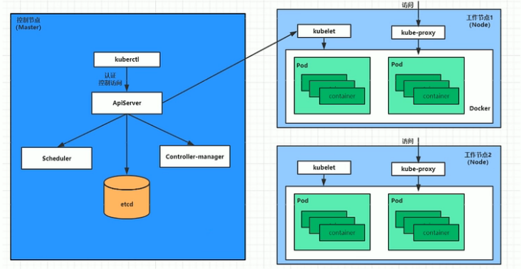

下面，以部署一个nginx服务来说明kubernetes系统各个组件调用关系：

1. 首先要明确，一旦kubernetes环境启动之后，master和node都会将自身的信息存储到etcd数据库中

2. 一个nginx服务的安装请求会首先被发送到master节点的apiServer组件

3. apiServer组件会调用scheduler组件来决定到底应该把这个服务安装到哪个node节点上

   在此时，它会从etcd中读取各个node节点的信息，然后按照一定的算法进行选择，并将结果告知apiServer

4. apiServer调用controller-manager去调度Node节点安装nginx服务

5. kubelet接收到指令后，会通知docker，然后由docker来启动一个nginx的pod

   pod是kubernetes的最小操作单元，容器必须跑在pod中至此，

6. 一个nginx服务就运行了，如果需要访问nginx，就需要通过kube-proxy来对pod产生访问的代理

这样，外界用户就可以访问集群中的nginx服务了。

## 1.4 kubernetes概念

**Master**：集群控制节点，每个集群需要至少一个master节点负责集群的管控

**Node**：工作负载节点，由master分配容器到这些node工作节点上，然后node节点上的docker负责容器的运行，一个worker node中有多个Pod。一个worker node 可能会属于多个namespace。

**Pod**：**kubernetes的最小控制单元，一个 pod 是一组紧密相关的容器，它们总是一起运行在同一个工作节点上，以及同一个 Linux 命名空间中。**（我们部署的程序要跑在容器里面，而容器需要跑在Pod里面，同一个pod中的多个容器一般会协同工作）。一个 pod 中的所有容器都运行在同一个逻辑机器上。

> 一般倾向于在pod中单独运行一个容器，pod应该包含的是密切耦合的容器组（通常是一个主容器和支持主容器的其他容器）
>
> 如果容器紧耦合并且需要共享磁盘等资源，则应将其编排在一个Pod中。
>
> 应该如何分组到pod中：当决定是将两个容器放入一个pod还是两个单独的pod时，我们需要问自己以下问题：
>
> 1. 它们需要一起运行还是可以在不同的主机上运行？
>
> 2. 它们代表的是一个整体还是相互独立的组件？
>
> 3. 它们必须一起进行扩缩容还是可以分别进行？
>
> 总之，容器不应该包含多个进程，pod也不应该包含多个并不需要运行在同一主机上的容器


**Controller**：控制器，通过它来实现对pod的管理，比如启动pod、停止pod、伸缩pod的数量等等

**Service**：pod对外服务的统一入口，下面可以维护者同一类的多个pod。服务表示 一组 或多组提供相同服务的 pod 的静态地址。pod被创建出来的时候具有不定的IP地址，为了对外提供统一的服务接口，需要service。

**Label**：标签，用于对pod（或其他k8s资源）进行分类，同一类pod会拥有相同的标签（控制器根据标签选择pod）

**NameSpace**：命名空间，用来隔离pod的运行环境（设置不同的命名空间可以使不同的pod相互访问或相互隔离）（**逻辑上的运行环境的分组**），Namespaces 用来对资源进行逻辑上的分隔，而不是物理上的分隔。Namespaces 主要用于在同一个 Kubernetes 集群中进行资源隔离和管理，它们并不限制 Pod 运行在哪台物理机或节点上。换句话说，**不同物理机上的 Pod 可以属于同一个 Namespace**。Namespace 主要作用于 Kubernetes 的 API 上，帮助分隔不同用户、团队或项目的资源和权限，而不管这些资源实际上部署在哪些物理节点上。**namespace的主要功能是逻辑隔离，资源分类，权限控制，资源配额管理。**每个namespace都有多个不同类型的东西。如pod，service，deployment等。

**Job：**用于一次性执行任务的资源对象。 主要用于执行一次性或短暂任务，例如批处理作业、数据处理作业、定时任务等。**Job 保证其所管理的 Pod 至少会运行一次，直到任务成功完成。**如果任务失败，Job 会重启 Pod，直到任务成功为止。


# 2. kubernetes集群环境搭建

k8s集群可以规划为：**一主多从**和**多主多从**。


本次搭建一主多从集群。

## 2.1 前置知识点

目前生产部署Kubernetes 集群主要有两种方式：

**kubeadm**

Kubeadm 是一个K8s 部署工具，提供kubeadm init 和kubeadm join，用于快速部署Kubernetes 集群。

官方地址：https://kubernetes.io/docs/reference/setup-tools/kubeadm/kubeadm/

**二进制包**

从github 下载发行版的二进制包，手动部署每个组件，组成Kubernetes 集群。

Kubeadm 降低部署门槛，但屏蔽了很多细节，遇到问题很难排查。如果想更容易可控，推荐使用二进制包部署Kubernetes 集群，虽然手动部署麻烦点，期间可以学习很多工作原理，也利于后期维护。

## 2.2 kubeadm 部署方式介绍

kubeadm 是官方社区推出的一个用于快速部署kubernetes 集群的工具，这个工具能通过两条指令完成一个kubernetes 集群的部署：

- 创建一个Master 节点`kubeadm init`
- 将Node 节点加入到当前集群中`$ kubeadm join <Master 节点的IP 和端口>`

## 2.3 安装要求

在开始之前，部署Kubernetes 集群机器需要满足以下几个条件：

- 一台或多台机器，操作系统ubuntu
- 硬件配置：2GB 或更多RAM，2 个CPU 或更多CPU，硬盘30GB 或更多
- 集群中所有机器之间网络互通
- 可以访问外网，需要拉取镜像
- 禁止swap 分区

## 2.4 最终目标

- 在所有节点上安装Docker 和kubeadm
- 部署Kubernetes Master
- 部署容器网络插件
- 部署Kubernetes Node，将节点加入Kubernetes 集群中
- 部署Dashboard Web 页面，可视化查看Kubernetes 资源

## 2.5 minikube

为方便学习，我们使用minikube进行单机ubuntu 部署k8s。

主要教程：

[Ubuntu20部署K8S单机版-CSDN博客](https://blog.csdn.net/Xin_101/article/details/122732950) （minikube启动时一定要使用方式3）

> ``` shell
> minikube start --registry-mirror=https://registry.docker-cn.com,https://shraym0v.mirror.aliyuncs.com --embed-certs=true --image-mirror-country=cn --base-image=gcr.io/k8s-minikube/kicbase:v0.0.44  --image-repository=registry.cn-hangzhou.aliyuncs.com/google_containers
> ```

https://vitalflux.com/install-kubernetes-ubuntu-vm

想要使用minikube里面的东西比如其中的docker，需要先登录进入 minikube 虚拟机，使用`minikube ssh`登录。

## 2.6 k8s集群配置信息

`~/.kube/config` 是 Kubernetes 集群的配置文件，用于存储与集群连接相关的信息，包括集群的地址、认证信息、上下文等。

当使用 `kubectl` 工具与 Kubernetes 集群进行交互时，`kubectl` 会读取这个配置文件来确定要连接的集群、使用的身份验证方式和当前上下文。

通常，`~/.kube/config` 文件的内容结构如下所示：

```yaml
apiVersion: v1
clusters:
- cluster:
    server: https://kubernetes-cluster-address
    certificate-authority-data: base64-encoded-certificate-authority
  name: cluster-name
contexts:
- context:
    cluster: cluster-name
    user: user-name
  name: context-name
current-context: context-name
kind: Config
preferences: {}
users:
- name: user-name
  user:
    client-certificate-data: base64-encoded-client-certificate
    client-key-data: base64-encoded-client-key
```

在这个文件中，您可以找到以下信息：

- `clusters` 部分包含了集群的连接信息，如服务器地址和 CA 证书。
- `contexts` 部分定义了上下文，包括了所使用的集群和用户。
- `users` 部分包含了身份验证信息，如客户端证书和密钥。

如果需要连接到不同的 Kubernetes 集群或使用不同的身份验证方式，可以在 `~/.kube/config` 文件中配置多个集群、上下文和用户，并使用 `kubectl config use-context` 命令来切换当前上下文。这样，您可以方便地在不同的环境中进行操作。

# 3. kubectl 命令

[命令行工具 (kubectl) | Kubernetes](https://kubernetes.io/zh-cn/docs/reference/kubectl/)

kubectl使用以下语法，在终端运行命令：

``` shell
kubectl [command] [TYPE] [NAME] [flags]
```

其中：

- `command`：指定要对一个或多个资源执行的操作，例如 `create`、`get`、`describe`、`delete`。
- `TYPE`：指定[资源类型](https://kubernetes.io/zh-cn/docs/reference/kubectl/#resource-types)。资源类型不区分大小写， 可以指定单数、复数或缩写形式。例如，以下命令输出相同的结果：
- `NAME`：指定资源的名称。名称区分大小写。 如果省略名称，则显示所有资源的详细信息。例如：`kubectl get pods`。
- `flags`： 指定可选的参数。例如，可以使用 `-s` 或 `--server` 参数指定 Kubernetes API 服务器的地址和端口。

[Kubectl命令速查表 | Joe Blog (jaegerw2016.github.io)](https://jaegerw2016.github.io/posts/2020/07/13/Kubectl命令速查表.html)

## **基础命令**

| 命令          | 说明                                                         |
| ------------- | ------------------------------------------------------------ |
| create        | 通过文件名或者标准输入**创建**资源，（已创建则返回错误）<br />  `-f, --filename`: 指定要创建的资源对象的配置文件。<br /> `--dry-run=client`: 在创建资源对象之前执行一次试运行，用于检查配置文件是否正确，并不会真正创建。 <br />`--validate`: 校验配置文件的有效性，检查是否符合 Kubernetes 对象的规范。<br /> `-o, --output`: 指定输出格式，可以使用的格式包括 json、yaml 等。 <br />`--edit`: 在创建资源对象之前编辑配置文件。<br /> `--namespace`: 指定要创建资源对象的命名空间。<br /> `--save-config`: 将当前配置保存到资源对象的注释中，以供后续更新使用。<br /> `--record`: 记录此次操作的历史记录。<br /> `--image`: 创建 Pod 时指定容器镜像。<br /> `--port`: 创建 Service 时指定端口号。 |
| expose        | 将一个资源公开为一个新的Service                              |
| run           | 在集群中运行一个特定的镜像 `kubectl run [pod名] [镜像]`      |
| set           | 在对象上设置特定的功能。<br />常用在修改pod、rs、deploy、ds、job等的镜像中。<br />如：`kubectl set image deployment deploy名 镜像名=新版本号` |
| explain       | 文档参考资料                                                 |
| get           | 显示一个或多个资源（pod node service 等）<br />  `-o, --output`: 指定输出格式，可以使用的格式包括 wide、json、yaml 等。<br /> `--namespace`: 指定要获取 Pods 信息的命名空间。 <br />`-A`或`--all-namespaces`  : 获取所有命名空间中的 Pods 信息。<br /> `--selector`: 根据标签选择器来过滤要显示的 Pods。<br /> `--show-labels`: 显示 Pods 的标签信息。 <br />`--sort-by`: 指定排序依据，可以根据 CreationTimestamp、Name 等字段进行排序。<br /> `--field-selector`: 根据字段选择器来过滤要显示的 Pods。<br /> `--watch`: 实时监视 Pods 的变化。 |
| edit          | 使用默认的编辑器编辑一个资源                                 |
| delete        | 通过文件名、标准输入、资源名称或标签选择器来删除资源<br/>如果删除了一个节点，首先，驱逐node上的pod，其他节点重新创建。然后，从master节点删除该node，master对其不可见，失去对其控制，master不可对其恢复 |
| api-resources | 查看k8s集群所有的资源及其对应的缩写、版本、类型              |

使用 `kubectl get node -owide` 可以查看每个节点使用的容器运行时

## **集群部署命令**

| 命令           | 说明                                                         |
| -------------- | ------------------------------------------------------------ |
| rollout        | 管理资源的发布                                               |
| rolling-update | 对给定的复制控制器滚动更新                                   |
| scale          | 扩容或缩容Pod数量，Deployment、ReplicaSet、RC或Job<br/>`kubectl scale deployment/nginx-deployment  --replicas=1 ` |
| autoscale      | 创建一个自动选择扩容或缩容并设置Pod数量                      |

## **集群管理命令**

| 命令         | 说明                                                         |
| ------------ | ------------------------------------------------------------ |
| certificate  | 修改证书资源                                                 |
| cluster-info | 显示集群信息                                                 |
| top          | 显示资源（CPU/Memory/Storage）使用。需要Heapster运行         |
| cordon       | 标记节点不可调度 SchedulingDisabled，`kubectl uncordon [node_name]` |
| uncordon     | 标记节点可调度                                               |
| drain        | 驱逐节点上的所有pod，然后将节点设为不可调度。                |
| taint        | 修改节点污点标记。详见[第四节内容](# 污点 ( Taint ) 的组成)  |

## **故障和调试命令**

| 命令         | 说明                                                         |
| ------------ | ------------------------------------------------------------ |
| describe     | `kubectl describe 资源类型 资源名` 显示特定资源或资源组的详细信息 |
| logs         | `kubectl logs pod名 [-c 容器名]`，在一个Pod中打印一个容器日志。如果Pod只有一个容器，容器名称是可选的，报的不是pod 的错，是容器的错 |
| attach       | 附加到一个运行的容器                                         |
| exec         | 执行命令到容器: `kubectl exec -it pod名 -c 容器名 -- /bin/bash`。bash命令可以换成其他。不指定-c 容器就将默认选择 Pod 中的第一个容器来执行命令。 |
| port-forward | 转发一个或多个本地端口到一个pod                              |
| proxy        | 运行一个proxy到kubernetes API server                         |
| cp           | 拷贝文件或目录到容器中                                       |
| auth         | 检查授权                                                     |

## **高级命令**

| 命令    | 说明                                                         |
| ------- | ------------------------------------------------------------ |
| apply   | 通过文件名或标准输入对资源应用配置（**创建或更新**）         |
| patch   | 使用补丁修改、更新资源的字段。一般用来编写自动化的脚本来修改资源。`--type=merge` 适合简单的字段更新，比如修改标签、注解，或者更新某些嵌套层次较少的字段。 `--type=json` 适用于更复杂的结构修改，尤其是增删字段或列表项时。 |
| replace | 通过文件名或标准输入**替换**一个资源，运行此命令要求对象之前存在，。 |
|         |                                                              |

`kubectl apply` 与 ` kubectl replace`的区别

- `kubectl apply` ：执行了一个对原有 API 对象的 PATCH 操作
- ` kubectl replace`：使用新的 YAML 文件中的 API 对象，替换原有的 API 对象

## **设置命令**

| 命令       | 说明                                     |
| ---------- | ---------------------------------------- |
| label      | 更新资源上的标签，详见[此处](# 标签使用) |
| annotate   | 更新资源上的注释                         |
| completion | 用于实现kubectl工具自动不全              |

## **其他命令**

| 命令          | 说明                                                |
| ------------- | --------------------------------------------------- |
| api-versions  | 打印支持的API版本                                   |
| api-resources | 打印支持的服务器资源API                             |
| config        | 修改kubeconfig文件（用于访问API，比如配置认证信息） |
| help          | 所有命令帮助                                        |
| plugin        | 运行一个命令行插件                                  |
| version       | 打印客户端和服务版本信息                            |

## 常用选项说明

- `-A, --all-namespaces`: 在所有命名空间中执行操作。
- `--context`: 指定使用的集群上下文。可以使用 `--context` 选项来指定要操作的集群上下文。
- `-f, --filename`: 指定要操作的资源的配置文件。使用 `-f` 选项可以直接通过配置文件来创建、更新或删除资源。
- `-h, --help`: 显示帮助信息。使用 `-h` 选项可以显示命令的帮助信息，包括可用选项和用法示例。
- `--kubeconfig`: 指定 kubeconfig 文件的路径。使用 `--kubeconfig` 选项可以指定要使用的 kubeconfig 文件的路径。
- `-l, --selector`: 使用标签选择器来过滤资源。
- `-n, --namespace`: 指定操作的命名空间。
- `-o, --output`: 指定输出的格式。可以使用 `-o` 选项来指定输出结果的格式，如 `yaml`、`json`、`wide` 等。
- `-v, --v`: 设置日志级别。可以使用 `-v` 选项来设置日志级别，用于调试和详细输出信息。
- `--kubeconfig` ：指定使用的config文件，可以链接到其他集群
- `--watch`：实时监控资源的变化

**示例**

`kubectl get pod -A`：显示在所有命名空间 (`-A` 参数表示全局) 中的 Pod 列表。（不加-A参数则默认只显示当前namespace空间下的pod）

``` txt
NAMESPACE              NAME                     READY   STATUS                   RESTARTS       AGE
test-523-1             test-523-1-etcd-1        2/2     Running                  0               42d
test-523-1             test-523-1-etcd-2        1/1     Running                  0               42d
test-rxy-523-2         test-rxy-523-2-etcd-0    0/1     InvalidImageName         0               15m
test-rxy-523-2         test-rxy-523-2-etcd-1    0/1     InvalidImageName         0               39d
test-rxy-523-2         test-rxy-523-2-etcd-2    0/1     InvalidImageName         0               41d
volcano-system         volcano-admission-56     1/1     Running                  0               9d
zh-4                   test-cluster-4-co...     0/1     ContainerCreating        0               54d
```

返回的每行数据的含义如下：

- `NAMESPACE`: Pod 所属的命名空间
- `NAME`: Pod 的名称
- `READY`: Pod 的就绪副本数/总副本数
- `STATUS`: Pod 的运行状态
- `RESTARTS`: 重启次数
- `AGE`: Pod 运行时间

## 一些简写说明

- CSI：（Container Storage Interface）是一个标准的、可插拔的存储接口，它允许第三方存储供应商（如云提供商和存储厂商）创建和管理持久化存储的插件。

# 4. Pod使用

## 创建Pod

一般使用YAML文件来创建Pod，也可以使用kubectl run命令运行一个特定的镜像来创建pod，但这些方法通常只允许你配置一组有限的属性。

yaml描述文件可以创建所有k8s资源。通过将yaml文件提交到k8s  API服务器来创建这些资源。

DaemonSet的目的是运行系统服务，即使是在不可调度的节点上，系统服务通常也需要运行。

### 查看的pod的yaml描述

``` shell
$ kubectl get pod test -o yaml  # 查看名为test的pod的yaml内容
apiVersion: v1	# 使用的k8s API版本
kind: Pod		# k8s对象（资源类型）
metadata:
	... 	# pod元数据（名称，标签和注解）
spec:
	...		# pod规格，内容
status:
	... 	# pod及其内部容器的详细状态
```

可以使用 `kubectl explain pod` 来得到 pod 具有的上述属性的官方描述。并且可以进一步使用 `kubectl explain pod.spec` 来获得具体的spec 的描述。

### 编写yaml描述文件

``` yaml
apiVersion: v1	# 使用的k8s API版本
kind: Pod # 描述的资源类型，yaml可以描述任意资源
metadata:
  name: test-lt1 # pod的名称，所有的命名只能是数字字母或-或.
spec:
  nodeName: node1 # 不推荐，指定调度到的节点
  containers:
  - image: ubuntu # 创建容器所使用的镜像
    name: test-c1	# 创建的容器的名字
    command: ["sleep", "120"]	# 给容器加一个任务，不然容器没有任务开启就立马关闭了 
    ports:
    - containerPort: 8080 # 应用监听的端口
      name: http-port	# 使用此name可以传递给service的targetPort，将service与应用端口解耦
      protocol: TCP
    env: # 给容器添加环境变量
    - name: TZ
      value: Asia/Shanghai
```

### pod 的启动命令

在k8s中启动一个pod，pod 中的容器必须有执行的命令。该命令可以通过镜像dockerfile 中的 `CMD` 或 `ENTRYPONT` 来指定， 也可以通过pod 的yaml 定义中的 `command`和 `args` 来指定。它们的区别如下

- `CMD` 提供默认的执行命令和参数，但这些命令和参数可以被运行时的参数覆盖。
- `ENTRYPOINT` 定义了容器启动时要执行的命令，而 `CMD` 提供的参数会被附加到 `ENTRYPOINT` 定义的命令后面。
- **`command` 覆盖 Dockerfile 中的 `ENTRYPOINT`。**
- **`args` 覆盖 Dockerfile 中的 `CMD`。**
- 如果只指定了 `args`，则将镜像的默认 `ENTRYPOINT` 与指定的 `args` 组合运行。

可见pod yaml 定义中的  `command`和 `args` 的优先级很高，会直接覆盖掉docker 镜像原来的启动命令，如果没有 `command` 和 `args`，则使用 Dockerfile 中的 `ENTRYPOINT` 和 `CMD`。

注：通过 Kubernetes 启动 Pod 时，`bash` 以非交互模式运行，这种模式不会加载 `~/.bashrc` 文件，可能会导致缺少一些初始化的环境变量。此时可以通过在启动脚本中显式地 source ~/.bashrc 来解决。


### 使用kubectl create创建pod

``` shell
$ kubectl create -f t1.yaml
pod/test-lt1 created
```

创建之后发现有问题可以使用命令 `kubectl delete pod test-lt1` 删除

## 标签使用

使用标签可以对众多pod（当然也可以给其他任何资源）进行分类管理。

通过给这些pod添加标签，可以得到一个更组织化的系统，以便我们理解。此时每个pod都标有两个标
签：

- app，它指定pod属于哪个应用、组件或微服务。（**基于应用的横向维度**）
- rel ， 它 显 示 在 pod 中 运 行 的 应 用 程 序 版 本 是 stable 、 beta 还 是
  canary（**基于版本的纵向维度**）

k8s 的标签以键值对的形式进行标记。

### 标签查询

``` shell
kubectl get pod [pod名] --show-labels 	# 展示标签
kubectl get pod -L label1, label2		 # 展示带有这两个标签的pod（或选择）
kubectl get pod -l label1, label2		 # 展示带有这两个标签的pod（与选择）
```

### 创建pod时指定标签

``` yaml
...
metadata:
  name: xxx
  labels: 
    creation_method: manual
    env: prod
    aaa: bbb
...
```

### 新增修改删除标签

``` shell
kubectl label pod pod名 label键=label值  	# 新增
kubectl label pod pod名 label键=label值 --overwrite  	# 修改
kubectl label pod pod名  label键-		# 删除
```

其他pod 可以换成任意资源。

### 标签约束调度

k8s创建的所有pod都是近乎随机地调度到工作节点上的，这是正确的。但有时我们需要对pod的位置有一定约束。比如需要将执行GPU密集型运算的pod调度到实际提供GPU加速的节点上。

我们不会特别说明pod应该调度到哪个节点上，因为这将会使应用程序与基础架构强耦合，从而违背了**Kubernetes对运行在其上的应用程序隐藏实际的基础架构**的整个构想。但如果你想对一个pod应该调度到哪里拥有发言权，那就**不应该直接指定一个确切的节点，而应该用某种方式描述对节点的需求**，使Kubernetes选择一个符合这些需求的节点。这恰恰可以**通过节点标签和节点标签选择器**完成。

使用标签 选择器将 pod 调度到有相应标签的特定节点，在新建pod 的yaml文件中：

``` yaml
spec: 
  nodeSelector:
    label键: "label值"
```

## k8s命名空间

K8s资源可以拥有多个标签，这些对象组可以重叠。但我们又希望将对象分割成完全独立且不重叠的组，此时需要使用命名空间namespace。k8s中的namespace 与用于相互隔离进程的Linux 命名空间不一样，它简单地为对象提供了一个**逻辑上的作用域**。因此不同命名空间中的资源可以重名。

每个namespace都有多个不同类型的东西。如pod，service，deployment等，对这些资源进行逻辑上的分组。

**注意：**kubectl在对资源进行操作时，如果不指定命名空间，默认会在上下文配置的默认命名空间（一般是 default 命名空间）中执行操作。如果要列出、描述、修改或删除其他命名空间中的对象，需要给 kubectl 命令传递 `--namespace`或`-n` 选项。

### 查看命名空间

``` shell
kubectl get ns  # 查看该k8s集群中所有的命名空间
kubectl get pod -n 命名空间名	# 展示指定命名空间下的所有pod，-n 是 --namespace的缩写
```

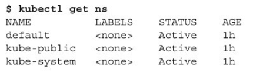

一般新建的k8s集群都会有这几个namespace。我们创建pod时不指定namespace就会在default命名空间中创建。

### 创建命名空间

同样使用yaml文件来创建命名空间。t2.yaml 内容如下

``` yaml
apiVersion: v1
kind: Namespace
metadata:
  name: test-0705
```

使用如下命令完成创建：

``` shell
kubectl create -f t2.yaml
```

也可以像下面代码一样简单地创建：

``` shell
kubectl create namespace test-0705
```

### 创建资源时指定命名空间

创建资源时，在yaml文件 metadata 字段添加如下属性，可以指定namespace

``` yaml
...
metadata:
  namespace: test-0705
...
```

如果不在文件中指定，可以在创建的命名中带参数写上

``` shell
kubectl create -f 文件名.yaml -n test-0705
```

### 强删 ns

``` shell
kubectl get namespace [ns名]  -o json \
| tr -d "\n" | sed "s/\"finalizers\": \[[^]]\+\]/\"finalizers\": []/" \
| kubectl replace --raw /api/v1/namespaces/[ns名]/finalize -f -
```

## 在pod中执行

有时我们需要在pod或者容器中执行命令完成调试。此时可以使用 exec 命令

``` shell
kubectl exec [POD] [COMMAND] [OPTIONS]
```

- `POD`：要在其内部执行命令的 Pod 的名称或者 Pod 的标签选择器。
- `COMMAND`：要在 Pod 内部执行的命令。可以是一个单独的命令，也可以是多个命令以及参数。
- `OPTIONS`：可以附加一些选项，例如 `-i`（保持标准输入打开）、`-t`（为命令分配伪终端）、`--container`（指定容器名称）等。

`kubectl exec` 命令的一些常见用途包括：

> 双横杠（--）代表着kubectl命令项的结束。在两个横杠之后的内容是指在pod内部需要执行的命令。

1. 进入pod 的bash命令行：`kubectl exec my-pod -it -- bash`
2. 查看 Pod 内部的文件系统：例如 `kubectl exec my-pod -- ls /var/log` 可以列出 Pod 内 `/var/log` 目录的内容。
3. 运行调试命令：可以在 Pod 中运行一些调试命令来诊断问题，比如 `kubectl exec my-pod -- ps aux` 查看进程信息。
4. 执行管理命令：有时候需要在 Pod 中执行一些管理操作，例如重新加载配置文件等。

## 停止和删除pod

### 按名称删除

``` shell
kubectl delete pod pod名1 pod名2
```

在删除pod的过程中，实际上我们在指示Kubernetes终止该pod中的 所有容器。Kubernetes向进程发送一个SIGTERM信号并等待一定的秒数 （ 默 认 为 30 ） ， 使 其 正 常 关 闭 。 如 果 它 没 有 及 时 关 闭 ， 则 通 过 SIGKILL终止该进程。因此，为了确保你的进程总是正常关闭，进程 需要正确处理SIGTERM信号。

需要注意： **删除pod不会马上删掉，而是给pod加上deletionTimestamp 的metadata，等待finalizer 为空后，然后才让kubelet删**。

### 按标签删除

``` shell
kubectl delete pod -l 标签名[=标签值]
```

### 删除命名空间

删除命名空间时，会其中的所有pod一并删除

``` shell
kubectl delete ns 命名空间名
```

### 删除所有pod

我们可以使用命令删除命名空间中的所有pod

``` shell
kubectl delete pod --all
```

如果发现还有pod存在，检查是否有 ReplicationController 或 ReplicaSet 或  DaemonSet，它会在特定pod被删除后再次启动一个相应的pod。

### 清空命名空间

``` shell
kubectl delete all --all
```

命令中第一个all指定资源，而--all选项指定将删除所有资源实例，而不是按名称指定它们。

有一些资源如 secret 只会被明确指定删除。

删除资源时，kubectl将打印它删除的每个资源的名称。

## 亲和affinity

在K8S中，**亲和性（Affinity）**用来定义Pod与节点关系的概念，亲和性通过**指定标签选择器和拓扑域约束**来决定 Pod 应该调度到哪些节点上。与污点相反，它主要是尽量往某节点靠。

在k8s当中，“亲和性”分为三种，节点亲和性、pod亲和性、pod反亲和性；

| **亲和性分类**  | **名称**    | **解释说明**                                                 |
| --------------- | ----------- | ------------------------------------------------------------ |
| nodeAffinity    | 节点亲和性  | 通过【节点】标签匹配，用于控制pod调度到哪些node节点上，以及不能调度到哪些node节点上；（主角是node节点） |
| podAffinity     | pod亲和性   | 通过【节点+pod】标签匹配，可以和哪些pod部署在同一个节点上（拓扑域）；（主角是pod） |
| podAntiAffinity | pod反亲和性 | 通过【节点+pod】标签匹配，与pod亲和性相反，就是和那些pod不在一个节点上（拓扑域）； |

亲和性设置规则：

- **requiredDuringSchedulingIgnoredDuringExecution** 必须满足的条件
- **preferredDuringSchedulingIgnoredDuringExecution** 倾向满足，则是“软”/“偏好”，而不是硬性要求，因此，如果调度器无法满足该要求，仍然调度该 pod

affinity还支持多种规则匹配条件的配置如

- In：label 的值在列表内
- NotIn：label 的值不在列表内
- Gt：label 的值大于设置的值，不支持Pod亲和性
- Lt：label 的值小于设置的值，不支持pod亲和性
- Exists：设置的label 存在
- DoesNotExist：设置的 label 不存在

``` yaml
apiVersion: apps/v1
kind: Deployment
metadata:
  name: dm-affinity
spec: 
  replicas: 20
  selector: 
    matchLabels:
      k8s: oslee
  template:
    metadata:
      name: pod-affinity 
      labels:
        k8s: oslee
    spec:
      #声明亲和性
      affinity:
        #声明亲和性类型
        podAffinity:
          #硬限制，必须满足的条件有哪些？（不满足下面的条件，亲和性就设置失败）
          requiredDuringSchedulingIgnoredDuringExecution:
          #设置拓扑域，指定【节点的标签名】
          #【节点key】就是说，设置了拓扑域，pod就会往这个标签的节点进行创建
 
          #只要满足key是k8s的节点的标签，那么就是同一个拓扑域
          - topologyKey: k8s
            #【pod标签】确定pod的标签，用于二次确认，选中了拓扑域（节点标签的key），再次选中pod标签才能确认调度到哪个节点；
            labelSelector:
              matchExpressions: 
 
              #意思是说，只要key的值是k8s的pod创建在了哪个节点，“我”就跟随他。也创建在这个节点上；
              - key: k8s
                #如果pod标签，出现了key值相同，value值不同的情况下，就不见设置Exists存在的关系了
                #建议设置：In的方式进行匹配，当然此时Value就不能设置了；
                operator: Exists
      containers:
      - name: c1
        image: nginx:1.20.1-alpine
        ports:
        - containerPort: 80
 
[root@k8s1 deploy]# kubectl apply -f deploy.yaml 
deployment.apps/dm-affinity created
```

## 事件 event

events 是 Kubernetes 集群中的一种资源。**当 Kubernetes 集群中资源状态发生变化时，可以产生新的 events**。我们使用describe 查看一些资源时会显示它关联的 event

[go - 彻底搞懂 Kubernetes 中的 Events - K8S生态 - SegmentFault 思否](https://segmentfault.com/a/1190000041196706)

一条event 记录如下

``` yaml
apiVersion: v1
count: 43
eventTime: null
firstTimestamp: "2021-12-28T19:57:06Z"
involvedObject:
  apiVersion: v1
  fieldPath: spec.containers{non-exist}
  kind: Pod
  name: non-exist-d9ddbdd84-tnrhd
  namespace: moelove
  resourceVersion: "333366"
  uid: 33045163-146e-4282-b559-fec19a189a10
kind: Event
lastTimestamp: "2021-12-28T18:07:14Z"
message: Back-off pulling image "ghcr.io/moelove/non-exist"
metadata:
  creationTimestamp: "2021-12-28T19:57:06Z"
  name: non-exist-d9ddbdd84-tnrhd.16c4fce570cfba46
  namespace: moelove
  resourceVersion: "334638"
  uid: 60708be0-23b9-481b-a290-dd208fed6d47
reason: BackOff
reportingComponent: ""
reportingInstance: ""
source:
  component: kubelet
  host: kind-worker3
type: Normal
```

比较重要的字段：

- **count**: 表示当前同类的事件发生了多少次 
- **firstTimestamp** : 事件首次发生时间
- **lastTimestamp**：最近一次发生时间
- **involvedObject**: 与此 event 有直接关联的资源对象
- **source**: 直接关联的组件,
- **reason**: 简单的总结（或者一个固定的代码），比较适合用于做筛选条件，主要是为了让机器可读

- **message**: 给一个更易让人读懂的详细说明
- **type**: 当前只有 `Normal` 和 `Warning` 两种类型, 源码中也分别写了其含义：

## 污点和容忍

Taint（污点）和 Toleration（容忍）可以作用于node和 pod 上（**即：污点是给node节点设置的，容忍度是给pod设置的**）

它们的目的是优化pod在集群间的调度，这跟节点亲和性类似，只不过它们作用的方式相反，具有Taint的node和pod是互斥关系，而具有节点亲和性关系的node和pod是相吸的。

### 污点 ( Taint ) 的组成

> 使用kubectl taint命令可以给某个Node节点设置污点，Node被设置上污点之后就和Pod之间存在了一种相斥的关系，可以让Node拒绝Pod的调度执行，甚至将Node已经存在的Pod驱逐出去。

每个污点的组成如下：

```
key=value:effect
```

每个污点有一个 key 和 value 作为污点的标签，其中 value 可以为空，effect 描述污点的作用。

当前 taint effect 支持如下三个选项：

```shell
NoSchedule：表示k8s将不会将Pod调度到具有该污点的Node上
PreferNoSchedule：表示k8s将尽量避免将Pod调度到具有该污点的Node上
NoExecute：表示k8s将不会将Pod调度到具有该污点的Node上，同时会将Node上已经存在的Pod驱逐出去
```

### 污点的设置、查看和去除

```shell
# 设置污点
kubectl taint nodes k8s-node02 key=value:NoSchedule

#查看污点
kubectl describe node k8s-node02 |grep Taints

#删除污点
kubectl taint nodes k8s-node2 key:NoSchedule-
```

>  注意：kubectl taint node [节点] [任意值]:[NoSchedule、NoExecute、PreferNoSchedule]
>
> \#删除和创建中的值要对应上，node节点的名称需要通过kubectl get node对应上

例如，每个master节点都有一个污点用来阻止被调度到此

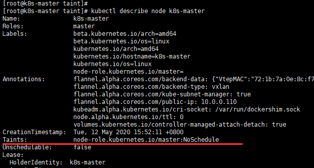

注：

当节点磁盘已使用过多时 kubelet 会自动给打一个 `node.kubernetes.io/disk-pressure` 污点。此时需要登录节点去清理 `/apps` 的文件系统。重点处理 `/apps/data/containerd/io.containerd.snapshotter.v1.overlayfs` 下的文件

### Tolerations容忍

设置了污点的Node将根据 taint 的effect：NoSchedule、PreferNoSchedule、NoExecute和Pod之间产生互斥的关系，Pod将在一定程度上不会被调度到Node上。

加容忍的位置如下：

``` yaml
apiVersion: v1
kind: Pod
metadata:
  name: nginx
  labels:
    env: test
spec:
  containers:
  - name: nginx
    image: nginx
    imagePullPolicy: IfNotPresent
  tolerations:
  - key: "example-key"
    operator: "Exists"
    effect: "NoSchedule"
```

但我们可以在Pod上设置容忍（Tolerations），**意思是设置了容忍的Pod将可以容忍对应污点的存在，可以被调度到存在污点的Node上**。

``` yaml
tolerations:
- key: "key2"
  operator: "Equal"
  value: "value2"
  effect: "NoSchedule"
# 能够容忍带有 key2=value2:NoSchedule 污点的节点
---
tolerations:
- key: "key3"
  operator: "Exists"
  effect: "NoSchedule"
# 能够容忍带有 key3:NoSchedule 污点的节点
# operator的值为Exists时，将会忽略value；只要有key和effect就行
---
tolerations:
- key: "key4"
  operator: "Equal"
  value: "value4"
  effect: "NoExecute"
  tolerationSeconds: 3600
# 能够在带有 key4=value4:NoExecute 污点的节点上最多继续运行 tolerationSeconds 时间
```

- 当不指定key值和effect值时，且operator为Exists，表示容忍所有的污点【能匹配污点所有的keys，values和effects】

```yaml
tolerations:
- operator: "Exists"
```

- 当不指定effect值时

当不指定effect值时，则能匹配污点key对应的所有effects情况

```yaml
tolerations:
- key: "key"
  operator: "Exists"
```

## pod 按优先级调度

Kubernetes 中的 **PriorityClass** （它的GroupVersion 是 scheduling.k8s.io/v1）是用来指定 Pod 的调度优先级的机制。通过为 Pod 指定不同的 PriorityClass，可以确保在资源有限的情况下，重要的 Pod 能够优先获得资源分配，从而保证系统的可靠性和性能。

每个 PriorityClass 都有一个整数值，表示该 PriorityClass 的优先级。较高的整数值表示较高的优先级，即优先级值越大的 Pod 会优先获得资源分配。当多个 Pod 竞争资源时，Kubernetes 会根据它们的 PriorityClass 来确定哪个 Pod 应该优先得到资源。

下面是一个示例，演示如何为 Pod 指定 PriorityClass：

``` yaml
apiVersion: scheduling.k8s.io/v1
kind: PriorityClass
metadata:
  name: high-priority
value: 1000000
globalDefault: false
description: "High priority for critical Pods"
```

然后，在 Pod 的规格中指定 PriorityClass：

``` yaml
apiVersion: v1
kind: Pod
metadata:
  name: my-pod
spec:
  priorityClassName: high-priority
  containers:
  - name: my-container
    image: nginx
```

通过使用 PriorityClass，可以更灵活地控制 Pod 的调度优先级，确保重要的 Pod 能够得到优先处理。

## Kubernetes 对象的删除过程

当删除一个对象时，其对应的控制器并不会真正执行删除对象的操作，在 Kubernetes 中对象的回收操作是由 GarbageCollectorController （垃圾收集器）负责的，其作用就是当删除一个对象时，会根据指定的删除策略回收该对象及其依赖对象。删除的具体过程如下：

- 发出删除命令后 Kubernetes 会将该对象**标记为待删除**，但不会真的删除对象，具体做法是将对象的 `metadata.deletionTimestamp` 字段设置为当前时间戳，这使得对象处于只读状态（除了修改 `finalizers` 字段）。
- 当 `metadata.deletionTimestamp` 字段非空时，负责监视该对象的各个控制器会执行对应的 `Finalizer` 动作，每个 `Finalizer` 动作完成后，就会从 `Finalizers` 列表中删除对应的 `Finalizer`。
- 一旦 `Finalizers` 列表为空时，就意味着所有 `Finalizer` 都被执行过了，垃圾收集器会最终删除该对象。

## 新建 pod 去更新node上的镜像

有时worker 节点无法登录，而我们又需要更新这个节点上的镜像，可以新建一个pod指定到该节点并将镜像拉取策略改为 Always，来实现更新节点镜像。而且可能需要对多个节点进行更新，这是我们需要使用 daemenset + affinity 来实现。

以下是 daemenset 模版

``` yaml
apiVersion: apps/v1
kind: DaemonSet
metadata:
  name: ds1
  namespace: default
spec:
  selector:
    matchLabels:
      name: example-daemonset
  template:
    metadata:
      labels:
        name: example-daemonset
    spec:
      affinity:
        nodeAffinity:
          requiredDuringSchedulingIgnoredDuringExecution:
            nodeSelectorTerms:
            - matchExpressions:
              - key: kubernetes.io/hostname
                operator: In
                values:
                - 【node-1】
                - 【node-2】
              # 你可以添加更多的 matchExpressions 或者 matchFields
      containers:
      - name: example-container
        image: 【your-image-name:your-tag】 # 替换为你要使用的镜像名称和标签
        imagePullPolicy: Always
        command: ["sleep", "3600"] # 可选，让容器保持运行状态
```

`kubectl  get node | awk 'NR>4 {print "- ",$1}'` 快速获取work 节点

# 5. 托管pod

比较简单的pod保活机制是设置存活探针，对pod的状态以及pod内容器部署的应用定时进行状态检查。详情见 《kubernetes in action》中文版4.1节。该机制存在一定缺陷，存活探针的任务由承载pod节点的kubelet执行，如果该节点本身崩溃，该探针任务就会失效。因此，推荐使用**ReplicationController** 或类似的机制来管理pod。

## pod 的健康检查 health check

[k8s的Health Check（健康检查） - benjamin杨 - 博客园 (cnblogs.com)](https://www.cnblogs.com/benjamin77/p/9939050.html)

### 默认的健康检查

每个容器启动时都会执行一个进程，此进程由 Dockerfile 的 CMD 或 ENTRYPOINT 指定。**如果进程退出时返回码非零，则认为容器发生故障**，Kubernetes 就会根据 `restartPolicy` 重启容器。

### Liveness 探针

Liveness 探测**让用户可以自定义判断容器是否健康的条件**。如果探测失败，Kubernetes 就会重启容器。

如下是一个pod 的spec 模板

``` yaml
spec:
  restartPolicy: OnFailure
  containers:
  - name: liveness
    image: busybox
    args:
    - /bin/sh
    - -c
    - touch /tmp/healthy; sleep 30; rm -fr /tmp/healthy; sleep 600
    livenessProbe:
      exec: # 还有其他的探测方法如 httpGet
        command:
        - cat
        - /tmp/healthy
      initialDelaySeconds: 10
      periodSeconds: 5
```

启动进程首先创建文件 `/tmp/healthy`，30 秒后删除，在我们的设定中，如果 `/tmp/healthy` 文件存在，则认为容器处于正常状态，反正则发生故障。

`livenessProbe` 部分定义了如何执行 Liveness 探测：

1. 探测的方法是：通过 `cat` 命令检查 `/tmp/healthy` 文件是否存在。如果命令执行成功，返回值为零，Kubernetes 则认为本次 Liveness 探测成功；如果命令返回值非零，本次 Liveness 探测失败。
2. `initialDelaySeconds: 10` 指定容器启动 10 之后开始执行 Liveness 探测，我们一般会根据应用启动的准备时间来设置。比如某个应用正常启动要花 30 秒，那么 `initialDelaySeconds` 的值就应该大于 30。
3. `periodSeconds: 5` 指定每 5 秒执行一次 Liveness 探测。Kubernetes 如果连续执行 3 次 Liveness 探测均失败，则会杀掉并重启容器。

### Readiness 探针

除了 Liveness 探测，Kubernetes Health Check 机制还包括 Readiness 探测。

用户通过 Liveness 探测可以告诉 Kubernetes 什么时候通过重启容器实现自愈；Readiness 探测则是告诉 Kubernetes 什么时候可以将容器加入到 Service 负载均衡池中，对外提供服务。

Readiness 探测的配置语法与 Liveness 探测完全一样，下面是个例子：

``` yaml
spec:
  restartPolicy: OnFailure
  containers:
  - name: readiness
    image: busybox
    args:
    - /bin/sh
    - -c
    - touch /tmp/healthy; sleep 30; rm -rf /tmp/healthy
    readinessProbe:
      exec: # 还有其他的探测方法如 httpGet
        command:
        - cat
        - /tmp/healthy
      initialDelaySeconds: 10
      periodSeconds: 5
```

### Startup 探针

用于检测容器内应用程序是否已经启动完成。启动探针与就绪性探针非常相似，但其目的在于确定容器是否已经完成启动，而不是确定容器是否已经准备好接收流量。

``` yaml
startupProbe:
  httpGet:
    path: /test
    prot: 80
failureThreshold: 60
initialDelay：5
periodSeconds: 3
```

不管是那种每次探测都将获得以下三种结果之一：

- `Success`（成功）容器通过了诊断。
- `Failure`（失败）容器未通过诊断。
- `Unknown`（未知）诊断失败，因此不会采取任何行动.

下面对 几个探测做个比较：

|                                 | 目的                       | 行为                                                         |
| ------------------------------- | -------------------------- | ------------------------------------------------------------ |
| **存活探针（Liveness Probe）**  | 确定容器是否正在运行       | 当存活探针检测到容器不健康时，kubelet 会根据 Pod 的 `restartPolicy` 来决定是否重启该容器。 |
| **就绪探针（Readiness Probe）** | 确定容器是否准备好接收流量 | k8s不会调度流量到此pod，直到该探针就绪。(READY状态为0/1)     |
| **启动探针（Startup Probe）**   | 确定容器内的程序是否启动   | 如果配置了启动探针，**其他两种探针将会被暂时禁用**，直到启动探针成功。一旦启动探针通过，存活探针和就绪探针将开始工作。**启动探针仅在容器启动时执行，并且只需检测一次**。（其他两个探针一直存在） |

几种探针的默认行为，**通过判断容器启动进程的返回值是否为零来判断探测是否成功**。

## ReplicationController

ReplicationController是一种 k8s 资源。如果pod因任何原因消失，其会创建新的pod来代替之前的。一般而言 ，ReplicationController 旨在创建和管理一个pod的多个副本（replicas）

ReplicationController 由三部分组成：

- **label selector**（标签选择器）：用于确定ReplicationController作用
  域中有哪些pod
- **replica count**（副本个数）：指定应运行的pod数量
- **pod template**（pod模板）：用于创建新的pod副本

ReplicationController的副本个数、标签选择器，甚至是pod模板都可以随时修改，但只有副本数目的变更会影响现有的pod

### 创建

``` yaml
apiVersion: v1
kind: ReplicationController
metadata:
  name: rc-lt
spec:
  replicas: 3
  selector: 
    test_aaa: test_bbb # 在此处不指定选择器也是一种选择。在这种情况下，它会自动根据pod模板中的标签自动配置。这样使YAML更加简短。
  template:
    metadata:
      labels: 
        test_aaa: test_bbb
    spec:
      containers:
        - image: aiops-899f5654.ecis.huhehaote-1.cmecloud.cn/public/nginx
          name: test-c1
          ports:
          - containerPort: 8080
            protocol: TCP
```

创建命令：

``` shell
kubectl create -f create-rc.yaml
```

此时查看是否创建成功：

``` shell
$ kubectl get rc -A
NAMESPACE   NAME    DESIRED   CURRENT   READY   AGE
default     rc-lt   3         3         3       12s
```

可以看到，再default 命名空间中创建了指定的replicationController并正常工作了。

``` shell
$ kubectl get pod
NAME                READY   STATUS      RESTARTS    AGE
.........
rc-lt-8trmx          1/1     Running    0          2m37s
rc-lt-jlnlm          1/1     Running    0          2m37s
rc-lt-zwbl5          1/1     Running    0          2m37s
```

### 删除

此时，我们删除一个pod

``` shell
kubectl delete pod rc-lt-8trmx
```

然后再次查看

``` shell
$ kubectl get pod
NAME                READY   STATUS      RESTARTS    AGE
rc-lt-98fkv         1/1     Running     0           5s
rc-lt-jlnlm         1/1     Running     0          6m40s
rc-lt-zwbl5         1/1     Running     0          6m40s
```

可以看到，删除之后，rc快速地为我们创建了一个副本。

### 查看详细信息

``` shell
$ kubectl describe rc rc-lt
Name:         rc-lt
Namespace:    default
Selector:     test_aaa=test_bbb
Labels:       test_aaa=test_bbb
Annotations:  <none>
Replicas:     3 current / 3 desired
Pods Status:  3 Running / 0 Waiting / 0 Succeeded / 0 Failed
Pod Template:
  Labels:  test_aaa=test_bbb
  Containers:
   test-c1:
    Image:        aiops-899f5654.ecis.huhehaote-1.cmecloud.cn/public/nginx
    Port:         8080/TCP
    Host Port:    0/TCP
    Environment:  <none>
    Mounts:       <none>
  Volumes:        <none>
Events:
  Type    Reason            Age    From                    Message
  ----    ------            ----   ----                    -------
  Normal  SuccessfulCreate  8m49s  replication-controller  Created pod: rc-lt-8trmx
  Normal  SuccessfulCreate  8m49s  replication-controller  Created pod: rc-lt-zwbl5
  Normal  SuccessfulCreate  8m49s  replication-controller  Created pod: rc-lt-jlnlm
  Normal  SuccessfulCreate  2m14s  replication-controller  Created pod: rc-lt-98fkv
```

### 控制器如何创建新的pod

控制器通过创建一个新的替代pod来响应pod的删除操作。从技术上讲，**它并没有对删除本身做出反应**，而是针对由此产生的状态 —— pod数量不足。

虽然ReplicationController会立即收到删除pod的通知（API服务器允许客户端监听资源和资源列表的更改），但这不是它创建替代pod的原因。该通知会触发控制器检查实际的pod数量并采取适当的措施。

### 更改RC的标签选择器

- 如果更改了一个pod的标签，使它不再与ReplicationController的标签选择器相匹配，那么该pod就变得和其他手动创建的pod一样了。它不再被任何东西管理。如果运行该节点的pod异常终止，它显然不会被重新调度。但请记住，当你更改pod的标签时，ReplicationController发现一个pod丢失了，并启动一个新的pod替换它
- 如果给一个pod新增标签，那么 rc 不会有任何反应。因为rc 检查的是自己的标签选择器，只要pod具有自己的标签选择器的所有标签，那么该pod就收到自己的管理。

- 如果不是更改某个pod的标签而是**修改了ReplicationController的标签选择器**，它会让所有已创建的pod脱离ReplicationController的管理，导致它创建三个新的pod。

### 修改pod模板

ReplicationController的pod模板可以随时修改。pod模板修改后，原有的pod不会被删除，rc会自动新建新的pod。

通过编辑rc 并向pod模板进行编辑或修改

``` shell
kubectl edit rc rc-lt
```

在打开的文本编辑器中修改。

### RC扩缩容

放大或者缩小pod的数量规模使用修改 Replicas 字段的值来实现，更改之后，ReplicationController将会看到存在太多的pod并删除其中的一部分（缩容时），或者看到它们数目太少并创建pod（扩容时）。

``` shell
kubectl scale rc rc-lt --replicas=10
```

也可以通过编辑rc 进行修改

``` shell
kubectl edit rc rc-lt
```

在打开的文本编辑器中修改。

### 删除rc

使用命令

``` shell
kubectl delete rc rc名
```

将指定的rc进行删除，当删除此rc时，**此rc所管理的pod也会被删除。**但是由于由 ReplicationController 创 建 的 pod 不 是 ReplicationController的组成部分，只是由其进行管理，因此可以只删除 ReplicationController并保持pod运行。

``` shell
kubectl delete rc rc名 [--casade=false]
```

加上后面的那些参数可以在删除rc后保留pod。

## ReplicaSet

ReplicaSet是完全代替ReplicationController的资源。**使用 rs 而不要使用rc**。它们几乎完全相同。

不同在于rs的pod选择器的表达能力更强。比如rs的标签选择器不仅允许包含某个标签的pod，还可以匹配缺少某个标签的pod，或者包含特定标签名的pod。

### 创建ReplicaSet

``` yaml
apiVersion: apps/v1   # api组/api实际版本，可使用kubectl get rs rs名 -o=jsonpath='{.apiVersion}' 查看已有的rs来获得
kind: ReplicaSet
metadata:
  name: rs-lt
spec:
  replicas: 3
  selector:
    matchLabels: # 最简单的类似rc的选择器
      test_aaa: test_bbb
  template:
    metadata:
      labels: 
        test_aaa: test_bbb
    spec:
      containers:
        - image: aiops-899f5654.ecis.huhehaote-1.cmecloud.cn/public/nginx
          name: test-c1
          ports:
          - containerPort: 8080
            protocol: TCP
```

上述文件内容命名一个文件 `create-rs.yaml`，使用命令创建 rs

``` shell
kubectl create  -f create-rs.yaml
```

然后使用命令查看资源项

``` shell
$  kubectl get rs
NAME   DESIRED   CURRENT   READY   AGE
rs-lt  3         3         3       29s

$ kubectl get  pod
NAME         READY    STATUS    RESTARTS      AGE
rs-lt-k8zbl   1/1     Running     0            3s
rs-lt-wt2xb   1/1     Running     0            3s
test-lt1      1/1     Running     0            15h
```

可以看到，rs成功被创建，但保证了有三个按模板的 pod正在运行。但是它只新建了两个 pod，这是因为15h之前我们就手动创建了一个带有相应标签的pod，rs 创建之后发现了它并把它纳入管辖，因为就只需要新建两个。总的来说rs中的副本数字段其实是表示需要有这么多个pod运行而不是要求新建这么多个。

删除rs 同样使用 delete

``` shell
kubectl delete rs rs-lt 
```

该rs 管辖的所有pod全部自动删除了。

### 标签选择器

``` yaml
selector:
  matchExpressions:  
   - key: app
     operator: In
     values:
       - qwe
```

可以给选择器添加额外的表达式。如示例，每个表达式都必须包含一个key、一个operator（运算符），并且可能还有一个values的列表（取决于运算符）。你会看到四个有效的运算符：

- In:Label的值必须与其中一个指定的values匹配。
- NotIn:Label的值与任何指定的values不匹配。
- Exists:pod必须包含一个指定名称的标签（值不重要）。使用此运算符时，不应指定values字段。
- DoesNotExist:pod不得包含有指定名称的标签。values属性不得指定。

如果你指定了多个表达式，则所有这些表达式都必须为true才能使选择器与pod匹配。如果同时指定matchLabels和matchExpressions，则所有标签都必须匹配，并且所有表达式必须计算为true以使该pod与选择器匹配。

## DaemonSet

某些应用需要在每个node中都运行，如日志收集和资源监控。此时可以使用DaemonSet来实现 。

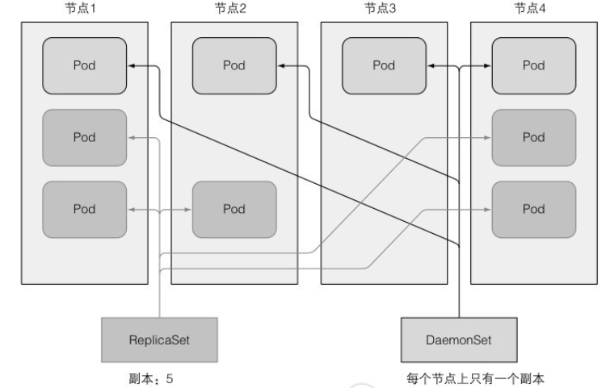

由上图可以看出DaemonSet和ReplicaSet的区别：

- ReplicaSet 确保集群中存在期望数量的pod副本，
- DaemonSet 无需指定副本数，它**确保一个pod匹配它的选择器并在每个节点上运行**。

### 在指定节点运行

DaemonSet将pod部署到集群中的所有（worker）节点上，除非指定这些pod只在部分节点上运行。这是通过pod模板中的`nodeSelector`属性指定的。

``` yaml
apiVersion: apps/v1   # api组/api实际版本
kind: DaemonSet
metadata:
  name: ds-lt
spec:
  selector:
    matchLabels: # 匹配的pod 的标签
      test_aaa: test_bbb
  template:
    metadata:
      labels: 
        test_aaa: test_bbb # 创建的pod 的标签
    spec:
      nodeSelector:		# 在此处指定节点选择器	
        nodeKey: nodeValue
      containers:
        - image: cis-hub-huadong-4.cmecloud.cn/ecloud/busybox:config-host
          name: test-c1
          command: ["sleep", "1200"]
          ports:
          - containerPort: 8080
            protocol: TCP
```

编写上述yaml文件并运行创建。

``` shell
$ kubectl create -f ds1.yaml 
daemonset.apps/ds-lt created
$ kubectl  get pod
No resources found in default namespace.
$ kubectl  get ds
NAME    DESIRED   CURRENT   READY   UP-TO-DATE   AVAILABLE   NODE SELECTOR       AGE
ds-lt   0         0         0       0            0           nodeKey=nodeValue   13s
```

我们发现 ds 并没有按要求创建pod，这是因为我们的两个node 还没有相应的标签。打上标签之后，DaemonSet将**自动检测到节点的标签已经更改**，并将pod部署到有匹配标签的所有节点。

``` shell
$ kubectl get node
NAME                 STATUS   ROLES                  AGE   VERSION
kcs-suzhou-m-596vf   Ready    control-plane,master   23h   v1.21.5
kcs-suzhou-m-n5pzs   Ready    control-plane,master   23h   v1.21.5
kcs-suzhou-m-prn28   Ready    control-plane,master   23h   v1.21.5
kcs-suzhou-s-grdfq   Ready    <none>                 23h   v1.21.5
kcs-suzhou-s-r68kp   Ready    <none>                 23h   v1.21.5
$ kubectl label node kcs-suzhou-s-grdfq kcs-suzhou-s-r68kp nodeKey=nodeValue
node/kcs-suzhou-s-grdfq labeled
node/kcs-suzhou-s-r68kp labeled
$ kubectl  get ds
NAME    DESIRED   CURRENT   READY   UP-TO-DATE   AVAILABLE   NODE SELECTOR       AGE
ds-lt   2         2         2       2            2           nodeKey=nodeValue   3m31s
$ kubectl get pod
NAME          READY   STATUS    RESTARTS   AGE
ds-lt-n682s   1/1     Running   0          54s
ds-lt-nkn8r   1/1     Running   0          54s
```

此时我们删除一个pod 的标签

``` shell
$ kubectl get  pod --show-labels
NAME          READY   STATUS    RESTARTS   AGE     LABELS
ds-lt-n682s   1/1     Running   0          4m42s   controller-revision-hash=78755b8f7f,pod-template-generation=1,test_aaa=test_bbb
ds-lt-nkn8r   1/1     Running   0          4m42s   controller-revision-hash=78755b8f7f,pod-template-generation=1,test_aaa=test_bbb
$ kubectl label pod ds-lt-n682s test_aaa-
pod/ds-lt-n682s labeled
$ kubectl get  pod --show-labels
NAME          READY   STATUS    RESTARTS   AGE     LABELS
ds-lt-fhjjm   1/1     Running   0          3s      controller-revision-hash=78755b8f7f,pod-template-generation=1,test_aaa=test_bbb
ds-lt-n682s   1/1     Running   0          5m47s   controller-revision-hash=78755b8f7f,pod-template-generation=1
ds-lt-nkn8r   1/1     Running   0          5m47s   controller-revision-hash=78755b8f7f,pod-template-generation=1,test_aaa=test_bbb
```

可以看见，pod ds-lt-n682s由于缺少 test_aaa标签脱离了daemon 的管理，于是daemon 立刻新建了一个pod来代替。

### 删除ds

``` shell
kubectl delete ds ds-lt
```

删除ds 会将它管理的所有pod 删除。

## Job

某些任务我们希望它只执行一次，**完成后**就终止，出错没完成就重启。Kubernetes通过Job资源提供了对此的支持。它允许你运行一种pod，该pod在**内部进程成功结束时，不重启容器。**一旦任务完成，pod就被认为处于完成状态。

在发生节点故障时，该节点上由Job管理的pod将按照ReplicaSet的pod的方式，重新安排到其他节点。如果进程本身异常退出（进程返回错误退出代码时），可以将Job配置为重新启动容器。

### 创建Job

``` yaml
apiVersion: batch/v1
kind: Job
metadata: 
  name: job1
spec:
  template:
    metadata:
      labels: 
        qw: er
    spec:
      restartPolicy: OnFailure  # 重启策略设为失败时重启
      containers:
      - name: c1
        image: cis-hub-huadong-4.cmecloud.cn/ecloud/busybox:config-host
        command: ["sleep", "120"] 
      nodeSelector: # 可以通过节点选择器指定pod会被调度到哪个节点
        nodekey: nodeValue
```

在一个pod的定义中，可以指定在容器中运行的进程结束时， Kubernetes会做什么。这是通过pod配置的属性restartPolicy完成的，**默认为Always。Job pod不能使用默认策略，**因为它们不是要无限期地运 行。因此，需要明确地**将重启策略设置为OnFailure或Never**。此设置防止容器在完成任务时重新启动（pod被Job管理时并不是这样的）。

### 运行

``` shell
$ kubectl create -f job1.yaml 
job.batch/job1 created
$ kubectl get pod
NAME          READY   STATUS    RESTARTS   AGE
job1-5phhv    1/1     Running   0          9s
```

两分钟过后，pod将不再出现在pod列表中，工作将被标记为已完成。默认情况下，除非使用--show-all（或-a）开关，否则在列出pod时不显示已完成的pod

``` shell
$ kubectl get pod -A
NAMESPACE   NAME        READY   STATUS      RESTARTS   AGE
default     job1-5phhv  0/1     Completed    0          2m51s
$ kubectl get job
NAME   COMPLETIONS   DURATION   AGE
job1   1/1           2m2s       4m22s
```

### job中运行多个实例

作业可以配置为创建多个pod实例，并以**并行或串行**方式运行它们。这是通过在Job配置中设置completions和parallelism属性来完成的。

**顺序运行Job pod**

将completions设为你希望作业的pod运行多少次，

``` yaml
apiVersion: batch/v1
kind: Job
metadata: 
  name: job1
spec:
  completions: 3 # 顺序运行3次
  template:
    metadata:
      labels: 
        qw: er
    spec:
      restartPolicy: OnFailure  # 重启策略设为失败时重启
      containers:
      - name: c1
        image: cis-hub-huadong-4.cmecloud.cn/ecloud/busybox:config-host
        command: ["sleep", "30"] 
```

运行后查看：

``` shell
$ kubectl create -f  job2.yaml 
job.batch/job1 created
$ kubectl get job
NAME   COMPLETIONS   DURATION   AGE
job1   0/3           8s         8s
$ kubectl get pod
NAME         READY   STATUS    RESTARTS   AGE
job1-vksk6   1/1     Running   0          17s
```

一定时间后：

``` shell
$ kubectl get job
NAME   COMPLETIONS   DURATION   AGE
job1   3/3           94s        2m38s
$ kubectl get pod
NAME         READY   STATUS      RESTARTS   AGE
job1-799sn   0/1     Completed   0          2m10s
job1-8n9g6   0/1     Completed   0          99s
job1-vksk6   0/1     Completed   0          2m42s
```

**并行运行job**

不必一个接一个地运行单个Job pod，也可以让该Job并行运行多个pod。可以通过parallelism Job配置属性，指定允许多少个pod并行执行。

``` yaml
apiVersion: batch/v1
kind: Job
metadata: 
  name: job1
spec:
  completions: 3 # 要求一共运行3次
  parallelism: 2 # 最多同时运行2个pod
  template:
    metadata:
      labels: 
        qw: er
    spec:
      restartPolicy: OnFailure  # 重启策略设为失败时重启
      containers:
      - name: c1
        image: cis-hub-huadong-4.cmecloud.cn/ecloud/busybox:config-host
        command: ["sleep", "30"] 
```

运行后查看：

``` shell
$ kubectl get job
NAME   COMPLETIONS   DURATION   AGE
job1   0/3           15s        15s
$ kubectl get pod
NAME         READY   STATUS    RESTARTS   AGE
job1-g44gn   1/1     Running   0          20s
job1-s8p42   1/1     Running   0          20s
```

可以在运行时修改 parallelism 属性。

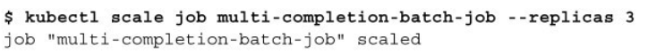

### 限制 pod 完成时间

Job要等待一个pod多久来完成任务？如果pod卡住并且根本无法完成（或者无法足够快完成），该怎么办？

通过在pod配置中**设置activeDeadlineSeconds属性**，可以限制pod的时间。如果pod运行时间超过此时间，系统将尝试终止pod，并将Job标记为失败。
还可以通过**指定Job manifest中的spec.backoffLimit字段**，可以配置Job在被标记为失败之前可以重试的次数。如果你没有明确指定它，则默认为6。

### cronjob定时或周期执行

Job资源在创建时会立即运行pod。但是许多批处理任务需要在特定的时间运行，或者在指定的时间间隔内重复运行。在Linux和类UNIX操作系统中，这些任务通常被称为cron任务。

k8s中的cron任务通过创建 CronJob 资源进行配置。

在计划的时间内，CronJob资源会创建Job资源，然后Job创建pod。

manifest如下示例：

``` yaml
apiVersion: batch/v1beta1
kind: CronJob
metadata:
    name: kubernetes-cron-job
spec:
  schedule: "0,15,30,45 * * * *"
  jobTemplate:
    spec:
      template:
        metadata:
          labels:
            app: cron-batch-job
        spec:
          restartPolicy: OnFailure
          containers:
          - name: kube-cron-job
            image: devopscube/kubernetes-job-demo:latest
            args: ["100"]
```

 schedule语法如下：

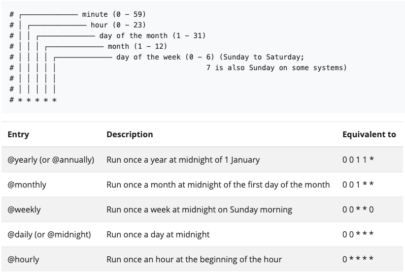

可以使用crontab生成器（https://crontab-generator.org/）来生成自己的时间计划。

# 6. 服务：发现pod并通信

pod 通常需要对来自集群内部其他pod，以及来自集群外部的http请求做出响应。

pod需要一种寻找其他pod的方法来使用其他pod提供的服务，但是不能直接给每个pod都提供一个网络地址，因为pod是短暂的，它们随时可能启动或关闭、无论是为了给其他pod提供空间而被移除，还是因为异常而退出。

为了解决上述问题，K8S提供了一种资源类型 --- 服务 Service。

kubernetes 的服务是**一种为一组功能相同的pod 提供单一不变的接入点的资源**。当服务存在时，它的IP地址和端口不会改变。客户端通过IP地址和端口号建立连接，这些连接会被路由到提供该服务的任意一个pod上。通过这种方式，客户端不需要知道每个单独的提供服务的pod的地址，这样这些pod就可以在集群中随时被创建或移除。

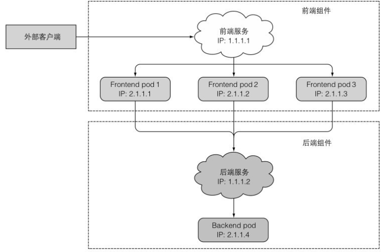

如图是包含两个服务，多个前端pod和一个后端pod的例子。

## 创建服务

服务同样使用**标签选择器** 来区分和识别自己管理的pod。

创建服务最简单的方法是通过命令 `kubectl expose`。但一般还是通过 yaml 文件传递给 kubernetes API 服务器来创建服务。

编写 svc1.yaml

``` yaml
apiVersion: v1
kind: Service
metadata:
  name: svc1
spec:
  ports:
  - port: 8080	 # 节点监听端口
    targetPort: 80	# 容器端口，也可以使用端口名称（如http-metrics 和 grpc）。端口名称在 pod.Spec.containers[*].ports[*] 中指定
  selector:
    test_app: test_nginx
```

文件会创建一个名为 svc1 的服务，它将**在端口8080接受请求**并连接路由到具有标签选择器为 test_app=test_nginx的**pod的80端口**上（因为我们准备开启的nginx pod 默认暴露80 端口）。

> 创建相关pod 的yaml文件如下
>
> ``` yaml
> apiVersion: v1  # 使用的k8s API版本
> kind: Pod # 描述的资源类型，yaml可以描述任意资源
> metadata:
>   name: test-lt1 # pod的名称，所有的命名只能是数字字母或-或.
>   labels:
>     test_app: test_nginx
> spec:
>   containers:
>   - image: nginx:latest # 创建容器所使用的镜像
>     name: test-c1
> ```
> 
> 当然也可以使用 ReplicaSet 部署多个pod，让一个service 对接多个提供相同服务的pod。

我们使用命令创建它

``` shell
kubectl create -f svc1.yaml
```

此时我们使用命令查看服务

``` shell
$ kubectl get svc
NAME         TYPE        CLUSTER-IP    EXTERNAL-IP   PORT(S)    AGE
kubernetes   ClusterIP   10.233.0.1    <none>        443/TCP    2d5h
svc1         ClusterIP   10.233.44.4   <none>        8080/TCP   4m2s
```

可以看到，我们创建的服务的类型是 `ClusterIP`，这是service 的默认类型，apiserver 会自动分配一个仅在Cluster 内部访问的IP（集群内node或pod都能访问），如上的`10.233.44.4`。如果pod 提供的应用仅仅是对其他pod 进行支撑的话就使用这种类型。

现在，我们使用 curl 查看

``` shell
$ curl 10.233.44.4:8080
<!DOCTYPE html>
.........
```

可以看到我们的请求传递到了 nginx pod 。

同时，我们开启的服务可以让集群内的每个pod都访问到。

``` shell
$ kubectl exec rs-lt-8ch26 -- curl 10.233.55.242:8080
  % Total    % Received % Xferd  Average Speed   Time    Time     Time  Current
                                 Dload  Upload   Total   Spent    Left  Speed
100   615  100   615    0     0   661k      0 --:--:-- --:--:-- --:--:--  600k
<!DOCTYPE html>
.....................
```

在集群内的pod中，不仅可以通过IP:port 来访问，**还可以通过全限定域名`serviceName.namespace.svc.cluster.local:port`来访问**。在master 主机上也可以使用这个域名访问。这是因为 K8s 为每个 Service 自动生成一个 DNS 名称。如果在同一个 namespace下的pod，可以直接使用 `serviceName.namespace:port`来访问

全限定域名pod 也有，但不常用。

全限定域名的解析是依靠 kube-system 命名空间下的 core-dns-xxx pod来实现的。

> 每个调用接口都会被service随机调度到一个pod中，如果我们希望每个客户端每次请求的pod不变的话可以设置会话亲和度来实现。
>
> ``` yaml
> spec:
> sessionAffinity: ClientIP
> ....
> ```
>
> 这种方式将会使服务代理将来自同一个client IP的所有请求转发至同一个pod上。

进一步，我们可以为**同一个服务暴露多个端口**。

比如HTTP监听8080端口、HTTPS监听8443端口，可以使用一个服务从端口80和443转发至pod端口8080和8443。注意，在创建一个有多个端口的服务的时候，必须给每个端口指定名字，（在pod.yaml中可以直接给端口命名，然后在 svc.yaml 中直接使用端口名来引用）。使用端口命名的好处是当修改端口号时只需要正在命名处修改一处即可，其他地方都是引用而已。

重新编写 svc1.yaml 

``` yaml
spec:
  ports:
  - name: https
    port: 8443
    targetPort: 443
  - name: http
    port: 8080
    targetPort: 80
```

注意： 标签选择器应用于整个服务，不能对每个端口做单独的配置。如果不同的pod有不同的端口映射关系，需要创建两个服务。

> 发现一个小问题，我们开启pod后，再开启服务，再pod环境变量能看到有指向服务地址的环境变量。但如果此时重新开启这个服务，服务IP变了，在pod 的环境变量中并不会自动更改。不知道可能有什么后果，再说。

> pod，节点，service ip 的理解
> k8s 集群中，创建的pod p1，使用 kubectl get pod -owide 查看到pod ip为 ip1 ，所在节点是 n1，通过 kubectl get node -owide 查看到节点 ip为 ip2，给pod 创建一个ClusterIP类型的svc，其ip为 ip3。
> ip1（Pod IP）：Kubernetes 集群中的每个节点通常会使用一个 CNI（Container Network Interface）插件来管理 Pod 网络。CNI 插件会在节点上创建虚拟网络设备（例如 veth pair），并将这些设备连接到一个虚拟网桥（例如 cni0 或 docker0）。当在节点 n1 上运行 ip a 命令时，你会看到与 Pod 相关的网络接口（例如 vethXXXX），并且其 IP 地址就是 ip1。
> ip2（Node IP）：节点本身的 IP 地址。
> ip3（Service ClusterIP）：ClusterIP 类型的 Service 是一个虚拟 IP，它并不对应于任何实际的网络接口。它的路由和转发是由 Kubernetes 的核心组件（如 kube-proxy）通过 iptables 或 IPVS 来实现的。ip3 是一个虚拟 IP，它不会出现在节点的网络接口列表中，然而，由于 kube-proxy 在节点上设置了转发规则，你可以从节点上 ping 通 ip3，或者通过 curl 访问它（如果 Service 对应的应用支持 HTTP/HTTPS）。

## Endpoint

service和 pod 不是直接相连的，两者之间使用 **Endpoint**资源相连。

我们用`kubectl describe`查看一个服务。

``` shell
$ kubectl describe svc svc1
Name:              svc1
Namespace:         default
Labels:            <none>
Annotations:       <none>
Selector:          test_app=test_nginx
Type:              ClusterIP
IP Family Policy:  SingleStack
IP Families:       IPv4
IP:                10.233.55.242
IPs:               10.233.55.242
Port:              https  8443/TCP
TargetPort:        443/TCP
Endpoints:         172.19.133.224:443,172.19.133.225:443,172.19.5.230:443
Port:              http  8080/TCP
TargetPort:        80/TCP
Endpoints:         172.19.133.224:80,172.19.133.225:80,172.19.5.230:80
Session Affinity:  None
Events:            <none>
```

可以看到服务的**Endpoint资源**。Endpoint就是暴露一个服务的IP地址和端口的列表，Endpoint也是一个k8s资源，缩写是ep。

在 Kubernetes（k8s）中，endpoint 是一个 Kubernetes Service 的 IP 地址和端口号的组合，用于标识服务的访问地址。当创建一个 Service 对象时，Kubernetes 会自动为该服务创建一个与之相关联的 endpoint 对象，用于管理服务的网络通信。

Endpoints 资源包含了一个或多个 Pod 的 IP 地址和端口号的列表，用于**指示 Service 如何路由到后端的 Pod 实例**。Kubernetes 通过 endpoint 来动态管理服务的负载均衡和服务发现，确保服务能够被正确路由到可用的 Pod 实例。

**该资源对象记录了 svc 和 pod 的一一对应关系，存储在数据库etcd中，**

Endpoint 资源通常由 Kubernetes 控制器进行自动维护和更新，在 Service 与 Pod 之间的通信发生变化时，Endpoint 会相应地被更新以反映新的可用 Pod 实例。这种动态的管理机制使得 Kubernetes 的服务发现和负载均衡更加灵活和自动化。

**endpoint 要和service在name上一一对应。**

``` shell
$ kubectl get ep
NAME         ENDPOINTS                                                            AGE
kubernetes   192.168.2.22:6443,192.168.2.25:6443,192.168.2.4:6443                 2d23h
svc1         172.19.133.224:443,172.19.133.225:443,172.19.5.230:443 + 3 more...   16h
```

这些endpoint中的IP地址，其实就是满足服务配置的标签选择器的pod的IP地址。如果没有相应的 IP 地址显示，可能是 Service 的 `selector` 配置错误，无法匹配到目标 Pod。

如果创建了不含有标签选择器的service，那么k8s便不会自动创建endpoint资源。（因为缺少选择器，k8s不知道服务包含哪些pod）。

这种service 的用途一般是**关联集群外的主机**。有时我们的pod 需要调用集群外部的接口，就需要它。

假如 集群外 有一台 mysql 主机，IP地址为 10.68.60.57，端口为 3306 ，编写 service 和 endpoints 资源配置文件，此处的service 不再使用 selector 做关联。

见：[五、k8s入门系列----service、endpoint - 梦君子 - 博客园 (cnblogs.com)](https://www.cnblogs.com/fenggq/p/15035641.html)

## 更多类型的service

### NodePort 类型的服务

我们创建一个 NodePort 类型的服务

``` yaml
apiVersion: v1
kind: Service
metadata:
  name: svc2
spec:
  type: NodePort
  ports:
  - name: http
    port: 8080	# 集群内部监听的端口号
    targetPort: 80	# 提供应用的pod开放的端口
    nodePort: 31010  # 通过集群节点IP:nodePort来访问
  selector:
    test_app: test_nginx
```

查看

``` shell
$ kubectl get svc
NAME         TYPE        CLUSTER-IP     EXTERNAL-IP   PORT(S)             AGE
kubernetes   ClusterIP   10.233.0.1     <none>        443/TCP             2d23h
svc1         ClusterIP   10.233.53.55   <none>        8443/TCP,8080/TCP   6s
svc2         NodePort    10.233.21.7    <none>        8080:31010/TCP      3s
```

我们看到，类型为 nodeport的服务仍然有clusterIP，不同的是**它有一个外部端口31010**，不指定nodePort也会随机分配一个。

现在，我们仍然可以通过 **CLUSTER-IP:内部端口** 来在集群内网访问服务。

``` shell
$ curl 10.233.21.7:8080
<!DOCTYPE html>
.........
```

我们可以使用 **集群内任意主节点IP:外部端口** 来在集群外部访问服务。例如，本master节点IP为 192.168.2.22

``` shell
curl 192.168.2.22:31010
<!DOCTYPE html>
..............
```

创建NodePort服务，可以让Kubernetes在其**所有节点上**保留一个端口（所有节点上都使用相同的端口号），并将传入的连接转发给作为服务部分的pod

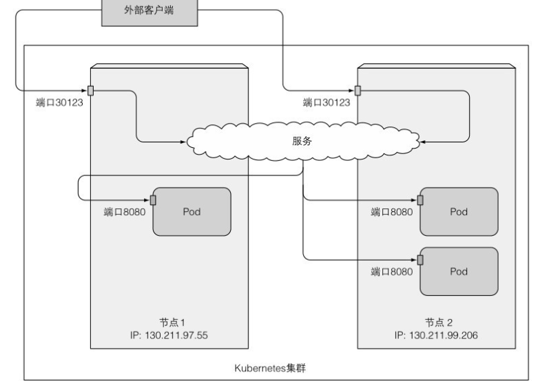

### LoadBalancer 类型的服务

在云提供商上运行的Kubernetes集群通常支持从云基础架构自动提供负载平衡器。

负载均衡器拥有自己独一无二的可公开访问的IP地址，并将所有连接重定向到服务。可以通过负载均衡器的IP地址访问服务。

如果Kubernetes在不支持Load Badancer服务的环境中运行，则不会调配负载平衡器，但该服务仍将表现得像一个NodePort服务。这是因为Load **Balancer服务是NodePort服务的扩展**。

创建一个 LoadBalancer 服务

``` yaml
apiVersion: v1
kind: Service
metadata:
  name: svc3
spec:
  type: LoadBalancerr
  ports:
  - port: 8080	# 集群节点监听的端口
    targetPort: 80	# 提供应用的pod开放的端口
  selector:
    test_app: test_nginx
```

测试发现通过CLUSTERR-IP或者节点IP都可以访问。

使用describe 查看

``` shell
$ kubectl describe svc svc3
...........
  Type     Reason                  Age                   From                Message
  ----     ------                  ----                  ----                -------
  Normal   EnsuringLoadBalancer    2m2s (x7 over 7m17s)  service-controller  The component starts to configure the  load balancer, which takes about 2 minutes
  Warning  SyncLoadBalancerFailed  2m2s (x7 over 7m17s)  service-controller  Error syncing load balancer: failed to ensure load balancer: EnsureLoadBalancer get loadbalance err: GetLoadBalancerByName: invalid parameter: empty name
```

发现本机好像没有load balancer。

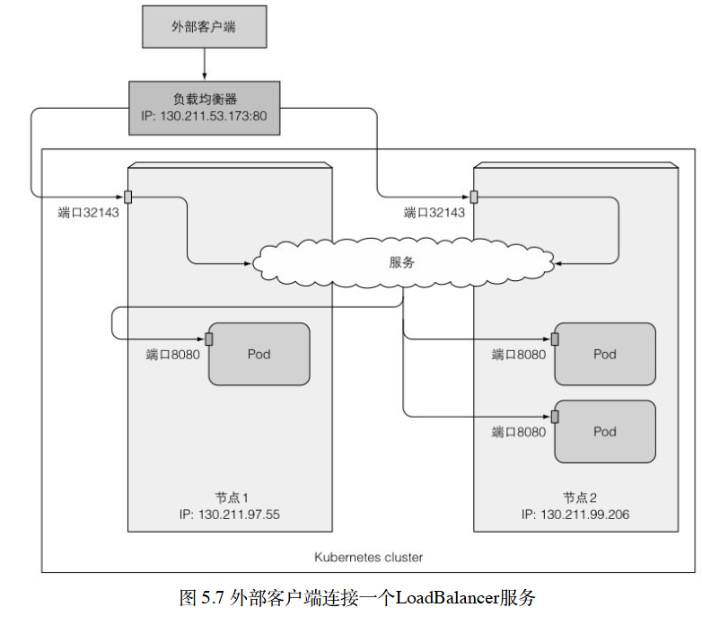

简单来说，LoadBalancer类型的服务是一个具有额外的基础设施提供的负载平衡器NodePort服务。

### headless 类型的服务

Headless Service（无头服务）是一种特殊类型的服务**，它不分配集群 IP 地址，而是直接将 DNS 记录指向后端的 Pod。每个 Pod 都会有自己的 DNS 域名，这些域名可以用于直接访问 Pod。**

headless service 同样使用全限定域名来访问，我们通过dns解析来看。

``` shell
$ nslookup loki-headless.loki.svc.cluster.local 10.233.0.10 #  10.233.0.10 是k8s集群 kube-system 命名空间中coredns的 CLUSTER-IP
Server:         10.233.0.10
Address:        10.233.0.10#53

Name:   loki-headless.loki.svc.cluster.local
Address: 172.19.35.248
Name:   loki-headless.loki.svc.cluster.local
Address: 172.19.66.88
$  k -n loki get pod -owide
NAME                            READY   STATUS    RESTARTS   AGE   IP              NODE                   NOMINATED NODE   READINESS GATES
loki-0                          2/2     Running   0          12d   172.19.35.248   kcs-training-s-v5k57   <none>           <none>
loki-gateway-5b6755f775-lfxmh   1/1     Running   0          12d   172.19.66.88    kcs-training-s-g97wk   <none>           <none>
```

loki-headless service 管理了这里两个pod，可以看到，域名`loki-headless.loki.svc.cluster.local` 被解析成了两个pod 的IP。（普通服务只能解析为服务的地址）

headless service 通常配合 statefulset 使用。

对于一个 Headless Service，每个 Pod 的 DNS 域名遵循以下格式：

``` 
<pod-name>.<service-name>.<namespace>.svc.cluster.local
```

下面进行验证，首先编写yaml

``` yaml
apiVersion: v1
kind: Service
metadata:
  name: svc-headless
spec:
  clusterIP: None
  ports:
  - port: 8080
    targetPort: 80
  selector:	# headless 类型需要标签选择器
    test_app: test_nginx
```

``` shell
$ kubectl get svc
NAME           TYPE        CLUSTER-IP     EXTERNAL-IP   PORT(S)             AGE
kubernetes     ClusterIP   10.233.0.1     <none>        443/TCP             3d6h
svc-headless   ClusterIP   None           <none>        8080/TCP            4s
```

可以看到此服务没有虚拟IP。

为了测试此service，我们首先进入一个pod，再pod中测试

``` shell
$ kubectl exec -it test-lt1 -- /bin/bash

root@test-lt1:/# curl svc-headless.default.svc.cluster.local
<!DOCTYPE html>
<html>
............
```

后端提供nginx 服务的pod 有三个，通过`kubectl logs` 查看日志发现，每次curl 会**轮询**地调度到一个pod上，保证每个pod 都会被调度到。（但这仅仅是通过 DNS 循环机制实现的负载均衡）

> headless服务看起来可能与常规服务不同，但在客户的视角上它们并无不同。即使使用headless服务，客户也可以通过连接到服务的DNS名称来连接到pod上，就像使用常规服务一样。但是对于headless服务，由于DNS返回了pod的IP，**客户端直接连接到该pod**，而不是通过服务代理，相当于绕过了负载均衡器。

### gateway 服务

在很多实际情况中，我们的应用（如 app1）通过service 暴露后，还会创建 gateway 服务（如 app1-gateway）。 app1-gateway 通常会关联 nginx 镜像启动的pod，nginx的启动配置使用 cm 挂载到pod 中，通过cm 的data 可以看到此nginx 的conf。

使用 gateway 服务的目的是将来自客户端的请求均匀地分配给后端的app1实例。还可以通过nginx 实现 验证请求的有效性、检查权限等安全功能。

下面展示了 Loki 的cm的 nginx.conf

``` json
worker_processes  5;  ## 默认值为1
error_log  /dev/stderr;
pid        /tmp/nginx.pid;
worker_rlimit_nofile 8192;

events {
  worker_connections  4096;  ## 默认值为1024
}

http {
  client_body_temp_path /tmp/client_temp;
  proxy_temp_path       /tmp/proxy_temp_path;
  fastcgi_temp_path     /tmp/fastcgi_temp;
  uwsgi_temp_path       /tmp/uwsgi_temp;
  scgi_temp_path        /tmp/scgi_temp;

  client_max_body_size  4M;

  proxy_read_timeout    600;  ## 10分钟
  proxy_send_timeout    600;
  proxy_connect_timeout 600;

  proxy_http_version    1.1;

  default_type application/octet-stream;

  log_format   main '$remote_addr - $remote_user [$time_local]  $status '
                    '"$request" $body_bytes_sent "$http_referer" '
                    '"$http_user_agent" "$http_x_forwarded_for"';
  access_log   /dev/stderr  main;

  sendfile     on;
  tcp_nopush   on;
  resolver     kube-dns.kube-system.svc.cluster.local.;

  server {
    listen            8080;
    listen             [::]:8080;
    auth_basic           "Loki";
    auth_basic_user_file /etc/nginx/secrets/.htpasswd;

    location = / {
      return 200 'OK';
      auth_basic off;
    }

    ########################################################
    # 配置后端目标
    # Distributor
    location = /api/prom/push {
      proxy_pass       http://loki.aiops-logger.svc.cluster.local:3100$request_uri;
    }
    location = /loki/api/v1/push {
      proxy_pass       http://loki.aiops-logger.svc.cluster.local:3100$request_uri;
    }
    location = /distributor/ring {
      proxy_pass       http://loki.aiops-logger.svc.cluster.local:3100$request_uri;
    }
    location = /otlp/v1/logs {
      proxy_pass       http://loki.aiops-logger.svc.cluster.local:3100$request_uri;
    }

    # Ingester
    location = /flush {
      proxy_pass       http://loki.aiops-logger.svc.cluster.local:3100$request_uri;
    }
    location ^~ /ingester/ {
      proxy_pass       http://loki.aiops-logger.svc.cluster.local:3100$request_uri;
    }
    location = /ingester {
      internal;        # 抑制301重定向
    }

    # Ring
    location = /ring {
      proxy_pass       http://loki.aiops-logger.svc.cluster.local:3100$request_uri;
    }

    # MemberListKV
    location = /memberlist {
      proxy_pass       http://loki.aiops-logger.svc.cluster.local:3100$request_uri;
    }

    # Ruler
    location = /ruler/ring {
      proxy_pass       http://loki.aiops-logger.svc.cluster.local:3100$request_uri;
    }
    location = /api/prom/rules {
      proxy_pass       http://loki.aiops-logger.svc.cluster.local:3100$request_uri;
    }
    location ^~ /api/prom/rules/ {
      proxy_pass       http://loki.aiops-logger.svc.cluster.local:3100$request_uri;
    }
    location = /loki/api/v1/rules {
      proxy_pass       http://loki.aiops-logger.svc.cluster.local:3100$request_uri;
    }
    location ^~ /loki/api/v1/rules/ {
      proxy_pass       http://loki.aiops-logger.svc.cluster.local:3100$request_uri;
    }
    location = /prometheus/api/v1/alerts {
      proxy_pass       http://loki.aiops-logger.svc.cluster.local:3100$request_uri;
    }
    location = /prometheus/api/v1/rules {
      proxy_pass       http://loki.aiops-logger.svc.cluster.local:3100$request_uri;
    }

    # Compactor
    location = /compactor/ring {
      proxy_pass       http://loki.aiops-logger.svc.cluster.local:3100$request_uri;
    }
    location = /loki/api/v1/delete {
      proxy_pass       http://loki.aiops-logger.svc.cluster.local:3100$request_uri;
    }
    location = /loki/api/v1/cache/generation_numbers {
      proxy_pass       http://loki.aiops-logger.svc.cluster.local:3100$request_uri;
    }

    # IndexGateway
    location = /indexgateway/ring {
      proxy_pass       http://loki.aiops-logger.svc.cluster.local:3100$request_uri;
    }

    # QueryScheduler
    location = /scheduler/ring {
      proxy_pass       http://loki.aiops-logger.svc.cluster.local:3100$request_uri;
    }

    # Config
    location = /config {
      proxy_pass       http://loki.aiops-logger.svc.cluster.local:3100$request_uri;
    }

    # QueryFrontend, Querier
    location = /api/prom/tail {
      proxy_pass       http://loki.aiops-logger.svc.cluster.local:3100$request_uri;
      proxy_set_header Upgrade $http_upgrade;
      proxy_set_header Connection "upgrade";
    }
    location = /loki/api/v1/tail {
      proxy_pass       http://loki.aiops-logger.svc.cluster.local:3100$request_uri;
      proxy_set_header Upgrade $http_upgrade;
      proxy_set_header Connection "upgrade";
    }
    location ^~ /api/prom/ {
      proxy_pass       http://loki.aiops-logger.svc.cluster.local:3100$request_uri;
    }
    location = /api/prom {
      internal;        # 抑制301重定向
    }
    location ^~ /loki/api/v1/ {
      proxy_pass       http://loki.aiops-logger.svc.cluster.local:3100$request_uri;
    }
    location = /loki/api/v1 {
      internal;        # 抑制301重定向
    }
  }
}
```

### 使用http 请求

比如一个 ClusterIP 类型的服务，我们在集群内部可以通过 `ClusterIP:port/[path]` 的方式来获得服务，同时我们也可以使用 http 请求来获得服务。http请求url 规则：[Service | Kubernetes](https://kubernetes.io/docs/reference/kubernetes-api/service-resources/service-v1/#get-read-the-specified-service)

如果在集群中想要通过http 请求与集群资源交互，最简单的方式是使用 `kubectl proxy` 来开启apiserver 的代码，然后通过`localhost:8001` 就能访问apiserver了。

例如一个名为 loki 的service。通过`curl  localhost:8001/api/v1/namespaces/aiops-logger/services/loki` 可以获得该service 的声明

如果我们想要通过http 请求直接该service 提供的服务，**那么我们需要加上端口，并加上 proxy 前缀**：` curl localhost:8001/api/v1/namespaces/aiops-logger/services/loki:3100/proxy/[path]`，此时，apiserver 就帮助我们将请求转发给对应的service了。

我们使用 client-go 开发controller 时，也可以使用这种方式。client 会自己会apiserver 通信，并将我们的请求转发给对应的service。

## Ingress

另一种方法向集群外部的客户端公开服务的方法——创建Ingress资源。可以将 Ingress 配置为提供服务外部可访问的 URL、负载均衡流量、 SSL / TLS，以及提供基于名称的虚拟主机。Ingress 控制器通常负责通过负载均衡器来实现 Ingress，尽管它也可以配置边缘路由器或其他前端来帮助处理流量。

因此，可以说Ingress是为了弥补NodePort在流量路由方面的不足而生的。使用NodePort，只能将流量路由到一个具体的Service，并且必须使用Service的端口号来访问该服务。但是，使用Ingress，就可以使用自定义域名、路径和其他HTTP头来定义路由规则，以便将流量路由到不同的Service。

**使用service 的缺点**

- nodeport类型的service将服务暴露到集群的所有节点上，访问节点需要节点的IP地址，**不安全也不灵活**。
- 每个LoadBalancer 服务都需要自己的负载均衡器，以及独有的公有IP地址，

**ingress的优点**

- Ingress 只需要一个公网IP 就能为许多服务提供访问。
- Ingress可以通过域名来访问服务，
- Ingress支持基于URL路径的路由，可以根据不同的路径将流量转发给不同的服务。
- Ingress在网络栈（HTTP）的应用层操作，并且可以提供一些服务不能实现的功能，诸如基于cookie的会话亲和性（session affinity）等功能。

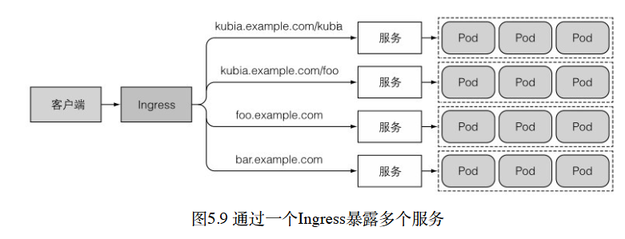

### 安装 ingress controller

一般集群中的**Ingress Controller 以pod 形式运行**，使用 `kubectl get pods -A `查看，如果没有就不支持ingress 功能。如果没有我们可以自己创建。

Ingress 控制器是一个独立的组件，它会监听 Kubernetes API 中的 Ingress 资源变化，并根据定义的路由规则配置负载均衡器、反向代理或其他网络代理，从而实现外部流量的转发。因此，可以将 Ingress 控制器视为 Ingress 资源的实际执行者。

> 总之，Kubernetes 的 Ingress 资源对象需要配合 Ingress 控制器才能实现外部流量的转发和路由。Ingress 控制器是 Ingress 资源的实际执行者，负责根据定义的路由规则配置网络代理。

在 Kubernetes 中，有很多不同的 Ingress 控制器可以选择，例如 Nginx、Traefik、HAProxy、Envoy 等等。不同的控制器可能会提供不同的功能、性能和可靠性，可以根据实际需求来选择合适的控制器。我们此处使用 **Nginx Ingress Controller**。

nginx ingress controller 有多种安装方法，helm或 yaml 安装等，在 [Installation Guide - Ingress-Nginx Controller (kubernetes.github.io)](https://kubernetes.github.io/ingress-nginx/deploy/) 查看安装教程。

我们使用yaml 安装

``` shell
kubectl apply -f https://raw.githubusercontent.com/kubernetes/ingress-nginx/controller-v1.11.1/deploy/static/provider/cloud/deploy.yaml
```

> 如果上述文档地址失效可以去  [Installation Guide - Ingress-Nginx Controller (kubernetes.github.io)](https://kubernetes.github.io/ingress-nginx/deploy/) 查看最新版本

上述 yaml 执行后使用 `kubectl -n ingress-nginx get all` 查看创建的各种资源，如果发现 deploy 和 job 都没有创建成功说明镜像有问题，我们把上述yaml 文件下载到本地并修改相应的镜像后重新创建。

此时需要首先使用 ` kubectl -n ingress-nginx delete job ingress-nginx-admission-create ingress-nginx-admission-patch` 和 `kubectl -n ingress-nginx delete deploy ingress-nginx-controller` 把出错的资源删除，然后修改相应的镜像。

成功创建后，`ingress-nginx` 命名空间下应该会有如下资源

``` shell
$ kubectl -n ingress-nginx get all
NAME                                            READY   STATUS      RESTARTS   AGE
pod/ingress-nginx-admission-create-q2nz4        0/1     Completed   0          90s
pod/ingress-nginx-admission-patch-pg9jn         0/1     Completed   1          90s
pod/ingress-nginx-controller-64c8b484db-j8xt2   1/1     Running     0          90s

NAME                                         TYPE           CLUSTER-IP      EXTERNAL-IP   PORT(S)                      AGE
service/ingress-nginx-controller             LoadBalancer   10.233.37.253   <pending>     80:31390/TCP,443:31044/TCP   86m
service/ingress-nginx-controller-admission   ClusterIP      10.233.48.23    <none>        443/TCP                      86m

NAME                                       READY   UP-TO-DATE   AVAILABLE   AGE
deployment.apps/ingress-nginx-controller   1/1     1            1           90s

NAME                                                  DESIRED   CURRENT   READY   AGE
replicaset.apps/ingress-nginx-controller-64c8b484db   1         1         1       90s

NAME                                       COMPLETIONS   DURATION   AGE
job.batch/ingress-nginx-admission-create   1/1           6s         90s
job.batch/ingress-nginx-admission-patch    1/1           6s         90s
```

> 其中 ingress-nginx-controller Pod是Ingress-nginx的控制器组件，它负责监视Kubernetes API server上的Ingress对象，并根据配置动态地更新Nginx配置文件，实现HTTP(S)的负载均衡和路由。
>
> ingress-nginx-controller Service：这个Service负责将请求转发到ingress-nginx-controller Pods。它通常会将流量分发到ingress-nginx-controller的多个副本中，并确保副本集的负载平衡。这个Service可以被配置为使用NodePort、LoadBalancer或ClusterIP类型，根据需要进行暴露。

但是我们发现 service/ingress-nginx-controller  是 pending 状态，这是因为默认配置为 LoadBalancer 类型，需要云厂商支撑该功能，我们可以改成 NodePort 类型。

具体是在 deploy.yaml 中将名为 ingress-nginx-controller 的Service 资源中，type改成 `NodePort`，并在`targetPort: http` 下面添加一行 `nodePort: 30080`，在`targetPort: https` 下面添加一行 `nodePort: 30443`。

service/ingress-nginx-controller 的 cluster-ip 就是我们创建的 ingress 的 ADDRESS。

修改完成后使用 `kubectl -n ingress-nginx delete svc ingress-nginx-controller` 删除此svc，然后再次使用 apply 应该 deploy.yaml 文件。

### 创建 ingress 资源

首先我们创建一个deployment 其中开两个 nginx 的pod，然后给它配一个 clusterIP的service。注意要在ingress controller 所在的ingress-nginx 这个命名空间下。此步略。结果如下

``` shell
$ kubectl -n ingress-nginx get po,svc
NAME                                            READY   STATUS      RESTARTS   AGE
pod/ingress-nginx-admission-create-q2nz4        0/1     Completed   0          90m
pod/ingress-nginx-admission-patch-pg9jn         0/1     Completed   1          90m
pod/ingress-nginx-controller-64c8b484db-j8xt2   1/1     Running     0          90m
pod/pd1                                         1/1     Running     0          112s

NAME                                         TYPE        CLUSTER-IP      EXTERNAL-IP   PORT(S)                      AGE
service/ingress-nginx-controller             NodePort    10.233.52.27    <none>        80:30080/TCP,443:30443/TCP   37m
service/ingress-nginx-controller-admission   ClusterIP   10.233.48.23    <none>        443/TCP                      175m
service/svc1                                 ClusterIP   10.233.17.126   <none>        8443/TCP,8080/TCP            6s
```

这里，**ingress-nginx-controller 功能通过nodePort 暴露**出来了。

然后查看集群中定义的 IngressClass 对象

``` shell
$ kubectl get ingressclass
NAME    CONTROLLER             PARAMETERS   AGE
nginx   k8s.io/ingress-nginx   <none>       2d2h # 这个nginx控制器就是我们等会要用的
```

> 在k8s中，Ingress 资源对象可以用来暴露服务，将外部流量路由到内部集群服务。但是，在一个集群中，可能需要使用不同的 Ingress 控制器来满足不同的需求，而每个控制器都需要使用不同的配置和规则。这就是 IngressClass 的作用。通过定义不同的 IngressClass，可以为不同的 Ingress 控制器指定不同的配置和规则，从而更好地管理 Ingress 资源对象。

接着定义Ingress资源的YAML文件，用于创建Ingress资源对象，编辑 ing1.yaml：

``` yaml
apiVersion: networking.k8s.io/v1
kind: Ingress
metadata:
  name: ing1
  namespace: ingress-nginx
spec:
  ingressClassName: nginx # 指定我们使用的 IngressClass 
  rules:
  - host: it.ex.com # 将此域名映射到下面的服务
    http:
      paths:
      - path: / 
        pathType: Prefix # pathType 字段指定了路径匹配方式，这里使用了 Prefix 类型，表示只要路径以 / 开头，就匹配成功。
        backend:	 	# backend 字段指定了要将匹配的流量转发到哪个后端（Service）。
          service: 
            name: svc1
            port: 
              number: 8080 # 这里填service的 port
```

想要使用域名访问成功，还需配置`vim /etc/hosts`。即在本机上添加 ingress-nginx-controller Pod 所在节点的节点IP与上述域名的映射。

然后，就可以通过 `curl it.ex.com:30080`来访问了。其中30080 是我们自己设的，service/ingress-nginx-controller 的 NodePort。

### 为Ingress创建TLS认证

当客户端创建到Ingress控制器的TLS连接时，控制器将终止TLS连 接。客户端和控制器之间的通信是加密的，而控制器和后端pod之间的 通信则不是。运行在pod上的应用程序不需要支持TLS。例如，如果pod 运行web服务器，则它只能接收HTTP通信，并让Ingress控制器负责处 理与TLS相关的所有内容。要使控制器能够这样做，需要将证书和私钥 附加到Ingress。这两个必需资源存储在称为Secret的Kubernetes资源中，然后在Ingress manifest 中引用它。

# 7. 将磁盘挂载到容器

在k8s中，每个 pod 都类似一个逻辑主机，在逻辑主机中运行的进程（容器）会共享CPU、RAM、网络接口等资源。但是**pod 的每个容器都有自己独立的文件系统，因为文件系统来自容器镜像**。

为什么需要使用 卷

- 一个pod 的多个容器希望实现数据共享，使用卷来实现。

- 我们希望容器可以对数据进行持久化，此时使用存储卷来实现。

**volume 卷被定义为pod 的一部分**，并**和pod 共享相同的生命周期**。这意味着在pod启动时创建卷，并在删除pod时销毁卷。在重新启动容器之后，新容器可以识别前一个容器写入卷的所有文件。**如果一个pod包含多个容器，那这个卷可以同时被所有的容器使用**。

可用卷的类型：

- emptyDir：用于存储临时数据的简单空目录。
- hostPath：用于**将目录从工作节点 node 的文件系统挂载到pod中**。
- gitRepo：通过检处git 仓库的内容来初始化的卷
- nfs：挂载到pod中的NFS（network file system） 共享卷
- configMap、Secret、downwardAPI：用于将 k8s 部分资源和集群信息公开给pod 的特殊类型的卷。
- **persistentVolumeClaim：一种使用预置或者动态配置的持久存储类型**

单个容器可以同时使用不同类型的多个卷，而且正如我们前面提到的，每个容器都可以装载或不装载卷。

与容器类似，kubernetes中卷是pod的一个组成部分，因此像容器一样在pod的规范中就定义了。它们不是独立的Kubernetes对象，也不能单独创建或删除。

下面是一个示例，一个pod中有三个容器，每个容器都有不同的应用，通过挂载两个存储卷，让它们三个协同工作。

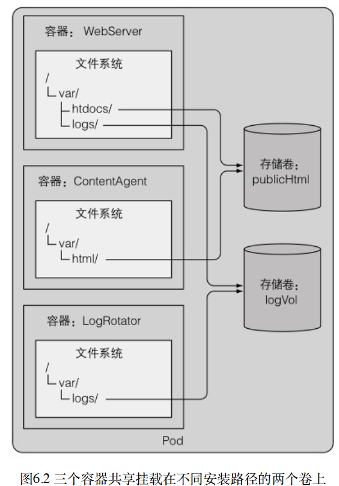

填充或装入卷的过程是在 pod 内的容器启动之前执行的。

## emptyDir：容器间共享数据

最简单的卷是 **emptyDir 卷**，用于存储临时数据的简单空目录。其他类型的卷都是在它的基础上构建的。

如果Pod设置了emptyDir类型Volume，**Pod被分配到Node上时，会创建emptyDir，只要Pod运行在此Node上，emptyDir都会存在**（容器挂掉不会导致emptyDir丢失数据），但是如果Pod从Node上被删除（Pod被删除，或者Pod发生迁移），emptyDir也会被删除，并且永久丢失。

创建含有两个容器和一个数据集的pod

``` yaml
apiVersion: v1
kind: Pod
metadata:
  labels:
    app: nginx                  #pod标签 
  name: nginx-pod1
spec:
  containers:
  - image: loong576/fortune
    name: html-generator
    volumeMounts:             #名为html的卷挂载至容器的/var/htdocs目录
    - name: html
      mountPath: /var/htdocs
  - image: nginx:1.19.5
    name: web-server
    volumeMounts:            #挂载相同的卷至容器/usr/share/nginx/html目录且设置为只读
    - name: html
      mountPath: /usr/share/nginx/html 
      readOnly: true
    ports:
    - containerPort: 80
      protocol: TCP
  volumes:
  - name: html           #卷名为html的emptyDir卷同时挂载至以上两个容器
    emptyDir: {}
```

> 默认emtpyDir会在节点的`/var/lib/kubelet/pods/`路径下，但pod删除此emtpyDir 也会删除

创建service 以访问web-server

``` yaml
apiVersion: v1
kind: Service
metadata:
  name: my-service           #service名
spec:
  type: NodePort
  selector:
    app: nginx                #pod标签,由此定位到pod emptydir-fortune 
  ports:
  - protocol: TCP
    nodePort: 30002          #节点监听端口，暴露静态端口30002对外提供服务
    port: 8881               #ClusterIP监听的端口 
    targetPort: 80           #容器端口 
  sessionAffinity: ClientIP  #是否支持Session,同一个客户端的访问请求都转发到同一个后端Pod
```

访问 CLUSTER-IP:端口  后可以发现，每十秒nginx 返回的html 是不同的，这是我们使用的镜像 loong576/fortune 是定制的，其Dockerfile和脚本如下

Dockerfile：

``` dockerfile
FROM ubuntu:latest

RUN apt-get update ; apt-get -y install fortune
ADD fortuneloop.sh /bin/fortuneloop.sh

ENTRYPOINT /bin/fortuneloop.sh
```

fortuneloop.sh脚本：

``` shell
#!/bin/bash
trap "exit" SIGINT
mkdir /var/htdocs

while :
do
  echo $(date) Writing fortune to /var/htdocs/index.html
  /usr/games/fortune > /var/htdocs/index.html
  sleep 10
done
```

该脚本主要是每10秒钟输出随机短语至index.html文件中。

**结论：**

- 容器 web-server 成功的读取到了容器 html-generator 写入存储的内容，emptyDir卷可以实现容器间的文件共享。
- emptyDir 卷的生存周期与pod的生存周期相关联，所以当删除pod时，卷的内容就会丢失。

此外，作为卷来使用的emptyDir，是在承载pod的工作节点的实际磁盘上创建的，因此其性能取决于节点的硬盘性能， 但我们可以通知Kubernetes在tmfs文件系统（存在内存而非硬盘）上创建emptyDir。因此，将emptyDir的medium设置为Memory：

``` yaml
volumes:
  - name: html
    emptyDir:
      medium: Memory
```

## hostPath：挂载节点文件

大多数pod应该忽略它们的主机节点，因此它们不应该访问节点文件系统上的任何文件。但是某些系统级别的pod（切记，这些通常由DaemonSet管理）确实**需要读取节点的文件或使用节点文件系统来访问节点设备**。

此时我们使用 **hostPath 卷**，它是一种持久性存储。

hostPath 卷指向节点文件系统上的特定文件或目录。在同一个节点上运行并且其 hostPath 卷使用相同路径的pod 可以看到相同的文件。如果删除了一个pod，并且下一个pod使用了指向主机上相同路径的hostPath卷，则新pod将会发现上一个pod留下的数据，但前提是必须将其调度到与第一个pod相同的节点上。

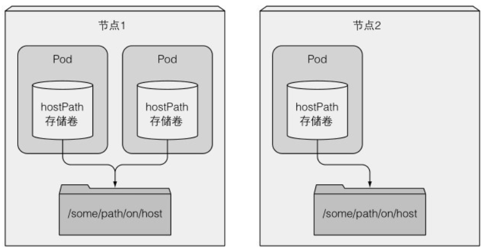

下面创建一个` hostPath-pod.yaml`试试

```yaml
apiVersion: v1
kind: Pod
metadata:
  labels:
    app: prod 
  name: hostpath-nginx 
spec:
  containers:
  - image: aiops-899f5654.ecis.huhehaote-1.cmecloud.cn/public/nginx
    name: c1
    volumeMounts:
    - mountPath: /usr/share/nginx/html # 容器内文件挂载点
      name:  nginx-volume	# 挂载卷名 
  volumes:
  - name: nginx-volume
    hostPath:
      path: /data	# 准备挂载的node 上的文件系统
```

使用 `kubectl create -f hostPath-pod.yaml` 完成创建。

然后通过 curl 该pod所在node 的 IP 地址来访问该nginx。

``` shell
$ kubectl get pod -owide 
# 查看创建的pod 所在的ndoe的IP
$ curl 节点IP
# 发现报错 403
```

报403 是因为 nginx默认html页面丢失，我们使用ssh 进入到pod 所在节点，然后是用 `echo "hello" > /data/index.html` 创建一个nginx 首页文件。之后再`curl 节点IP` 发现输出 `hello`。

**结论：**

- pod运行在node上，访问的内容为为挂载的文件系统/data下index.html内容，容器成功读取到挂载的节点文件系统里的内容。
- 仅当需要**在节点上读取或写入**系统文件时才使用hostPath , 切勿使用它们来持久化跨pod的数据。
- hostPath可以实现持久存储，但是在node节点故障时，也会导致数据的丢失。

## nfs：共享存储

**emptyDir 可以提供不同容器间的文件共享，但不能存储；hostPath可以为不同容器提供文件的共享并可以存储，但受制于节点限制，不能跨节点共享**；

NFS 是 **Network File System** 的缩写，即网络文件系统。Kubernetes中通过简单地配置就可以挂载NFS到Pod中，而NFS中的数据是可以永久保存的，同时NFS支持同时写操作。

下面展示创建创建挂载 nfs 的pod 的资源文件

``` yaml
apiVersion: v1
kind: Pod
metadata:
  name: pod名
spec:
  containers:
  - image: 容器镜像
    name: 容器名
    volumeMounts:
    - name: nfs-data  #挂载的卷名，与下面的volumes的name保持一致
      mountPath: /data/db  # 容器内，数据存放的路径
    ports:
    - containerPort: xxx # 容器暴露的端口
      protocol: TCP
  volumes:
  - name: nfs-data          # 卷名
    nfs:
      server: 192.168.199.200         # nfs服务器ip，写本机实际IP地址
      path: /backup                # nfs服务器对外提供的共享目录
```

下面在minikube中的k8s演示 nfs。

首先需要在本机安装一个NFS  服务器。

- 执行 `sudo apt update` ，`sudo apt install nfs-kernel-server` 下载 nfs 服务器软件
- 创建一个 NFS 共享目录 `mkdir /home/ubt/backup`
- 配置nfs 服务器，编辑 `/etc/exports`，在最后添加 `/home/ubt/backup 192.168.49.0/24(rw,sync,no_subtree_check)`，其中的IP地址是k8s 集群所在网络的网络地址（写成* 也可以），通过`kubectl get node -owide` 可以查看集群节点的IP地址。
- 重启 NFS 服务器：`sudo systemctl restart nfs-kernel-server`
- 查看当前 nfs 状态 ：`sudo exportfs`

接着在k8s集群中创建一个pod，以 nginx 镜像为例，我们将nfs 共享目录挂载到容器的ngnix默认页面的目录，通过在外部直接修改ngnix默认页面可以直观地看到变化。

- 创建pod的配置文件 `nginx-pod.yaml`

``` yaml
apiVersion: v1
kind: Pod
metadata:
  name: pod-nfs
spec:
  containers:
  - image: nginx:1.19.6
    name: c1
    volumeMounts:
    - name: nfs-data  #挂载的卷名，与下面的volumes的name保持一致
      mountPath: /usr/share/nginx/html  # 容器内，数据存放的路径
    ports:
    - containerPort: 80 # 容器暴露的端口
      protocol: TCP
  volumes:
  - name: nfs-data          # 卷名
    nfs:
      server: 192.168.200.133         #nfs服务器ip, 本机nfs时写本机实际IP地址
      path: /home/ubt/backup                #nfs服务器对外提供的共享目录
```

- 使用 kubectl 创建 Nginx Pod：`kubectl apply -f nginx-pod.yaml`

在本机的 NFS 中修改 index.html

- 在本机的 `/home/ubt/backup` 目录下找到并修改 Nginx 默认的 index.html 文件
- 访问 Nginx Pod 的 IP 地址，即可看到修改后的 index.html 内容

**结论：**

- NFS共享存储可持久化数据，因为是存在网络文件系统中。
- NFS共享存储可跨节点提供数据共享。

## PV and PVC：持久卷与持久卷声明

我们上面描述的三种数据卷类型都需要开发人员对底层使用的文件系统非常了解。但这种情况违背了k8s的设计理念，此理念旨在向应用程序和开发人员隐藏真实的基础设施，开发人员不需要知道底层使用的是哪种存储技术，与基础设施相关的交互是集群管理员来控制的。

k8s 中使用 `PersistentVolume` 和 `PersistentVolumeClaim` 来使的集群具有对存储的逻辑抽象能力，使得在配置Pod的逻辑里可以忽略对实际后台存储技术的配置，而把这项配置的工作交给PV的配置者，即集群的管理者。**PV和PVC 是一一对应的。**

这里`PersistentVolume` 和 `PersistentVolumeClaim` 的关系很像`node`和 `pod` 的关系。

- `PersistentVolume` 和 `Node` 是**资源的提供者**，根据集群的基础设施的变化而变化，由k8s 集群的管理者来配置
- `PersistentVolumeClaim` 和 `Pod` 是**资源的使用者**，根据业务的需求变化而变化，有k8s 集群的使用者即服务开发人员来配置

当集群用户需要使用持久化存储时，他们首先创建PVC 清单，指定所需要的最低容量要求和访问模式，然后用户将持久卷声明PVC 提交给 kuberneters API server，k8s 将找到可匹配的PV 并将其绑定到PVC。PVC 可以当作pod 的一个卷来使用，其他用户不能使用相同的PV，除非先通过删除PVC绑定来释放。

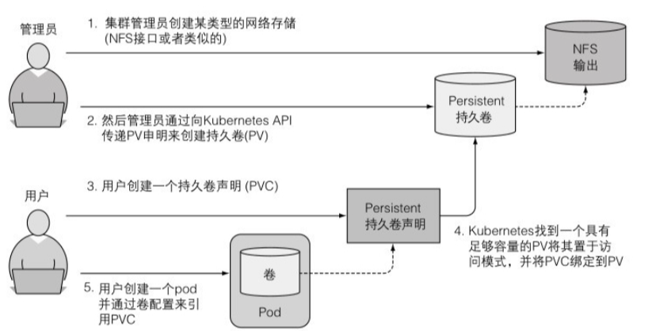

> PV 不属于任何命名空间，它和node 一样是集群层面的资源，而pod和PVC属于某个命名空间的。

一般PVC和PV是一起创建使用删除的，创建时PV打上标签，PVC 使用标签选择器选择特定的PV。

下面在minikube中的k8s演示 PV 和 PVC 。

按照类似于上一节nfs中的测试过程，我首先创建了三个 nfs 共享目录

``` shell
$ sudo exportfs # 查看nfs 
/home/ubt/backup/v1
		192.168.49.0/24
/home/ubt/backup/v2
		192.168.49.0/24
/home/ubt/backup/v3
		192.168.49.0/24
```

### 创建PV 资源

编辑 pv1.yaml

``` yaml
apiVersion: v1
kind: PersistentVolume
metadata:
  name: pv1
spec:
  capacity:
    storage: 2Gi          #指定PV容量为2G
  volumeMode: Filesystem  #卷模式，默认为Filesystem，也可设置为'Block'表示支持原始块设备
  accessModes:
    - ReadWriteOnce	     # 只能被一个节点挂载为读写模式。
  persistentVolumeReclaimPolicy: Retain # 保留策略，当持久卷被释放时的回收策略为保留（Retain），不会自动删除持久卷中的数据。
  storageClassName: nfs
  nfs:        	#指定NFS共享目录和IP信息
    server: 192.168.200.133
    path: /home/ubt/backup/v1
--- # 以三个横线为分隔写下一个资源
apiVersion: v1
kind: PersistentVolume
metadata:
  name: pv2
spec:
  capacity:
    storage: 2Gi   #指定PV容量为2G
  volumeMode: Filesystem  #卷模式，默认为Filesystem，也可设置为'Block'表示支持原始块设备
  accessModes:
    - ReadOnlyMany #######访问模式，该卷可以被**多个**节点以**只读模式**挂载
  persistentVolumeReclaimPolicy: Retain   #回收策略，Retain（保留），表示手动回收
  storageClassName: nfs     #类名，PV可以具有一个类，一个特定类别的PV只能绑定到请求该类别的PVC
  nfs:                                       #指定NFS共享目录和IP信息
    server: 192.168.200.133
    path: /home/ubt/backup/v2
---
apiVersion: v1
kind: PersistentVolume
metadata:
  name: pv3
spec:
  capacity:
    storage: 1Gi 
  volumeMode: Filesystem   
  accessModes:
    - ReadWriteOnce
  persistentVolumeReclaimPolicy: Retain 
  storageClassName: nfs   
  nfs:
    server: 192.168.200.133
    path: /home/ubt/backup/v3
```

> **PV的访问模式有三种：**
>
> - `ReadWriteOnce`：是最基本的方式，可读可写，但只支持被单个Pod挂载。
> - `ReadOnlyMany`：可以以只读的方式被多个Pod挂载。
> - `ReadWriteMany`：这种存储可以以读写的方式被多个Pod共享。不是每一种存储都支持这三种方式，像共享方式，目前支持的还比较少，比较常用的是NFS。
>
> **卷可以处于以下的某种状态：**
>
> - Available（可用），一块空闲资源还没有被任何声明绑定
> - Bound（已绑定），卷已经被声明绑定
> - Released（已释放），声明被删除，但是资源还未被集群重新声明
> - Failed（失败），该卷的自动回收失败

创建PV

``` shell
$ kubectl create -f pv1.yaml
persistentvolume/pv1 created
persistentvolume/pv2 created
persistentvolume/pv3 created
s$ k get pv
NAME   CAPACITY   ACCESS MODES   RECLAIM POLICY   STATUS      CLAIM   STORAGECLASS   VOLUMEATTRIBUTESCLASS   REASON   AGE
pv1    2Gi        RWO            Retain           Available           nfs            <unset>                          5s
pv2    2Gi        ROX            Retain           Available           nfs            <unset>                          5s
pv3    1Gi        RWO            Retain           Available           nfs            <unset>                          5s
```

### 创建PVC

编辑pvc1.yaml

``` yaml
apiVersion: v1
kind: PersistentVolumeClaim
metadata:
  name: pvc1  #声明的名称，当做pod的卷使用时会用到
spec:
  accessModes: 
    - ReadWriteOnce   #访问卷模式，筛选PV条件之一
  volumeMode: Filesystem   #卷模式，与PV保持一致，指示将卷作为文件系统或块设备使用
  resources:   #声明可以请求特定数量的资源,筛选PV条件之一
    requests:
      storage: 2Gi
  storageClassName: nfs  #请求特定的类，与PV保持一致，否则无法完成绑定 
```

创建，并展示，可以看到PV1 被选中了。

``` shell
$ kubectl create -f pvc1.yaml 
persistentvolumeclaim/pvc1 created
$ kubectl get pvc
NAME   STATUS   VOLUME   CAPACITY   ACCESS MODES   STORAGECLASS   VOLUMEATTRIBUTESCLASS   AGE
pvc1   Bound    pv1      2Gi        RWO            nfs            <unset>                 5s
$ kubectl get pv
NAME   CAPACITY   ACCESS MODES   RECLAIM POLICY   STATUS      CLAIM          STORAGECLASS   VOLUMEATTRIBUTESCLASS   REASON   AGE
pv1    2Gi        RWO            Retain           Bound       default/pvc1   nfs            <unset>                          21m
pv2    2Gi        ROX            Retain           Available                  nfs            <unset>                          21m
pv3    1Gi        RWO            Retain           Available                  nfs            <unset>                          21m
```

可以看到pvc1已经绑定了pv1。我们声明了三个 PV，而声明的PVC要求2Gi，访问类型是ReadWriteOnce， 对应如下：

|          | pv1                              | pv2                    |               pv3                |
| -------- | -------------------------------- | ---------------------- | :------------------------------: |
| 容量大小 | 2Gi :heavy_check_mark:           | 2Gi :heavy_check_mark: |             1Gi :x:              |
| 访问模式 | ReadWriteOnce :heavy_check_mark: | ReadOnlyMany :x:       | ReadWriteOnce :heavy_check_mark: |

显然只有 PV1 会被选中。

### 创建pod验证

编写 pod4.yaml

``` yaml
apiVersion: v1
kind: Pod
metadata:
  name: pod-pvc
spec:
  containers:
  - image: nginx:1.19.6
    name: c1
    volumeMounts:
    - name: pvc-data  #挂载的卷名，与下面的volumes的name保持一致
      mountPath: /usr/share/nginx/html  # 容器内，数据存放的路径
    ports:
    - containerPort: 80 # 容器暴露的端口
      protocol: TCP
  volumes:
  - name: pvc-data          # 卷名
    persistentVolumeClaim:
      claimName: pvc1 # 与我们声明的PVC名字要一致
```

使用 `kubectl create -f pod4.yaml` 创建pod

然后在v1 文件准备一个内容为 hello v1 的 index.html 文件。接着验证

``` shell
$ k exec -it pod-pvc -c c1 -- /bin/bash # 进入容器
root@pod-pvc:/# curl 127.0.0.1
hello v1
```

验证成功

PVC 绑定到 PV 后，PV的容量是多少，PVC的容量就是多少了。

### 回收持久卷

假设我们的pod任务完成了，需要删除

``` shell
$ kubectl delete po pod-pvc
pod "pod-pvc" deleted
$ kubectl get pvc	# 再次查看pvc
NAME   STATUS   VOLUME   CAPACITY   ACCESS MODES   STORAGECLASS   VOLUMEATTRIBUTESCLASS   AGE
pvc1   Bound    pv1      2Gi        RWO            nfs            <unset>                 20m
```

再次查看pvc，pvc的状态没有任何变化。此时再次开启上述pod，挂载目录中的文件还是可以没有任何变化的访问。

如果我们删除pod后还需要回收pvc 资源供其他pod 使用，此时

``` shell
$ kubectl delete pod pod-pvc # 删除pod
pod "pod-pvc" deleted
$ kubectl delete pvc pvc1  # 删除pvc
persistentvolumeclaim "pvc1" deleted
$ kubectl get pvc # 确认pvc已被删除
No resources found in default namespace.
$ kubectl create -f pvc1.yaml # 再次创建上述pvc
persistentvolumeclaim/pvc1 created
$ kubectl get pvc # 列出 pvc
NAME   STATUS    VOLUME   CAPACITY   ACCESS MODES   STORAGECLASS   VOLUMEATTRIBUTESCLASS   AGE
pvc1   Pending                                      nfs            <unset>                 2s
$ kubectl get pv # 列出 pv
NAME   CAPACITY   ACCESS MODES   RECLAIM POLICY   STATUS      CLAIM          STORAGECLASS   VOLUMEATTRIBUTESCLASS   REASON   AGE
pv1    2Gi        RWO            Retain           Released    default/pvc1   nfs            <unset>                          31m
pv2    2Gi        ROX            Retain           Available                  nfs            <unset>                          31m
pv3    1Gi        RWO            Retain           Available                  nfs            <unset>                          31m
```

 查看pvc发现它此时的状态不像最开始那样立刻挂载到pv1，而是挂起的状态。而pv 中pv1 的状态status 不是最开始的**绑定 Bound** ，也不是其他未使用的pv 的**可用 Available** ，而是变成了 **释放Released** 。（此时我们再创建上述的pod 是创建不去来的）

这是因为这个持久卷 pv 之前被人使用过了，它可能包含前一个声明人的数据，如果集群管理员没来得及清理，那么就不应该将这个卷绑定到全新的持久卷声明中。

此时需要回收持久卷后才能再次使用。

在pv的声明中可以指定的回收策略如下：

- **Retain**（保留）：在持久卷被释放后，保留持久卷的数据。管理员需要手动处理持久卷的释放和数据清理工作。
- **Delete**（删除）：在持久卷被释放后，自动删除持久卷中的数据。
- Recycle（回收）：已废弃，不再推荐使用。在持久卷被释放后，将持久卷中的数据清空，以便下一个使用者。
- **Dynamic Provisioning with Reclaim Policy**（动态分配）：当使用动态存储类进行动态分配持久卷时，可以通过存储类（StorageClass）的回收策略来指定持久卷的回收策略。

回收的方法分为手动回收或自动回收。

**手动回收**

如果设置的pv回收策略是 **Retain**（保留），则需要手动回收。方法是**删除并重新创建持久卷资源**。当这样操作时，你将决定如何处理底层存储中的文件：可以删除这些文件，也可以闲置不用，以便在下一个pod中复用它们。

**自动回收持久卷**

如果设置的pv回收策略是**Delete**（删除），会自动清空。

## StorageClass：持久卷的动态卷配置

在一个大规模的Kubernetes集群里，可能有成千上万个PVC。这就意味着运维人员必须实现创建出这个多个PV。此外，随着项目的需要,会有新的PVC不断被提交，那么运维人员就需要不断的添加新的满足要求的PV，否则新的Pod就会因为PVC绑定不到PV而导致创建失败。而且通过 PVC 请求到一定的存储空间也很有可能不足以满足应用对于存储设备的各种需求。（**PVC数量多、要求多，手动管理PV 难以满足需求**）

Kubernetes 又为我们引入了一个新的资源对象：StorageClass，这是一套可以自动创建PV的机制（Dynamic Provisioning）。通过 StorageClass 的定义，管理员可以将存储资源定义为某种类型的资源，比如快速存储、慢速存储等，用户根据 StorageClass 的描述就可以非常直观的知道各种存储资源的具体特性了，这样就可以根据应用的特性去申请合适的存储资源了。（**利用 StorageClass 实现PV的自动化。根据PVC需求，自动构建相对应的PV持久化存储卷**）

StorageClass对象会定义下面两部分内容:

- PV的属性.比如,存储类型,Volume的大小等.
- 创建这种PV需要用到的存储插件

有了这两个信息之后,Kubernetes就能够根据用户提交的PVC,找到一个对应的StorageClass,之后Kubernetes就会调用该StorageClass声明的存储插件,进而创建出需要的PV.
但是其实使用起来是一件很简单的事情,你只需要根据自己的需求,编写YAML文件即可,然后使用kubectl create命令执行即可

如下图所示，StorageClass 对底层存储资源分类封装，供pvc使用。

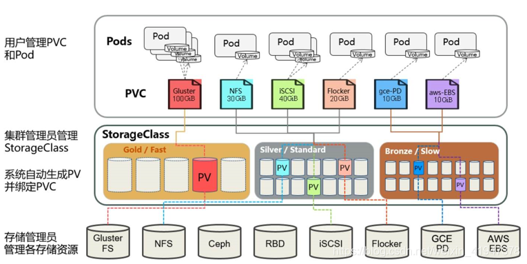

下图是持久卷动态配置过程。

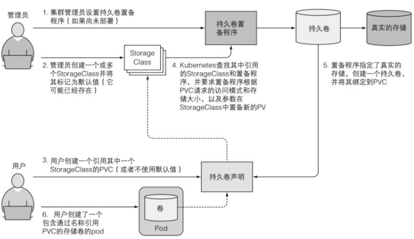

下面以 StorageClass + NFS 来讲解

### 创建StorageClass

要使用 StorageClass，我们就得安装对应的自动配置程序 Provisioner ，比如我们这里存储后端使用的是 nfs，那么我们就需要使用到一个 nfs-client 的自动配置程序。这个程序使用我们已经配置好的 nfs 服务器，来自动创建持久卷，也就是自动帮我们创建 PV。

```shell
1.自动创建的 PV 以${namespace}-${pvcName}-${pvName}这样的命名格式创建在 NFS 服务器上的共享数据目录中
2.而当这个 PV 被回收后会以archieved-${namespace}-${pvcName}-${pvName}这样的命名格式存在 NFS 服务器上。
```

还是在 minikube 搭建的单机k8s 上做实验。

类似于 nfs 章节的配置过程，我们配置如下 nfs 服务如下

``` shell
$ exportfs
/home/ubt/backup/sc
		192.168.49.0/24
```

使用以下文档 **rbac.yaml** 配置account及相关权限

``` yaml
apiVersion: v1
kind: ServiceAccount
metadata:
  name: nfs-client-provisioner
  # replace with namespace where provisioner is deployed
  namespace: default        #根据实际环境设定namespace,下面类同
---
kind: ClusterRole
apiVersion: rbac.authorization.k8s.io/v1
metadata:
  name: nfs-client-provisioner-runner
rules:
  - apiGroups: [""]
    resources: ["persistentvolumes"]
    verbs: ["get", "list", "watch", "create", "delete"]
  - apiGroups: [""]
    resources: ["persistentvolumeclaims"]
    verbs: ["get", "list", "watch", "update"]
  - apiGroups: ["storage.k8s.io"]
    resources: ["storageclasses"]
    verbs: ["get", "list", "watch"]
  - apiGroups: [""]
    resources: ["events"]
    verbs: ["create", "update", "patch"]
---
kind: ClusterRoleBinding
apiVersion: rbac.authorization.k8s.io/v1
metadata:
  name: run-nfs-client-provisioner
subjects:
  - kind: ServiceAccount
    name: nfs-client-provisioner
    # replace with namespace where provisioner is deployed
    namespace: default
roleRef:
  kind: ClusterRole
  name: nfs-client-provisioner-runner
  apiGroup: rbac.authorization.k8s.io
---
kind: Role
apiVersion: rbac.authorization.k8s.io/v1
metadata:
  name: leader-locking-nfs-client-provisioner
    # replace with namespace where provisioner is deployed
  namespace: default
rules:
  - apiGroups: [""]
    resources: ["endpoints"]
    verbs: ["get", "list", "watch", "create", "update", "patch"]
---
kind: RoleBinding
apiVersion: rbac.authorization.k8s.io/v1
metadata:
  name: leader-locking-nfs-client-provisioner
subjects:
  - kind: ServiceAccount
    name: nfs-client-provisioner
    # replace with namespace where provisioner is deployed
    namespace: default
roleRef:
  kind: Role
  name: leader-locking-nfs-client-provisioner
  apiGroup: rbac.authorization.k8s.io
```

创建NFS资源的StorageClass文件 **nfs-StorageClass.yaml** 

```yaml
apiVersion: storage.k8s.io/v1
kind: StorageClass
metadata:
  name: managed-nfs-storage
provisioner: lt-nfs-storage #这里的名称要和provisioner配置文件中的环境变量PROVISIONER_NAME保持一致
parameters:  
  archiveOnDelete: "false"
```

创建NFS provisioner应用的文件**nfs-provisioner.yaml**

``` yaml
apiVersion: apps/v1
kind: Deployment
metadata:
  name: nfs-client-provisioner
  labels:
    app: nfs-client-provisioner
  # replace with namespace where provisioner is deployed
  namespace: default  #与RBAC文件中的namespace保持一致
spec:
  replicas: 1
  strategy:
    type: Recreate
  selector:
    matchLabels:
      app: nfs-client-provisioner
  template:
    metadata:
      labels:
        app: nfs-client-provisioner
    spec:
      serviceAccountName: nfs-client-provisioner
      containers:
        - name: nfs-client-provisioner
          image: vbouchaud/nfs-client-provisioner # 需要准备这个镜像，它是nfs provisioner插件，可能需要更换
          volumeMounts:
            - name: nfs-client-root
              mountPath: /persistentvolumes # 挂载在容器中的目录
          env:
            - name: PROVISIONER_NAME
              value: lt-nfs-storage  #provisioner名称,请确保该名称与 nfs-StorageClass.yaml文件中的provisioner名称保持一致
            - name: NFS_SERVER
              value: 192.168.200.133   #NFS Server IP地址
            - name: NFS_PATH  
              value: /home/ubt/backup/sc    #NFS挂载卷
      volumes:
        - name: nfs-client-root
          nfs:
            server: 192.168.200.133  #NFS Server IP地址
            path: /home/ubt/backup/sc     #NFS 挂载卷
```

这里发现 `quay.io/external_storage/nfs-client-provisioner:latest` 这里镜像已经无法拉取了，我们使用`docker search nfs-client-provisioner ` 搜索一下，然后换一个下载 `vbouchaud/nfs-client-provisioner`。

将上述三个文件按顺序执行后，可以使用`kubectl get pod` 发现多了一个名为`nfs-client-provisioner-xx-xx` 的pod，这是nfs provisioner 程序，确保此pod 处于运行状态。

### 创建测试pod

首先创建pvc，test-claim.yaml

``` yaml
apiVersion: v1
kind: PersistentVolumeClaim
metadata:
  name: test-claim
  annotations:
    storageClassName: "managed-nfs-storage"   #与nfs-StorageClass.yaml metadata.name保持一致 ,  这里的键以前叫 volume.beta.kubernetes.io/storage-class
spec:
  accessModes:
    - ReadWriteMany
  resources:
    requests:
      storage: 1Mi
```

使用 `kubectl create -f test-claim.yaml` 执行它后发现此pvc 无法创建成功，查看描述发现是因为无法在 NFS provisioner 的pod 的/persistentvolumes 目录下创建目录，因为permission denied。暂时无法解决。

如果上述pvc 成功创建，那么通过是有一个pv 被自动创建，如果是别人的教程里面的结果。

``` shell
[root@k8s-master-155-221 deploy]# kubectl get pvc
NAME         STATUS   VOLUME                                     CAPACITY   ACCESS MODES   STORAGECLASS          AGE
test-claim   Bound    pvc-aae2b7fa-377b-11ea-87ad-525400512eca   1Mi        RWX            managed-nfs-storage   2m48s
[root@k8s-master-155-221 deploy]# kubectl get pv
NAME                                       CAPACITY   ACCESS MODES   RECLAIM POLICY   STATUS   CLAIM                STORAGECLASS          REASON   AGE
pvc-aae2b7fa-377b-11ea-87ad-525400512eca   1Mi        RWX            Delete           Bound    default/test-claim   managed-nfs-storage            4m13s
```

此时可以创建一个测试的pod，test-pod.yaml

``` yaml
kind: Pod
apiVersion: v1
metadata:
  name: test-pod
spec:
  containers:
  - name: test-pod
    image: busybox:1.24
    command:
      - "/bin/sh"
    args:
      - "-c"
      - "touch /mnt/SUCCESS && exit 0 || exit 1"   #创建一个SUCCESS文件后退出
    volumeMounts:
      - name: nfs-pvc
        mountPath: "/mnt"
  restartPolicy: "Never"
  volumes:
    - name: nfs-pvc
      persistentVolumeClaim:
        claimName: test-claim  #与PVC名称保持一致
```

# 8. ConfigMap和Secret：配置应用程序

几乎所有的应用都需要配置信息，包括部署应用的区分设置、访问外部系统的证书等等。并且这些配置数据不应该嵌入应用本身。

如果只能前面的知识，我们可以实现上述需求的方式为：给启动容器传递命令行参数，给容器设置自定义环境变量，挂载卷到容器中。

k8s中使用一个顶级资源对象 ConfigMap来实现上述功能，而对于一些保证安全的数据，则使用一个名叫 Secret 的一级对象来实现。

> configMap和secret 都是关联于某个命名空间的

## 向容器传递命令行参数

我们首先尝试在 pod 定义时直接向容器传递参数。在Kubernetes中定义容器时，镜像的ENTRYPOINT和CMD均可以覆盖，仅需在容器定义中设置属性command和args的值，如下面的代码清单所示。

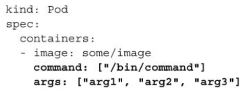

如果容器使用的镜像在构建时使用 ENTRYPOINT 或 CMD 执行的命令可以接收参数，那么在pod启动容器时可以不写 command 直接写 args 来覆盖参数。

> 注意 command和args字段在pod创建后无法被修改。

## 为容器设置环境变量

同一个pod中的**不同容器可以设置独立的环境变量**。因为容器环境变量的设置在pod 文件的容器项目之下。

``` yaml
apiVersion: v1
kind: Pod
metadata:
  labels:
    app: nginx  
  name: pd1
spec:
  containers:
  - image: nginx:1.19.5
    env:
    - name: HELLO
      value: world # yaml清单中有多个环境变量可以引用赋值
    name: c1
    ports:
    - containerPort: 80
      protocol: TCP
```

如上所示，给容器设置环境变量后，容器中的程序便可以使用该环境变量了。

``` shell
$ kubectl create -f pod6-cmd.yaml 
pod/pd1 created
$ kubectl exec -it pd1 -- bash
root@pd1:/# echo $HELLO
world
```

> 注意：不要忘记在每个容器中，**Kubernetes会自动暴露相同命名空间下每个service对应的环境变量**。这些环境变量基本上可以被看作自动注入的配置。

## 利用ConfigMap解耦配置

应用配置的关键在于能够在多个环境（开发、测试和生产环境）中区分配置选项，将配置从应用程序源码中分离，可频繁变更配置值。如果将pod定义描述看作是应用程序源代码，显然需要将配置移出pod定义

Kubernetes允许将配置选项分离到单独的资源对象ConfigMap中，本质上就是一个键/值对映射，值可以是短字面量，也可以是完整的配置文件。

应用无须直接读取**ConfigMap，其内容通过环境变量或者卷文件（见下图）传递给容器**。命令行参数也可以通过 `$(ENV_VAR)` 语法引用环境变量，因而可以达到将ConfigMap的条目当作命令行参数传递给进程的效果。

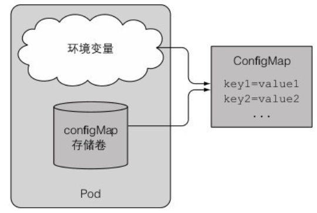

pod是通过名称引用 ConfigMap 的，因此可以在多环境下使用相同的pod定义描述，ConfigMap 在不同环境下拥有不同的配置，保持不同的配置值以适应不同环境。（**同一个pod定义，不同的ConfigMap配置，完成环境区分**）

### 创建 ConfigMap

简单的配置可以通过命令 `kubectl create configmap cm名 --键1=值1 --键2=值2 ` 来设置。（ ConfigMap 缩写为 cm）

``` yaml
apiVersion: v1
kind: ConfigMap
metadata:
  name: test-config
data:
  sleep-interval: "25" # 数字需要用引号
  hello: world	# 字符串不需要
```

接着仍然使用 `kubectl create -f test-cm.yaml` 即可创建。

**可以使用其他格式的配置文件**，从文件来创建 configMap，比如为了把某脚本文件传入容器，可以使用cm。

例如下图为 `my-nginx-config.conf ` 文件清单：


使用命令

``` shell
$ kubectl create configmap cm名 --from-file=my-nginx-config.conf 
```

将文件创建为 cm。生成的cm 中，只有一个键值对，文件名为key，所有文件内容为 value。

接着使用命令查看`kubectl get configmap cm名 -oyaml `

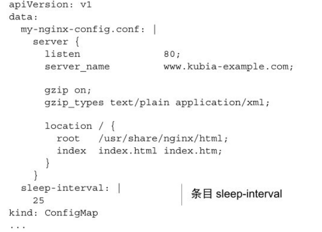

可以看出，这种方式是将文件名作为key，整个文件内容作为value 进行保存。

k8s还支持从多种类型的文件或文件夹来创建配置。示例如下图

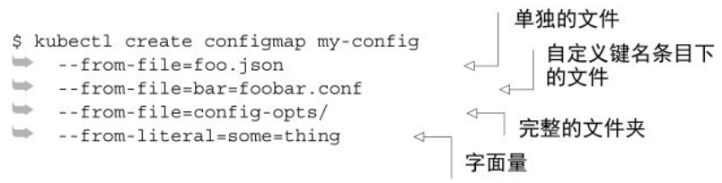

不过kubectl会为文件夹中的每个文件单独创建条目。

### 容器使用ConfigMap

容器使用ConfigMap 有多种方法.

**1、让容器使用 cm 最简单的方法是将 cm 的条目作为环境变量。**

如下是一个pod 的清单:

``` yaml
apiVersion: v1
kind: Pod
metadata:
  name: p1
spec
  containers:
  - image: nginx
    env:
    - name: interval
      valueFrom:
        configMapKeyRef:
          name: test-config
          key: sleep-interval
......
```

上述yaml中给pod 设置了一个环境变量interval，其值设置为名为test-config的 configMap 中键名为sleep-interval 对应的值。

> 如果创建pod时引用的 ConfigMap 不存在会启动容器失败，该ConfigMap 创建后容器也会自动重启。
>
> 不过也可以设置pod 对ConfigMap 的引用是弱引用，（ 设置configMapKeyRef.optional: true）。此时即使 ConfigMap 不存在容器也能启动。

**2、一次性传递ConfigMap的所有条目作为环境变量**

如上 test-config 的cm有sleep-interval 和 hello 两个键。

定义pod 的yaml文件示例

``` yaml
...
spec:
  containers:
  - image: nginx
    envFrom:	# 此时使用 envFrom 字段
    - prefix: CONFIG_	 # 设置环境变量的前缀 CONFIG_（可选字段）
      configMapRef:
        name: test-config # 引用名为 test-config 的cm
...
```

> 注意： ConfigMap 中的键名如果配置到pod 的环境变量中需要满足命名要求（自行查看k8s pod环境变量的命名要求），不满足的键名会被忽略，没有报错或提示。

**3、传递ConfigMap 条目作为命令行参数**

字段pod.spec.containers.args中无法直接引用ConfigMap的条目，但是可以利用ConfigMap条目初始化某个环境变量，然后再在参数字段中引用该环境变量。

如下图：

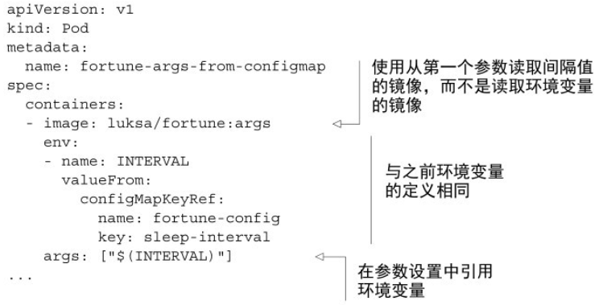

**4、使用configMap 卷作为条目暴露给文件**

由于ConfigMap中可以包含完整的配置文件内容，当你想要将其暴露给容器时，**可以借助一种称为configMap卷的特殊卷格式**。

这种方法使用一个配置文件（如server.conf）创建的cm，把这个server.conf 的内容通过 config 卷挂载到容器中的某个文件。

## Secret给容器传递敏感信息

配置通常会包含一些敏感数据，如**证书和私钥**，需要确保其安全性。

为了存储与分发此类信息，Kubernetes提供了一种称为Secret的单独资源对象。Secret 结构与 ConfigMap 类似，均是键/值对的映射。Secret 的使用方法也与 ConfigMAap 相同，**可以将 Secret 条目作为环境变量传递给容器，也可以将 Secret  条目暴露给卷中的文件**。使用时直接用键来引用。

Kubernetes通过**仅仅将Secret分发到需要访问Secret的pod所在的机器节点**来保障其安全性。另外，Secret**只会存储在节点的内存**中，永不写入物理存储，这样从节点上删除Secret时就不需要擦除磁盘了。

### 创建Secret

我们使用简单的示例来测试 secret。因为保存在secret 中键值都是以 base64 格式保存的，所以我们先来创建两个 base64 的值

``` shell
$ echo -n "admin" | base64
YWRtaW4=
$ echo -n "123qwe" | base64
MTIzcXdl
```

接着编写 secret 的 资源文件 secret1.yaml

``` yaml
apiVersion: v1
kind: Secret
metadata:
  name: secret1
type: Opaque # 表示 Secret 的数据是未加密的二进制数据。
data:
  username: YWRtaW4=
  password: MTIzcXdl
```

然后` kubectl create -f secret1.yaml`创建。

我们再使用命令来创建一个

``` shell
$ kubectl create secret generic secret2 --from-literal=user2=root --from-literal=pass2=qwer1234
$ kubectl get secret
NAME      TYPE     DATA   AGE
secret1   Opaque   2      27m
secret2   Opaque   2      5m31s
$ kubectl get secret secret2 -oyaml
apiVersion: v1
data:
  pass2: cXdlcjEyMzQ=
  user2: cm9vdA==
kind: Secret
metadata:
  creationTimestamp: "2024-07-23T16:01:36Z"
  name: secret2
  namespace: default
  resourceVersion: "69740"
  uid: 750f720a-b8a8-42e4-bfd2-3e056573d0e7
type: Opaque
```

这种方式生成secret后会自动加密，而非明文存储。

### 将Secret 挂载到 Volume 中

创建pod 资源，pod7-secret.yaml

``` yaml
apiVersion: v1
kind: Pod
metadata:
  name: pod-secret-volume
spec:
  containers:
  - name: c1
    image: nginx:1.19.5
    volumeMounts:
    - name: secret-volume
      mountPath: /etc/secret # 挂载到容器中的目录
      readOnly: true
  volumes:
  - name: secret-volume
    secret:
      secretName: secret1 # 填刚才创建的secret 的名字
```

创建并验证

``` shell
$ kubectl create -f pod7-secret.yaml 
pod/pod-secret-volume created
$ kubectl exec -it pod-secret-volume -- /bin/bash
root@pod-secret-volume:/# 
root@pod-secret-volume:/# cd /etc/secret
root@pod-secret-volume:/etc/secret# ls
password  username
root@pod-secret-volume:/etc/secret# cat password 
123qwe
root@pod-secret-volume:/etc/secret# cat username 
admin
```

如上所见，在pod 可以得到secret 进去的信息，并且这些数据不是base64编码，是已经被解码的原数据

### 将 Secret导入到容器环境变量中

创建pod 资源，pod8-secret.yaml

``` yaml
apiVersion: v1
kind: Pod
metadata:
  name: pod-secret-env
spec:
  containers:
  - name: c1
    image: nginx:1.19.5
    env:
    - name: SECRET_USER2
      valueFrom:
        secretKeyRef:
          name: secret2
          key: user2
    - name: SECRET_PASS2
      valueFrom:
        secretKeyRef:
          name: secret2 # 测试创建的另一个secret
          key: pass2
  restartPolicy: Never
```

创建并验证

``` shell
$ kubectl create -f pod8-secret.yaml 
pod/pod-secret-env created
$ kubectl exec -it pod-secret-env -- /bin/bash
root@pod-secret-env:/# echo $SECRET_USER2
root
root@pod-secret-env:/# echo $SECRET_PASS2
qwer1234
```

由上可见，在pod中的secret信息实际已经被解密。

# 9. 传递元数据到容器

我们可以将pod 运行时的元数据传递给其中的容器，使用 kubernetes Downward API 传递。目前可以传的元数据包括 **pod的名称、IP、所在命名空间、运行的节点、所归属的服务账号、标签、注解，以及每个容器请求的与可以使用的CPU和内存限制**。

## 通过环境变量传递

编写资源文件 pod4-downward-env.yaml

``` yaml
apiVersion: v1 
kind: Pod
metadata:
  name: downward
  labels:
    test_app1: test_nginx1
spec:
  containers:
  - image: aiops-899f5654.ecis.huhehaote-1.cmecloud.cn/public/nginx:latest
    name: c1
    resources:
      requests: # 指定请求量，即最小资源量
        cpu: 150m # 表示150毫核，即0.15个cpu
        memory: 1024Mi
      limits: # 指定限制量，即最大资源量
        cpu: 1
        memory: 2Gi 
    env: # 编辑环境变量
    - name: POD_NAME
      valueFrom:
        fieldRef:	# 引用字段
          fieldPath: metadata.name
    - name: POD_NAMESPACE
      valueFrom:
        fieldRef:
          fieldPath: metadata.namespace
    - name: POD_IP
      valueFrom:
        fieldRef:
          fieldPath: status.podIP
    - name: NODE_NAME
      valueFrom:
        fieldRef:
          fieldPath: spec.nodeName
    - name: SERVICE_ACCOUNT
      valueFrom:
        fieldRef:
          fieldPath: spec.serviceAccountName
    - name: CONTAINER_CPU_REQUEST_MILLICORE
      valueFrom:
        resourceFieldRef:
          resource: requests.cpu
          divisor: 1m  # 资源的基数单位
    - name: CONTAINER_MEMORY_LIMIT_KIBIBYTES
      valueFrom:
        resourceFieldRef:
          resource: limits.memory
          divisor: 1Ki  # 资源的基数单位
```

运行并验证

``` shell
$ kubectl create -f pod4.yaml 
pod/downward created
$ kubectl get po
NAME       READY   STATUS    RESTARTS   AGE
downward   1/1     Running   0          20s
$ kubectl exec downward -it -- /bin/bash
root@downward:/# env
KUBERNETES_SERVICE_PORT_HTTPS=443
KUBERNETES_SERVICE_PORT=443
HOSTNAME=downward
CONTAINER_CPU_REQUEST_MILLICORE=150
..............
```

## 通过downward API 卷来传递元数据

也可以使用挂载 downward  类型的卷来传递元数据，pod标签或注解只能通过该方法。

同时，使用这种方式传递元数据的好处是可以传递一个容器的资源字段到另一个容器（当然两个容器必须处于同一个pod）。

编写资源文件 pod5-downward-volume.yaml

``` yaml
apiVersion: v1
kind: Pod
metadata:
  name: downward
  labels:
    qwe: asd
  annotations:
    key1: value2
    k2: |
      multi
      line
      value    
spec:
  containers:
  - image: aiops-899f5654.ecis.huhehaote-1.cmecloud.cn/public/nginx:latest
    name: c1
    resources:
      requests:
        cpu: 150m
        memory: 1024Mi
      limits:
        cpu: 1
        memory: 2Gi
    volumeMounts:
    - name: downward
      mountPath: /etc/downward  # 在此目录挂载 downward 卷
  volumes:
  - name: downward
    downwardAPI:  # 定义一个 downwardAPI类型的卷
      items:
      - path: "podName"  # 此处的path会以文件的形式出现在容器的/etc/downward/ 目录中，其中的内容就是下面引用的内容
        fieldRef:
          fieldPath: metadata.name
      - path: "labels"
        fieldRef:
          fieldPath: metadata.labels
      - path: "annotations"
        fieldRef:
          fieldPath: metadata.annotations
      - path: "containerMemoryLimitBytes"
        resourceFieldRef:
          containerName: c1 # 必须指定容器名，因为我们对于卷的定义是基于pod级的，而不是容器级的。
          resource: limits.memory
          divisor: 1
```

验证

``` shell
$ kubectl create -f pod5.yaml 
pod/downward created
$ kubectl get po
NAME       READY   STATUS    RESTARTS   AGE
downward   1/1     Running   0          3s
$ kubectl exec downward -- ls /etc/downward
annotations
containerMemoryLimitBytes
labels
podName
$ kubectl exec downward -- cat /etc/downward/labels
qwe="asd"
```

> 注意： 与 configMAp 和 secret 卷一样，可以通过 pod 定义中downwardAPI卷的defaultMode属性来改变文件的访问权限设置。

标签和注解可以在pod 运行时修改或新增，修改后，通过downwardAPI 传递进入容器的标签和注解都会自动更新。

``` shell
$ kubectl label pod downward k3=v3
pod/downward labeled
$ kubectl exec downward -- cat /etc/downward/labels
k3="v3"
qwe="asd"
```

## 容器与Kubernetes API server交互

通过Downward API的方式获取的元数据是相当有限的，如果需要获取更多的元数据，需要使用**直接访问Kubernetes API服务器的方式**。

通过这种方式我们可以**获得其他pod的信息**，甚至集群中**其他资源的信息**。

### 了解 k8s API server

打算开发一个可以与Kubernetes API交互的应用，要首先了解Kubernetes API server

使用如下命令得到k8s server 的地址

``` shell
$ kubectl cluster-info
Kubernetes control plane is running at https://apiserver.cluster.local:6443
```

发现这是一个https服务器，使用 `curl -k apiserver.cluster.local:6443` 登不上去（-k 跳过证书验证）

不过可以通过代理的方式连接。首先在一个终端执行`kubectl proxy`。然后在另一个终端 `curl 127.0.0.1:8001` 能看到相应输出即表示可以连接到k8s server 了。

可以在[Kubernetes API | Kubernetes (K8s) 中文](https://kubernetes.ac.cn/docs/reference/kubernetes-api/) 查询各种资源 API 端点

``` shell
$ curl 127.0.0.1:8001
{
  "paths": [
    "/.well-known/openid-configuration",
    "/api",
    "/api/v1",
.............
```

这里返回的是一组路径的清单。些路径对应了我们创建Pod、Service这些资源时定义的**API组和版本信息**。

比如使用 `curl 127.0.0.1:8001/apis/batch/v1 ` 可以查看这个API组下的所有资源。如下是其中一个资源。

``` shell
{
      "name": "jobs",
      "singularName": "",
      "namespaced": true,
      "kind": "Job",
      "verbs": [
        "create",
        "delete",
        "deletecollection",
        "get",
        "list",
        "patch",
        "update",
        "watch"
      ],
      "categories": [
        "all"
      ],
      "storageVersionHash": "mudhfqk/qZY="
    },
...
```

可以看到资源名称和对资源的可选操作。

我们给 job 运行一个 GET 请求

``` shell
$ curl 127.0.0.1:8001/apis/batch/v1/jobs
{
  "kind": "JobList",
  "apiVersion": "batch/v1",
  "metadata": {
    "resourceVersion": "3399457"
  },
  "items": [
    {
      "metadata": {
        "name": "job1",
...
```

返回了跨命名空间的所有Job的清单的详细信息。如果想要返回指定的一个Job，需要在URL中指定它的名称和所在的命名空间。 `curl 127.0.0.1:8001/apis/batch/v1/namespaces/default/jobs/job1`，该命令返回的结果与 `kubectl -n default get job job1 -o json` 返回的是一样的。

### 从pod内部与API server交互

从一个pod内部访问API server，这种情况下通常没有kubectl可用。因此，想要从pod内部与API服务器进行交互，需要关注以下三件事情：

- 确定API服务器的位置（找到它）
- 确保是与API服务器进行交互，而不是一个冒名者（确认它）
- 通过服务器的认证，否则将不能查看任何内容以及进行任何操作（让它确认我）

**发现API服务器地址**

首先我们创建一个pod （名为pd1）用于测试，确保其中的命令可以使用curl，此步略。然后使用 `kubectl exec -it  pd1 -- bash` 进入该pod。

首先需要找到Kubernetes API服务器的IP地址和端口。k8s集群中一个名为kubernetes的服务在默认的命名空间被自动暴露，并被配置为指向API服务器。

``` shell
$ kubectl get svc
NAME         TYPE        CLUSTER-IP   EXTERNAL-IP   PORT(S)   AGE
kubernetes   ClusterIP   10.233.0.1   <none>        443/TCP   8d
```

同时，每个服务都会给pod 配置对应的环境变量，在容器中查看

``` shell
root@pd1:/# env | grep KUBERNETES_SERVICE
KUBERNETES_SERVICE_PORT_HTTPS=443
KUBERNETES_SERVICE_PORT=443
KUBERNETES_SERVICE_HOST=10.233.0.1
```

我们可以使用IP+端口或服务名来访问一下这个地址

``` shell
root@pd1:/# curl https://kubernetes  
curl: (60) SSL certificate problem: unable to get local issuer certificate
More details here: https://curl.se/docs/sslcerts.html

curl failed to verify the legitimacy of the server and therefore could not
establish a secure connection to it. To learn more about this situation and
how to fix it, please visit the web page mentioned above.
```

 运行`curl https://10.233.0.1:443 `结果一样。

**验证服务器身份**

接着我们通过使用 curl 检查证书的方式验证 API 服务器的身份。

使用 `kubectl get secret` 我们发现有一个 名叫 `default-token-xxxxx`的secret。它被挂载到每个容器的`/var/run/secrets/kubernetes.io/serviceaccount`目录下。查看

``` shell
root@pd1:/# ls /var/run/secrets/kubernetes.io/serviceaccount/
ca.crt	namespace  token
```

> ca.crt包含了CA证书，namespace的内容是pod所在命名空间，token是获得API 服务器授权的凭证。

这里包含了 ca.crt 文件，该文件中包含了CA的证书，用来对Kubernetes API服务器证书进行签名。使用命令重新访问 API 服务器

``` shell
root@pd1:/# curl --cacert /var/run/secrets/kubernetes.io/serviceaccount/ca.crt https://10.233.0.1:443
{
  "kind": "Status",
  "apiVersion": "v1",
  "metadata": {
    
  },
  "status": "Failure",
  "message": "forbidden: User \"system:anonymous\" cannot get path \"/\"",
  "reason": "Forbidden",
  "details": {
    
  },
  "code": 403
}
```

报错改变了，curl 验证通过了服务器的身份。

可以使用CURL_CA_BUNDLE环境变量来简化操作，执行

``` shell
export CURL_CA_BUNDLE=/var/run/secrets/kubernetes.io/serviceaccount/ca.crt
```

还差最后一步。

**获得API 服务器授权**

我们需要获得API服务器的授权，以便可以读取并进一步修改或删除部署在集群中的API对象。

上述目录下还有个文件 token，它就是可以获得API 服务器授权的凭证。

我们先把它加到环境变量中以方便使用，然后再访问API服务器。

``` shell
root@pd1:/# TOKEN=$(cat /var/run/secrets/kubernetes.io/serviceaccount/token)
root@pd1:/# curl -H  "Authorization: Bearer $TOKEN" https://10.233.0.1:443
```

可能上述结果仍然不行。可能原因如下

如果我们正在使用一个带有RBAC机制的Kubernetes集群，serviceAccount可能不会被授权访问API服务器。可以有一些手段绕过RBAC，这里不尝试了。

总之，与API服务器通信的流程是用到的东西如下：

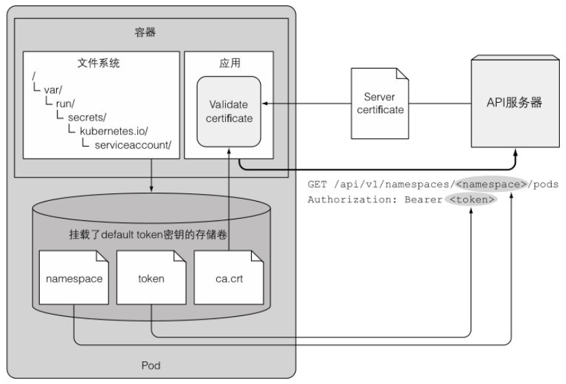

### 使用ambassador容器与API服务器交互

正如在主节点上使用 `kubectl proxy` 后便可以方便的访问API server，我们可以启动一个ambassador容器，并在其中运行`kubecctl proxy`命令，通过它来实现与API服务器的交互。

在这种模式下，运行在主容器中的应用不是直接与API服务器进行交互，而是通过HTTP协议（不是HTTPS协议）与ambassador连接，并且由ambassador通过HTTPS协议来连接API服务器，对应用透明地来处理安全问题（见图8.6）。这种方式同样使用了默认凭证Secret卷中的文件。

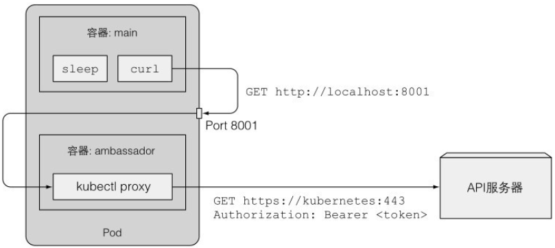

测试略。

# 10. Deployment

为了更好地解决服务编排问题，K8s 从 v1.2 开始，引入了deployment 控制器。

deployment 并不直接管理pod，而是通过 replicaSet 来间接管理pod，即：deployment管理replicaset，replicaset管理pod。所以deployment比replicaset的功能更强大。


deployment 的主要功能为：

- 支持replicaSet 的所有功能，为Pods和ReplicaSets提供声明式更新的能力。
- 支持发布的停止、继续。
- **支持版本的滚动更新和版本回退**。（这是deployment 最重要的功能）

部署应用时一般不直接写pod，而是编写一个 Deployment，这样的pod具有自愈能力。

> 使用时 deployment 简写为 deploy 

下面 **deployment 的资源清单**

``` yaml
apiVersion: apps/v1  #版本号
kind: Deployment  #类型
metadata:    #元数据
  name:    #rs名称
  namespace:   #所属命名空间
  labels:   #标签
    controller: deploy
spec:   #详情描述
  replicas:  #副本数量
  revisionHistoryLimit: #保留历史版本，默认是10
  paused: #暂停部署，默认是false
  progressDeadlineSeconds: #部署超时时间(s)，默认是600
  strategy: #策略
    type: RollingUpdates  #滚动更新策略
    rollingUpdate:  #滚动更新
      maxSurge: #最大额外可以存在的副本数，可以为百分比，也可以为整数
      maxUnavaliable: #最大不可用状态的pod的最大值，可以为百分比，也可以为整数
  selector:  #选择器，通过它指定该控制器管理哪些pod
    matchLabels:   #Labels匹配规则
       app: nginx-pod
    matchExpressions:   #Expression匹配规则
      - {key: app, operator: In, values: [nginx-pod]}
  template:  #模板，当副本数量不足时，会根据下面的模板创建pod副本
    metadata:
        labels:
          app: nginx-pod
    spec:
      containers:
      - name: nginx
        image: nginx:1.17.1
        ports:
        - containerPort: 80
```

## deployment扩缩容

> 首先在k8s 的镜像仓库里准备 nginx1.19.5和1.19.6 两个版本，之后要用。

首先编写dp1.yaml 文件

``` yaml
apiVersion: apps/v1
kind: Deployment
metadata:
  name: dp1
spec:
  replicas: 2
  selector:
    matchLabels:
     app: nginx-pod
  template:
    metadata:
      labels:
        app: nginx-pod
    spec:
      containers:
      - name: nginx
        image: nginx:1.19.5
```

运行

``` shell
$ kubectl create -f dp1.yaml 
deployment.apps/dp1 created
$ kubectl get deploy
NAME   READY   UP-TO-DATE   AVAILABLE   AGE
dp1    2/2     2            2           65s
$ kubectl get rs
NAME            DESIRED   CURRENT   READY   AGE
dp1-88888c9bd   2         2         2       97s
$ kubectl get pod
NAME                  READY   STATUS    RESTARTS   AGE
dp1-88888c9bd-9m6b2   1/1     Running   0          104s
dp1-88888c9bd-rr6gf   1/1     Running   0          104s
```

可以看出，deployment 也是先创建replicaSet，再让replicaSet 去创建pod。

下面演示扩容，可以通过两个方式完成扩容

1、命令行

``` shell
$ kubectl scale deploy dp1 --replicas=3 [-n 命名空间]
```

2、编辑delpoy文件

``` shell
$ kubectl edit deploy dp1 [-n 命名空间]
```

在弹出的文件编辑器中修改。

## 镜像更新

deployment 支持两种镜像更新策略

- Recreate：重建更新，在创建新的pod 之前先把旧的pod 删掉。

- RollingUpdate：**（默认）滚动更新**，杀死一部分旧pod，启动一部分新pod，新的把旧的逐渐替代。在更新过程中，存在两个版本的pod。

RollingUpdate 支持两个属性

- - **maxUnavailable**：用来指定在升级过程中不可用的pod 的最大数量，默认 25%。比如，期望副本数为4，此只为25%，那么整个滚动升级过程中最多有一个pod不可用，至少会有三个pod在提供服务。
  - **maxSurge**：用来指定在升级过程中超过期望的pod 的最大数量，默认25 %。比如，期望副本数为4，此只为25%，那么整个滚动升级过程中最多可同时存在5个 pod。

滚动更新图示：

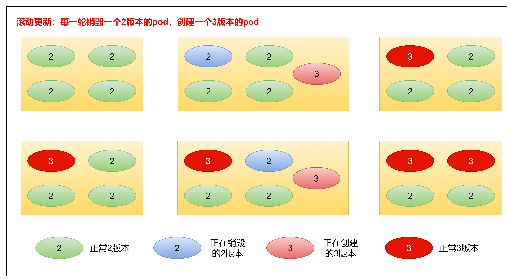

### 重建更新

我们首先使用 `kubectl edit deploy dp1`编辑deploy 文件，在spec 属性下添加更新策略

``` yaml
spec:
  strategy:  #策略
    type: Recreate  #重建更新策略
```

验证

``` shell
$ kubectl get pod
NAME                  READY   STATUS    RESTARTS   AGE
dp1-88888c9bd-2lpj8   1/1     Running   0          15m
dp1-88888c9bd-9m6b2   1/1     Running   0          20m
dp1-88888c9bd-fwjzh   1/1     Running   0          12m
dp1-88888c9bd-rr6gf   1/1     Running   0          20m
$ kubectl edit deploy dp1 # 将容器镜像版本修改为1.19.6
deployment.apps/dp1 edited
$ kubectl get pod
NAME                   READY   STATUS    RESTARTS   AGE
dp1-68c495b84f-6n22l   1/1     Running   0          3s
dp1-68c495b84f-c4ll4   1/1     Running   0          3s
dp1-68c495b84f-j6sp8   1/1     Running   0          3s
dp1-68c495b84f-lbqnb   1/1     Running   0          3s
```

可以看到所有pod 都发生了改变，使用describe 查看更加明显。

而且可以明显看出，名为 dp1-88888c9b 的rs 创建的pod 消失了，现在都是名为 dp1-68c495b84f 的rs 创建的pod，说明deploy 新建了一个rs。

### 滚动更新

`kubectl edit deploy dp1`编辑deploy 文件，在spec 属性下添加更新策略。（如果创建deploy 不指定策略那就默认是这个滚动更新策略）

``` yaml
strategy:
  type: RollingUpdate #滚动更新策略
  rollingUpdate:
    maxUnavailable: 25%
    maxSurge: 25%
```

验证

``` shell
s$ k get pod
NAME                  READY   STATUS    RESTARTS   AGE
dp1-88888c9bd-f9jzj   1/1     Running   0          3s
dp1-88888c9bd-hz6jm   1/1     Running   0          3s
$ kubectl edit deploy dp1
deployment.apps/dp1 edited
$ kubectl get pod
NAME                   READY   STATUS        RESTARTS   AGE
dp1-68c495b84f-2ssn5   1/1     Running       0          2s
dp1-68c495b84f-9wwp2   1/1     Running       0          3s
dp1-88888c9bd-hz6jm    0/1     Terminating   0          47s
$ kubectl get pod
NAME                   READY   STATUS    RESTARTS   AGE
dp1-68c495b84f-2ssn5   1/1     Running   0          4s
dp1-68c495b84f-9wwp2   1/1     Running   0          5s
$ kubectl get rs
NAME             DESIRED   CURRENT   READY   AGE
dp1-68c495b84f   2         2         2       38s
dp1-88888c9bd    0         0         0       82s
```

可以发现，旧pod 一边在删除，新pod 一边在创建，同时进行。

可以看出，策略为滚动更新的deploy，**一个新的ReplicaSet会被创建然后慢慢扩容，同时之前版本的 Replicaset 会慢慢缩容至0** 。

### 回滚升级

事实上，Deployment会创建多个ReplicaSet，用来对应和管理一个版本的pod模板。

滚动升级成功后，老版本的ReplicaSet也不会被删掉，这使得回滚操作可以回滚到任何一个历史版本，而不仅仅是上一个版本。

命令：

``` shell
$ kubectl rollout history deployment deploy名 [--to-revision=期望回滚版本]
```

revision 版本号通过如下命令查看：

``` shell
$ kubectl rollout undo deployment deploy名
```

# 11. StatefulSet 有状态应用

RC、Deployment、DaemonSet 都是面向无状态的服务。无状态应用中的每个实例都可以独立运行，它们之间不共享状态，不需要关心实例间的协调或数据一致性问题。不需要直接与pod通信，而是通过service访问pod。

集群应用有时会要求每一个实例拥有生命周期内唯一标识。这类应用通常涉及到实例间的顺序依赖关系，比如主从关系、数据同步等。使用**Statefulset保证了pod在重新调度后保留它们的标识和状态，方便地扩容、缩容。**

## 了解 StatefulSet

### 提供稳定的网络标识

Statefulset创建的pod副本并不是完全一样的，每个pod 的名字都是规律固定的，每个pod都可以拥有一组独立的数据卷（持久化状态）。一般**一个Statefulset通常要求创建一个用来记录每个pod网络标记的headless Service**（该headless service 同样可以通过全限定域名访问到）。因为每个 pod 都是独一无二的，通过这个 service，每个pod 将拥有独立的DNS 记录。

**当使用Headless Service时，Kubernetes会为每个Pod分配一个唯一的、稳定的主机名（这样可以有状态的保证每次访问到后端的同一个pod）**，格式为：

``` shell
<statefulset-name>-<ordinal>.<service-name>.<namespace>.svc.cluster.local
```

通过这个主机名，可以直接访问特定的Pod，而不是通过Service的Cluster IP


当 Statefulset 管理的pod 发生故障消失时，重新创建的pod 将会和消失的pod 拥有相同的 name（当然，调度到哪个节点是可能会改变的）。

**缩容一个Statefulset将会最先删除最高索引值的实例**，所以缩容的结果是可预知的。同时**Statefulset缩容任何时候只会操作一个pod实例**，所以有状态应用的缩容不会很迅速。

StatefulSet是用于管理有状态应用的工作负载资源。**有状态服务**的特点是：

- 固定的 Pod 标识和网络标识
- 有序的 Pod 创建和终止
-  稳定的存储（Persistent Volume Claims，PVC）

### 提供稳定的独立存储

即使有状态的pod被重新调度（新的pod与之前pod的标识完全一致），**新的实例也必须挂载着相同的存储**。

我们使用持久卷和持久卷声明实现，所以每个Statefulset的pod都需要关联到不同的持久卷声明，与独自的持久卷相对应。为了实现该能力，需要在 StatefulSet 的pod 模板中添加 **卷声明模板** 。

像Statefulset创建pod一样，Statefulset也需要创建持久卷声明。所以一个Statefulset可以拥有一个或多个卷声明模板，这些持久卷声明会在创建pod前创建出来，绑定到一个pod实例上。

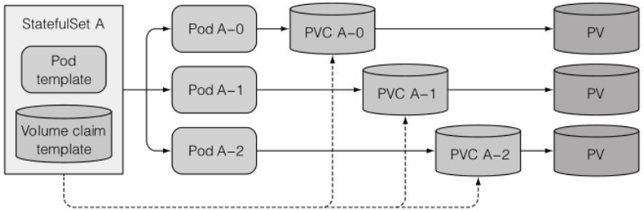

扩容StatefulSet增加一个副本数时，会创建两个或更多的API对象（一个pod和与之关联的一个或多个持久卷声明）。

但是对缩容来说，则只会删除一个pod，而遗留下之前创建的持久卷声明。所以在随后的扩容操作中，新的pod实例会使用绑定在持久卷上的相同声明和其上的数据（如图10.9所示）。当你因为误操作而缩容一个Statefulset后，可以做一次扩容来弥补自己的过失，新的pod实例会运行到与之前完全一致的状态（名字也是一样的）。

## 使用StatefulSet

为了使用StatefulSet，通常需要创建多个对象，包括 持久卷，service 和 statefulSet 本身。

首先创建三个pv，使用在第7节内容中创建的资源

``` yaml
apiVersion: v1
kind: PersistentVolume
metadata:
  name: pv1
spec:
  capacity:
    storage: 1Gi          
  volumeMode: Filesystem
  accessModes:
    - ReadWriteOnce	     # 只能被一个节点挂载为读写模式。
  persistentVolumeReclaimPolicy: Retain # 保留策略，当持久卷被释放时的回收策略为保留（Retain），不会自动删除持久卷中的数据。
  storageClassName: nfs
  nfs:        	#指定NFS共享目录和IP信息
    server: 192.168.200.133
    path: /home/ubt/backup/v1
--- # 以三个横线为分隔写下一个资源
apiVersion: v1
kind: PersistentVolume
metadata:
  name: pv2
spec:
  capacity:
    storage: 1Gi  
  volumeMode: Filesystem 
  accessModes:
    - ReadWriteOnce
  persistentVolumeReclaimPolicy: Retain 
  storageClassName: nfs    
  nfs:   
    server: 192.168.200.133
    path: /home/ubt/backup/v2
---
apiVersion: v1
kind: PersistentVolume
metadata:
  name: pv3
spec:
  capacity:
    storage: 1Gi 
  volumeMode: Filesystem   
  accessModes:
    - ReadWriteOnce
  persistentVolumeReclaimPolicy: Retain 
  storageClassName: nfs   
  nfs:
    server: 192.168.200.133
    path: /home/ubt/backup/v3
```

然后创建 headless service

``` yaml
apiVersion: v1
kind: Service
metadata: 
  name: svc-hdls
spec:
  clusterIP: None # 标识此是 headless service
  selector:
    test_what: test_sts
  ports:
  - name: http
    port: 80
```

创建 StatefulSet 

``` yaml
apiVersion: apps/v1
kind: StatefulSet 
metadata: 
  name: sts1
spec:
  serviceName: svc-hdls
  selector:    
    matchLabels:
      test_what: test_sts
  replicas: 2
  template:
    metadata:
      labels:
        test_what: test_sts
    spec:
      containers:
      - name: ngx
        image: nginx:1.19.5
        ports: 
        - name: http
          containerPort: 8080
        volumeMounts:
        - name: data
          mountPath: /var/data
  volumeClaimTemplates:		# 创建持久卷声明的模板，创建statefulSet后，创建pod 时会自动将 pvc添加到pod中
  - metadata:
      name: data
    spec:
      storageClassName: nfs
      resources:
        requests:
          storage: 1Gi
      accessModes:
      - ReadWriteOnce
```

然后使用命令以此创建资源。然后查看：

``` shell
$ kubectl get pod
NAME                  READY   STATUS      RESTARTS      AGE
sts1-0                1/1     Running     0             5m26s
sts1-1                1/1     Running     0             5m24s
$ kubectl get svc
NAME         TYPE        CLUSTER-IP      EXTERNAL-IP   PORT(S)          AGE
kubernetes   ClusterIP   10.96.0.1       <none>        443/TCP          25d
svc-hdls     ClusterIP   None            <none>        80/TCP           27m
$ kubectl get pv
NAME     CAPACITY   ACCESS MODES   RECLAIM POLICY   STATUS      CLAIM                 STORAGECLASS   VOLUMEATTRIBUTESCLASS   REASON   AGE
pv1      1Gi        RWO            Retain           Available                         nfs            <unset>                          36m
pv2      1Gi        RWO            Retain           Available                         nfs            <unset>                          36m
pv3      1Gi        RWO            Retain           Available                         nfs            <unset>                          36m
pvc-8c...   1Gi        RWO            Delete           Bound       default/data-sts1-1   standard       <unset>                          5m55s
pvc-d4...   1Gi        RWO            Delete           Bound       default/data-sts1-0   standard       <unset>                          5m57s
$ kubectl get pvc
NAME          STATUS   VOLUME      CAPACITY   ACCESS MODES   STORAGECLASS   VOLUMEATTRIBUTESCLASS   AGE
data-sts1-0   Bound    pvc-d4...   1Gi        RWO            standard       <unset>                 6m15s
data-sts1-1   Bound    pvc-8c...   1Gi        RWO            standard       <unset>                 6m13s
```

总结：

- StatefulSet 管理的pod，在启动时严格依次按顺序启动。再缩容或删除时也是依次进行的。
- 具有稳定的网络标识，使用 handless service 进行访问
- StatefulSet 管理的每个 pod 都有独立的储存

# 12. 权限配置

pod 通过`/var/run/secrets/kubernetes.io/serviceaccount/token` 文件内容来进行身份认证，而该文件的内容是来自每个pod 都会挂载的一个 secret 的卷。

每个 pod 都与一个 ServiceAccount（默认使用 default） 相关联（可通过`kubectl get pod pod名 -oyaml 查看`），**它代表了运行在pod中应用程序的身份证明。上述的token文件就是持有ServiceAccount的认证token**。应用程序使用这个token连接API服务器时，身份认证插件会对ServiceAccount进行身份认证，并将ServiceAccount的用户名传回API服务器内部。

## ServiceAccount

ServiceAccount 像pod，secret 等一样都是k8s 资源，它们**作用在单独的命名空间**。每个命名空间都有一个默认名叫default 的 ServiceAccount，**任何启动的 pod 都与一个ServiceAccount 关联**，不指定就默认是default ServiceAccount。

default ServiceAccount 没有读取k8s api server 中任何资源的权限。如果我们创建的**pod 希望可以检索或修改一些 k8s 资源时**，那么就需要创建一个有更高权限的 ServiceAccount。

当然，为了权限最小化以保证安全，每个ServiceAccount 应该有且仅有它应该获得的资源权限。需要检索资源元数据的pod应该运行在只允许读取这些对象元数据的ServiceAccount下。

### 创建 ServiceAccount

``` shell
kubectl create serviceaccount sa1   # ServiceAccount 缩写sa
```

使用上述命令可以创建一个 sa 出来，使用 `kubectl create serviceaccount sa1 --dry-run=client -n default -o yaml > sa1.yaml` 可以把yaml 资源文件打印到文件中。

我们使用 `kubectl describe sa sa1` 查看该 sa，如果使用 K8s 1.24 版本之前，会发现它自动为我们创建一个 Mountable secrets 和 Tokens 是有一个相同的值的。它其实是一个secret 的名字。例如：

``` shell
$ kubectl describe sa sa-test-lt
Name:                sa-test-lt
Namespace:           default
Labels:              <none>
Annotations:         <none>
Image pull secrets:  <none>
Mountable secrets:   sa-test-lt-token-wclt4
Tokens:              sa-test-lt-token-wclt4
Events:              <none>
$ kubectl get secret sa-test-lt-token-wclt4 -oyaml
apiVersion: v1
data:
  ca.crt: LS0tLS1CRU...... # 太长省略
  namespace: ZGVmYXVsdA==
  token: ZXlKa........ # 太长省略
kind: Secret
metadata:
  annotations:
    kubernetes.io/service-account.name: sa-test-lt
    kubernetes.io/service-account.uid: 04345dd2-329f-4835-b631-890f8b2b2473
  creationTimestamp: "2024-08-06T07:00:47Z"
  name: sa-test-lt-token-wclt4
  namespace: default
  resourceVersion: "10311588"
  uid: 8d48eade-6812-480f-9309-ed78768d768b
type: kubernetes.io/service-account-token
```

可以看到该secret 有三条内容，ca.crt，namespace，token。

但好像高版本的 k8s 并不是使用这个 secret 把这些内容挂载到容器里，而是分别使用 serviceAccountToken，configMap，downwardAPI 把上面三个内容挂载。这个secret 的作用暂时未知。

### 将 ServiceAccount 分配到 pod 

通过在 pod 定义文件中的 spec.serviceAccountName 字段上设置ServiceAccount的名称来进行分配。

下面是一个 deployment 中设置 ServiceAccount 的yaml 文件

``` yaml
apiVersion: apps/v1
kind: Deployment
metadata:
  creationTimestamp: null
  labels:
    app: svc-manager-dp
  name: svc-manager-dp
spec:
  replicas: 1
  selector:
    matchLabels:
      app: svc-manager-dp
  strategy: {}
  template:
    metadata:
      creationTimestamp: null
      labels:
        app: svc-manager-dp
    spec:
      serviceAccountName: svc-manager-sa # 设置serviceAccount，需要保证它存在
      containers:
      - image: svc-manager:1.0.0
        name: svc-manager
        resources: {}
status: {}
```

## RBAC

Kubernetes API服务器可以配置使用一个授权插件来检查是否允许用户请求的动作执行。RBAC 就是 Kubernetes 1.8.0 版本后默认在集群中开启的授权深证插件。

**RBAC**全称Role-Based Access Control，是Kubernetes集群基于角色的访问控制，实现授权决策的插件，允许通过Kubernetes API动态配置策略。

RBAC授权规则是通过四种资源来进行配置的，它们可以分为两个组：

- **Role（角色）和ClusterRole（集群角色）**，它们指定了在资源上可以执行哪些动词。
- **RoleBinding （ 角 色 绑 定 ）和 ClusterRoleBinding（ 集群角色绑定）**，它们将上述角色绑定到特定的用户、组或ServiceAccounts上。

> Role 和ClusterRole 是命名空间的资源，而RoleBinding 和 ClusterRoleBinding 是集群级别的资源（不是命名空间的），

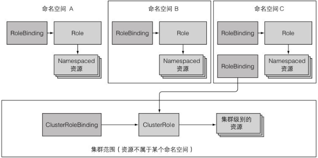

## Role 和 RoleBinding

Role资源定义了哪些操作可以在哪些资源上执行，RoleBinding 将 Role 与 ServiceAccount 相关联，然后使用此 ServiceAccount  的pod 就具有 Role 声明的权限了。

### 创建 Role

首先使用 `kubectl create serviceaccount svc-manager-sa `创建 sa 进行测试。

接着创建 role 准备给sereviceAccount赋予权限。我们的控制器需要监听（list & watch） pod 资源，并需要 list/watch/create/update/delete service 资源。

``` shell
kubectl create role svc-manager-role --resource=pod,service --verb list,watch,create,update,delete --dry-run=client -o yaml > manifests/svc-manager-role.yaml
```

文件内容如下

``` yaml
apiVersion: rbac.authorization.k8s.io/v1
kind: Role
metadata:
  creationTimestamp: null
  name: svc-manager-role
rules:
- apiGroups: # 指定资源必须先指定所属的 apiGroups
  - ""
  resources: # 在指定资源时必须使用复数形式
  - pods  # 声明该 roles 可以访问 pod和svc 两种资源
  - services
  verbs:  # 能够执行的权限如下
  - list
  - watch
  - create
  - update
  - delete
```

Role 声明的权限只能在自己的命名空间下使用。

### 创建 rolebinding

然后将 role 绑定到 serviceaccount 上

``` shell
kubectl create rolebinding svc-manager-rb --role svc-manager-role --serviceaccount default:svc-manmager-sa --dry-run=client -o yaml > manifests/svc-manager-rb.yaml 
```

文件内容如下

``` yaml
apiVersion: rbac.authorization.k8s.io/v1
kind: RoleBinding
metadata:
  creationTimestamp: null
  name: svc-manager-rb
roleRef:  # rb 只能引用单个 role
  apiGroup: rbac.authorization.k8s.io
  kind: Role # 这里还可以引用 ClusterRole，若如此，则下面的主体仍然只能访问此RoleBinding 所在命名空间的资源
  name: svc-manager-role
subjects: # 但 rb 可以把role绑定给多个 serviceAccount 主体，甚至可以绑定其他命名空间的主体，让其他命名空间的pod 可以访问本命名空间中的 roleRef 指定的资源
- kind: ServiceAccount
  name: svc-manager-sa
  namespace: default
```

使用deploy 来部署应用，在 deployment 资源文件manifests/svc-manager-dp.yaml 文件中的 spec.template.spec 添加字段 ` serviceAccountName: svc-manager-sa`。

### 测试

上述创建后测试用的pod 名为 svc-manager-dp-55cd865d6b-sbqd2 ，使用 `kubectl exec -it svc-manager-dp-55cd865d6b-sbqd2 -- bash` 进入之。

然后完成第 9 节中 从pod内部与API server交互 的相关内容。完成到使用 `curl -H  "Authorization: Bearer $TOKEN" https://10.96.0.1:443/` 其中的 ip 地址是环境变量 KUBERNETES_SERVICE_HOST 的值。

此时返回的结果码如果 403 是符合我们预期的，从 message 可知`system:serviceaccount:default:svc-manager-sa cannot get path / `

而使用 `curl -H  "Authorization: Bearer $TOKEN" https://10.96.0.1:443/api/v1/namespaces/defaul/services` 或`curl -H  "Authorization: Bearer $TOKEN" https://10.96.0.1:443/api/v1/namespaces/defaul/pods` 能够得到返回了正确的内容。标识我们的role 的权限设置是正确的。

上述三者类似于这样一种关系：

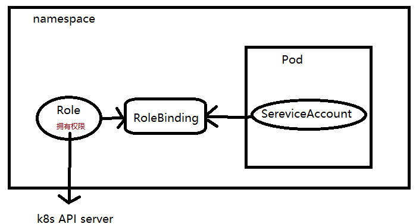

## ClusterRole 和 ClusterRoleBinding

ClusterRole和ClusterRoleBinding 是集群级别的RBAC资源。

一些特定的资源完全不在命名空间中（包括Node、PersistentVolume、Namespace，等等）。API服务器对外暴露了一些不表示资源的URL路径（例如/healthz）。**常规角色不能对这些资源或非资源型的URL进行授权，但是 ClusterRole 可以**。

### 创建 ClusterRole

``` shell
kubectl create clusterrole svc-manager-clusterrole --verb=* --resource=*  --non-resource-url=* --dry-run=client -oyaml > manifests/svc-manager-clusterrole.yaml
```

生成的文件

``` yaml
apiVersion: rbac.authorization.k8s.io/v1
kind: ClusterRole
metadata:
  creationTimestamp: null
  name: svc-manager-clusterrole
rules:
- apiGroups:
  - ""
  resources:
  - '*'
  verbs:
  - '*'
- nonResourceURLs: # 运行访问非资源url，如 /apis, /healthz
  - '*'
  verbs: # 其实 非资源url 只能使用 GET
  - 'GET'
```

使用 apply 创建后，我们将上一节测试的例子中的 名为svc-manager-rb 的 rolebinding 删除，修改其 yaml 文件。

``` yaml
...
roleRef:
  apiGroup: rbac.authorization.k8s.io
  # kind: Role
  # name: svc-manager-role
  kind: ClusterRole
  name: svc-manager-clusterrole
```

重新创建此rolebinding。此时再次进入相应的 pod，测试发现我们可以查看所有命名空间的资源。

但是当我们想访问集群资源比如node，namespace，比如使用 `curl -H  "Authorization: Bearer $TOKEN" https://0.96.0.1:443/api/v1/namespaces` 想要列出所有的namespace 发现仍然报 403。

这是因为对于集群级别的资源必须使用 ClusterRoleBinding 绑定才能够使用。

### 创建 ClusterRoleBinding

``` shell
kubectl create clusterrolebinding svc-manager-crb --clusterrole=svc-manager-clusterrole --serviceaccount=default:svc-manager-sa --dry-run=client -oyaml > manifests/svc-manager-crb.yaml
```

文件如下：

``` yaml
apiVersion: rbac.authorization.k8s.io/v1
kind: ClusterRoleBinding
metadata:
  creationTimestamp: null
  name: svc-manager-crb
roleRef:
  apiGroup: rbac.authorization.k8s.io
  kind: ClusterRole
  name: svc-manager-clusterrole
subjects:
- kind: ServiceAccount
  name: svc-manager-sa
  namespace: default
```

使用 apply 应用后。再次在pod 里进行测试，发现已经可以访问集群级别的资源了。这也说明一个sa 可以通过多个 rolebinding或clusterrolebinding 来绑定多个 role 或clusterrole。

> 使用 `kubectl get rolebindings,clusterrolebindings --all-namespaces -o wide | grep <serviceaccount_name>` 查看 sa 绑定了多少role

使用不同的role和binding的组合能够访问的资源范围是不同的。

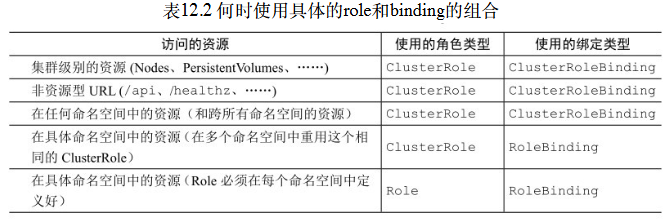

## k8s 默认的ClusterRole 和 ClusterRoleBinding

使用 `kubectl get clusterrolebindings` 和`kubectl get clusterroles` 可以查看 Kubernetes提供的一组默认的ClusterRole和ClusterRoleBinding。**其中view、edit、admin和cluster-admin ClusterRole是最重要的角色**。我们平时定义pod 的权限时也可以使用它们。

- 用view ClusterRole允许对资源的只读访问
- 用edit ClusterRole允许对资源的修改
- 用admin ClusterRole赋予一个命名空间全部的控制权
- 用cluster-admin ClusterRole得到完全的控制

默认的 ClusterRole 列表包含了大量其他的 ClusterRole ， 它们以system：为前缀。这些角色用于各种Kubernetes组件中。在它们之中，可以找到如system:kube-scheduler之类的角色，它明显是给调度器使用的，system:node是给Kubelets组件使用的，等等。


# 13. CRD自定义资源

在K8S系统扩展点中，开发者可以通过CRD（CustomResourceDefinition）来扩展K8S API，其功能主要由APIExtensionServer负责。使用CRD扩展资源分为三步：

- 注册自定义资源：开发者需要通过K8S提供的方式注册自定义资源，即通过CRD进行注册，注册之后，K8S就知道我们自定义资源的存在了，然后我们就可以像使用K8S内置资源一样使用自定义资源（CR）
- 使用自定义资源：像内置资源比如Pod一样声明资源，使用CR声明我们的资源信息
- 删除自定义资源：当我们不再需要时，可以删除自定义资源

使用 `kubectl get crd` 可看到有当前集群哪些自定义资源

## 创建并使用

编辑 mycrd.yaml

 ``` yaml
 apiVersion: apiextensions.k8s.io/v1
 kind: CustomResourceDefinition
 metadata:
   # 强制规定：名字必须与下面的 spec 字段匹配，并且格式为 '<名称的复数形式>.<组名>'
   name: mycrds.example.com
 spec:
   # 组名称，用于 REST API: /apis/<组>/<版本>
   group: example.com
   names:
     # 名称的复数形式，用于 URL：/apis/<组>/<版本>/<名称的复数形式> ，必须小写
     plural: mycrds
     # 名称的单数形式，作为命令行使用时和显示时的别名
     singular: mycrd
     # kind 通常是单数形式的帕斯卡编码（PascalCased）形式。你的资源清单会使用这一形式。
     kind: MyCrd
     # shortNames 允许你在命令行使用较短的字符串来匹配资源
     shortNames:
     - mcd
   # 可以是 Namespaced命名空间范围内使用 或 Cluster集群范围内使用
   scope: Namespaced
   # 列举此 CustomResourceDefinition 所支持的版本，可以在不破坏现有客户端的情况下，对CRD定义的资源进行演进和升级
   versions:
   - name: v1
     # 每个版本都可以通过 served 标志来独立启用或禁止，指示该版本的资源是否应该由API服务器提供服务
     served: true
     # 其中一个且只有一个版本必需被标记为存储版本（指示该版本的资源是否应该存储在etcd中）
     storage: true
     # 一个OpenAPI v3模式对象，用于定义该版本的资源的结构。该模式对象描述了该版本的资源的属性、类型和验证规则等信息
     schema: # 下面是属性的定义
       openAPIV3Schema:
         type: object
         properties:
           spec:
             type: object
             properties:  # 定义该资源拥有的字段
               myname:
                 type: string
                 default: "test-name"
                 # 使用 pattern 强制规定该资源命名的规则必须以 test 开头
                 pattern: "^test"
     additionalPrinterColumns:    # 添加打印时显示的额外字段
     - name: MyName
       type: string
       description: The name of resource
       jsonPath: .spec.myname
 ```

然后使用 `kubectl create -f mycrd.yaml` 即可创建该资源，使用 `kubectl api-resources` 可查看到该资源。使用 `kubectl delete -f mycrd.yaml`。

``` shell
$ kubectl create -f mycrd.yaml 
customresourcedefinition.apiextensions.k8s.io/mycrds.example.com created
$ kubectl api-resources
NAME       SHORTNAMES   APIVERSION         NAMESPACED   KIND
......
mycrds      mcd          example.com/v1    true         MyCrd
......
```

接着编辑 crd-test1.yaml 来使用使用该资源

``` yaml
apiVersion: "example.com/v1"
kind: MyCrd
metadata:
  name: mycrd1
spec:
  myname: test-demo1
```

创建并查看

``` shell
$ kubectl get crd mycrds.example.com -oyaml 
# 要查看crd 具体manifest，需要些清楚 <名称的复数形式>.<组名>
$ kubectl create -f crd-test1.yaml 
mycrd.example.com/mycrd1 created
$ kubectl get mycrd 
NAME     MYNAME
mycrd1   test-demo1
```

## Finalizers

Finalizer 能够让控制器实现 **异步** 的删除前（Pre-delete）回调，优雅的删除 资源

- 我们创建的自定义资源对象，finalizers不为空，那么在资源对象被删除之前，会阻塞住，同时往这个资源中添加一个字段：deletionTimestamp，它是开始执行删除的时间

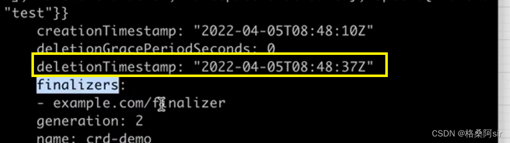

- 我们的自定义Controller**检测到deletionTimestamp**后，就知道资源即将被删除，进行一些回收操作。
- 管理 finalizer 的控制器（一般就是我们自己定义的 operator ）注意到对象上发生的更新操作，并进行相应操作。
- 结束后**清空资源的finalizers值**，删除操作就会被唤醒，自定义资源对象才会被删除

与内置对象类似，定制对象也支持 Finalizer

```go
apiVersion: "example.com/v1"
kind: Demo
metadata:
  finalizers:
  - example.com/finalizer
```

由于上述的 `example.com/finalizer` 不是资源因此不会被清空(一般会由k8s自己删除)，因此此处练习我们需要自己使用`kubectl edit` 把example.com/finalizer 删除掉

一般finalizer 也是我们在控制器中手动添加的，使用如下方法添加或删除

``` go
import "sigs.k8s.io/controller-runtime/pkg/controller/controllerutil"

controllerutil.ContainsFinalizer(object, FinalizerName)
controllerutil.AddFinalizer(object, FinalizerName)
controllerutil.RemoveFinalizer(object, FinalizerName)
```

## 子资源

**CRD 只支持 status 和 scale 子资源**。开启这些子资源后就可以通过 URL后加上相应的path 去访问这些子资源了。

``` yaml
schema:
...
subresources:
  # status 启用 status 子资源
  status: {}
  # scale 启用 scale 子资源
  scale:
    # specReplicasPath 定义定制资源中对应 scale.spec.replicas 的JSON 路径 
    specReplicasPath: .spec.replicas
```

## 多版本

crd 为了做版本升级或者迁移，支持多版本

``` yaml
...
  versions:
  ...
  conversion:
    strategy: Webhook
    webhook:
      conversionReviewVersions: ["v1", "v1beta1"]
      clientConfig:
        service:
          namespace: default
          name: example-conversion-webhook-server
          path: /crdconvert
        caBundle: "...."
```


# 14. client-go

client-go是一个调用kubernetes集群资源对象API的客户端，即通过client-go实现对kubernetes集群中资源对象（包括deployment、service、ingress、replicaSet、pod、namespace、node等）的增删改查等操作。大部分对kubernetes进行前置API封装的二次开发都通过client-go这个第三方包来实现。

client-go提供了以下四种客户端对象：

- **RESTClient**：最基础的，相当于的底层基础结构**，可以直接通过 是RESTClient提供的RESTful方法。**同时支持Json 和 protobuf，支持所有原生资源和CRDs。一般而言，为了更为优雅的处理，需要进一步封装，通过Clientset封装RESTClient，然后再对外提供接口和服务。（底层是使用go 的net/http 包实现的）
- **ClientSet**：调用Kubernetes资源对象最常用的client，可以操作所有的资源对象（**只支持内置资源对象，自定义资源加上lister watch等方法也可以使用它**），底层还是RESTClient。需要指定Group、指定Version，然后根据Resource获取。优雅的姿势是利用一个controller对象，再加上Informer。
- **DynamicClient**：一种动态的 client，**它能处理 kubernetes 所有的资源**，包括 CRD。
- **DiscoveryClient**：发现客户端，主要用于**发现Kubernetes API Server所支持的资源组、资源版本、资源信息**，比如 `kubectl api-resources` 就是用它实现的 。DiscoveryClient 提供了一组方法来查询和获取这些信息，以便在编写 Controller 或 Operator 时，能够动态地了解集群中可用的资源。


**k8s.io/client-go 代码仓库主要目录功能**：

- `rest`：包含了 **resrClient** 的逻辑

- `kubernetes`：包含了访问所有k8s API 的 clientSet，包含了 **ClientSet** 的逻辑
- `informers`：便于操作资源对象的 informer
- `listers`：用于读取缓存中 k8s 资源对象的信息
- `discovery`：用于发现API Server 支持的API，即 **discoveryClient** 的逻辑
- `dynamic`：包含了 **dynamicClient** 的逻辑
- `plugin/pkg/client/auth`：包含所有可选的认证插件
- `transport`：包含了创建连接和认证的逻辑，会被上层 clientSet 使用
- `tools`：工具方法

## Kubernetes API

**kubernetes API 查看地址** ：[Kubernetes API | Kubernetes](https://kubernetes.io/docs/reference/kubernetes-api/)，

client-go API 库文档 ：[clientgo package - k8s.io/client-go - Go Packages](https://pkg.go.dev/k8s.io/client-go@v0.30.3)

在Kubernetes API 中，我们一般使用 GVR 或 GVK 来区分特定的资源，即根据不同的分组、版本、资源进行URL 的定义。

- **G（Group）**：资源组，包含一组资源的集合
- **V（Version）**：资源版本，区分不同api 的稳定程度和兼容性
- **R（Resource）**：资源信息，区分不同的API
- **K（Kind）**：资源类型，每个资源对象都需要Kind 来区分它代表的资源类型。

同时，由于历史原因，Kubernetes API 分组又分为 **无组名资源组** 和**有组名资源组**。无组名资源组又被称为 核心资源组，Core Group。

- **无组名资源组**的 REST 路径为`/api/v1`

- **有组名资源组**的 REST 路径为`/apis/$GROUP_NAME/$VERSION`，自定义资源都是这个规则

比如 pod 作为最核心的资源，其 url地址为 `/api/v1/pods`。

参见：[Kubernetes API 总览 - Kubernetes (k8s-docs.netlify.app)](https://k8s-docs.netlify.app/docs/reference/using-api/api-overview/)

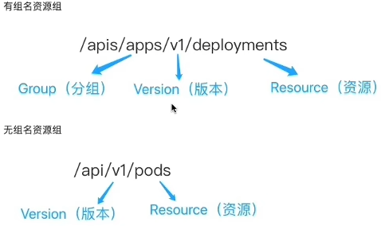

一般在接口调用时，我们只需要知道GVR 即可，通过GVR来操作相应的资源。

通过 GVR 来组成 RESTful API 请求路径，例如，针对 apps/v1 下面 Deployment 的 RESTful API 请求路径如下所示：

``` shell
GET /apis/apps/v1/namespaces/{namespace}/deployments/{name}
```

使用 **`kubectl api-resources`** 可查看所有的资源信息。

**kubernetes API 查看地址** ：[Kubernetes API | Kubernetes](https://kubernetes.io/docs/reference/kubernetes-api/)，在此网站指定资源后在网页最下方有资源的API 地址以及可以使用的方法。

### RESTClient

新建文件 test-client-go。在其中执行 `go mod init test-client-go`，新建module。

添加 k8s.io/api 和 k8s.io/client-go 这两个依赖，添加最新版即可

``` go
go get k8s.io/api
go get k8s.io/client-go
go mod tidy
```

下面是简单的使用 RESTClient 访问 k8s 的pod 的逻辑

``` go
package main

import (
	"context"
	"fmt"

	corev1 "k8s.io/api/core/v1"
	"k8s.io/client-go/kubernetes/scheme"
	"k8s.io/client-go/rest"
	"k8s.io/client-go/tools/clientcmd"
)

func main() {
	// 1. 得到 config
	// clientcmd.RecommendedHomeFile 使用本机 ~/.kube/config 文件
	config, err := clientcmd.BuildConfigFromFlags("", clientcmd.RecommendedHomeFile)
	if err != nil {
		panic(err.Error())
	}
	// config 中，GroupVersion 和 NegotiatedSerializer 字段是必填的。
	config.GroupVersion = &corev1.SchemeGroupVersion
	config.NegotiatedSerializer = scheme.Codecs
	// 拼接欲查找资源的 API Path，资源的 API Path一般写 /api:（无分组资源），/apis/分组:（有分组资源）
	// 此处我们查找 pod，pod 没有分组
	config.APIPath = "/api"
	// 2.得到 client
	restClient, err := rest.RESTClientFor(config)
	if err != nil {
		panic(err.Error())
	}
	// 3. get data，
	// 定义接收数据的类型， k8s 所有内置资源对象都有定义，同时都实现了 runtime.Object
	pod := corev1.Pod{}
	err = restClient.
		// Get开启一个请求
		Get().
		// Namespace 指定 命名空间
		Namespace("default").
		// Resource 指定请求的资源类型
		Resource("pods").
		// Name 指定请求的资源名
		Name("dp1-88888c9bd-jj5kr").
		// 以上都只是在拼接访问 API SERVER 的 url。
		// Do 才真正的去访问，其返回 result 对象
		Do(context.TODO()).
		// Into 接收 runtime.Object 结构体，
		Into(&pod)
	if err != nil {
		panic(err.Error())
	}
	fmt.Printf("pod.Name: %v, pod.Kind: %v, pod.Labels: %v, \n", pod.Name, pod.Kind, pod.Labels)
}
```

### ClientSet

可以得到指定资源的 client ，再用其去操作资源。

``` go
package main

import (
	"context"
	"fmt"

	v1 "k8s.io/apimachinery/pkg/apis/meta/v1"
	"k8s.io/client-go/kubernetes"
	"k8s.io/client-go/tools/clientcmd"
)

func main() {
	// 1. 得到 config
	// clientcmd.RecommendedHomeFile 使用本机 ~/.kube/config 文件
	config, err := clientcmd.BuildConfigFromFlags("", clientcmd.RecommendedHomeFile)
	if err != nil {
		panic(err.Error())
	}
	// 2. 得到 clientSet
	clientSet, err := kubernetes.NewForConfig(config)
	if err != nil {
		panic(err)
	}
	// 3. 通过 clientSet 得到特定资源的 client
	// 这里的获取路径也是 GVR 的格式
	pod, err := clientSet.CoreV1().Pods("default").Get(context.TODO(), "dp1-88888c9bd-jj5kr", v1.GetOptions{})
	if err != nil {
		return
	}
	fmt.Printf("pod.Name, pod.Labels: %v\n", pod.Name, pod.Labels)
}
```

可见使用clientset 比使用 restClient 方便。

查看源码发现，clientSet 就是在内部为根据 group-version 为所有资源都创建了一个 RestClient。

下面是使用 listOption添加 标签选择器的示例

``` go
	podList, err := clientset.CoreV1().Pods(constants.DefaultNamespace).List(context.TODO(), metav1.ListOptions{
		LabelSelector : fmt.Sprintf("%s=%s", constants.InferenceNameKey, name),
	})
当需要添加多个LabelSelector 时写法如下：
LabelSelector : fmt.Sprintf("%s=%s,%s=%s", k1, v1, k2, v2),
```

如果标签选择器只想根据key 筛选而不在乎value，那么直接写 `LabelSelector: constants.InferenceNameKey` 即可

### DynamicClient 

DynamicClient，可以操作任意的kubernetes资源。

 dynamicClient 核心代码`k8s.io/client-go/dynamic/simple.go`：

``` go
// DynamicClient 中只包含一个RESTClient的字段 client
type DynamicClient struct {
   client rest.Interface
}
// 该方法用于创建一个 DynamicClient 实例，入参也是 *rest.Config 类型
func NewForConfig(inConfig *rest.Config) (*DynamicClient, error) {
	config := ConfigFor(inConfig)

	httpClient, err := rest.HTTPClientFor(config)
	if err != nil {
		return nil, err
	}
	return NewForConfigAndClient(config, httpClient)
}
func NewForConfigAndClient(inConfig *rest.Config, h *http.Client) (*DynamicClient, error) {
	config := ConfigFor(inConfig)
	// for serializing the options
	config.GroupVersion = &schema.GroupVersion{}
	config.APIPath = "/if-you-see-this-search-for-the-break"

	restClient, err := rest.RESTClientForConfigAndClient(config, h)
	if err != nil {
		return nil, err
	}
	return &DynamicClient{client: restClient}, nil
}
// DynamicClient 只有这一个实例方法，用于指定当前 DynamicClient 要操作的究竟是什么类型。
func (c *DynamicClient) Resource(resource schema.GroupVersionResource) NamespaceableResourceInterface {
	return &dynamicResourceClient{client: c, resource: resource}
}
type dynamicResourceClient struct {
	client    *DynamicClient
	namespace string
	resource  schema.GroupVersionResource
}
```

上述 Resource 方法返回的 dynamicResourceClient 就是最终我们可以用来操作 资源 的 Client 了。可以调用它的Namespace方法，为namespace字段赋值。

然后我们查看 dynamicResourceClient 结构体的 Create，List 方法，发现它们操作的对象都是  `obj *unstructured.Unstructured`。

因为当使用 DynamicClient 时，DynamicClient 没有确定的资源，资源类型是我们使用的时候才会去指定GVR的，所以 开发DynamicClient 的时候，Get 方法自然无法确定返回值类型。于是我们使用一个通用的数据结构 Unstructured 来表示所有资源的类型

- Unstructured源码位于`k8s.io/apimachinery/pkg/apis/meta/v1/unsructured/unsructured.go`

``` go
type Unstructured struct {
	// Object is a JSON compatible map with string, float, int, bool, []interface{}, or map[string]interface{} children.
	Object map[string]interface{}
}
```

dynamicResourceClient 实现了 ResourceInterface 接口的所有方法，这些方法就是我们最终操作资源所调用的。下面我们看一下 ResourceInterface 接口的所有方法签名

``` go
type ResourceInterface interface {
	Create(ctx context.Context, obj *unstructured.Unstructured, options metav1.CreateOptions, subresources ...string) (*unstructured.Unstructured, error)
	Update(ctx context.Context, obj *unstructured.Unstructured, options metav1.UpdateOptions, subresources ...string) (*unstructured.Unstructured, error)
	UpdateStatus(ctx context.Context, obj *unstructured.Unstructured, options metav1.UpdateOptions) (*unstructured.Unstructured, error)
	Delete(ctx context.Context, name string, options metav1.DeleteOptions, subresources ...string) error
	DeleteCollection(ctx context.Context, options metav1.DeleteOptions, listOptions metav1.ListOptions) error
	Get(ctx context.Context, name string, options metav1.GetOptions, subresources ...string) (*unstructured.Unstructured, error)
	List(ctx context.Context, opts metav1.ListOptions) (*unstructured.UnstructuredList, error)
	Watch(ctx context.Context, opts metav1.ListOptions) (watch.Interface, error)
...............
}
```

可以看到：

- Create方法因为不知道要创建什么资源，所以参数接收的是 obj *unstructured.Unstructured
- Get方法因为不知道返回的是什么资源，所以返回的是 *unstructured.Unstructured
- List方法因为不知道返回的是什么资源列表，所以返回的是 *unstructured.UnstructuredList。这个结构里面包含一个 []unstructured.Unstructured

为了实现 Unstructured 与 资源对象的相互转换，需要使用 **runtime包下的 UnstructuredConverter 接口**。接口中提供了两个方法，分别用于 `资源对象-->Unstructured` 和 `Unstructured-->资源对象`。位于 `/k8s.io/apimachinery/pkg/runtime/converter.go`

``` go
type UnstructuredConverter interface {
	ToUnstructured(obj interface{}) (map[string]interface{}, error)
	FromUnstructured(u map[string]interface{}, obj interface{}) error
}
// UnstructuredConverter 接口只有一个实现类 unstructuredConverter
type unstructuredConverter struct {
	// If true, we will be additionally running conversion via json
	// to ensure that the result is true.
	// This is supposed to be set only in tests.
	mismatchDetection bool
	// comparison is the default test logic used to compare
	comparison conversion.Equalities
}
// unstructuredConverter 实现了UnstructuredConverter 接口的 两个方法
func (c *unstructuredConverter) ToUnstructured(obj interface{}) (map[string]interface{}, error{...}
func (c *unstructuredConverter) FromUnstructured(u map[string]interface{}, obj interface{}) error {...}

// 不过，unstructuredConverter 类型开头小写，我们无法直接使用，kubernetes 已经创建了一个全局变量 DefaultUnstructuredConverter，类型就是unstructuredConverter，用以供外界使用
var (
	// DefaultUnstructuredConverter performs unstructured to Go typed object conversions.
	DefaultUnstructuredConverter = &unstructuredConverter{
		mismatchDetection: parseBool(os.Getenv("KUBE_PATCH_CONVERSION_DETECTOR")),
		comparison: conversion.EqualitiesOrDie(
			func(a, b time.Time) bool {
				return a.UTC() == b.UTC()
			},
		),
	}
)

```

- 总结：我们直接使用 `runtime.DefaultUnstructuredConverter`，调用它的 ToUnstructured 或 FromUnstructured 方法，就可以实现 Unstructured 与 资源对象的相互转换 了

 **DynamicClient使用示例**：

``` go
package main

import (
	"context"
	"fmt"

	appsv1 "k8s.io/api/apps/v1"
	metav1 "k8s.io/apimachinery/pkg/apis/meta/v1"
	"k8s.io/apimachinery/pkg/runtime"
	"k8s.io/apimachinery/pkg/runtime/schema"
	"k8s.io/client-go/dynamic"
	"k8s.io/client-go/tools/clientcmd"
)

func main() {
	// 先得到客户端配置
	config, err := clientcmd.BuildConfigFromFlags("", clientcmd.RecommendedHomeFile)
	if err != nil {
		panic(err)
	}
	// 创建 dynamicClient
	dynamicClient, err := dynamic.NewForConfig(config)
	if err != nil {
		panic(err)
	}
	// 指定要操作的资源，得到该资源的 client
	dynamicResourceClient := dynamicClient.Resource(schema.GroupVersionResource{
		Group:    "apps",
		Version:  "v1",
		Resource: "deployments",
	})
	// 得到该资源的 unstructured 对象
	unstructured, err := dynamicResourceClient.
		Namespace("default").
		Get(context.TODO(), "dp1", metav1.GetOptions{})
	if err != nil {
		panic(err)
	}
	// 反序列化
	deploy := &appsv1.Deployment{}
	runtime.DefaultUnstructuredConverter.FromUnstructured(unstructured.UnstructuredContent(), deploy)
	if err != nil {
		panic(err)
	}
	fmt.Printf("deploy.Name: %v, deploy.Labels: %v, \n", deploy.Name, deploy.Labels)
}
```

### DiscoveryClient

DiscoveryClient 用于检索 kuberentes集群中支持的 API 资源的相关信息，例如版本、组、资源类型等。DiscoveryClient 提供了一组方法来查询和获取这些信息，以便在编写 Controller 或 Operator 时，能够动态地了解集群中可用的资源。

DiscoveryClient 定义位于 `k8s.io/client-go/discovery/discovery_client.go`

```go
type DiscoveryClient struct {
    // 可见，DiscoveryClient 仍然是使用 restClient 来访问 API Server 的
	restClient restclient.Interface
	// LegacyPrefix 字段表示旧版本资源的访问前缀，一般值都是/api。Kubernetes 1.16 以前，资源的访问前缀都是 /api，1.16及之后，全面改成 /apis，为了兼容旧资源，这里特意保存了一个常量字符串 /api
	LegacyPrefix string
	// Forces the client to request only "unaggregated" (legacy) discovery.
	UseLegacyDiscovery bool
}
// DiscoveryClient 实现了 DiscoveryInterface 接口的所有方法，用于获取API资源的各种信息
type DiscoveryInterface interface {
	RESTClient() restclient.Interface
	ServerGroupsInterface
	ServerResourcesInterface
	ServerVersionInterface
	OpenAPISchemaInterface
	OpenAPIV3SchemaInterface
	// Returns copy of current discovery client that will only
	// receive the legacy discovery format, or pointer to current
	// discovery client if it does not support legacy-only discovery.
	WithLegacy() DiscoveryInterface
}
```

在查看 DiscoveryInterface 的时候，除了 `DiscoveryClient`，还有一个实现类 `CachedDiscoveryClient`。

CachedDiscoveryClient 在 DiscoveryClient 的基础上增加了一层缓存，用于缓存获取的资源信息，以减少对 API Server 的频繁请求。

在首次调用时，CachedDiscoveryClient 会从 API Server 获取资源信息，并将其缓存在本地。之后的调用会直接从缓存中获取资源信息，而不需要再次向 API Server 发送请求。

因为 集群部署完成后，API 资源基本很少变化，所以缓存下来可以很好的提高请求效率。kubectl 工具内部，kubectl api-versions命令其实就是使用了这个CachedDiscoveryClient，所以多次执行kubectl api-versions命令，其实只有第一次请求了API Server，后续都是直接使用的 本地缓存。

**DiscoveryClient 使用示例**

``` go
package main

import (
	"fmt"

	"k8s.io/client-go/discovery"
	"k8s.io/client-go/tools/clientcmd"
)

func main() {
	// 创建客户端配置 config
	config, err := clientcmd.BuildConfigFromFlags("", clientcmd.RecommendedHomeFile)
	if err != nil {
		panic(err)
	}
	// 创建 discoveryClient duix
	discoveryClient, err := discovery.NewDiscoveryClientForConfig(config)
	if err != nil {
		panic(err)
	}
	// 获取资源列表
	_, resourceLists, err := discoveryClient.ServerGroupsAndResources()
	if err != nil {
		panic(err)
	}
	// 遍历资源列表，打印出所有资源组和资源名称
	for _, resource := range resourceLists {
		fmt.Printf("resource.GroupVersion: %v\n", resource.GroupVersion)
		for _, r := range resource.APIResources {
			fmt.Printf("resource.Name: %v\n", r.Name)
		}
		fmt.Println("----------------")
	}
}
```

## client-go 架构

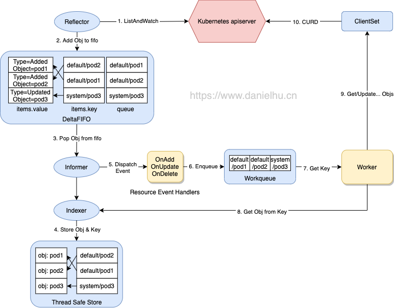

上图是client-go 整体的运转流程。

### 流程简介

1. Reflector 会一直ListAndWatch k8s apiserver中指定资源类型的API，当发现变动和更新时，就会创建一个发生变动的 **对象副本**，并将其添加到队列DeltaFIFO中。
2. Informer监听DeltaFIFO队列，取出对象，将对象加入Indexer，Indexer 会将 **[对象key, 对象]** 存入一个线程安全的Cache中。（key 通常是 `namespace/name` 格式）
3. 同时根据对象的 资源类型和操作，找到对应 Controller 预先提供的 Resource Event Handler，调用Handler，多数handler的功能只是将key放入workqueue。（ **Workqueue由延时队列实现，一段时间内的同一资源的多个事件只处理最新的，目的是防止在短时间内频繁处理同一项工作）**。
4. Controller 的循环函数 ProcessItem会一直消费workqueue，监听到 Workqueue 有数据了，就会取出一个key，交给处理函数Worker，Worker 会根据 Key，使用 Indexer 从 Cache 中 获取 该key对应的 真实对象。然后就可以进行调谐了。

**注意点**：

- DeltaFIFO 中 存的是 对象副本；Cache 中 存的是 [对象key, 对象] 的映射；Workqueue 中存的是 对象Key。相当于对象进入流程后先放入对象本身，在后面的流程中使用 对象Key 进行流转。
- CRDController 中，使用Informer对象，是为了向其中添加一些 Resource Event Handlers；使用Indexer对象，是为了根据对象Key，获取对象实例

上述过程由多个组件完成，组件分为 client-go 核心组件和自定义控制器组件。

###  client-go 核心组件

- `Reflector`：持续监听k8s集群中指定资源类型的API，当发现变动和更新时，就会创建一个发生变动的 **对象副本**，并将其添加到队列DeltaFIFO中。实现监听的函数就是 `ListAndWatch`。这种监听机制既适用于k8s的内建资源，也适用于自定义资源。

- `Informer`：Informer 会从 Delta FIFO 中取出对象。实现这个功能的方法对应源码中的 processLoop；Informer 取出对象后，根据Resource类型，调用对应的 Resource Event Handler 回调函数，该函数实际上由某个具体的 Controller 提供，函数中会获取对象的 key，并将 key 放入到 该Controller 内部的 Workqueue 中，等候处理。

- `Indexer 和 Thread Safe Store`：

  - indexer **维护k8s资源的本地缓存**，以减轻对apiserver和etcd 的访问负担。以及**提供索引功能**，以快速查找相应的资源。例如你可能希望为所有具有特定标签的对象创建一个索引，以便快速检索。(索引是对存储的扩展和包装，使得按照某些条件查询速度会非常快。)
  - indexer 所维护的缓存依赖于**线程安全的 Cache**，即 **ThreadSafeStore**。存储的是[namespace/name, 对象]
  - index 的实现是`k8s.io/client-go/tools/cache/store.go/cache`，cache 中的一个成员是ThreadSafeStore接口 ，ThreadSafeStore 的实现是 `k8s.io/client-go/tools/cache/thread_safe_store.go/threadSafeMap`，其中 items map[string]interface{} 保存了所有k8s资源。

  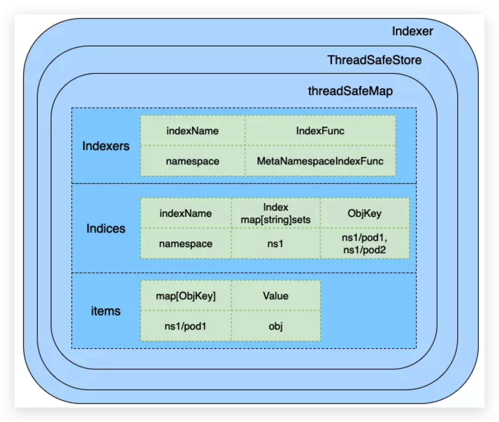

  - indexer（索引器，map[索引名]IndexFunc）定义了如何基于对象的属性来创建索引。
  - Indices（索引，map[索引名]匹配对象的UID的集合）存储了通过索引函数计算出的结果。


- `Resource Event Handlers`：这些 handlers 由具体的Controller提供，就是 Informer 的回调函数。Informer 会根据资源的类型，调用对应Controller的 handler 方法。handler 通常都是**用于将资源对象的key放入到 该Controller 内部的 Workqueue 中**，等候处理，通常包括 addHandler，updateHandler 等。
- `Workqueue`：
  - 代码位于：`k8s.io/client-go/util/workqueue`
  - workqueue 学习参考：https://www.danielhu.cn/2403-k8s-client-go-workqueue/。

  - 此队列是具体的Controller 内部创建的队列，用于暂时存储从Resource event handler 中 传递过来的，**待处理对象的Key**，key 一般就是资源的 namespace/name （命名空间关联的资源）或者 name （命名空间无关的资源）。Resource event handler 函数通常会获取待处理对象的key，并将key放入到这个workqueue中。
  - 使用workqueue是因为事件产生的速度要快于事件处理的速度，需使用队列来对接。
  - 最基础的Queue接口的实现是 Type，其成员变量queue []interface{} 保证任务处理的顺序，dirty set 记录待处理的items，**并保证任务不会重复入队**，processing set 保证任务不被重复处理。
  - 接着在Queue接口基础上实现延时队列 DelayingQueue，实现了延迟自定义时间后再次入队的能力。**新建延时队列的时候会启动一个协程去处理延时入队的逻辑**。
  - 在延时队列 DelayingQueue的基础上实现限速队列RateLimitingQueue，限速队列的核心是限速器，**限速器的实现根据使用的算法有多种实现**，如指数退避算法或令牌桶算法，默认的限速器的实现就是这两个算法选延时更多的那个。而**这些限速队列进行限速的操作都是用延时队列的延时入队的功能实现的，简单来说就是让限速器调用When函数去计算一个重新入队的时间而不是立即重新入队**。
  - 而限速器还有两个函数，Forget用来要求限速器忽略当前任务，NumRequeues返回当前任务失败多少次了。
- `Process Item`：
  - 这个函数为循环函数，它不断从 Work queue 中取出对象的key，并使用 Indexer Reference 获取这个key对应的具体资源对象，然后根据资源的变化，做具体的调谐 Reconcile 动作。

**总结流程如下**：Reflector 与 apiserver 建立长连接，使用 `ListAndWatch` 方法获取资源的全量实例 (`List`) 并监听增量变更 (`Watch`)。变更事件会被放入 `DeltaFIFO` 队列，Informer 通过从队列中取出事件对象，交由 `Indexer` 存入内存缓存。同时，根据事件类型调用注册的 `EventHandler` 触发回调，并将事件放入 `WorkQueue` 中。Controller 从 `WorkQueue` 消费事件，并根据调谐逻辑与 apiserver 进行交互，执行必要的资源操作（CRUD），以确保实际状态与期望状态一致。

## Informer

需要明确一件事：**informer才是client-go的基本单位**

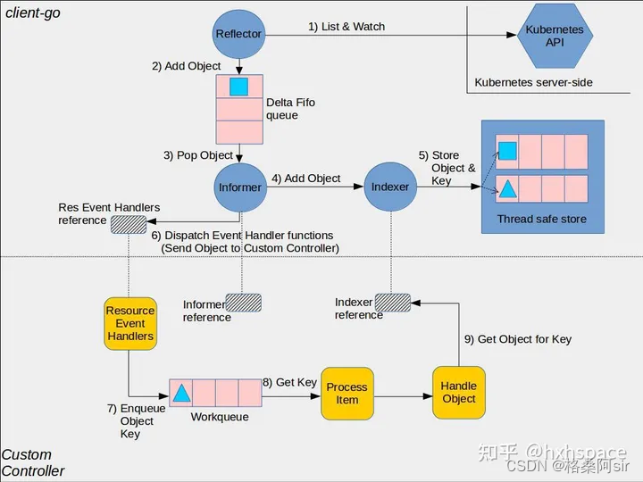

在阅读源码后，我发现，实际上client-go并不是只有 client-go 架构图中的一套这种组件，而是**以informer作为基本单位，每个informer 有自己的一套组件**。

**每种GVR资源，都有自己对应的informer**，我们可以选择性的创建informer并启动，进而仅从apiserver ListAndWatch 自己需要的资源就可以了。

每创建一种资源的informer对象，**该对象就携带了自己需要的 Reflector、DeltaFIFO、Controller、Indexer、Processer**，启动之后，该 **informer 作为一个单独的协程启动**，负责自己资源的 ListAndWatch、缓存、事件处理 等。下面展示 Service 的Informer 内部List和Watch是怎么来的。

``` go
func NewFilteredServiceInformer(client kubernetes.Interface, namespace string, resyncPeriod time.Duration, indexers cache.Indexers, tweakListOptions internalinterfaces.TweakListOptionsFunc) cache.SharedIndexInformer {
	return cache.NewSharedIndexInformer(
		&cache.ListWatch{  // 在此处创建ListWatch 对象
			ListFunc: func(options metav1.ListOptions) (runtime.Object, error) {
				if tweakListOptions != nil {
					tweakListOptions(&options)
				}
				return client.CoreV1().Services(namespace).List(context.TODO(), options)  // 使用client（此处一般就是clientSet）来实现 List and Watch  
			},
			WatchFunc: func(options metav1.ListOptions) (watch.Interface, error) {
				if tweakListOptions != nil {
					tweakListOptions(&options)
				} // informer 通过Watch订阅api server上某种资源对象的事件
				return client.CoreV1().Services(namespace).Watch(context.TODO(), options)
			},
		},
		&corev1.Service{},
		resyncPeriod,
		indexers,
	)
}
```

informer 示例代码如下，实现查询所有的pod:

``` go
package main

import (
	"fmt"

	"k8s.io/apimachinery/pkg/labels"
	"k8s.io/client-go/informers"
	"k8s.io/client-go/kubernetes"
	"k8s.io/client-go/tools/cache"
	"k8s.io/client-go/tools/clientcmd"
)

func main() {
	// 1. 构建与 kube-apiserver 通信的 config 配置
	config, err := clientcmd.BuildConfigFromFlags("", clientcmd.RecommendedHomeFile)
	if err != nil {
		panic(err)
	}
	// 2. 初始化与 apiserver 通信的 clientSet
	clientSet, err := kubernetes.NewForConfig(config)
	if err != nil {
		panic(err)
	}
	// 3. 利用 clientSet 初始化 shared informer factory 以及 pod informer
	/* 我们要使用client-go操作一种资源，需要创建该资源对应的informer，并启动起来。
	可创建之后，下次再想使用，再创建一次的话，未免太浪费资源了，因此就推出了这么一种结构 SharedInformerFactory
	SharedInformerFactory 内部缓存所有已经创建过的informer，可一次全部开启。同时下次再创建，就会直接使用缓存，不会再创建新的informer，节省了资源
	factory 中保存的informer 都是cache.SharedIndexInformer 接口，其实现类是 cache.sharedIndexInformer，它就是client-go 的基本单位，里面存储着informer的 indexer、controller、processor、listerWatcher 等
	*/
	// factory := informers.NewSharedInformerFactory(clientSet, 30*time.Second)
	factory := informers.NewSharedInformerFactoryWithOptions(clientSet, 0, informers.WithNamespace("default"))

	// 在 k8s.io/client-go/informer 包下，给每一种GVR，都提供了一个接口类型，用于表示这种 GVR 资源的informer。比如还有 NodeInformer、NamespaceInformer、SecretInformer等
	// 但这些接口都不能直接使用，我们使用它的 Informer() cache.SharedIndexInformer 方法，使用其返回的 cache.SharedIndexInformer
	// 因此，这些资源 xxxInformer 接口，其实就是对 cache.SharedIndexInformer 类型的封装。
	podInformer := factory.Core().V1().Pods()
	informer := podInformer.Informer()

	// 4. 注册informer 的自定义 ResourceEventHandler
	informer.AddEventHandler(cache.ResourceEventHandlerFuncs{
		AddFunc: func(obj interface{}) {
			fmt.Println("Add Event")
		},
		UpdateFunc: func(oldObj, newObj interface{}) {
			fmt.Println("Update Event")
		},
		DeleteFunc: func(obj interface{}) {
			fmt.Println("Delete Event")
		},
	})
	// 5. 启动 shared informer factory ，开始informer 的 list & watch 操作
	stoper := make(chan struct{}) // 能放任何类型的无缓冲通道
	go factory.Start(stoper)      // 把factory 中已经创建的所有informer都启动，每个informer 都是独立的协程，互不影响，各自进行 list and watch
	// 6. 等待informer 从kube-apiserver 同步资源完成，即informer的list 操作获取的对象都存入到informer 的indexer本地缓存
	cache.WaitForCacheSync(stoper, informer.HasSynced)
	// 7. 创建lister，从informer 中的 indexer 本地缓存中获取对象
	podLister := podInformer.Lister()  // Lister() 返回的结果就是indexer
	podList, err := podLister.List(labels.Everything())
	if err != nil {
		panic(err)
	}
	for _, pod := range podList {
		fmt.Printf("pod.Name: %v\n", pod.Name)
	}
}

```

### controller 实例

下面是另一个示例，开发一个controller，实现效果见代码注释。

首先编写` main.go`

``` go
package main

import (
	"log"

	"test-client-go/informer/test-pod-svc/pkg"

	"k8s.io/client-go/informers"
	"k8s.io/client-go/kubernetes"
	"k8s.io/client-go/rest"
	"k8s.io/client-go/tools/clientcmd"
)

/*
实现这个效果：
创建或更新 pod 的时候，如果这个pod 的 label 中有标签 app:nginx，那么在创建或更新这个 pod 的时候，会自动为它创建一个 service。
删除pod的时候，如果这个pod的 label 中，包含了 app:nginx ，那么同时也要删除它的 service。
删除 service 时，如果这个 svc 属于某个 pod，那么就将 svc 自动重建
*/

// 定义我们控制的命名空间
const namespaceCtl = "default"

func main() {
	// 创建一个 集群客户端配置
	config, err := clientcmd.BuildConfigFromFlags("", clientcmd.RecommendedHomeFile)
	if err != nil {
		inClusterConfig, err := rest.InClusterConfig()
		if err != nil {
			log.Fatalln("can't get config")
		}
		config = inClusterConfig
	}
	clientSet, err := kubernetes.NewForConfig(config)
	if err != nil {
		panic(err)
	}
	// 创建一个 informerFactory，并设置关联的命名空间
	factory := informers.NewSharedInformerFactoryWithOptions(clientSet, 0, informers.WithNamespace(namespaceCtl))
	// 使用 informerFactory 创建 Pod 资源的 informer 对象
	podInformer := factory.Core().V1().Pods()
	// 使用 informerFactory 创建 service 资源的 informer 对象
	serviceInformer := factory.Core().V1().Services()

	// 创建一个我们自定义的控制器
	controller := pkg.NewController(clientSet, podInformer, serviceInformer)

	// 创建一个停止的信号
	stopCh := make(chan struct{})
	// 启动informerFactory，会启动我们已经创建的 serviceInformer 和 ingressInformer
	factory.Start(stopCh)
	// 等待所有 informer 从etcd 实现全量同步
	factory.WaitForCacheSync(stopCh)

	// 启动自定义控制器
	controller.Run(stopCh)
}
```

然后编写` pkg/controller.go`

``` go
package pkg

import (
	"context"
	"fmt"
	"reflect"
	"time"

	corev1 "k8s.io/api/core/v1"
	"k8s.io/apimachinery/pkg/api/errors"
	metav1 "k8s.io/apimachinery/pkg/apis/meta/v1"
	"k8s.io/apimachinery/pkg/util/intstr"
	"k8s.io/apimachinery/pkg/util/runtime"
	"k8s.io/apimachinery/pkg/util/wait"
	informercorev1 "k8s.io/client-go/informers/core/v1"
	"k8s.io/client-go/kubernetes"
	listercorev1 "k8s.io/client-go/listers/core/v1"
	"k8s.io/client-go/tools/cache"
	"k8s.io/client-go/util/workqueue"
)

const (
	// worker 数量
	workNum = 5
	// pod 指定 需要有的 label
	labelKey   = "app"
	labelValue = "nginx"
	// 调谐失败的最大重试次数
	maxRetry = 10
)

type controller struct {
	client        kubernetes.Interface
	podLister     listercorev1.PodLister
	serviceLister listercorev1.ServiceLister
	queue         workqueue.RateLimitingInterface
}

func NewController(clientset *kubernetes.Clientset, podInformer informercorev1.PodInformer, serviceInformer informercorev1.ServiceInformer) *controller {
	// 控制器中，包含一个clientset、service和 pod 的缓存监听器、一个workqueue
	c := &controller{
		client:        clientset,
		podLister:     podInformer.Lister(),
		serviceLister: serviceInformer.Lister(),
		queue:         workqueue.NewNamedRateLimitingQueue(workqueue.DefaultControllerRateLimiter(), "servcieManager"),
	}
	// 为 podInformer 添加 ResourceEventHandler
	podInformer.Informer().AddEventHandler(cache.ResourceEventHandlerFuncs{
		AddFunc:    c.addPod,    // 创建 pod时触发
		UpdateFunc: c.updatePod, // 修改 pod时触发
		// 我们使用 OwnerReference 将 service 与对应的pod 关联起来。因此删除pod后，对应的service 会自动删除
	})
	// 为 serviceInformer 添加 ResourceEventHandler
	serviceInformer.Informer().AddEventHandler(cache.ResourceEventHandlerFuncs{
		// 删除 ingress 时触发
		DeleteFunc: c.deleteService,
	})
	return c
}

func (c *controller) addPod(obj interface{}) {
	// 将 添加 Pod 的 key 加入 workqueue
	c.enqueue(obj) // 这里的 obj 仍是资源对象
}

func (c *controller) updatePod(oldObj interface{}, newObj interface{}) {
	// 如果两个对象一致，就无需触发修改逻辑
	if reflect.DeepEqual(oldObj, newObj) {
		return
	}
	// todo 比较annotation
	// 将修改 pod 的 key 加入 workqueue
	c.enqueue(newObj)
}
func (c *controller) deleteService(obj interface{}) {
	// 判断 svc 是否又 ownerReference，有就再次创建这个 svc
	svc := obj.(*corev1.Service)
	ownerRef := metav1.GetControllerOf(svc)
	if ownerRef == nil || ownerRef.Kind != "Pod" {
		return // 该 svc 不是我们需要处理的svc
	}
	// 如果service的 ownerReference 已经绑定到 pod，则需要处理
	c.enqueue(obj) // 这里的 obj 仍是资源对象
}

// enqueue 将 待添加service 的 key 加入 workqueue
func (c *controller) enqueue(obj interface{}) {
	// 调用工具方法，获取 kubernetes资源对象的 key（默认是 ns/name（命名空间约束下的资源），或 name（无关命名空间的资源） ）
	key, err := cache.MetaNamespaceKeyFunc(obj)
	// 获取失败，不加入队列，即本次事件不予处理
	if err != nil {
		runtime.HandleError(err)
		return
	}
	// 将 key 加入 workqueue
	c.queue.Add(key)
}

// dequeue 将处理完成的 key 出队
func (c *controller) dequeue(item interface{}) {
	c.queue.Done(item)
}

// Run 启动 controller
func (c *controller) Run(stopCh chan struct{}) {
	// 启动多个worker，同时对workqueue 中的事件进行处理
	for i := 0; i < workNum; i++ {
		go wait.Until(c.worker, time.Minute, stopCh)
	}
	// 启动完毕后，Run函数就停止在这里，等待停止信号
	<-stopCh
}

// worker方法
func (c *controller) worker() {
	// 死循环，worker处理完一个，再去处理下一个
	for c.processNextItem() {
	}
}

// processNextItem 处理下一个
// 从队列中的key 我们不知道该key 应该执行新增、更新还是删除事件
// 我们需要在调谐函数中判断 key 对应的状态和最新的状态是否是一致的。
// 比如拿到key 在集群中找不到该对象，就需要新增
func (c *controller) processNextItem() bool {
	// 从 workerqueue 中取出一个 key
	item, shutdown := c.queue.Get()
	// 如果已经收到停止信号了，则返回false，worker 就会停止处理
	if shutdown {
		return false
	}
	// 处理完成后，将这个key 出队
	defer c.dequeue(item)

	// 转成 string 类型的 key
	key := item.(string)
	// 处理service 逻辑的核心方法
	err := c.syncPod(key)
	// 处理过程错误，进入错误统一处理逻辑
	if err != nil {
		c.handleError(key, err)
	}
	// 处理结束，返回 true
	return true
}

// handleError 错误统一处理逻辑
func (c *controller) handleError(key string, err error) {
	// 如果当前 key 的处理次数，还不到最大的重试次数，就重新进入队列
	if c.queue.NumRequeues(key) < maxRetry {
		c.queue.AddRateLimited(key)
		return
	}
	// 否则，运行时统一处理错误
	runtime.HandleError(err)
	// 不再处理这个key
	c.queue.Forget(key)
}

// syncPod 处理 pod 逻辑的核心方法
func (c *controller) syncPod(key string) error {
	// 将key 切割为 ns 和 name
	namespace, name, err := cache.SplitMetaNamespaceKey(key)
	if err != nil {
		return err
	}
	// 从 indexer 中，获取 pod
	pod, err := c.podLister.Pods(namespace).Get(name)
	// 没有 pod 直接返回
	if errors.IsNotFound(err) {
		return nil
	}
	if err != nil {
		return err
	}
	fmt.Printf("pod.Name: %v, pod.Namespace: %v\n", pod.Name, pod.Namespace)
	value, ok := pod.Labels[labelKey]
	svc, err := c.serviceLister.Services(namespace).Get(name)

	// 检查 pod 是否有相应的label
	if ok && value == labelValue && errors.IsNotFound(err) { // 如果被加入到队列的pod 确实有相应标签
		// 创建 service
		newSvc := c.createService(pod)
		// 调用controller中的client，完成 service 的创建
		fmt.Printf("为pod：%v 创建相应的 service \n", pod.Name)
		_, err = c.client.CoreV1().Services(namespace).Create(context.TODO(), newSvc, metav1.CreateOptions{})
		if err != nil {
			return err
		}
	} else if !ok && svc != nil {
		// 与pod同名的svc 存在，但pod 没有相应标签，此时将此svc 删除
		err := c.client.CoreV1().Services(namespace).Delete(context.TODO(), name, metav1.DeleteOptions{})
		if err != nil {
			return err
		}
	}
	return nil
}

// 根据 pod 相关信息为其创建 service
func (c *controller) createService(pod *corev1.Pod) *corev1.Service {
	return &corev1.Service{
		ObjectMeta: metav1.ObjectMeta{
			Name:      pod.Name,
			Namespace: pod.Namespace,
			OwnerReferences: []metav1.OwnerReference{ // 将 service 与pod 关联起来
				*metav1.NewControllerRef(pod, corev1.SchemeGroupVersion.WithKind("Pod")),
			},
		},
		Spec: corev1.ServiceSpec{
			Selector: map[string]string{
				labelKey: labelValue,
			},
			Ports: []corev1.ServicePort{
				{
					Port:       8080,
					TargetPort: intstr.FromInt(80),
				},
			},
		},
	}
}
```

我们还可以把上述应用打包成docker 镜像，之后就可以用pod 的形式来执行应用了。

### 实例 pod 部署

我们在minikube 中进行下面的实验。

**1、构建镜像**

我们的代码路径是 `/home/ubt/test-client-go/test-pod-svc`，在其中添加 Dockerfile，内容如下：

``` dockerfile
# 第一阶段，编译可执行文件
FROM golang:1.22 as builder

# 设置动工作目录
WORKDIR /app
# 将执行该dockerfile 文件的目录添加到镜像的 WORKDIR 目录
COPY . . 
RUN CGO_ENABLE=0 go build -o pod-manage-lt main.go

# 第二阶段，运行
FROM  alpine:3.15

WORKDIR /app
# 将第一个阶段的文件拷贝到第二个阶段这里的当前目录 . ，通过--from 来获取其它阶段的文件
COPY --from=builder /app/pod-manage-lt .
CMD ["./pod-manage-lt"]
```

在minikube中创建相应目录， 我们将此终端命名为t2。

``` shell
minikube ssh # 进入minikube
mkdir client-go
cd client-go
pwd  # 此时路径： /home/docker/client-go
```

另开一个终端执行 ` minikube mount ../test-pod-svc:/home/docker/client-go` 将我们的项目目录挂载到minikube 中，此终端的任务不要关。

我们此时返回t2中可以看到有相应的文件了（如果没有就重新进入一遍）。然后执行`docker build -t svc-manager:1.0.0 .`我们发现，要么镜像拉不下来，要么 `go build` 命令一直在下载库包看，总之无法打出镜像来。

于是我们只能在机器上把go 文件编译，直接装入镜像。并且使用其他镜像源拉取镜像。

在minikube 外，机器的go 环境中直接将应用编译，首先设置 `go env -w CGO_ENABLED=0`。然后`go build -o pod-manage-lt main.go`。得到可执行文件 ` pod-manage-lt` 。

修改Dockerfile 如下：

``` dockerfile
# 使用镜像仓库的镜像
FROM  dockerhub.icu/library/alpine:3.15

WORKDIR /app
# 将应用可执行文件添加到镜像的 WORKDIR 目录
COPY ./pod-manage-lt . 
CMD ["./pod-manage-lt"]
```

然后在 t2 中执行`docker build -t svc-manager:1.0.0 .`     **成功构建镜像**。

**2、编写资源文件**  

我们使用deploy 来启动pod。并把所有的资源文件放在 menifests 文件夹中

使用命令自动生成yaml文件

``` shell
kubectl create deploy svc-manager-dp --image svc-manager:1.0.0 --dry-run=client -oyaml > manifests/svc-manager-dp.yaml
kubectl apply -f manifests/svc-manager-dp.yaml # 执行
```

此时不出意外我们能看到相应的pod 是running，不过使用logs 查看该pod 的日志，发现它一直在报错，这是因为默认使用的 serviceAccount 是 default，它的权限不足以读取 k8s api server 。现在把这个dp 删除。

**3、创建  serviceAccount**等

我们需要创建单独的serviceAccount 并给它赋予权限。

``` shell
kubectl create serviceaccount svc-manager-sa -n default  --dry-run=client -oyaml > manifests/svc-manager-sa.yaml
```

然后 manifests/svc-manager-dp.yaml 文件中的 spec.template.spec 添加字段 ` serviceAccountName: svc-manager-sa`	。

接着创建 role 给sereviceAccount赋予权限。我们的控制器需要监听（list & watch） pod 资源，并需要 list/watch/create/update/delete service 资源。

``` shell
kubectl create role svc-manager-role --resource=pod,service --verb list,watch,create,update,delete --dry-run=client -o yaml > manifests/svc-manager-role.yaml
```

然后将 role 绑定到 serviceaccount 上

``` shell
kubectl create rolebinding svc-manager-rb --role svc-manager-role --serviceaccount default:svc-manmager-sa --dry-run=client -o yaml > manifests/svc-manager-rb.yaml 
```

把上述 yaml apply

``` shell
kubectl apply -f manifests
```

此时若不出意外我们应该能看看我们的应用pod 启动起来了，使用 `kubectl logs ` 查看他的输出可以看到它没有报错了，并正确打印了输出。此时可以测试应用的功能了。

## 控制器 operator

K8s中，控制器的含义是通过监控集群的公共状态，并致力于将当前状态转变为期望的状态。至于如何转变，由控制器的控制循环处理相应的逻辑。

一个控制器至少追踪一种k8s 资源。该资源的控制器负责确保当前状态（status）接近期望状态（spec）。不同控制器可以相互配合完成一项复杂的任务。

**Reflector**

Reflector：list and watch 持续监听k8s集群中指定资源类型的API，当发现变动和更新时，就会创建一个发生变动的 **对象副本**，并将其添加到队列DeltaFIFO中

reflector 的创建

``` go
func NewReflector(lw ListerWatcher, expectedType interface{}, store Store, resyncPeriod time.Duration) *Reflector {
	return NewReflectorWithOptions(lw, expectedType, store, ReflectorOptions{ResyncPeriod: resyncPeriod})
}
```

- lw：interface，包含了interface Lister和Watcher，通过 ListerWatcher 获取初始化指定资源的列表和监听指定资源的变化
- expectedType：指定资源类型
- store：指定存储，
- resyncPeriod：同步周期

**List 和 Watch**：保证资源的可靠性，实时性和顺序性

- List ：指定资源的对象的全量更新，并将其更新到缓存中
- Watch：指定资源对象的增量更新，调用watchhandler 处理

reflector 中的重要对象 ResourceVersion 和 Bookmark

- ResourceVersion：保证客户端数据一致性和顺序性，并发控制

- Bookmark：减少 API Server 负载，更新客户端保存的最近一次的 ResourceVersion

reflector底层去查找资源也是通过 clientSet 实现的。

**Delta FIFO**

client-go 提供的存储。


# 15. 相关工具

## 操作CRD

client-go 为每种k8s 内置资源提供对应的 clientset 和 informer。

对于CRD资源，我们只能使用 DynamicClient 这种通用的Client去操作。但是DynamicClient 是为操作所有资源而编写的通用Client，自然没有某种资源对应的Informer、Lister代码，所以使用DynamicClient，就无法像 使用ClientSet 那样，操作某一个特定资源的Informer、Lister等。

因此，我们为 CRD资源生成和内建资源一样的 Informer、Lister代码，这样的话，开发控制器的时候，我们就可以像使用内建资源一样，为CRD的informer注册事件方法，并使用Lister从缓存中获取数据。

而上述 Informer、Lister代码大部分是重复的，因此我们可以使用 `code-generator` 来帮助我们生成我们需要的代码。

**code-generator** 是一个 **代码生成工具集合，内部包含很多gen工具**，用于自动生成与 Kubernetes 相关的客户端库、API 服务器（API server）和其他与 Kubernetes 相关的代码。主要有两个应用场景。

- 为 CRD 编写自定义controller时，生成 `versioned client, informer, lister，DeepCopy ` 等
- 编写自定义 API Serever 时，生成 `internal`和`versioned` 类型的转化`defaulters`、`internal`和`versioned` 的 `clients`和`informer`。

### code-generator 常用的gen工具

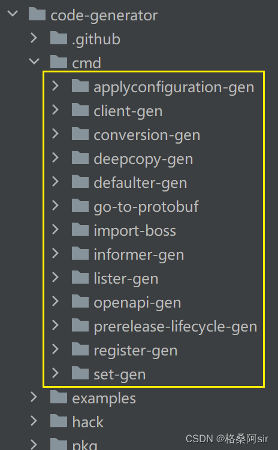

- **deepcopy-gen**：为每个 T 类型生成 func (t* T) DeepCopy() *T 方法，API 类型都需要实现深拷贝
- **client-gen**：生成类型化客户端集合(typed client sets)，即与 Kubernetes API 服务器通信的客户端代码。
- **informer-gen**：用于生成基于 Kubernetes API 资源的 Informer，提供事件机制来响应资源的事件，方便开发者执行资源监视操作。
- **lister-gen**：用于生成 Kubernetes API 资源的 Lister，为 get 和 list 请求提供只读缓存层（通过 indexer 获取），可以实现高效的资源列表查询。
- **register-gen**：自动生成 API 资源类型的注册表代码
- **conversion-gen**：用于生成 Kubernetes 对象之间的转换器（Converter），方便在不同版本之间进行对象转换。
- **openapi-gen**：用于生成 Kubernetes API 的 OpenAPI 规范，以便进行文档化和验证。

### code-generator 使用

code-generator 位于 Kubernetes 代码库中的 `staging/src/k8s.io/code-generator` 包中，github地址为：https://github.com/kubernetes/code-generator

要使用 code-generator 需要先 git 这个库。然后切换到与k8s对应的版本，再安装相应的工具

``` shell
git clone https://github.com/kubernetes/code-generator.git
git checkout v0.30.2 # 我的k8s 版本是 1.30.2
# 在此仓库中运行，我们只安装如下几个工具。
go install ./cmd/{client-gen,deepcopy-gen,informer-gen,lister-gen}
```

用 `go install` 命令来安装生成的代码包。该命令可以将生成的代码包安装到 `$GOPATH/pkg/bin` 目录下，形成可执行文件供我们使用。但是我们一般不是直接使用这里的工具，而是使用 code-generator 提供的脚本 `kube_codegen.sh`（1.28版本后）。`kube_codegen.sh`其中主要是三个函数 gen_helpers，gen_openapi，gen_client 实现功能。


接着我们创建自己的 crd，写些代码。我们可以仿照这个例子来写 [kubernetes/sample-controller: Repository for sample controller. Complements sample-apiserver (github.com)](https://github.com/kubernetes/sample-controller)。从例子可以看出，对CRD 的定义也是 GVR 定义的，例子的Group是 samplecontroller，version 是 v1alpha1。

接着我们开始开发

``` shell
# 创建并进入项目目录
mkdir code-generator-demo && cd code-generator-demo

# 初始化项目
go mod init code-generator-demo

# 我们把自己要写的资源文件放在 pkg/apis 下，等会生成的代码放在 pkg/generated 下
mkdir pkg pkg/apis pkg/generated  && cd pkg/apis
# 定义 group为 crd.example.com，version为 v1
mkdir crd.example.com crd.example.com/v1
# 我们只需要编写v1中的三个文件
touch crd.example.com/v1/doc.go crd.example.com/v1/types.go crd.example.com/v1/register.go 
```

code-generator是使用**注释标记**工作的，不同的gen工具，有不同的注释标记。标记的使用方法：

- [Generating CRDs - The Kubebuilder Book](https://book.kubebuilder.io/reference/generating-crd)

- [ K8s 代码生成教程 - ZengXu's BLOG](https://www.zeng.dev/post/2023-k8s-api-codegen/#-all-in-one-script)
- [Kubernetes Deep Dive: Code Generation for CustomResources (redhat.com)](https://www.redhat.com/en/blog/kubernetes-deep-dive-code-generation-customresources)

我们查看官方例子的 https://github.com/kubernetes/sample-controller/blob/master/pkg/apis/samplecontroller/v1alpha1 文件是什么内容，我们照着写就行。如例子所示 K8s 相关项目对外 API 都会包含 3 文件：

- **types.go**：编写crd的资源结构，code-generator 的注释 tag一般写在这边里面，这是我们主要要写的

> crd 的设计中，内部变量使用值类型还是引用类型通常根据**字段是否总是有意义**来决定。
>
> * 如果字段总是有意义，即使字段为空（例如一个默认状态对象），应选择值类型。
> * 如果字段的存在本身是可选的（如某些场景不需要它），选择引用类型。（与 `omitempty` 配合被自动省略）。

``` go
package v1

import (
	metav1 "k8s.io/apimachinery/pkg/apis/meta/v1"
)

/*
 genclient: 表示生成该资源的 clientSet
 deepcopy-gen：使用该工具生成，并基于后面的接口生成
*/

// +genclient
// +k8s:deepcopy-gen:interfaces=k8s.io/apimachinery/pkg/runtime.Object

// Foo is a specification for a Foo resource
type Foo struct {
	/*
		针对单个资源的定义
	*/
	metav1.TypeMeta   `json:",inline"`
	metav1.ObjectMeta `json:"metadata,omitempty"`

	Spec   FooSpec   `json:"spec"`
	Status FooStatus `json:"status"`
}

/* 资源的属性定义，要和定义的manifest 对应 */
type FooSpec struct {
	DeploymentName string `json:"deploymentName"`
	Replicas       *int32 `json:"replicas"`
}

// FooStatus is the status for a Foo resource
type FooStatus struct {
	AvailableReplicas int32 `json:"availableReplicas"`
}

// +k8s:deepcopy-gen:interfaces=k8s.io/apimachinery/pkg/runtime.Object

type FooList struct {
	/*
		针对资源列表的定义
	*/
	metav1.TypeMeta `json:",inline"`
	metav1.ListMeta `json:"metadata"`

	Items []Foo `json:"items"`
}
```

- **doc.go**：声明了按照 package 维度，为所有 structs 提供生成的声明

``` go
/* 
告诉代码生成器生成整个包的对象深拷贝方法。这意味着生成的代码将包含用于深拷贝包中所有对象的相关代码
如下，它是使用 deepcopy-gen 工具生成的
*/
// +k8s:deepcopy-gen=package
/* 指定自定义 API 组的名称。这个注释用于定义自定义 API 资源的 API 组，使其能够与其他资源进行区分 */
// +groupName=crd.example.com

package v1
```

- **register.go**：提供注册到 runtime.Scheme 的函数。code-generator 的 register-gen 可以读取 doc.go 中的 // +groupName，并生成 register.go

``` go
package v1

import (
	metav1 "k8s.io/apimachinery/pkg/apis/meta/v1"
	"k8s.io/apimachinery/pkg/runtime"
	"k8s.io/apimachinery/pkg/runtime/schema"
)

const mycrdGroupName = "example.com" // 我们自定义类型的 Group
const version = "v1"

// SchemeGroupVersion is group version used to register these objects
var SchemeGroupVersion = schema.GroupVersion{Group: mycrdGroupName, Version: version}

// Kind takes an unqualified kind and returns back a Group qualified GroupKind
func Kind(kind string) schema.GroupKind {
	return SchemeGroupVersion.WithKind(kind).GroupKind()
}

// Resource takes an unqualified resource and returns a Group qualified GroupResource
func Resource(resource string) schema.GroupResource {
	return SchemeGroupVersion.WithResource(resource).GroupResource()
}

var (
	// SchemeBuilder initializes a scheme builder
	SchemeBuilder = runtime.NewSchemeBuilder(addKnownTypes)
	// AddToScheme is a global function that registers this API group & version to a scheme
	AddToScheme = SchemeBuilder.AddToScheme
)

// Adds the list of known types to Scheme.
func addKnownTypes(scheme *runtime.Scheme) error {
	scheme.AddKnownTypes(SchemeGroupVersion,
		&Foo{},
		&FooList{},
	)
	metav1.AddToGroupVersion(scheme, SchemeGroupVersion)
	return nil
}
```

### 使用脚本生成

上述 Generators 中许多参数存在重复，针对这个问题 [kubernetes/code-generator](https://github.com/kubernetes/code-generator) 早先提供了 generate-groups.sh 和 /generate-internal-groups.sh 脚本批量生成。1.28 alpha 之后则提供了表述更清晰更好维护的脚本 kube_codegen.sh。

我们查看一个实例：https://github.com/kubernetes/sample-controller/。发现使用kube_codegen.sh 来生成代码也是要我们自己编写 `hack/update-codegen.sh`。因此我们模仿它来完成。

``` shell
# 先切换到项目目录 
cd ~/test-client-go/code-generator-demo
mkdir hack
cd hack
touch update-codegen.sh
chmod +x update-codegen.sh
# 把上面示例的 update-codegen.sh 文件内容复制到本地，
# 同样地把 boilerplate.go.txt 文件也复制一份，它是用来定义生成的代码文件的头部注释信息、版权声明、作者信息等内容的。可以使用空文件。
# 然后修改 update-codegen.sh 文件的一些内容
#   将 THIS_PKG 改成本项目名，即go mod中module 
#   将 CODEGEN_PKG 改成 code-generator 库所在目录，比如/home/ubt/github.com/code-generator，因为要用它来找 kube_codegen.sh

# 现在来执行该脚本
./update-codegen.sh
```

执行无误可以看到生成了 deepcopy，clientset，informer，lister等方法。

### 使用 CRD

> CRD 项目实战参考：
>
> - [Kubernetes operator（六）CRD控制器 开发实战篇_crd开发实战-CSDN博客](https://blog.csdn.net/a1369760658/article/details/135976981)
>
> - [2022年最新k8s编程operator篇-16.CRD实战_哔哩哔哩_bilibili](https://www.bilibili.com/video/BV1q5411R7bM/?spm_id_from=pageDriver&vd_source=b223a33d3e538f8afa1020f731ad95a0)

自定义资源的各种方法都定义好了。我们来通过代码来查询并控制该资源。

编写 main.go 如下

``` go
package main

import (
	clientset "code-generator-demo/pkg/generated/clientset/versioned"
	"context"
	"fmt"

	v1 "k8s.io/apimachinery/pkg/apis/meta/v1"
	"k8s.io/client-go/tools/clientcmd"
)

func main() {
	config, err := clientcmd.BuildConfigFromFlags("", clientcmd.RecommendedHomeFile)
	if err != nil {
		panic(err)
	}
	// 这里我们使用code-generator 生成的clientset库来创建 clientset
	clientSet, err := clientset.NewForConfig(config)
	if err != nil {
		panic(err)
	}
	list, err := clientSet.CrdV1().Foos("default").List(context.TODO(), v1.ListOptions{})
	if err != nil {
		panic(err)
	}
	for _, crd := range list.Items{
		fmt.Println(crd.Name)
	}
}
	// 使用 informer，仍然使用生成的 externalversions 库来完成
	factory := externalversions.NewSharedInformerFactory(clientSet, 0)
	// 然后 informer 的用法就和内建资源一样了
	factory.Crd().V1().Foos().Informer().AddEventHandler(cache.ResourceEventHandlerFuncs{
		AddFunc: func(obj interface{}) {
			// TODO
		},
	})
```

运行我们发现我们都没有注册Foo 这个CRD，我们注册一下。因为我们的 types.go 直接复制的[官方例子](https://github.com/kubernetes/sample-controller/tree/master/artifacts/examples)的，因此我们把例子的manifests 也复制一下。

注意我们在之前 register.go 有一些修改，

``` go
const mycrdGroupName = "example.com" // 我们自定义类型的 Group
const version = "v1"
```

因此我们注册 Foo CRD 的时候也要做相应修改。

上述操作完成之后，`go run main.go` 即可输出 foo 对象的名称了。

## controller-tools

上述我们编写 CRD 控制器的过程中，有两个问题

- CRD 资源的go 定义或yaml 定义还需要我们自己手动写
- types.go 也需要我们手动写

这两个问题都是重复性的工作，k8s 提供了 controller-tools 来自动帮我们完成。github 地址为：https://github.com/kubernetes-sigs/controller-tools。前往其 github 地址查看得知，controller-tools 是kubernetes-sigs 的一个子项目。它同时也是 kubebuilder 的子项目。

kubernetes-sigs 是一个由 Kubernetes 社区维护的 GitHub 组织，其中包含了许多与 Kubernetes 相关的项目，这些项目通常是为 Kubernetes 生态系统开发的，用于提供各种功能和工具。

- **kustomize**：一种用于 Kubernetes 部署的配置管理工具，可以通过 YAML 声明文件对 Kubernetes 对象进行自定义，并且支持多环境部署（例如 dev、stage、prod）。
- **kubebuilder**：一种用于构建 Kubernetes API 的 SDK 工具，可以帮助开发者快速构建和测试 Kubernetes 的自定义控制器。
- **cluster-api**：一种 Kubernetes 的 API 扩展，用于管理 Kubernetes 集群的生命周期，包括创建、扩容和删除。它允许开发者使用 Kubernetes 的声明性 API 来管理整个集群的生命周期。
- **kubefed**：用于跨 Kubernetes 集群联邦的控制平面。它提供了一种将多个 Kubernetes 集群组合成一个统一的逻辑实体的方法，同时保持每个集群的独立性。
- **controller-tools**：用于简化 Kubernetes 控制器的开发，提供了一组工具来生成和更新 Kubernetes API 对象的代码，以及构建自定义控制器所需的代码框架。

### controller-tools提供的工具

controller-tools源码的cmd目录下，可以看到包含三个工具：

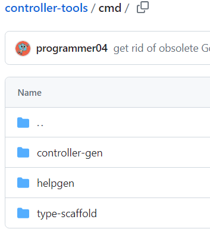 

- **controller-gen**：用于生成 `zz_xxx.deepcopy.go `文件以及 crd 文件（kubebuilder也是通过这个工具生成crd的相关框架的）
- **type-scaffold**：用于生成所需的` types.go `文件
- **helpgen**：用于生成针对 Kubernetes API 对象的代码文档，可以包括 API 对象的字段、标签和注释等信息

### controller-tools 使用

controller-tools 和 code-generator 一样，是使用标记来生成相应的文件。参考：[Generating CRDs - The Kubebuilder Book](https://book.kubebuilder.io/reference/generating-crd.html)

首先下载 controller-tools 

``` shell
git clone https://github.com/kubernetes-sigs/controller-tools.git
cd controller-tools
# 切到最新的 tag
git checkout v0.15.0
# 安装需要的工具
go install ./cmd/{controller-gen,type-scaffold}
```

下面开始使用，切换到常用代码空间，创建工作目录。

``` shell
mkdir controller-tools-demo
cd controller-tools-demo
go mod init controller-tools-demo
mkdir -p pkg/apis/crd.example.com/v1
touch main.go
go get k8s.io/client-go
```

然后**使用 type-scaffold 生成资源的 go 定义**

``` shell
type-scaffold --kind Foo
```

该命令不会直接生成文件，而是将生成的 go 代码打印到控制台。以后使用 kubebuilder 可以直接生成文件。我们将代码复制到  pkg/apis/crd.example.com/v1/types.go ，不过生成的代码不包括 `package v1`和 `import metav1 "k8s.io/apimachinery/pkg/apis/meta/v1"`。

同时观察到生成的 Foo 结构体不带任何属性，因此我们自己手动添加以供之后测试。添加的内容跟上一节的Foo 一样就行。

然后**使用 controller-gen 生成 deep-copy 方法**

``` sh
controller-gen object paths=./pkg/... # 将此包下的所有能生成的都生成
```

生成的zz_generated.deepcopy.go 文件中可以有 `in.Spec.DeepCopyInto(&out.Spec)` 这个方法没有实现，我们可以自己实现，也可以直接用 `out.Spec = in.Spec` 替换之。

接下来**生成type 的crd yaml 文件**

首先在v1 文件夹下准备 register.go 

``` go
// +groupName=example.com
package v1
```

然后运行

``` shell
controller-gen crd paths=./pkg/... output:crd:dir=manifests/crd
```

生成 `manifests/crd/example.com_foos.yaml` 文件，就是该 foo CRD 的定义

在生成了客户端代码后，我们还需要手动注册版本v1alpha1的CRD资源，才能真正使用这个client，不然在编译时会出现 undefined: v1alpha1.AddToScheme 错误、undefined: v1alpha1.Resource 错误。

`v1alpha1.AddToScheme、v1alpha1.Resource` 这两个是用于 client 注册的

编写 v1/register.go

``` go
// +groupName=example.com
package v1

import (
	metav1 "k8s.io/apimachinery/pkg/apis/meta/v1"
	runtime "k8s.io/apimachinery/pkg/runtime"
	"k8s.io/apimachinery/pkg/runtime/schema"
)

var (
	// SchemeBuilder initializes a scheme builder
	scheme             = runtime.NewScheme()
	SchemeGroupVersion = schema.GroupVersion{Group: "example.com", Version: "v1"}
)

// Adds the list of known types to Scheme.
func init()  {
	scheme.AddKnownTypes(SchemeGroupVersion,
		&Foo{},
		&FooList{},
	)
	metav1.AddToGroupVersion(scheme, SchemeGroupVersion)
}
```

然后再使用 crd yaml 创建crd 资源，最后编写client 查询调用。不演示了，查看[Kubernetes operator（四）controller-tools 篇-CSDN博客](https://blog.csdn.net/a1369760658/article/details/135932302) 即可。

## api 和 apimachinery

我们在操作 CRD 一节知道自定CRD 的type和register 放在我们自己的项目中，而 k8s 内建资源的type 定义位于 `k8s.io/api` 之中。比如 pod 位于`k8s.io/api/core/v1` 之中

### k8s.io/api

即`k8s.io/api` 存放了所有内建资源 的结构定义文件、scheme注册文件、deepcopy等文件。其中的每一个目录，都代表一个group。一个 Group 下，可能会存在多个 Version。个version下，都会包含三个文件：doc.go、register.go、types.go。

- **doc.go**：声明了按照 package 维度，为所有 structs 提供生成的声明
- **types.go**：编写资源的详细结构，一般包括：资源、资源List、资源Spec、资源Status 的详细定义
- **register.go**：提供注册到 runtime.Scheme 的函数

### k8s.io/apimachinery

**k8s.io/apimachinery** 项目是一个关于Kubernetes API资源的工具集，为 k8s.io/api 项目所有的资源，提供下列能力。

- **ObjectMeta与TypeMeta**：`"k8s.io/apimachinery/pkg/apis/meta/v1"` 中。每个k8s 资源都有这两个属性，它们都在apimachinery中定义。TypeMeta是内嵌的，转json的时候不会有嵌套结构。ObjectMeta 对应资源的metadata。
- **Scheme**：`"k8s.io/apimachinery/pkg/runtime"` 中。我们一般在 `register.go` 中使用。scheme就是为资源注册信息设计的一个数据结构。每个GVK，将自己的信息封装成一个scheme对象，并将这个scheme对象交给APIServer统一管理，API Server就能够认识这种 GVK 了。
  - type对象注册
  - type对象和 GVK 的转换：用多个 map 实现并提供了多种方法。
  - 默认值处理方法注册
  - 版本转换方法注册

> **理解GVR和GVK的用途**
> 在提到，k8s.io/apimachinery 提供了 GR/GVR、GK/GVK 等数据结构。**GR和GVR 负责对接 RESTful 风格的url路径，GK和GVK 负责确定一个具体的kubernetes资源**
>
> **GVR**举例：
>
> - 用户想要获取 apps组下、v1版本的 deployments，如何编写url地址？–> GET /apis/apps/v1/deployments
> - 这个url中，就可以使用 GVR 描述，group为apps，version为v1，Resource为deployments
>
> **GVK**举例：
>
> - 当kubernetes的代码中，想要操作一个资源的时候，如何找到资源的struct 结构？通过GVK去找
> - 比如 apps/v1/Deployment，就可以确定 group为apps，version为v1，kind为Deployment，就可以找到这个资源的struct

- **RESTMapper**：是一个接口，提供了GVK 与 GVR 的转换。有一个默认的实现 DefaultRESTMapper
- **编解码与序列化**：k8s.io/apimachinery 中，关于 序列化 和 编解码 的代码，大都在 `staging/src/k8s.io/apimachinery/pkg/runtime/serializer` 包下
  - **编解码**：`k8s.io/apimachinery/pkg/runtime/interfaces.go` 文件中，提供了序列化的通用接口 `Serializer`。Serializer接口提供了编解码能力（该接口中只有两个接口： Encoder是编码器接口，Decoder是解码器接口）。
  - **json 序列化器**：`k8s.io/apimachinery/pkg/runtime/serializer/json/json.go` 文件。json序列化器 实现了 `runtime.interface.go` 中的Serializer接口，实现了 Encode、Decode方法
  - **yaml 序列化器**：`k8s.io/apimachinery/pkg/runtime/serializer/yaml/yaml.go` 文件
  - **protobuf 序列化器**：`k8s.io/apimachinery/pkg/runtime/serializer/protobuf/protobuf.go` 文件

- **版本转换**：scheme提供了AddConversionFunc方法，用于向scheme中注册 不同资源 的自定义转换器。

有了 k8s.io/apimachinery，就可以很方便的操作 kubernetes API。


## kubebuilder

前面学习了一系列工具， code-generator 和controller-tools 等自动生成client、informer、lister和deepcopy的一系列技术，但是这么多工具都要记住使用方式，实在太繁琐了。

而kubebuilder就是这样一个**聚合型的工具**，它可以实现上述所有功能。kubebuidler 是 kubernetes-sigs（特定兴趣小组）开发的一款用于Operator程序构建和发布的工具。

在kubebuilder github仓库 中，对kubebuilder进行了详细介绍：

- kubebuilder是一个使用自定义资源定义（CRD）构建 Kubernetes API 的框架。
- 如同 Ruby的Rails框架 和 Java的SpringBoot 能够极大地减少Web开发中的重复工作一样，kubebuilder 可以极大的减小 kubernetes API 开发的复杂性，帮助我们开发出最佳实践的 kubernetes API。
- kubebuilder自动生成的代码并非简单的复制-粘贴，而是提供强大的库和工具来简化从零开始构建和发布 Kubernetes API
- 另外重要的点：KubeBuilder 是在 controller-runtime 和 controller-tools 两个库的基础上开发的
- Operator-SDK 是使用 Kubebuilder 作为库的进一步开发的项目

**kubebuilder的官方文档**

- 英文版：https://book.kubebuilder.io/introduction
- 中文版：https://cloudnative.to/kubebuilder/introduction.html、
- 架构如下图：

 

**安装最新发行版本**

``` shell
# download kubebuilder and install locally.

curl -L -o kubebuilder "https://go.kubebuilder.io/dl/latest/$(go env GOOS)/$(go env GOARCH)"
chmod +x kubebuilder && mv kubebuilder /usr/local/bin/
```

### kubebuilder基本使用

以前开发一个Operator，我们需要自己创建一个golang项目，自己编写go.mod、Makefile、Dockerfile等文件。现在使用 kubebuilder 创建一个脚手架项目，将会把这些文件都给我们生成好，还会使用 Kustomize 生成一些默认配置文件，以便更轻松地管理和部署Operator项目

kubebuilder init 初始化 Project：

``` shell
mkdir test-kubebuilder # 新建项目空间
kubebuilder init --domain my.domain --repo my.domain/guestbook
```

- `--domain`：指定自定义资源的 API 组的域名，通常是域名的反向形式，例如 domain.com 反转后为 com.domain
- `--repo`：指定项目代码的存储库位置，go mod 里的模块名

**命令执行结束后，生成了哪些文件和目录**：

```
[root@master guestbook]# tree
.
├── cmd
│   └── main.go
├── config
│   ├── default
│   │   ├── kustomization.yaml
│   │   ├── manager_auth_proxy_patch.yaml
│   │   └── manager_config_patch.yaml
│   ├── manager
│   │   ├── kustomization.yaml
│   │   └── manager.yaml
│   ├── prometheus
│   │   ├── kustomization.yaml
│   │   └── monitor.yaml
│   └── rbac
│       ├── auth_proxy_client_clusterrole.yaml
│       ├── auth_proxy_role_binding.yaml
│       ├── auth_proxy_role.yaml
│       ├── auth_proxy_service.yaml
│       ├── kustomization.yaml
│       ├── leader_election_role_binding.yaml
│       ├── leader_election_role.yaml
│       ├── role_binding.yaml
│       ├── role.yaml
│       └── service_account.yaml
├── Dockerfile
├── go.mod
├── go.sum
├── hack
│   └── boilerplate.go.txt
├── Makefile
├── PROJECT
├── README.md
└── test
    ├── e2e
    │   ├── e2e_suite_test.go
    │   └── e2e_test.go
    └── utils
        └── utils.go

10 directories, 28 files
```

目录解释:

- cmd: 包含主要的应用程序代码，通常是控制器的入口点。
- config: 包含了 Kubernetes 资源的配置文件，包括默认的资源、管理器的资源、监控资源以及角色绑定和服务账户等资源的配置。
- Dockerfile: 用于构建容器镜像的 Dockerfile 文件。
- go.mod 和 go.sum: Go 模块文件，用于管理项目的依赖项。
- hack: 包含一些辅助脚本或模板文件，用于构建或生成代码。
- Makefile: 包含了一些 Make 命令，用于简化项目的构建和部署过程。
- PROJECT: Kubebuilder 项目的配置文件，指定了项目的 API 版本等信息。
- README.md: 项目的说明文档，通常包含了如何构建、运行项目的指南。
- test: 包含测试相关的代码，例如端到端测试和测试工具函数。

### kubebuilder create 创建一个API

上面创建了一个Project `guestbook`，但是从目录上看，还没有创建Operator相关的CRD资源和Controller

**创建 GVK：`webapp/v1/Guestbook`**

```sh
kubebuilder create api --group webapp --version v1 --kind Guestbook # 输出提示 按y确认
```

它会生成如下文件：

``` sh
├── api
│   └── v1
│       ├── groupversion_info.go
│       ├── guestbook_types.go
│       └── zz_generated.deepcopy.go
...
├── config
│   ├── crd
│   │   ├── kustomization.yaml
│   │   └── kustomizeconfig.yaml
│   ├── rbac
│   │   ├── guestbook_editor_role.yaml
│   │   ├── guestbook_viewer_role.yaml
......
│   └── samples
│       ├── kustomization.yaml
│       └── webapp_v1_guestbook.yaml
...
├── internal
│   └── controller
│       ├── guestbook_controller.go
│       ├── guestbook_controller_test.go
│       └── suite_test.go
```

更改 CRD types文件

``` yaml
// GuestbookSpec defines the desired state of Guestbook
type GuestbookSpec struct {
    // INSERT ADDITIONAL SPEC FIELDS - desired state of cluster
    // Important: Run "make" to regenerate code after modifying this file

    // Quantity of instances
    // +kubebuilder:validation:Minimum=1
    // +kubebuilder:validation:Maximum=10
    Size int32 `json:"size"`

    // Name of the ConfigMap for GuestbookSpec's configuration
    // +kubebuilder:validation:MaxLength=15
    // +kubebuilder:validation:MinLength=1
    ConfigMapName string `json:"configMapName"`

    // +kubebuilder:validation:Enum=Phone;Address;Name
    Type string `json:"alias,omitempty"`
}

// GuestbookStatus defines the observed state of Guestbook
type GuestbookStatus struct {
    // INSERT ADDITIONAL STATUS FIELD - define observed state of cluster
    // Important: Run "make" to regenerate code after modifying this file

    // PodName of the active Guestbook node.
    Active string `json:"active"`

    // PodNames of the standby Guestbook nodes.
    Standby []string `json:"standby"`
}

// +kubebuilder:object:root=true
// +kubebuilder:subresource:status
// +kubebuilder:resource:scope=Cluster

// Guestbook is the Schema for the guestbooks API
type Guestbook struct {
    metav1.TypeMeta   `json:",inline"`
    metav1.ObjectMeta `json:"metadata,omitempty"`

    Spec   GuestbookSpec   `json:"spec,omitempty"`
    Status GuestbookStatus `json:"status,omitempty"`
}
```

从上面的输出目录来看，为gvk生成了types.go，即为：`api/v1/guestbook_types.go`

但是还没有为该资源生成对应的CRD yaml文件。执行 `make manifests` 命令就可以生成

``` sh
[root@master guestbook]# make manifests
/root/zgy/project/guestbook/bin/controller-gen-v0.14.0 rbac:roleName=manager-role crd webhook paths="./..." output:crd:artifacts:config=config/crd/bases
```

通过运行 `make manifests`，可以确保生成的 Kubernetes 资源清单文件，与代码中定义的资源规范保持同步。所以以后但凡更改了 `api/v1/guestbook_types.go`，就一定要执行一下 `make manifests`

### 安装CRD

Kind 的 types结构文件编写好，并且 Controller 开发完毕后，再次执行：`make manifests`，重新生成一下 资源清单

将CRD安装到当前 kubernetes-cluster 中

```sh
make install
```

可以看到，最后一句输出：`customresourcedefinition.apiextensions.k8s.io/guestbooks.webapp.my.domain created`。即这个crd被创建

验证结果

```sh
[root@master guestbook]# kubectl get crds
NAME                          CREATED AT
guestbooks.webapp.my.domain   2024-03-02T15:23:02Z
```

### 编写 Controller

controller 文件的位置在 `internal/controller`中，我们自己的逻辑写在 Reconcile 函数中。自己的逻辑在 Reconcile 函数中，最终是通过 controller-runtime 库中的`sigs.k8s.io/controller-runtime/pkg/internal/controller/controller.go` 进行调用的。事件添加函数 `OnAdd` 等，是在`sigs.k8s.io/controller-runtime/pkg/source/internal/eventsource.go` 进行调用

### 运行 Controller

如果想要快速看一下编写的Controller效果，验证自己的代码，可以先在前台跑一下 Controller

```sh
make run
```

### 示例

下面给出一个实例，只给出main.go代码， crd （此例中为  application）的go 定义代码和controller 代码。

cmd/main.go

``` go
package main

import (
	"crypto/tls"
	"flag"
	"os"

	// Import all Kubernetes client auth plugins (e.g. Azure, GCP, OIDC, etc.)
	// to ensure that exec-entrypoint and run can make use of them.
	_ "k8s.io/client-go/plugin/pkg/client/auth"
	"k8s.io/klog/v2"

	"k8s.io/apimachinery/pkg/runtime"
	utilruntime "k8s.io/apimachinery/pkg/util/runtime"
	clientgoscheme "k8s.io/client-go/kubernetes/scheme"
	ctrl "sigs.k8s.io/controller-runtime"
	"sigs.k8s.io/controller-runtime/pkg/healthz"
	"sigs.k8s.io/controller-runtime/pkg/log/zap"
	"sigs.k8s.io/controller-runtime/pkg/metrics/filters"
	metricsserver "sigs.k8s.io/controller-runtime/pkg/metrics/server"
	"sigs.k8s.io/controller-runtime/pkg/webhook"

	webappv1 "Application/api/v1"
	"Application/internal/controller"
	// +kubebuilder:scaffold:imports
)

var (
	scheme   = runtime.NewScheme()
	setupLog = ctrl.Log.WithName("setup")
)

func init() {
	utilruntime.Must(clientgoscheme.AddToScheme(scheme))
	// 将内建资源对象的 scheme和自定义资源对象的scheme 添加到 这里的 scheme 中
	utilruntime.Must(webappv1.AddToScheme(scheme))
	// +kubebuilder:scaffold:scheme
}

func main() {
	var metricsAddr string
	var enableLeaderElection bool
	var probeAddr string
	var secureMetrics bool
	var enableHTTP2 bool
	var tlsOpts []func(*tls.Config)
	flag.StringVar(&metricsAddr, "metrics-bind-address", "0", "The address the metrics endpoint binds to. "+
		"Use :8443 for HTTPS or :8080 for HTTP, or leave as 0 to disable the metrics service.")
	flag.StringVar(&probeAddr, "health-probe-bind-address", ":8081", "The address the probe endpoint binds to.")
	flag.BoolVar(&enableLeaderElection, "leader-elect", false,
		"Enable leader election for controller manager. "+
			"Enabling this will ensure there is only one active controller manager.")
	flag.BoolVar(&secureMetrics, "metrics-secure", true,
		"If set, the metrics endpoint is served securely via HTTPS. Use --metrics-secure=false to use HTTP instead.")
	flag.BoolVar(&enableHTTP2, "enable-http2", false,
		"If set, HTTP/2 will be enabled for the metrics and webhook servers")
	opts := zap.Options{
		Development: true,
	}
	opts.BindFlags(flag.CommandLine)
	flag.Parse()
	klog.InitFlags(nil)
	klog.SetOutput(os.Stdout)
	klog.V(2).Info("Setting up klog")

	ctrl.SetLogger(zap.New(zap.UseFlagOptions(&opts)))
	disableHTTP2 := func(c *tls.Config) {
		setupLog.Info("disabling http/2")
		c.NextProtos = []string{"http/1.1"}
	}

	if !enableHTTP2 {
		tlsOpts = append(tlsOpts, disableHTTP2)
	}

	webhookServer := webhook.NewServer(webhook.Options{
		TLSOpts: tlsOpts,
	})

	metricsServerOptions := metricsserver.Options{
		BindAddress:   metricsAddr,
		SecureServing: secureMetrics,
		TLSOpts: tlsOpts,
	}

	if secureMetrics {
		metricsServerOptions.FilterProvider = filters.WithAuthenticationAndAuthorization
	}
	// config, err := clientcmd.BuildConfigFromFlags("", clientcmd.RecommendedHomeFile)
	// if err != nil {
	// 	fmt.Printf("build config error : %v \n", err)
	// 	return
	// }
	// 新建manager
	mgr, err := ctrl.NewManager(ctrl.GetConfigOrDie(), ctrl.Options{
		Scheme:                 scheme,
		Metrics:                metricsServerOptions,
		WebhookServer:          webhookServer,
		HealthProbeBindAddress: probeAddr,
		LeaderElection:         enableLeaderElection,
		LeaderElectionID:       "22af01e5.my.domain",
	})
	if err != nil {
		setupLog.Error(err, "unable to start manager")
		os.Exit(1)
	}
	ctl := controller.ApplicationReconciler{
		Client: mgr.GetClient(),
		Scheme: mgr.GetScheme(),
	}
	// 把我们的controller 放入manager中管理
	if err = ctl.SetupWithManager(mgr); err != nil {
		setupLog.Error(err, "unable to create controller", "controller", "Application")
		os.Exit(1)
	}
	// +kubebuilder:scaffold:builder

	// 下面两个函数 是健康检查相关的
	if err := mgr.AddHealthzCheck("healthz", healthz.Ping); err != nil {
		setupLog.Error(err, "unable to set up health check")
		os.Exit(1)
	}
	if err := mgr.AddReadyzCheck("readyz", healthz.Ping); err != nil {
		setupLog.Error(err, "unable to set up ready check")
		os.Exit(1)
	}
	setupLog.Info("starting manager")
	// 启动 manager 其实就是启动的注入的组件 controller，这些组件 controller 都实现了 Runnable 的Interface
	if err := mgr.Start(ctrl.SetupSignalHandler()); err != nil {
		setupLog.Error(err, "problem running manager")
		os.Exit(1)
	}
}
```

application_types.go ：

``` go
package v1

import (
	metav1 "k8s.io/apimachinery/pkg/apis/meta/v1"
)

// EDIT THIS FILE!  THIS IS SCAFFOLDING FOR YOU TO OWN!
// NOTE: json tags are required.  Any new fields you add must have json tags for the fields to be serialized.

// ApplicationSpec defines the desired state of Application
type ApplicationSpec struct {
	// INSERT ADDITIONAL SPEC FIELDS - desired state of cluster
	// Important: Run "make" to regenerate code after modifying this file

	Name string `json:"name"`

	Export bool `json:"export"`
	// +kubebuilder:validation:Minimum=1
	// +kubebuilder:validation:Maximum=10
	Replicas int32  `json:"replicas"`
	Image    string `json:"image"`
}

// ApplicationStatus defines the observed state of Application
type ApplicationStatus struct {
	// INSERT ADDITIONAL STATUS FIELD - define observed state of cluster
	// Important: Run "make" to regenerate code after modifying this file

	Replicas int32 `json:"replicas"`
	Phase string `json:"phase,omitempty"`
}

// +kubebuilder:object:root=true
// +kubebuilder:subresource:status
// +kubebuilder:printcolumn:name="Replicas",type="integer",JSONPath=".spec.replicas",description="The number of jobs launched by the Application"
// +kubebuilder:printcolumn:name="Export",type="string",JSONPath=".spec.export",description="whether the Application will be exported"
// +kubebuilder:printcolumn:name="Age",type="date",JSONPath=".metadata.creationTimestamp"

// Application is the Schema for the applications API
type Application struct {
	metav1.TypeMeta   `json:",inline"`
	metav1.ObjectMeta `json:"metadata,omitempty"`

	Spec   ApplicationSpec   `json:"spec,omitempty"`
	Status ApplicationStatus `json:"status,omitempty"`
}

// +kubebuilder:object:root=true

// ApplicationList contains a list of Application
type ApplicationList struct {
	metav1.TypeMeta `json:",inline"`
	metav1.ListMeta `json:"metadata,omitempty"`
	Items           []Application `json:"items"`
}

func init() {
	SchemeBuilder.Register(&Application{}, &ApplicationList{})
}
```

application_controller.go ：

``` go
package controller

import (
	"context"
	"fmt"
	"time"

	metav1 "k8s.io/apimachinery/pkg/apis/meta/v1"
	"k8s.io/apimachinery/pkg/util/intstr"
	"k8s.io/klog/v2"

	webappv1 "Application/api/v1"

	corev1 "k8s.io/api/core/v1"
	"k8s.io/apimachinery/pkg/api/errors"
	"k8s.io/apimachinery/pkg/runtime"
	ctrl "sigs.k8s.io/controller-runtime"
	"sigs.k8s.io/controller-runtime/pkg/client"
	"sigs.k8s.io/controller-runtime/pkg/log"
)

// ApplicationReconciler reconciles a Application object
type ApplicationReconciler struct {
	client.Client
	Scheme *runtime.Scheme
}

// +kubebuilder:rbac:groups=webapp.my.domain,resources=applications,verbs=get;list;watch;create;update;patch;delete
// +kubebuilder:rbac:groups=webapp.my.domain,resources=applications/status,verbs=get;update;patch
// +kubebuilder:rbac:groups=webapp.my.domain,resources=applications/finalizers,verbs=update

// Reconcile is part of the main kubernetes reconciliation loop which aims to
// move the current state of the cluster closer to the desired state.
// TODO(user): Modify the Reconcile function to compare the state specified by
// the Application object against the actual cluster state, and then
// perform operations to make the cluster state reflect the state specified by
// the user.
//
// For more details, check Reconcile and its Result here:
// - https://pkg.go.dev/sigs.k8s.io/controller-runtime@v0.18.4/pkg/reconcile
func (r *ApplicationReconciler) Reconcile(ctx context.Context, req ctrl.Request) (ctrl.Result, error) {
	_ = log.FromContext(ctx)

	// TODO(user): your logic here
	// klog.Infof("============ %s starts to reconcile %s ============", "application controller", req.NamespacedName)
	app := &webappv1.Application{}
  // 在控制器中进行使用这种方法来get list，它底层使用 dynamicClient，可以查任何资源，使用缓存减少了查询消耗
	err := r.Get(ctx, req.NamespacedName, app)
	if err != nil {
		if errors.IsNotFound(err) {
			klog.Info("no application remains")
		}
		return ctrl.Result{}, nil
	}
	// 新增或删除 pod
	pods := &corev1.PodList{}
	// labelSelector := client.MatchingLabels(map[string]string{"app": "myapp"})
	// OwnerSelector := client.MatchingFields{"metadata.ownerReferences[0].name": app.Name}
	// deletionSelector := &client.MatchingFields{"metadata.deletionTimestamp": ""}
	err = r.List(ctx, pods)
	filteredPods := []corev1.Pod{}
	for _, pod := range pods.Items {
		if pod.ObjectMeta.GetDeletionTimestamp() != nil {
			continue // 删除pod不会马上删掉，而是给pod加上deletionTimestamp 的metadata，然后才让kubelet删
            // 同理，判断 任何资源 是不是存在也是要判断 creationTimeStamp.IsZero
            // 判断是不是正在被删除 DeletionTimestamp.IsZero
		}
		for _, ownerRef := range pod.OwnerReferences {
			if ownerRef.Name == app.Name {
				filteredPods = append(filteredPods, pod)
				break
			}
		}
	}
	if err != nil && !errors.IsNotFound(err) {
		// 一切无法处理的错误
		klog.Errorf("get pod %s, err: %v", req.NamespacedName, err)
		return ctrl.Result{}, err
	} else {
		err = r.updateApplicationReplica(ctx, app, len(filteredPods), int(app.Spec.Replicas), filteredPods)
		if err != nil {
			klog.Errorf("update application %s replica, err: %v", req.NamespacedName, err)
			return ctrl.Result{}, err
		}
		r.Status().Update(ctx, app) // 更新 status
	}

	// service 先判断
	svc := &corev1.Service{}
	err = r.Get(ctx, client.ObjectKey{Namespace: app.Namespace, Name: app.Name + "-svc"}, svc)
	if err != nil {
		if errors.IsNotFound(err) {
			if app.Spec.Export {
				klog.Infof("为application %s 创建 service\n", app.Name)
				newSvc := genSvc(app)
				err = r.Create(ctx, newSvc)
				if err != nil {
					klog.Errorf("failed to create service %s, err: %v", req.NamespacedName, err)
					return ctrl.Result{}, err
				}
			}
		} else {
			klog.Errorf("get service %s, err: %v", req.NamespacedName, err)
			return ctrl.Result{}, err
		}
	} else if !app.Spec.Export {
		// 删除
		klog.Infof("为application %s 删除 service\n", app.Name)
		err = r.Delete(ctx, svc)
		if err != nil {
			klog.Errorf("failed to delete service %s, err: %v", req.NamespacedName, err)
			return ctrl.Result{}, err
		}
	}
	return ctrl.Result{}, nil
}
func (r *ApplicationReconciler) updateApplicationReplica(ctx context.Context, app *webappv1.Application, ReplicaStatus, ReplicaSpec int, pods []corev1.Pod) error {
	if ReplicaStatus == ReplicaSpec {
		return nil
	} else if ReplicaStatus > ReplicaSpec {
		for i := ReplicaSpec; i < ReplicaStatus; i++ {
			pod := &pods[i]
			klog.Infof("待删除的 pod 为 %s \n", pod.Name)
			err := r.Delete(ctx, pod) // 删除不会影响 pods
			if err != nil {
				if errors.IsNotFound(err) {
					klog.Info("删除pod 时出现 IsNotFound")
					return nil
				}
				return err
			}
		}
	} else {
		for i := ReplicaStatus; i < ReplicaSpec; i++ {
			newPod := genPod(app)
			klog.Infof("待新增的 pod 为 %s \n", newPod.Name)
			err := r.Create(ctx, newPod)
			if err != nil {
				return err
			}
		}
	}
	app.Status.Replicas = int32(ReplicaSpec)
	return nil
}
func genPod(app *webappv1.Application) *corev1.Pod {
	timeStamp := time.Now().UnixMicro() // 加上时间戳，保证pod name 唯一
	pod := &corev1.Pod{
		ObjectMeta: metav1.ObjectMeta{
			Name:      fmt.Sprintf("%s-pod-%d", app.Name, timeStamp),
			Namespace: app.Namespace,
			Labels: map[string]string{
				"app": "myapp",
			},
			OwnerReferences: []metav1.OwnerReference{
				*metav1.NewControllerRef(app, webappv1.GroupVersion.WithKind("Application")),
			},
		},
		Spec: corev1.PodSpec{
			Containers: []corev1.Container{
				{
					Name:  "c1",
					Image: app.Spec.Image,
					Ports: []corev1.ContainerPort{
						{
							ContainerPort: 80,
							Protocol:      corev1.ProtocolTCP,
						},
					},
				},
			},
		},
	}
	return pod
}

func genSvc(app *webappv1.Application) *corev1.Service {
	svc := &corev1.Service{
		ObjectMeta: metav1.ObjectMeta{
			Name:      app.Name + "-svc",
			Namespace: app.Namespace,
			OwnerReferences: []metav1.OwnerReference{
				*metav1.NewControllerRef(app, webappv1.GroupVersion.WithKind("Application")),
			},
		},
		Spec: corev1.ServiceSpec{
			Selector: map[string]string{
				"app": "myapp",
			},
			Ports: []corev1.ServicePort{
				{
					Port:       8080,
					TargetPort: intstr.FromInt(80),
				},
			},
		},
	}
	return svc
}

// SetupWithManager sets up the controller with the Manager.
func (r *ApplicationReconciler) SetupWithManager(mgr ctrl.Manager) error {
	return ctrl.NewControllerManagedBy(mgr).
		Named("applicationController").
		For(&webappv1.Application{}). // 关注的主资源
		Owns(&corev1.Pod{}).          // 添加要拥有的资源（添加主资源的OwnerReference）。若拥有OwnerReference的此资源发生变化，也会触发主资源的reconcile，且reconcile 的request参数也是主资源的namesapacedName而非该资源的namesapacedName
		Owns(&corev1.Service{}).
		// Watches(otherResouces, mapFunc). // 通过Watches 可以添加任意想要监听变化的资源（通常与主资源有业务逻辑），不过为了触发主资源的reconcile，需要使用mapFunc将otherResouces 的 namesapacedName 转变为主资源的namesapacedName
		Complete(r) // 用于完成控制器的设置，传递控制器对象以初始化控制器
}
```

上述代码在go代码中生成k8s 资源对象，我们也可以更方便写yaml 模板然后解析模板。pod 模板示例如下

``` yaml
apiVersion: v1
kind: Pod
metadata:
  labels:
    app: myapp
  name: {{ .ObjectMeta.Name }}-pod
  namespace: {{ .ObjectMeta.Namespace }}
spec:
  containers:
  - image: {{ .Spec.Image }}
    name: web-server
    ports:
    - containerPort: 80
      protocol: TCP
```

解析模板的代码如下：

``` go
package controller

import (
	webappv1 "Application/api/v1"
	"bytes"
	"text/template"

	corev1 "k8s.io/api/core/v1"
	"k8s.io/apimachinery/pkg/util/yaml"
)

func parsePodTemplate(templateName string, app *webappv1.Application) []byte {
	tmpl, err := template.ParseFiles("/home/ubt/ApplicationDemo/internal/template/" + templateName + ".yaml")
	if err != nil {
		panic(err)
	}
	b := new(bytes.Buffer)
	err = tmpl.Execute(b, app) // 在此处会使用app中的字段填充模板中的占位符，也可以自定义结构体用来更方便的传入占位符
	if err != nil {
		panic(err)
	}
	return b.Bytes()
}

func genPodByTemplate(app *webappv1.Application) *corev1.Pod {
	p := &corev1.Pod{}
	err := yaml.Unmarshal(parsePodTemplate("pod_template", app), p)
	if err != nil {
		panic(err)
	}
	return p
}
```


## controller-runtime

controller-runtime 是由多个组件实现功能的。kubebuilder 和 operator-SDK 都是使用 controller-runtime实现的。kubebuilder 是对 controller-runtime 的封装

### manager 组件

作为组件 controller-runtime 实现了 Runnbale 接口，由Manager的Add 方法将其加入Manager中。在Manager 启动时，调用 Start 方法启动。

- **manager** 对下面这些所有资源进行管理，
- - client：与API Server进行交互
  - Cache：缓存最近 watch 或 get 的资源
- **controller**：每一个资源有一个controller
- **predicate**：可以将不希望传递到 reconciler 中的事件给过滤掉。 Predicates 函数返回 true 时，表示该事件符合指定的条件，应该执行相应的逻辑或操作。反之则忽略。
- **reconciler** ：我们自己实现的控制资源的业务逻辑
- **webHook**：


manager 创建的controller 位置在: `sigs.k8s.io/controller-runtime/pkg/internal/controller/controller.go`，该controller 的写法与我们之前在informer 那节中编写的informer 示例完全一样。

**manager 的创建**：

- 通过 controller-runtime 库的NewManager 方法

**controller 的创建**：

- controller 是 builder 的一个成员，调用Complete(c) --》doController --》 newController 创建。
- 创建controller 完成后就会使用 mgr.Add(c) 把新建的controller 添加到 manager 中
- controller 中有一个字段 Do，它就是我们的 XxxReconciler 对象，我们实现它的 reconcile 方法实现自己的逻辑。
- controller Interface 位于 `sigs.k8s.io/controller-runtime/pkg/controller/controller.go`。 controller struct 位于 `sigs.k8s.io/controller-runtime/internal/controller/controller.go`。 

**我们自定义的 reconcile 是如何被调用的**

- 在 Controller.New 方法中，会将我们的Reconcile 添加到 Controller 中，这样当 workqueue 中存在事件时，会交给 Reconcile 处理。controller中的Do字段就是我们自己的 Reconciler 。c.Do.Reconcile 就会调用自定义逻辑。

**Reconcile 的参数和返回值如何处理**

- 参数被封装进 reconcile.Request，其中就是 namespace和name。
- 返回值被封装为 reconcile.Result，通过它我们可以判断是否重新入队

**controller 是如何添加事件处理方法的**

- 在builder.Build 中 的doWatch 方法（在 Complete 方法中调用）会根据创建对应的handler，（在`sigs.k8s.io/controller-runtime/pkg/handler/enqueue.go`中实现），Kind 类型中的source ，当启动 controller 时，启动 source，在Kind.Start方法中会将handler 注册到 cache 中的informer 中

**controller 如何过滤事件**

- 在builder 中，我们可以添加 predicates 来决定 create，update，delete 事件是否处理，在`sigs.k8s.io/controller-runtime/pkg/internal/source/event_handler.go`我们可以看到predicate 如何控制 create，update，delete 事件是否被处理。

**buidler 还支持哪些能力**

- builder 还提供通过WithOptions 设置Controller的Option，通过WithEventFilter 添加事件过滤方法

### Client、Cache和Cluster

Cluster 是manager 的一个属性，Cluster中又包含了 Cache 和 Client。

Cluster 生成的位置： `sigs.k8s.io/controller-runtime/pkg/cluster/cluster.go`

我们创建的 manager.Cluseter.cache 就是cache，实现在`sigs.k8s.io/controller-runtime/pkg/cache.informerCache`

### Webhook

准入 Webhook 是一种用于接收准入请求并对其进行处理的 **HTTP 回调机制**。 可以定义两种类型的准入 Webhook， 即[验证性质的准入 Webhook](https://kubernetes.io/zh-cn/docs/reference/access-authn-authz/admission-controllers/#validatingadmissionwebhook) 和[变更性质的准入 Webhook](https://kubernetes.io/zh-cn/docs/reference/access-authn-authz/admission-controllers/#mutatingadmissionwebhook)。 变更性质的准入 Webhook 会先被调用。它们可以修改发送到 API 服务器的对象以执行自定义的设置默认值操作。

kubernetes ApiServer 收到一个请求，在将数据持久化到etcd之前，会依次经过：**Authentication认证、Authorization鉴权、Admission Control准入控制** 。

- authentication：**验证**用户或实体的身份，并确保其声称的身份是有效的
- authorization：确保当前用户具有对其 访问资源 的访问**权限**
- admission controll：对请求本身进行 验证、转换 和 审查

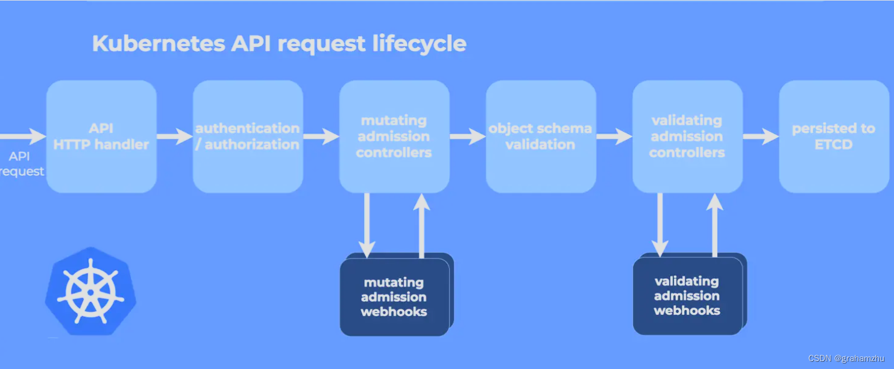

Admission Control 是由一系列插件组成的，apiserver的请求，需要通过所有插件，才能最终存储到etcd。

api server 启动时，使用参数控制插件的开启：

- kubernetes 1.10及以上版本，apiserver使用 参数 --enable-admission-plugins 控制插件启动
- kubernetes 1.9及以下版本，apiserver使用 参数 --admission-control 控制插件启动

我们今天要学习的webhook，**会将到达 apiserver 的请求发送到相应的 webhook 服务，并根据 webhook 返回的结果来决定是否允许请求继续进行，以及是否需要对请求进行修改。**涉及到 Admission Control 的两个插件：**MutatingAdmissionWebhook、ValidatingAdmissionWebhook**，这两个插件都是默认开启的，我们无需再去更改apiserver启动参数重启

查看官方文档：[动态准入控制 | Kubernetes](https://kubernetes.io/zh-cn/docs/reference/access-authn-authz/extensible-admission-controllers/)

**webhook的三种类型**

- **admission webhook**：属于admission control插件，在请求进入admission control插件链时，依次调用
- authorization webhook：对 API Server 中的请求进行授权判断
- **CRD conversion webhook**：用于对 多版本的crd 资源，进行版本间数据转换

其中，controller-runtime 支持 **admission webhook** 和 **CRD conversion webhook** 两种。我们进行operator 开发时，也只涉及这两种。

**使用**

要使用 webhook 首先需要有一个webhook server（kubebuilder 可创建），然后将server 注册到 k8s 中，注册就是写yaml 指定哪些请求会被拦截（可通过service或直接url 的方式）

我们使用 kubebuilder 为我们创建 webhook。首先使用帮助命令查看（以下命令皆运行在上面 kubebuilder 的示例中）

``` sh
kubebuilder create webhook -h
...
Examples:
  # Create defaulting and validating webhooks for Group: ship, Version: v1beta1
  # and Kind: Frigate
  kubebuilder create webhook --group ship --version v1beta1 --kind Frigate --defaulting --programmatic-validation

  # Create conversion webhook for Group: ship, Version: v1beta1
  # and Kind: Frigate
  kubebuilder create webhook --group ship --version v1beta1 --kind Frigate --conversion
  
#  --group 不带domain 的group
#  --defaulting 指定默认值
#  --programmatic-validation 用来校验
#  --conversion 多版本转换
```

我们按照示例创建我们的webhook。我们为我们已经创建API的 CRD对象创建webhook，无法为内建对象创建（它们的webhook由controller-runtime 创建好了）

``` sh
kubebuilder create webhook --group webapp --version v1 --kind  Application --defaulting --programmatic-validation --conversion
```

然后使用git status 它生成和修改了哪些代码

``` 

On branch master
Changes not staged for commit:
  (use "git add <file>..." to update what will be committed)
  (use "git restore <file>..." to discard changes in working directory)
        modified:   PROJECT
        modified:   api/v1/zz_generated.deepcopy.go
        modified:   cmd/main.go
        modified:   config/crd/kustomization.yaml
        modified:   config/default/kustomization.yaml

Untracked files:
  (use "git add <file>..." to include in what will be committed)
        api/v1/application_webhook.go
        api/v1/application_webhook_test.go
        api/v1/webhook_suite_test.go
        config/certmanager/
        config/crd/patches/
        config/default/manager_webhook_patch.yaml
        config/default/webhookcainjection_patch.yaml
        config/webhook/
```

如`config/default/manager_webhook_patch.yaml `就是部署webhook 的应用。`config/certmanager/ `之中是证书相关的

- `api/v1beta1/app_webhook.go webhook对应的handler`，我们添加业务逻辑的地方
- `api/v1beta1/webhook_suite_test.go` 测试
- `config/certmanager` 自动生成自签名的证书，用于webhook server提供https服务
- `config/webhook` 用于注册webhook到k8s中
- `config/crd/patches 为conversion` 自动注入caBoundle
- `config/default/manager_webhook_patch.yaml` 让manager的deployment支持webhook请求
- `config/default/webhookcainjection_patch.yaml` 为webhook server注入caBoundle

下面我们看它对代码进行了什么修改。首先是` cmd/main.go`，它将webhook 添加到mgr 中去了

``` go
	if os.Getenv("ENABLE_WEBHOOKS") != "false" {
		if err = (&webappv1.Application{}).SetupWebhookWithManager(mgr); err != nil {
			setupLog.Error(err, "unable to create webhook", "webhook", "Application")
			os.Exit(1)
		}
	}
```

重点添加的代码是`api/v1/application_webhook.go`。

``` go
package v1

import (
	"k8s.io/apimachinery/pkg/runtime"
	ctrl "sigs.k8s.io/controller-runtime"
	logf "sigs.k8s.io/controller-runtime/pkg/log"
	"sigs.k8s.io/controller-runtime/pkg/webhook"
	"sigs.k8s.io/controller-runtime/pkg/webhook/admission"
)

// log is for logging in this package.
var applicationlog = logf.Log.WithName("application-resource")

// SetupWebhookWithManager will setup the manager to manage the webhooks
func (r *Application) SetupWebhookWithManager(mgr ctrl.Manager) error {
	return ctrl.NewWebhookManagedBy(mgr).
		For(r).
		Complete()
}

// TODO(user): EDIT THIS FILE!  THIS IS SCAFFOLDING FOR YOU TO OWN!

// +kubebuilder:webhook:path=/mutate-webapp-my-domain-v1-application,mutating=true,failurePolicy=fail,sideEffects=None,groups=webapp.my.domain,resources=applications,verbs=create;update,versions=v1,name=mapplication.kb.io,admissionReviewVersions=v1

var _ webhook.Defaulter = &Application{}

// Default implements webhook.Defaulter so a webhook will be registered for the type
func (r *Application) Default() {
	applicationlog.Info("default", "name", r.Name)

	// TODO(user): fill in your defaulting logic.
}

// TODO(user): change verbs to "verbs=create;update;delete" if you want to enable deletion validation.
// NOTE: The 'path' attribute must follow a specific pattern and should not be modified directly here.
// Modifying the path for an invalid path can cause API server errors; failing to locate the webhook.
// +kubebuilder:webhook:path=/validate-webapp-my-domain-v1-application,mutating=false,failurePolicy=fail,sideEffects=None,groups=webapp.my.domain,resources=applications,verbs=create;update,versions=v1,name=vapplication.kb.io,admissionReviewVersions=v1

var _ webhook.Validator = &Application{}

// ValidateCreate implements webhook.Validator so a webhook will be registered for the type
func (r *Application) ValidateCreate() (admission.Warnings, error) {
	applicationlog.Info("validate create", "name", r.Name)

	// TODO(user): fill in your validation logic upon object creation.
	return nilw, nil
}

// ValidateUpdate implements webhook.Validator so a webhook will be registered for the type
func (r *Application) ValidateUpdate(old runtime.Object) (admission.Warnings, error) {
	applicationlog.Info("validate update", "name", r.Name)

	// TODO(user): fill in your validation logic upon object update.
	return nil, nil
}

// ValidateDelete implements webhook.Validator so a webhook will be registered for the type
func (r *Application) ValidateDelete() (admission.Warnings, error) {
	applicationlog.Info("validate delete", "name", r.Name)

	// TODO(user): fill in your validation logic upon object deletion.
	return nil, nil
}
```

可以看到，其中包含多个类型的验证请求。 **Default() 是用来做修改的， ValidateCreate() 是用来做校验的**。

而SetupWebhookWithManager 返回会将此 webhook控制器添加到mgr，监听的对象仍然是我们的自定crd。最后调用 `Complete` 会完成执行以下函数

``` go
func (blder *WebhookBuilder) registerWebhooks() error {
	typ, err := blder.getType()
	if err != nil {
		return err
	}

	blder.gvk, err = apiutil.GVKForObject(typ, blder.mgr.GetScheme())
	if err != nil {
		return err
	}

	// Register webhook(s) for type
	blder.registerDefaultingWebhook()
	blder.registerValidatingWebhook()

	err = blder.registerConversionWebhook()
	if err != nil {
		return err
	}
	return blder.err
}
```

可见，WebhookBuilder会在这里给我们的webhook 注册相应的能力

### 测试webhook

我们在 kubebuilder 的示例上进行测试，我们目标使用webhook 修改 application 的 Export 字段都为 true，Replica 都为1 。

上面新增的webhook 文件默认不会应用，为了支持webhook，我们需要修改config/default/kustomization.yaml将相应的配置打开，具体可参考注释。

``` yaml
# Adds namespace to all resources.
namespace: kubebuilder-demo-system

# Value of this field is prepended to the
# names of all resources, e.g. a deployment named
# "wordpress" becomes "alices-wordpress".
# Note that it should also match with the prefix (text before '-') of the namespace
# field above.
namePrefix: kubebuilder-demo-

# Labels to add to all resources and selectors.
#commonLabels:
#  someName: someValue

bases:
- ../crd
- ../rbac
- ../manager
# [WEBHOOK] To enable webhook, uncomment all the sections with [WEBHOOK] prefix including the one in
# crd/kustomization.yaml
- ../webhook
# [CERTMANAGER] To enable cert-manager, uncomment all sections with 'CERTMANAGER'. 'WEBHOOK' components are required.
- ../certmanager
# [PROMETHEUS] To enable prometheus monitor, uncomment all sections with 'PROMETHEUS'.
#- ../prometheus

patchesStrategicMerge:
# Protect the /metrics endpoint by putting it behind auth.
# If you want your controller-manager to expose the /metrics
# endpoint w/o any authn/z, please comment the following line.
- manager_auth_proxy_patch.yaml

# Mount the controller config file for loading manager configurations
# through a ComponentConfig type
#- manager_config_patch.yaml

# [WEBHOOK] To enable webhook, uncomment all the sections with [WEBHOOK] prefix including the one in
# crd/kustomization.yaml
- manager_webhook_patch.yaml

# [CERTMANAGER] To enable cert-manager, uncomment all sections with 'CERTMANAGER'.
# Uncomment 'CERTMANAGER' sections in crd/kustomization.yaml to enable the CA injection in the admission webhooks.
# 'CERTMANAGER' needs to be enabled to use ca injection
- webhookcainjection_patch.yaml

# the following config is for teaching kustomize how to do var substitution
vars:
# [CERTMANAGER] To enable cert-manager, uncomment all sections with 'CERTMANAGER' prefix.
- name: CERTIFICATE_NAMESPACE # namespace of the certificate CR
  objref:
    kind: Certificate
    group: cert-manager.io
    version: v1
    name: serving-cert # this name should match the one in certificate.yaml
  fieldref:
    fieldpath: metadata.namespace
- name: CERTIFICATE_NAME
  objref:
    kind: Certificate
    group: cert-manager.io
    version: v1
    name: serving-cert # this name should match the one in certificate.yaml
- name: SERVICE_NAMESPACE # namespace of the service
  objref:
    kind: Service
    version: v1
    name: webhook-service
  fieldref:
    fieldpath: metadata.namespace
- name: SERVICE_NAME
  objref:
    kind: Service
    version: v1
    name: webhook-service
```

然后，根据我们的测试目标修改代码

修改 `api/v1/application_webhook.go：Default()`方法来实现webhook 拦截请求的功能

``` go
func (r *Application) Default() {
	applicationlog.Info("default", "name", r.Name)
	klog.Info("============ webhook Default ================")
	r.Spec.Export = true
	r.Spec.Replicas = 1 
}
```

修改 `api/v1/application_webhook.go：ValidateCreate()`方法来实现webhook 拦截创建crd的功能，当然也可以修改其他如修改或删除的方法。

``` go
func (r *Application) ValidateCreate() (admission.Warnings, error) {
	applicationlog.Info("validate create", "name", r.Name)
	klog.Info("============ webhook ValidateCreate ================")
	// TODO(user): fill in your validation logic upon object creation.
	return nil, nil
}
```

接着就可以真正的测试： 详见：

- [operator-lesson-demo/kubebuilder-demo/docs/实现webhook逻辑.md at main · baidingtech/operator-lesson-demo (github.com)](https://github.com/baidingtech/operator-lesson-demo/blob/main/kubebuilder-demo/docs/实现webhook逻辑.md)
- [2022年最新k8s编程operator篇-24.Webhook的实现_哔哩哔哩_bilibili](https://www.bilibili.com/video/BV1fB4y1W7vp/?spm_id_from=333.788&vd_source=b223a33d3e538f8afa1020f731ad95a0)

# 16. CRI CNI CSI

Kubernetes作为云原生应用的最佳部署平台，已经开放了**容器运行时接口（CRI）、容器网络接口（CNI）和容器存储接口（CSI）**，这些接口让Kubernetes的开放性变得最大化，而Kubernetes本身则专注于容器调度。

## CRI

CRI 是 Kubernetes 用来与容器运行时进行交互的标准接口。它定义了一套 RPC（远程过程调用）API，这些 API 被用来管理容器的生命周期。k8s1.7 可以看到在[这里](https://github.com/kubernetes/kubernetes/blob/release-1.7/pkg/kubelet/apis/cri/v1alpha1/runtime/api.proto)看到CRI接口在`api.proto`中的定义

``` protobuf
// Runtime service defines the public APIs for remote container runtimes
service RuntimeService {
    // Version returns the runtime name, runtime version, and runtime API version.
    rpc Version(VersionRequest) returns (VersionResponse) {}

    // RunPodSandbox creates and starts a pod-level sandbox. Runtimes must ensure
    // the sandbox is in the ready state on success.
    rpc RunPodSandbox(RunPodSandboxRequest) returns (RunPodSandboxResponse) {}
    ....................
}

// ImageService defines the public APIs for managing images.
service ImageService {
    // ListImages lists existing images.
    rpc ListImages(ListImagesRequest) returns (ListImagesResponse) {}
    // ImageStatus returns the status of the image. If the image is not
    // present, returns a response with ImageStatusResponse.Image set to
    // nil.
    rpc ImageStatus(ImageStatusRequest) returns (ImageStatusResponse) {}
    // PullImage pulls an image with authentication config.
    rpc PullImage(PullImageRequest) returns (PullImageResponse) {}
    // RemoveImage removes the image.
    // This call is idempotent, and must not return an error if the image has
    // already been removed.
    rpc RemoveImage(RemoveImageRequest) returns (RemoveImageResponse) {}
    // ImageFSInfo returns information of the filesystem that is used to store images.
    rpc ImageFsInfo(ImageFsInfoRequest) returns (ImageFsInfoResponse) {}
} 
```

这其中包含了两个gRPC服务：

- **RuntimeService**：主要是跟容器相关的操作。比如，创建和启动容器、删除容器、执行 exec 命令等等。
- **ImageService**：要是容器镜像相关的操作，比如拉取镜像、删除镜像等等

Kubelet 通过 CRI 与容器运行时进行通信，包括容器的启动、停止、状态查询等操作。多种容器运行时，如 Docker, containerd, CRI-O 等自己实现上述接口完成各个容器的功能。

[CRI：深入理解容器运行时接口 - 知乎 (zhihu.com)](https://zhuanlan.zhihu.com/p/633850614)

有了 CRI 之后，Kubernetes 以及 kubelet 本身的架构，就如下图所示：


kubectl 要创建要创建一个pod 时，会调用一个叫作 GenericRuntime 的通用组件来发起创建 Pod 的 CRI 请求。这个 CRI 请求，又该由谁来响应呢？

> 如果你使用的容器项目是 Docker 的话，那么负责响应这个请求的就是一个叫作 dockershim 的组件。它会把 CRI 请求里的内容拿出来，然后组装成 Docker API 请求发给 Docker Daemon。

而更普遍的场景，就是你需要在每台宿主机上单独安装一个负责响应 CRI 的组件，这个组件，一般被称作 CRI shim。

顾名思义，CRI shim 的工作，就是扮演 kubelet 与容器项目之间的“垫片”（shim）。所以它的作用非常单一，那就是**实现 CRI 规定的每个接口，然后把具体的 CRI 请求“翻译”成对后端容器项目的请求或者操作**。

## CNI

[ 理解 CNI 和 CNI 插件 - 知乎 (zhihu.com)](https://zhuanlan.zhihu.com/p/466113622)

CNI，它的全称是 Container Network Interface，即容器网络的 API 接口。

它是 K8s 中标准的一个调用网络实现的接口。Kubelet 通过这个标准的 API 来调用不同的网络插件以实现不同的网络配置方式，实现了这个接口的就是 CNI 插件，它实现了一系列的 CNI API 接口。

**使用CNI 的目的是将网络配置与容器平台解耦**，在不同的平台只需要使用不同的网络插件，其他容器化的内容仍然可以复用。通过制定了规范的配置来让第三方去进行实现，包含了必填的字段和可变的参数 args提供灵活性。

常见的 CNI 插件包括 **Calico**、flannel、Terway、Weave Net 以及 Contiv。Calico 使用第 3 层网络与 BGP 路由协议配对来连接 Pod

K8s 通过 CNI 配置文件来决定使用什么 CNI。

基本的使用方法为：

1. 首先在每个结点上配置 CNI 配置文件(/etc/cni/net.d/xxnet.conf)，其中 xxnet.conf 是某一个网络配置文件的名称；
2. 安装 CNI 配置文件中所对应的二进制插件；
3. 在这个节点上创建 Pod 之后，Kubelet 就会根据 CNI 配置文件执行前两步所安装的 CNI 插件；

### CNI的工作过程

- Pod网络命名空间的创建，通常由 `containerd` 完成
- **CNI（Container Network Interface）插件负责为 Pod 分配 IP 地址、设置路由等网络配置。**
- 创建成功后将命令结果转化后返回给CRI，继续Pod初始化的工作。

CNI 具体会完成的事情：

- 创建接口（物理网络接口和虚拟网络接口）
  创建 veth 对
  设置命名空间网络
  设置静态路由
  配置以太网桥（eth bridge）
  分配 IP 地址
  创建 NAT 规则。

### 实现方式

**CNI 插件通常有三种实现方式**：Overlay、路由及 Underlay。我们需要根据不同的场景选择不同的实现模式，再去选择对应的具体某一个插件。

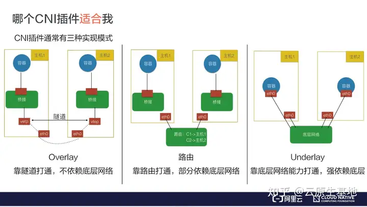

- **Overlay 模式**的典型特征是**容器网络于主机的 IP 段**，这个 IP 段进行跨主机网络通信时是通过在主机之间创建隧道的方式，将整个容器网段的包全都封装成底层的物理网络中主机之间的包。该方式的好处在于它不依赖于底层网络；

使用 ifconfig 可以看到集群机器上会有多个虚拟网卡，通常以CNI 插件命名，如:

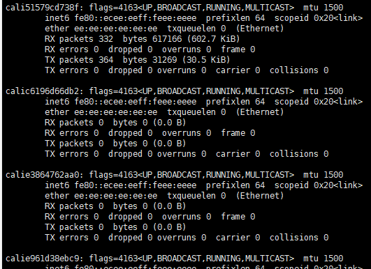

然后使用 route 后可以看到有很多pod 所在IP 段会使用这些网卡

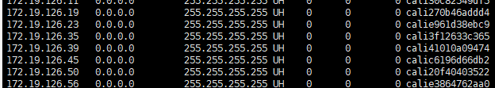

- **路由模式**中主机和容器也分属不同的网段，它与 Overlay 模式的主要区别在于它的跨主机通信是通过路由打通，无需在不同主机之间做一个隧道封包。但路由打通就需要部分依赖于底层网络，比如说要求底层网络有二层可达的一个能力；
- **Underlay 模式**中容器和宿主机位于同一层网络，两者拥有相同的地位。容器之间网络的打通主要依靠于底层网络。因此该模式是强依赖于底层能力的。

## CSI

Kubernetes从1.9版本开始引入**容器存储接口 Container Storage Interface (CSI)机制**，用于**在Kubernetes和外部存储系统之间建立一套标准的存储管理接口**，通过该接口为容器提供存储服务。

> - **in-tree：**代码逻辑在 K8s 官方仓库中；
>
> - **out-of-tree：**代码逻辑在 K8s 官方仓库之外，实现与 K8s 代码的解耦；

具体来说，Kubernetes针对CSI规定了以下内容：

- **Kubelet到CSI驱动程序的通信**

  \- Kubelet通过Unix域套接字直接向CSI驱动程序发起CSI调用（例如`NodeStageVolume`，`NodePublishVolume`等），以挂载和卸载卷。

  \- Kubelet通过kubelet插件注册机制发现CSI驱动程序（以及用于与CSI驱动程序进行交互的Unix域套接字）。

  \- 因此，部署在Kubernetes上的所有CSI驱动程序**必须**在每个受支持的节点上使用kubelet插件注册机制进行注册。

- **Master到CSI驱动程序的通信**

  \- Kubernetes master组件不会直接（通过Unix域套接字或其他方式）与CSI驱动程序通信。

  \- Kubernetes master组件仅与Kubernetes API交互。

  \- 因此，需要依赖于Kubernetes API的操作的CSI驱动程序（例如卷创建，卷attach，卷快照等）必须监听Kubernetes API并针对它触发适当的CSI操作。

# 17. 调度器

## k8s 原生调度器

**k8s原生调度器在训练场景中的不足**：

- **调度方式单一**：很多集群要求不同的调度策略，如优先占满每个节点资源的策略（对于节点扩缩容是友好的）、满足最多任务的策略（要求资源少则调度优先级高）、按资源配额调度的策略。k8s 原生调度器难以满足。 

- **无法满足AI 训练任务**：一些AI 训练任务要求多个pod 全部启动成功，有一个pod 启动失败即需要全部退出资源占用。而k8s 原生调度器是串行设计的，它会依次调度每个pod，无法满足一些任务要么同时都成功，要么就都别执行的需求

## Coscheduling 和  Gang Scheduling

[Kubernetes增强型调度器Volcano算法分析_文化 & 方法_唐盛军_InfoQ精选文章](https://www.infoq.cn/article/FWsOGCzTqPBSiK9fO6JH)

Wikipedia对 **Coscheduling**的定义：在并发系统中将多个相关联的进程调度到不同处理器上同时运行的策略”。在Coscheduling的场景中，最主要的原则是保证所有相关联的进程能够同时启动。防止部分进程的异常，导致整个关联进程组的阻塞。这种导致阻塞的部分异常进程，称之为“碎片（fragement）”。

在Coscheduling的具体实现过程中，根据是否允许“碎片”存在，可以细分为：

> Explicit Coscheduling
>
> Local Coscheduling
>
> Implicit Coscheduling

其中Explicit Coscheduling就是大家常听到的Gang Scheduling。**Gang Scheduling要求完全不允许有“碎片”存在， 也就是“All or Nothing”。**

**Volcano** 首先要解决的问题就是 **Gang Scheduling** 的问题，即一组容器要么都成功，要么都别调度。这个是最基本的用来解决资源死锁的问题，可以很好的提高集群资源利用率（在高业务负载时）。除此之外，它还提供了多种调度算法，例如 priority 优先级，DRF（dominant resource fairness）， binpack 等。

## volcano

Volcano 是一个开源的 Kubernetes 批处理系统，专为高性能计算任务设计。它**提供了一种高效的方式来管理和调度资源密集型作业**，比如大数据处理和机器学习任务。

在批处理领域，任务通常需要大量计算资源，但这些资源在 Kubernetes 集群中可能是有限的或者分布不均。Volcano 尝试通过一些高级调度功能来解决这些问题，尽可能确保资源被高效利用，同时最小化作业的等待时间。这对于需要快速处理大量数据的场景尤其重要，如科学研究、金融建模或任何需要并行处理大量任务的应用。

[Volcano 原理、源码分析（一） - 胡说云原生 - 博客园 (cnblogs.com)](https://www.cnblogs.com/daniel-hutao/p/17935624.html)

- Scheduler Volcano **scheduler** ：通过一系列的action和plugin调度Job，并为它找到一个最适合的节点。与Kubernetes default-scheduler相比，**Volcano与众不同的 地方是它支持针对Job的多种调度算法**。
- Controllermanager Volcano **controllermanager ** ：管理CRD资源的生命周期。它主要由Queue ControllerManager、 PodGroupControllerManager、 VCJob ControllerManager构成。
- Admission Volcano **admission**  ：负责对CRD API资源进行校验。
- Vcctl Volcano vcctl ：是Volcano的命令行客户端工具。

### 安装

[安装 | Volcano](https://volcano.sh/zh/docs/installation/)

验证 Volcano 组件的状态：

``` shell
kubectl get all -n volcano-system
NAME                                       READY   STATUS      RESTARTS   AGE
pod/volcano-admission-5bd5756f79-p89tx     1/1     Running     0          6m10s
pod/volcano-admission-init-d4dns           0/1     Completed   0          6m10s
pod/volcano-controllers-687948d9c8-bd28m   1/1     Running     0          6m10s
pod/volcano-scheduler-94998fc64-9df5g      1/1     Running     0          6m10s

NAME                                TYPE        CLUSTER-IP     EXTERNAL-IP   PORT(S)   AGE
service/volcano-admission-service   ClusterIP   10.96.140.22   <none>        443/TCP   6m10s

NAME                                  READY   UP-TO-DATE   AVAILABLE   AGE
deployment.apps/volcano-admission     1/1     1            1           6m10s
deployment.apps/volcano-controllers   1/1     1            1           6m10s
deployment.apps/volcano-scheduler     1/1     1            1           6m10s

NAME                                             DESIRED   CURRENT   READY   AGE
replicaset.apps/volcano-admission-5bd5756f79     1         1         1       6m10s
replicaset.apps/volcano-controllers-687948d9c8   1         1         1       6m10s
replicaset.apps/volcano-scheduler-94998fc64      1         1         1       6m10s

NAME                               COMPLETIONS   DURATION   AGE
job.batch/volcano-admission-init   1/1           28s        6m10s
```

### 使用

首先创建 queue，指定该queue 拥有的资源。然后创建Volcano Job（简写 vcjob），vcjob 的yaml中要写清楚调度器使用 volcano，使用的是哪个queue。同时，此vcjob的pod模板中写的对资源的占用不能超过queue中的设置。而且，资源配额必须填，不填不能调度。

**创建 vcjob后，控制器会创建 podgroup 和pod。**pod 受到 vcjob 的管理，被删除会重启。

实测发现，创建好vcjob后，将此vcjob 绑定的 queue删除，不会影响该vcjob。

**实际开发中**，我们自己的CRD要和 volcano 联动，直接在CRD 创建 pod 的模板中写清楚 scheduler 是 volcano即可。

### 概念

#### queue

在 Volcano 中，`Queue` 用于管理和优先级排序任务。它允许用户根据业务需求或优先级，将作业分组到不同的队列中。这有助于更好地控制资源分配和调度优先级，确保高优先级的任务可以优先获取资源。

**关键字段**

- weight：**按比重分配集群中的资源**

weight表示该queue在集群资源划分中所占的**相对**比重，数字越大占比越多。比如两个queue，q1和q2，它们的weight为1和2，则q1可以使用1/3的资源，q2可以使用2/3的资源。weight是一个**软约束**，表示如果其他queue 没有任务，则此queue 内要求超额资源的job 仍然可以启动。

- capability：**按绝对量分配集群中的资源**

capability表示该queue内所有podgroup使用资源量之和的上限，它是一个**硬约束**

- reclaimable：**是否允许自己超限使用后，别人要用，我主动退出**

reclaimable表示该queue在资源使用量超过该queue所应得的资源份额时，是否允许其他queue回收该queue使用超额的资源，默认值为**true**

**说明事项**

- default queue

volcano启动后，会默认创建名为default的queue，weight为1。后续下发的job，若未指定queue，默认属于default queue

- weight的软约束

weight的软约束是指weight决定的queue应得资源的份额并不是不能超出使用的。当其他queue的资源未充分利用时，需要超出使用资源的queue可临时多占。但其 他queue后续若有任务下发需要用到这部分资源，将驱逐该queue多占资源的任务以达到weight规定的份额（**前提是queue的reclaimable为true**）。这种设计可以 保证集群资源的最大化利用。

#### PodGroup

podgroup是一组强关联pod的集合，主要用于批处理工作负载场景，比如Tensorflow中的一组ps（parameter server）和worker。它是volcano自定义资源类型。

**这主要解决了 Kubernetes 原生调度器中单个 Pod 调度的限制**。通过将相关的 Pod 组织成 PodGroup，Volcano 能够更有效地处理那些需要多个 Pod 协同工作的复杂任务。

当创建vcjob（Volcano Job的简称）时，若没有指定该vcjob所属的podgroup，默认会为该vcjob创建同名的podgroup。

#### VolcanoJob

Volcano Job，简称vcjob，是Volcano自定义的Job资源类型。区别于Kubernetes Job，vcjob提供了更多高级功能，如可指定调度器、支持最小运行pod数、 支持task、支持生命周期管理、支持指定队列、支持优先级调度等。Volcano Job更加适用于机器学习、大数据、科学计算等高性能计算场景。

它扩展了 Kubernetes 的 Job 资源。VolcanoJob 不仅包括了 Kubernetes Job 的所有特性，还加入了对批处理作业的额外支持，使得 Volcano 能够更好地适应高性能和大规模计算任务的需求。

下面是一个 vcjob 的示例：

``` yaml
apiVersion: batch.volcano.sh/v1alpha1
kind: Job
metadata:
  name: job-1
spec:
  minAvailable: 1
  schedulerName: volcano
  queue: myQueueName
  policies:
    - event: PodEvicted
      action: RestartJob
  tasks:
    - replicas: 1
      name: nginx
      policies:
      - event: TaskCompleted
        action: CompleteJob
      template:
        spec:
          containers:
            - command:
              - sleep
              - 10m
              image: nginx:latest
              name: nginx
              resources:
                requests:
                  cpu: 1
                limits:
                  cpu: 1
          restartPolicy: Never

apiVersion: v1
kind: Pod
metadata:
  name: mp1
  labels:
    volcano.sh/queue-name: lt-test1
spec:
  schedulerName: volcano
  containers:
  - command:
    - sleep
    - 10m
    image: aiops-899f5654.ecis.huhehaote-1.cmecloud.cn/public/nginx:latest
    name: nginx
    resources:
      requests:
        nvidia.com/gpu: "1"
      limits:
        nvidia.com/gpu: "1"

```

该 vcjob 就会创建相应的podgroup和 pod。

此 pod 的annotation和**label**就会有 `volcano.sh/queue-name: myQueueName` 的标记（其中起作用的是 annotation，会**通过 annotation 指定的queue-name去找queue**）。同时，**调度器会使用volcano，即字段pod.Spec.schedulerName: volcano**


## volcano 调度算法

### Gang scheduling

这种调度算法，首先就是有’组’的概念，调度结果成功与否，**只关注整一组容器**。

具体算法是，先遍历各个容器组（称为 Job），然后模拟调度这一组容器中的每个容器（称为 Task）。最后判断这一组容器可调度容器数是否大于最小能接受底限，可以的话就真的往节点调度（称为 Bind 节点）。

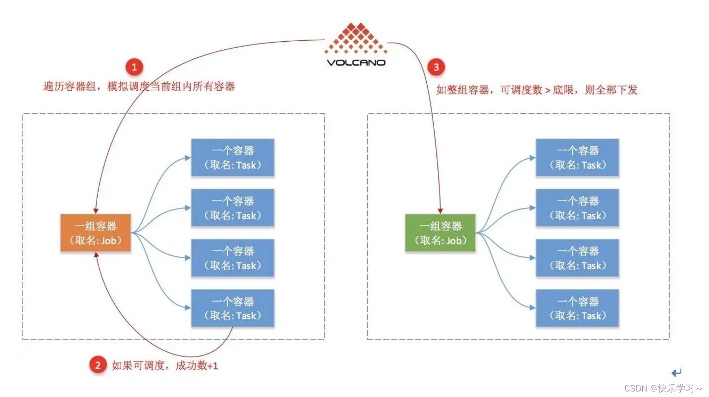

### DRF（dominant resource fairness）

DRF 意为：“**谁要的资源少，谁的优先级高**”。因为这样可以满足更多的作业，不会因为一个胖业务，饿死大批小业务。注意：这个算法选的也是容器组（比如一次 AI 训练，或一次大数据计算）。

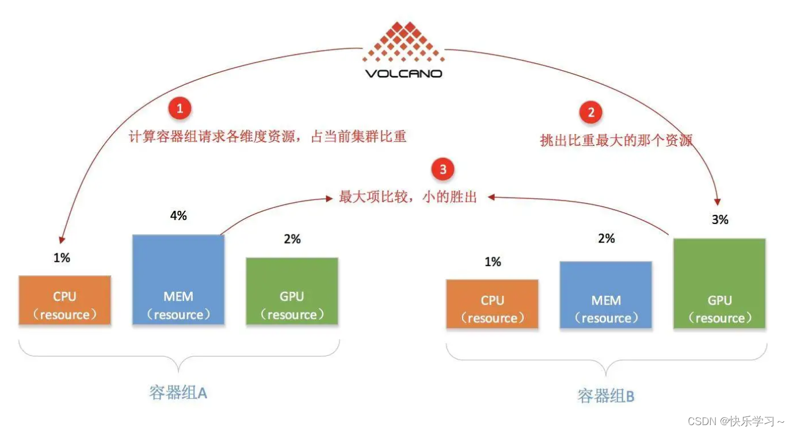

### Binpack

这种调度算法，目标很简单：**尽量先把已有节点填满**（尽量不往空白节点投）。具体实现上，binpack 就是给各个可以投递的节点打分：“假如放在当前节点后，谁更满，谁的分数就高”。因为这样可以尽量将应用负载靠拢至部分节点，非常有利于 K8S 集群节点的自动扩缩容功能。注意：这个算法是针对单个容器的。

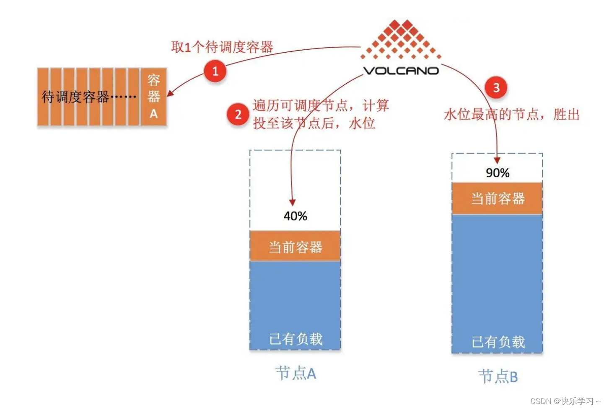

### proportion（Queue 队列）

用来控制集群总资源分配比例的。比如说某厂有 2 个团队，共享一个计算资源池。管理员设置：A 团队最多使用总集群的 60%。然后 B 团队最多使用总集群的 40%。那投递的任务量，超过该团队的可用资源怎么办？那就排队等呗，所以特性取名 Queue。


# 18. helm

[Helm入门（一篇就够了）-阿里云开发者社区](https://developer.aliyun.com/article/1207395)

一言以蔽之，**Helm 是 Kubernetes 的软件包管理器**

Kubernetes 中的应用开发比较复杂。无论对哪个应用，都可能需要安装、管理和更新成百上千种配置。Helm 可通过 **Helm Chart**这种打包格式来实现应用的自动分发，从而简化这一过程。

## Helm 是如何工作的

Helm 会在 **Helm Chart**来描述应用从定义到升级的方方面面，作用与模板类似。然后借助 Kubernetes API 将用图表资源传递给 Kubernetes 集群。 

Helm 使用名为 `helm` 的命令行界面（CLI）工具来管理 Helm 图表，还有一些简单的命令可供您用于创建、管理和配置应用。 

## Helm Chart

Helm 图表是一个包含多个文件的集合，用于描述 Kubernetes 集群资源并将它们一起打包为一个应用。Helm 图表由三个基本组成部分构成：

- **图表** - `Chart.yaml`，定义应用的元数据，如名称、版本和依赖项等。 
- **值** - `values.yaml`，设置不同的值，也就是规定如何设定变量替换来重复利用您的图表。
  - 您还可以通过值 JSON 模式来描述值文件的结构，这样做有助于创建动态表单以及对值参数进行验证。
- **模板目录** - `templates/`，存放您的模板，并将它们**与 values.yaml 文件中所设的值相结合**来创建清单。
- **图表目录** - `charts/`，存储您在 `Chart.yaml` 中定义的所有图表依赖项，并通过 `helm dependency build` 或 `helm dependency update` 进行重建。

## helm 安装 

[Helm | 安装Helm](https://helm.sh/zh/docs/intro/install/)

## helm 使用

**使用`helm create chart名`命令创建一个新的Chart**，helm会自动帮我们创建相应目录，Chart目录包含描述应用程序的文件和目录，包括Chart.yaml、values.yaml、templates目录等；

``` shell
$ helm create testhelm01
Creating testhelm01
$ tree
.
├── charts
├── Chart.yaml
├── templates
│   ├── deployment.yaml
│   ├── _helpers.tpl
│   ├── hpa.yaml
│   ├── ingress.yaml
│   ├── NOTES.txt
│   ├── serviceaccount.yaml
│   ├── service.yaml
│   └── tests
│       └── test-connection.yaml
└── values.yaml

3 directories, 10 files
```

可以看到，helm帮我们创建了很多东西

现在需要编辑**Chart.yaml和values.yaml，以及template**。

- **Chart.yaml**的模板及注释如下：

``` yaml
apiVersion: chart API 版本 （必需）  #必须有
name: chart名称 （必需）     # 必须有 
version: 语义化2 版本（必需） # 必须有

kubeVersion: 兼容Kubernetes版本的语义化版本（可选）
description: 一句话对这个项目的描述（可选）
type: chart类型 （可选）
keywords:
  - 关于项目的一组关键字（可选）
home: 项目home页面的URL （可选）
sources:
  - 项目源码的URL列表（可选）
dependencies: # chart 必要条件列表 （可选）
  - name: chart名称 (nginx)
    version: chart版本 ("1.2.3")
    repository: （可选）仓库URL ("https://example.com/charts") 或别名 ("@repo-name")
    condition: （可选） 解析为布尔值的yaml路径，用于启用/禁用chart (e.g. subchart1.enabled )
    tags: # （可选）
      - 用于一次启用/禁用 一组chart的tag
    import-values: # （可选）
      - ImportValue 保存源值到导入父键的映射。每项可以是字符串或者一对子/父列表项
    alias: （可选） chart中使用的别名。当你要多次添加相同的chart时会很有用

maintainers: # （可选） # 可能用到
  - name: 维护者名字 （每个维护者都需要）
    email: 维护者邮箱 （每个维护者可选）
    url: 维护者URL （每个维护者可选）

icon: 用做icon的SVG或PNG图片URL （可选）
appVersion: 包含的应用版本（可选）。不需要是语义化，建议使用引号
deprecated: 不被推荐的chart （可选，布尔值）
annotations:
  example: 按名称输入的批注列表 （可选）.
```

看着很多其实只有最上面三个是必须的。如：

``` yaml
name: nginx-helm
apiVersion: v1
version: 1.0.0
```

- `values.yaml`包含**应用程序的默认配置值**，举例：

``` yaml
image:
  repository: nginx
  tag: '1.14.211'
```

- 在`templates`目录下的**资源文件中引入 values.yaml里的配置**，在模板文件中可以通过 .VAlues对象访问到，例如下面这样的pod 模板

``` yaml
apiVersion: v1
kind: Pod
metadata:
  name: pod1
spec:
  schedulerName: volcano
  terminationGracePeriodSeconds: 0
  containers:
  - command:
    - sleep
    - 10m
    image: {{.Values.image.repository}}:{{ .Values.image.tag }}
    name: nginx
    resources:
      requests:
        nvidia.com/gpu: 1
        cpu: 1
        memory: 10Mi
      limits:
        nvidia.com/gpu: 1
        cpu: 1
        memory: 20Mi
```

接着 cd 到该chart 目录的外层，使用 `helm install name1  此chart名` 创建出此chart。然后可以在 k8s 集群中检查是否创建出pod。

使用命令检查所有 chart 

``` shell
$ helm ls
NAME    NAMESPACE       REVISION        UPDATED                                 STATUS          CHART                   APP VERSION
name1   default         1               2024-11-05 20:30:38.04318753 +0800 CST  deployed        nginx-helm-1.0.0 
```

可以看到此 chart 的状态

之后可以使用 `helm uninstall name1` 删除此chart 。

## 管理Release

使用**helm ls**命令查看当前运行的Release列表，例如：

```shell
helm upgrade mywordpress myrepo/wordpress --set image.tag=5.7.3-php8.0-fpm-alpine
```

这将升级 `mywordpress` 的`WordPress`应用程序镜像版本为`5.7.3-php8.0-fpm-alpine`。

------

可以使用`helm rollback`命令回滚到先前版本，例如：

```shell
helm rollback mywordpress 1
```

这将回滚`mywordpress`的版本到1。

更多操作：[Helm入门（一篇就够了）-阿里云开发者社区](https://developer.aliyun.com/article/1207395)

# 19. clusterpedia

clusterpedia 是对多集群的的聚合。通过聚合收集多集群资源，在兼容 Kubernetes OpenAPI 的基础上额外提供更加强大的检索功能，让用户**更方便快捷地在多集群中获取想要的任何资源**。

## 集群接入

[集群接入 | Clusterpedia.io](https://clusterpedia.io/zh-cn/docs/usage/import-clusters/)

Clusterpedia 使用自定义资源 `PediaCluster` 资源来代表接入的集群

``` yaml
apiVersion: cluster.clusterpedia.io/v1alpha2
kind: PediaCluster
metadata:
  name: cluster-example
spec:
  apiserver: "https://10.30.43.43:6443"
  kubeconfig:
  caData:
  tokenData:
  certData:
  keyData:
  syncResources: []
```

有两种方式来配置接入的集群:

1. **直接配置 base64 编码的 kube config 到 `kubeconfig` 字段用于集群连接和验证**
2. 分别配置接入集群的地址，以及验证信息

第一种方式更加简单，只需要填入 kubeconfig 就行。

## 同步集群资源

Clusterpedia 的**主要功能，便是提供对多集群内的资源进行复杂检索**。

通过 `PediaCluster` 中的 `spec.syncResources` 来指定该集群中哪些资源需要支持复杂检索，Clusterpedia 会将这些资源实时的通过`存储层`同步到`存储组件`中。

``` yaml
# example
apiVersion: cluster.clusterpedia.io/v1alpha2
kind: PediaCluster
metadata:
  name: cluster-example
spec:
  apiserver: "https://x.x.x.x:6443"
  syncResources:
  - group: apps
    versions: 
     - v1
    resources:
     - deployments
  - group: ""
    resources:
     - pods
     - configmaps
  - group: cert-manager.io
    versions:
      - v1
    resources:
      - "*" # 通配符，收集该group/version 下的所有资源
```

> 其中 version 可以不填，因为Clusterpedia 会根据**该集群内所支持的资源版本**自动选择合适的版本来收集， 并且用户无需担心版本转换的问题， Clusterpedia 会开放出该内置资源的所有版本接口。

## 联合查询

在安装有 pediacluster 的集群中，复制本集群的 kubeconfig，修改其中的apiserver为 pediacluster  的service 的地址，如：https://clusterpedia-apiserver.<命名空间>/apis/clusterpedia.io/v1beta1/resources

之后  --kubeconfig 指定此 config 就可以查看此pediacluster 管理的所有集群的资源了。

# # YAML介绍

YAML是一个类似 XML、JSON 的标记性语言。它强调以**数据**为中心，并不是以标识语言为重点。因而YAML本身的定义比较简单，号称"一种人性化的数据格式语言"。

```
<heima>
    <age>15</age>
    <address>Beijing</address>
</heima>
```

```
heima:
  age: 15
  address: Beijing
```

YAML的语法比较简单，主要有下面几个：

- 大小写敏感
- 使用缩进表示层级关系
- 缩进不允许使用tab，只允许空格( 低版本限制 )
- 缩进的空格数不重要，只要相同层级的元素左对齐即可
- '#'表示注释

字符串有规定写法：

- 字符串默认不需要引号

- 如果字符串包含空格或者特殊字符(例如冒号)，需要加引号

- 双引号不会对串中转义字符进行转义（即正常处理转义字符），单引号会对串中转义字符进行转义（将转义字符转成文本）

  ``` yaml
  #实际值为 something 换行 something
  str: "something \n something"
  #实际值为 something \n something
  str: 'something \n something'
  ```

- 字符串写成多行，第二行开始需要带单空格缩进，换行符被替换为空格

  ``` yaml
  #实际值为 line1 line2 line3
  str: line1
   line2
   line3
  ```

- 多行字符串可以用 | 保留换行，|+ 保留块尾换行，|- 删除串尾换行

  ``` yaml
  #实际值为 line1换行line2换行line3换行
  str: |
   line1
   line2
   line3
   
  #实际值为 line1换行line2换行line3换行换行换行
  str: |+
   line1
   line2
   line3
  
  other: ...
  
  #实际值为 line1换行line2换行line3
  str: |-
   line1
   line2
   line3
  
  other: ...
  ```

YAML支持以下几种数据类型：

- 纯量：单个的、不可再分的值
- 对象：键值对的集合，又称为映射（mapping）/ 哈希（hash） / 字典（dictionary）
- 数组：一组按次序排列的值，又称为序列（sequence） / 列表（list）

```yaml
# 纯量, 就是指的一个简单的值，字符串、布尔值、整数、浮点数、Null、时间、日期
# 1 布尔类型
c1: true (或者True)
# 2 整型
c2: 234
# 3 浮点型
c3: 3.14
# 4 null类型 
c4: ~  # 使用~表示null
# 5 日期类型
c5: 2018-02-17    # 日期必须使用ISO 8601格式，即yyyy-MM-dd
# 6 时间类型
c6: 2018-02-17T15:02:31+08:00  # 时间使用ISO 8601格式，时间和日期之间使用T连接，最后使用+代表时区
# 7 字符串类型
c7: heima     # 简单写法，直接写值 , 如果字符串中间有特殊字符，必须使用双引号或者单引号包裹 
c8: line1
    line2     # 字符串过多的情况可以拆成多行，每一行会被转化成一个空格
```

```yaml
# 对象
# 形式一(推荐):
heima:
  age: 15
  address: Beijing
# 形式二(了解):
heima: {age: 15,address: Beijing}
```

```yaml
# 数组
# 形式一(推荐):
address:
  - 顺义: 5
  - 昌平
address2:
  顺义: 1
  昌平: 2
school:
  - thu
    pku
school2:
  - thu: 1
    pku: 2
# 每个 - 就是一个数组元素，而一个 - 后接的内容属于同一个数组元素
# 对应的json 格式如下
{
    "address": [
        {
            "顺义": 5
        },
        "昌平"
    ],
    "address2": {
        "顺义": 1,
        "昌平": 2
    },
    "school": [
        "thu\npku"
    ],
    "school2": [
        {
            "thu": 1,
            "pku": 2
        }
    ]
}

# 形式二(了解):
address: [顺义,昌平]
```

提示：

1. 书写yaml切记`:` 后面要加一个空格
2. 如果需要将多段yaml配置放在一个文件中，中间要使用`---`分隔

下面是一个yaml转json的网站，可以通过它验证yaml是否书写正确 https://www.json2yaml.com/convert-yaml-to-json

示例：

``` yaml
 containers:
    - name: manager
      age: 11
    - image: aiop
    - imagePullPolicy: Always
```

转换为 json ：

``` json
{
  "containers": [
    {
      "name": "manager",
      "age": 11
    },
    {
      "image": "aiop"
    },
    {
      "imagePullPolicy": "Always"
    }
  ]
}
```

而类似的

``` yaml
containers:
  - name: manager
    image: aiop
    imagePullPolicy: Alway
```

转换为 json ：

``` json
{
  "containers": [
    {
      "name": "manager",
      "image": "aiop",
      "imagePullPolicy": "Alway"
    }
  ]
}
```

# # 常见问题

`exec format error` 错误表明镜像中的可执行文件与当前运行环境的硬件架构不匹配。


### 容器逃逸

https://www.freebuf.com/articles/network/363137.html

**容器实际是宿主机中的一个受限制进程**，能够直接在宿主机中看到容器进程，容器与虚拟机有着本质上的不同。**容器逃逸是一个受限进程获取未受限权限的一个操作，这比较接近提权操作**。

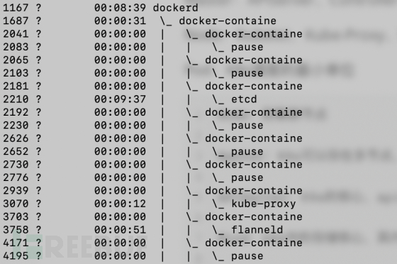
