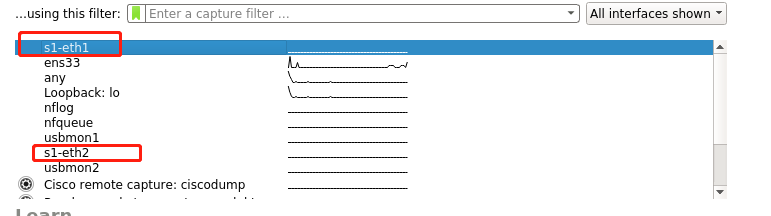
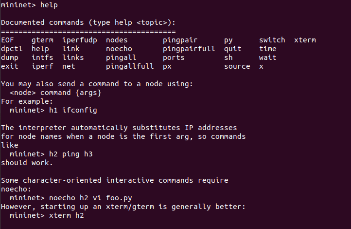

mininet 教程：[Mininet Walkthrough - Mininet](https://mininet.org/walkthrough/#part-1-everyday-mininet-usage)

这里是教程：[Introduction to Mininet · mininet/mininet Wiki (github.com)](https://github.com/mininet/mininet/wiki/Introduction-to-Mininet)

## 0、mininet安装

``` bash
sudo apt-get install git
git clone https://github.com/mininet/mininet.git
cd mininet/util 
./install.sh -a
```

测试是否安装成功：

``` bash
cd mininet/util
sudo mn --test pingall
```

不报错就成功。

## 1、简单用法

#### **mininet查看帮助**:

```bash
sudo mn -h
```

可以看到常见的后面跟的参数：

>--switch=SWITCH    default|ivs|lxbr|ovs|ovsbr|ovsk|user[,param=value...]
>                        user=UserSwitch ovs=OVSSwitch ovsbr=OVSBridge
>                        ovsk=OVSSwitch ivs=IVSSwitch lxbr=LinuxBridge
>                        default=OVSSwitch
>
>  --host=HOST           cfs|proc|rt[,param=value...] proc=Host
>                        rt=CPULimitedHost{'sched': 'rt'}
>                        cfs=CPULimitedHost{'sched': 'cfs'}
>  --controller=CONTROLLER
>                        default|none|nox|ovsc|ref|remote|ryu[,param=value...]
>                        ref=Controller ovsc=OVSController nox=NOX
>                        remote=RemoteController ryu=Ryu
>                        default=DefaultController none=NullController
>  --link=LINK           default|ovs|tc|tcu[,param=value...] default=Link
>                        tc=TCLink tcu=TCULink ovs=OVSLink
> --topo=TOPO           linear|minimal|reversed|single|torus|tree[,param=value
>                        ...] minimal=MinimalTopo linear=LinearTopo
>                        reversed=SingleSwitchReversedTopo
>                        single=SingleSwitchTopo tree=TreeTopo torus=TorusTopo
>  -c, --clean           clean and exit
>  --custom=CUSTOM       read custom classes or params from .py file(s)

#### **打开wiresharke查看流量信息：**

```bash
sudo wireshark & 	# 最后的&使命令可以后台运行
```

#### 与终端/交换机交互

开启一个简单的拓扑

``` bash
sudo mn # --topo=minimal 默认拓扑就可以省略参数
```

该拓扑是最简单的拓扑，包括两个主机连接到一个OpenFlow交换机上，交换机再连接到一个OpenFlow控制器。

当前拓扑中的4个实体（2个主机，1个交换机，1个控制器）都运行在虚拟机中。当然，控制器可以运行在虚拟机之外。

此时使用命令`sudo wireshark & `打开wireshark可以看到已经有了交换机s1的两个端口了。



在mininet内部，使用`help`可以看到很多功能展示：



显示所有节点：

``` bash
mininet> nodes
available nodes are: 
c0 h1 h2 s1
```

显示所有链路：

``` bash
mininet> links
h1-eth0<->s1-eth1 (OK OK) 
h2-eth0<->s1-eth2 (OK OK) 
```

显示dump信息：

``` bash
mininet> dump
<Host h1: h1-eth0:10.0.0.1 pid=4160> 
<Host h2: h2-eth0:10.0.0.2 pid=4162> 
<OVSSwitch s1: lo:127.0.0.1,s1-eth1:None,s1-eth2:None pid=4167> 
<OVSController c0: 127.0.0.1:6653 pid=4152>  # 如果建立拓扑时指定了远程控制器那么这里就是RemoteController了。
```

如help中的提示，使用`<node> cmd {args}`对任一节点进行控制。如

``` bash
h1 ifconfig # 显示h1的网络
s1 ifconfig # 显示交换机s1的网络
c0 ifconfig # 显示控制器c0的网络
```

观察上述三个命令输出能够发现，s1和c0都是直接返回的本虚拟机的网络，h1是新建的一个虚拟主机，说明主机都是在各自的namespace，而交换机和控制器是在root用户namespace。

再看下例：

``` bash
mininet> h1 ps -a
mininet> s1 ps -a
```

返回的结果都是本机的所有进程。本可以在Linux容器中使用单独的进程空间，但目前Mininet没有这样做。在“root”进程名称空间中运行所有程序对于调试来说很方便，因为它允许您使用ps、kill等从控制台查看所有进程。

#### 测试主机间的连通性

如果是新建一个mininet网络：

``` bash
$ sudo mn
mininet> h1 ping h2
PING 10.0.0.2 (10.0.0.2) 56(84) bytes of data.
64 bytes from 10.0.0.2: icmp_seq=1 ttl=64 time=1.63 ms
64 bytes from 10.0.0.2: icmp_seq=2 ttl=64 time=0.172 ms
64 bytes from 10.0.0.2: icmp_seq=3 ttl=64 time=0.124 ms
64 bytes from 10.0.0.2: icmp_seq=4 ttl=64 time=0.041 ms
64 bytes from 10.0.0.2: icmp_seq=5 ttl=64 time=0.095 ms
^C
--- 10.0.0.2 ping statistics ---
5 packets transmitted, 5 received, 0% packet loss, time 4069ms
rtt min/avg/max/mdev = 0.041/0.413/1.636/0.613 ms
```

第一次ping 的时延明显较多，这是因为最开始交换机转发表是空的，h1也不知道h2的MAC地址，它要先使用ARP 找，交换机也不知道，就给控制器发`packet_in`消息，然后，控制器发送`packet_out`消息以将广播分组洪泛到交换机上的其他端口。第二个主机看到ARP请求并发送回复。该回复发送到控制器，控制器将其发送到第一个主机并按下一个流条目。

测试所有节点间的连接：

``` bash
pingall
```

#### 运行简单的web服务器/客户端

在h1上启动一个简单的http程序：

``` bash
mininet> h1 python -m http.server 80 &
mininet> h2 wget -O - h1
...
mininet> h1 kill %python
```

退出mininet的CLI:

```bash
mininet> exit
```

## 2、高级启动选项

#### 运行一个回归测试

```bash
sudo mn --test pingpair
```

该命令创建了一个最小拓扑，启动了OpenFlow引用控制器，运行了一个`所有对ping`测试，运行完后自动删除了拓扑和控制器。

也可以使用`iperf` 测试

```bash
sudo mn --test iperf
```

该命令创建了相同的Mininet，在一台主机上运行了一个iperf服务器，在第二台主机上了一个iprf客户端，并解析了所获得的带宽，最后自动关闭退出。

#### 链路参数改变

mininet2.0 运行设置链路参数，可以简单地在命令行自动设置。

```bash
 $ sudo mn --link tc,bw=10,delay=10ms
 mininet> iperf
 ...
 mininet> h1 ping -c10 h2
 PING 10.0.0.2 (10.0.0.2) 56(84) bytes of data.
64 bytes from 10.0.0.2: icmp_seq=1 ttl=64 time=90.3 ms
64 bytes from 10.0.0.2: icmp_seq=2 ttl=64 time=42.2 ms
64 bytes from 10.0.0.2: icmp_seq=3 ttl=64 time=42.0 ms
64 bytes from 10.0.0.2: icmp_seq=4 ttl=64 time=43.9 ms
64 bytes from 10.0.0.2: icmp_seq=5 ttl=64 time=42.8 ms
```

显然RTT=40ms，因为h1到h2中有两条链路，来回走两遍。

*[Mininet’s Python API](https://github.com/mininet/mininet/wiki/Introduction-to-Mininet) 在这里可以了解如何对每个链路进行不同的设置*

#### 可调整的详细信息

> *verbosity /vɚˈbɑː.sə.t̬i/ : \<n> 冗长，啰嗦，详细，**详细级别***

mininet 默认的verbosity等级是`info`，其会在mininet 启动和关闭期间打印日志，对比将等级改成`debug`看看：

```bash
$ sudo mn -v debug
...	# 显然这些信息更加详细
mininet> exit
```

`debug` 等级下任何命令返回的信息都更加详细。

再试试`output`等级：

```bash
$ sudo mn -v output
mininet> exit
```

几乎没有什么信息打印出来。

使用`sudo mn -h`可以看出verbosity可以设置的所有等级：

``` bash
$ sudo mn -h
...
-v VERBOSITY, --verbosity=VERBOSITY
                        debug|info|output|warning|warn|error|critical
...
```

可见，`debug`是打印最详细的等级，越靠右打印的信息就越少。

#### 可定义拓扑

使用python API可以简单地自定义拓扑，可以看例程`/mininet/custom/topo-2sw-2host.py`，该拓扑将两个交换机直接相连，每个交换机各连一个主机。

``` python
"""Custom topology example
Two directly connected switches plus a host for each switch:
   host --- switch --- switch --- host
Adding the 'topos' dict with a key/value pair to generate our newly defined
topology enables one to pass in '--topo=mytopo' from the command line.
"""
from mininet.topo import Topo

class MyTopo( Topo ):
    "Simple topology example."

    def build( self ):
        "Create custom topo."

        # Add hosts and switches
        leftHost = self.addHost( 'h1' )
        rightHost = self.addHost( 'h2' )
        leftSwitch = self.addSwitch( 's3' )
        rightSwitch = self.addSwitch( 's4' )

        # Add links
        self.addLink( leftHost, leftSwitch )
        self.addLink( leftSwitch, rightSwitch )
        self.addLink( rightSwitch, rightHost )

topos = { 'mytopo': ( lambda: MyTopo() ) }
```

使用命令运行此拓扑：

```bash
$ sudo mn --custom=~/mininet/custom/topo-2sw-2host.py --topo=mytopo
# --custom 的在sudo mn -h中的解释如下
# --custom=CUSTOM       read custom classes or params from .py file(s)
```

#### ID = MAC

默认新建主机的MAC是随机生成的，这会使debug很困难，因为很难将控制流量和特定主机关联起来了。

使用参数`--mac`可以生成简单易读的MAC

``` bash
 # mac 的签名如下
 # --mac                 automatically set host MACs
 $ sudo mn --mac
...
mininet> h1 ifconfig
h1-eth0  Link encap:Ethernet  HWaddr 00:00:00:00:00:01
          inet addr:10.0.0.1  Bcast:10.255.255.255  Mask:255.0.0.0
          UP BROADCAST RUNNING MULTICAST  MTU:1500  Metric:1
          RX packets:0 errors:0 dropped:0 overruns:0 frame:0
          TX packets:0 errors:0 dropped:0 overruns:0 carrier:0
          collisions:0 txqueuelen:1000
          RX bytes:0 (0.0 B)  TX bytes:0 (0.0 B)
mininet> exit
```

`相反，Linux报告的交换机数据端口MAC将保持随机。这是因为您可以使用OpenFlow将MAC“分配”给数据端口，如FAQ中所述。这是一个有点微妙的点，你现在可能可以忽略它。`

#### XTerm 展示

对于更复杂的调试，您可以启动Mininet，使其生成一个或多个xterms。

使用`-x`参数可以在搭建拓扑成功后为每个节点打开一个xterm，不展示了。

也可以在mininet中打开xterm：

``` bash
mininet> xterm h1 h2
```

默认只有主机终端才会有独立命名空间，交换机打开xterm是和常规terminal一样的。

xterm是一个理想的运行交互式命令的地方。

在`“switch: s1 (root)”`的xterm界面运行：

```bash
ovs-ofctl dump-flows tcp:127.0.0.1:6654 
# ovs-ofctl = openvswitch openflow control 
```

发现没什么打印的。

> 要将ovsofctl与其他交换机一起使用，请在冗余模式下启动mininet，并在创建交换机时查看它们的被动侦听端口。

此时让 h1 去 `ping 10.0.0.2` 。

并再在s1处运行上述代码，能看到多个流量条目。

``` bash
root@ubt-vm:~# ovs-ofctl dump-flows tcp:127.0.0.1:6654
 cookie=0x0, duration=2.506s, table=0, n_packets=0, n_bytes=0, idle_timeout=60, priority=1,arp,in_port="s1-eth2",vlan_tci=0x0000/0x1fff,dl_src=e6:23:9f:28:ab:f3,dl_dst=4e:2d:98:6d:06:bc,arp_spa=10.0.0.2,arp_tpa=10.0.0.1,arp_op=2 actions=output:"s1-eth1"
 cookie=0x0, duration=2.505s, table=0, n_packets=1, n_bytes=98, idle_timeout=60, priority=1,icmp,in_port="s1-eth1",vlan_tci=0x0000/0x1fff,dl_src=4e:2d:98:6d:06:bc,dl_dst=e6:23:9f:28:ab:f3,nw_src=10.0.0.1,nw_dst=10.0.0.2,nw_tos=0,icmp_type=8,icmp_code=0 actions=output:"s1-eth2"
 cookie=0x0, duration=2.505s, table=0, n_packets=1, n_bytes=98, idle_timeout=60, priority=1,icmp,in_port="s1-eth2",vlan_tci=0x0000/0x1fff,dl_src=e6:23:9f:28:ab:f3,dl_dst=4e:2d:98:6d:06:bc,nw_src=10.0.0.2,nw_dst=10.0.0.1,nw_tos=0,icmp_type=0,icmp_code=0 actions=output:"s1-eth1"
 cookie=0x0, duration=47.749s, table=0, n_packets=19, n_bytes=1466, priority=0 actions=CONTROLLER:128
```

#### 其他交换机类型

``` bash
--switch=SWITCH    default|ivs|lxbr|ovs|ovsbr|ovsk|user[,param=value...]
                        user=UserSwitch ovs=OVSSwitch ovsbr=OVSBridge
                        ovsk=OVSSwitch ivs=IVSSwitch lxbr=LinuxBridge
                        default=OVSSwitch
```

#### Mininet Benchmark 基准

要记录设置和拆除拓扑的时间，请使用测试`none`

```bash
$ sudo mn --test none
```

## 3、Mininet命令行

#### 设备查看

> （1）net： 查看链路信息，两个设备之间的之间连线，称为一个链路，链路是双向的。
> （2）nodes：查看有哪些可用节点。
> （3）links ：检测链路是否正常工作。
> （4）pingall： 检测所有主机之间的连通性。
> （5）pingpair：检测前两个主机的连通性。
> （6）dump：查看节点信息。
> （7）intfs：查看网络端口信息。
> （8）help：显示一系列命令帮助信息。 

#### 设备操作

（1）iperf：两节点间进行iperftcp带宽测试。

``` bash
iperf h1 h2
```


（2）iperfudp：两节点间进行iperfudp带宽测试。

``` bash
iperfudp bw h1 h2
```

（3）link：禁用或开始节点间链路。

``` bash
link s1 s2 up
link s1 s2 down
```

（4）dpctl：所有交换机上增删改查流表。

``` bash
dpctl dump-flows
```

（5）xterm：节点开启xterm进入可视化操作界面。

``` bash
xterm h1
```

（6）执行`sudo mn -c`会进行清理配置操作，适合故障后恢复。


#### 显示选项

```bash
mininet> help
```

#### python解释器

minnet中直接使用`py`可以调用python解释器。

``` bash
mininet> py print("qwer" + "tyui")
qwertyui
# 打印本地变量
mininet> py locals()
{'net': <mininet.net.Mininet object at 0x7f42d9e442e8>, 'h1': <Host h1: h1-eth0:10.0.0.1 pid=75042> , 'h2': <Host h2: h2-eth0:10.0.0.2 pid=75044> , 's1': <OVSSwitch s1: lo:127.0.0.1,s1-eth1:None,s1-eth2:None pid=75049> , 'c0': <OVSController c0: 127.0.0.1:6653 pid=75035> }
```

mininet中每个节点，即每个主机、交换机和控制器都有一个关联的Node对象。可以查看每个节点的属性：

``` bash
mininet> py dir(s1)
['IP', 'MAC', 'OVSVersion', 'TCReapply', '__class__', '__delattr__', '__dict__', '__dir__', '__doc__', '__eq__', '__format__', '__ge__', '__getattribute__', '__gt__', '__hash__', '__init__', '__init_subclass__', '__le__', '__lt__', '__module__', '__ne__', '__new__', '__reduce__', '__reduce_ex__', '__repr__', '__setattr__', '__sizeof__', '__str__', '__subclasshook__', '__weakref__', '_popen', '_uuids', 'addIntf', 'argmax', 'attach', 'batch', 'batchShutdown', 'batchStartup', 'bridgeOpts', 'checkSetup', 'cleanup', 'cmd', 'cmdPrint', 'cmds', 'commands', 'config', 'configDefault', 'connected', 'connectionsTo', 'controlIntf', 'controllerUUIDs', 'datapath', 'decoder', 'defaultDpid', 'defaultIntf', 'delIntf', 'deleteIntfs', 'detach', 'dpctl', 'dpid', 'dpidLen', 'execed', 'failMode', 'fdToNode', 'inNamespace', 'inToNode', 'inband', 'intf', 'intfIsUp', 'intfList', 'intfNames', 'intfOpts', 'intfs', 'isOldOVS', 'isSetup', 'lastCmd', 'lastPid', 'linkTo', 'listenPort', 'master', 'monitor', 'mountPrivateDirs', 'name', 'nameToIntf', 'newPort', 'opts', 'outToNode', 'params', 'pexec', 'pid', 'pollOut', 'popen', 'portBase', 'ports', 'privateDirs', 'protocols', 'read', 'readbuf', 'readline', 'reconnectms', 'sendCmd', 'sendInt', 'setARP', 'setDefaultRoute', 'setHostRoute', 'setIP', 'setMAC', 'setParam', 'setup', 'shell', 'slave', 'start', 'startShell', 'stdin', 'stdout', 'stop', 'stp', 'terminate', 'unmountPrivateDirs', 'vsctl', 'waitExited', 'waitOutput', 'waitReadable', 'waiting', 'write']
mininet> py s1.IP()
127.0.0.1
```

您可以使用help()函数阅读节点上可用方法的联机文档：

```bash
mininet> py help(h1) (Press "q" to quit reading the documentation.)
```

#### 链路开启关闭

有时为了测试需要将某些链路关闭：

```bash
mininet> link s1 h1 down	# 关闭s1-h1 的链路
mininet> link s1 h1 up		# 开启s1-h1 的链路
```


## 4、使用ryu远程控制器

默认情况下，`--controller=remote`将使用127.0.0.1，并将尝试端口6653和6633。

#### 最简单的方法

In one window:

```bash
$ ryu run ryu.app.simple_switch
```

Then in another window:

```bash
$ sudo mn --controller remote
```

#### 使用ryu做 mininet 的控制器

- **进入ryu/ryu/app目录，启动相应模块，**

```bash
ryu-manager simple_switch.py # 开启最简单的控制器，下面的命令复杂一点

ryu-manager --verbose simple_switch_13.py ofctl_rest.py rest_topology.py
```

```bash
ryu-manager ~/ryu/ryu/app/simple_switch.py # 开启最简单的控制器，下面的命令复杂一点

ryu-manager --verbose ~/ryu/ryu/app/simple_switch_13.py ~/ryu/ryu/app/ofctl_rest.py ~/ryu/ryu/app/rest_topology.py
```

simple_switch_13.py模块是一个简单的交换机，是openflow1.3的交换机。后面的两个文件是为了进行restapi的调用加载的，方便直接用浏览器查看。

- **启动mininet，设置为远程控制器，配置IP和端口：**

```bash
sudo mn --controller=remote,ip=127.0.0.1,port=6653
```

*注：从OpenFlow 1.3.3 (EXT-133)版本以后，IANA 分配给 OpenFlow 的端口号是 6653，但有些应用仍然使用6633，所以设置监听端口为6653和6633都行*

关闭mn后使用`sudo mn -c `清理一下。

## 5、python API 

在`/home/ubt/mininet/examples`中有许多如何使用python API的例子。

这里是教程：[Introduction to Mininet · mininet/mininet Wiki (github.com)](https://github.com/mininet/mininet/wiki/Introduction-to-Mininet)

openflow教程 ：[Home · mininet/openflow-tutorial Wiki (github.com)](https://github.com/mininet/openflow-tutorial/wiki)

#### 创建拓扑

下面是一个简单的例子，该例可以见`mininet/mininet/topo.py:SingleSwitchTopo`:

``` python
#!/usr/bin/python                                                               

from mininet.topo import Topo
from mininet.net import Mininet
from mininet.util import dumpNodeConnections
from mininet.log import setLogLevel

class SingleSwitchTopo(Topo):
    "Single switch connected to n hosts."
    def build(self, n=2):
        switch = self.addSwitch('s1')
        # Python's range(N) generates 0..N-1
        for h in range(n):
            host = self.addHost('h%s' % (h + 1))
            self.addLink(host, switch)

def simpleTest():
    "Create and test a simple network"
    topo = SingleSwitchTopo(n=4)
    net = Mininet(topo)
    net.start()
    print( "Dumping host connections" )
    dumpNodeConnections(net.hosts)
    print( "Testing network connectivity" )
    net.pingAll()
    net.stop()

if __name__ == '__main__':
    # Tell mininet to print useful information
    setLogLevel('info')
    simpleTest()
```

该拓扑 `SingleSwitchTopo` 继承自基类`Topo`，它就是mininet默认生成的拓扑。

在基类`Topo`中定义了很多常用方法：

- `build( self, *args, **params )` 需要用户重写的方法，在`Topo`的构造方法中调用了，所以子类对拓扑的搭建就在此方法中进行即可。
- `addSwitch( self, name, **opts )`：给拓扑添加一个交换机并返回交换机的名字。
- `addHost( self, name, **opts )`给拓扑添加一个主机并返回主机的名字。
- `addLink( self, node1, node2, port1=None, port2=None, key=None, **opts )`：给node1和node2添加链路（mininet默认双向链路）。
- 还有很多其他方法如返回所有链路，所有交换机，所有节点，新增端口等等。

文件`mininet/mininet/net.py` 中有整个mininet的基类`Mininet`，这里面就定义了很多常见的操作，如**添加删除节点链路，根据名字返回节点，pingall，iperf**等等，一般不要动这个类。

##### 设置性能参数

``` python
#!/usr/bin/python

from mininet.net import Mininet
from mininet.cli import CLI
from mininet.topo import Topo
from mininet.log import setLogLevel

class SingleSwitchTopo( Topo ):
    "Single switch connected to n hosts."
    def build( self, n=2 ):
        switch = self.addSwitch('s1')
        for h in range(n):
            # Each host gets 50%/n of system CPU
            host = self.addHost( 'h%s' % (h + 1),
                             cpu=.5/n )
            # 10 Mbps, 5ms delay, 2% loss, 1000 packet queue
            self.addLink( host, switch, bw=10, delay='5ms', loss=2,
                          max_queue_size=1000, use_htb=True )

def test():
    topo = SingleSwitchTopo(n=4)        # build topo
    net = Mininet(topo)                 # build my net
    net.start()                         # start my net
    CLI(net)                            # enter the CLI，这会是之后的所有命令阻塞，直到退出CLI
    net.stop()                          # stop the net


if __name__ == "__main__" :
    setLogLevel("info")
    test()
```

代码中`self.addHost(name, cpu=f)` 给虚拟主机分配部分CPU资源。

`self.addLink( node1, node2, bw=10, delay='5ms', max_queue_size=1000, loss=10, use_htb=True)`:

设置链路的带宽、时延、最大队列深度（以数据包表示）、丢包率等。

#### 在主机中运行程序

每个 Mininet 主机本质上是一个附加到一个或多个网络接口的 bash shell 进程，因此与其交互的最简单方法是使用 cmd() 方法将输入发送到 shell。

要在主机中运行命令并获取输出，请使用`cmd()`方法。

```python
h1 = net.get('h1')	
result = h1.cmd('ifconfig')
print( result )
```

在许多情况下，您会希望在后台运行命令一段时间，然后停止该命令，并将其输出保存到一个文件中，如下例，修改test函数并运行：

```python
def test1():
    topo = SingleSwitchTopo(n=4)        # build topo
    net = Mininet(topo)                 # build my net
    net.start()                         # start my net

    from time import sleep
    h1 = net.get('h1')
    print("Starting test...")
    h1.cmd('while true; do date; sleep 1; done > /tmp/date.out &')
    sleep(5)
    print("Stopping test")
    h1.cmd('kill %while')
    print("Reading output")
    f = open('/tmp/date.out')
    lineno = 1
    for line in f.readlines():
        print("%d: %s" % (lineno, line.strip()))
        lineno += 1
    f.close()

    net.stop()                          # stop the net
```

mininet运行在前台运行命令，并在命令完成后返回结果，保障命令成功运行，如下例，修改test如下：

``` python
def test1():
    topo = SingleSwitchTopo(n=4)        # build topo
    net = Mininet(topo)                 # build my net
    net.start()                         # start my net
 
    h1 = net.get('h1')
    print("\n *************Starting test...************\n")
    h1.sendCmd("ls > 2.txt;sleep 3;ifconfig >> 2.txt ; pwd") # 先写文件，等3s，再继续写，再打印地址
    print(h1.waitOutput() + "\n\n")
    
    net.stop()                          # stop the net
    
""" 
输出如下 ：
...
 *************Starting test...************

/home/ubt/mininet/examples/myExamples
...
"""
```

如果将输出发送到文件，您可能希望在测试运行时以交互方式监视该文件的内容。该 [`examples/multipoll.py`](https://github.com/mininet/mininet/tree/master/examples/multipoll.py) 示例提供了一个函数`monitorFiles()`，该函数实现了一种可能的机制来监视多个输出文件。略。


#### 主机配置方法

Mininet hosts 提供了一些方便的网络配置方法：

1. `IP()`: 返回主机或特定接口的 IP 地址。
2. `MAC()`：返回主机或特定接口的 MAC 地址。
3. `setARP()`: 将静态 ARP 条目添加到主机的 ARP 缓存中。
4. `setIP()`：设置主机或特定接口的 IP 地址。
5. `setMAC()`：设置主机或特定接口的MAC地址

例如：

```
    print( "Host", h1.name, "has IP address", h1.IP(), "and MAC address", h1.MAC() )
```

在每种情况下，如果您不提供特定接口（例如`h1-eth0` 或接口对象），该方法将使用主机的默认接口。以上函数定义在 `mininet/node.py `中。

#### 在 Mininet 中命名

为了有效地使用 Mininet，了解其主机、交换机和接口的命名方案非常重要。通常，主机被称为`h1..hN`，交换机被称为`s1..sN`。我们建议您遵循此约定或类似约定。为清楚起见，属于节点的接口以节点名称开头命名，例如`h1-eth0`是主机`h1`的默认接口，`s1-eth1`是交换机`s1`的第一个数据端口。主机接口仅在主机内部可见，但交换机数据端口在“根”命名空间中可见（您可以在`ip link show`Mininet 运行时通过在另一个窗口中键入来查看它们。）因此，很容易检查交换机接口，但检查主机接口有点棘手，`host.cmd()`.)

#### 使用`--custom`文件自定义`mn`

除了用 Python 编写完整的 Mininet 脚本外，您还可以`mn`使用该选项扩展命令行工具`--custom`。这允许您使用`mn`来调用您自己的自定义拓扑、交换机、主机、控制器或链接类。您还可以定义和调用自己的系统测试，并添加新的 Mininet CLI 命令。略。

[Introduction to Mininet · mininet/mininet Wiki (github.com)](https://github.com/mininet/mininet/wiki/Introduction-to-Mininet#custom)

#### 外部 OpenFlow 控制器

如果您`mn`在未指定控制器的情况下运行该命令，它将选择一个默认控制器，例如`Controller`或`OVSController`，具体取决于可用的控制器。

自定义`Controller()`子类是自动启动和关闭控制器的最方便的方法。创建`start()`和`stop()`方法很容易，这样 Mininet 将根据需要自动启动和停止您的控制器。

*但是，您可能会发现将 Mininet 连接到已经在其他地方运行的* 现有控制器很有用，例如 LAN 上的某个地方、另一个 VM 中或笔记本电脑上。

该类`RemoteController`充当控制器的代理，该控制器可以在控制网络上的任何地方运行，但必须手动或通过 Mininet 直接控制之外的某些其他机制启动和关闭。

您可以`RemoteController`使用`Mininet`：

```python
from functools import partial
net = Mininet( topo=topo, controller=partial( RemoteController, ip='127.0.0.1', port=6633 ) )
```

或者如果你喜欢：

```python
net = Mininet( topo=topo, controller=lambda name: RemoteController( name, ip='127.0.0.1' ) )
```

甚至

```python
net = Mininet( topo=topo, controller=None)
net.addController( 'c0', controller=RemoteController, ip='127.0.0.1', port=6633 )
```

请注意，在这种情况下， `controller`（如`host`and `switch`）是一个*构造函数*，而不是一个*对象*`partial`（但请参阅下面的附加信息！）您可以使用or在线创建自定义构造函数`lambda`，或者您可以传入自己的函数（必须采用`name`参数并返回控制器对象）或类（例如`RemoteController`. 的子类）

您还可以创建多个控制器并创建一个自定义`Switch()`子类，根据需要连接到不同的控制器：

```python
c0 = Controller( 'c0' )  # local controller
c1 = RemoteController( 'c1', ip='127.0.0.2' )  # external controller
cmap = { 's1': c0, 's2': c1, 's3': c1 }

class MultiSwitch( OVSSwitch ):
    "Custom Switch() subclass that connects to different controllers"
    def start( self, controllers ):
        return OVSSwitch.start( self, [ cmap[ self.name ] ] )
```

您还可以从命令行指定外部控制器`mn`：

```bash
$ sudo mn --controller remote,ip=192.168.51.101
```

**3中搭建网络的方法**

Here are examples of creating networks using each API level:

**Low-level API: nodes and links**

```python
h1 = Host( 'h1' )             
h2 = Host( 'h2' )     
s1 = OVSSwitch( 's1', inNamespace=False )    
c0 = Controller( 'c0', inNamespace=False )    
Link( h1, s1 )                                 
Link( h2, s1 )                          
h1.setIP( '10.1/8' )
h2.setIP( '10.2/8' )  
c0.start()         
s1.start( [ c0 ] )   
print( h1.cmd( 'ping -c1', h2.IP() ) )
s1.stop()      
c0.stop() 
```

**Mid-level API: Network object**

```python
net = Mininet()
h1 = net.addHost( 'h1' )
h2 = net.addHost( 'h2' )
s1 = net.addSwitch( 's1' )
c0 = net.addController( 'c0' )
net.addLink( h1, s1 )
net.addLink( h2, s1 )
net.start()
print( h1.cmd( 'ping -c1', h2.IP() ) )
CLI( net )
net.stop()
```

**High-level API: Topology templates**

```python
class SingleSwitchTopo( Topo ):            
    "Single Switch Topology"              
    def build( self, count=1 ):                   
        hosts = [ self.addHost( 'h%d' % i )           
                  for i in range( 1, count + 1 ) ]   
        s1 = self.addSwitch( 's1' )        
        for h in hosts:
            self.addLink( h, s1 )       

net = Mininet( topo=SingleSwitchTopo( 3 ) )      
net.start()       
CLI( net )       
net.stop()   
```
