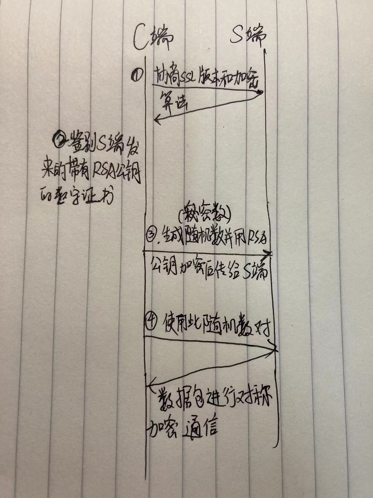
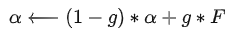
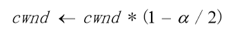
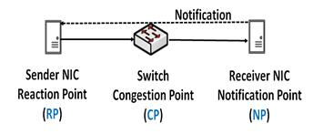
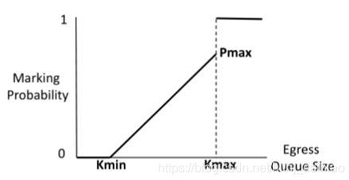
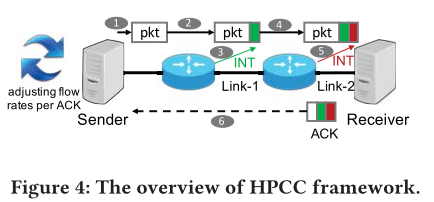
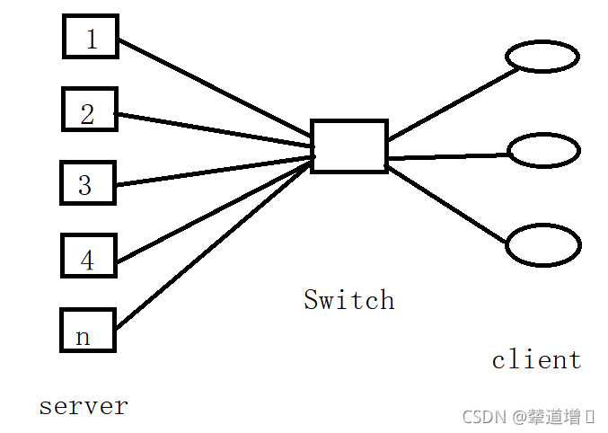
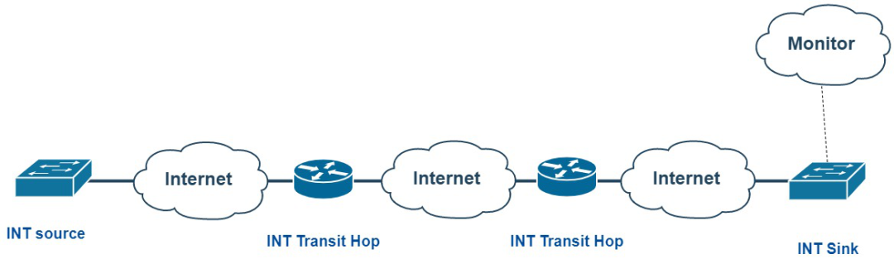
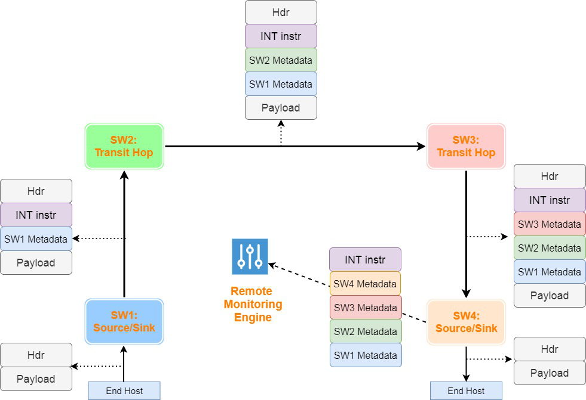
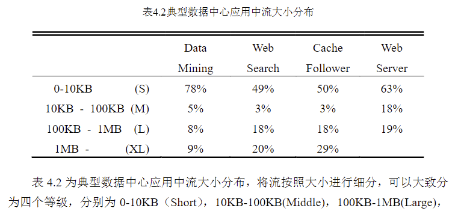

# 计算机网络基础

## MAC层

### VXLAN与VLAN

首先设计这两个机制是因为网络链路层是存在一定问题的。

二层局域网是全广播的，一个交换网络其实就是一个广播域，这带来了一些问题。1.**网络安全问题**（接收到本不该接收的数据帧，就可能存在安全隐患）；2.**垃圾流量问题**（会浪费网络的带宽资源以及计算机的处理资源）。

而且，广播域越大，上面存在的安全问题和垃圾流量问题就会越严重。

#### VLAN

通过在交换机上部署VLAN机制，可以将一个规模较大的广播域在逻辑上划分成若干个不同的、规模较小的广播域，可以有效的提高网络的安全性，减少垃圾流量的产生。

[**VLAN**](https://info.support.huawei.com/info-finder/encyclopedia/zh/VLAN.html)作为**传统的二层网络隔离技术**，使同一个vlan中的服务器可以相互通信，而归属不同vlan的服务器之间相互隔离，无法通信。


交换机在收到广播帧后，**只转发到属于同一个vlan的其他端口**。

不同vlan 之间的通信使用三层设备。

但在云计算场景中普通的vlan无法满足云计算的需求。云计算厂商在一个地域可能有超多计算机在同一个局域网，而VLAN标识长度只有12bit，只能划分4000多个隔离的二层网络。而租户还可能有一些需求需要不同地方的机器也要属于同一个网络，这个需求vlan是无法实现的。

- vlan有数量限制，只能创建4000个。
  而云计算的体量大，用户数远超4000个，并且部分用户只有一两台主机，数量限制更加捉襟见肘；
- vlan配置复杂，不灵活。
- 受限于物理网络，无法跨地理位置。如在A机房中的服务器和要B机房中的db服务器是同一个业务，需要分到同一个网络中，vlan也是不能办到的。

#### **VXLAN**

[9张图1个实验搞懂vxlan - 知乎 (zhihu.com)](https://zhuanlan.zhihu.com/p/407135507)

（Virtual eXtensible Local Area Network）或许是目前最热门的网络虚拟化技术。**网络虚拟化**是指在**一套物理网络设备上**虚拟出**多个二层网络**。使用隧道技术实现。

VXLAN是一种基于IP网络构建逻辑拓扑、采用“**MAC in UDP**”封装方式的二层VPN技术。能够为分散的物理站点提供二层和三层互联，并能为不同用户提供业务隔离服务。

**应用场景**：vxlan主要用在云数据中心，虚拟机跨三层迁移的场景，（虚拟机迁移，是指在一台物理服务器（server）上运行的虚拟机（vm），因为负载均衡或日常维护等原因，移动到另一台物理机，通俗点理解就是虚拟机搬家。）为了保证虚拟机在迁移的过程中，不中断业务，那就要保持IP地址不变，网关不变，TCP连接不变。这就限制了虚拟机迁移的范围，一定是在一个二层网络内，也就是在一个vlan内。

Vxlan技术的原理，本质上是**在一个三层互连的网络中，构建一个逻辑上的二层网络**（相当于把整个互联网虚拟成一个二层交换机），这样就可以实现虚拟机的跨三层，甚至跨数据中心、跨地域的迁移。

VXLAN报文格式：


如上图所示，VTEP对VM发送的原始以太帧（Original L2 Frame）进行了以下“包装”：

- VXLAN Header

  增加VXLAN头（8字节），其中包含24比特的VNI字段，用来定义VXLAN网络中不同的租户。此外，还包含VXLAN Flags（8比特，取值为00001000）和两个保留字段（分别为24比特和8比特）。

- UDP Header

  VXLAN头和原始以太帧一起作为UDP的数据。UDP头中，目的端口号（VXLAN Port）固定为4789，源端口号（UDP Src. Port）是原始以太帧通过哈希算法计算后的值。

- Outer IP Header

  封装外层IP头。其中，**源IP地址（Outer Src. IP）为源VM所属VTEP的IP地址，目的IP地址（Outer Dst. IP）为目的VM所属VTEP的IP地址。**（ VTEP：VXLAN Tunnel Endpoints，VXLAN隧道端点 ）（所以vxlan工作原理本质也是三层的隧道）

- Outer MAC Header

  封装外层以太头。其中，源MAC地址（Src. MAC Addr.）为源VM所属VTEP的MAC地址，目的MAC地址（Dst. MAC Addr.）为到达目的VTEP的路径中下一跳设备的MAC地址。

vxlan工作原理：


**VXLAN的缺点：**为了保证VXLAN机制通信过程的正确性，rfc7348标准中规定，涉及到VXLAN通信的IP报文一律不允许分片，这就要求物理网络的链路层实现中必须提供足够大的MTU值，保证VXLAN报文的顺利传输，这一点可以理解为当前VXLAN技术的局限性。

### VPC

云计算的领先厂商亚马逊在2010年首先使用了VPC的技术（当然当时名字不叫VPC）。现在的VPC基本都是基于 overlay 技术，在**三层网络之上构建二层网络来实现**的。

VPC（Virtual Private Cloud）是公有云上自定义的逻辑隔离网络空间，是一块可我们自定义的网络空间，与我们在数据中心运行的传统网络相似，托管在VPC内的是我们在私有云上的服务资源，如云主机、负载均衡、云数据库等。**我们可以自定义网段划分、IP地址和路由策略等，并通过安全组和网络ACL等实现多层安全防护**。同时也可以通过VPN或专线连通VPC与我们的数据中心，灵活部署混合云。

安全组：是一个逻辑上的分组，可以将同一个节点或同一个VPC网络内具有相同安全隔离需求的云服务器加到同一个安全组内。安全组是一种虚拟防火墙，具备状态检测和数据包过滤功能，可以对进出云服务器的流量进行数据包过滤，是一种重要的网络安全隔离手段。

## IP层

IP协议配套的还有三个协议：**ARP：地址解析协议，ICMP：网际控制报文协议，IGMP：网际组管理协议**

### ARP

ARP协议将IP地址转换为MAC地址。**ARP请求是二层广播包，而路由器不转发广播包。**

- **工作方式是在主机的ARP高速缓存中存在一个该局域网内的IP地址到MAC地址的映射表**。这个常常会新增和超时删除。新增是当本地不知道对方的MAC地址时，就在局域网内广播ARP请求包，对方收到后先在自己的arp表中保存我的MAC的地址，再通过ARP响应包把它的MAC地址回复给我。

- **如果目的IP地址不在本局域网**，不使用arp协议，主机直接把数据包交给网关，让网关通过路由协议去找到转发给目的地的路径。

简单来说就是，本机先找自己的arp表，没有目的地址的mac记录的话，就在局域网广播arp请求，目的主机回复arp请求。同时，双方通过学习arp请求和相应形成自己的arp缓存表。

主机想去**广域网**通信时，例如假设主机A要去访问互联网上的主机B，他们之间间隔了很多的路由器，此时A只需要把数据包发送给默认网关，让默认网关通过路由协议（OSPF, RIP, BGP）来转发到主机B。 

### 路由协议

- 内部网关协议：一个自治域内使用的协议

|                  |                             RIP                              |                             OSPF                             |
| ---------------- | :----------------------------------------------------------: | :----------------------------------------------------------: |
| 基本思想         |              使用距离向量算法找到跳数最少的路径              | 使用**Dijkstra**算法找到最短路径，它额外考虑了链路状态，这个链路状态可以是时延，距离，费用等，由网络管理人员自定义 |
| 向谁发送信息     |                     只和相邻的路由器交换                     |              通过洪泛法向自治域内所有交换机发送              |
| 发送什么信息     |                       自己的所有路由表                       |         **与本路由器相邻的所有交换机的所有链路状态**         |
| 什么时候发送信心 |                      间隔固定的时间发送                      |             当路由器连接的链路状态有改变时就发送             |
| 适用范围         |                           小型网络                           |                           大型网络                           |
| 优点             |                           实现简单                           |           更新过程收敛较快，可实现多路径的负载均衡           |
| 缺点             | 好消息传播的快，坏消息传播的慢<br/>网络出故障时，这个消息可能会在网络中传播较长时间才会因为跳数的最大限制停止 |                           实现复杂                           |

- 外部网关协议

**BGP**

不同的自治域之间可以使用不同的路由协议，所以导致不同自治域不能直接通信，要通过BGP协议，首先两个自治域需要通信时会让两个边缘路由器，即BGP发言人建立TCP连接，然后在此连接上建立BGP会话，通过此BGP会话可以转发数据包，新增或删除路由条目等等。

### IPv4与IPv6对比

|                     IPv4                     |                       IPv6（大定留消）                       |
| :------------------------------------------: | :----------------------------------------------------------: |
|              地址字段长度，32位              |                     更大的地址空间 128位                     |
| **首部长度不定**，20字节固定和不定的可选字段 | **首部长度固定（提高了路由器交换效率），**可选项放在有效载荷中。 |
|                    不支持                    | **支持资源预留，通过流标号字段使IPv6对流行的实时影音服务实现网络层面的支持。** |
|                 有首部检验和                 | 取消了检验和字段，因为传输层的UDP和TCP协议都有检验和。在把IPv6的首部精简了。 |
|                首部4字节对齐                 |                        首部8字节对齐                         |

### VPN和NAT分别解决了什么问题

现在存在这样的情况，一些用户希望使用专用网络，不与互联网通信，但这些用户又分散在不同地方，想要互联就必须跨越互联网。解决方案就是在这些用户之间互联的路由器使用vpn路由器，组成一个虚拟专用网络。vpn使用隧道技术使得数据包可以在广域网上传播。

这时有些人却又想接入互联网了，于是就要使用网络地址转换NAT，在出口路由器加上路由器的全球ip地址包头，也是使用隧道技术，实现与互联网通信。

而NAT最大的功能是缓解了ipv4地址不够的问题。

### IP层安全

IP sec协议: 主要有两种实现协议: 鉴别首部(AH)协议和封装安全有效载荷(ESP)协议。其中AH协议只能保证节点鉴别和数据完整性，不能保证传输安全，ESP要复杂很多，可以保证安全。IP sec协议主要使用**隧道技术**实现。且ipv6对IP sec的支持更加完整。

## 传输层

### TCP与UDP的区别

| TCP                              | UDP                                      |
| -------------------------------- | ---------------------------------------- |
| 保证可靠传输                     | 不保证可靠，尽最大努力交付               |
| 基于字节流，传输之前需要建立连接 | 基于报文，直接发送，无需建链             |
| 只支持1对1传输                   | 支持1对1，1对多，多对1，多对多的交互通信 |
| 首部开销大，有拥塞控制           | 首部开销小，无拥塞控制                   |

### TCP为什么保证可靠

- **建立连接：**TCP通信实现在已建立的连接之上。
- **按序确认**：TCP对每个包都有序列号，并且每个包都需要ack确认。（停止等待协议，滑动窗口协议）
- **数据校验**：TCP首部有校验和字段，检测数据包是否损坏。
- **超时重传**：数据包一段时间内收不到确认就会重传。
- **流量控制**：TCP通过滑动窗口限制发送速率，减小丢包。
- **拥塞控制**：慢启动，拥塞避免，快重传，快恢复。

### 三次握手四次挥手

当通信双方A,B想要建立TCP连接时，首先由一方比如A向B发送建立连接的请求，具体来讲就是发送将TCP头部字段中**SYN同步位置为1**的特殊数据包，B收到此数据包后，会对此数据包进行确认，即将回复的数据ACK位置为1，ack号置为收到的包的序列号加1。同时B也要建立到A的通道，于是顺便在返回的确认包中的SYN同步位置为1。A收到这个包后，就表示A到B的单向通道就建立完成了。同时A会对这个包进行回复，同样是将回复的包的ACK位置为1，ack号置为收到的包的序列号加1。B收到回复的确认包后，B到的A的通道建立完成。至此AB双方通过三个数据包的传递即三次握手完成了TCP连接的建立。注意：建立连接时发送的数据包的序列号不是从0开始而是会随机生成一个数字，这是处于安全的考虑。

当AB双方想要断开连接时，首先，A向B发送将TCP首部字段中**FIN字段置为1**的特殊数据包，B收到后向A进行回复，回复的报文中ACK位置为1，ack号置为收到的包的序列号加1。A收到回复后，A到B的单向通道就断开了，但是此时B到A的通道还存在，所以B还可以给A发数据。当B的数据发完之后，重复之前A断开连接的过程即可。至此AB双方通过四个数据包的传递即四次挥手完成了TCP连接的断开。注意，A最后回复B的FIN断链报文后需要等待两个MSL最长报文段时间，以保证A的回复能够顺利到达B使B的TCP连接正常关闭。

从本质来看，**TCP通信是全双工的**，所以TCP的建链和拆链都需要A到B和B到A两个过程。同时，**TCP的可靠性是基于回复确认的**，所以TCP建链的过程就是 A到B建链，确认，B到A建链，确认。只是B到A的确认和建链合到一个数据包来完成，所以是三次握手。而TCP拆链时由于A到B断开连接后，很可能B到A还有数据包要发生，所以不能把B到A的确认和拆链合到一块，所以是四次挥手。

### 为什么TCP四次挥手最后要等待两个MSL时间

保证A最后发送的确认数据包能够顺利到达B。如果这个数据包没有到达B，那么B就会重传FIN置为1的拆链包，此时A就会响应这个重传包。如果A不等待两个MSL的时间直接进入关闭状态，那么将无法对B的重传的B的包进行确认，导致B一直无法正常的关闭，一直浪费资源。

从本质来看，这是在依靠ack确认保证数据可靠传输的通信系统中必然存在的一个问题，即最后一个数据包的确认该如何保证。这个问题结果就是通信双方一直进行最后一个包的确认，直到无限循环。解决方法就是等待两个MSL的时间，如果两个MSL的时间内没有对方针对最后一个包的重传了，那么说明我们对最后一个包的确认包对方正常收到了。这个问题的终极解决方法是现在流行的确定性网络。

### TCP拥塞控制（reno版）

首先，TCP算法中发送速率是由发送窗口大小决定的，而发送窗口是由拥塞窗口和接收窗口取较小值决定。接收窗口保证发出取的包对方由足够的空间接收，拥塞窗口保证发出去的包网络有足够带宽承载。而拥塞窗口大小一直由拥塞控制算法进行调控。但一个计算机刚接入网络，首先启动**慢开始算法**，即将拥塞窗口设为一个单位，然后每收到一个数据包的确认就翻倍，目的是试探网络的拥塞情况。直到窗口大小超过慢开始门限的值，然后就使用**拥塞避免算法**，此时每次只将拥塞窗口增加一个单位。如果此时数据包确认超时了，就认为出现网络拥塞，那么就重新启动慢开始算法重复上面的过程，同时将慢开始门限设为拥塞时窗口的一半。如果收到了三个连续的重复确认，则认为不是严重的拥塞，此时就启动**快重传算法**，立即重传待确认的报文。同时启动**快恢复算法**，即同时设置拥塞窗口值和慢开始门限为此时窗口值的一半，并启动拥塞避免算法。

### 拥塞控制算法cubic

现在linux内核中一般的拥塞控制方法是cubic。它相对于计算机网络中学的reno版本有一些改进。主要体现在当拥塞控制阶段进入拥塞避免或者快恢复时，每经过一个RTT才会使拥塞窗口值加1。如果此时网络状态良好，在大型网络中每次RTT时间很长，那么要经过很长时间才会达到最佳拥塞窗口。因此可以说tcp reno对空闲带宽的探索是线性的，而进一步的tcp bic算法采用二分增加的方法。它以一个对称的凸函数描述了拥塞窗口增加和探索的过程。

但是tcp bic算法相对较复杂，而且它还是以每个RTT为单位去更新窗口。于是提出cubic算法，它以一个三阶的多项式来拟合bic算法的窗口变化曲线。这样简化了代码，同时以时间t为自变量，解决了每次以RTT来更新窗口的弊端，并且可以通过调整时间步长来调整公平性。

CUBIC中最关键的点在于它的窗口增长函数仅仅取决于连续的两次拥塞事件的时间间隔值，从而窗口增长完全独立于网络的时延RTT，

**CUBIC的缺点**：
更加容易造成bufferbloat，即缓冲膨胀或缓冲过满。因为如果链路中的交换设备缓冲区比较深，导致RTT变长，reno每次收到ack才会调整拥塞窗口，所在在bufferbloat的情况下，reno不容易造成拥塞。而CUBIC更新拥塞窗口跟RTT无关，到时间就增长，从而在bufferbloat 的情况下更容易加剧链路负担，导致拥塞。


综合来说CUBIC适合BDP较大的高性能网络


### 拥塞控制算法的公平性问题

reno版本的cc算法存在不公平性，因为它是每次RTT就更新一次拥塞窗口，在和其他连接共享链路时，RTT较短的连接会有更大的优势去抢占带宽资源。


### Tcp队头阻塞问题

原因是tcp流的数据包具有严格的先后顺序，到达接收端的数据包如果前面的数据包有丢失，那么后面已到达的数据包必须一直等待。解决方法比如http3使用基于udp的quic协议。它支持在一条连接中保持多条流并行传输，一定程度上避免了队头阻塞。


### 网络中的bufferbloat

bufferbloat--缓存过满：当一个分组网络中，过多的缓冲数据包导致了数据包的延迟、延迟抖动，降低了网络的总的吞吐量的现象。

可以简单的理解为，但网络中的交换设备都是用较大的buffer时，终端都向网络以较快的速度发送数据，大家都在缓冲区排队，导致延迟快速增加。且发送端还感知不到发送的数据包长时间处于排队中。而当前主流的cc算法都是基于丢包的，对时延的变化不敏感，所以发送端要过很久才会感知到丢包，才去减低速率。而理想情况应该是大家在排队较长时就应该去降低速率了。

同时bufferbloat还会导致延迟抖动严重，出现时延一会大一会小的情况。


关于bufferbloat的问题，Kathie Nichols and Van Jacobson提出了一个叫controlled delay的算法又叫CoDel algorithm，当队列中的排队的数据包过多时开始丢弃数据包，但是丢弃的数据包是从队列的前面开始有选择的丢弃，而不是先处理直到不能处理了再把后面的丢弃。该思想是先查看每一个处理的数据包的等待时间，缺省5毫秒，如果等待超过5ms，那么说明队列可能拥堵了，这是会丢弃该数据包，继续查看下一个数据包的等待时间。由于拥塞的数据包被尽快的丢弃了，带来的好处之一是内核中的TCP拥塞控制部分的负荷减轻。对传输流的好处使时延已经较长的流丢包，保证剩下时延还不太长的流顺利传输。


### RDMA


## 应用层

### HTTP

HTTP是无状态无连接的，每次都发送请求都会在新建的会话上完成。同一个客户端的前后两次请求对于服务器来说是什么任何关系的。web程序引入了Cookie机制来维护连接的可持续状态。

#### HTTP请求包

**请求格式：**

- **请求行：**包括请求的方法（GET 、POST），以及请求的URL
- **请求头：**包括传递的各种参数，以”属性名：属性值“的格式进行传递
- **空行**
- **请求体：**包括请求的数据如用户名密码等等。

例子：

``` php
GET /domains/example/ HTTP/1.1      // 请求行: 请求方法 请求 URI HTTP 协议/协议版本
Host：www.iana.org               // 服务端的主机名
User-Agent：Mozilla/5.0 (Windows NT 6.1) AppleWebKit/537.4 (KHTML, like Gecko) Chrome/22.0.1229.94 Safari/537.4          // 浏览器信息
Accept：text/html,application/xhtml+xml,application/xml;q=0.9,*/*;q=0.8  // 客户端能接收的 mine
Accept-Encoding：gzip,deflate,sdch       // 是否支持流压缩
Accept-Charset：UTF-8,*;q=0.5        // 客户端字符编码集
// 空行，两个换行\r\n\r\n,用于分割请求头和消息体
// 消息体,请求资源参数,例如 POST 传递的参数

【GET方法没有请求体】
```

使用POST方法请求


#### GET和POST的区别

HTTP 协议定义了很多与服务器交互的请求方法，最基本的有 4 种，分别是 GET, POST, PUT, DELETE。一个 URL 地址用于描述一个网络上的资源，而 **HTTP 中的 GET, POST, PUT, DELETE 就对应着对这个资源的查，增，改，删 4 个操作。我们最常见的就是 GET 和 POST 了。**GET 一般用于获取 / 查询资源信息，而 POST 一般用于更新资源信息。

- GET请求的消息体为空，POST请求有消息体
- GET请求提交的数据直接放在URL之后，以`?`分割URL和数据，参数之间用`&`进行连接，如 `EditPosts.aspx?name=test1&id=123456`。而POST方法则把提交的数据放在请求体中，更适合用来传输较大量的数据或敏感数据。
- GET 提交的数据大小有限制（因为浏览器对 URL 的长度有限制），而 POST 方法提交的数据没有限制。
- GET 方式提交数据，会带来安全问题，比如一个登录页面，通过 GET 方式提交数据时，用户名和密码将出现在 URL 上，如果页面可以被缓存或者其他人可以访问这台机器，就可以从历史记录获得该用户的账号和密码。

#### HTTP响应包

**响应格式：**

- **状态行：**协议版本，状态码，状态描述
- **响应头：**服务器信息，时间信息，内容长度等信息
- **空行**
- **响应体：**服务器返回给客户端的响应的内容。一般就是HTML页面内容

例子:

``` php
HTTP/1.1 200 OK                     // 状态行
Server: nginx/1.0.8                 // 服务器使用的 WEB 软件名及版本
Date: Tue, 30 Oct 2012 04:14:25 GMT     // 发送时间
Content-Type: text/html             // 服务器发送信息的类型
Transfer-Encoding: chunked          // 表示发送 HTTP 包是分段发的
Connection: keep-alive              // 保持连接状态
Content-Length: 90                  // 主体内容长度
// 空行 用来分割消息头和主体
<!DOCTYPE html PUBLIC "-//W3C//DTD XHTML 1.0 Transitional//EN"... // 消息体
```

状态码用来告诉 HTTP 客户端，HTTP 服务器是否产生了预期的 Response。HTTP/1.1 协议中定义了 5 类状态码， 状态码由三位数字组成，第一个数字定义了响应的类别。

- 1XX 提示信息 - 表示请求已被成功接收，继续处理
- 2XX 成功 - 表示请求已被成功接收，理解，接受
- 3XX 重定向 - 要完成请求必须进行更进一步的处理
- 4XX 客户端错误 - 请求有语法错误或请求无法实现
- 5XX 服务器端错误 - 服务器未能实现合法的请求

一次HTTP请求去渲染一个网页一般都会请求多个资源（js，css，图片等）。


#### HTTP1.0，1.1，2.0，3.0的区别

- **HTTP1.0默认使用短连接**，每次HTTP请求都会新建连接，它是无状态的。

- **HTTP1.1默认使用长连接**，多个时间相近的HTTP请求会使用同一个TCP连接，减少了TCP建立和断开连接的开销。

- **HTTP2.0在HTTP1.1的基础上实现了多路复用**，解决了队头阻塞的问题（即一条连接中前一个包一般没有到达会导致后面到达的包一直等待被处理）。另外，HTTP2.0使用头部压缩减小了额外开销，并且允许服务器直接向客户端推送。
- **HTTP3.0其实就是HTTP over Quic**，HTTP2传输层使用TCP就避免不了TCP的问题，比如HTTP2使用TCP多路复用时当TCP拥塞时所有HTTP连接都会降低传输效率。而HTTP3的优点就是QUIC 的优点：quic多路复用解决队头阻塞问题，使用packet number使重传包和原包编号不同解决重传歧义问题，通过quic有更短的建立连接的时间，更好的移动性支持。


#### HTTP和HTTPS有什么区别？

- HTTP和HTTPS用的端口不一样，HTTP端口是80，HTTPS是443。
- 使用HTTPS协议需要到CA机构去申请，需要使用额外的费用
- http是基于TCP 的用于web浏览器与网站服务器之间传递消息的应用层协议。**它以明文发送内容，不提供任何加密。**
- 为了解决这个缺陷，https在http的基础上加入了 SSL/TLS协议（Secure Socket Layer / Transport Layer Secure），来保障了数据传输的安全性。传输层安全协议的主要作用是提供通信双方的身份鉴别以及通信数据的加密。


当客户端发起HTTPS请求后，首先客户端和服务器双方协商SSL版本以及加密算法，然后**服务器返回自己的数字证书的公钥**，**客户端验证**数字证书的有效性和时效性，成功后，**生成一个随机值**使用公钥加密后发送给服务器，服务器收到后得到随机值，之后的会话数据传递就**利用这个随机值进行对称加密**了。因为随机值在客户端也有保存，所以在客户端也会使用此随机值对数据进行加密传输。




### cookie和session的区别

- ***作用范围不同***：**cookie保存于客户端**，以文本文件格式保存着用户的一些信息。session保存于服务端，用来标识一次会话。每次客户端请求时都会带上SESSION_ID与服务器中的session进行匹配，以保证同一用户的多次请求使用同一次会话。
- ***有效期不同***：**cookie可长时间保持**，**而session一般失效时间很短，防止服务器过载**

- ***隐私策略不同***：cookie以文本文件保存在客户端，有一定风险。session保存在服务器，安全性更好。
- ***存储大小不同***：一般cookie保存的数据不超过4K，而session理论上没有上限，但出于服务器性能考虑不会使session太大。


### RESTful API

***RESTful API*** 是一种基于REST架构风格的Web服务，**REST架构是一种统一，简单，轻量，高效的web服务设计模型**。RESTful API 使用HTTP提供的 PUT，GET，POST，DELETE 来实现对资源的操作，并返回**URI**统一资源标识符来唯一标识每个资源。RESTful API通常返回JSON或XML格式的数据，便于客户端解析和使用。


### 输入URL到显示页面的全过程

**基础版本：**

1. 浏览器根据请求的 URL 交给 DNS 域名解析，找到真实 IP ，向服务器发起请求；
2. 服务器交给后台处理完成后返回数据，浏览器接收⽂件（ HTML、JS、CSS 、图象等）；
3. 浏览器对加载到的资源（ HTML、JS、CSS 等）进⾏语法解析，建立相应的内部数据结构 （如 HTML 的 DOM）；
4. 载⼊解析到的资源⽂件，渲染页面，完成。

**总体分为以下几个过程：**

- DNS解析——解析域名，获取对应的ip地址
- TCP连接——TCP三次握手
- 浏览器发送http请求
- 服务器处理请求并返回http报文
- 浏览器解析返回的数据并渲染页面
- 断开连接：TCP四次挥手


# SDN 相关

ovs  openflow  控制器、SDN网关、OVS

### SDN

SDN全称Software Defined Network，软件定义网络，使用可定义的软件来实现以前固化在交换设备中的网络功能，它的特点为：

- **控制平面和数据平面分离**：控制平面由集中式或分布式的控制器组成，负责网络路由决策流量管理等功能。数据平面负责实际的路由转发。这种解耦合的分离管理使网络管理更具有灵活性。

- **网络开放可编程**：控制平面具有强大的编程计算能力，近年来常常在控制器嵌入机器学习强化学习来指导网络管理。通过数据平面也可以使用如P4等语言实现更加灵活自定的数据包转发行为。
- **逻辑上的集中控制**：SDN通过集中式的控制器来对整个网络进行管理，可以向上层提供更高更复杂的网络自定义的功能，如网络功能切片，按需分配网络资源等。

### P4

P4是一种可编程网络数据平面的语言和架构，它允许网络管理员定义网络交换机的数据包处理逻辑。

### openflow协议

openflow是一种通信协议，是应用于SDN网络中控制器和转发设备之间通信的标准化协议。openflow通过南向接口实现控制平面和数据平面的通信。


### MPLS

Multi-Protocol Label Switching：多协议标签交换

**Mult-Protocol**：支持多种三层协议，如IP、IPv6、IPX等

**Label**：一种短的、等长的、易于处理的、不包含拓扑信息、只具有局部意义的信息内容

**Switching**：MPLS报文交换和转发是基于标签的。

针对IP业务，IP包在进入MPLS网络时，入口的路由器分析IP包的内容并且为这些IP包选择合适的标签，然后所有MPLS网络中节点都是**依据这个简短标签来作为转发依据**。当该IP包最终离开MPLS网络时，标签被出口的边缘路由器分离。

**包头如下：**


可以看出，MPLS位于Mac层与IP层之间，可以说是第2.5层。

**解决了什么问题：**

MPLS最初是来解决使用的最长前缀匹配的路由查找算法的IP网络，它的查找效率低下的问题。MPLS则只需要检查对比一个标签。提升了转发效率。

而随着专用集成电路的发展，查找效率已经不再是IP网络的发展瓶颈。MPLS的优势也就不那么大了。

现在MPLS主要的优点：1. 它可以拓展多种网络协议都在一个网络中传输，这是基于隧道技术实现的。2. 它非常易于拓展，可以让客户完全自己去运行和控制自己的网络。

**典型应用场景**：

1. 点到点的虚拟共享专网

可以通过Port或者Port+VLAN的方式来对业务数据封装标签，从而达到对带宽虚拟共享的目的

### SRv6

简单来说SRv6就是在IPv6的头部的拓展字段里加入SRH，分段路由的头部。让此IP报文的转发不急于IP地址，而基于封装在头部里的分段信息。

Segment Routing over IPv6：基于IPv6转发平面的段路由。其采用现有的IPv6转发技术，通过灵活的IPv6扩展头，实现网络可编程。

**实现：**

在IPv6的拓展头里，新增SRH拓展头部字段。


### 浮动IP


传统网络与虚拟网络


# 云计算

### 网络虚拟化

[虚拟化 - 网络虚拟化 - SammyLiu - 博客园 (cnblogs.com)](https://www.cnblogs.com/sammyliu/articles/4390650.html)

**为什么要网络虚拟化**：

- 传统应用部署方式应用与操作系统绑定，不利于应用的迁移，维护，扩展。于是有了虚拟化技术。一台物理机器中运行多个虚拟机部署应用。但物理机的网卡数量有限，这些虚拟机该如何相互通信，并且与外部通信呢？于是有了网络虚拟化。

**网络虚拟化是怎么做的：**

- 一方面，**在服务器内部**，网络虚拟化为每个虚拟机设置虚拟端口将多个虚拟机连接起来。并通过NAT网络地址转换与外部通信。
- 另一方面，**网络数据交换**中，使用VLAN和VXLAN实现的二层的网络隔离也是一种网络虚拟化。VPN可以看成三层的网络虚拟化技术。

所以从**本质上讲，网络虚拟化就讲逻辑网络从物理实际网络中分离出来**。使网络更具有灵活性和可拓展性，用户需要什么样的网络，我们就提供什么样的网络。


网络虚拟化后，为了实现同主机或跨主机的通信，我们需要使用某个桥梁来实现用户态到内核态的数据传输，这个桥梁的最佳解决方案就是OpenVSwitch，OVS。

### 网络功能虚拟化（NFV）

**首先我们明确被虚拟化的网络功能有哪些？**

- 防火墙，路由器，VPN，负载均衡等等

**NFV的好处是什么？**

- 将上述的网络功能从专用硬件中分离出来打包到虚拟机或容器，使用户以更低的架构得到他们需要的网络功能。


### OVS

OVS （Open vSwitch）是一个高质量的虚拟交换机，基于 SDN 的思想，通过编程拓展是实现了大规模的网路自动化，它可以在linux服务器中虚拟出多个虚拟交换机，这些交换机向下可以挂载操作系统的物理网卡，也可以挂载虚拟网卡。向上可以接收OpenFlow控制器的管理。


它被集成在多种虚拟化平台中，如KVM，openstack等等。在P4默认使用的交换机是BMv2交换机，但也可以使用ovs。

### KVM

**kvm（Kernel-based Virtual Machine）**是linux内核中的虚拟化技术，它可以将一台linux实体机划分为多台虚拟的逻辑计算机。每个虚拟机VM相互独立，可以运行不同的操作系统和应用程序。

而在实验室中常见的是KVM（Keyboard Video Mouse）切换器控制台，用来管理和监控计算机服务器。

### network namespace

首先，namespace是linux内核中的资源抽象方式，也就是虚拟化方式，主要的作用是实现资源的隔离。

其中`network namespace` 就是实现网络相关资源的虚拟化方式。docker**默认的网络隔离方式**就是使用network namespace实现的。

namespace可以隔离出多个独立的网络空间，这些多个独立的网络空间可以设置veth对来进行相互通信，也可以设置网桥来通信，这样更方便。

### docker中的网络模型

[Docker四种网络模式 - 简书 (jianshu.com)](https://www.jianshu.com/p/22a7032bb7bd)

docker容器中默认的网络模型是桥接模型，它会创建一个名叫docker0的网桥，并分配一个私有的子网的网段。新建的容器都会连接在docker0网桥上。此时不同容器间可以相互通信，但是容器不能和外部相互通信。如果容器想和外部通信，需要使用NAT网络地址转换做端口映射，将宿主机的物理网卡的某个端口映射到容器的IP地址。


### 云网

云网融合中的云指**云计算**。网指**网络技术**。

- **云计算是一种基于网络的计算模式。通过互联网为用户提供各种计算资源和服务。包括计算、存储、网络等方面。**
- **可以看出，网络技术是云计算的载体，云计算是为用户提供的服务基础。云网融合是将两者有机结合起来，实现云和网的无缝连接和协同合作。**


我对云的理解是，各大厂商搭建的数据中心网络提供了丰富而强大的计算资源。但是各大厂商的云计算中心由于地理位置和网络连接都是相互隔离的，而我们通过新型网络的建设将这些计算资源整合为一个大的计算能力资源池，我们将其称之为云。

在如今云网融合的背景下，云和网相互连接，相互通信是大势所趋。一方面，云上提供的资源需要通过网去和用户交互。另一方面，如今网络数据的爆炸式增长使得网络的大部分应用也需要是云计算来提供支持。

我们知道，任何技术的发展都是由业务需求驱动的。互联网和通信技术的发展使得用户对计算资源与网络资源的需求越来越多样化和精细化。


### SaaS, PaaS, IaaS 

它们是云计算厂商为用户提供的三种不同类型的服务，区别如下

|                        | SaaS                                       | PaaS                                                         | IaaS                                                         |
| ---------------------- | ------------------------------------------ | ------------------------------------------------------------ | ------------------------------------------------------------ |
| 提供什么服务           | Software-as-a-service ，软件服务           | Platform-as-a-service ， 平台服务                            | Infrastructure-as-a-service ，基础设施服务                   |
| 主要面向对象           | 个人用户，商家                             | 应用开发者                                                   | 企业、开发者                                                 |
| 具体服务               | 为终端用户直接可直接访问的云托管的应用软件 | 为开发者提供软件运行的平台环境以供自定义的开发               | 为企业用户提供基础云资源，如计算资源、存储资源、网络资源     |
| 典型案例               |                                            | docker，k8s                                                  | openstack                                                    |
| 举例，我要搭建一个网站 | 直接买一个网站程序，付钱运营即可           | 在云服务器厂商购买已搭建好服务器软件的虚拟机，然后自己开发网站 | 在云服务器厂商购买一个云主机，自己进行网络、存储等配置，然后安装服务器软件进行开发 |


1）SaaS （）：软件即服务，它让用户可以直接访问云应用程序，不必在系统上安装任何东西。

2）PaaS （）：平台即服务，它为开发人员提供了云应用程序平台。

3）IaaS  （）：基础设施即服务，它从硬件（比如内存和处理器速度等）等层面提供了基础设施。

**列出云计算的基本特点** 

a）弹性和可扩展性

b）自助式配置和自动取消配置 

c）标准化界面 

d）自助计费的使用模式

**云计算的弹性和可扩展性区别在哪里**

- 弹性：某段时间云主机的业务量明显增多或减少，那么可以对云主句的资源进行相应增加或减小。简单来说就是根据需求动态地调整资源。
- 可扩展性：指增加或减少当前基础架构的工作负载大小，包括对额外功能的拓展。


k8s  虚拟化


### openstack及其组件

openstack 是一个针对**云平台的操作系统**。企业可以**借助openstack搭建并管理云计算平台**，对外提供服务，属于IaaS层。openstack将一个或多个服务器的计算，存储，网络资源通过虚拟化的方式抽象成一个大的资源池，然后更灵活地分配给用户。它不是一个软件，而通过多个组件构建而成，组件之间通过RESTapi相互调用。这些组件包括提供认证服务的keystone，提供镜像服务的Glance，，提供计算服务Nova，提供网络服务的Neutron等等。


### openstack、docker、k8s的区别

- **openstack**属于IaaS，是**管理IT资源的工具**，利用openstack将资源抽象化，然后以更灵活的方式分配给用户。openstack则是虚拟化技术的上层，它是管理这些虚拟机的操作系统。它可以使用docker，KVM等等虚拟化技术。
- **docker**本质上是一种**轻量级的虚拟化技术**，它不需要把整个操作系统虚拟出来，只需要虚拟出应用的运行环境即可。属于PaaS层。
- **k8s**在基于容器的应用越来越多的背景下，出现的一种针对容器的管理、编排的系统。也属于PaaS层。


# linux内核CC算法学习

源码下载：[Index of /pub/linux/kernel/](https://mirrors.edge.kernel.org/pub/linux/kernel/) ，本文以 5.4.224 版本为例讲解。

在新下载的内核中，网络相关代码的位置：`usr/src/linux-x.x.xxx/net/`

在`tcp_ipv4.c`中，`tcp_prot`定义了tcp的各个接口。(如下所示)

``` c
struct proto tcp_prot = {
  .name = "TCP",
  .owner = THIS_MODULE,
  .close = tcp_close,
  .connect = tcp_v4_connect,
  .disconnect = tcp_disconnect,
  .accept = inet_csk_accept,
  .destroy = tcp_v4_destroy_sock,
  .shutdown = tcp_shutdown,
  .setsockopt = tcp_setsockopt,
  .getsockopt = tcp_getsockopt,
  .recvmsg = tcp_recvmsg,
  .sendmsg = tcp_sendmsg,
  .sendpage = tcp_sendpage,
  .backlog_rcv = tcp_v4_do_rcv,
  .get_port = inet_csk_get_port,
  .twsk_prot = &tcp_timewait_sock_ops,
  .rsk_prot = &tcp_request_sock_ops,
};
```

所有TCP拥塞控制算法都需要实现`tcp_congestion_ops`这样的结构，其定义位于 `/usr/src/linux-x.x.xxx/include/net/tcp.h`中。每一种拥塞控制算法实现这样的结构，然后向系统注册。系统将注册的拥塞控制算法组织成一个**单链表**。

可以在已有的若干拥塞控制算法中看到它们各自的实现，如：(`/usr/src/linux-x.x.xxx/include/ipv4/xxx.c`)

``` c
static struct tcp_congestion_ops bictcp __read_mostly = {	// tcp_bic.c 
	.init		= bictcp_init,
	.ssthresh	= bictcp_recalc_ssthresh,
	.cong_avoid	= bictcp_cong_avoid,
	.set_state	= bictcp_state,
	.undo_cwnd	= tcp_reno_undo_cwnd,
	.pkts_acked     = bictcp_acked,
	.owner		= THIS_MODULE,
	.name		= "bic",
};

struct tcp_congestion_ops tcp_reno = {  // tcp_cong.c
	.flags		= TCP_CONG_NON_RESTRICTED,
	.name		= "reno",
	.owner		= THIS_MODULE,
	.ssthresh	= tcp_reno_ssthresh,
	.cong_avoid	= tcp_reno_cong_avoid,
	.undo_cwnd	= tcp_reno_undo_cwnd,
};

static struct tcp_congestion_ops tcp_bbr_cong_ops __read_mostly = { // tcp_bbr.c
	.flags		= TCP_CONG_NON_RESTRICTED,
	.name		= "bbr",
	.owner		= THIS_MODULE,
	.init		= bbr_init,
	.cong_control	= bbr_main,
	.sndbuf_expand	= bbr_sndbuf_expand,
	.undo_cwnd	= bbr_undo_cwnd,
	.cwnd_event	= bbr_cwnd_event,
	.ssthresh	= bbr_ssthresh,
	.min_tso_segs	= bbr_min_tso_segs,
	.get_info	= bbr_get_info,
	.set_state	= bbr_set_state,
};
```

TCP头部字段`tcphdr`定义位置：`usr/src/linux-x.x.xxx/include/uapi/tcp.h`

机器收到数据包后的处理过程的主程序在`usr/src/linux-x.x.xxx/net/ipv4/ip_input.c/*ip_rcv_core`函数中

在  `usr/src/linux-x.x.xxx/net/ipv4/tcp_input.c/tcp_rcv_state_process()`中，6306行，将发送窗口改为接收到的包的cwnd。（原本就有的）


## 网络核心数据结构

### sock 底层数据结构

#### `sock`

- 位置：`/include/net/sock.h`

- sock 结构是比较通用的网络层描述块，构成传输控制块的基础，与具体的协议族无关。它描述了各协议族的公共信息，因此不能直接作为传输层控制块来使用。不同协议族的传输层在使用该结构的时候都会对其进行拓展，来适合各自的传输特性。例如，**`inet_sock`结构由sock 结构及其它特性组成，构成了IPV4 协议族传输控制块的基础。**

#### `sk_buff`

- 位置：`/include/linux/skbuff.h`

- `struct sk_buff - socket buffer`:这一结构体在各层协议中都会被用到。该结构体存储了**网络数据报的所有信息**。包括各层的头部以及payload，以及必要的各层实现相关的信息。在文件中对skb的属性进行了详细解释。

### inet 层相关数据结构

#### `ip_options`

- 位置：`/include/net/inet_sock.h`

- 定义ip头的可选项

#### `inet_connection_sock`

- 位置：`/include/net/inet_connection_sock.h`

- 它是所有面向传输控制块的表示。其在`inet_sock`的基础上，增加了有关连接，确认，重传等成员

### TCP 层相关数据结构

#### `tcphdr`

- 位置：`/include/uapi/tcp.h`

- 这一结构正是TCP 首部及各个字段定义。

#### `tcp_options_received`

- 位置：`/include/linux/tcp.h`

- TCP 头部的选项字段。

#### `tcp_sock` 

- 位置：`/include/linux/tcp.h`

- 该数据结构是TCP 协议的控制块，它在`inet_connection_sock`结构的基础上扩展了滑动窗口协议、拥塞控制算法等一些TCP 的专有属性


## TCP Option

TCP Option 解释：[常用的TCP Option_blakegao的博客-CSDN博客](https://blog.csdn.net/blakegao/article/details/19419237)

TCP选项字段构造：[TCP/IP OPTION字段 - 莫扎特的代码 - 博客园 (cnblogs.com)](https://www.cnblogs.com/codingMozart/p/9067552.html)

解析收到的数据包的option字段的位置在：`net/ipv4/tcp_input.c/tcp_parse_options`

一般Option的格式为TLV结构，如下所示：

| Kind / Type（1 Byte） | Length（1 Byte）[整个这个选项段的总长度] | Value |
| --------------------- | ---------------------------------------- | ----- |

当前，TCP常用的Option如下所示：

| Kind(Type) | Length | Name                                                         | Reference | 描述 & 用途                                |
| ---------- | ------ | ------------------------------------------------------------ | --------- | ------------------------------------------ |
| 0          | 1      | EOL                                                          | RFC 793   | 选项列表结束                               |
| 1          | 1      | NOP                                                          | RFC 793   | 无操作（用于补位填充）                     |
| 2          | 4      | MSS                                                          | RFC 793   | 最大Segment长度                            |
| 3          | 3      | WSOPT                                                        | RFC 1323  | 窗口扩大系数（Window Scaling Factor）      |
| 4          | 2      | SACK-Premitted                                               | RFC 2018  | 表明支持SACK                               |
| 5          | 可变   | SACK                                                         | RFC 2018  | SACK Block（收到乱序数据）                 |
| 8          | 10     | TSPOT                                                        | RFC 1323  | Timestamps                                 |
| 19         | 18     | TCP-MD5                                                      | RFC 2385  | MD5认证                                    |
| 28         | 4      | UTO（RFC 5482: TCP option to announce/request UTO Not yet implemented in Linux） | RFC 5482  | User Timeout（超过一定闲置时间后拆除连接） |
| 29         | 可变   | TCP-AO                                                       | RFC 5925  | 认证（可选用各种算法）                     |
| 253/254    | 可变   | Experimental                                                 | RFC 4727  | 保留，用于科研实验                         |

注：

> 1.    EOL和NOP Option（Kind 0、Kind 1）只占1 Byte，没有Length和Value字段；
> 2.    NOP用于 将TCP Header的长度补齐至32bit的倍数（由于Header Length字段以32bit为单位，因此TCP Header的长度一定是32bit的倍数）；
>3.    SACK-Premitted Option占2 Byte，没有Value字段；
> 4.    其余Option都以1 Byte的“Kind”开头，指明Option的类型；Length指明Option的总长度（包括Kind和Length）
>5.    对于收到“不能理解”的Option，TCP会无视掉，并不影响该TCP Segment的其它内容；
> 5.    自己新增可选项字段时，需要修改IP头中的总长度字段，TCP头中的offset字段，并且修改TCP的校验和。如果知识修改字段的话就需要重新计算TCP的校验和。


## 简称查询

| **简称**    | **含义**                                                     |
| ----------- | ------------------------------------------------------------ |
| **ca**      | congestion control algorithm 拥塞控制算法                    |
| tp          | tcp_sock                                                     |
| th          | tcphdr  , tcp 头部字段                                       |
| icsk        | inet_connection_sock                                         |
| icsk_ca_ops | inet_connection_sock congestion control algorithm options，当前网络连接所采用的拥塞控制算法。 |
| snd_cwnd    | 拥塞窗口                                                     |
| snd_wnd     | 当前发送窗口                                                 |
| snd_nxt     | 下一个发送序号                                               |
| snd_una     | 最早的未确认序号                                             |
| ihl         | ip header length  ： ip头部长度                              |
| TCPOLEN     | TCP OPTION LENGTH                                            |
|             |                                                              |

上面的snd_wnd、snd_una、snd_nxt三个字段组成了滑动窗口（已发送还未确认的包in_flight，以及即将发送的包）。 如下图所示：


拥塞窗口`cwnd`：防止**过多的数据注入到网络中**导致网络发生拥塞。

发送窗口（滑动窗口）`swnd`：防止源端发送过去，收端却接收不过来。

接收窗口`rwnd`：放在ACK中的窗口字段的值，收端告诉源端自己还能接收多少。

发送窗口的值 **`swnd = min(cwnd, rwnd)`**


## lkseagle代码修改的部分

`/usr/src/linux-5.4.224/net/ipv4/tcp_cong.c/tcp_reno_cong_avoid()` 函数， // 都是我自己注释的， /\*官方自己的 注释\*/

下面这些都是新增的

``` c
	if(tp->rx_opt.my_wnd){
		tp->snd_cwnd = tp->rx_opt.my_wnd << tp->rx_opt.snd_wscale;
		printk("my_wnd is ok!");
	}
	else{
		tp->snd_cwnd=10;
	}
	printk("cwnd:%d,my_wnd:%d,snd_wscale:%d \n", tp->snd_cwnd, tp->rx_opt.my_wnd, tp->rx_opt.snd_wscale);
```


`/usr/src/linux-5.4.224/include/linux/tcp.h/tcp_options_received`  结构体，在最后增加了自定的my_wnd

`usr/src/linux-x.x.xxx/net/ipv4/tcp_input.c/tcp_parse_options()` 解析可选字段的函数中，为了使我们新增的my_wnd字段能够解析，3980-3983 增加了 if 里面的解析。同时还有这个函数中新增了7个 printk 打印输出。（ctrl + F 找到可以删除）


# 其他新型拥塞控制算法

### Quic优势

- **更短的建立连接时间**：HTTP2需要TCP+TLS建立连接至少2个RTT，因为必须要先建立TCP连接再建立TLS建立。而quic可以在一次握手的同时完成TLS连接建立。实现1个RTT的建链时间。之后的通信中使用两边缓存的会话密钥可以实现0-RTT的建链通信。
- **解决了队头阻塞问题**：quic默认实现一个quic连接可以保持多个流的连接，当一条流阻塞时不会影响其他流的正常通信。
- **更好的移动性支持**：quic并不使用源目的IP端口的四元组来保持一条连接而是使用connection ID来维持一条连接。当通信IP地址变化时并不影响quic连接。
- **更好的安全性**：quic数据包都是经过加密的，而TCP不会有任何加密和认证的。


### **BBR**

简单来说，BBR丢弃了之前的cc算法将丢包作为拥塞标志的看法。BBR认为拥塞是指 网络内传输的数据量大于了带宽时延积的一种情况。带宽时延积的物理意义可以表达为从源端发出后还未收到ACK回复的最大数据包数量。BBR的目的就是使得传输的数据量去接近这个较大的带宽时延积。带宽时延积室友传输路径的瓶颈带宽与传输路径的双向时延相乘得到的。在终端，瓶颈带宽由发送窗口的最大速率估计得到，双向时延由最小的往返时延估计得到。

#### 对BDP的理解

BDP是 Bandwidth and Delay Product ，即**带宽时延积**。单位是（bit/s * s）bit。物理意义可以理解为**从源端发送后还未收到其ack确认的最大数据量**。它是网络或者说**传输路径的固有属性**，实际发送速率乘以时延得到的值越接近BDP说明算法的效率越高。

#### BBR算法

**以前的拥塞控制算法**：互联网长期使用的CC算法如Reno，改进的NewReno，Cubic都是将丢包作为拥塞的信号。这样做的原因是交换设备带有足够长的缓冲区能够尽量保证在转发时不丢包。而随着网络上传输的数据越来越多，缓冲区轻易地被填满，进而就引发了丢包。

**以前的算法不能应对的情况**：在互联网中时常可以看到的一种场景就是网络整体并不拥塞，只是个别交换机发生了丢包，使得传输数据的两端触发拥塞控制，对半地退让了拥塞窗口，而那些没丢包没触发拥塞控制的流想用占用这些退让出来的带宽资源，则需要慢慢探测，花费不少时间，导致总体链路利用率不高。

**BBR的思想**：而BBR则并不认为丢包就等于拥塞，BBR认为拥塞是指**网络中传输的数据量 大于 带宽-时延积** 的一种场景。所以**BBR的目的**就是使传输的数据量尽量去接近较大的带宽-时延积。

BBR是基于网络模型的拥塞控制算法，它对传输流通过的网络路径评估了两个参数：

- **传输路径的瓶颈带宽**，可以通过发送窗口的**最大发送速率**估计得到。BBR总是通过最近的发送速率去估算瓶颈带宽。由于网络波动等原因，使得实际的传输速率总是在实际可用的瓶颈带宽之下，针对这种情况，BBR设置了**Max过滤器**，窗口化处理最近得到的若干最大发送速率样本，来更精确的估算瓶颈带宽。
- **传输路径的双向传播时延**，通过发送窗口的**最小往返时延**估计得到。BBR通过最近的往返时延样本来估算，当然只选用累积的、经过筛选的时延样本来估算，不会使用重传包的时延样本。而由于各种网络噪声，导致估算的RTT总是有较大的波动，BBR使用Min过滤器来减小噪声的影响，即使用一定时间窗口内的多个RRT样本来估算最小往返时延。

一般来说，当发送网络故障时，即会导致发送速率变小，又会导致RRT变大，使得**带宽-时延积**的计算结果波动不大，所以一般说来**BBR的瓶颈带宽估算和最小往返时延估算时互补的**。

### DCTCP

- **背景**：数据中心中存在三种形式的流：**查询流、短流、长流**。其中查询流和短流对延迟敏感，需要能够容忍高突发丢包，长流需要较高的吞吐量。但是因为数据中心的交换机中有限的可用缓冲区空间，这样就导致延迟敏感的流可能被排在长流的后面，从而造成应用程序的高延迟。

- **Data Center中主要的性能损害**：

    incast：对于查询流而言，many-to-one的通信模式导致在聚集交换机处发生拥塞

    Queue buildup：长流对缓存区的占用，导致短流排队

    Buffer pressure：共享的缓存区，导致其他端口的长流影响本端口的短流的传输

- **DCTCP思想**：利用网络中的显式拥塞通知（ECN）向终端主机提供多位反馈。在保证长流吞吐量的前提下，保持交换机缓冲区较低的占用率。

- **算法**：

    1. 我们在交换机处设置阈值 K ，如果数据包达到交换机时，其队列占用值大于K，则在CE点标记该数据包。
    2. 接收端收到ECN标记的数据包后，回传带有ECE（ECN-echo）标记的ACK给发送端，发送端根据规则调节发送窗口，实现拥塞避免。（并不是由交换机直接告诉发送端自己快拥塞了）
    3. 发送方根据到达的标记的包的比例，来调整拥塞窗口的大小。DCTCP的核心是拥塞程度 α 的估计， 在每次发送完一个窗口后（一个RTT）更新：
    4. `F`为当前窗口内包被标记ECN的比例。每收到一个有ECN标记的数据包，发送方按以下公式调节拥塞窗口：
    5. 当 α 趋近于1时，表示拥塞非常剧烈，与原始的TCP算法相同，DCTCP会将拥塞窗口减半；当α很小时，表示发生的拥塞十分轻微，此时拥塞窗口就不会受太大影响。

- **结果**：①DCTCP对比TCP同时使用的缓冲区空间少了90%；②DCTCP能够为短流提供低延迟和高突发容忍度；③在很大程度上缓解了incast的问题。

### QCN

QCN（Quantized Congestion Notification，量化拥塞通知）是一套应用于L2的端到端拥塞通知机制，通过**主动反向通知**，降低网络中的丢包率和延时，从而提高网络性能。(目前在RoCEv2网络中大热的DCQCN拥塞控制算法就是QCN和DCTCP相互结合形成的)

#### 1 QCN的基本概念

QCN算法由很多部分组成，先来了解一下这些部分的名称和概念

- RP（Reaction Point）：数据流的发送端，指代网卡，支持QCN协议。
- CP（Congestion Point）：使能QCN功能的网络交换设备，可以进行拥塞信息检测。
- CNM（Congestion Notification Message）：网络设备检测发生拥塞后发送给数据流源端的报文。关于报文的组成可以下次给大家细讲。
- CCF（Congestion Controlled Flow）：在某队列使能QCN后将会作用的流，后面我们统称拥塞控制流。
- QntzFb（Quantized Feedback）：表明拥塞程度的量化的反馈值，长度固定为6个比特。

#### 2 QCN思想

量化拥塞通知QCN主要有两部分算法组成，CP算法和RP算法。

- ***CP算法***：（在交换机）发生拥塞的网络交换设备（交换机）对正在发送缓存中准备发送的数据帧进行取样。如果发现出现拥塞，将会产生一个拥塞通告消息（CNM）给被取样的数据帧的发送端RP（直接给发端发送消息)。
- ***RP算法***：（在发送端）当RP收到CNM信息以后会对相应报文的**发送速率进行限制**，同时RP也会慢慢增加其发送速率来进行**可用带宽的探测**和恢复由于拥塞而"损失"的速率。当一直没收到CNM时发端为了获得更大的带宽利用率会采用快速恢复和主动增加策略。

- 具体算法细节：[QCN拥塞控制算法 - 知乎 (zhihu.com)](https://zhuanlan.zhihu.com/p/142838792)

QCN不能用于IP路由网络中，因为流的定义完全基于L2地址。 在IP路由网络中，当数据包通过网络传输时，以太网包头在不断更新，原始的以太网报头不会保留，拥塞的交换机无法确定导致其拥塞的源目标目标，所以QCN在大规模IP网络中无法部署使用，但是这并不能影响它算法中依然存由很多可取之处，后来DCQCN的出现无疑就是最好的例子。

### DCQCN

DCQCN全称为Data Center Quantized Congestion Notification，是目前在RoCEv2网络中使用最广泛的拥塞控制算法，**它融合了QCN算法和DCTCP算法**，DCQCN只需要可以支持WRED和ECN的数据中心交换机（市面上大多数交换机都支持），其他的协议功能在端节点主机的NICs上实现。DCQCN可以提供较好的公平性，实现高带宽利用率，保证低的队列缓存占用率和较少的队列缓存抖动情况。 




- **交换机（CP，congestion point）**
    CP算法与DCTCP相同，如果交换机发现出端口队列超出阈值，在转发报文时就会按照一定概率给报文携带ECN拥塞标记（ECN字段置为11），以标示网络中存在拥塞。标记的过程由WRED（Weighted Random Early Detection）功能完成。

    WRED是指按照一定的丢弃策略随机丢弃队列中的报文。它可以区分报文的服务等级，为不同的业务报文设置不同的丢弃策略。WRED在丢弃策略中设置了报文丢包的高/低门限以及最大丢弃概率，（该丢弃概率就是交换机对到达报文标记ECN的概率）。并规定：

    1. 当实际队列长度低于报文丢包的低门限值时，不丢弃报文，丢弃概率为0%。

    2. 当实际队列长度高于报文丢包的高门限值时，丢弃所有新入队列的报文，丢弃概率为100%。

    3. 实际队列长度处于报文丢包的低门限值与高门限值之间时，随机丢弃新到来的报文。随着队列中报文长度的增加，丢弃概率线性增长，但不超过设置的最大丢弃概率。 

        

- **接收端（NP，notification point）**

    接收端NP收到报文后，发现报文中携带ECN拥塞标记（ECN字段为11），则知道网络中存在拥塞，因此向源端服务器发送CNP拥塞通知报文（Congestion Notification Packets），以通知源端服务器进行流量降速。

    NP算法说明了CNPs应该什么时间以及如何产生：如果某个流的被标记数据包到达，并且在过去的N微秒的时间内没有相应CNP被发送，此时NP立刻发送一个CNP。NIC每N微秒最多处理一个被标记的数据包并为该流产生一个CNP报文。 

- **发送端（RP，reaction point）**
    当发送端RP收到一个CNP时，RP将减小当前速率Rc，并更新速率降低因子α，和DCTCP类似，并将目标速率设为当前速率，更新速率过程如下：

    `RT = Rc`

    `Rc = Rc * ( 1 -α/2 )`

    `α = ( 1-g )*α+g`

    如果RP在K微秒内没有收到CNP拥塞通知，那么将再次更新α，此时α = ( 1 -g ) * α。注意K必须大于N 即K必须大于CNP产生的时间周期。

    进一步，RP增加它的发送速率，该过程与QCN中的RP相同。

### timely-sigcomm15

本文认为：数据中心中，***简单的数据包延迟（以主机的往返时间来衡量）是一种有效的拥塞信号，无需交换机反馈。***首先，我们证明了NIC硬件的进步使得RTT的测量精度达到了微秒级，并且这些RTT足以估算交换机的排队时间。然后，作者描述TIMELY如何使用RTT梯度来调整传输速率，以在提供高带宽的同时保持较低的数据包延迟。 据我们所知，**TIMELY是第一个用于数据中心的基于延迟的拥塞控制协议**，尽管它的RTT信号（由于NIC卸载）比以前的基于延迟的方案少了一个数量级，但是TIMELY仍能实现其结果。

基于延迟的方案往往与更具攻击性的基于损失的方案竞争较弱。

本方案的**出现契机**在于NIC的最新发展确实允许以足够的精度来测量数据中心RTT，使用RTT变化率或梯度来预测拥塞的发生，从而在提供高吞吐量的同时将延迟保持在较低水平。（当然还是只是用于DC中不适用于广域网）

[ sigcomm 2015 timely 论文阅读](https://blog.csdn.net/qq_21125183/article/details/104657860)

### ExpressPass

ExpressPass: End-to-End Credit-based Congestion Control for Datacenters

ExpressPass 是一种端到端的 credit 调度的，时延有界限的拥塞控制方案。ExpressPass 使用 credit 包控制速率，调度到达的数据包。接收端在每条流的基础上发送 credit 包给发送端，交换机限制每条链路上的 credit 包速率并决定相反方向上数据分组可获得的带宽。通过影响网络中 credit 包流，系统主动地控制拥塞，甚至是在发送数据包之前。发送端很清楚适合发送的流的量，而不是等包发完以后响应拥塞信号。这种方法能够快速提升 credit 流发送速率而不用担心数据分组丢失。另外，它能够很好的解决 incast 问题，因为瓶颈链路上 credit 包的到达顺序自然地调度相反路径上数据分组的到达，以分组的粒度。

ExpressPass 通过 credit 调度，使得一个发送端仅在收到接收端的 credit 分组后才会发送数据分组。当数据分组到达发送端，发送端如果有数据分组就发送，如果没有就忽略 credit 分组。ExpressPass 通过在交换机处限制 credit 分组速率来控制拥塞而不引入流状态，这高效的调度了瓶颈链路上的响应分组，限制队列堆积并不依赖于中央控制器。即使在分割汇聚负载下，基于 credit 的调度方式仍然保证最大队列堆积受限。


### HPCC-sigcomm19

HPCC（High Precision Congestion Control，高精度拥塞控制），可以同时实现低时延、高带宽和网络稳定性。针对的问题是数据中心网络的性能瓶颈不是出现在计算设备中而是出现中网络传输中。

**HPCC利用网络遥测（INT）获得精确的链路负载信息并精确控制流量。**关键设计选择是依靠交换机提供细粒度的负载信息，例如队列大小和累积的tx/rx流量，以计算精确的流量。

HPCC的两个优势：（i）HPCC可以快速收敛到适当的流量，从而在避免拥塞的同时高度利用带宽；和（ii）HPCC可以持续保持接近零的队列，以实现低延迟

以前方法不行的根本原因是遗留网络中缺乏细粒度的网络负载信息：ECN是终端主机可以从交换机获得的唯一反馈，RTT是一种纯粹的端到端测量，没有交换机的参与。

**HPCC架构实现**：HPCC是一个发送方驱动的CC框架。如下图所示，发送方发送的每个数据包都将由接收方确认。在数据包从发送方传播到接收方的过程中，路径沿线的每个交换机利用其交换ASIC的INT特性插入一些元数据，这些元数据报告数据包出口的当前负载，包括时间戳（ts）、队列长度（qLen）、传输字节（txBytes）和链路带宽容量（B）。

当接收方收到数据包时，它会将交换机记录的所有元数据复制到发送回发送方的ACK消息中。发送方决定在每次收到带有网络负载信息的ACK时如何调整其流量。



HPCC的两个核心设计点:

- 基于inflight bytes的发送端速率控制：
- RTT-based与ACK-based反馈结合避免overreaction：

###  PCN-NSDI 2020

*Re-architecting Congestion Management in Lossless Ethernet* 

PCN揭示现有拥塞控制方法在长短流混合的场景下的存在问题：短流的特点是由于长度小于网络的时延带宽乘积（BDP），当发送方被通知拥塞时，短流已经发送完毕，造成短流不被端到端拥塞控制所控制。这种突发性的流量在无损以太网中，只能靠逐跳的PFC所控制，而长流是由端到端拥塞控制所控制的。


**现有的问题：**

- **PFC干扰拥塞探测与识别** ：F0的吞吐降低造成性能损失，原因就是拥塞从P2扩展到P0，扩展的标志就是PFC开始起作用，形成拥塞树。P0收到了PAUSE帧，造成P0队列累积。此时的队列累积并不是因为P0处发生了拥塞，P0是victim port。而在现有的拥塞控制协议均将队列长度作为拥塞信号，所以造成拥塞信号不准，端上的拥塞控制会误把F0当做造成拥塞的流进行降速。

- **逐步的端到端速率调节与逐跳的流控不匹配**

    拥塞扩展的根本原因就是造成拥塞的流没有及时快速地减到合适的速率。换句话说，如果速率减的够快，就不会有拥塞扩展出现。无损以太网中，一个好的拥塞控制算法应当尽可能少的减少PFC的触发（可以阅读[DCQCN](https://conferences.sigcomm.org/sigcomm/2015/pdf/papers/p523.pdf)中关于阈值设置的内容进行理解，同时注意DCQCN也说，它并不能保证PFC完全不触发）。本实验中，拥塞控制协议应当将F1快速减到正确的速率，但是由于现有算法的调节都是逐步的，而PFC是逐跳传播的，所以还是出现了从P1到P0的拥塞扩展。

##### Design

针对三个问题，PCN有三个核心设计点：

- **准确探测congested flow** （就是真正造成拥塞的流）

    已有的拥塞控制算法，只根据队列长度来识别congested flow （[Timely](https://yi-ran.github.io/2019/03/27/Timely-NSDI-2015/)根据RTT，本质上也是队长），当网络中PFC没有被触发时，根据队长是准的，但是如果PFC被触发，端口队长累积既可能是因为这个端口就是拥塞发生的端口，也可能因为这个端口经历了拥塞扩展，被pause住导致到达的数据包累积。因此，PCN中对端口状态进行了划分，分成了三种，非拥塞、准拥塞以及真拥塞。重点是对准拥塞端口的理解。准拥塞的端口处于一个在不断收到PAUSE和RESUME帧的阶段，端口的输出速率小于线速，输入速率取决于流量。

    

    交换机标记核心思想：`被PAUSE住的数据包不标`

    

    仅通过交换机标记是不够的，因为在连续的PAUSE RESUME之间的数据包仍可能会被标记。因此PCN将真正的拥塞识别放到接收端去做：

    如果是真拥塞端口，真拥塞流的数据包一定会连续的被标记；准拥塞端口的数据包一定不被连续标记，根据这一特征，由接收端区分谁是真正的拥塞流

- **receiver-driven的减速，使congested flow直接减速到合适的速率**

    这里文章指出了，针对无损以太网，造成拥塞的流的正确速率就是它在接收方的接收速率。这一点需要好好理解。可以说，采用拥塞流的接收速率来指导减速是彻底的解决方法。最简单的例子就是多对一的incast场景。实际上复杂的场景下这个思想也是正确的。对任意一条拥塞流，它的接收速率就是能通过瓶颈的最大速率。

- **先缓慢后激进的增速策略**

    文章作者启发式设计了一个先缓慢后激进的增长函数

    


### Swift-sigcomm20

论文题目：`Swift: Delay is Simple and Effective for Congestion Control in the Datacenter`

swift由timely发展而来；与其他工作相比，Swift以利用延迟的简单性和有效性而著称。使用时延作为拥塞的信号（因为网卡技术发展可提供非常精准的时延测量）。可轻松部署在现在的交换机中。

Swift通过使用AIMD实现端到端控制。

**实现的效果**是在较低时延的情况下仍然保持高吞吐量。


**优点**：

- 将拥塞更细粒度地划分为结构拥塞和端点拥塞。
- 对不同的流使用不同的目标延迟提高了公平性。
- 使用分数拥塞窗口和pacing delay来缓解大规模incast。
- 将RTT拆分为结构部分和主机部分可以更快地在调试中找到问题所在。

**缺点**：

- 网络中的延迟和噪声会影响研策的准确性。
- 不同协议 之间的公平性问题。


**PFC**（Priority-based Flow Control，基于优先级的流量控制）是目前应用最广泛的能够有效避免丢包的流量控制技术，是智能无损网络的基础。使能了PFC功能的队列，我们称之为无损队列。当下游设备的无损队列发生拥塞时，下游设备会通知上游设备会停止发送该队列的流量，从而实现零丢包传输。


**Incast congestion problem**：大量的请求同时到达前端服务器，或者数据中心服务器同时向外发送大量的数据，造成交换机或路由器缓冲区占满，从而引发大量丢包。TCP重传机制（TCP中收到连续三个AC K包表示拥塞）又需要等待超时重传，增加了整个系统的时延，同时大大削减了吞吐量。



**问题出现原因**：

- 大量数据同时进出网络
- 交换机缓存区有限

**解决方案**：

- 聚合热点数据对象：动态的将热点话题或相关度高的数据对象聚集在少数几个服务器上，这样前端服务器和后端服务器的连接数量就减少了，同时也降低了数据查询时延。
- 减少排队时延：使用SRTF（最短剩余时间优先调度算法）将高优先级分配给具有更小尺寸，更短等待时间的数据对象，优先传输这些数据，从而减少的平均响应时间。
- 发送拥塞后发端减少发送窗口大小。 

**INT(Inband Network Telemetry)** 带内网络遥测技术是一种主被动混合测量技术，从根本上来说就是一种借助数据面业务进行网络状况的收集、携带、整理、上报的技术，不使用单独的控制面管理流量进行上述信息收集。

通过技术名称也可以看出此项技术的两个关键点：

- **Inband**（带内），意味着借助数据面的业务流量，而不是像很多协议那样专门使用协议报文来完成协议想要达到的目的，
- **Telemetry**（遥测），体现为测量网络的数据并远程上报的特点。



一般来说，一个INT域中包含3个主要的功能节点，分别是INT Source、INT Sink和INT Transit Hop。其中INT Source、INT Sink可认为是遥测线路的起点和终点，INT Source负责指出需要收集信息的流量和要收集的信息，INT Sink负责将收到的信息进行整理并上报给监控设备；INT Transit Hop则可认为是线路上支持INT遥测的所有设备。

对遥测管理者来说，需要进行遥测的业务流量会在source节点上增加一个INT头部，其中带有指明需要收集信息类型的指令集（INT Instruction），从而成为一个INT报文，在到达关心的INT Transit Hop节点时，会根据指令集把收集到的信息（INT Metadata）插入INT报文，最终在INT Sink节点上弹出所有的INT信息并发送给监测设备。

对业务用户来说，上述INT对流量的处理过程，是完全透明的，用户不能也不需要去感知这些信息。

除此之外，INT2.0协议较此前的旧有协议，定义了新的转发模式，其中提到了如Flow Watchlist（INT设备上INT instruction 组成的集合）等新的概念，在为下一步INT技术的发展做准备。

**工作原理**

INT2.0协议中规定了三种工作模式，分别为：INT-MD、INT-MX和INT-XD，其中INT-MD即为从协议诞生之初的经典工作模式，另外两种为协议2.0中新增说明的模式，除大致工作原理外尚无详细定义。

- INT-MD(eMbed Data)/Hop-by-Hop




INT-MD模式数据包处理流程如下：

1. 普通数据报文到达INT系统的source交换节点时，INT模块通过在交换机上设置的采样方式匹配出该报文，根据[数据采集](https://cloud.tencent.com/solution/data-collect-and-label-service?from=10680)的需要在指定位置插入INT头部，包含instruction，同时将INT头部所指定的遥测信息封装成元数据（MetaData，MD）插入到INT头部之后；

2. 报文转发到Transmit Hop节点时，设备匹配INT头部后按指令插入相应的MD；

3. 报文转发到带内网络遥测系统的Sink节点时，交换设备匹配INT头部插入最后一个MD并提取全部遥测信息并通过gRPC等方式转发到遥测[服务器](https://cloud.tencent.com/product/cvm?from=10680)，将源数据报文复原并进行正常转发处理。

[网络遥测知多少之INT篇 - 腾讯云开发者社区-腾讯云 (tencent.com)](https://cloud.tencent.com/developer/article/1643482)

时延带宽乘积（BDP）指的是一个数据链路的能力（每秒比特）与来回通信延迟（秒）的乘积。其结果是以比特（或字节）为单位的一个数据总量，等同在任何特定时间该网络线路上的最大数据量——已发送但尚未确认的数据。


目标：低时延，高带宽

排队时延是流完成时间的重要组成部分，而基于队列的拥塞控制方案对时延并不敏感，无法有效监测或限制分组排队时延，造成不理想的流完成时间性能。




# 常见网络攻击和解决方案 

- sql注入：通过执行SQL语句来达到修改或删除数据库的目的，最常见的方式是使用sql的注释屏蔽掉sql语句之后的用户名密码判断。解决方法就是不要使用sql拼接，可以使用预编译的sql，比如mybatis就是这样做的。
- DDoS：分布式拒绝服务攻击：简单来说就是攻击者通过大量机器向你的服务器发送大量请求，把服务器的资源占满，导致正常用户无法访问。解决方法1. 最简单的方法就是扩大网站带宽，让DDoS无法占满资源。2.部署CDN，将网站内容分发到多个服务器，用户就近访问，源服务器IP只要不暴露就能很大程度防止DDoS攻击。3. 监控异常活动并及时封禁异常IP源。


# 其他 

### 核心网，承载网，接入网

**接入网**：是用户终端和运营商城域网之间的所有通信设备组成的网络。被形象地称为“最后一公里”。

**核心网**：核心网位于通信网络最顶层，负责处理和分发全网的业务。

**承载网**：是负责承载数据，汇聚数据的网络。信号通过承载网从接入网传输到核心网。


### 卫星网络

**优点：**

- 全球覆盖：传统网络需要在基站一定范围内才能使用，而卫星网络不受地理限制
- 通信频带宽、容量大。卫星通信信道处于微 波频率范围，频率资源相当丰富
- 信道质量好、传输性能稳定。卫星通信链路 一般都是自由空间传播的视距通信，传输损耗很稳定而可准确预算，

**缺点：**

- 建设成本高，寿命短。
- 传输衰减大
- 传输时延大


