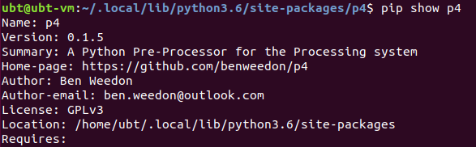
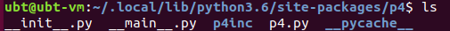
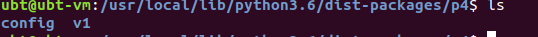
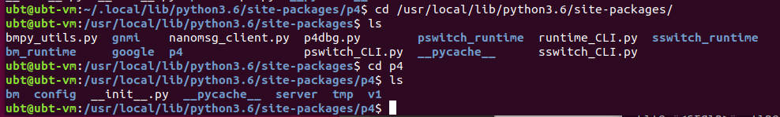
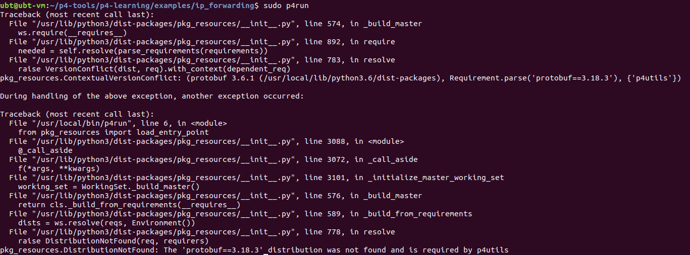
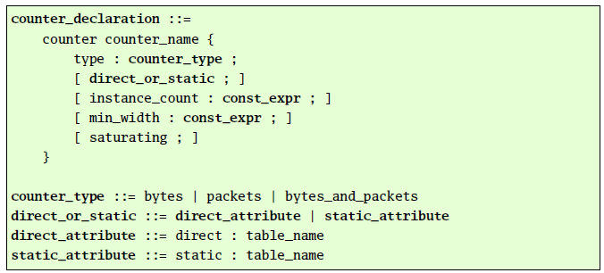
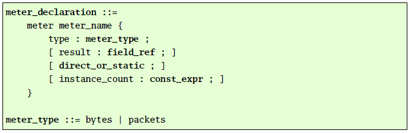
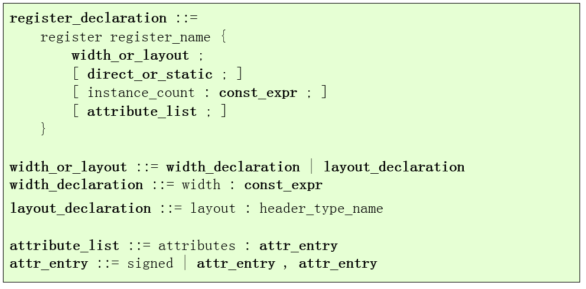

## 一、 安装P4（Ubuntu18环境）

官方指南：[p4-guide/README-install-troubleshooting.md at master · jafingerhut/p4-guide (github.com)](https://github.com/jafingerhut/p4-guide/blob/master/bin/README-install-troubleshooting.md)

挂个VPN，直接去这个地址下载预装P4环境的虚拟机就行。

文中说Ubuntu20使用`install-p4dev-v5.sh`安装脚本，Ubuntu18使用`install-p4dev-v4.sh` or `install-p4dev-v6.sh` 。

> [为ubuntu18.04配置P4环境_冲锋吧，少年的博客-CSDN博客](https://blog.csdn.net/m0_61817617/article/details/122296229)

P4 环境被分为多个子模块，需全部正确安装才能正常使用P4，如下图所示。

（其中protobuf 版本使用v3.6.1 `git checkout v3.6.1`，grpc版本使用v1.17.2 `git checkout tags/v1.17.2`）


准备一个VPN，我用的是clash，让它给ubuntu虚拟机设置代理。见https://zhuanlan.zhihu.com/p/380614384?ivk_sa=1024320u ， 如果使用clash，可以看评论区有简单方法。

这时就需要虚拟机连一个VPN代理，


然后就简单了。

- **将p4-utils下载到ubuntu中**

```cobol
git clone https://github.com/nsg-ethz/p4-utils.git
```

- 运行安装脚本

```cobol
cd p4-utils/install-tools
./install-p4-dev.sh > log.txt
```

- 一切顺利最好，不然就去看文首的链接文章。

- 测试一个例程：

``` bash
~/p4-tools/p4-learning/examples/ip_forwarding$ sudo p4run
```

进入mininet，`h1 ping h2` 测试。

此时可能报错，运行`p4run`时提示没有这个命令，运行`sudo python network.py`时提示没有p4utils模块。

使用`pip show p4utils`发现确实没有。说明p4utils没装成功。 `cd ~/p4tools/p4-utils`切到该目录，运行其中的`sudo ./install.sh ，让它单独重新安装一次即可。安装后就能重新测试上面的例程应该就没问题了。

此时P4环境就搭建完了。

**但是**，当我们下载p4 tutorial的例程`git clone https://github.com/p4lang/tutorials.git` 。运行其中任意一个，结果如下所示：

``` bash
ubt@ubt-vm:~/tutorials/exercises/basic$ sudo make
mkdir -p build pcaps logs
p4c-bm2-ss --p4v 16 --p4runtime-files build/basic.p4.p4info.txt -o build/basic.json basic.p4
sudo python3 ../../utils/run_exercise.py -t pod-topo/topology.json -j build/basic.json -b simple_switch_grpc
Traceback (most recent call last):
  File "../../utils/run_exercise.py", line 28, in <module>
    import p4runtime_lib.simple_controller
  File "/home/ubt/tutorials/utils/p4runtime_lib/simple_controller.py", line 24, in <module>
    from . import bmv2, helper
  File "/home/ubt/tutorials/utils/p4runtime_lib/bmv2.py", line 15, in <module>
    from p4.tmp import p4config_pb2
ModuleNotFoundError: No module named 'p4.tmp'
../../utils/Makefile:35: recipe for target 'run' failed
make: *** [run] Error 1
```

提示我们没有找到`p4.tmp`模块。

我们使用命令`pip show p4`查看python 的p4模块安装的位置：



该目录中的p4是使用pip安装程序没有使用sudo导致包安在了用户目录下而不是系统目录下，我们应该避免该情况，同时我们查看该p4包发现内容不全：



接着发现python的系统安装目录`dist-packages`



与`site-packages`下都有p4包。



> 查看资料学习`dist-packages`与`site-packages`的区别。
>
> 简单来说
>
> - 如果是系统自带的python，会使用`dist-packages`目录；path: `/usr/local/lib/python3.6/dist-packages/`
>
> - 如果你手动安装python，它会直接使用目录`site-packages`。path ：`/usr/local/lib/python3.6/site-packages/`

终于在`site-packages`找到了我们需要的完整的p4模块了。

接着在终端使用：

``` python
ubt@ubt-vm:/usr/local/lib/python3.6/site-packages$ python
Python 3.6.9 (default, Nov 25 2022, 14:10:45) 
[GCC 8.4.0] on linux
Type "help", "copyright", "credits" or "license" for more information.
>>> import sys
>>> print(sys.path)
['', '/usr/lib/python36.zip', '/usr/lib/python3.6', '/usr/lib/python3.6/lib-dynload', '/usr/local/lib/python3.6/dist-packages', '/usr/local/lib/python3.6/dist-packages/thrift-0.11.0-py3.6-linux-x86_64.egg', '/usr/local/lib/python3.6/dist-packages/ptf-0.9.3-py3.6.egg', '/usr/local/lib/python3.6/dist-packages/six-1.16.0-py3.6.egg', '/home/ubt/p4-tools/p4-utils', '/usr/local/lib/python3.6/site-packages', '/usr/lib/python3/dist-packages']
```

可以看出`dist-packages`和`site-packages` 都是python系统目录，所以只需将python用户目录下的p4包删掉即可。使用`pip uninstall p4`删除。使用`sudo pip install p4` 安装即可。

还有另一种方法也可以，将完整正确的p4模块放在`/tutorials/utils/`，即 `cp -r /usr/local/lib/python3.6/site-packages/p4/   ~/tutorials/utils/`，让python程序直接在同级目录下引用p4包即可，但此方法拓展性较差，推荐上一种方法。

此时我们继续运行basic例程，发现没有包找不到p4的错了，而报新的错了：

``` bash
ubt@ubt-vm:~/tutorials/exercises/basic$ make
mkdir -p build pcaps logs
p4c-bm2-ss --p4v 16 --p4runtime-files build/basic.p4.p4info.txt -o build/basic.json basic.p4
sudo python3 ../../utils/run_exercise.py -t pod-topo/topology.json -j build/basic.json -b simple_switch_grpc
Traceback (most recent call last):
  File "../../utils/run_exercise.py", line 28, in <module>
    import p4runtime_lib.simple_controller
  File "/home/ubt/tutorials/utils/p4runtime_lib/simple_controller.py", line 24, in <module>
    from . import bmv2, helper
  File "/home/ubt/tutorials/utils/p4runtime_lib/bmv2.py", line 17, in <module>
    from .switch import SwitchConnection
  File "/home/ubt/tutorials/utils/p4runtime_lib/switch.py", line 21, in <module>
    from p4.v1 import p4runtime_pb2, p4runtime_pb2_grpc
  File "/home/ubt/tutorials/utils/p4/v1/p4runtime_pb2.py", line 17, in <module>
    from google.rpc import status_pb2 as google_dot_rpc_dot_status__pb2
  File "/usr/local/lib/python3.6/dist-packages/google/rpc/status_pb2.py", line 39, in <module>
    _STATUS = DESCRIPTOR.message_types_by_name["Status"]
AttributeError: 'NoneType' object has no attribute 'message_types_by_name'
../../utils/Makefile:35: recipe for target 'run' failed
make: *** [run] Error 1
```

在网上搜索该问题发现可能是protobuf版本太高了，查看其版本：

``` bash
ubt@ubt-vm:~/tutorials/exercises/basic$ pip show protobuf
Name: protobuf
Version: 3.18.3
Summary: Protocol Buffers
Home-page: https://developers.google.com/protocol-buffers/
Author: None
Author-email: None
License: 3-Clause BSD License
Location: /usr/local/lib/python3.6/dist-packages
Requires: 
```

查看`~/p4-utils/install-tools/install-p4-dev.sh`发现其中的安装文档发现`PROTOBUF_VER="3.6.1"`

于是卸载当前版本，下载3.6.1版本的。

``` bash
sudo pip uninstall protobuf
sudo pip install protobuf==3.6.1
```

然后运行例程，运行成功了。

此时运行p4-learning中的例程发现这里的例程需要 3.18.3 版本。



这里又报错了，无语。

反复测试发现，p4-learning例程一定需要protobuf3.18.3版本，tutorial例程用这个版本就不行，用protobuf3.6.1版本就可以。只能二选其一，暂时安装3.6.1版本吧。

`sudo pip install protobuf==3.18.3`

`sudo pip install protobuf==3.6.1`

 安装新版本会默认将旧版本删除

## 二、安装torch环境后在有torch环境中使用p4的相关模块

p4的相关模块包括：p4, grpc, protobuf

grpc 安装时模块名叫 grpcio.

由于torch环境中安装的各个模块版本可能都较高，可能需要与系统自带的python环境对比看看哪些包需要改，大概是上面三个。


## P4 术语理解

https://github.com/p4lang/behavioral-model

- **`bmv2`**：**软件交换机**，仅用于科研开发，非生产级。它将JSON文件（用P4编译器编译P4程序得到）作为输入，并对其进行解释，以实现P4程序指定的数据包处理行为。，它旨在用作开发、测试和调试P4数据平面和为其编写的控制平面软件的工具。因此，bmv2在吞吐量和延迟方面的性能明显低于Open vSwitch等生产级软件交换机。

- **`p4c`**  :  包含bmv2后端，是推荐使用的**p4编译器**，因为它同时支持P4_14和P4_16程序。目前，bmv2 p4c后端支持v1model架构，并对PSA架构提供了一些初步支持。为v1model编写的P4_16程序可以使用simple_switch二进制文件执行，而为PSA编写的程序可以使用PSA_switch二进制执行。

## P4代码API

P4程序在bmv2交换机上使用V1Model架构编写，V1Model的架构文件可以在：**`/usr/local/share/p4c/p4include/V1Model.p4`**中找到。该文件描述了架构中p4可编程元件的接口。

https://github.com/p4lang/behavioral-model/blob/main/docs/simple_switch.md

`V1Model.p4` 首先介绍了一些字段的别名，然后简单描述了P4代码中可以使用的一些API，以下做简单介绍(更具体的见源文件)：

### extern

- **`counter(bit<32> size, CounterType type)`** ：计数器，**计数器可以从P4程序更新，但只能从控制平面读取**。如果您需要可以从P4程序读取和写入的内容，请考虑使用寄存器。

    计数器附加在每个表项之后，并在完成一次匹配并执行对应操作后自增1。计数器中定义了7种属性，下图展示了V1.1中计数器的定义方式。

    

- **`meter(bit<32> size, MeterType type)`**：计量器对象，例如，如果您的系统中有128个不同的“流”，编号从0到127，并且您希望对这些流中的每一个进行独立计量，您可以通过创建一个大小为128的计量器对象来实现。您必须根据数据包的数量来选择是否进行计量，而不管数据包的大小（MeterType.packets），或者基于分组包含的字节数（MeterType.bytes）。

    计量器的定义与计数器类似，计量器中定义了6种属性，下图展示了V1.1中计数器的定义方式。
    

- **`register<T>`**，寄存器。构造函数：`register(bit<32> size)`，用例：`register<bit<32>>(512) my_reg`，表示一个长度512的寄存器，其中存储的数据类型是`bit<32>`。通过`void read(out T result, in bit<32> index)`函数和`void write(in bit<32> index, in T value)`函数可以对寄存器进行读写。甚至可以给一些读写操作加上`@atomic`原子操作的注释。

    寄存器定义了5种属性，下图展示了V1.1中寄存器的定义方式。
    

- **`random<T>(out T result, in T lo, in T hi)`**，随机数生成器，随机生成一个`lo~hi`之间的数字并赋值给result。

- **`digest<T>(in bit<32> receiver, in T data)`**，向控制平面发送摘要。调用摘要会将包含数据参数中指定值的消息发送到控制平面软件。它类似于将数据包的克隆发送到控制平面软件，但它可以更有效(因为消息通常比数据包小)，而且许多这样的小摘要消息通常被合并到一个更大的“batch”中，控制平面软件可以一次处理所有这些消息。在消息中发送到控制平面的字段值是它们在摘要调用发生时的值，即使这些字段值被稍后的入口控制代码更改。仅在`ingress control`中支持调用摘要。一旦调用了它，就无法撤消其效果。（第一个参数永远填 1 ）

- **`mark_to_drop(inout standard_metadata_t standard_metadata)`**：是将`standard_metadata.egress_spec`修改为特定于实现的特殊值的原始动作，在某些情况下。它还将0指定给`standard_metadata.mcast_grp`。在调用`mark_to_drop()`之后，可以通过执行稍后的P4代码来更改这些元数据字段中的任何一个，这可以将数据包的结果行为更改为执行drop以外的操作。

- **`hash<O, T, D, M>(out O result, in HashAlgorithm algo, in T base, in D data, in M max)`**：根据参数`data`计算哈希值，将结果写入`result`中，其范围是`[base, base+max-1]`（max>=1时），如果max=0，result就只是base了。其中泛型都是`bit<w>`，（当然w可以不一样），`data`可以时元组。

- **`verify_checksum<T, O>(in bool condition, in T data, in O checksum, HashAlgorithm algo)`**：验证data 的检验和，只能在`VerifyChecksum  control`中使用。如果此方法检测到数据的校验和不正确，则当数据包开始进入处理时，`standard_metadata.checksum_error`字段的值将等于1。

- **`update_checksum<T, O>(in bool condition, in T data, inout O checksum, HashAlgorithm algo)`**：计算检验和，只能在`ComputeChecksumcontrol`中使用。

- **`verify_checksum_with_payload<T, O>(in bool condition, in T data, in O checksum, HashAlgorithm algo)`**：带负载的检验和，基本同上，只是计算时包括负载。（负载可以理解为没有被parser解析的所有比特）。

- **`update_checksum_with_payload<T, O>(in bool condition, in T data, inout O checksum, HashAlgorithm algo)`**：带负载的计算检验和。

- **`resubmit<T>(in T data)`**：重新提交数据包。仅在**`ingress processing`**中支持调用重新提交。即它将再次开始使用解析器进行处理，数据包的**内容**与上次解析完全**相同**，**唯一的区别**在于`standard_metadata instance_type`字段的值，以及重新提交操作导致保留的任何用户定义的元数据字段。保留在重新提交的数据包中的**用户定义元数据字段**的值是它们在**`ingress processing`**结束时的值，而不是它们在进行重新提交调用时的值。如果在一次执行入口控制期间多次调用resubmit，则只会重新提交一个数据包，并且只保留上次调用的数据。

- **`recirculate<T>(in T data)`**：数据包再循环。仅在**`egress processing`**中支持调用。简单理解就是将数据包通过`deparser`处理后，将数据包再次进入`parser`进行处理。保留在再循环数据包中的用户定义元数据字段的值是它们在**`egress processing`**结束时的值，而不是它们在进行再循环调用时的值。

- **`clone3<T>(in CloneType type, in bit<32> session, in T data)`**：数据包克隆或镜像，在`ingress or egress control`中调用。克隆包与原始包相互独立，该进行什么操作就进行什么操作。

- **`clone(in CloneType type, in bit<32> session)`**，相当于`clone3()`的简化版，不会保留任何用户定义**元数据字段**，所以如果需要clone时保留一些元数据信息就要自定义一些。

- **`assert(in bool check)`**：断言，例如，在simple_switch目标上，执行带有false参数的assert语句会导致打印带有assert语句的文件名和行号的日志消息，然后simple_switch进程退出。

- **`assume(in bool check)`**您可以向P4程序添加额外的条件，以便在断言不失败的情况下，清晰地处理此类数据包的处理

- **`log_msg(string msg)`与`log_msg<T>(string msg, in T data)`**：记录日志，例：`log_msg("User defined message");` ,   `log_msg("Value1 = {}, Value2 = {}",{value1, value2});`.

- **`extern void truncate(in bit<32> length)`**  对当前数据包进行截断，直接使用，例：truncate((bit<32>)22);    表示截断到剩22个字节

  ​    

注：包头和元数据实例中的数据只能存在对某个数据包解析的过程中，解析下一个数据包时，这些实例会重新初始化。而**计数器、计量器和寄存器**中的数据在整个流水线中长期存在，所以称之为状态存储。

接下来就是P4文件的基本结构：

``` c++
/*
 * Architecture.
 *
 * M must be a struct.
 *
 * H must be a struct where every one if its members is of type
 * header, header stack, or header_union.
 */

parser Parser<H, M>(packet_in b,
                    out H parsedHdr,
                    inout M meta,
                    inout standard_metadata_t standard_metadata);

/*
 * The only legal statements in the body of the VerifyChecksum control
 * are: block statements, calls to the verify_checksum and
 * verify_checksum_with_payload methods, and return statements.
 */
control VerifyChecksum<H, M>(inout H hdr,
                             inout M meta);
@pipeline
control Ingress<H, M>(inout H hdr,
                      inout M meta,
                      inout standard_metadata_t standard_metadata);
@pipeline
control Egress<H, M>(inout H hdr,
                     inout M meta,
                     inout standard_metadata_t standard_metadata);

/*
 * The only legal statements in the body of the ComputeChecksum
 * control are: block statements, calls to the update_checksum and
 * update_checksum_with_payload methods, and return statements.
 */
control ComputeChecksum<H, M>(inout H hdr,
                              inout M meta);

/*
 * The only legal statements in the body of the Deparser control are:
 * calls to the packet_out.emit() method.
 */
@deparser
control Deparser<H>(packet_out b, in H hdr);

package V1Switch<H, M>(Parser<H, M> p,
                       VerifyChecksum<H, M> vr,
                       Ingress<H, M> ig,
                       Egress<H, M> eg,
                       ComputeChecksum<H, M> ck,
                       Deparser<H> dep
                       );

```

### **元数据-metadata**

元数据是（数据包 -- 交换机）关联的，不会在网络中传递。

元数据是用来携带数据和配置性的东西，元数据的申明与包头类似，但在实例化的时候有所不同，而且包头和元数据在字段值的约束上存在一定的差别。

元数据分为两种，一种是用来携带P4程序运行过程中产生的数据的用户自定义元数据（User-Defined Metadata），如首部字段的运算结果等。另一种是固有元数据（Intrinsic Metadata），用于携带交换机自身的配置信息，如数据包进入交换机时的端口号等。

- 自定义元数据：开发者自定义metadata，定义方式和header一样。然后可以直接应用在Action和Control里。

- 固有元数据**`standard_metadata.some_field`**：可以直接使用。

有**8种标准固有元数据**，这些元数据携带了数据包相关的状态信息。

- **`ingress_port` ：**数据包的入端口，解析之前设置，只读。
- **`egress_spec `：**在入端口流水线的匹配-动作过程之后设置，**指定数据包出端口**，可以是物理端口、逻辑端口或者多播组。
- **`egress_port` ：**数据包的出端口。
- **`packet_length`：**数据包的字节数，当交换机在快速转发模式下，该元数据不能在动作（action）中匹配或引用。只读。
- **`egress_instance `：**用于区分复制后数据包实例的标识符。只读。
- **`instance_type`：**数据包实例类型：正常（Normal）、入端口复制（ingress clone）、出端口复制（egress clone）、再循环（recirculated）。
- **`parser_sratus `**: 解析器解析结果，0表示无错误，其实数字代表了对应的错误类型。
- **`parser_error_location` ：**指向P4程序错误发生处。

还有更多额外内部元数据以实现更多功能（v1model体系结构下）：

[看看有趣的P4 BMv2 Ⅰ：simple_switch.md - 简书 (jianshu.com)](https://www.jianshu.com/p/044761dc2ea9)

- **`ingress_global_timestamp`**：时间戳（以微秒为单位），当数据包在入口出现时设置。每次开关启动时，时钟都设置为0。可以直接从任一管道（入口和出口）读取此字段，但不应将其写入。++++
- **`egress_global_timestamp`**：时间戳（以微秒为单位），当数据包开始进行出口处理时设置。时钟与相同**`ingress_global_timestamp`**。该字段只能从出口管道中读取，而不能写入。++++
- **`mcast_grp`**：多播功能所需。当您希望对数据包进行多播时，需要在入口管道中写入此字段。值为0表示无组播。该值必须是通过bmv2运行时接口配置的有效多播组之一。请参阅“入口后伪代码”，以了解入口结束时此相对于其他可能的数据包操作的相对优先级。
- **`egress_rid`**：多播功能所需。该字段仅在出口管道中有效，并且只能从中读取。它用于唯一标识同一入口数据包的多播副本。

**以下字段只在 出口管道 可以访问**：

- **`enq_timestamp`**：时间戳，以毫秒为单位，设置首次将数据包加入队列的时间。+++
- **`enq_qdepth`**：首次将数据包**排入队列**时的队列深度，以数据包数（而不是数据包的总大小）为单位。要在egress里面用++++
- **`deq_timedelta`**：数据包在队列中花费的时间（以微秒为单位）。+++
- **`deq_qdepth`**：数据包**出队**时的队列深度，以数据包数量（而不是数据包的总大小）为单位。+++
- **`qid`**：：当有多个队列服务每个出口端口时（例如，启用优先级队列时），每个队列都分配有固定的唯一ID，并将其写入此字段。否则，此字段设置为0。TBD：`qid`当前不是`standard_metadata_t`v1model中类型的一部分。也许应该添加？

根据自动上游节点的反馈控制输入的流量，

在 *mininet* 中`xterm s1`可进入交换机s1中，在新的prompt中输入`simple_switch_CLI --thrift-port 9090` (s1是9090，s2是9091，以此类推)，进入交换机内部，之后输入`help`可以查看有哪些命令。

例如：`register_read <寄存器名>`：查看寄存器内容

1. 屏蔽原有拥塞控制算法
2. 例，10M带宽链路我们打80M流量，我们的算法可以1，2秒内让速率收敛，比其他的快。

### varbit（变长位串）

[P4~16~ Language Specification](https://p4.org/p4-spec/docs/P4-16-v1.1.0-spec.html)

该数据类型，不支持算术、比较和位运算，也不支持类型转换，该数据类型在定义时会指定一个**静态的最大宽度值**，解析器会提取变长位串数据并设置一个值作为长度。在初始化之前，可变大小的位串具有未知的动态宽度。

***可变长度位串支持有限的一组操作：***

- **使用`packet_in`外部对象的双参数`extract`方法将解析器提取为可变大小的位字符串**（参见第12.8.3节）。此操作设置字段的动态宽度。

- **分配给另一个可变大小的位字符串**。赋值的目标必须与源具有相同的静态宽度。执行时，赋值将目标的动态宽度设置为源的动态宽度。

- **`packet_out`外部对象的`emit`方法**，它将具有已知动态宽度的可变大小的位串插入到正在构建的数据包中（参见第15节）。

- **与另一个`varbit`字段进行相等或不相等的比较**。只有当两个varbit字段具有相同的类型时，才能对它们进行比较。如果两个变量位具有相同的动态宽度，并且直到动态宽度的所有位都相同，则两个变量是相等的。

#### `varbit`的提取 :

```  c
void extract<T>(out T headerLvalue, in bit<32> variableFieldSize);
```

表达式`headerLvalue`必须是一个左值，表示仅包含**一个`varbit`字段**的头部。表达式`variableFieldSize`的值必须为`bit＜32＞`，该值指示要提取到标头的**唯一varbit字段中的位数**（即，该大小不是完整标头的大小，只是varbit字段）。

#### p4中得到随机数

``` c
extern void random<T>(out T result, in T lo, in T hi);
```

输入范围为 `[lo, hi]`，输出结果保存在`result`中。


## iperf 工具

iperf命令是基于命令行模式的网络性能测试工具，可以**测试TCP和UDP带宽质量**。同时也可以通过UDP测试报告网络**丢包率**或者**发包性能**，是一个非常实用的工具。

iperf 提供横跨Windows、Linux、Mac的全平台支持。iperf 全程使用内存作为发送/接收缓冲区，不受磁盘性能的影响，对于机器配置要求很低。不过由于是命令行工具， iperf 不支持输出测试图形。

目前最新版是iperf3，与iperf 相差不大。iperf 默认只监听TCP，iperf3 默认监听TCP 和 UDP。

### 安装

ubuntu下：`sudo apt install iperf` 

### 使用

Iperf可以运行在任何IP网络上，包括本地以太网、接入因特网、Wi-Fi网络等。

在工作模式上，iperf运行于C/S 客户端/服务器模式下，其**服务器端主要用于监听到达的测试请求**，而**客户端主要用于发起测试连接会话**，因此要使用iperf至少需要两台机器，一台运行在服务器模式下，另一台运行在客户端模式下。

查看帮助： `iperf --help`或`iperf -h` 

查看当前版本： `iperf --version`或`iperf -v` 

基本用法：`iperf [-s|-c] [options]`

通过查看帮助知道，iperf的命令行选项共分为三类，分别是**客户端与服务器端公用选项**、**服务器端专用选项**和**客户端专用选项**。

#### iperf基本参数

[Iperf3网络性能测试工具详解教程 - pycod - 博客园 (cnblogs.com)](https://www.cnblogs.com/xuanbjut/p/14144255.html)

- :ocean:**`-s, –server`**：iperf服务器模式，默认启动的监听端口为5201，eg：`iperf -s`
- :car: **`-c, –client`** ：iperf客户端模式，host是server端地址，eg：`iperf -c 222.35.11.23`
- :ocean: :car: **`-B`** ：后跟ip地址。在服务端，设置数据从哪个网卡接收；在客户端，设置数据从哪个网卡发送。
- :ocean:**`-D`**：Unix平台下将Iperf作为后台守护进程运行。在Win32平台下，Iperf将作为服务运行。
- :ocean::car: **`-i，–interval`**：指定每次报告之间的时间间隔，单位为秒，eg：`iperf3 -c 192.168.12.168 -i 2`
- :ocean::car: **`-f，–format [k|m|g|K|M|G]`**：指定带宽输出单位，“[k|m|g|K|M|G]”分别表示以Kbits, Mbits, Gbits, KBytes, MBytes,GBytes显示输出结果，默认Mbits，eg：`iperf3 -c 192.168.12.168 -f M`
- :ocean::car: **`-p，–port`**：指定服务器端监听的端口或客户端所连接的端口，默认是5001端口。
- :ocean::car:**`-P,–parallel`**：server中：服务器关闭之前保持的连接数。默认是0，这意味着永远接受连接。client中：指定客户端与服务端之间使用的线程数。默认是1个线程。需要客户端与服务器端同时使用此参数。 
- :ocean::car: **`-u，–udp`**：表示采用UDP协议发送报文，不带该参数表示采用TCP协议，iperf3 直接监听tcp和udp了，所以iperf3的服务端不能用这 个命令。
- :car: **`-l，–len`**：设置读写缓冲区的长度，单位为 Byte。**TCP方式默认为8KB**，**UDP方式默认为1470字节**。通常测试 PPS 的时候该值为16，测试BPS时该值为1400。
- :car: **`-n，–num [K|M|G]`**：指定传输数据包的字节数，例如：`iperf3 -c 192.168.12.168 –n 100M`
- :car: **`-b，–bandwidth [K|M|G]`**：指定**UDP模式**使用的带宽，**单位bits/sec**，**默认值是1 Mbit/sec**。
- :car:  **`-w，–window`**：指定套接字缓冲区大小，在TCP方式下，此设置为**TCP窗口的大小**。在UDP方式下，此设置为接受**UDP数据包的缓冲区大小**，用来限制可以接收数据包的最大值
- :car: **`-t，–time`**：指定数据传输的总时间，即在指定的时间内，重复发送指定长度的数据包。默认10秒。
- :car:**`-A`**：CPU亲和性，可以将具体的iperf3进程绑定对应编号的逻辑CPU，避免iperf进程在不同的CPU间调度。

:car: ：表示该选项用于 Client

:ocean: ：表示该选项用于 Server

**使用示例：**

在自己的服务器运行：`iperf -s -i 1 -p 8100`：以服务器方式打开，每 1 秒打印一次报告，监听端口8100（默认端口没开）。

在客户机：`iperf -c 49.232.21.36 -i 1 -p 8100`：以客户端方式打开，连接IP地址49.232.21.36，每 1 秒打印一次报告，连接端口8100。

## simple_switch_CLI

对mininet交换机内部数据进行读取和设置。

再命令行输入 **`simple_switch_CLI --thrift-port 9090`** 进入交换机内部，其中9090是s1交换机，9091是s2，以此类推。

输入**`help`**查看有哪些命令，read相关的命令直接查看相应参数，set相关的需要带参数进行设置，

例如：**`set_queue_rate 7600`** 设置交换机**所有端口**的处理速率为每秒7600个包。

register_read pkt_counter

register_read threshold

table_dump ipv4_lpm

## 影响P4性能的因素

- 程序越简单（即 parsed / deparsed 的头的数量越少，match-action tables的数量越小，等等），吞吐量越高，时延越低。

https://github.com/p4lang/behavioral-model/blob/main/docs/performance.md


| 设置的发包比例 | 是否发ECN | 设置的bw   | set_queue_rate   | 最后收敛的带宽 |
| -------------- | --------- | ---------- | ---------------- | -------------- |
| 6：3：1        | 0         | 20：40：60 | 3000：5000：7000 | 15 ~ 17        |
| 6：3：1        | 1         | 20：40：60 | 3000：5000：7000 | 35 ~ 37        |
| 1：1：1        | 0         | 20：40：60 | 3000：5000：7000 | 32 ~ 41        |
| 1：1：1        | 0         | 0          | 3000：5000：7000 | 49.1           |
| 1：1：1        | 0         | 20：40：60 | 0                | 45.3           |
| 1：3：6        | 0         | 20：40：60 | 3000：5000：7000 | 38 ~ 42        |
| 1：3：6        | 0         | 20：40：60 | 0                | 44.6           |
| 1：3：6        | 0         | 0          | 3000：5000：7000 | 48.6           |
| 1：3：6        | 0         | 10：30：60 | 0                | 46.9           |
| 50:33:17       | 1         | 20：40：60 | 0                | 41.5           |

iperf -s -i 1

iperf  -i 1 -t 100 -c 10.0.


## bfrt

 在barefoot实体P4交换机中，有一个python程序一直管理着P4功能。

在开启端口后使用 `bfrt_python` 进入此python程序的命令行控制台中。此python程序以**树**的形式保存着此P4程序相关的数据结构。

``` txt
bfrt
  - mirror
  - port
  - pre
  - [此P4文件]
    - pipe
      - Ingress
        - 所有的table
        - 所有的寄存器
      - IngressParser
      - ...
```

simple_switch_CLI --thrift-port 9090


