[1. 引言 — 动手学深度学习 2.0.0 documentation (d2l.ai)](https://zh.d2l.ai/chapter_introduction/index.html)

# PyTorch

## 1. numpy

#### 1.1 产生numpy.ndarray的几种方式

```python
import numpy as np

np.array(object, dtype=None, copy=True, order=None, subok=False, ndmin=0)
np.array([1,2,3,4,5,6])

# 初始化为0,1或空 
np.zeros(shape, dtype=float, order='C')
np.ones(shape, dtype=None, order='C')
np.empty(shape, dtype=float, order='C')	# 填充的数据无意义
# 例 
np.zeros((2,5))	# 产生一个 2 * 5 的矩阵		用() 和 [] 都行
np.ones([5,]) 	# 产生一个 包含5个元素的向量

np.arange([start,] stop[, step,], dtype=None)
# 例
np.arange(20, 36)	# [20,21,22,...,34,35]
np.linspace(start, stop, num)	# linspace和arange的不同在于linspace的第三个参数是生成的数字总数

# 随机生成
a = np.random.rand(d0, d1, ..., dn)  # 输入的就是第一维，第二维，第三维....
a = np.random.rand(3,5)		# 其中的数据是[0 , 1) 中随机
# [[0.44108417 0.13205678 0.19765883 0.9100034  0.37837717]
# [0.50288821 0.54574884 0.60314067 0.85237972 0.79760849]
# [0.60066761 0.42078304 0.57672113 0.67113562 0.44895375]]
a.fill(2)		# 将a全部填充为2，fill没有返回值
```

#### 1.2 ndarray的形状

```python
w = np.ones([3,5])
print(w.shape)	# （3，5）
print(w.shape[0]) # = len(shape)  	 3 
print(w.shape[1]) # = len(shape[0])  5 
# ndarray的shape属性是一个元组，(d1,d2,d3)，依次保存着第一维，第二维，...

# 修改形状 reshape() 可以
w = np.arange(15).reshape(3, 5) # reshape((3, 5)) 和 reshape([3,5]) 也可以
print(w.reshape(-1))	# reshape(-1)总是把矩阵转换为一个向量，[ 0  1  2  3  4  5  6  7  8  9 10 11 12 13 14]

```

#### 1.3 ndarray的截取

```python
# ndarray的截取和list一样
w = np.arange(15).reshape(3, 5)
# [[ 0  1  2  3  4]
# [ 5  6  7  8  9]
# [10 11 12 13 14]]
w = w[1:, 2:4]
# [[ 7  8]
# [12 13]]
# 当然也可以取一行
w = w[:,]
# [ 0  5 10]	这里进行了行列转换
```

#### 1.4 ndarray的连接

```python
# 对比list的连接 append, extend 见之前的文档
w = np.arange(10).reshape([2, 5])
b = np.ones((3,2))
w = np.append(w, b)	# append的两个参数矩阵不需要行列约束，都是全部拆成一维向量再把所有元素加在最后，再返回这个一维向量
# 当然append 有参数axis可以增加行或列，但太麻烦
print(w)
# [0. 1. 2. 3. 4. 5. 6. 7. 8. 9. 1. 1. 1. 1. 1. 1.]

# numpy提供了numpy.concatenate((a1,a2,...), axis=0)函数。能够一次完成多个数组的拼接。其中a1,a2,...是数组类型的参数
a=np.array([[1,2,3],[4,5,6]])
b=np.array([[11,21,31],[7,8,9]])
c = np.concatenate((a,b),axis=0)	# axis=0 以行为基准
# array([[ 1,  2,  3],
#        [ 4,  5,  6],
#        [11, 21, 31],
#        [ 7,  8,  9]])
d = np.concatenate((a,b),axis=1)  # axis=1 以列为基准
# array([[ 1,  2,  3, 11, 21, 31],
#        [ 4,  5,  6,  7,  8,  9]])
```

#### 1.5 ndarray的计算

```python
# --------四则运算--------
# 即使不同型矩阵仍然可以四则运算
w = np.arange(15).reshape((3, 5))
print(w)
# w = [[ 0  1  2  3  4]
#  	  [ 5  6  7  8  9]
# 	  [10 11 12 13 14]]
a = np.ones([5,])  # b = [1,1,1,1,1] / [5,] 不指定列数时就认为这是行向量，一维矩阵
print(w - a)		#  w 的每一行都去减 b 这个行向量  w + b， w * b , w / b 同理 
#	[[-1.  0.  1.  2.  3.]
#	 [ 4.  5.  6.  7.  8.]
# 	[ 9. 10. 11. 12. 13.]]
# 综上，i*j 型的矩阵可以与同型矩阵进行四则运算，也可以和长度为j的向量进行运算，运算规则是每行都与此向量进行运算

# ----------点乘-----------
# 矩阵点乘
w = np.arange(6).reshape([2, 3])
print(w)
# [[0 1 2]
# [3 4 5]]
b = np.ones((3,2))
b.fill(2)
print(np.dot(w, b))
# [[ 6.  6.]
#  [24. 24.]]

# 矩阵和向量点乘
w = np.arange(12).reshape([2, 6])
# w [[ 0  1  2  3  4  5]
#    [ 6  7  8  9 10 11]]
b = np.ones((3,2))
b.fill(2)
b = b.reshape(-1)
# b [2. 2. 2. 2. 2. 2.]
print(np.dot(w, b))
# [ 30. 102.]
# 只有向量和矩阵的行向量等长时才能点乘，运算规则就是矩阵每个行向量和向量做内积
```

#### 1.6 矩阵的相关操作

```python
w = np.arange(6).reshape(2, 3)
print(w.T , w.transpose())		# 这两个都是求矩阵的转置
# [[0 3]
#  [1 4]
#  [2 5]]
```


 ## 2. PyTorch

<div style="padding:15px 20px;border-radius:10px;background:#252525;color:#dedede;font-size:23px;box-shadow:10px 10px 15px #888888">PyTorch是一个基于Python的库，用来提供一个具有灵活性的深度学习平台，PyTorch的工作流程非常接近Python的科学计算库--numpy，PyTorch的一些优点包括：<span style="color:#ee0000">运行时构建计算图，多gpu支持，自定义数据加载器，简化的预处理器</span></div>

#### 2.1 tensor

- `Tensor `，又名张量，可以简单地认为它是一个数组，且支持高效的科学计算。它可以是一个数（标量），一维数组（向量），二维数组（矩阵）或更高维的数组（高阶数据）。tensor和`numpy`的`ndarrays`类似。

	- **有多种方式生成一个tensor**

	- ``` python
		import torch
		
		x = torch.FloatTensor([2, 3])  # torch.tensor类似
		# tensor([2., 3.])
		y = torch.arange(0,4)
		# tensor([0, 1, 2, 3])
		a = torch.zeros(6).reshape(2,3)
		b = torch.ones_like(a)	# 让b 跟a 有一样的尺寸
		# tensor([[0., 0., 0.],
		#         [0., 0., 0.]])
		b = torch.randn(2,2)	# 在标准正态分布中取值
		b = torch.rand(2,2)	# 在(0, 1]的均匀分布中取值
		# tensor([[0.9402, 0.9672],
		#         [0.5175, 0.6964]])
		
		c = torch.arange(3).float() 	# 再后面直接点就可以修改数据类型
		print(c.data.type())
		```

	- **tensor 的运算**

	- ``` python
		a = torch.zeros(6).reshape(2,3)
		c = torch.tensor([1,2,3], dtype=float)
		print(c+a)	#+-*/ 都是两个张量对应位置相互运算
		print(torch.add(c,a))
		print(c.add_(a))			# inplace  原地操作
		# tensor([[1., 2., 3.],
		#         [1., 2., 3.]], dtype=torch.float64)
		# 还是和numpy一样，即使运算的两个张量不同型，也会通过广播机制将两者运算
		
		c = torch.tensor([1,2,3])
		d = torch.tensor([2,3,2])
		print(torch.dot(c,d))					# dot() 只能用于一维张量！！
		# tensor(14)
		
		c = torch.tensor([1,2,3,4,5,6]).reshape(2,3)
		d = torch.tensor([2,3,2,3,2,3]).reshape(3,2)
		print(torch.matmul(c,d))				# matmul）才能用于多维张量
		# tensor([[12, 18],
		#         [30, 45]]
		c = torch.tensor([1,2,3,4,5,6]).reshape(2,3)
		d = torch.tensor([2,3,1])
		print(torch.matmul(c,d))
		# tensor([11, 29])   n列的二维张量和长度为n的一维张量可以直接叉乘，不用reshape
		c = torch.tensor([1,2,3,4,5,6]).reshape(2,3)
		d = torch.tensor([2,3])
		print(torch.matmul(d,c))
		# tensor([14, 19, 24])
		
		# 矩阵相乘还有 torch.mm 与 torch.bmm
		# 前者实现矩阵相乘，后者实现批量矩阵相乘。
		# 还有einsum，更强大，后面再说
		```
	
	- 其他操作
	
	 ```python
	# -----索引--------
	# 注意：索引出来的结果和原数据共享内存，改一个，另一个也改了
	a = [i for i in range(1,10) if i%2 == 0]
	a = torch.Tensor(a).reshape(2,2)
	b = a[0,:]		# 如果不希望共享数据，可以 b = a[0,:].clone()
	print(b)	# tensor([2., 4.])
	b[0] = 22
	print(a)
	# tensor([[22.,  4.],
	#         [ 6.,  8.]])
	
	# ------------------------改变形状----------------------- 
	# view 或 reshape
	# 还是共享数据的，还是通过clone来解决
	a = [i for i in range(1,10) if i%2 == 0]
	a = torch.Tensor(a)
	b = a.view(2,2) # reshape(2,-1) 也行
	print(b)
	# tensor([[2., 4.],
	#        [6., 8.]])
	b += 1
	print(a)
	# tensor([3., 5., 7., 9.])
	print(b.t())	# 求转置
	print(b.inverse())	# 求逆
	print(b.diag())	# 返回对角线的元素
	print(b.trace())	# 求迹
	
	#------------------------------item()----------------------
	#只有1个数字的tensor可通过 .item() 转换为python的数据类型
	
	#-----------------------cat()-----------------------
	#连接多个张量
	a = torch.cat((torch.ones(2000), torch.zeros(2000)), dim=0)
	a.shape # 4000,  如果是dim=1 就是 2000，2
	 ```


  - Tensor 和 NumPy 相互转换


```python
# 使用numpy() 和 from_numpy() 来相互转换
# 但这两个函数产生的结果还是共享内存的
a = torch.ones(3)
b = a.numpy()
print(a, b)	# tensor([1., 1., 1.]) [1. 1. 1.]
a += 1
print(a, b)	# tensor([2., 2., 2.]) [2. 2. 2.]

c = torch.tensor(b)	# 通过tensor等类似的函数不会共享内存
c += 1
print(b, c)	# [2. 2. 2.] tensor([3., 3., 3.])
```

- [pytorch.gather 详解]([pytorch函数（1）：torch.gather()的正确理解方法_今天不用睡觉了、的博客-CSDN博客](https://blog.csdn.net/weixin_42200930/article/details/108995776?utm_medium=distribute.pc_relevant.none-task-blog-2~default~baidujs_title~default-0.control&spm=1001.2101.3001.4242))

- [plt.scatter() 绘制散点图详解]([plt.scatter()_coder-CSDN博客_plt.scatter](https://blog.csdn.net/m0_37393514/article/details/81298503))

#### 2.2 autograd

- torch.autograd 是为了方便用户使用，专门开发的一套**自动求导引擎**，他能够根据**输入和前向传播过程自动构建计算图**，并执行**反向传播**

- Variable
	- PyTorch 在autograd 模块中实现了计算图的相关功能，autograd中的核心数据结构是Variable，Variable 封装了tensor，并*记录对tensor的操作用来构建计算图*。Variable的数据结构中包含三个属性：
	- 1. **data**：保存variable 所包含的tensor
		2. **grad**：保存data对应的梯度，grad也是**variable**，而非tensor
		3. **grad_fn**：指向一个Function，记录variable的历史操作
			

``` python
x = Variable(torch.ones(2,2), requires_grad=False)	
temp = Variable(torch.zeros(2,2), requires_grad=True)
y = torch.mean(x + temp + 2)
y.backward()
print(x.grad)       # 因为requires_grad=False 所以输出None
print(temp.grad)
# None
# tensor([[0.2500, 0.2500],
#         [0.2500, 0.2500]])


x = torch.ones(2,2,requires_grad=True)#默认值是False
#x.requires_grad_(False) 可改变这个参数的值
print(x)
print(x.grad_fn)	#输入None, 因为x是直接创建的，没有graf_fn

y = x + 2
print(y)
#tensor([[3., 3.],
#        [3., 3.]], grad_fn=<AddBackward0>)
print(y.grad_fn)	#<AddBackward0 object at 0x000001A9B2661448> 一个加法操作

#---------------自动求梯度---------------
x = torch.ones(2,2,requires_grad=True)
y = x + 2
z = y * y * 3
out = z.mean()
out.backward()
print(x.grad)
#tensor([[4.5000, 4.5000],
#        [4.5000, 4.5000]])
#再来方向传播一次，注意：grad是累加的
out2 = x.sum()
out2.backward()
print(x.grad)
#tensor([[5.5000, 5.5000],
#        [5.5000, 5.5000]])
out3 = x.sum()
x.grad.data.zero_()	#梯度清零
out3.backward()
print(x.grad)
#tensor([[1., 1.],
#        [1., 1.]])
```

- 注意：在使用`y.backward()`时，如果y是**标量**，则不需要传入参数；否则，需要传入一个与y同型的Tensor。这样的原因简单来说就是为了避免向量（甚至更高维张量）对张量求导，因此转换维标量对张量求导。

	所以必要时我们要把张量通过所有张量的元素加权求和的方式转换维标量。

	``` python
	x = torch.tensor([1.0,2.0,3.0,4.0], requires_grad=True)
	y = 2 * x
	z = y.view(2,2)
	v = torch.tensor([[1.0,0.1],[0.01, 0.001]],dtype=float)
	z.backward(v)
	#这里的原理是先计算a = torch.sum(z * v)，a此时是标量，再计算a对x的导数
	print(x.grad)
	#tensor([2.0000, 0.2000, 0.0200, 0.0020])
	```

	

- 计算图

	**计算图是一种特殊的有向无环图**，用于记录算子和变量之间的关系。一般用矩阵表示算子，椭圆形表示变量。

	在pytorch中计算图特点总结如下

	- autograd 根据用户对 variable 的操作构建计算图。对variable的操作抽象为Function
	- Variable 默认是不需要求导的，即 requires_grad 属性默认为False
	- 多次方向传播时，梯度是**累加**的。方向传播的中间缓存会被清空
	- pytorch采用动态图设计，可以方便地查看中间层的输出，动态地设计计算图结构

	> 动态图采用搭建和计算同时进行，灵活，易调节。pytorch采用动态图

	> 静态图先搭建，后运算，高效但不灵活。tensorflow采用静态图

#### 2.3 nn

- nn.Module

	- torch.nn 的核心数据结构是Module，它是一个抽象的概念，既可以表示神经网路中的某一层，也可以表示一个包含很多层的**神经网络**。最常见的做法是继承nn.Module，编写自己的网络。PyTorch实现了神经网络的绝大多数的layer，这些layer都继承了nn.Module

		> 能够自动检测到自己的parameter，并将其作为学习参数。

		> 主Module能够递归查找子Module中的parameter

``` python
import torch
import torch.nn.functional as F

loss_func = F.cross_entropy		# 使用F的交叉熵损失函数
##CrossEntropyLoss()=log_softmax() + NLLLoss()

# 一个三层卷积的例子
class ConvModule(nn.Module):
    def __init__(self):
        super(ConvModule, self).__init__()
        self.conv = nn.Sequential(
            nn.Conv2d(in_channels=3, out_channels=32, kernel_size=3),
            nn.BatchNorm2d(32),
            nn.ReLU(inplace=True),
            nn.Conv2d(32, 64, 3),
            nn.BatchNorm2d(64),
            nn.ReLU(inplace=True),
            nn.Conv2d(in_channels=64, out_channels=128, kernel_size=3),
            nn.BatchNorm2d(128),
            nn.ReLU(inplace=True),
            # 不能把全连接层放在里面，因为还需要对数据降维
        )
        self.fc = nn.Linear(128, num_classes)

    def forward(self, x):
        out = self.conv(x)
        # 通过平均池化来将图像变为1×1
        out = F.avg_pool2d(out, 26)
        out = out.squeeze()
        return self.fc(out)

```


  	

- 优化器

	PyTorch 将深度学习中常见的优化方法全部封装在**torch.optim**中，其设计非常灵活，能够很方便地扩展成自定义的优化方法。

	所有的优化方法都继承基类 **optim.Optimizer**，并实现了自己的优化步骤，最基本的优化方法是随机梯度下降法 SGD。需要重点注意的是优化时如何调整学习率。

	> SGD: 每次更新随机选择并计算一个样本进行迭代
	>
	> opt = optim.学习率优化算法(model.parameters(), lr=学习率)
	>
	> opt.step()  给参数更新一次参数
	
	```python
	import torch.optim as optim
	
	
	class Mnist_Logistic(nn.Module):
	    def __init__(self):
	        super(Mnist_Logistic, self).__init__()
	        self.lin = nn.Linear(784, 10)  # 输入784维，输出10维
	
	    def forward(self, x):
	        return self.lin(x)
	
	def accuracy(pred, label):
	    preds = torch.argmax(pred, dim=1)
	    return (preds == label).float().mean()
	
	model = Mnist_Logistic()    # 此线性模型只是简单的计算 x @ w + b
	loss_func = F.cross_entropy  # 相当于给这个函数取别名
	lr = 0.5
	epochs = 5
	opt = optim.SGD(model.parameters(), lr=lr)
	
	for epoch in range(epochs):
	    for x, y in train_iter:
	        x = x.reshape(-1, 784)
	        pred = model(x)
	        loss = loss_func(pred, y)
	        loss.backward()
	        # 使用optimizer来自动地更新参数
	        opt.step()	# 给模型更新一次参数
	        opt.zero_grad()
	
	```

	
	
	*调整学习率*
	
	- 修改optimizer.param_groups 中对应的学习率。
	- 新建优化器，由于optimizer十分轻量级，构建开销小，故可以构建新的optimizer


#### 2.4 nn.Conv2d

`torch.nn.Conv2d(in_channels, out_channels, kernel_size, stride=1, padding=0, dilation=1, groups=1, bias=True)`

<table><thead><tr><th align="left">参数</th><th align="left">参数类型</th><th align="left"></th><th align="left">描述</th></tr></thead><tbody><tr><td align="left"><code>in_channels</code></td><td align="left">int</td><td align="left">Number of channels in the input image</td><td align="left">输入图像通道数</td></tr><tr><td align="left"><code>out_channels</code></td><td align="left">int</td><td align="left">Number of channels produced by the convolution</td><td align="left">卷积产生的通道数</td></tr><tr><td align="left"><code>kernel_size</code></td><td align="left">(int or tuple)</td><td align="left">Size of the convolving kernel</td><td align="left">卷积核尺寸，可以设为1个int型数或者一个(int, int)型的元组。例如(2,3)是高2宽3卷积核</td></tr><tr><td align="left"><code>stride</code></td><td align="left">(int or tuple, optional)</td><td align="left">Stride of the convolution. Default: 1</td><td align="left">卷积步长，默认为1。可以设为1个int型数或者一个(int, int)型的元组。</td></tr><tr><td align="left"><code>padding</code></td><td align="left">(int or tuple, optional)</td><td align="left">Zero-padding added to both sides of the input. Default: 0</td><td align="left">填充操作，控制<code>padding_mode</code>的数目。</td></tr><tr><td align="left"><code>padding_mode</code></td><td align="left">(string, optional)</td><td align="left">‘zeros’, ‘reflect’, ‘replicate’ or ‘circular’. Default: ‘zeros’</td><td align="left"><code>padding</code>模式，默认为Zero-padding 。</td></tr><tr><td align="left"><code>dilation</code></td><td align="left">(int or tuple, optional)</td><td align="left">Spacing between kernel elements. Default: 1</td><td align="left">扩张操作：控制kernel点（卷积核点）的间距，默认值:1。</td></tr><tr><td align="left"><code>groups</code></td><td align="left">(int, optional)</td><td align="left">Number of blocked connections from input channels to output channels. Default: 1</td><td align="left">group参数的作用是控制分组卷积，默认不分组，为1组。</td></tr><tr><td align="left"><code>bias</code></td><td align="left">(bool, optional)</td><td align="left">If True, adds a learnable bias to the output. Default: True</td><td align="left">为真，则在输出中添加一个可学习的偏差。默认：True。</td></tr></tbody></table>


#### 2.5 使用GPU加速

以下数据结构分为CPU和GPU两个版本

- Tensor
- Variable （包括parameter）
- nn.Module (包括常用的layer，loss function等)

``` python
use_gpu = torch.cuda.is_available()	# 检查是否可使用gpu

##先指定一个设备
device = torch.device('cuda:0')  # 指定device为0号GPU，如使用CPU填'cpu'

net = ConvModule().to(device)	# 将模型放在指定的gpu上去
data = data.to(device).float()	# 数据这样放进gpu
target = target.to(device).long()
```


#### 2.6 保存和加载

有时需要将Tensor, Variable 等对象保存到硬盘，以便之后再用。

- 这些信息都是保存为Tensor。
- 使用torch.save(obj, filename)函数和torch.load(filename)即可完成保存和加载
- 在save/load 时可指定使用的pickle模块，在load时还可以将GPU tensor映射到CPU或其他GPU

``` python
torch.save(data_tensor, 'data_tensor.pt')

data_tensor_load = torch.load('data_tensor.pt')
```


## 3. torchvision

#### 3.1 torchvision.transforms

transforms 包含了常用的图像预处理方法。

**transforms.Compose()**：将一系列的transforms有序组合，实现时按照这些方法依次对图像操作。

``` python
from torchvision import transforms

train_transform = transforms.Compose([
    transforms.Resize((32, 32)),  # 缩放
    transforms.RandomCrop(32, padding=4),  # 随机裁剪
    transforms.ToTensor(),  # 图片转张量，同时归一化0-255 ---》 0-1
    transforms.Normalize(norm_mean, norm_std),  # 标准化均值为0标准差为1
])

#使用
# 构建MyDataset实例
train_data = RMBDataset(data_dir=train_dir, transform=train_transform)
# 构建DataLoder
train_loader = DataLoader(dataset=train_data, batch_size=BATCH_SIZE, shuffle=True)
```

#### 3.2 torchvision.datasets

**torchvision.datasets** : 设计上都是继承torch.utils.data.Dataset，常用数据集的dataset实现，MNIST，CIFAR-10，ImageNet等

``` python
import torch
import torchvision
import torchvision.transforms as transforms

# 函数原型
torchvision.datasets.MNIST(root, train=True, transform=None, target_transform=None, downloan=False)
# root（string）–存在MNIST/processed/training.pt和MNIST/processed/test.pt的数据集的根目录。
# train（bool，可选）–如果为True，则从training.pt创建数据集，否则从test.pt创建数据集。
# transform（callable，可选）–接受PIL图像并返回已转换的版本。
# target_transform（callable，可选）–接受目标并对其进行转换的函数/转换。
# downloan（bool，可选）–如果为true，则从internet下载数据集并将其放在根目录中。如果数据集已下载，则不会再次下载

#*******************举例说明***************************
mnist_train = torchvision.datasets.FashionMNIST(root='', train=True, download=False, transform=transforms.ToTensor())
mnist_test = torchvision.datasets.FashionMNIST(root='', train=False, download=False, transform=transforms.ToTensor())

batch_size = 256
train_iter = torch.utils.data.DataLoader(mnist_train, batch_size, shuffle=True, num_workers=0)
test_iter = torch.utils.data.DataLoader(mnist_test, batch_size, shuffle=False, num_workers=0)

for x, y in train_iter:
    #print(x.shape, y.shape) # torch.Size([256, 1, 28, 28]) torch.Size([256])
    x = x.squeeze(1).reshape(batch_size, -1)    #将第1维压缩掉（该维度的值的个数为1才可以以压缩），再把一个图片的数据reshape到一行
    print(x.shape)	#torch.Size([256, 784])

    
# 获得cifar10的数据集
cifar_train = torchvision.datasets.CIFAR10(root=path, train=True, download=True, transform=transform)
cifar_test = torchvision.datasets.CIFAR10(root=path, train=False, download=True, transform=transform)
batch_size = 512
cifar_trainloader = torch.utils.data.Dataloadr(cifar_train, batch_size=batch_size, shuffle=True, num_workers=0)
cifar_testloader = torch.utils.data.Dataloadr(cifar_test, batch_size=batch_size, shuffle=False, num_workers=0)
```

还可以用来读取本地的数据

``` python
from torchvision import datasets

transform = transforms.Compose([
    transforms.Resize((200, 200)),
    transforms.ToTensor()
])
dataset = datasets.ImageFolder('../../../dataset/去雾数据集', transform=transform)
# 这里的路径只需要指明到数据文件夹的位置，它会自动读取路径下的所有文件夹其中的图片。
print(dataset)
# 但dataset一般会把所有的所以读进去，训练数据和测试数据全部读到一起了，这是用Subset来拆分
test_set = torch.utils.data.Subset(dataset, range(520))
train_set = torch.utils.data.Subset(dataset, range(520, 1040))
```

`ImageFolder`详解

``` python
dataset=torchvision.datasets.ImageFolder(
                       root, transform=None, 
                       target_transform=None, 
                       loader=<function default_loader>, 
                       is_valid_file=None)

# 这个ImageFloder总是把数据和标签放在一起，很麻烦，于是写一个它的子类
from typing import Optional, Callable, Any
from torchvision.datasets import ImageFolder
from torchvision.datasets.folder import default_loader, IMG_EXTENSIONS


class CustomImageFloder(datasets.ImageFolder):
    def __init__(
            self,
            root: str,
            transform: Optional[Callable] = None,
            target_transform: Optional[Callable] = None,
            loader: Callable[[str], Any] = default_loader,
            is_valid_file: Optional[Callable[[str], bool]] = None,
    ):
        super(ImageFolder, self).__init__(root, loader, IMG_EXTENSIONS if is_valid_file is None else None,
                                          transform=transform,
                                          target_transform=target_transform,
                                          is_valid_file=is_valid_file)
        self.imgs = self.samples

    def __getitem__(self, idx):
        # 直接用ImageFloder的话标签去掉太麻烦了
        # 于是只返回数据就行，不用返回类别了
        return super().__getitem__(idx)[0]
```

参数详解：

root：图片存储的根目录，即各类别文件夹所在目录的上一级目录。
transform：对图片进行预处理的操作（函数），原始图片作为输入，返回一个转换后的图片。
target_transform：对图片类别进行预处理的操作，输入为 target，输出对其的转换。如果不传该参数，即对 target 不做任何转换，返回的顺序索引 0,1, 2…
loader：表示数据集加载方式，通常默认加载方式即可。
is_valid_file：获取图像文件的路径并检查该文件是否为有效文件的函数(用于检查损坏文件)

**我们得到的`dataset`,它的结构就是[(img_data,class_id),(img_data,class_id),…]**

`class_id`是读取的第几个文件夹的标识

返回的dataset都有以下三种属性：

- `self.classes`：用一个 list 保存类别名称
- `self.class_to_idx`：类别对应的索引，与不做任何转换返回的 target 对应
- `self.imgs`：保存(img-path, class) tuple的 list


自定义的数据集装进loader

```python
from torch.utils.data import TensorDataset
from torch.utils.data import DataLoader

train_ds = TensorDataset(x_train, y_train)
test_ds = TensorDataset(x_test, y_test)
train_loader = DataLoader(train_ds, batch_size=bs, shuffle=True)    # shuffle=True 每次迭代都会打乱
test_loader = DataLoader(test_ds, batch_size=bs)
```

下面介绍以numpy格式读取mnist或fashion-mnist

``` python
import os
import gzip
import numpy as np
def load_mnist(path, kind='train'):
    """Load MNIST data from `path`"""
    labels_path = os.path.join(path,
                               '%s-labels-idx1-ubyte.gz'
                               % kind)
    images_path = os.path.join(path,
                               '%s-images-idx3-ubyte.gz'
                               % kind)
    with gzip.open(labels_path, 'rb') as lbpath:
        labels = np.frombuffer(lbpath.read(), dtype=np.uint8,
                               offset=8)
    with gzip.open(images_path, 'rb') as imgpath:
        images = np.frombuffer(imgpath.read(), dtype=np.uint8,
                               offset=16).reshape(len(labels), 784)
    return images, labels
#这样的读取的images.shape为(60000,782), labels.shape为(60000,)
#数据为0~256之间的灰度值
```

#### 3.3 torchvision.model

**torchvision.model **: 常用的模型预训练，AlexNet，VGG， ResNet，GoogLeNet等


## 4. Tensor Attributes

#### 4.1 torch.dtype

**torch.dtype** 表示`torch.Tensor`的数据类型，`PyTorch`有八种不同的数据类型

|        Data type         |             dtype             | Tensor types         |
| :----------------------: | :---------------------------: | :------------------- |
|  32-bit floating point   | torch.float32 or torch.float  | torch.*.FloatTensor  |
|  64-bit floating point   | torch.float64 or torch.double | torch.*.DoubleTensor |
|  16-bit floating point   |  torch.float16 or torch.half  | torch.*.HalfTensor   |
| 8-bit integer (unsigned) |          torch.uint8          | torch.*.ByteTensor   |
|  8-bit integer (signed)  |          torch.int8           | torch.*.CharTensor   |
| 16-bit integer (signed)  |  torch.int16 or torch.short   | torch.*.ShortTensor  |
| 32-bit integer (signed)  |   torch.int32 or torch.int    | torch.*.IntTensor    |
| 64-bit integer (signed)  |   torch.int64 or torch.long   | torch.*.LongTensor   |

``` python
x = torch.Tensor([[1, 2, 3, 4, 5], [6, 7, 8, 9, 10]])
print x.type()
#torch.FloatTensor
```


#### 4.2 torch.device

**torch.device** 代表`torch.Tensor` 分配到的设备的对象

`torch.device`包含一个设备类型（`'cpu'`或`'cuda'`设备类型）和可选的设备的序号。如果设备序号不存在，则为当前设备; 例如，`torch.Tensor`用设备构建`'cuda'`的结果等同于`'cuda:X'`,其中`X`是`torch.cuda.current_device()`的结果。

``` python
print(torch.cuda.current_device())
# 使用cpu运行这句就会报错	AssertionError: Torch not compiled with CUDA enabled
# 使用gpu就会返回设备号0,1等等
```

构造`torch.device`可以通过字符串/字符串和设备编号

``` python
device = torch.device('cuda:0')
# device(type='cuda', index=0)

torch.device('cpu')
# device(type='cpu')

torch.device('cuda')  # current cuda device
# device(type='cuda')

torch.device('cuda', 0)
# device(type='cuda', index=0)

torch.device('cpu', 0)
# device(type='cpu', index=0)
```

构造`tensor`时指定设备

``` python
torch.randn((2,3), device=torch.device('cuda:0'))
torch.randn((2,3), device='cuda:0')
torch.randn((2,3), device=1)

# 将数据放到指定的设备上
data = data.to(device).float()
target = target.to(device).long()

# 将模型放到指定的设备上
net = ConvModule().to(device)
```

#### 4.3 torch.layout

**torch.layout** 表示`torch.Tensor`内存布局的对象。


## 5. PIL 

`PIL` 中有两个进行数据增强相关模块：

- `ImageEnhance`：增强（或减弱）图像的亮度、对比度、色度和锐度
- `ImageFilter`：对图像添加一些滤镜效果

#### 5.1 ImageEnhance

`ImageEnhance` 是 PIL 中的图像增强模块，通过 `	` 导入该模块，其主要包含四个功能：

1. `ImageEnhance.Brightness`：调整图像的亮度

```python
from PIL import Image
from PIL import ImageEnhance

img = Image.open(img_path)
enh_bri = ImageEnhance.Brightness(img)
new_img = enh_bri.enhance(factor=1.5)
Image._show(enh_bri)
```

`factor` 参数控制图像的明亮程度，范围为0到无穷。`factor` 为 0 时生成纯黑图像，为 1 时还是原始图像，该值小于1为亮度减弱，大于1为亮度增强，值越大，图像越亮。

2. `ImageEnhance.Color`：调整图像的色彩平衡

用法如下：

```python
img = Image.open(img_path)
enh_col = ImageEnhance.Color(img)
new_img = enh_col.enhance(factor=1.5)
```

`factor` 参数控制图像的色彩平衡，即色彩的鲜艳程度，范围为0到无穷 。`factor` 为 0 时生成灰度图像，为 1 时还是原始图像，该值越大，图像颜色越饱和。

3. `ImageEnhance.Contrast`：调整图像的对比度

用法如下：

```python
img = Image.open(img_path)
enh_con = ImageEnhance.Contrast(img)
new_img = enh_con.enhance(factor=1.5)
```

`factor` 参数控制图像的对比度，范围为0到无穷。`factor` 为 0 时生成全灰图像，为 1 时还是原始图像，该值越大，图像颜色对比越明显。

4. `ImageEnhance.Sharpness`：调整图像的锐化程度

用法如下：

```python
img = Image.open(img_path)
enh_sha = ImageEnhance.Sharpness(img)
new_img = enh_sha.enhance(factor=1.5)
```

`factor` 参数控制图像的锐度，范围为 ![[公式]](https://www.zhihu.com/equation?tex=%280%2C+2%29) 。`factor` 为 0 时生成模糊的图像，为 1 时还是原始图像，为 2 时生成完全锐化的图像。

#### 5.2 ImageFilter

`ImageFilter` 是 PIL 中的图像滤镜模块，通过 `from PIL import ImageFilter` 导入该模块。

ImageFilter 模块提供了很多滤镜操作（10种），包含模糊、平滑、锐化、边界增强等滤镜效果的处理。这些滤镜主要通过 Image 类的`filter()`方法来对图片进行操作。

| filter name                   |        含义        |
| :---------------------------- | :----------------: |
| ImageFilter.BLUR              |        模糊        |
| ImageFilter.CONTOUR           |      轮廓滤镜      |
| ImageFilter.DETAIL            |      细节增强      |
| ImageFilter.EDGE_ENHANCE      |      边缘增强      |
| ImageFilter.EDGE_ENHANCE_MORE | 边缘增强(阈值更大) |
| ImageFilter.EMBOSS            |      浮雕滤镜      |
| ImageFilter.FIND_EDGES        |      边缘滤镜      |
| ImageFilter.SMOOTH            |      平滑滤镜      |
| ImageFilter.SMOOTH_MORE       | 平滑滤镜(阈值更大) |
| ImageFilter.SHARPEN           |        锐化        |

这个用法很简单，比如下面实现轮廓滤镜和浮雕滤镜：

```python
from PIL import Image
from PIL.ImageFilter import EMBOSS, CONTOUR

img = Image.open(img_path)
img_1 = img.filter(EMBOSS)
img_2 = img.filter(CONTOUR)
```


#### 5.3 image和tensor相互转化

```python
import torch
from torchvision import datasets
from torchvision.transforms import transforms
from PIL import Image
from PIL import ImageEnhance

transform = transforms.Compose([
    transforms.Resize((200, 200)),
    transforms.ToTensor(),
    transforms.Normalize((0.5, 0.5, 0.5), (0.5, 0.5, 0.5))
])

img = Image.open(path)
enh_sha = ImageEnhance.Sharpness(img)
new_img = enh_sha.enhance(factor=1.5)
########## image to  tensor
img_tensor = transform(new_img)
########## tensor  to image
img = transforms.ToPILImage()(img_tensor)
```


## 6. pyplot

python 中的画图库

使用示例：

``` python
import matplotlib.pyplot as plt


x = [2, 3, 4, 5]
y = [i**2 for i in range(1, 5)]
z = [2, 4, 5]
plt.plot(x, '*')	# 给plot传入数组
plt.plot(y, 'o')	# 定义y 的形状，还有's', '*', '-','--'等
plt.plot(z, 'r')	# 定义z 的颜色，还有'b', 'g'等 颜色和形状可以组合使用
plt.xlabel('xxx')
plt.ylabel('yyy')
plt.title('xyz')
# plt.plot(x, y)则表示以输入的点的坐标为(x, y)了
plt.legend(['x', 'y', 'z'])		# 标识线段的名称
plt.axis([0, 10, 0, 20])
plt.show()
```

点击了解 [pyplot的更多用法]([Python可视化库Matplotlib绘图入门详解_pyplot (sohu.com)](https://www.sohu.com/a/343708772_120104204))


## 7. upsample

一个卷积层举例：

``` python
self.conv = nn.Sequential(
            # 定义单层卷积的输入输出通道数以及卷积核的大小, 得到图片  16 * 196 * 196
            nn.Conv2d(in_channels=3, out_channels=16, kernel_size=(5, 5)),
            # 批归一化
            nn.BatchNorm2d(16),
            # 激活函数
            nn.ReLU(inplace=True),
            # 得到图片  16 * 98 * 98
            nn.MaxPool2d(kernel_size=(2, 2)),    # stride 默认是kernelsize的大小
            # 再来一层 , 得到 64 * 96 * 96
            nn.Conv2d(in_channels=16, out_channels=64, kernel_size=(3, 3)),
            nn.BatchNorm2d(64),
            nn.ReLU(inplace=True),

            # 逆卷积用来升采样， 得到图片 16 * 98 * 98，
            nn.ConvTranspose2d(in_channels=64, out_channels=16, kernel_size=(3, 3), bias=False),
    		# 逆卷积按照卷积的计算过程反过来推导即可
            nn.BatchNorm2d(16),
            nn.ReLU(inplace=True),
            # 升采样 得到 16 * 196 * 196， 采用双线性插值算法
            nn.Upsample(scale_factor=2, mode='bilinear', align_corners=True),
            # 逆卷积用来升采样， 得到图片 3 * 200 * 200
            nn.ConvTranspose2d(in_channels=16, out_channels=3, kernel_size=(5, 5), bias=False),
            nn.BatchNorm2d(3),
            nn.ReLU(inplace=True),
        )
```

其中：

> ```python
> CLASS torch.nn.Upsample(size=None, scale_factor=None, mode='nearest', align_corners=None)
> ```

**参数：**

- **size** ([*int*](https://docs.python.org/3/library/functions.html#int) *or* *Tuple [*[*int*](https://docs.python.org/3/library/functions.html#int)*] or* *Tuple [*[*int*](https://docs.python.org/3/library/functions.html#int)*,* [*int*](https://docs.python.org/3/library/functions.html#int)*] or* *Tuple [*[*int*](https://docs.python.org/3/library/functions.html#int)*,* [*int*](https://docs.python.org/3/library/functions.html#int)*,* [*int*](https://docs.python.org/3/library/functions.html#int)*] ,* *optional*) – 根据不同的输入类型制定的输出大小
- **scale_factor** ([*float*](https://docs.python.org/3/library/functions.html#float) *or* *Tuple [*[*float*](https://docs.python.org/3/library/functions.html#float)*] or* *Tuple [*[*float*](https://docs.python.org/3/library/functions.html#float)*,* [*float*](https://docs.python.org/3/library/functions.html#float)*] or* *Tuple [*[*float*](https://docs.python.org/3/library/functions.html#float)*,* [*float*](https://docs.python.org/3/library/functions.html#float)*,* [*float*](https://docs.python.org/3/library/functions.html#float)*] ,* *optional*) – 指定输出为输入的多少倍数。如果输入为tuple，其也要制定为tuple类型
- **mode** ([*str*](https://docs.python.org/3/library/stdtypes.html#str)*,* *optional*) – 可使用的上采样算法，有`'nearest'`, `'linear'`, `'bilinear'`, `'bicubic'` and `'trilinear'`. 默认使用`'nearest'`
- **align_corners** ([*bool*](https://docs.python.org/3/library/functions.html#bool)*,* *optional*) – 如果为True，输入的角像素将与输出张量对齐，因此将保存下来这些像素的值。仅当使用的算法为`'linear'`, `'bilinear'`or `'trilinear'`时可以使用。默认设置为`False`

<hr/>

举例：

```python
import torch
from torch import nn
input = torch.arange(1, 5, dtype=torch.float32).view(1, 1, 2, 2)
input
```

返回：

```python
tensor([[[[1., 2.],
          [3., 4.]]]])
```

 

```python
m = nn.Upsample(scale_factor=2, mode='nearest')
m(input)
```

返回：

```python
tensor([[[[1., 1., 2., 2.],
          [1., 1., 2., 2.],
          [3., 3., 4., 4.],
          [3., 3., 4., 4.]]]])
```

 

```python
m = nn.Upsample(scale_factor=2, mode='bilinear',align_corners=False)	# 采用双线性插值算法
m(input)
```

返回：

```python
tensor([[[[1.0000, 1.2500, 1.7500, 2.0000],
          [1.5000, 1.7500, 2.2500, 2.5000],
          [2.5000, 2.7500, 3.2500, 3.5000],
          [3.0000, 3.2500, 3.7500, 4.0000]]]])
```

 

```python
m = nn.Upsample(scale_factor=2, mode='bilinear',align_corners=True)
m(input)
```

返回：

```python
tensor([[[[1.0000, 1.3333, 1.6667, 2.0000],
          [1.6667, 2.0000, 2.3333, 2.6667],
          [2.3333, 2.6667, 3.0000, 3.3333],
          [3.0000, 3.3333, 3.6667, 4.0000]]]])
```

 

```python
m = nn.Upsample(size=(3,5), mode='bilinear',align_corners=True)
m(input)
```

返回：

```python
tensor([[[[1.0000, 1.2500, 1.5000, 1.7500, 2.0000],
          [2.0000, 2.2500, 2.5000, 2.7500, 3.0000],
          [3.0000, 3.2500, 3.5000, 3.7500, 4.0000]]]])
```

 

专门用于2D数据的线性插值算法: `UpsamplingNearest2d`，参数等跟上面的差不多，省略

```
CLASS torch.nn.UpsamplingNearest2d(size=None, scale_factor=None)
```


专门用于2D数据的双线性插值算法: `UpsamplingBilinear2d`，参数等跟上面的差不多，省略

```
CLASS torch.nn.UpsamplingBilinear2d(size=None, scale_factor=None)
```


## 8. pandas

#### 8.1 Series

- `pandas` 中一维数据结构称为 `Series`，它类似于一维数组的对象，它由一组数据（各种Numpy数据类型）以及一组与之相关的数据标签（即索引）组成。（索引可以是任何类型），Series 可以直接用 [index] 来访问

- ```python
	pandas.Series( data, index, dtype, name, copy)
	```

- - **data**：一组数据(ndarray 类型)。
	- **index**：数据索引标签，如果不指定，默认从 0 开始。
	- **dtype**：数据类型，默认会自己判断。
	- **name**：设置名称。
	- **copy**：拷贝数据，默认为 False。

- ```python
	a = [1, 2, 3, 4]
	var = pd.Series(a, index=[1, 'index2', False, False])
	print(var, '\n********')
	print(var[False])	
	#输出###########################
	'''
	1         1
	index2    2
	False     3
	False     4
	dtype: int64 
	********
	False    3
	False    4
	dtype: int64
	'''
	##########################
	
	#也可以用字典生成
	sites = {1: "Google", 2: "Runoob", 3: "Wiki"}
	myvar = pd.Series(sites)
	# myvar = pd.Series(sites, index = [1, 2]) 就表示只取了前两个
	print(myvar)
	
	```


#### 8.2 DataFrame

- `pandas` 中二维数据结构称为 `DataFrame`，它类似于一维数组的对象，它是一个表格型的数据结构，它含有一组有序的列，每列可以是不同的值类型（数值、字符串、布尔型值）。<code>DataFrame</code> 既有行索引也有列索引，它可以被看做由 Series 组成的字典（共同用一个索引）。DataFrame 不能直接用 [ ] 访问行。但可以用 [ 列名 ] 来访问列


- ```python
	pandas.DataFrame( data, index, columns, dtype, copy)
	```

	参数说明：

	- **data**：一组数据(ndarray、series, map, lists, dict 等类型)。
	- **index**：索引值，或者可以称为行标签。
	- **columns**：列标签，默认为 RangeIndex (0, 1, 2, …, n) 。
	- **dtype**：数据类型。
	- **copy**：拷贝数据，默认为 False。

data[] , []里只接收header， 即只接收列

data.loc[]	, 这里才接收行

``` python
data = [['google', 10], ['runoob', 12], [13, 'iop']]
df = pd.DataFrame(data)
print(df)
'''
        0    1
0  google   10
1  runoob   12
2      13  iop
'''

data = [['google', 10], ['runoob', 12], [13, 'iop']]
df = pd.DataFrame(data, index=[2, 'str', 2], columns=['column1', 2.2])
print(df)
'''
	column1  2.2
2    google   10
str  runoob   12
2        13  iop
'''

dt = [{'a':1, 'b':2}, {'c':3, 'b':4, 'd':5}]
df = pd.DataFrame(dt)	# 同样可以指定column来指定取哪些列
print(df)
'''
     a  b    c    d
0  1.0  2  NaN  NaN
1  NaN  4  3.0  5.0
'''
```

df 的常用方法：

- `tail( n )` 方法用于读取尾部的 n 行，如果不填参数 n ，默认返回 5 行，空行各个字段的值返回 **NaN**。

- `head( n )` 方法用于读取前面的 n 行，如果不填参数 n ，默认返回 5 行。

- `info() `方法返回表格的一些基本信息。

***DateFame转为numpy的ndarray以及list***

``` python
dt = [
    [33,44,55],
    [66,77,99],
    [888,665,5554],
    [np.NAN,np.NAN,np.NAN],
    [82348,6235,52354],
]

df = pd.DataFrame(dt)

print(df.values.tolist())
print(np.array(df))
# 其实df.values的本质就返回numpy.ndarray类型

'''
[[33.0, 44.0, 55.0], [66.0, 77.0, 99.0], [888.0, 665.0, 5554.0], [nan, nan, nan], [82348.0, 6235.0, 52354.0]]
[[3.3000e+01 4.4000e+01 5.5000e+01]
 [6.6000e+01 7.7000e+01 9.9000e+01]
 [8.8800e+02 6.6500e+02 5.5540e+03]
 [       nan        nan        nan]
 [8.2348e+04 6.2350e+03 5.2354e+04]]
'''

# 如果直接用[df]转成list的话， 会把index和columns带上
a = [df]
print(a)

'''
[         0       1        2
0     33.0    44.0     55.0
1     66.0    77.0     99.0
2    888.0   665.0   5554.0
3      NaN     NaN      NaN
4  82348.0  6235.0  52354.0]
'''
```


#### 8.3 locate

-  `loc[]`：按照索引取
- `iloc[]`：硬按数据下标取 [0,1,2]

``` python
weapons = {
    'name': ['bow of dusk', 'dagger of thief', 'the wind waker'],
    'price': [300, 210, 420],
    'duration': [100, 100, 100],
    'attack': [64, 45, 20],
    'magic': [float('NaN'), 0, 50]
}
weapons_df = pd.DataFrame(weapons, columns=['name', 'duration', 'price', 'attack', 'magic'])
print(weapons_df)

'''
              name  duration  price  attack  magic
0      bow of dusk       100    300      64    NaN
1  dagger of thief       100    210      45    0.0
2   the wind waker       100    420      20   50.0
'''
# print(weapons_df[0]) 直接这样会报错

weapons_df.index = ['1', 2, 3]	# 可以直接修改对象的属性
print(weapons_df.loc['1'])
print(type(weapons_df.loc['1']))	# 直接用[]取出了Series

print(weapons_df.loc[['1']])
#print(weapons_df.loc[[0]])
print(type(weapons_df.loc[['1']]))	# 用[[]]取出来还是DataFrame

'''
name        bow of dusk
duration            100
price               300
attack               64
magic               NaN
Name: 1, dtype: object
<class 'pandas.core.series.Series'>
          name  duration  price  attack  magic
1  bow of dusk       100    300      64    NaN
<class 'pandas.core.frame.DataFrame'>
'''
print(weapons_df.loc[['1', 2]]) # 要取多行就只能用[[]]
print(weapons_df.iloc[[1, 2]])	# int locate
#print(weapons_df.iloc[[1, 1]])	# 取1行 两遍
'''
              name  duration  price  attack  magic
1      bow of dusk       100    300      64    NaN
2  dagger of thief       100    210      45    0.0
              name  duration  price  attack  magic
2  dagger of thief       100    210      45    0.0
3   the wind waker       100    420      20   50.0
'''
```


#### 8.4 CSV

- CSV（Comma-Separated Values，逗号分隔值，有时也称为字符分隔值，因为分隔字符也可以不是逗号），其文件以纯文本形式存储表格数据（数字和文本）。

``` python
weapons = {
    'name': ['bow of dusk', 'dagger of thief', 'the wind waker'],
    'price': [300, 210, 420],
    'duration': [100, 100, 100],
    'attack': [64, 45, 20],
    'magic': [float('NaN'), 0, 50],
}

weapons_df = pd.DataFrame(weapons, columns=['name', 'duration', 'price', 'attack', 'magic'])

weapons_df.to_csv('weapon.csv', index=False)	# 保存到csv文件，不要保存index

df = pd.read_csv('weapon.csv')		# 读取csv文件，第一行默认解释为header，不作为数据
print(df)


df = pd.read_csv('weapon.csv', header=None, names=[78,88,79,1111,5])
#header默认为0，指将第一行作为列名，=None就表示不这样，names可以指定列名
print(df)
'''
              78        88     79      1111   5   
0             name  duration  price  attack  magic
1      bow of dusk       100    300      64    NaN
2  dagger of thief       100    210      45    0.0
3   the wind waker       100    420      20   50.0
'''
```

`read_csv()`的参数：

- **header:** 指定第几行作为列名(忽略注解行)，如果没有指定列名，默认header=0; 如果指定了列名header=None
- **names** 指定列名，如果文件中不包含header的行，应该显性表示header=None
- **index_col:** 默认为None 用列名作为DataFrame的行标签，如果给出序列，则使用MultiIndex。如果读取某文件,该文件每行末尾都有带分隔符，考虑使用index_col=False使panadas不用第一列作为行的名称
- **squeeze:** 默认为False, True的情况下返回的类型为Series
- **prefix:**默认为none, 当header =None 或者没有header的时候有效，例如’x’ 列名效果 X0, X1, …
- **dtype:** E.g. {‘a’: np.float64, ‘b’: np.int32} 指定数据类型
	- **skiprows:** list-like or integer or callable, default None 忽略某几行或者从开始算起的几行
- **nrows：** int 读取的行数


#### 8.5 数据清洗

- 数据清洗是对一些没有用的数据进行处理的过程。很多数据集存在数据缺失、数据格式错误、错误数据或重复数据的情况，如果要对使数据分析更加准确，就需要对这些没有用的数据进行处理。

***将 NaN 丢弃：***

- 如果我们要删除包含空字段的行，可以使用 **dropna()** 方法，语法格式如下：

```python
DataFrame.dropna(axis=0, how='any', thresh=None, subset=None, inplace=False)
```

**参数说明：**

- axis：默认为 **0**，表示逢空值剔除整行，如果设置参数 **axis＝1** 表示逢空值去掉整列。
- how：默认为 **'any'** 如果一行（或一列）里任何一个数据有出现 NaN 就去掉整行，如果设置 **how='all'** 一行（或列）都是 NaN 才去掉这整行。
- thresh：设置需要多少非空值的数据才可以保留下来的。
- subset：设置想要检查的列。如果是多个列，可以使用列名的 list 作为参数。
- inplace：如果设置 True，将计算得到的值直接覆盖之前的值并返回 None，修改的是源数据。

我们可以通过 **isnull()** 判断各个单元格是否为空。

``` python
df = pd.read_csv('property-data.csv')
print(df)
# print(df['NUM_BEDROOMS'])
# print(df['NUM_BEDROOMS'].isnull())
new_df = df.dropna()
print(new_df)

'''
           PID  ST_NUM     ST_NAME OWN_OCCUPIED NUM_BEDROOMS NUM_BATH SQ_FT
0  100001000.0   104.0      PUTNAM            Y            3        1  1000
1  100002000.0   197.0   LEXINGTON            N            3      1.5    --
2  100003000.0     NaN   LEXINGTON            N          NaN        1   850
3  100004000.0   201.0    BERKELEY           12            1      NaN   700
4          NaN   203.0    BERKELEY            Y            3        2  1600
5  100006000.0   207.0    BERKELEY            Y          NaN        1   800
6  100007000.0     NaN  WASHINGTON          NaN            2   HURLEY   950
7  100008000.0   213.0     TREMONT            Y            1        1   NaN
8  100009000.0   215.0     TREMONT            Y           na        2  1800
           PID  ST_NUM    ST_NAME OWN_OCCUPIED NUM_BEDROOMS NUM_BATH SQ_FT
0  100001000.0   104.0     PUTNAM            Y            3        1  1000
1  100002000.0   197.0  LEXINGTON            N            3      1.5    --
8  100009000.0   215.0    TREMONT            Y           na        2  1800

'''
```

***将 NaN 替换：***

- 我们使用 **fillna() **来替换数据（其参数与`dropna` 差不多）
- Pandas使用 **mean()**、**median()** 和 **mode()** 方法计算列的均值、中位数值和众数。一般用它们来替换

``` python
x = df['ST_NUM'].mean()  
df['ST_NUM'].fillna(x, inplace=True)	# 取一列操作时，为了是原df也改变，就必须使inplace为True

print(df)

'''
           PID      ST_NUM     ST_NAME OWN_OCCUPIED NUM_BEDROOMS NUM_BATH SQ_FT
0  100001000.0  104.000000      PUTNAM            Y            3        1  1000
1  100002000.0  197.000000   LEXINGTON            N            3      1.5    --
2  100003000.0  191.428571   LEXINGTON            N          NaN        1   850
3  100004000.0  201.000000    BERKELEY           12            1      NaN   700
4          NaN  203.000000    BERKELEY            Y            3        2  1600
5  100006000.0  207.000000    BERKELEY            Y          NaN        1   800
6  100007000.0  191.428571  WASHINGTON          NaN            2   HURLEY   950
7  100008000.0  213.000000     TREMONT            Y            1        1   NaN
8  100009000.0  215.000000     TREMONT            Y           na        2  1800
'''
```

- `interpolate`将 NaN 按某种方法替换
- DataFrame.interpolate(method=‘linear’, axis=0, limit=None, inplace=False, limit_direction=‘forward’, limit_area=None, downcast=None, **kwargs)

``` python
df = pd.DataFrame([(0.0,  np.nan, -1.0, 1.0),
                    (np.nan, 2.0, np.nan, np.nan),
                   (2.0, 3.0, np.nan, 9.0),
                    (np.nan, 4.0, -4.0, 16.0)],
                   columns=list('abcd'))
print(df)
df.interpolate(method='linear', inplace=True, limit_direction='both', axis=1)
print(df)

'''
     a    b    c     d
0  0.0  NaN -1.0   1.0
1  NaN  2.0  NaN   NaN
2  2.0  3.0  NaN   9.0
3  NaN  4.0 -4.0  16.0
     a    b    c     d
0  0.0 -0.5 -1.0   1.0
1  2.0  2.0  2.0   2.0
2  2.0  3.0  6.0   9.0
3  4.0  4.0 -4.0  16.0
'''
```

***数据格式化：***

``` python
#日期格式化
date = {
    'date': ['2020/12/20', '2020.12.18', '20201216'],
    'duration': [41, 43, 4500]
}
df = pd.DataFrame(date, index=['day1', 'day2', 'day3'])
df['date'] = pd.to_datetime(df['date'])

print(df)

'''
           date  duration
day1 2020-12-20        41
day2 2020-12-18        43
day3 2020-12-16      4500
'''
```

***替换错误数据：***

``` python
df.iloc[2, 1] = 45
# df.loc['day3', 'duration'] = 45
print(df)

'''
           date  duration
day1 2020-12-20        41
day2 2020-12-18        43
day3 2020-12-16        45
'''
```

- `replace()` 将某值用其他值替换
- DataFrame.replace(to_replace=None, value=None, inplace=False, limit=None, regex=False, method=‘pad’)

``` python
df = pd.DataFrame({'A': [0, 1, 2, 3, 4],
                 'B': [0, 6, 7, 8, 9],
                   'C': ['a', 'b', 'c', 'd', 'e']})
print(df)
# df.replace(0, 5, inplace=True)
df.replace([6, 7], [67, 76], inplace=True)#可以是列表与数的组合
# df.replace({0: 10, 1: 100, 2: 200}, inplace=True)#也可以用字典的形式来进行替换
df.replace({'A': [0, 1], 'B': [0, 9]}, 100, inplace=True)#可以是字典和数值等 的组合
print(df)

'''
   A  B  C
0  0  0  a
1  1  6  b
2  2  7  c
3  3  8  d
4  4  9  e
     A    B  C
0  100  100  a
1  100   67  b
2    2   76  c
3    3    8  d
4    4  100  e
'''
```

***清洗重复数据：***

如果我们要清洗重复数据，可以使用 **duplicated()** 和 **drop_duplicates()** 方法。

``` python
person = {
  "name": ['Google', 'Runoob', 'Runoob', 'Taobao'],
  "age": [50, 40, 40, 23]
}
df = pd.DataFrame(person)

print(df.duplicated())
'''
0    False
1    False
2     True
3    False
dtype: bool
'''

df.drop_duplicates(inplace=True)
print(df)
'''
     name  age
0  Google   50
1  Runoob   40
3  Taobao   23
'''

```

#### 8.6 取得唯一值

- `unique()` 是以 数组形式（numpy.ndarray）返回Series的所有唯一值（特征的所有唯一值）

- `nunique() ` Return number of unique elements in the object. 即返回的是唯一值的个数

``` python
dt = {
    'f1': ['a', 1, 2, 11],
    'f2': ['b', 3, 4, 22],
    'f3': ['c', 3, 5, 33],
    'cls': [1, 2, 4, 1]
}
dt = pd.DataFrame(dt)
print(dt)
print(dt['cls'].unique())
print(dt['cls'].nunique())

'''
   f1  f2  f3  cls
0   a   b   c    1
1   1   3   3    2
2   2   4   5    4
3  11  22  33    1
[1 2 4]
3
'''
```

#### 8.7 按某列分组

`groupby`(by=None, axis=0, level=None, as_index: bool = True, sort: bool = True, group_keys: bool = True, squeeze: bool = False, observed: bool = False)

- 得到`pandas.core.groupby.generic.DataFrameGroupBy `对象，在此基础上可以进行很多操作，比如求分组的数量，分组内的最大值最小值平均值等。在sql中，就是大名鼎鼎的groupby操作
- 返回的结果同样是一个generater

``` python
data = [
    ['tom', 'c1', 68, 99],
    ['jerry', 'c1', 88, 51],
    ['lucy', 'c2', 66, 77],
    ['jack', 'c2', 85, 74],
]

df = pd.DataFrame(data, columns=['name', 'class', 'math', 'english'], )
print(df, '\n**********')
res = df.groupby(by='class')
print(res.mean())

'''
    name  class  math  english
0    tom     c1    68       99
1  jerry     c1    88       51
2   lucy     c2    66       77
3   jack     c2    85       74 
**********
       math  english
class               
c1     78.0     75.0
c2     75.5     75.5
'''
# 可直接将其转化为list
# list中每个元素是一个元组，元组第一个位置保存类别，第二个位置就是相应的DataFrame
print(list(res))
'''
[('c1',     name class  math  english
0    tom    c1    68       99
1  jerry    c1    88       51), ('c2',    name class  math  english
2  lucy    c2    66       77
3  jack    c2    85       74)]
'''
```

***agg聚合操作***

- 聚合操作是`groupby`后非常常见的操作。聚合操作可以用来min, max, sum, mean, median, std, var(方差), count等。

``` python
print(res.agg({'math': 'median', 'english': 'mean'}))

'''
       math  english
class               
c1     78.0     75.0
c2     75.5     75.5
'''
```

***transform***

``` python
# 如果此时想要将班级数学中位数成绩 和英语平均成绩加到总的成绩单df中

df['math_median'] = res['math'].transform('median')
df['english_mean'] = res['english'].transform('mean')
print(df)

'''
    name class  math  english  math_median  english_mean
0    tom    c1    68       99         78.0          75.0
1  jerry    c1    88       51         78.0          75.0
2   lucy    c2    66       77         75.5          75.5
3   jack    c2    85       74         75.5          75.5
'''
```

***apply***

- apply 可以实现更加复杂的操作，可以将函数作为参数传进去

``` python
# 比如我们想要得到数学成绩最高的学生
def get_highest_math_grade(x):
    # 这里自动传入的x是groupby之后的所有DataFrame的集合体，
    # 对x进行DataFrame的操作对作用在所有的DataFrame上
    y = x.sort_values(by='math', ascending=True)
    return y.iloc[-1, :]

highest_math_grade = res.apply(get_highest_math_grade)
print(highest_math_grade)

'''
        name class  math  english
class                            
c1     jerry    c1    88       51
c2      jack    c2    85       74
'''

```

#### 8.8 判断是否为空 

`isnull()` 判断dataframe是否为空

``` python
dt = [
    [33,44,55],
    [66,77,99],
    [888,665,5554],
    [np.NAN,np.NAN,np.NAN],
    [82348,6235,52354],
]

df = pd.DataFrame(dt)

print(df.isnull()) 

'''
       0      1      2
0  False  False  False
1  False  False  False
2  False  False  False
3   True   True   True
4  False  False  False
'''

print(df.isnull().any()) # 判断每列是否任意值为空	.all() 就是判断是否全为空
'''
0    True
1    True
2    True
'''
print(df.isnull().any().any())
# True
```


## 9.衡量指标

RMSE、MAPE 和 MAE 都是用于衡量回归模型预测性能的指标。

- RMSE（均方根误差）：它是观测值和预测值之差的平方和的平均值的平方根。RMSE 越小，表示模型的预测性能越好。
- MAPE（平均绝对百分比误差）：它是观测值和预测值之差与观测值之比的绝对值的平均值。MAPE 越小，表示模型的预测性能越好。
- MAE（平均绝对误差）：它是观测值和预测值之差的绝对值的平均值。MAE 越小，表示模型的预测性能越好。

这些指标都可以用来衡量模型预测结果与真实结果之间的差异。不同的指标有不同的计算方法和应用场景，可以根据具体问题选择合适的指标来评估模型的预测性能


自回归：过去的输出也会作为当前的输入

MLP：多层感知机（MLP，Multilayer Perceptron）也叫人工神经网络（ANN，Artificial Neural Network），除了输入输出层，它中间可以有多个隐层，最简单的MLP只含一个隐层，即三层的结构，如下图：

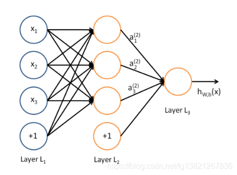

# encoder&decoder

[9.7. 序列到序列学习（seq2seq） — 动手学深度学习 2.0.0 documentation (d2l.ai)](https://zh.d2l.ai/chapter_recurrent-modern/seq2seq.html)

核心逻辑：将现实问题转化为数学问题，通过求解数学问题来得到现实世界的解决方案。

遵循编码器－解码器架构的设计原则， 循环神经网络**编码器使用长度可变的序列作为输入**， 将其**转换为固定形状的隐状态**。 换言之，输入序列的信息被*编码*到循环神经网络编码器的**隐状态**中。 为了连续生成输出序列的词元， 独立的循环神经网络解码器是**基于输入序列的编码信息 和输出序列已经看见的或者生成的词元**来预测下一个词元。下图演示了 如何在机器翻译中使用两个循环神经网络进行序列到序列学习（解码器只使用了编码器的最后一个隐状态，这只是一个示例）。


**Encoder （编码器）**：“将现实问题转化为数学问题”。

- 编码器的作用是**接收输入序列，并将其转换成固定长度的上下文向量**（context vector）。这个向量是输入序列的一种内部表示，捕获了输入信息的关键特征。在自然语言处理的应用中，输入序列通常是一系列词语或字符。
- 编码器可以是任何类型的深度学习模型，但循环神经网络（RNN）及其变体，如长短期记忆网络（LSTM）和门控循环单元（GRU），因其在处理序列数据方面的优势而被广泛使用。

**Decoder （解码器）**：“求解数学问题，并转化为现实世界的解决方案”

- 解码器的目标是**将编码器产生的上下文向量转换为输出序列**。在开始解码过程时，它首先接收到编码器生成的上下文向量，然后基于这个向量生成输出序列的第一个元素。接下来，它将自己之前的输出作为下一步的输入以及上下文向量，逐步生成整个输出序列。
- 解码器也可以是各种类型的深度学习模型，但通常**与编码器使用相同类型的模型**以保持一致性。

**训练过程**：在训练Encoder-Decoder模型时，目标是最小化模型预测的输出序列与实际输出序列之间的差异。这通常通过计算损失函数（如[交叉熵](https://zhida.zhihu.com/search?q=交叉熵&zhida_source=entity&is_preview=1)损失）来实现，并使用反向传播和梯度下降等优化算法进行参数更新。

- 此外，为了改善性能，特别是在处理长序列时，[注意力机制](https://zhida.zhihu.com/search?q=注意力机制&zhida_source=entity&is_preview=1)被引入。注意力允许解码器在生成每个词时“关注”输入序列的不同部分。具体来说，它通过计算解码器当前状态和编码器每个时间步状态的相似度，为编码器的每个输出分配一个权重，然后生成一个加权组合，这个加权组合被用作附加的上下文信息输入到解码器，帮助生成更准确的输出。

常见应用：机器翻译，文本摘要，聊天与问答系统，

下面的例子是一个机器翻译的例子。

**训练过程**如下：图中的源就源语言的训练集，目标是目标语言的训练集。解码器会将编码器的 输出与自身的输入拼接起来传入解码器。


在循环神经网络解码器的初始化时间步，有两个特定的设计决定： 首先，特定的“<bos>”表示序列开始词元，它是解码器的输入序列的第一个词元。 其次，使用循环神经网络编码器最终的隐状态来初始化解码器的隐状态。 

具体来说，如下图，解码器的第一个输出由编码器的输出，<bos>表示开始的token，以及初始化的隐状态计算得到。

第n个输出出由编码器的输出，第n个输入的目标语言的token，以及第 n-1 个隐状态计算得到。


**预测过程**如下：为了采用一个接着一个词元的方式预测输出序列， 每个解码器当前时间步的输入都将来自于前一时间步的预测词元。 与训练类似，序列开始词元（“<bos>”） 在初始时间步被输入到解码器中。 该预测过程如 [图9.7.3](https://zh.d2l.ai/chapter_recurrent-modern/seq2seq.html#fig-seq2seq-predict)所示， 当输出序列的预测遇到序列结束词元（“<eos>”）时，预测就结束了。


### seq2seq

机器翻译是序列转换模型的一个核心问题， 其输入和输出都是长度可变的序列。 为了处理这种类型的输入和输出， 我们可以设计一个包含两个主要组件的架构： 第一个组件是一个*编码器*（encoder）： 它接受一个长度可变的序列作为输入， 并将其转换为具有固定形状的编码状态。 第二个组件是*解码器*（decoder）： 它将固定形状的编码状态映射到长度可变的序列。 这被称为*编码器-解码器*（encoder-decoder）架构， 如图


遵循编码器－解码器架构的设计原则， **循环神经网络编码器使用长度可变的序列作为输入， 将其转换为固定形状的隐状态**。 换言之，输入序列的信息被*编码* 到循环神经网络编码器的隐状态中。 为了连续生成输出序列的词元， 独立的**循环神经网络解码器是基于输入序列的编码信息 和输出序列已经看见的或者生成的词元**来预测下一个词元。

下图演示了 如何**在机器翻译中使用两个循环神经网络进行序列到序列学习**。这是**训练的过程**


特定的“<bos>”表示序列开始词元，“<eos>”表示序列结束词元。 最后一个时刻所有层的隐变量作为上下文

- 从技术上讲，编码器将长度可变的输入序列转换成通过编码器变成**形状固定的上下文变量**c， 并且将输入序列的信息在该上下文变量中进行编码。

下图是训练完成后，用于预测的过程：


从预测过程可以看到，在解码器的输入是编码器最后一个时间步的输出，以及上一个解码器的输出（拼接起来）。并且，解码器的输入并没有固定长度，而是一直预测到输出 <eos> 为止。

通常做预测时，会使用填充和截断将输入源局长限制在固定的长度，


``` 
原始文本 		词表 vocab (token:index)				embedding

this   	 tokenizer	this: 0		 word2vec		[ 0.8147,  0.6233, -0.8745]
is	  	==========> is: 1		==========> 	[ 1.4187, -1.6234,  0.3779]
namespace.			name: 2						[ 0.5483,  0.2194, -0.6123]
					space: 3					[-1.8765,  1.1769, -0.5206]
					.: 4						[ 0.8559, -1.0804, -0.8394]
					[eos]: 5					[ 0.4355, -0.2552, -0.0063]
```


### 自编码器（Auto-encoders）

自编码器（Auto-encoders）和Encoder-Decoder模型是深度学习中两种重要的网络架构，它们在许多应用中扮演着关键角色，尤其是在自然语言处理（NLP）、计算机视觉（CV）和语音处理领域。尽管它们在某些方面具有相似性，但也有明显的区别和不同的应用焦点。以下是自编码器和Encoder-Decoder模型的主要区别和联系：

**区别**：

- **学习模式**：自编码器是无监督学习模型，而Encoder-Decoder模型通常用于监督学习任务。
- **应用焦点**：自编码器主要用于**学习数据的紧凑表示，如降维和去噪**；Encoder-Decoder模型专注于将一种形式的序列转换为另一种形式的序列，如语言翻译或语音识别。
- **输出目标**：**自编码器的输出旨在尽可能接近输入**，而Encoder-Decoder模型的输出是一个完全不同的序列，可能与输入在结构和内容上都有很大差异。

**联系**：

- **共享的架构理念**：两者都采用了编码器-解码器的架构理念，其中编码器负责提取输入数据的特征，解码器负责根据这些特征执行特定任务。
- **潜在表示**：两种模型都涉及到将输入数据编码到一个潜在空间的表示，这个表示对于后续的重构或转换至关重要。

# transformer

### 注意力机制

> 目前大多数注意力模型附着在Encoder-Decoder框架下，当然，其实注意力模型可以看作一种通用的思想，本身并不依赖于特定框架

核心目标：**从众多信息中选择出当前任务目标更关键的信息**，把注意力放在这上面（简单理解为找到每个信息的权重）。其中选择的过程，体现在权重系数的计算上。

 **关系**

- **查询和键的关系**: 查询和键通过某种相似度计算（如点积或加性注意力）来生成注意力分数。这些分数表示查询对每个键的重要性。
- **键和值的关系**: 键和值是一一对应的。每个键都有一个相应的值，这些值将在注意力分数的基础上进行加权求和。
- **查询、键和值的综合**: **查询与键计算出的注意力分数用于对值进行加权求和**，生成上下文向量

例如一个机器翻译的例子：“tom chase jerry”  -> “汤姆追逐杰瑞”，普通的encoder-decoder 模型如下：

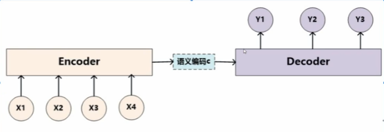

显然，其中， y1是 “汤姆“，x1是“tom”，因为预测y1汤姆时，我们希望**在语义编码c 更加关注x1的内容**。 

没有引入注意力的模型在输入句子比较短的时候问题不大，但是如果输入句子比较长，此时所有语义完全通过一个中间语义向量来表示，单词自身的信息已经消失，可想而知会丢失很多细节信息

而引入了注意力机制的模型如下：

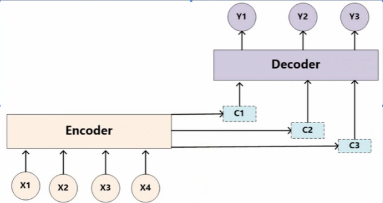

由上图可知，在生成每个单词时，原先都是相同的中间语义c 会被替换成根据生成单词而不断变化的 ci。

其中的c1在翻译y1是会告诉 decoder 更加关注哪个 x。如下：

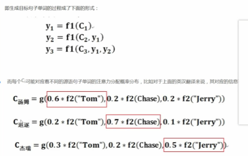

### 注意力分数函数

一个简单的例子，有很多（输入: 输出）对，再给一个数据，求它对应的输出。此处（输入: 输出）对就是(key: value) 对，再给定一个查询 query，求其输出。

[10.3. 注意力评分函数 — 动手学深度学习 2.0.0 documentation (d2l.ai)](https://zh.d2l.ai/chapter_attention-mechanisms/attention-scoring-functions.html)

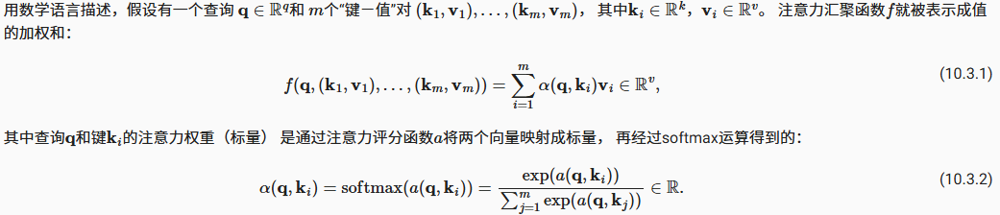

**关键在于这里的注意力分数函数a 该怎么设计**。

简单做法是，对每个 q 和 k ，直接设计相应大小的矩阵和向量，最后矩阵乘法得到单个标量。其实就是单隐藏层的回归。名叫 **Additive Attention**。该方法不限制k,q,v 的大小长度。它是可以学习参数的。

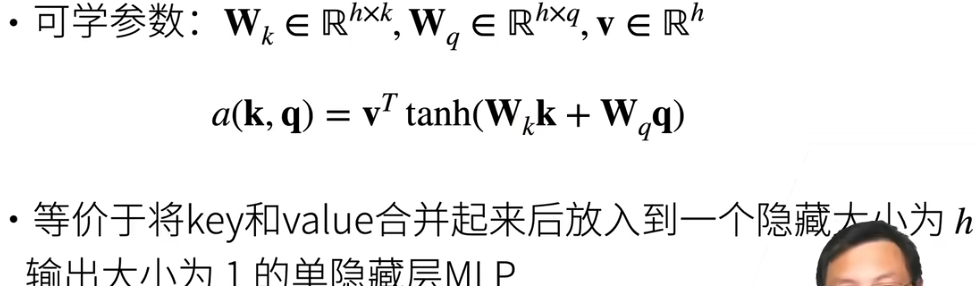

另一个方法叫**缩放点积注意力**。如果 k,q 的长度都是一样的，都是d，那么就不学东西了。 

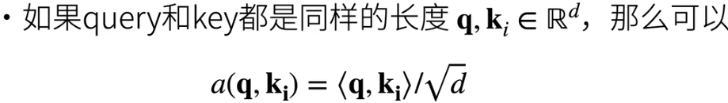

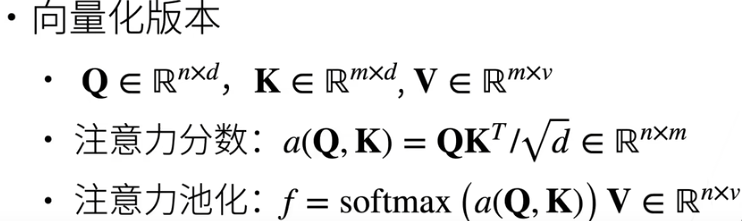

除以根号d使得对参数的长度不敏感了。

**最终得到的结果f 的第 i 行数据表示，第 i个查询向量 qi 对应的注意力分数，该向量是通过对所有键向量 kj 的值向量 vj 进行加权求和得到的。**  （注意力分数可以简单直观理解为该查询qi 与哪个value 最相近）

**总结**：

- **注意力分数就是q 和 k 的相似度**，注意力权重是分数的 softmax 结果
- 以上都是 attention 的思路，实际应用时，k，q，v都会根据实际网络进行设置。

### 使用注意力机制的seq2seq

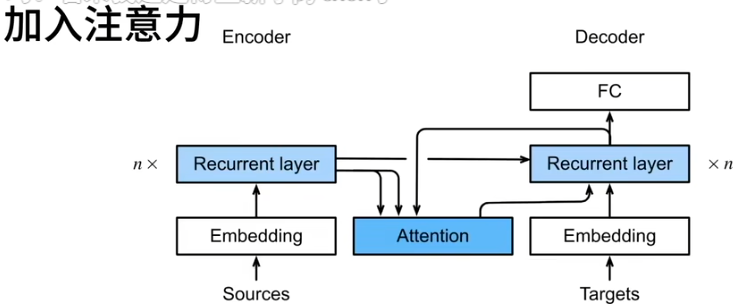

普通 seq2seq中，由编码器的最后一个时刻的隐藏层状态作为上下文变量context 输入给解码器。现在认为这样不好，而应该**根据当前要预测的词，选择其对应的输入的词的隐藏层作为上下文**。

因此，此处加入注意力机制，

- **将编码器对每个词的输出作为key 和 value**
- **将解码器对上一个词的输出作为query**
- **注意力的输出和当前词的embedding 合并作为解码器rnn 的输入**

相当于，以前seq2seq 只使用了编码器最后一个词的隐藏层，现在要把编码器的所有隐藏层都使用起来。简单来讲，**用编码器建立索引，使用解码器来定位关注点**

### Bahdanau 注意力

**加入注意力的seq2seq** 叫做 **Bahdanau 注意力**，它和普通seq2seq不同只在decoder上，在decoder中加入了一个 additive attention，并且解码器的计算要一步一步来，因为每一步都要使用上一步的隐藏层计算注意力权重。

``` python
class Seq2SeqAttentionDecoder(AttentionDecoder):
    def __init__(self, vocab_size, embed_size, num_hiddens, num_layers,
                 dropout=0, **kwargs):
        super(Seq2SeqAttentionDecoder, self).__init__(**kwargs)
        self.attention = d2l.AdditiveAttention(
            num_hiddens, num_hiddens, num_hiddens, dropout)
        self.embedding = nn.Embedding(vocab_size, embed_size)
        self.rnn = nn.GRU(
            embed_size + num_hiddens, num_hiddens, num_layers,
            dropout=dropout)
        self.dense = nn.Linear(num_hiddens, vocab_size)

    def init_state(self, enc_outputs, enc_valid_lens, *args):
        # outputs的形状为(batch_size，num_steps，num_hiddens).
        # hidden_state的形状为(num_layers，batch_size，num_hiddens)
        outputs, hidden_state = enc_outputs
        return (outputs.permute(1, 0, 2), hidden_state, enc_valid_lens)

    def forward(self, X, state):
        # enc_outputs的形状为(batch_size,num_steps,num_hiddens).
        # hidden_state的形状为(num_layers,batch_size,
        # num_hiddens)
        enc_outputs, hidden_state, enc_valid_lens = state
        # 输出X的形状为(num_steps,batch_size,embed_size)
        X = self.embedding(X).permute(1, 0, 2)
        outputs, self._attention_weights = [], []
        for x in X:
            # query的形状为(batch_size,1,num_hiddens), 第一步使用编码器最后一个隐藏状态，之后就是用前一个解码器输出的隐藏状态
            query = torch.unsqueeze(hidden_state[-1], dim=1)
            # context的形状为(batch_size,1,num_hiddens)，此处context不只使用编码器的隐藏状态，而是通过注意力算出来的。
            context = self.attention(
                query, enc_outputs, enc_outputs, enc_valid_lens)
            # 在特征维度上连结
            x = torch.cat((context, torch.unsqueeze(x, dim=1)), dim=-1)
            # 将x变形为(1,batch_size,embed_size+num_hiddens)
            out, hidden_state = self.rnn(x.permute(1, 0, 2), hidden_state)
            outputs.append(out)
            self._attention_weights.append(self.attention.attention_weights)
        # 全连接层变换后，outputs的形状为
        # (num_steps,batch_size,vocab_size)
        outputs = self.dense(torch.cat(outputs, dim=0))
        return outputs.permute(1, 0, 2), [enc_outputs, hidden_state,
                                          enc_valid_lens]

    @property
    def attention_weights(self):
        return self._attention_weights
```

这种算法中，在seq2seq中加入注意力机制，可以更加有效地利用encoder的信息。

### 多头注意力

[深入理解深度学习——注意力机制（Attention Mechanism）：多头注意力（Multi-head Attention）_multi-head attention的作用-CSDN博客](https://machinelearning.blog.csdn.net/article/details/131135381?spm=1001.2014.3001.5502)

在实践中，当给定相同的查询、键和值的集合时，我们希望模型可以**基于相同的注意力机制学习到不同的行为**， 然后将**不同的行为作为知识组合起来**， 捕获序列内各种范围的依赖关系 （例如，短距离依赖和长距离依赖关系）。因此，允许注意力机制组合使用查询、键和值的不同子空间表示（Representation Subspaces）可能是有益的。

即：使用多个注意力矩阵，而非单一的注意力矩阵，可以提高注意力矩阵的准确性。


由图可知，**针对同一组key, query, value，使用多个注意力层来计算不同的注意力权重**，最后，将这个注意力汇聚的输出拼接在一起， 并且通过另一个可以学习的线性投影进行变换， 以产生最终输出。 **这种设计被称为多头注意力（Multihead Attention）。**对于个注意力汇聚输出，每一个注意力汇聚都被称作一个头（Head）。

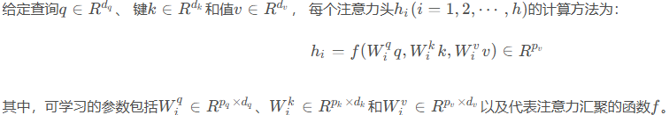

**其中 *f* 可以是的加性注意力和缩放点积注意力**（tranformer中使用自注意力机制，故会使用缩放点积注意力）。多头注意力的输出需要经过另一个线性转换， 它对应着h 个头连结后的结果

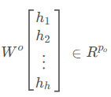

基于这种设计，每个头都可能会关注输入的不同部分， 可以表示比简单加权平均值更复杂的函数。

### 自注意力

[深入理解深度学习——注意力机制（Attention Mechanism）：自注意力（Self-attention）_self-attention mechanism-CSDN博客](https://blog.csdn.net/hy592070616/article/details/131135690)

> “是否包含自主性提示（查询query）”将注意力机制与全连接层或汇聚层区别开来。

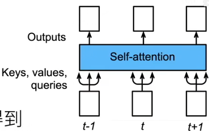

`query` 和 `key-value pair` 通常是不同的。而**对于「自注意力」来说，`query` 和 `key` 和 `value` 都是相同的**。也就是说，同一组词元同时充当「查询（`query`）」、「键（`key`）」和「值（`value`）」。（自注意力的关键就是一句话，**查询、键和值都来自同一组输入**） 

self-attention 可以当作一个像全连接，cnn，rnn那样的网络层来理解。

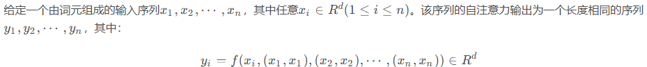

**计算**

在自注意力中，**Q, K , V 都是使用输入X 计算得到的**。如 输入矩阵 X 分别乘以 Wq, Wk, Wv得到Q, K , V 。

然后将 Q, K , V 使用缩放点积注意力方法计算出每个词的特征值, 它就表示了每个词与句子中所有词的相关程度.它的计算公式如下：

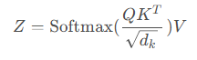

**位置编码**

与CNN, RNN 不同，自注意力中没有记录序列的位置信息，因此**需要我们手动将位置信息注入到输入中**。

如果没有位置编码，那么打乱每个输入Xi 的位置，输出的位置会相应变化，但是输出的内容没有变化。

例如，长度为 n (这个维度上才要求有位置信息)，每个元素有 d 维的序列 ***X***，那么生成位置编码矩阵 ***P*** （n\*d），使用  ***X*** +  ***P*** 作为自编码输入

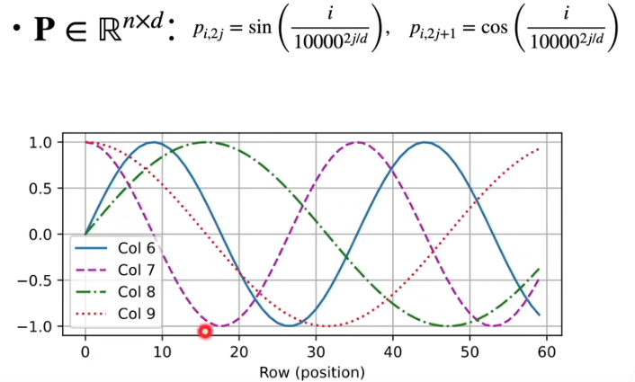

这样的做法相当于给每一个样本，加了一个独一无二的 d 维的偏移。让注意力网络自己去分辨这一点点差别。

**好处在于只改变输入，不需要改变模型。坏处是模型不一定能接收这样的改变**

这种位置信息是一种相对位置，不是绝对位置，这很好。

位置编码也可以学习得到，比如 bert 就是学习的

### 注意力机制和全连接的区别

自注意力机制和全连接模型长得很像，而且简单地看两者都是在找到输出对于每个输入的权重。Attention的最终输出可以看成是一个“在关注部分权重更大的全连接层”。

举个例子：输入层有A,B,C三个特征向量，我们需要构造一层网络来确定三者的权重，然后加权求和得到输出O。

全连接的结果 O = W1A+W2B+W3C ; 参数 W 完全由输入输出计算得到

注意力的结果 O = f(A) A+f(B) B+f(C) C ; **这里的函数 f 的计算会考虑各个输入之间的关系**

可以看出，最终整合信息时加权求和的形式没有变，然而事实上**注意力机制的意义是引入了权重函数f，使得权重与输入相关，从而避免了全连接层中权重固定的问题。**

### transformer

Transformer 模型**基于编码器-解码器的架构**，是**完全基于自注意力机制**，没有任何卷积层或循环神经网络，不是seq2seq那一套，它将seq2seq中的rnn 都**换成了self-attention，同时decoder还会通过注意力机制使用encoder 的信息**。

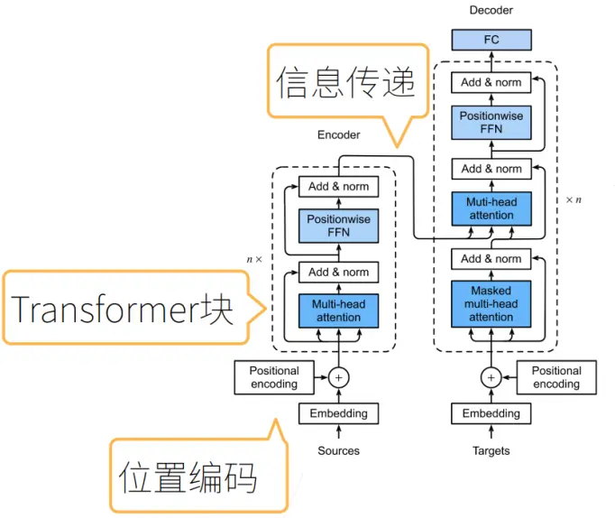

其中可学习的参数就是**全连接层，以及注意力机制中将输入X 转为Q,K,V 的权重**。使用的注意力分数函数为缩放点积函数

**编码器**

- 因为我们希望针对输入可以专注更多的维度（角度）的信息，因此，**这里的 transformer 块是由n 个self-attention连结而成的**（这里很像 CNN 中使用多个卷积核可以输出多个通道一样）。即 **多头注意力机制**。Transformer 块中的多头注意力实际上就是自注意力（自注意力同时具有并行计算和最短的最大路径长度这两个优势）

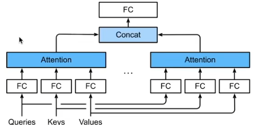

- 在计算编码器的自注意力时，key 、value 和 query 的值都来自**前一个编码器层的输出**

**Positivewise FFN**：基于位置的前馈网络，是全连接层。使用它的意义如下:

- 输入到此FFN 的数据形状为（bs, n, d），n是序列的长度，d是数据的维度。其中n  是会变的，它与模型无关，模型应该是可以处理任意长度的输入的，不能将n 作为一个特征。

- 同时 linear 函数只能接收 input_embed, 和output_embed这两个参数，所以需要切换到二维的形式去输入。

- 又因为 d 是数据的维度，需要维护它的一致性，所以把bs 和 n 合并到一起。

- 使用2个FC，输出的时候再把(bn,d)变回(b,n,d)

**Add & norm**

- 其中 add 就是一个 resnet，可以让网络加深，如下图

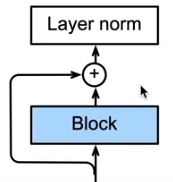

- norm 包括批量归一化和层归一化

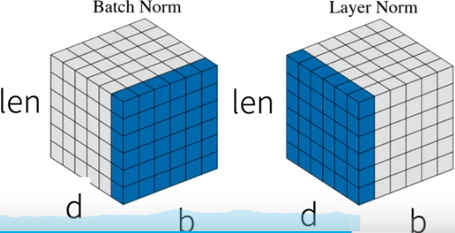

- 批量归一化对**每个特征/通道**进行归一化（不适合序列长度会变的 NLP 应用）
- 层归一化对**每个样本**进行归一化

**信息传递**

- 编码器的输出y1,y2, ... yn ，**将其作为解码器中间的多头注意力的key 和 value，而其 query 来自目标序列**，即掩码多头注意力的输出 

**解码器**

- 解码器是由 n 个块组成的，每个块里包含了三个子层：解码器自注意力、“编码器-解码器”注意力和基于位置的前馈网络。这些子层也都被残差连接和紧随的层规范化围绕。

- 我们看到解码器中使用的是**有掩码的多头注意力**。因为self-attention 是可以一次看到一组数据的所有信息的。而在**解码器输出一个元素时，不应该考虑该元素之后的元素**（在预测阶段根本就没有之后元素）。因此使用掩码来实现。 
- 同时，**解码器每一步只能有一个输出**，因此在预测时，**解码器上一步的输出还要传递给下一步的解码器作为输入**。(跟seq2seq 的预测过程很像)。
- 在解码器中，每个block 都是把 X 和 state 放进去更新一遍取出来再作为 X 和 state 放到下一层的block 中。
- 解码器最终的输出形状为（b，n，target_vocab_size）

**训练**

- 训练中，对于解码器，target 句子序列形状 （b, n ,d），会直接全部传递进解码器，但第 i 步使用时掩码，只会使用前 i 个元素进行训练（在n 这个维度）。

**预测**

- 预测第 t+1 个输出时，自注意力中，使用**前 t 个预测值作为 key和 value**（在训练时也要通过掩码只使用前t 个值训练），**第 t 个预测值作为query**，如下图

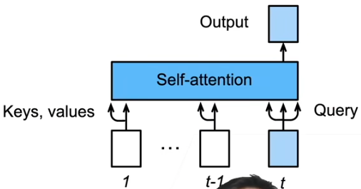

- 需要注意的是，虽然**解码器在每一步中只预测一个词，但整个解码过程是并行的**（在批处理级别上），即可以同时处理多个序列的生成。然而，**在每个序列内部，词的生成是逐步和顺序的**。
- 可以知道每一步解码器的输入和输出，其序列长度都是1，因为都是用前一个词预测后一次词。

**FC**

- 最后的最后会有一层全连接层，将之前的隐藏层状态映射到目标词汇表的每个词的概率。具体来说，如果输入到全连接层的张量形状为（s，d），其中s是序列长度，d是隐藏状态的维度，**那么全连接层的输出形状将是一个（s，V）的二维张量，其中V是目标词汇表的大小。这个输出张量中的每个元素都代表了序列中对应位置生成目标词汇表中每个词汇的概率。**

**超参数**

transformer 中的超参数如下：

- **每个注意力层，key, query, value的大小（即将X 转换为它们的 Wq ， Wk，Wv）。**
- **FNN 层的隐藏层大小**
- **多头注意力的头数，即用多少个通道开使用注意力去获取数据之间的特征**
- **块的数量，加深层数的关键**


# 大模型训练

### token

**Token**： 是最小单位的“词元”，或者说单词的“片段”，就是不可再拆分的最小语义单位，比如 “waterfall”，会被拆成2个 token：water、fall。另外，标点符号也会被定义为 token，因为标点符号也影响了对全文的语义理解。比如“I don‘t know.”可以分解为5个Token，分别是：“ I ”、“don”、“ ‘t” 、“know”、“.”。

比如下图中这句话“This is a input text.” 首先被 Tokenizer 转化成最小词元，其中[CLS]，[SEP]为一句话的起始与结束符号（CLS：classification 告知系统这是句子级别的分类的开始、SEP：separator 告知系统结束本句或分割下一句），然后在具体使用时还需要将token 转换成向量，最简单的转换方法就是 one-hot 编码。如下图是通过 Embedding 的方式转化为向量。

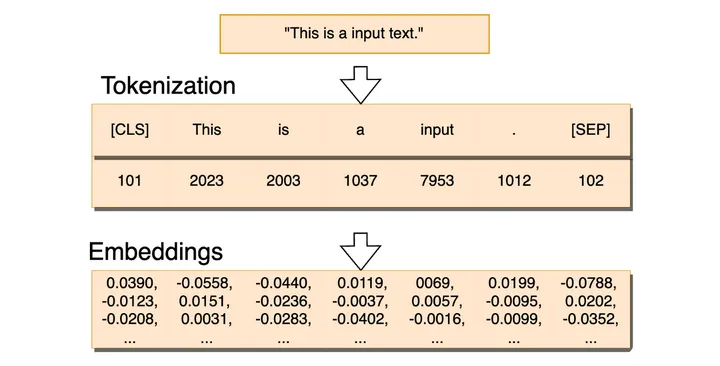

### tokenizer

[编码实践 | 一文读懂Tokenizer | 以Word-based 和 Byte Pair Encoding为例 | YuyaoGe's Website (geyuyao.com)](https://geyuyao.com/post/tokenizer/)

[NLP BERT GPT等模型中 tokenizer 类别说明详解-腾讯云开发者社区-腾讯云 (tencent.com)](https://cloud.tencent.com/developer/article/1865689)

**分词器 (Tokenizer)** 是自然语言处理领域中一种关键的工具，其作用在于**将文本字符串划分为词元也就是token**。

> tokenize有三种粒度：**word/subword/char**
>
> - **word词**，是最自然的语言单元。对于英文等自然语言来说，存在着天然的分隔符，比如说空格，或者是一些标点符号，对词的切分相对容易。但是对于一些东亚文字包括中文来说，就需要某种分词算法才行。顺便说一下，Tokenizers库中，基于规则切分部分，采用了spaCy和Moses两个库。如果基于词来做词汇表，由于长尾现象的存在，这个词汇表可能会超大。像Transformer XL库就用到了一个26.7万个单词的词汇表。这需要极大的embedding matrix才能存得下。embedding matrix是用于查找取用token的embedding vector的。这对于内存或者显存都是极大的挑战。常规的词汇表，一般大小不超过5万。
> - **char/字符,** 也就是说，我们的词汇表里只有最基本的字符。而一般来讲，字符的数量是少量有限的。这样做的问题是，由于字符数量太小，我们在为每个字符学习嵌入向量的时候，每个向量就容纳了太多的语义在内，学习起来非常困难。
> - **subword子词级**，它介于字符和单词之间。比如说Transformers可能会被分成Transform和ers两个部分。**这个方案平衡了词汇量和语义独立性，是相对较优的方案**。它的处理原则是，**常用词应该保持原状，生僻词应该拆分成子词以共享token压缩空间**。

- 最简单和直观的分词方法——Word-based Tokenizer

为每个单词都映射一个 ID，从 0 开始一直到词汇表的大小。该模型使用这些 ID 来识别每个单词。比如对文本 “it is raining. it sucks. ”，其生成词表可以是[‘<unk>’:0, ‘it’:1, ‘is’:2 ...]。 unk代表位置的词。出现次数越多在此表中的位置就越靠前，比如it 的位置就靠前。

其缺点在于**词汇表极其庞大**、**难以处理形态变化灵活的单词**、**词汇表覆盖范围有限，无法处理未登录词**

- **更精细的分词方法——Byte Pair Encoding (BPE)**

在英文单词中，存在大量复用的字母组合。以 “happy” 为例，以 “happy” 为词根的单词有很多，如 “happily”  、  “happiness” 、 “unhappy"等。我们注意到，这些衍生词可以拆分成字母组合并复用，如"happ"这一字母组合在三个单词中都有出现。此外， “ily”、“un” 字母组合在其他英语单词中高频出现，它们和其他单词的组合也可以用于表示新的单词。

自然而然的，我们想到，是否可以基于这种 “**找高频出现的字母组合**” 的方法设计出一种分词器，从而通过复用各种字母组合来覆盖所有英文单词呢？

事实上，这种方法就是**字节对编码(Byte Pair Encoding, BPE)**。

[NLP BERT GPT等模型中 tokenizer 类别说明详解-腾讯云开发者社区-腾讯云 (tencent.com)](https://cloud.tencent.com/developer/article/1865689)

BPE过程的概述：

- 预训练开始时，BPE 将文本分解为最小的单元（通常是字符），并统计语料库中所有字符的出现频率。开始时，每个单词由这些字符序列组成。
- 算法会在整个文本语料库中统计相邻字符或子词对的频率。每一次迭代中，找到在语料库中**出现次数最多**的相邻字符或子词对。例如，如果在整个语料库中出现最多的是 `t` 和 `h` 的组合，则 `t h` 就会成为第一个合并规则。
- 将**找到的最频繁的子词对合并为一个新的子词，并记录这个合并规则（即合并的两个字符或子词对）**。然后这个新子词会替代文本中的所有相应字符组合。合并规则被添加到一个文件如 `merges.txt` 文件中，且合并是按顺序进行的，最常见的对排在最前。
- 继续重复步骤 2 和 3，直到**达到预设的合并次数**（通常是预先确定的词汇表大小）。最终，通过这些合并步骤，形成了包含频率最高的子词组合的词汇表。
- 完成合并之后，**将合并结果与每个子词分配一个唯一的 ID**，**这些子词就组成了最终的 `vocab.json` 文件**。


总结来讲，BPE的训练是在**寻找训练集中高频出现的token组合**；根据规则，在单一词或字符的基础词汇表的基础上，把高频的多元语法词组合依次加入到词汇表当中（有最低出现频率限制），直到词汇表达到预定大小停止。**最终词汇表的大小 = 基础字符词汇表大小 + 合并串的数量**。比如像GPT，它的词汇表大小 40478 = 478(基础字符) + 40000（merges）。

### word embedding 词表编码

对训练文本使用tokenizer 把文字划分为token 之后，就要对token 进行编码

每个词元都表示为一个数字索引， 将这些索引直接输入神经网络可能会使学习变得困难。 因此在将词汇表中的 ID 输入到模型之前，这些 ID 会通过嵌入层（`Embedding Layer`）**编码为密集的向量表示**（最简单的表示称为*独热编码*（one-hot encoding）。）

这个嵌入层是一种查找表（look-up table），每个词汇 ID 对应一个固定长度的向量。

**嵌入层的工作原理**:

- 假设词汇表大小为 `V`，嵌入维度为 `D`。嵌入层的权重矩阵大小为 `[V, D]`。（嵌入维度是模型设计时预先设定的一个**超参数**，需要根据任务的复杂度、计算资源和对模型性能的需求来调整。）
- 当一个 ID 作为输入时，嵌入层会返回这个 ID 对应的行向量。**这些行向量是模型在训练过程中学习到的**，表示每个单词或子词的语义信息。
- 例如，如果 ID `262` 映射到一个向量 `[0.1, 0.5, -0.3]`，那么这个向量会作为输入送到模型的后续层，同时，这个编码也会在后续的训练中不断更新修改。

### BERT

BERT，全称Bidirectional Encoder Representation of Transformer，首次提出于《BERT: Pre-training of Deep Bidirectional Transformers for Language Understanding》一文中。简单来说，**BERT是只使用了Transformer的encoder(即编码器)部分**，因此也可以认为BERT就是Transformer的encoder部分。**BERT既可以认为是一个生成Word Embedding的方法，也可以认为是像LSTM这样用于特征提取的模型结构**。

**BERT 的动机**

- 基于微调的 NLP 模型，**它想做的是一个预训练模型**
- 预训练的模型抽取了**足够多的信息或特征**
- **新的任务只需要增加一个简单的输出层**

预训练的模型已经足够好，能够捕获足够多的语义信息。当要做一个新的任务的时候，我们只需要增加一个 简单的输出层即可。

**bert 对输入的修改**

- 每个样本都是一个句子对，把原句子和目标句子拼起来
- 加入了额外的 segment embedding，用来区分前一个句子和后一个句子
- 位置编码可学习

**bert 做了两个预训练任务**

1. 带掩码的语言模型（做完形填空）

- transformer编码器是双向的，而标准语言模型要求单向
- bert 预训练为一个带掩码的语言模型 ，让它去做完形填空，这样可以去看下双向的信息 

2. 下一句的预测

- 预测下一个句子中的两个句子是否相邻

相当于一个主干（用来获得特征），两个头

**微调 BERT**

BERT 输出的输入数据的特征，不同任务可以使用不同的特征。

需要注意的是**微调时使用的词表必须是训练bert 模型的词表**。

不同的任务示例：

- 句子分类

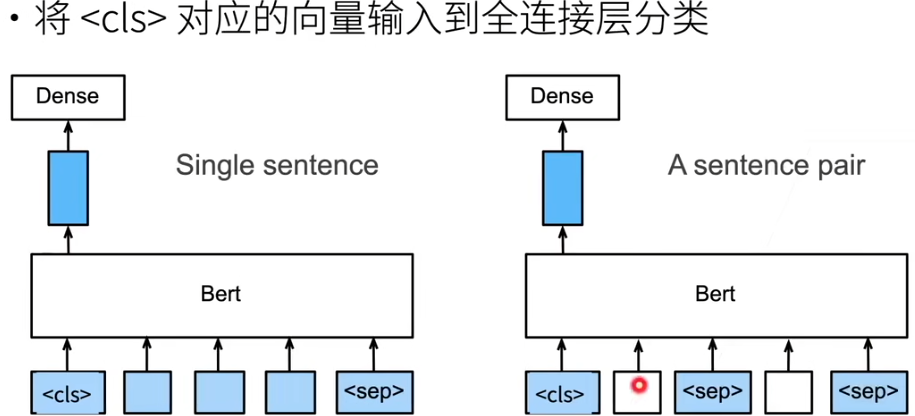

- 命名实体识别，不使用特殊字符


- 问题回答，输入句子对。第一个句子是问题，第二个句子是描述。在描述中预测每一个词，看它是不是问题的答案的开始或结束

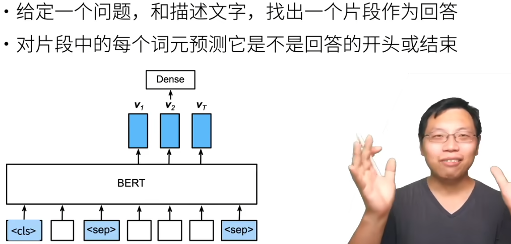

### GPT

GPT（Generative Pre Training，生成式预训练）模型**建立在Transformer解码器的基础上，预训练了一个用于表示文本序列的语言模型**。当将GPT应用于下游任务时，语言模型的输出将被送到一个附加的线性输出层，以预测任务的标签。

###  分布式训练

在分布式训练环境下，通常会使用多个节点来协同工作，以加速训练过程。这些节点通常分为两类：**Master 节点**和**Worker 节点**。每种节点在分布式训练中扮演着不同的角色和职责。

- **Master 节点负责调度训练任务**，确保任务在各个 Worker 节点之间均衡分布。Master 节点可以**充当参数服务器**（Parameter Server），负责存储和更新全局模型参数。
- **Worker 节点负责具体的模型训练任务**，包括前向传播、反向传播和梯度计算。将计算得到的梯度信息上传到 Master 节点或参数服务器。定期向 Master 节点报告自身的状态，包括任务进度、资源使用情况等。

###  并行策略和方法

- **数据并行**：数据并行模式会在**每个worker之上复制一份模型**，这样每个worker都有一个完整模型的副本。**输入数据集是分片的**，一个训练的小批量数据将在多个worker之间分割；worker定期汇总它们的梯度，以确保所有worker看到一个一致的权重版本。对于无法放进单个worker的大型模型，人们可以在模型之中较小的分片上使用数据并行。

- **模型并行**：模型并行模式会让**一个模型的内存和计算分布在多个worker之间**，以此来解决一个模型在一张卡上无法容纳的问题，其解决方法是把模型放到多个设备之上。模型并行分为两种：流水线并行和张量并行，就是把模型切分的方式。
- - **流水线并行**：（pipeline model parallel， **PP**）是把模型不同的层放到不同设备之上，比如前面几层放到一个设备之上，中间几层放到另外一个设备上，最后几层放到第三个设备之上。

- - **张量并行**：（tensor model parallel， **TP**）则是层内分割，把某一个层做切分，放置到不同设备之上，也可以理解为把矩阵运算分配到不同的设备之上，比如把某个矩阵乘法切分成为多个矩阵乘法放到不同设备之上。

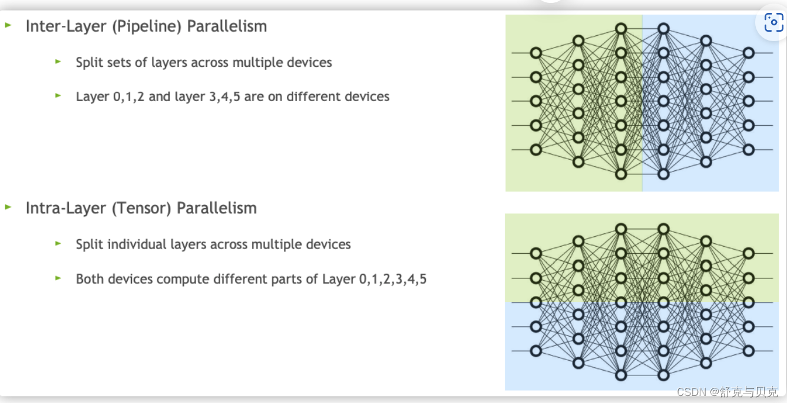

### megatron 和 DeepSpeed

Megatron 和 DeepSpeed 通常被结合使用，以充分发挥各自的优势：

- **Megatron** 提供**模型并行**性来处理超大规模模型的训练。
- **DeepSpeed** 则通过**数据并行、内存优化和高效通信**等技术，提升训练过程的整体性能。

**Megatron**在训练拥有万亿参数的大型模型时，采用了PTD-P（Pipeline, Tensor, and Data Parallelism）方法，从而实现了高度聚合的吞吐量（502 petaFLOP/s）。

**DeepSpeed**是一个由微软开发的分布式训练工具，它通过ZeRO技术优化内存占用，支持更大规模的模型训练。ZeRO通过分片模型参数、优化器状态和梯度来减少显存需求。DeepSpeed的核心就在于，**GPU显存不够，CPU内存来凑**。具体点说，DeepSpeed将当前时刻，训练模型用不到的参数，缓存到CPU中，等到要用到了，再从CPU挪到GPU。这里的“参数”，不仅指的是模型参数，还指optimizer、梯度等。

### ModelLink

ModelLink旨在为华为 [昇腾芯片](https://gitee.com/link?target=https%3A%2F%2Fwww.hiascend.com%2F) 上提供端到端的大语言模型训练框架, 包含模型，算法，以及下游任务。ModelLink 通过模型并行与数据并行来训练大语言模型，

> CANN（Compute Architecture for Neural Networks）是华为针对AI场景推出的异构计算架构

> **MindFormers** 是华为 MindSpore 生态系统中的一个开源库，专注于支持和优化各种大型 AI 模型的预训练和推理，特别是在自然语言处理（NLP）、计算机视觉和多模态任务方面。MindFormers 提供了一套标准化的模型训练和推理工具，使用户能够更便捷地使用大规模 Transformer 类模型（如 GPT、BERT、ViT 等），并在华为 Ascend 硬件加速平台上实现高效的训练和推理。

### 模型转换

#### 为什么需要转

- 当自己用deepspeed或 [mindformer]([MindSpore](https://www.mindspore.cn/mindformers/docs/zh-CN/dev/function/weight_conversion.html))框架训练了模型**，为了在 Hugging Face 生态系统中分享这个模型**

#### deepspeed 和hf

- DeepSpeed 模型通常使用 ".pt"（PyTorch 模型的默认保存后缀）或者 ".pth" 作为模型权重文件的后缀。这是因为 DeepSpeed 是建立在 PyTorch 框架之上的，因此它遵循了 PyTorch 模型保存的命名惯例。

- Hugging Face(hf) 格式的模型通常使用 ".bin" 或者 ".h5" 作为模型权重文件的后缀，这取决于模型是基于 PyTorch 还是 TensorFlow。对于 PyTorch 模型，通常使用 ".bin" 后缀，而对于 TensorFlow 模型，则使用 ".h5" 后缀。

> deepspeed 转hf 是模型保存格式的转变->（.pt）转 (.bin)

#### pt和bin以及 safetensors

- .bin文件是一种二进制文件，**用于保存Pytorch模型的权重信息**，模型的结构信息通常放在与 bin 文件同目录的 `config.json`文件中。**它只包含了模型的参数数值，没有保存模型的结构信息**。因此，当使用.bin文件加载模型时，我们需要已经定义好模型的结构，并与.bin文件中的参数数值相匹配。bin文件的大小较小，加载速度较快，因此在生产环境中使用较多。
- .pt文件是一种推荐的保存Pytorch模型的文件类型，**它包含了模型的权重和结构信息。与.bin文件不同，.pt文件可以完整保存模型的所有信息**，使得我们可以方便地加载整个模型，而无需额外定义模型结构。
- `safetensors`  是由 Hugging Face 推出的一种新型安全模型存储格式，特别关注模型安全性、隐私保护和快速加载。**它仅包含模型的权重参数**，**而不包括执行代码**，这样可以减少模型文件大小，提高加载速度。

### 语言模型

在自然语言处理（Natural Language Processing, NLP）中，语言模型（Language Model, LM）是一种用于**描述自然语言中词语序列概率分布的模型**。

#### **语言模型的基本思想是基于概率论的**

即对于给定的一组词（通常称为词序列或句子），语言模型能够给出这组词以某种特定顺序出现的概率。

假设有一个词序列 *W*=*w*1,*w*2,...,*w**n*，其中 *w**i* 表示序列中的第 *i* 个词，那么语言模型的目标就是计算这个序列的联合概率 *P*(*W*)，即

* P*(*W*)=*P*(*w*1,*w*2,...,*w**n*)

根据概率论中的链式法则，这个联合概率可以分解为一系列条件概率的乘积

- *P*(*W*)=*P*(*w*1)⋅*P*(*w*2∣*w*1)⋅*P*(*w*3∣*w*1,*w*2)⋅...⋅*P*(*wn*∣*w*1,*w*2,...,*wn*−1)

然而，直接计算这样的条件概率在实际中是非常困难的，因为需要估计的参数数量会随着序列长度的增加而指数级增长（即所谓的“维度灾难”）。为了解决这个问题，通常会采用一些简化的假设，比如n元模型（n-gram model）。

在n元模型中，假设一个词出现的概率只与其前面固定数量的n-1个词有关，而与更前面的词无关。例如，在二元模型（bigram）中，有

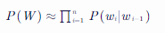

随着深度学习技术的兴起，基于神经网络的语言模型（如循环神经网络RNN、长短时记忆网络LSTM、

Transformer等）逐渐取代了传统的n元模型，成为NLP领域的主流方法。

#### 循环神经网络模型

而循环神经网络模型可以看作上述基于概率论语言模型的变体。而且**循环神经网络天生可以处理时间步长不定的输入数据**，模型定义的时候定义的输入维度只是每个步长时的数据维度

n 元语法模型中，词表V需要存储|V|的n 次方个数字， 因此与其将P(xt∣x_t−1,…,x_t−n+1)模型化， 不如使用隐变量模型：

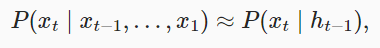

其中 h_t−1是*隐状态*（hidden state）， 它存储了到时间步 t−1的序列信息。 通常，我们可以基于当前输入xt和先前隐状态h_t−1 来计算时间步t处的任何时间的隐状态：

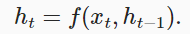

***循环神经网络***（recurrent neural networks，RNNs） 是具有隐状态的神经网络。 隐状态则是在给定步骤所做的任何事情（以技术角度来定义）的*输入*， 并且这些状态只能通过先前时间步的数据来计算。

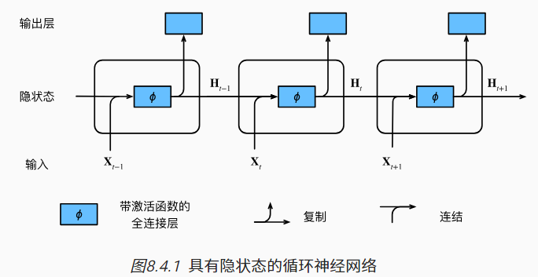

具体地说，当前时间步隐藏变量由当前时间步的输入 与前一个时间步的隐藏变量一起计算得出：

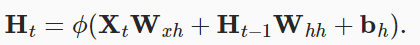

对于时间步t，输出层的输出类似于多层感知机中的计算：

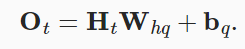

输出层的权重Whq∈Rh×q 和偏置bq∈R1×q。 值得一提的是，即使在不同的时间步，循环神经网络也总是使用这些模型参数。 因此，循环神经网络的参数开销不会随着时间步的增加而增加。

使用 torch 的rnn时，填入的 hidden_size，最终输出的ouput 的单个数据的维度就变成了 hidden_size了。

**rnn的输出为全部输出序列 (bs, num_steps, num_hidden) 和最终层的隐藏状态 (bs, num_layers, num_hidden)** 。

**RNN 的两种变体 GRU 和 LSTM 解决了RNN 长期依赖导致的梯度爆炸问题。**

- LSTM通过引入三个“门”结构（遗忘门、输入门、输出门）来增强RNN的能力

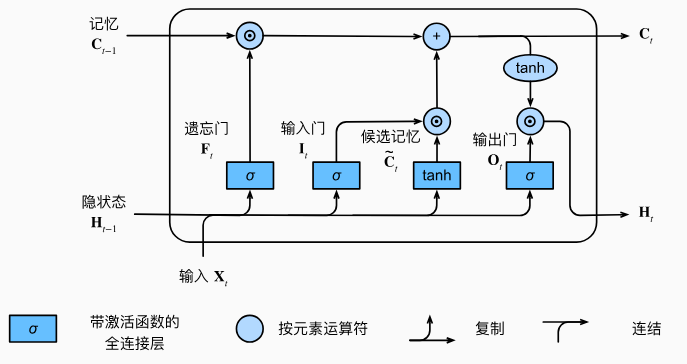

其中：

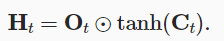

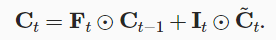

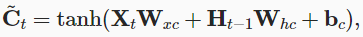

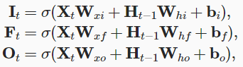

- GRU是LSTM的一个简化版本，它同样旨在解决RNN的长期依赖问题，但具有更少的参数和更简单的结构。GRU将LSTM中的遗忘门和输入门合并为一个更新门（update gate），并引入了一个重置门（reset gate）。

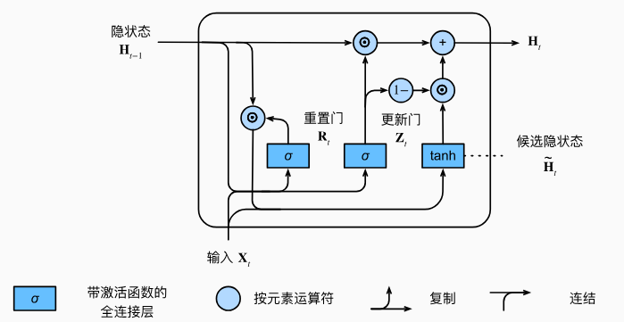

门控循环单元的隐状态更新公式：

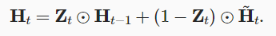

时间步t的*候选隐状态*（candidate hidden state） H~t∈Rn×h。

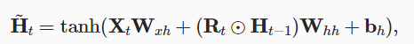

其中：

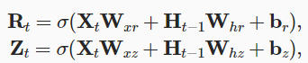


#### 困惑度

我们可以通过计算**序列的似然概率**来度量模型的质量。 

 如果想要压缩文本，我们可以根据当前词元集预测的下一个词元。 一个更好的语言模型应该能让我们更准确地预测下一个词元。 因此，它应该允许我们在压缩序列时花费更少的比特。 所以我们可以通过一个序列中所有的n个词元的交叉熵损失的平均值来衡量：

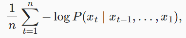

其中P由语言模型给出， xt是在时间步t从该序列中观察到的实际词元。 这使得不同长度的文档的性能具有了可比性。 由于历史原因，自然语言处理的科学家更喜欢使用一个叫做*困惑度*（perplexity）的量。它是上式的指数：

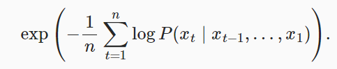

困惑度的最好的理解是“下一个词元的实际选择数的调和平均数”。 下一个词元的选择越少表示选择越精确，即预测效果的真实性越高，我们看看一些案例。

- 在最好的情况下，模型总是完美地估计标签词元的概率为1。 在这种情况下，模型的困惑度为1。
- 在最坏的情况下，模型总是预测标签词元的概率为0。 在这种情况下，困惑度是正无穷大。
- 在基线上，该模型的预测是词表的所有可用词元上的均匀分布。 在这种情况下，困惑度等于词表中唯一词元的数量。 事实上，如果我们在没有任何压缩的情况下存储序列， 这将是我们能做的最好的编码方式。 因此，这种方式提供了一个重要的上限， 而任何实际模型都必须超越这个上限。

### 使用hf-mirror 下载模型

- 安装依赖：首先，我们需要安装`huggingface-cli`命令行工具，可以使用以下命令进行安装：`pip install -U huggingface_hub`。
- 设置镜像endpoint：在下载模型之前，我们需要设置镜像endpoint，可以使用以下命令进行设置：`export HF_ENDPOINT=https://hf-mirror.com`。
- 下载模型：使用huggingface-cli的download命令可以下载模型，例如：`huggingface-cli download --resume-download --local-dir-use-symlinks False bigscience/bloom-560m --local-dir bloom-560m`。

# 微调

SFT微调整体包含以下几个部分：

- **预训练：** 首先需要在一个较大规模的数据集上训练一个神经网络模型，比如针对大语言模型，通常是在大量未标记的文本数据上进行，预训练阶段的目标是使模型获取通用的知识和理解能力。
- **微调：** 结合目标任务，**用新的训练数据集对已经得到的预训练模型进行微调**。在微调过程中，通过反向传播可以对原始模型的全部参数或者部分参数进行优化，使模型在目标任务上取得更好的效果。
- **评估：** 经过微调之后会得到一个新的模型，可以用目标任务的评测数据集对微调模型进行评估，从而得到微调模型在目标任务上的性能指标。

https://www.mindspore.cn/mindformers/docs/zh-CN/dev/usage/sft_tuning.html

# 推理

`vLLM`是伯克利大学LMSYS组织开源的**大语言模型 高速推理框架**，旨在极大地提升实时场景下的语言模型服务的吞吐与内存使用效率。`vLLM`是一个快速且易于使用的库，用于 LLM 推理和服务，可以和HuggingFace 无缝集成。vLLM利用了全新的注意力算法「PagedAttention」，有效地管理注意力键和值。

背景：

- LLM 的推理，最大的瓶颈在于显存。
- 自回归模型的 keys 和 values 通常被称为 KV cache，这些 tensors 会存在 GPU 的显存中，用于生成下一个 token。
- 这些 KV cache 都很大，并且大小是动态变化的，难以预测。已有的系统中，由于显存碎片和过度预留，浪费了60%-80%的显存。

实现：

- 受到操作系统中，[虚拟内存](https://zhida.zhihu.com/search?content_id=230975732&content_type=Article&match_order=1&q=虚拟内存&zhida_source=entity)和分页经典思想的启发
- PagedAttention 允许在不连续的内存空间中存储连续的 keys 和 values。 具体来说，PagedAttention 会将每个序列的 KV cache 划分为块，每个块包含固定数量 tokens 的 keys 和 values。 在注意力计算过程中，PagedAttention 内核有效地识别并获取这些块。
- 分块之后，这些 KV cache 不再需要连续的内存，从而可以像在操作系统的虚拟内存中一样，更灵活地对这些 KV cache 进行管理。
- PagedAttention 对于显存的利用接近理论上的最优值（浪费比例低于4%）。通过对显存进行更好的管理，可以使得单次可以使用更大的 batch size，从而进一步利用 GPU 的并行计算能力。

**vllm 使用**

vLLM 推理主要需要设计两个类：模型 LLM，采样参数 SamplingParams。

``` python
# 载入 LLM 和 SamplingParams
from vllm import LLM, SamplingParams
# 推理数据以List[str]格式组织
prompts = [
    "Hello, my name is",
    "The president of the United States is",
    "The capital of France is",
    "The future of AI is",
]
# 设置采样参数
sampling_params = SamplingParams(temperature=0.8, top_p=0.95)
# 加载模型
llm = LLM(model="facebook/opt-125m")
# 执行推理
outputs = llm.generate(prompts, sampling_params)

# 输出推理结果
for output in outputs:
    prompt = output.prompt
    generated_text = output.outputs[0].text
    print(f"Prompt: {prompt!r}, Generated text: {generated_text!r}")
```

**在线推理**

在线推理有两种接口，**OpenAI兼容接口**和**vLLM接口**，官方推荐使用OpenAI兼容接口作为生产力接口。

### 在colab上应用vllm 进行推理

首先打开colab创建一个 notebook

在代码执行工具-更改运行时类型中选择一个GPU

``` python
!nvidia-smi
```

安装 vllm 和相关库

``` python
!pip install vllm kaleido python-multipart typing-extensions==4.5.0 torch==2.1.0
# 可能有报错，先不管，除非下面执行出错
```

下载模型，通常会从 **Hugging Face 模型库**（Hugging Face Model Hub）下载，下载到colab 的地址为 `/root/.cache/huggingface/hub/`

下载的模型出来模型文件，pytorch模型通常以 .bin 结尾格式。出来模型文件，还会有一些配置文件

- **`vocab.json`**：定义模型的**词汇表（vocabulary）**，也就是标记器可以使用的所有词汇或子词单元。是一个字典结构，其中每个词汇项（token）都有一个唯一的编号（ID）。这个编号用于在文本处理时将单词或子词转化为数字 ID，方便模型输入。

- **`merges.txt`**：定义词汇构建过程中的**合并规则**，通常用于 Byte-Pair Encoding (BPE) 等方法来分解或组合词汇。**`merges.txt` 规定了合并规则，而 `vocab.json` 是基于这些规则生成的最终词汇表**。
- **`config.json`**：模型的各种超参数定义。

- **`special_tokens_map.json`**：**定义模型的特殊标记**（token），例如开始（BOS）、结束（EOS）、未知（UNK）、填充（PAD）等特殊符号的配置信息。**详细列出每个特殊标记的具体内容**、是否可以作为单词使用、在处理时是否去除空格等属性。

- **`tokenizer_config.json`** ：定义**标记器（tokenizer）**的配置，确保在加载模型时使用相同的标记化规则。包含特殊标记的定义（类似于 `special_tokens_map.json`），但也包括标记器的其他配置，如是否添加开头的 BOS 标记、处理错误的方式、是否添加前缀空格等。

执行推理：

``` python
from vllm import LLM, SamplingParams

llm = LLM(model="facebook/opt-125m")

prompts = [
    "汤姆的名字是",
    "The president of the United States is",
    "The capital of France is",
    "The future of AI is",
]
sampling_params = SamplingParams(temperature=0.8, top_p=0.95)

outputs = llm.generate(prompts, sampling_params)

# Print the outputs.
for output in outputs:
    prompt = output.prompt
    generated_text = output.outputs[0].text
    print(f"Prompt: {prompt!r}, Generated text: {generated_text!r}")
```

vLLM可以**部署为实现OpenAI API协议的服务器**。这允许vLLM用作使用OpenAI API的应用程序的直接替代品。 默认情况下，它在http://localhost:8000启动服务器。您可以使用–host和–port参数指定地址。

直接命令部署，启动服务器

``` sh
python -m vllm.entrypoints.openai.api_server --trust-remote-code --model Qwen/Qwen-7B
```

该服务器可以以与OpenAI API相同的格式查询。例如，列出模型：

``` shell
curl http://localhost:8000/v1/models
```

但是在colab中一次只能一个进程故没法测

#### 在线服务调用

- `/health` 路由通常用于检查服务的健康状态

``` shell
curl -X GET http://localhost:8080/health
```

- `/v1/models` 路由，会输出启动的模型列表

``` shell
curl -X GET http://localhost:8080/v1/models
```

- OpenAI Completions API。`/v1/completions` 路由用于生成文本完成

``` shell
curl http://localhost:8000/v1/completions \
    -H "Content-Type: application/json" \
    -d '{
        "model": "facebook/opt-125m",
        "prompt": "San Francisco is a",
        "max_tokens": 7,
        "temperature": 0
    }'
```

- OpenAI Chat API。`/v1/chat/completions` 路由用于生成对话完成。

``` shell
curl http://localhost:8000/v1/chat/completions \
    -H "Content-Type: application/json" \
    -d '{
        "model": "facebook/opt-125m",
        "messages": [
            {"role": "system", "content": "You are a helpful assistant."},
            {"role": "user", "content": "Who won the world series in 2020?"}
        ]
    }'
```

- `/tokenize` 路由用于将文本转换为 token 序列。

``` shell
curl -X POST http://localhost:8080/tokenize \
-H "Content-Type: application/json" \
-d '{
  "text": "Hello, world!"
}'
```

# 华为910B 训练


